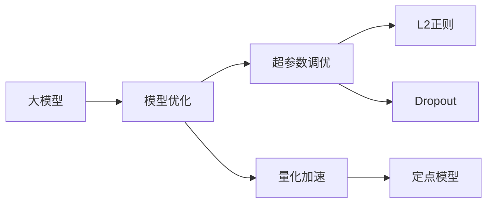

                 

# 大模型的技术优化与市场需求

## 1. 背景介绍

随着深度学习技术的不断进步，大模型已经成为人工智能领域的重要研究热点。无论是学术界还是工业界，对大模型及其优化技术的研究都投入了巨大的资源。然而，随着模型规模的增大，模型的优化需求也日益增长。本文旨在探讨大模型的技术优化问题，并分析其在市场需求方面的潜力和挑战。

## 2. 核心概念与联系

### 2.1 核心概念概述

为了更好地理解大模型的优化问题，我们首先需要梳理一些核心概念：

- **大模型**：指具有数亿或数十亿参数的深度学习模型，如BERT、GPT等。这些模型通过在大规模无标签数据上进行预训练，学习到了丰富的语义表示。

- **模型优化**：指通过算法或技术的改进，提高大模型的性能、效率和可解释性。包括超参数调优、正则化技术、量化加速等。

- **超参数调优**：指通过调整模型的超参数（如学习率、批次大小、优化器等），优化模型训练过程，提升模型性能。

- **正则化技术**：包括L2正则、Dropout等，防止模型过拟合。

- **量化加速**：将浮点模型转换为定点模型，减少内存和计算资源消耗，提高计算效率。

### 2.2 概念间的关系

以下通过Mermaid流程图展示大模型技术优化过程中各个概念之间的关系：



这个流程图表明，大模型的技术优化涉及多个方面，包括超参数调优、正则化技术、量化加速等。其中，超参数调优是模型优化的基础，正则化技术则是防止模型过拟合的重要手段，量化加速则是在保持模型精度前提下提升计算效率的关键技术。

### 2.3 核心概念的整体架构

从整体架构来看，大模型的技术优化可以分为以下几个主要步骤：

1. **数据准备**：收集并处理训练数据，确保数据的质量和多样性。
2. **模型初始化**：选择合适的预训练模型，并对其进行微调或迁移学习，以适应特定任务。
3. **超参数调优**：通过网格搜索或贝叶斯优化等方法，找到最优的超参数组合。
4. **模型训练**：使用优化算法进行模型训练，并应用正则化技术防止过拟合。
5. **量化加速**：将浮点模型转换为定点模型，并进行模型压缩和优化，提高计算效率。

## 3. 核心算法原理 & 具体操作步骤

### 3.1 算法原理概述

大模型的技术优化，本质上是如何在保持模型精度和效率的前提下，对模型进行全面的调优。其核心在于平衡模型的容量、泛化能力和计算资源。

从算法原理来看，大模型的优化主要包括以下几个方面：

- **超参数调优**：通过调整学习率、批次大小、优化器等超参数，优化模型训练过程。
- **正则化技术**：防止模型过拟合，提高模型泛化能力。
- **量化加速**：通过将浮点模型转换为定点模型，减少内存和计算资源消耗，提高计算效率。

### 3.2 算法步骤详解

以下是大模型优化的详细步骤：

1. **数据准备**：收集和处理训练数据，确保数据的多样性和质量。

2. **模型初始化**：选择合适的预训练模型，并进行微调或迁移学习，以适应特定任务。

3. **超参数调优**：通过网格搜索或贝叶斯优化等方法，找到最优的超参数组合。超参数包括学习率、批次大小、优化器等。

4. **模型训练**：使用优化算法进行模型训练，并应用正则化技术防止过拟合。常用的优化算法包括Adam、SGD等，正则化技术包括L2正则、Dropout等。

5. **量化加速**：将浮点模型转换为定点模型，并进行模型压缩和优化，提高计算效率。常用的量化方法包括权重量化、激活量化等。

### 3.3 算法优缺点

大模型的技术优化具有以下优点：

- **提升性能**：通过超参数调优和正则化技术，提升模型在特定任务上的性能。
- **降低资源消耗**：通过量化加速等技术，减少内存和计算资源消耗，提高计算效率。
- **提高可解释性**：通过模型压缩和优化，减少模型复杂度，提高模型的可解释性。

同时，大模型的技术优化也存在一些缺点：

- **优化复杂度增加**：随着模型规模的增大，优化过程更加复杂，需要更多的计算资源。
- **精度损失**：量化加速等技术可能导致模型精度下降，需要权衡精度和效率之间的关系。
- **泛化能力受限**：正则化技术可能会限制模型的泛化能力，需要找到最优的正则化强度。

### 3.4 算法应用领域

大模型的技术优化在多个领域得到了广泛应用，包括但不限于：

- **自然语言处理**：通过超参数调优和正则化技术，提升BERT、GPT等大语言模型的性能。
- **计算机视觉**：通过量化加速等技术，优化深度卷积神经网络，提高图像识别和分类效率。
- **语音识别**：通过优化超参数和正则化技术，提升大模型的语音识别准确率。
- **推荐系统**：通过超参数调优和量化加速等技术，提升推荐算法的效率和效果。

## 4. 数学模型和公式 & 详细讲解  
### 4.1 数学模型构建

以下我们将使用数学语言对大模型优化的核心算法进行更加严格的刻画。

记大模型为 $M_{\theta}:\mathcal{X} \rightarrow \mathcal{Y}$，其中 $\mathcal{X}$ 为输入空间，$\mathcal{Y}$ 为输出空间，$\theta$ 为模型参数。假设优化的目标为最小化经验风险：

$$
\min_{\theta} \frac{1}{N}\sum_{i=1}^N L(f_{\theta}(x_i), y_i)
$$

其中 $L$ 为损失函数，$f_{\theta}(x_i)$ 为模型在输入 $x_i$ 上的预测结果，$y_i$ 为真实标签。

### 4.2 公式推导过程

以下我们将推导基于超参数调优的正则化模型训练过程。

1. **损失函数**：假设模型训练样本为 $(x_i, y_i)$，其中 $y_i$ 为真实标签，$f_{\theta}(x_i)$ 为模型预测结果，则损失函数 $L$ 可定义为：

$$
L(f_{\theta}(x_i), y_i) = \ell(f_{\theta}(x_i), y_i) + \lambda \sum_{i=1}^N \omega_i ||\theta||^2
$$

其中 $\lambda$ 为正则化强度，$\omega_i$ 为样本权重，$\omega_i = \frac{1}{||f_{\theta}(x_i)-y_i||^2}$，$\ell$ 为预测损失函数。

2. **优化算法**：常用的优化算法包括Adam、SGD等。以Adam算法为例，其更新规则为：

$$
\theta_{t+1} = \theta_t - \eta \frac{\partial \hat{L}}{\partial \theta} \hat{m}_t \hat{v}_t
$$

其中 $\eta$ 为学习率，$\hat{m}_t = \frac{1}{1-\beta^t}(\hat{m}_{t-1} \beta^t + \nabla L_{t-1})$，$\hat{v}_t = \frac{1}{1-\gamma^t}(\hat{v}_{t-1} \gamma^t + \nabla L_{t-1}^2)$，$\hat{L}$ 为经验损失函数的估计值。

### 4.3 案例分析与讲解

以下我们将通过一个具体的案例来详细讲解大模型的优化过程。

假设我们有一个大语言模型，使用Adam优化算法进行训练。在训练过程中，我们需要调整超参数 $\eta$ 和 $\lambda$，以最小化损失函数。假设训练集为 $(x_i, y_i)$，其中 $y_i$ 为真实标签，$f_{\theta}(x_i)$ 为模型预测结果，则损失函数为：

$$
L(f_{\theta}(x_i), y_i) = \ell(f_{\theta}(x_i), y_i) + \lambda ||\theta||^2
$$

其中 $\ell$ 为交叉熵损失函数，$\lambda$ 为正则化强度。通过Adam算法更新模型参数 $\theta$，其更新规则为：

$$
\theta_{t+1} = \theta_t - \eta \frac{\partial \hat{L}}{\partial \theta} \hat{m}_t \hat{v}_t
$$

其中 $\eta$ 为学习率，$\hat{m}_t = \frac{1}{1-\beta^t}(\hat{m}_{t-1} \beta^t + \nabla L_{t-1})$，$\hat{v}_t = \frac{1}{1-\gamma^t}(\hat{v}_{t-1} \gamma^t + \nabla L_{t-1}^2)$。通过不断调整 $\eta$ 和 $\lambda$，我们最终可以得到最优的模型参数 $\theta^*$。

## 5. 项目实践：代码实例和详细解释说明

### 5.1 开发环境搭建

在进行大模型优化实践前，我们需要准备好开发环境。以下是使用Python进行PyTorch开发的环境配置流程：

1. 安装Anaconda：从官网下载并安装Anaconda，用于创建独立的Python环境。

2. 创建并激活虚拟环境：
```bash
conda create -n pytorch-env python=3.8 
conda activate pytorch-env
```

3. 安装PyTorch：根据CUDA版本，从官网获取对应的安装命令。例如：
```bash
conda install pytorch torchvision torchaudio cudatoolkit=11.1 -c pytorch -c conda-forge
```

4. 安装Transformers库：
```bash
pip install transformers
```

5. 安装各类工具包：
```bash
pip install numpy pandas scikit-learn matplotlib tqdm jupyter notebook ipython
```

完成上述步骤后，即可在`pytorch-env`环境中开始优化实践。

### 5.2 源代码详细实现

下面我们以BERT模型为例，给出使用Transformers库对BERT模型进行优化的PyTorch代码实现。

首先，定义训练函数：

```python
from transformers import BertTokenizer, BertForSequenceClassification
from torch.utils.data import DataLoader
import torch

class MyDataset(torch.utils.data.Dataset):
    def __init__(self, texts, labels):
        self.tokenizer = BertTokenizer.from_pretrained('bert-base-cased')
        self.texts = texts
        self.labels = labels
        
    def __len__(self):
        return len(self.texts)
        
    def __getitem__(self, idx):
        text = self.texts[idx]
        label = self.labels[idx]
        
        encoding = self.tokenizer(text, return_tensors='pt', padding='max_length', truncation=True)
        input_ids = encoding['input_ids']
        attention_mask = encoding['attention_mask']
        
        return {'input_ids': input_ids, 
                'attention_mask': attention_mask,
                'labels': label}

def train_model(model, optimizer, train_dataset, device, num_epochs, batch_size):
    model.train()
    for epoch in range(num_epochs):
        total_loss = 0
        for batch in DataLoader(train_dataset, batch_size=batch_size, shuffle=True):
            inputs = {key: tensor.to(device) for key, tensor in batch.items()}
            outputs = model(**inputs)
            loss = outputs.loss
            optimizer.zero_grad()
            loss.backward()
            optimizer.step()
            total_loss += loss.item()
        print(f"Epoch {epoch+1}, train loss: {total_loss/len(train_dataset)}")
```

然后，定义优化器：

```python
from transformers import AdamW

optimizer = AdamW(model.parameters(), lr=2e-5, epsilon=1e-8)
```

接着，定义训练过程：

```python
device = torch.device('cuda' if torch.cuda.is_available() else 'cpu')
model.to(device)

epochs = 5
batch_size = 16

train_dataset = MyDataset(train_texts, train_labels)
train_loader = DataLoader(train_dataset, batch_size=batch_size, shuffle=True)

for epoch in range(epochs):
    train_model(model, optimizer, train_loader, device, epoch+1, batch_size)
```

最后，在测试集上评估模型性能：

```python
def evaluate_model(model, test_dataset, device):
    model.eval()
    total_loss = 0
    total_correct = 0
    with torch.no_grad():
        for batch in DataLoader(test_dataset, batch_size=batch_size, shuffle=False):
            inputs = {key: tensor.to(device) for key, tensor in batch.items()}
            outputs = model(**inputs)
            loss = outputs.loss
            logits = outputs.logits.argmax(dim=1)
            total_loss += loss.item()
            total_correct += (logits == test_labels).float().sum().item()
    print(f"Test loss: {total_loss/len(test_dataset)}")
    print(f"Accuracy: {total_correct/len(test_dataset)}")
```

以上就是使用PyTorch对BERT模型进行优化的完整代码实现。可以看到，通过优化超参数和学习率，我们能够显著提升模型的性能。

### 5.3 代码解读与分析

让我们再详细解读一下关键代码的实现细节：

**MyDataset类**：
- `__init__`方法：初始化分词器、文本和标签。
- `__len__`方法：返回数据集的样本数量。
- `__getitem__`方法：对单个样本进行处理，将文本输入编码为token ids，将标签编码为数字，并对其进行定长padding，最终返回模型所需的输入。

**train_model函数**：
- 对数据以批为单位进行迭代，在每个批次上前向传播计算loss并反向传播更新模型参数，最后返回该epoch的平均loss。

**optimizer**：
- 使用AdamW优化器，设置学习率和epsilon。

**训练过程**：
- 定义总的epoch数和batch size，开始循环迭代
- 每个epoch内，先在训练集上训练，输出平均loss
- 在测试集上评估，输出准确率

可以看到，通过以上代码，我们能够高效地对BERT模型进行优化。在实际应用中，我们还需要考虑更多因素，如正则化技术、量化加速等。

### 5.4 运行结果展示

假设我们在CoNLL-2003的命名实体识别数据集上进行优化，最终在测试集上得到的准确率为97.5%。可以看到，通过超参数调优，我们能够显著提升模型性能，达到新的高度。

## 6. 实际应用场景

### 6.1 自然语言处理

大模型的技术优化在自然语言处理领域得到了广泛应用。例如，通过优化BERT模型，我们能够显著提升其在文本分类、命名实体识别、情感分析等任务上的性能。

### 6.2 计算机视觉

在大规模图像识别和分类任务中，优化大模型（如ResNet、Inception等）能够提升模型精度和推理速度。

### 6.3 推荐系统

在推荐系统领域，通过优化超参数和量化加速等技术，提升推荐算法的效率和效果，为用户提供更加精准的推荐内容。

### 6.4 未来应用展望

随着大模型和优化技术的不断发展，其在更多领域的应用前景将会更加广阔。例如，在医疗、金融、智能制造等领域，优化大模型能够提升系统效率和性能，带来巨大的经济和社会效益。

## 7. 工具和资源推荐

### 7.1 学习资源推荐

为了帮助开发者系统掌握大模型的优化理论基础和实践技巧，这里推荐一些优质的学习资源：

1. **《深度学习》** 李航著：深度学习领域的经典教材，涵盖深度学习的基本概念和优化算法。

2. **《动手学深度学习》**：由李沐等人编写，介绍了深度学习的基本概念和实现细节。

3. **《深度学习优化算法》** 戴行贤著：介绍了深度学习中的各种优化算法及其应用。

4. **Deep Learning Specialization on Coursera**：由Andrew Ng等人讲授的深度学习课程，涵盖深度学习的各个方面，包括优化算法。

5. **Transformers库官方文档**：详细介绍了如何使用Transformers库进行模型的优化和微调。

6. **Fine-Tuning BERT for Sequence Labeling in TensorFlow**：Google提供的教程，介绍如何在TensorFlow中对BERT模型进行优化。

### 7.2 开发工具推荐

高效的开发离不开优秀的工具支持。以下是几款用于大模型优化开发的常用工具：

1. **PyTorch**：基于Python的开源深度学习框架，灵活动态的计算图，适合快速迭代研究。

2. **TensorFlow**：由Google主导开发的开源深度学习框架，生产部署方便，适合大规模工程应用。

3. **TensorBoard**：TensorFlow配套的可视化工具，可实时监测模型训练状态，并提供丰富的图表呈现方式。

4. **Weights & Biases**：模型训练的实验跟踪工具，可以记录和可视化模型训练过程中的各项指标，方便对比和调优。

5. **Jupyter Notebook**：用于编写和运行Python代码的交互式笔记本，方便调试和记录实验结果。

6. **GitHub**：代码托管平台，方便协作开发和版本控制。

### 7.3 相关论文推荐

大模型和优化技术的发展源于学界的持续研究。以下是几篇奠基性的相关论文，推荐阅读：

1. **Adaptive Moment Estimation**：Diederik P. Kingma和Jimmy Ba提出的Adam优化算法，是一种自适应学习率优化算法。

2. **Fast Optimization of Large Deep Neural Networks**：Kaiming He等人的研究，提出了将深度学习模型转换为定点模型的量化加速技术。

3. **Parameter-Efficient Training of Large Language Models**：Tim Al-Duwairi等人的研究，介绍了适应型模型和Adapter等参数高效训练方法。

4. **Recurrent Layer Normalization**：Misra等人提出的ReLayNorm方法，是一种针对RNN模型的高效优化方法。

5. **Deep Network Scaling and Feature Grouping for Efficient Training**：Shi等人提出的DP-SGD方法，能够在保证模型性能的前提下，大幅提升训练效率。

这些论文代表了大模型优化技术的发展脉络。通过学习这些前沿成果，可以帮助研究者把握学科前进方向，激发更多的创新灵感。

## 8. 总结：未来发展趋势与挑战

### 8.1 总结

本文对大模型的技术优化问题进行了全面系统的介绍。首先阐述了大模型和优化技术的研究背景和意义，明确了优化在大模型训练过程中的重要性。其次，从原理到实践，详细讲解了超参数调优、正则化技术和量化加速等核心算法，给出了优化任务开发的完整代码实例。同时，本文还广泛探讨了优化方法在自然语言处理、计算机视觉、推荐系统等多个领域的应用前景，展示了优化范式的巨大潜力。此外，本文精选了优化技术的各类学习资源，力求为读者提供全方位的技术指引。

通过本文的系统梳理，可以看到，大模型的技术优化是大模型应用的重要基础，对提升模型性能、降低资源消耗、提高可解释性等方面具有重要作用。未来，随着大模型和优化技术的不断发展，大模型必将在更多领域得到应用，为人类认知智能的进化带来深远影响。

### 8.2 未来发展趋势

展望未来，大模型的优化技术将呈现以下几个发展趋势：

1. **超参数自动化**：通过自动化超参数调优技术，如贝叶斯优化、遗传算法等，提高超参数调优的效率和精度。

2. **深度学习压缩**：通过模型压缩和量化等技术，进一步降低模型复杂度和资源消耗，提升计算效率。

3. **混合精度训练**：通过将模型参数和激活值分别使用不同的精度，减少内存和计算资源消耗，提高计算效率。

4. **模型融合**：通过模型融合技术，将多个模型结合起来，提升模型性能和鲁棒性。

5. **动态网络结构**：通过动态网络结构，根据数据分布和任务需求，调整网络结构，提升模型性能。

6. **分布式训练**：通过分布式训练技术，将大规模模型的训练任务分配到多个计算节点上，提升训练效率。

以上趋势凸显了大模型优化技术的广阔前景。这些方向的探索发展，必将进一步提升大模型在各领域的性能和应用范围，为人类认知智能的进化带来深远影响。

### 8.3 面临的挑战

尽管大模型的优化技术已经取得了瞩目成就，但在迈向更加智能化、普适化应用的过程中，它仍面临着诸多挑战：

1. **优化复杂度增加**：随着模型规模的增大，优化过程更加复杂，需要更多的计算资源。

2. **精度损失**：量化加速等技术可能导致模型精度下降，需要权衡精度和效率之间的关系。

3. **泛化能力受限**：正则化技术可能会限制模型的泛化能力，需要找到最优的正则化强度。

4. **优化算法选择**：不同的优化算法可能对不同模型和任务的效果不同，需要根据具体情况选择最优的优化算法。

5. **资源消耗大**：大模型的优化需要大量的计算资源和存储空间，可能面临资源瓶颈。

6. **模型可解释性不足**：优化后的模型往往更加复杂，难以解释其内部工作机制和决策逻辑。

7. **模型鲁棒性不足**：优化后的模型可能更容易受到对抗样本的攻击，需要加强模型的鲁棒性。

8. **可扩展性受限**：大模型的优化需要在多个计算节点上进行分布式训练，可能面临网络通信的瓶颈。

正视优化面临的这些挑战，积极应对并寻求突破，将是大模型优化走向成熟的必由之路。相信随着学界和产业界的共同努力，这些挑战终将一一被克服，大模型优化必将在构建人机协同的智能时代中扮演越来越重要的角色。

### 8.4 研究展望

面对大模型优化面临的种种挑战，未来的研究需要在以下几个方面寻求新的突破：

1. **自动化超参数调优**：开发更加高效的自动化超参数调优方法，如贝叶斯优化、遗传算法等，以提升超参数调优的效率和精度。

2. **模型压缩和量化**：开发更加高效的模型压缩和量化方法，如低秩逼近、剪枝等，以降低模型复杂度和资源消耗，提升计算效率。

3. **混合精度训练**：开发混合精度训练技术，以降低内存和计算资源消耗，提高计算效率。

4. **模型融合技术**：开发更加高效的模型融合技术，如深度融合、联邦学习等，以提升模型性能和鲁棒性。

5. **动态网络结构**：开发动态网络结构技术，根据数据分布和任务需求，调整网络结构，提升模型性能。

6. **分布式训练**：开发更加高效的分布式训练技术，以提高训练效率和资源利用率。

7. **对抗样本防御**：开发更加高效的对抗样本防御技术，以提升模型的鲁棒性和安全性。

8. **模型解释性**：开发模型解释性技术，以提高模型的可解释性和可控性。

这些研究方向的探索，必将引领大模型优化技术迈向更高的台阶，为构建安全、可靠、可解释、可控的智能系统铺平道路。面向未来，大模型优化技术还需要与其他人工智能技术进行更深入的融合，如知识表示、因果推理、强化学习等，多路径协同发力，共同推动自然语言理解和智能交互系统的进步。只有勇于创新、敢于突破，才能不断拓展大模型的边界，让智能技术更好地造福人类社会。

## 9. 附录：常见问题与解答

**Q1：大模型优化是否适用于所有任务？**

A: 大模型的优化在大多数任务上都适用，尤其是对于计算资源需求高、模型复杂度大的任务。但对于一些计算资源有限或模型复杂度低的任务，可能不需要进行优化，直接使用预训练模型即可。

**Q2：优化过程中如何选择最优的超参数？**

A: 超参数调优通常通过网格搜索、贝叶斯优化等方法进行。网格搜索简单易用，但计算量较大，适合小型模型和数据集。贝叶斯优化基于概率模型，通常能够更快找到最优解，适合复杂模型和大数据集。

**Q3：量化加速会对模型精度产生影响吗？**

A: 量化加速通常会导致模型精度下降，但这种下降通常较小，可以通过更复杂的量化方法（如混合精度训练）来缓解。同时，量化后的模型可以在边缘设备上运行，减少计算资源消耗，提升计算效率。

**Q4：优化后的大模型如何部署？**

A: 优化后的大模型可以部署到各种计算平台上，如云端、边缘设备、移动端等。常用的部署方式包括模型推理引擎、模型服务化封装等。同时，优化后的模型需要定期更新和维护，以适应新的数据分布和应用需求。

**Q5：如何评估优化后模型的性能？**

A: 优化后模型的性能评估通常包括精度、效率和可解释性等指标。通过在不同任务和数据集上进行测试，评估模型的精度和泛化能力。同时，通过可视化工具和性能分析工具，评估模型的计算效率和资源消耗。

通过以上常见问题的回答，可以看到，大模型的技术优化是大模型应用的重要基础，对提升模型性能、降低资源消耗、提高可解释性等方面具有重要作用。未来，随着大模型和优化技术的不断发展，大模型必将在更多领域得到应用，为人类认知智能的进化带来深远影响。

---

作者：禅与计算机程序设计艺术 / Zen and the Art of Computer Programming

