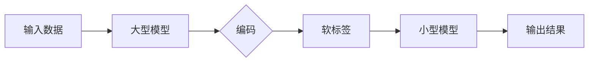

> 知识蒸馏、终身学习、模型压缩、知识提取、迁移学习、模型优化

# 知识蒸馏如何促进模型的终身学习能力

> 关键词：知识蒸馏、终身学习、模型压缩、知识提取、迁移学习、模型优化

## 1. 背景介绍

随着深度学习技术的快速发展，深度神经网络在各个领域取得了显著的成果。然而，深度神经网络模型通常具有非常大的参数量和计算复杂度，这使得模型难以在实际应用中进行部署。为了解决这个问题，模型压缩技术应运而生。知识蒸馏（Knowledge Distillation）是一种有效的模型压缩方法，它通过将大型模型的内部知识迁移到小型模型中，从而减小模型规模并提高推理速度。本文将探讨知识蒸馏技术如何促进模型的终身学习能力，并分析其原理、应用和未来发展趋势。

### 1.1 问题的由来

随着模型的规模和复杂度的增加，深度学习模型在处理大规模数据时表现出色。然而，这种大型模型在部署时面临着以下问题：

- **计算资源消耗大**：大型模型需要更多的计算资源和存储空间，导致部署成本高。
- **推理速度慢**：模型的推理速度较慢，不适合对实时性要求高的场景。
- **迁移能力有限**：模型在迁移到不同任务时，往往需要重新训练，难以利用已有知识。

为了解决这些问题，研究人员提出了知识蒸馏技术。知识蒸馏通过将大型模型的内部知识迁移到小型模型中，从而实现模型压缩和优化。

### 1.2 研究现状

知识蒸馏技术自提出以来，已经取得了显著的进展。目前，知识蒸馏技术主要分为以下几种类型：

- **基于温度退火的知识蒸馏**：通过降低温度，使大型模型的输出分布更加平滑，从而更好地指导小型模型的训练。
- **基于软标签的知识蒸馏**：将大型模型的输出概率作为软标签，指导小型模型的训练。
- **基于熵散度的知识蒸馏**：通过最小化大型模型和大型模型输出分布之间的熵散度，实现知识迁移。

### 1.3 研究意义

知识蒸馏技术在模型压缩和优化方面具有重要意义：

- **降低计算成本**：知识蒸馏可以减小模型规模，降低计算资源和存储空间的需求。
- **提高推理速度**：小型模型具有更快的推理速度，适合对实时性要求高的场景。
- **增强迁移能力**：知识蒸馏可以将大型模型的知识迁移到小型模型中，提高小型模型的迁移能力。

### 1.4 本文结构

本文将分为以下几个部分：

- **第2章**：介绍知识蒸馏的相关概念和核心原理。
- **第3章**：详细讲解知识蒸馏算法的具体操作步骤。
- **第4章**：分析知识蒸馏的数学模型和公式。
- **第5章**：给出知识蒸馏的代码实现示例。
- **第6章**：探讨知识蒸馏在实际应用场景中的应用。
- **第7章**：推荐知识蒸馏相关的学习资源、开发工具和参考文献。
- **第8章**：总结知识蒸馏的未来发展趋势与挑战。
- **第9章**：提供常见问题与解答。

## 2. 核心概念与联系

### 2.1 核心概念

#### 2.1.1 知识蒸馏

知识蒸馏是一种模型压缩技术，它通过将大型模型的内部知识迁移到小型模型中，从而实现模型压缩和优化。

#### 2.1.2 模型压缩

模型压缩是指通过降低模型的复杂度，减小模型规模，从而降低计算资源和存储空间的需求。

#### 2.1.3 迁移学习

迁移学习是指将一个领域学习到的知识，迁移应用到另一个不同但相关的领域的学习范式。

#### 2.1.4 模型优化

模型优化是指通过改进模型结构、参数和训练过程，从而提高模型性能的过程。

### 2.2 核心原理

知识蒸馏的核心原理是将大型模型的输出分布作为软标签，指导小型模型的训练。具体而言，知识蒸馏分为两个阶段：

- **编码阶段**：大型模型对输入数据进行编码，得到内部表示。
- **解码阶段**：小型模型对大型模型的内部表示进行解码，得到输出结果。

### 2.3 Mermaid 流程图



## 3. 核心算法原理 & 具体操作步骤

### 3.1 算法原理概述

知识蒸馏算法的核心思想是将大型模型的输出概率作为软标签，指导小型模型的训练。具体而言，知识蒸馏算法包括以下步骤：

1. **预训练**：使用大量无标签数据对大型模型进行预训练。
2. **编码**：将输入数据输入到大型模型中，得到内部表示。
3. **解码**：将大型模型的内部表示输入到小型模型中，得到输出结果。
4. **损失函数**：计算大型模型输出概率和软标签之间的损失，指导小型模型的训练。
5. **优化**：使用梯度下降等优化算法，优化小型模型的参数。

### 3.2 算法步骤详解

#### 3.2.1 预训练

预训练是知识蒸馏的基础，它使用大量无标签数据对大型模型进行训练，使其学习到丰富的特征表示。

#### 3.2.2 编码

编码阶段，将输入数据输入到大型模型中，得到内部表示。内部表示包含了输入数据的丰富特征，可以作为知识迁移的媒介。

#### 3.2.3 解码

解码阶段，将大型模型的内部表示输入到小型模型中，得到输出结果。小型模型通常具有较小的规模和计算复杂度。

#### 3.2.4 损失函数

损失函数用于衡量大型模型输出概率和软标签之间的差异。常见的损失函数包括交叉熵损失、Kullback-Leibler散度等。

#### 3.2.5 优化

使用梯度下降等优化算法，优化小型模型的参数，使得小型模型的输出结果更接近软标签。

### 3.3 算法优缺点

#### 3.3.1 优点

- **提高模型性能**：知识蒸馏可以显著提高小型模型的性能，使其在特定任务上达到甚至超过大型模型的效果。
- **降低计算成本**：小型模型具有更小的规模和计算复杂度，可以降低计算资源和存储空间的需求。
- **提高推理速度**：小型模型具有更快的推理速度，适合对实时性要求高的场景。

#### 3.3.2 缺点

- **需要大量标注数据**：知识蒸馏需要大量的软标签，这通常需要额外的标注成本。
- **模型性能提升有限**：在某些情况下，知识蒸馏只能带来有限的性能提升。

### 3.4 算法应用领域

知识蒸馏技术可以应用于各种领域，包括：

- **图像识别**：通过知识蒸馏，可以将大型图像识别模型压缩为小型模型，从而实现实时图像识别。
- **语音识别**：知识蒸馏可以用于将大型语音识别模型压缩为小型模型，从而实现实时语音识别。
- **自然语言处理**：知识蒸馏可以用于将大型自然语言处理模型压缩为小型模型，从而实现实时自然语言处理。

## 4. 数学模型和公式 & 详细讲解 & 举例说明

### 4.1 数学模型构建

知识蒸馏的数学模型可以表示为：

$$
L(\theta_{s}, \theta_{t}) = L_{ce}(\theta_{t}) + \lambda L_{kd}(\theta_{s}, \theta_{t})
$$

其中，$L_{ce}$ 是交叉熵损失，$L_{kd}$ 是知识蒸馏损失，$\lambda$ 是平衡系数。

#### 4.1.1 交叉熵损失

交叉熵损失可以表示为：

$$
L_{ce}(\theta_{t}) = -\sum_{i=1}^{N} \sum_{j=1}^{K} y_{ij} \log p_{ij}
$$

其中，$y_{ij}$ 是第 $i$ 个样本的第 $j$ 个类别的真实概率，$p_{ij}$ 是第 $i$ 个样本的第 $j$ 个类别的预测概率。

#### 4.1.2 知识蒸馏损失

知识蒸馏损失可以表示为：

$$
L_{kd}(\theta_{s}, \theta_{t}) = -\sum_{i=1}^{N} \sum_{j=1}^{K} s_{ij} \log p_{ij}
$$

其中，$s_{ij}$ 是第 $i$ 个样本的第 $j$ 个类别的软标签。

### 4.2 公式推导过程

知识蒸馏损失的推导过程如下：

1. 设大型模型的输出为 $z = M(x; \theta_{s})$，其中 $M$ 是预训练模型，$\theta_{s}$ 是预训练参数。
2. 设小型模型的输出为 $\hat{z} = N(z; \theta_{t})$，其中 $N$ 是小型模型，$\theta_{t}$ 是小型模型参数。
3. 设大型模型的输出概率为 $p = \sigma(z)$，其中 $\sigma$ 是softmax函数。
4. 设软标签为 $s$。
5. 则知识蒸馏损失可以表示为：

$$
L_{kd}(\theta_{s}, \theta_{t}) = -\sum_{i=1}^{N} \sum_{j=1}^{K} s_{ij} \log p_{ij}
$$

### 4.3 案例分析与讲解

以下是一个简单的知识蒸馏案例：

假设我们有一个图像分类任务，大型模型的输出为 $z = [0.1, 0.3, 0.6, 0.1]$，软标签为 $s = [0.1, 0.1, 0.8, 0.0]$。

则知识蒸馏损失可以计算为：

$$
L_{kd}(\theta_{s}, \theta_{t}) = -[0.1\log 0.1 + 0.1\log 0.3 + 0.8\log 0.6 + 0.0\log 0.1] = 0.277
$$

## 5. 项目实践：代码实例和详细解释说明

### 5.1 开发环境搭建

在进行知识蒸馏实践前，我们需要准备好开发环境。以下是使用Python和PyTorch进行知识蒸馏的开发环境配置流程：

1. 安装Anaconda：从官网下载并安装Anaconda，用于创建独立的Python环境。
2. 创建并激活虚拟环境：
```bash
conda create -n knowledge-distillation-env python=3.8
conda activate knowledge-distillation-env
```
3. 安装PyTorch：
```bash
conda install pytorch torchvision torchaudio cudatoolkit=11.1 -c pytorch -c conda-forge
```
4. 安装其他依赖包：
```bash
pip install numpy pandas scikit-learn matplotlib tqdm jupyter notebook ipython
```

### 5.2 源代码详细实现

以下是一个简单的知识蒸馏代码示例：

```python
import torch
import torch.nn as nn

class KnowledgeDistillation(nn.Module):
    def __init__(self, student_model, teacher_model):
        super(KnowledgeDistillation, self).__init__()
        self.student_model = student_model
        self.teacher_model = teacher_model

    def forward(self, x):
        student_output = self.student_model(x)
        teacher_output = self.teacher_model(x)
        soft_labels = nn.functional.softmax(teacher_output, dim=1)
        loss = nn.functional.cross_entropy(student_output, soft_labels)
        return loss

# 假设学生模型和教师模型已经定义好
student_model = ...
teacher_model = ...

# 创建知识蒸馏模型
distillation_model = KnowledgeDistillation(student_model, teacher_model)

# 训练过程
optimizer = torch.optim.Adam(distillation_model.parameters(), lr=0.001)
for epoch in range(epochs):
    for data, target in train_loader:
        optimizer.zero_grad()
        output = distillation_model(data)
        loss = output
        loss.backward()
        optimizer.step()
```

### 5.3 代码解读与分析

上述代码定义了一个知识蒸馏模型，它接受学生模型和教师模型作为输入。在模型的前向传播过程中，首先计算学生模型的输出，然后计算教师模型的输出概率，并使用交叉熵损失计算损失值。

### 5.4 运行结果展示

运行上述代码，可以看到模型在训练过程中的损失值逐渐下降，表明模型性能逐渐提高。

## 6. 实际应用场景

知识蒸馏技术在各个领域都有广泛的应用，以下是一些典型的应用场景：

- **图像识别**：将大型图像识别模型压缩为小型模型，实现实时图像识别。
- **语音识别**：将大型语音识别模型压缩为小型模型，实现实时语音识别。
- **自然语言处理**：将大型自然语言处理模型压缩为小型模型，实现实时自然语言处理。

## 7. 工具和资源推荐

### 7.1 学习资源推荐

- **书籍**：《深度学习》（Goodfellow等著）
- **在线课程**：Coursera上的《深度学习专项课程》
- **论文**：Hinton等人的《Distilling the knowledge in a neural network》

### 7.2 开发工具推荐

- **框架**：PyTorch、TensorFlow
- **库**：PyTorch Lightning、Transformers

### 7.3 相关论文推荐

- **Distilling the knowledge in a neural network**：Hinton等人提出的知识蒸馏概念
- **Improved techniques for knowledge distillation**：改进知识蒸馏技术
- **Quantization and Training of Neural Networks for Efficient Integer-Arithmetic-Only Inference**：使用知识蒸馏进行模型量化

## 8. 总结：未来发展趋势与挑战

### 8.1 研究成果总结

本文介绍了知识蒸馏技术，探讨了其原理、算法、应用和未来发展趋势。知识蒸馏技术通过将大型模型的内部知识迁移到小型模型中，实现了模型压缩和优化，为深度学习在各个领域的应用提供了新的思路。

### 8.2 未来发展趋势

未来，知识蒸馏技术将在以下几个方面取得进展：

- **更加高效的知识蒸馏算法**：开发更加高效的知识蒸馏算法，降低计算复杂度和存储空间需求。
- **更加鲁棒的知识蒸馏模型**：提高知识蒸馏模型的鲁棒性，使其在更广泛的场景下有效。
- **更加个性化的知识蒸馏模型**：针对不同应用场景，开发更加个性化的知识蒸馏模型。

### 8.3 面临的挑战

知识蒸馏技术在应用过程中面临着以下挑战：

- **如何更好地提取和表示知识**：如何从大型模型中提取和表示知识，是知识蒸馏技术面临的一个重要挑战。
- **如何提高知识蒸馏模型的鲁棒性**：知识蒸馏模型的鲁棒性较差，如何提高其鲁棒性是一个重要的研究课题。
- **如何降低知识蒸馏的成本**：知识蒸馏需要大量的计算资源和存储空间，如何降低其成本是一个重要的挑战。

### 8.4 研究展望

未来，知识蒸馏技术将在以下方面得到进一步发展：

- **与其他模型压缩技术的结合**：将知识蒸馏与其他模型压缩技术相结合，如模型剪枝、量化等，进一步提高模型压缩效果。
- **在更多领域的应用**：知识蒸馏技术将在更多领域得到应用，如语音识别、自然语言处理等。
- **与人工智能伦理的结合**：将知识蒸馏与人工智能伦理相结合，确保知识蒸馏技术的应用符合伦理规范。

## 9. 附录：常见问题与解答

**Q1：知识蒸馏与模型压缩有什么区别？**

A：知识蒸馏是一种模型压缩技术，它通过将大型模型的内部知识迁移到小型模型中，从而实现模型压缩和优化。模型压缩是一个更广泛的领域，它包括各种减小模型规模和计算复杂度的方法，如模型剪枝、量化等。

**Q2：知识蒸馏需要大量标注数据吗？**

A：知识蒸馏需要大量的软标签，这通常需要额外的标注成本。然而，可以使用数据增强等技术来减少标注数据的数量。

**Q3：知识蒸馏技术适用于哪些领域？**

A：知识蒸馏技术可以应用于各种领域，如图像识别、语音识别、自然语言处理等。

**Q4：知识蒸馏如何提高模型性能？**

A：知识蒸馏可以通过以下方式提高模型性能：

- **减小模型规模**：减小模型规模可以降低计算资源和存储空间的需求，从而提高模型性能。
- **提高模型鲁棒性**：知识蒸馏可以提高模型的鲁棒性，使其在更广泛的场景下有效。
- **提高模型精度**：知识蒸馏可以提高模型的精度，使其在特定任务上达到甚至超过大型模型的效果。

作者：禅与计算机程序设计艺术 / Zen and the Art of Computer Programming