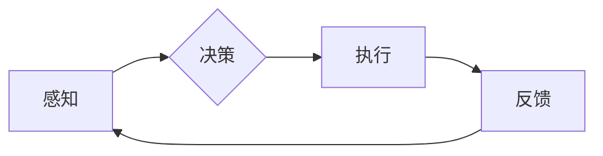

# 神经网络在机器人控制中的应用

> 关键词：神经网络，机器人控制，深度学习，机器学习，自适应控制，强化学习，机器人编程，控制算法

## 1. 背景介绍

机器人控制是自动化技术中的重要分支，它涉及到如何使机器人能够感知环境、做出决策并执行动作。随着计算机科学和人工智能技术的快速发展，特别是深度学习技术的突破，神经网络在机器人控制领域的应用日益广泛。本文将探讨神经网络在机器人控制中的应用，分析其原理、算法、实现方式及其未来发展趋势。

### 1.1 问题的由来

传统的机器人控制主要依赖于经典的控制理论，如PID控制、模糊控制等。这些方法在许多情况下能够有效地控制机器人，但随着机器人任务的复杂性增加，如路径规划、人机交互、动态环境适应等，传统的控制方法逐渐显露出其局限性。

### 1.2 研究现状

近年来，深度学习技术，尤其是神经网络，为机器人控制领域带来了新的突破。通过在大量的数据上进行训练，神经网络能够学习到复杂的控制策略，从而实现更高级的机器人控制功能。

### 1.3 研究意义

神经网络在机器人控制中的应用具有重要意义：
- 提高控制精度和效率。
- 增强机器人对复杂环境的适应能力。
- 实现更自然的人机交互。
- 降低对专家知识的依赖。

### 1.4 本文结构

本文将分为以下几个部分：
- 核心概念与联系
- 核心算法原理与步骤
- 数学模型与公式
- 项目实践
- 实际应用场景
- 工具和资源推荐
- 总结与展望
- 常见问题与解答

## 2. 核心概念与联系

### 2.1 核心概念

- **神经网络**：一种模拟人脑神经元结构的计算模型，通过调整连接权重来学习数据中的复杂模式。
- **机器学习**：通过算法和统计模型，使计算机系统能够利用数据学习并做出决策。
- **深度学习**：一种特殊的机器学习方法，使用深层神经网络来学习数据的高级特征。
- **机器人控制**：使机器人能够执行特定任务的过程，包括感知、决策和执行。

### 2.2 Mermaid 流程图



### 2.3 核心概念联系

神经网络是机器学习和深度学习的基础，它们用于处理和解释数据。在机器人控制中，神经网络可以用于感知模块、决策模块和执行模块，形成一个闭环控制系统。

## 3. 核心算法原理 & 具体操作步骤

### 3.1 算法原理概述

神经网络在机器人控制中的应用主要包括以下几种方法：

- **监督学习**：使用标注数据进行训练，如卷积神经网络(CNN)用于视觉识别。
- **无监督学习**：使用未标注数据进行训练，如自编码器用于特征提取。
- **强化学习**：通过试错和奖励来学习策略，如深度Q网络(DQN)用于路径规划。

### 3.2 算法步骤详解

1. **数据收集**：收集机器人控制所需的数据，包括传感器数据、执行器数据等。
2. **模型选择**：根据任务需求选择合适的神经网络模型。
3. **模型训练**：使用收集到的数据训练神经网络模型。
4. **模型评估**：评估模型的性能，并根据需要进行调整。
5. **模型部署**：将训练好的模型部署到机器人中。

### 3.3 算法优缺点

**优点**：
- 能够处理高维、非线性问题。
- 能够学习到复杂的控制策略。
- 能够适应复杂环境的变化。

**缺点**：
- 需要大量的训练数据。
- 训练过程可能需要很长时间。
- 模型的可解释性较差。

### 3.4 算法应用领域

- **路径规划**：机器人能够在未知环境中找到从起点到终点的最优路径。
- **动作规划**：机器人能够执行复杂的动作，如抓取物体。
- **人机交互**：机器人能够理解人类的指令并做出相应的动作。

## 4. 数学模型和公式 & 详细讲解 & 举例说明

### 4.1 数学模型构建

神经网络可以用以下公式表示：

$$
y = f(W \cdot x + b)
$$

其中，$y$ 是输出，$x$ 是输入，$W$ 是权重，$b$ 是偏置，$f$ 是激活函数。

### 4.2 公式推导过程

神经网络的推导过程涉及到微积分和线性代数等数学知识，这里不再详细展开。

### 4.3 案例分析与讲解

以卷积神经网络(CNN)为例，它通常用于图像识别任务。CNN由多个卷积层和池化层组成，每个卷积层学习图像的特征，池化层用于降低特征的空间维度。

## 5. 项目实践：代码实例和详细解释说明

### 5.1 开发环境搭建

为了实现神经网络在机器人控制中的应用，我们需要以下开发环境：

- 编程语言：Python
- 深度学习框架：TensorFlow或PyTorch
- 机器人平台：ROS（Robot Operating System）

### 5.2 源代码详细实现

以下是一个使用TensorFlow和ROS实现机器人路径规划的简单示例：

```python
# 导入必要的库
import rospy
import tf
from nav_msgs.msg import Odometry
from geometry_msgs.msg import Pose2D

# 定义一个回调函数，用于处理机器人的位置信息
def callback(data):
    # 解析位置信息
    x, y, theta = data.pose.pose.position.x, data.pose.pose.position.y, data.pose.pose.orientation.z
    # 计算目标位置
    goal_x, goal_y = 1.0, 1.0
    # 计算目标方向
    goal_theta = tf.transformations.euler_from_quaternion([0, 0, theta])[2]
    # ... (省略路径规划算法实现)
    # 发送控制命令
    # ...

# 初始化ROS节点
rospy.init_node('robot_control')

# 订阅位置信息
sub = rospy.Subscriber('/odom', Odometry, callback)

# 保持节点运行
rospy.spin()
```

### 5.3 代码解读与分析

这段代码使用ROS订阅了机器人的位置信息，并定义了一个回调函数来处理这些信息。在回调函数中，我们解析了机器人的位置信息，计算了目标位置和方向，然后可以使用路径规划算法计算出到达目标位置的路径。最后，我们可以发送控制命令来控制机器人的运动。

### 5.4 运行结果展示

运行上述代码后，机器人将根据路径规划算法计算出的路径进行移动，直到到达目标位置。

## 6. 实际应用场景

### 6.1 路径规划

路径规划是机器人控制中的一项基本任务，神经网络可以用于解决路径规划问题。例如，使用CNN来识别地图中的障碍物，使用RNN来规划到达目标的最短路径。

### 6.2 动作规划

动作规划是机器人控制中的另一个重要任务，神经网络可以用于学习复杂的动作序列。例如，使用深度学习来控制机械臂抓取物体，或者使用强化学习来训练机器人完成特定的任务。

### 6.3 人机交互

神经网络可以用于实现自然的人机交互。例如，使用语音识别技术将人类的语音转化为机器人的指令，或者使用图像识别技术来理解人类的表情和手势。

## 7. 工具和资源推荐

### 7.1 学习资源推荐

- 《深度学习》：Goodfellow、Bengio和Courville合著，是深度学习的经典教材。
- 《Python机器学习》：Seabold和Perera合著，介绍了Python在机器学习中的应用。

### 7.2 开发工具推荐

- TensorFlow：Google开发的深度学习框架。
- PyTorch：Facebook开发的深度学习框架。
- ROS：Robot Operating System，是一个用于机器人开发的操作系统。

### 7.3 相关论文推荐

- "Deep Reinforcement Learning for Autonomous Navigation" by Marthi, Saxena, and Ng
- "A Deep Neural Network for Image Recognition" by Krizhevsky, Sutskever, and Hinton
- "Learning to Drive by Playing a Video Game" by Silver, Schrittwieser, Simonyan, Antonoglou, Huang et al.

## 8. 总结：未来发展趋势与挑战

### 8.1 研究成果总结

神经网络在机器人控制领域的应用取得了显著成果，为机器人控制带来了新的可能性。

### 8.2 未来发展趋势

- **多模态学习**：结合视觉、听觉、触觉等多模态信息，提高机器人的感知能力。
- **强化学习**：使用强化学习技术，使机器人能够自主学习和适应新环境。
- **迁移学习**：使用迁移学习技术，提高机器人的泛化能力。

### 8.3 面临的挑战

- **数据收集**：需要收集大量的数据来训练神经网络模型。
- **计算资源**：神经网络模型需要大量的计算资源来训练和运行。
- **模型可解释性**：神经网络模型的可解释性较差，难以理解其决策过程。

### 8.4 研究展望

随着技术的不断发展，神经网络在机器人控制领域的应用将会更加广泛，为机器人技术的发展带来新的突破。

## 9. 附录：常见问题与解答

**Q1：神经网络在机器人控制中有什么优势？**

A1：神经网络在机器人控制中的优势包括：
- 能够处理高维、非线性问题。
- 能够学习到复杂的控制策略。
- 能够适应复杂环境的变化。

**Q2：如何选择合适的神经网络模型？**

A2：选择合适的神经网络模型需要考虑以下因素：
- 任务类型：不同的任务需要不同的模型。
- 数据类型：不同的数据类型需要不同的模型。
- 计算资源：不同的模型需要不同的计算资源。

**Q3：神经网络在机器人控制中会遇到哪些挑战？**

A3：神经网络在机器人控制中会遇到以下挑战：
- 数据收集：需要收集大量的数据来训练神经网络模型。
- 计算资源：神经网络模型需要大量的计算资源来训练和运行。
- 模型可解释性：神经网络模型的可解释性较差，难以理解其决策过程。

作者：禅与计算机程序设计艺术 / Zen and the Art of Computer Programming