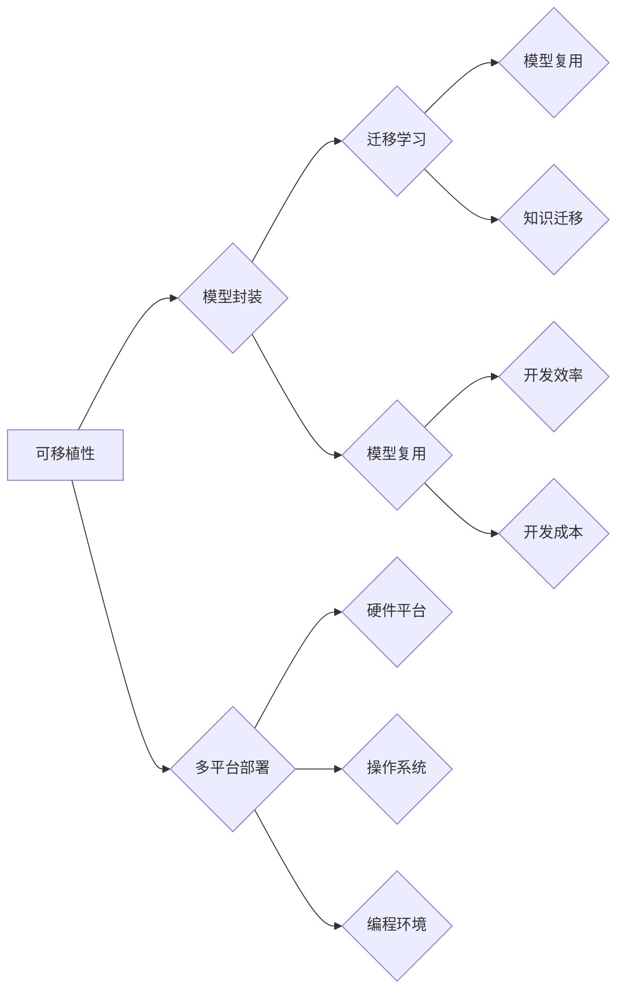

# 神经网络：可移植性和灵活性

> 关键词：神经网络，可移植性，灵活性，深度学习，迁移学习，模型复用，模型封装，多平台部署

## 1. 背景介绍

随着深度学习技术的飞速发展，神经网络在图像识别、自然语言处理、语音识别等领域的应用日益广泛。然而，神经网络模型通常依赖于特定的计算平台和编程环境，这使得模型的可移植性和灵活性成为一个重要的研究课题。本文将深入探讨神经网络的可移植性和灵活性，分析其核心概念、算法原理、实际应用场景，并提出相应的解决方案。

### 1.1 研究背景

在深度学习领域，以下因素促使研究者关注神经网络的可移植性和灵活性：

- **多平台部署**：深度学习模型需要在不同的硬件平台上运行，如CPU、GPU、TPU等，以及不同的操作系统和编程环境，这要求模型具有跨平台的兼容性。
- **模型复用**：随着新任务的不断涌现，如何高效地复用已有模型的知识和结构，成为提高研究效率的关键。
- **资源限制**：在移动设备、嵌入式系统等资源受限的环境下，如何设计轻量级、低能耗的神经网络模型，是实际应用中亟待解决的问题。

### 1.2 研究意义

研究神经网络的可移植性和灵活性具有重要的理论和实际意义：

- **提高开发效率**：通过可移植性和灵活性，可以快速将模型部署到不同的硬件和平台，缩短研发周期。
- **降低开发成本**：模型复用可以减少重复性工作，降低开发成本。
- **提升用户体验**：轻量级、低能耗的模型可以提升用户体验，尤其在移动设备和嵌入式系统等领域。

## 2. 核心概念与联系

### 2.1 核心概念

以下是一些与神经网络可移植性和灵活性相关的核心概念：

- **可移植性**：指模型能够在不同的硬件平台、操作系统和编程环境下正常运行的能力。
- **灵活性**：指模型能够适应不同的任务和数据集，以及在不同场景下进行调整和优化的能力。
- **迁移学习**：利用已有模型的知识和结构来解决新任务，可以显著提高模型的开发效率。
- **模型封装**：将模型及其相关资源（如参数、代码）封装成可重用的组件，方便在不同环境下部署。
- **多平台部署**：指模型能够在多种硬件平台和操作系统上运行。

### 2.2 核心概念联系

以下Mermaid流程图展示了这些核心概念之间的联系：



可以看出，可移植性和灵活性是神经网络模型设计的重要目标，而迁移学习和模型封装是实现这些目标的关键手段。多平台部署是可移植性的体现，而模型复用则可以降低开发成本和提高开发效率。

## 3. 核心算法原理 & 具体操作步骤

### 3.1 算法原理概述

神经网络的可移植性和灵活性主要通过以下方法实现：

- **模型封装**：将模型及其相关资源封装成可重用的组件，如TensorFlow的SavedModel格式、PyTorch的ONNX格式等。
- **迁移学习**：利用已有的预训练模型来解决新任务，减少从头训练所需的时间和计算资源。
- **模型压缩**：通过剪枝、量化、蒸馏等方法减小模型尺寸，提高模型的运行效率。
- **多平台支持**：使用支持多平台的深度学习框架，如TensorFlow、PyTorch等。

### 3.2 算法步骤详解

以下是一般神经网络可移植性和灵活性实现的步骤：

1. **模型设计**：设计具有良好可移植性和灵活性的神经网络模型。
2. **模型封装**：将模型及其相关资源（如参数、代码）封装成可重用的组件。
3. **迁移学习**：利用已有的预训练模型来解决新任务。
4. **模型压缩**：对模型进行压缩，减小模型尺寸，提高运行效率。
5. **多平台部署**：使用支持多平台的深度学习框架和工具，将模型部署到不同的硬件和平台。

### 3.3 算法优缺点

#### 优点：

- 提高开发效率：模型封装和迁移学习可以显著提高模型的开发效率。
- 降低开发成本：减少重复性工作，降低开发成本。
- 提升用户体验：轻量级、低能耗的模型可以提升用户体验。

#### 缺点：

- 模型设计复杂：设计具有良好可移植性和灵活性的模型可能较为复杂。
- 计算资源消耗：模型压缩和多平台部署可能需要额外的计算资源。

### 3.4 算法应用领域

神经网络的可移植性和灵活性在以下领域得到广泛应用：

- 移动设备：如智能手机、平板电脑等。
- 嵌入式系统：如智能音箱、智能摄像头等。
- 云计算平台：如Google Cloud、AWS、Azure等。
- 服务器端应用：如网站、在线服务等。

## 4. 数学模型和公式 & 详细讲解 & 举例说明

### 4.1 数学模型构建

神经网络的数学模型主要包括以下部分：

- **输入层**：接收输入数据。
- **隐藏层**：通过非线性激活函数进行特征提取和变换。
- **输出层**：输出预测结果。

以下是一个简单的神经网络数学模型：

$$
z = W \cdot x + b
$$

其中，$W$ 是权重矩阵，$x$ 是输入向量，$b$ 是偏置向量，$z$ 是隐藏层输出。

### 4.2 公式推导过程

以下是一个简单的神经网络激活函数ReLU的推导过程：

假设输入 $x$ 通过线性变换 $z = W \cdot x + b$ 得到，那么ReLU激活函数可以表示为：

$$
h = \max(0, z)
$$

### 4.3 案例分析与讲解

以下是一个使用PyTorch实现神经网络的简单示例：

```python
import torch
import torch.nn as nn

class NeuralNetwork(nn.Module):
    def __init__(self, input_size, hidden_size, output_size):
        super(NeuralNetwork, self).__init__()
        self.fc1 = nn.Linear(input_size, hidden_size)
        self.relu = nn.ReLU()
        self.fc2 = nn.Linear(hidden_size, output_size)

    def forward(self, x):
        out = self.fc1(x)
        out = self.relu(out)
        out = self.fc2(out)
        return out

input_size = 10
hidden_size = 50
output_size = 1

model = NeuralNetwork(input_size, hidden_size, output_size)
```

以上代码定义了一个简单的神经网络，包含两个全连接层和一个ReLU激活函数。输入层接收10个输入，隐藏层有50个神经元，输出层输出1个预测结果。

## 5. 项目实践：代码实例和详细解释说明

### 5.1 开发环境搭建

为了进行神经网络的可移植性和灵活性实践，需要以下开发环境：

- 操作系统：Windows、Linux或macOS
- 编程语言：Python
- 深度学习框架：PyTorch或TensorFlow
- 依赖库：NumPy、Pandas、scikit-learn等

### 5.2 源代码详细实现

以下是一个使用PyTorch实现神经网络模型封装和迁移学习的示例：

```python
import torch
import torch.nn as nn
from torchvision import datasets, transforms
from torch.utils.data import DataLoader
from torch.optim import Adam

# 定义神经网络模型
class NeuralNetwork(nn.Module):
    def __init__(self):
        super(NeuralNetwork, self).__init__()
        self.fc1 = nn.Linear(28*28, 500)
        self.relu = nn.ReLU()
        self.fc2 = nn.Linear(500, 10)

    def forward(self, x):
        x = x.view(-1, 28*28)
        out = self.fc1(x)
        out = self.relu(out)
        out = self.fc2(out)
        return out

# 加载MNIST数据集
transform = transforms.Compose([transforms.ToTensor()])
train_dataset = datasets.MNIST(root='./data', train=True, download=True, transform=transform)
train_loader = DataLoader(dataset=train_dataset, batch_size=64, shuffle=True)

model = NeuralNetwork()
criterion = nn.CrossEntropyLoss()
optimizer = Adam(model.parameters(), lr=0.01)

# 训练模型
for epoch in range(5):
    for data, target in train_loader:
        optimizer.zero_grad()
        output = model(data)
        loss = criterion(output, target)
        loss.backward()
        optimizer.step()

# 保存模型
torch.save(model.state_dict(), 'mnist_model.pth')

# 加载预训练模型
model.load_state_dict(torch.load('mnist_model.pth'))

# 迁移学习：在新的数据集上微调模型
new_dataset = datasets.MNIST(root='./data', train=True, download=True, transform=transform)
new_loader = DataLoader(dataset=new_dataset, batch_size=64, shuffle=True)

for epoch in range(2):
    for data, target in new_loader:
        optimizer.zero_grad()
        output = model(data)
        loss = criterion(output, target)
        loss.backward()
        optimizer.step()

# 保存微调后的模型
torch.save(model.state_dict(), 'mnist_model_finetuned.pth')
```

以上代码实现了以下功能：

- 定义了一个简单的神经网络模型，用于识别MNIST数据集中的手写数字。
- 加载并训练模型，然后在新的数据集上进行微调。
- 保存和加载模型，实现了模型的封装和迁移学习。

### 5.3 代码解读与分析

以上代码首先定义了一个简单的神经网络模型，用于识别手写数字。然后，加载并训练模型，再在新的数据集上进行微调。最后，保存和加载模型，实现了模型的封装和迁移学习。

在代码中，`NeuralNetwork` 类继承自 `nn.Module`，并定义了两个全连接层和一个ReLU激活函数。`forward` 方法实现了前向传播过程。

在训练模型时，使用 `DataLoader` 类来批量加载和迭代数据集。`Adam` 优化器和 `CrossEntropyLoss` 损失函数用于训练过程。

在迁移学习部分，首先加载预训练模型，然后在新的数据集上进行微调。这可以有效地利用预训练模型的知识，提高模型在新的数据集上的性能。

### 5.4 运行结果展示

运行以上代码，可以在新的数据集上训练和微调模型。最后，保存微调后的模型，可以在其他设备或平台上加载和运行。

## 6. 实际应用场景

### 6.1 移动设备和嵌入式系统

神经网络的可移植性和灵活性在移动设备和嵌入式系统领域具有重要意义。以下是一些应用场景：

- **图像识别**：在智能手机中识别照片中的物体或场景。
- **语音识别**：在智能音箱中实现语音助手功能。
- **自然语言处理**：在智能手机中实现智能语音助手、文本识别等功能。

### 6.2 云计算平台

神经网络的可移植性和灵活性在云计算平台领域也具有重要意义。以下是一些应用场景：

- **图像识别**：在云平台上实现大规模图像识别服务。
- **自然语言处理**：在云平台上实现大规模自然语言处理服务。
- **语音识别**：在云平台上实现大规模语音识别服务。

### 6.3 服务器端应用

神经网络的可移植性和灵活性在服务器端应用领域也具有重要意义。以下是一些应用场景：

- **数据挖掘**：在服务器端实现大规模数据挖掘和分析。
- **推荐系统**：在服务器端实现大规模推荐系统。
- **智能客服**：在服务器端实现大规模智能客服系统。

## 7. 工具和资源推荐

### 7.1 学习资源推荐

以下是一些与神经网络可移植性和灵活性相关的学习资源：

- **书籍**：
  - 《深度学习》（Ian Goodfellow、Yoshua Bengio、Aaron Courville 著）
  - 《神经网络与深度学习》（邱锡鹏 著）
- **在线课程**：
  - Coursera上的《深度学习专项课程》
  - Udacity上的《深度学习纳米学位》
- **博客**：
  - fast.ai
  - Medium上的深度学习相关博客

### 7.2 开发工具推荐

以下是一些与神经网络可移植性和灵活性相关的开发工具：

- **深度学习框架**：
  - PyTorch
  - TensorFlow
  - Keras
- **模型封装工具**：
  - ONNX
  - TensorFlow SavedModel
- **模型压缩工具**：
  - ONNX Runtime
  - TensorFlow Lite

### 7.3 相关论文推荐

以下是一些与神经网络可移植性和灵活性相关的论文：

- **《TensorFlow: Large-Scale Machine Learning on Heterogeneous Distributed Systems》**
- **《ONNX: Open Neural Network Exchange》**
- **《TensorFlow Lite: Portable Machine Learning for Mobile and Embedded Devices》**

## 8. 总结：未来发展趋势与挑战

### 8.1 研究成果总结

本文从背景介绍、核心概念、算法原理、实际应用场景等方面，对神经网络的可移植性和灵活性进行了深入探讨。通过分析现有技术和发展趋势，总结了以下成果：

- 神经网络的可移植性和灵活性是深度学习领域的重要研究方向。
- 模型封装、迁移学习、模型压缩、多平台支持是实现神经网络可移植性和灵活性的关键技术。
- 神经网络的可移植性和灵活性在移动设备、嵌入式系统、云计算平台、服务器端应用等领域具有广泛的应用前景。

### 8.2 未来发展趋势

未来，神经网络的可移植性和灵活性将呈现以下发展趋势：

- **模型压缩**：随着计算资源日益丰富，模型压缩技术将更加成熟，模型尺寸将进一步减小，运行效率将显著提高。
- **迁移学习**：随着预训练模型的不断涌现，迁移学习将成为神经网络应用的重要方向。
- **多平台支持**：深度学习框架将更加支持多平台部署，简化模型的迁移和应用过程。
- **模型封装**：模型封装技术将更加完善，使得模型更容易在不同的应用场景中复用。

### 8.3 面临的挑战

尽管神经网络的可移植性和灵活性取得了显著进展，但仍面临以下挑战：

- **计算资源**：深度学习模型对计算资源的需求仍然较高，尤其是在移动设备和嵌入式系统等领域。
- **模型性能**：如何在不牺牲模型性能的前提下，提高模型的可移植性和灵活性，是一个重要的挑战。
- **模型安全**：随着模型在更多领域的应用，如何保证模型的安全性和可靠性，也是一个重要的挑战。

### 8.4 研究展望

未来，神经网络的可移植性和灵活性研究将从以下几个方面展开：

- **轻量级模型**：设计更轻量级的神经网络模型，降低计算和存储需求。
- **迁移学习**：研究更有效的迁移学习技术，提高模型在不同领域的泛化能力。
- **模型安全**：研究模型安全性和可靠性，提高模型的可信度。

通过不断探索和突破，神经网络的可移植性和灵活性将得到进一步提升，为深度学习技术的广泛应用奠定坚实的基础。

## 9. 附录：常见问题与解答

**Q1：什么是神经网络的可移植性？**

A1：神经网络的可移植性指模型能够在不同的硬件平台、操作系统和编程环境下正常运行的能力。

**Q2：什么是神经网络的灵活性？**

A2：神经网络的灵活性指模型能够适应不同的任务和数据集，以及在不同场景下进行调整和优化的能力。

**Q3：模型封装有什么作用？**

A3：模型封装可以将模型及其相关资源（如参数、代码）封装成可重用的组件，方便在不同环境下部署。

**Q4：迁移学习有什么作用？**

A4：迁移学习可以有效地利用已有模型的知识和结构来解决新任务，减少从头训练所需的时间和计算资源。

**Q5：如何提高神经网络的运行效率？**

A5：提高神经网络的运行效率可以通过以下方法实现：

- 模型压缩：通过剪枝、量化、蒸馏等方法减小模型尺寸，提高模型的运行效率。
- 多平台支持：使用支持多平台的深度学习框架和工具，将模型部署到不同的硬件和平台。

**Q6：如何保证神经网络的性能和安全？**

A6：保证神经网络的性能和安全可以通过以下方法实现：

- 模型优化：通过模型优化技术提高模型的性能和效率。
- 安全防护：采用访问鉴权、数据脱敏等措施，保障数据和模型安全。

作者：禅与计算机程序设计艺术 / Zen and the Art of Computer Programming