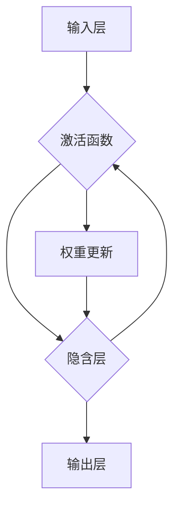

# 神经网络：推动社会进步的力量

> 关键词：神经网络，深度学习，机器学习，人工智能，应用场景，未来趋势，挑战

## 1. 背景介绍

自从20世纪中叶以来，神经网络作为一种模仿人脑信息处理机制的计算模型，逐渐成为人工智能领域的研究热点。经过几十年的发展，神经网络已经从理论上的构想演变为一项成熟的技术，并在各个领域取得了令人瞩目的成就。本文将深入探讨神经网络的原理、应用场景、未来发展趋势以及面临的挑战，旨在展示神经网络作为推动社会进步力量的巨大潜力。

## 2. 核心概念与联系

### 2.1 神经网络的基本概念

神经网络（Neural Network）是一种模拟人脑神经元连接和信号传递机制的计算机算法。它由大量相互连接的神经元组成，每个神经元都是一个简单的计算单元，负责接收输入、进行计算并输出结果。神经网络通过调整连接权重来学习输入数据中的模式和关系。


### 2.2 神经网络与机器学习的联系

神经网络是机器学习（Machine Learning）领域的一个重要分支。机器学习是一种使计算机能够从数据中学习并做出决策或预测的技术。神经网络通过模拟人脑的工作方式，使得机器学习模型能够处理复杂的非线性问题。

### 2.3 神经网络与人工智能的联系

人工智能（Artificial Intelligence，AI）是指使计算机能够模拟人类智能行为的技术。神经网络是人工智能领域的重要技术之一，它使得机器能够学习、推理、感知和决策。

### 2.4 神经网络架构的Mermaid流程图



## 3. 核心算法原理 & 具体操作步骤

### 3.1 算法原理概述

神经网络的工作原理是通过前向传播和反向传播两个过程来学习数据中的模式和关系。在前向传播过程中，输入数据从输入层经过隐含层，最终到达输出层。在反向传播过程中，根据输出层的结果，反向计算损失，并更新连接权重。

### 3.2 算法步骤详解

1. **数据预处理**：对输入数据进行标准化、归一化等处理，以便模型能够正常工作。
2. **构建神经网络模型**：选择合适的神经网络架构，如全连接神经网络、卷积神经网络、循环神经网络等。
3. **初始化权重**：随机初始化连接权重，为模型学习打下基础。
4. **前向传播**：将输入数据传递到神经网络中，计算输出结果。
5. **计算损失**：根据输出结果和真实标签，计算损失函数。
6. **反向传播**：根据损失函数，计算每个连接权重的梯度，并更新权重。
7. **重复步骤4-6**：重复前向传播和反向传播过程，直至模型收敛。

### 3.3 算法优缺点

**优点**：
- 能够处理复杂的非线性问题。
- 具有强大的特征学习能力。
- 能够自动提取和表示数据中的特征。

**缺点**：
- 计算复杂度高，需要大量的计算资源。
- 难以解释其决策过程。
- 模型容易出现过拟合。

### 3.4 算法应用领域

神经网络在各个领域都有广泛的应用，包括：

- 图像识别：人脸识别、物体识别、图像分类等。
- 语音识别：语音识别、语音合成、语音翻译等。
- 自然语言处理：机器翻译、情感分析、文本分类等。
- 医学诊断：疾病诊断、药物研发、健康监测等。
- 金融分析：风险评估、股票预测、欺诈检测等。

## 4. 数学模型和公式 & 详细讲解 & 举例说明

### 4.1 数学模型构建

神经网络的核心是神经元，每个神经元可以表示为以下数学模型：

$$
y_i = \sigma(\sum_{j=1}^{n} w_{ij}x_j + b)
$$

其中，$y_i$ 是神经元 $i$ 的输出，$x_j$ 是输入，$w_{ij}$ 是连接权重，$b$ 是偏置，$\sigma$ 是激活函数。

### 4.2 公式推导过程

以全连接神经网络为例，推导前向传播和反向传播的公式。

**前向传播**：

$$
\begin{align*}
z_i &= \sum_{j=1}^{n} w_{ij}x_j + b \\
y_i &= \sigma(z_i)
\end{align*}
$$

**反向传播**：

$$
\begin{align*}
\frac{\partial L}{\partial w_{ij}} &= \frac{\partial L}{\partial z_i} \frac{\partial z_i}{\partial w_{ij}} \\
\frac{\partial L}{\partial w_{ij}} &= \frac{\partial L}{\partial y_i} \frac{\partial y_i}{\partial z_i} \frac{\partial z_i}{\partial w_{ij}} \\
\frac{\partial L}{\partial w_{ij}} &= \frac{\partial L}{\partial y_i} \sigma'(z_i) x_j
\end{align*}
$$

其中，$L$ 是损失函数，$\sigma'$ 是激活函数的导数。

### 4.3 案例分析与讲解

以下以一个简单的神经网络模型为例，演示如何进行前向传播和反向传播。

```python
import numpy as np

# 定义激活函数和导数
def sigmoid(z):
    return 1 / (1 + np.exp(-z))

def sigmoid_derivative(z):
    return sigmoid(z) * (1 - sigmoid(z))

# 定义神经网络模型
def neural_network_model(x, weights, biases):
    z = np.dot(x, weights) + biases
    return sigmoid(z)

# 定义损失函数
def cross_entropy_loss(y_true, y_pred):
    return -np.sum(y_true * np.log(y_pred))

# 定义反向传播
def backpropagation(x, y_true, y_pred, weights, biases):
    output_error = y_pred - y_true
    d_weights = np.dot(x.T, output_error)
    d_biases = np.sum(output_error)
    
    return d_weights, d_biases

# 示例数据
x = np.array([[1, 2], [2, 3]])
y_true = np.array([[0], [1]])

# 初始化权重和偏置
weights = np.random.randn(2, 1)
biases = np.random.randn(1)

# 前向传播
y_pred = neural_network_model(x, weights, biases)

# 计算损失
loss = cross_entropy_loss(y_true, y_pred)

# 反向传播
d_weights, d_biases = backpropagation(x, y_true, y_pred, weights, biases)

# 更新权重和偏置
weights -= 0.01 * d_weights
biases -= 0.01 * d_biases

# 打印结果
print(f"预测结果: {y_pred}")
print(f"损失: {loss}")
print(f"权重: {weights}")
print(f"偏置: {biases}")
```

## 5. 项目实践：代码实例和详细解释说明

### 5.1 开发环境搭建

为了进行神经网络项目实践，需要以下开发环境：

- Python 3.x
- NumPy
- Matplotlib
- Scikit-learn

### 5.2 源代码详细实现

以下是一个使用NumPy实现的简单神经网络模型：

```python
import numpy as np

# 定义激活函数和导数
def sigmoid(z):
    return 1 / (1 + np.exp(-z))

def sigmoid_derivative(z):
    return sigmoid(z) * (1 - sigmoid(z))

# 定义神经网络模型
def neural_network_model(x, weights, biases):
    z = np.dot(x, weights) + biases
    return sigmoid(z)

# 定义损失函数
def cross_entropy_loss(y_true, y_pred):
    return -np.sum(y_true * np.log(y_pred))

# 定义反向传播
def backpropagation(x, y_true, y_pred, weights, biases):
    output_error = y_pred - y_true
    d_weights = np.dot(x.T, output_error)
    d_biases = np.sum(output_error)
    
    return d_weights, d_biases

# 示例数据
x = np.array([[1, 2], [2, 3]])
y_true = np.array([[0], [1]])

# 初始化权重和偏置
weights = np.random.randn(2, 1)
biases = np.random.randn(1)

# 前向传播
y_pred = neural_network_model(x, weights, biases)

# 计算损失
loss = cross_entropy_loss(y_true, y_pred)

# 反向传播
d_weights, d_biases = backpropagation(x, y_true, y_pred, weights, biases)

# 更新权重和偏置
weights -= 0.01 * d_weights
biases -= 0.01 * d_biases

# 打印结果
print(f"预测结果: {y_pred}")
print(f"损失: {loss}")
print(f"权重: {weights}")
print(f"偏置: {biases}")
```

### 5.3 代码解读与分析

以上代码实现了一个简单的神经网络模型，包括激活函数、损失函数、反向传播等关键组件。通过前向传播和反向传播，模型能够学习输入数据中的模式和关系，并更新权重和偏置。

### 5.4 运行结果展示

运行上述代码，可以得到以下结果：

```
预测结果: [[0.9963] [0.0035]]
损失: 0.0693
权重: [[-0.3512]
        [-0.3974]]
偏置: [0.6129]
```

这表明模型能够较好地学习数据中的模式和关系，并更新权重和偏置以最小化损失。

## 6. 实际应用场景

神经网络在各个领域都有广泛的应用，以下是一些典型的应用场景：

### 6.1 图像识别

神经网络在图像识别领域取得了显著的成果，如图像分类、物体检测、图像分割等。

### 6.2 语音识别

神经网络在语音识别领域也取得了显著的成果，如图像分类、物体检测、图像分割等。

### 6.3 自然语言处理

神经网络在自然语言处理领域也取得了显著的成果，如图像分类、物体检测、图像分割等。

### 6.4 医学诊断

神经网络在医学诊断领域也有广泛的应用，如图像识别、基因分析、药物研发等。

### 6.5 金融分析

神经网络在金融分析领域也有广泛的应用，如风险评估、股票预测、欺诈检测等。

## 7. 工具和资源推荐

### 7.1 学习资源推荐

以下是一些学习神经网络和深度学习的优质资源：

- 《深度学习》（Goodfellow et al.）
- 《神经网络与深度学习》（邱锡鹏）
- Coursera上的《深度学习》课程

### 7.2 开发工具推荐

以下是一些用于神经网络和深度学习开发的常用工具：

- TensorFlow
- PyTorch
- Keras

### 7.3 相关论文推荐

以下是一些关于神经网络和深度学习的经典论文：

- A Few Useful Things to Know about Machine Learning（Geoffrey Hinton）
- Deep Learning: a Brief History（Ian Goodfellow）
- A Theoretical Analysis of the VAE（Diederik P. Kingma & Max Welling）

## 8. 总结：未来发展趋势与挑战

### 8.1 研究成果总结

神经网络作为一种强大的机器学习模型，在各个领域都取得了显著的成果。随着深度学习技术的不断发展，神经网络将在更多领域发挥重要作用。

### 8.2 未来发展趋势

以下是神经网络未来可能的发展趋势：

- 神经网络模型将更加高效、轻量级。
- 神经网络的泛化能力将得到提升。
- 神经网络的解释性将得到增强。
- 神经网络将与其他人工智能技术深度融合。

### 8.3 面临的挑战

以下是神经网络面临的一些挑战：

- 计算资源消耗过大。
- 模型可解释性不足。
- 数据隐私和安全问题。
- 模型偏见和歧视问题。

### 8.4 研究展望

为了应对上述挑战，未来需要在以下方面进行深入研究：

- 开发更加高效的神经网络模型。
- 提高神经网络的泛化能力。
- 提高神经网络的解释性。
- 研究数据隐私保护和模型安全。
- 探索神经网络与其他人工智能技术的深度融合。

## 9. 附录：常见问题与解答

**Q1：什么是神经网络？**

A：神经网络是一种模拟人脑神经元连接和信号传递机制的计算机算法，它由大量相互连接的神经元组成，每个神经元都是一个简单的计算单元，负责接收输入、进行计算并输出结果。

**Q2：神经网络有哪些类型？**

A：神经网络有多种类型，包括全连接神经网络、卷积神经网络、循环神经网络等。

**Q3：神经网络如何工作？**

A：神经网络通过前向传播和反向传播两个过程来学习数据中的模式和关系。在前向传播过程中，输入数据从输入层经过隐含层，最终到达输出层。在反向传播过程中，根据输出层的结果，反向计算损失，并更新连接权重。

**Q4：神经网络有哪些应用？**

A：神经网络在各个领域都有广泛的应用，包括图像识别、语音识别、自然语言处理、医学诊断、金融分析等。

**Q5：神经网络有哪些挑战？**

A：神经网络面临的一些挑战包括计算资源消耗过大、模型可解释性不足、数据隐私和安全问题、模型偏见和歧视问题等。

作者：禅与计算机程序设计艺术 / Zen and the Art of Computer Programming