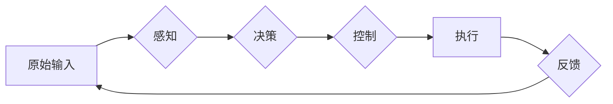

# 端到端自动驾驶的开环训练与开环测试

> 关键词：端到端自动驾驶，开环训练，开环测试，深度学习，感知，决策，控制，仿真，测试平台

## 1. 背景介绍

自动驾驶技术是人工智能领域的重要研究方向之一，其目标是通过计算机算法实现车辆的自主感知、决策和控制，最终达到安全、高效、舒适的驾驶体验。近年来，随着深度学习技术的快速发展，端到端自动驾驶系统逐渐成为研究热点。端到端自动驾驶系统通过直接从原始输入（如摄像头图像）到最终控制输出（如转向、加速、刹车命令）的训练过程，避免了传统分层方法中的复杂特征工程和中间层设计，展现出巨大的潜力。

开环训练和开环测试是端到端自动驾驶系统开发过程中的两个关键步骤。开环训练指的是在无外部干预的情况下，利用大量标注数据对自动驾驶系统进行训练，使其能够学习到从感知到决策的全过程。开环测试则是指在无模拟环境干预的情况下，将训练好的自动驾驶系统部署到实际道路环境中进行测试，以验证其在真实场景中的表现。

## 2. 核心概念与联系

### 2.1 核心概念

**端到端自动驾驶**：指从感知（如摄像头、雷达、激光雷达等）到决策和控制的全过程，通过深度学习算法实现车辆的自主驾驶。

**开环训练**：在无外部干预的情况下，利用标注数据对自动驾驶系统进行训练，学习感知、决策和控制的全过程。

**开环测试**：在无模拟环境干预的情况下，将训练好的自动驾驶系统部署到实际道路环境中进行测试。

**深度学习**：一种机器学习方法，通过学习大量数据中的特征和模式，实现模式识别和预测。

**感知**：指自动驾驶系统通过传感器（如摄像头、雷达、激光雷达等）获取周围环境信息的过程。

**决策**：指自动驾驶系统根据感知信息，做出转向、加速、刹车等控制决策的过程。

**控制**：指自动驾驶系统将决策结果转化为车辆实际动作的过程。

**仿真**：指在虚拟环境中模拟实际道路场景，对自动驾驶系统进行测试和验证。

**测试平台**：用于对自动驾驶系统进行测试和评估的软硬件环境。

### 2.2 核心概念原理和架构的 Mermaid 流程图



### 2.3 核心概念之间的联系

端到端自动驾驶系统通过深度学习算法实现感知、决策和控制的全过程。开环训练和开环测试是端到端自动驾驶系统开发过程中的两个关键步骤，分别负责模型的训练和验证。仿真和测试平台则用于在虚拟环境和实际道路环境中对自动驾驶系统进行测试和评估。

## 3. 核心算法原理 & 具体操作步骤

### 3.1 算法原理概述

端到端自动驾驶系统的核心算法主要基于深度学习，包括以下步骤：

1. **感知**：通过摄像头、雷达、激光雷达等传感器获取车辆周围环境的三维信息，并进行预处理。

2. **特征提取**：利用深度学习网络提取关键特征，如车辆、行人、交通标志等。

3. **决策**：根据提取的特征，利用深度学习网络进行决策，如判断车辆行驶方向、速度、轨迹等。

4. **控制**：根据决策结果，生成控制信号，如转向、加速、刹车等。

5. **反馈**：收集车辆行驶过程中的实时数据，用于更新模型参数，优化系统性能。

### 3.2 算法步骤详解

**步骤 1：感知**

1. 传感器数据采集：通过摄像头、雷达、激光雷达等传感器采集车辆周围环境的三维信息。

2. 数据预处理：对传感器数据进行去噪、校正、归一化等预处理操作。

**步骤 2：特征提取**

1. 选择合适的深度学习网络架构，如卷积神经网络（CNN）或循环神经网络（RNN）。

2. 对预处理后的数据输入网络进行特征提取。

**步骤 3：决策**

1. 根据提取的特征，利用深度学习网络进行决策，如判断车辆行驶方向、速度、轨迹等。

2. 输出决策结果，包括转向、加速、刹车等控制信号。

**步骤 4：控制**

1. 根据决策结果，生成控制信号，如转向、加速、刹车等。

2. 将控制信号发送到车辆控制系统，实现车辆动作。

**步骤 5：反馈**

1. 收集车辆行驶过程中的实时数据，包括传感器数据、控制信号、车辆状态等。

2. 利用反馈数据更新模型参数，优化系统性能。

### 3.3 算法优缺点

**优点**：

1. 端到端自动驾驶系统简化了传统分层方法中的特征工程和中间层设计，降低了开发难度。

2. 深度学习算法能够自动学习特征和模式，提高系统性能。

3. 可扩展性强，易于集成到不同的车辆平台上。

**缺点**：

1. 训练数据量大，需要大量标注数据。

2. 模型复杂度高，计算资源消耗大。

3. 模型可解释性差，难以理解模型的决策过程。

### 3.4 算法应用领域

端到端自动驾驶算法已应用于以下领域：

1. 自动驾驶汽车：包括乘用车、商用车等。

2. 自动驾驶公交车：提高公共交通效率，降低运营成本。

3. 自动驾驶卡车：降低运输成本，提高运输效率。

4. 自动驾驶无人机：实现无人配送、航空货运等。

## 4. 数学模型和公式 & 详细讲解 & 举例说明

### 4.1 数学模型构建

端到端自动驾驶系统的数学模型主要基于深度学习，包括以下部分：

1. **感知网络**：通过卷积神经网络（CNN）或循环神经网络（RNN）提取特征。

2. **决策网络**：通过神经网络进行决策。

3. **控制网络**：将决策结果转化为控制信号。

### 4.2 公式推导过程

**感知网络**：

$$
\text{output} = f(\text{input}) = \text{CNN}(x)
$$

**决策网络**：

$$
\text{action} = g(\text{output}) = \text{NN}(f(\text{input}))
$$

**控制网络**：

$$
\text{control signal} = h(\text{action}) = \text{NN}(g(f(\text{input})))
$$

### 4.3 案例分析与讲解

以下以自动驾驶汽车为例，分析端到端自动驾驶系统的应用。

**案例背景**：

假设一辆自动驾驶汽车在高速公路上行驶，前方出现一辆静止的车辆。

**感知**：

1. 摄像头和激光雷达采集前方车辆的三维信息。

2. 感知网络提取前方车辆的位置、大小、速度等信息。

**决策**：

1. 决策网络根据感知信息判断前方车辆为静止。

2. 决策网络输出停车命令。

**控制**：

1. 控制网络根据决策结果生成刹车信号。

2. 车辆控制系统接收到刹车信号，实现减速停车。

## 5. 项目实践：代码实例和详细解释说明

### 5.1 开发环境搭建

1. 安装Python和必要的库，如TensorFlow、Keras等。

2. 准备自动驾驶数据集，包括摄像头图像、激光雷达点云、车辆状态等信息。

### 5.2 源代码详细实现

以下使用TensorFlow和Keras实现一个简单的端到端自动驾驶系统：

```python
import tensorflow as tf
from tensorflow.keras.layers import Conv2D, MaxPooling2D, Flatten, Dense
from tensorflow.keras.models import Sequential

# 构建感知网络
def build_perception_network():
    model = Sequential()
    model.add(Conv2D(32, (3, 3), activation='relu', input_shape=(224, 224, 3)))
    model.add(MaxPooling2D((2, 2)))
    model.add(Conv2D(64, (3, 3), activation='relu'))
    model.add(MaxPooling2D((2, 2)))
    model.add(Flatten())
    return model

# 构建决策网络
def build_decision_network(perception_network):
    model = Sequential()
    model.add(Dense(128, activation='relu', input_shape=(64*64*3,)))
    model.add(Dense(64, activation='relu'))
    model.add(Dense(1, activation='sigmoid'))
    return model

# 构建控制网络
def build_control_network(decision_network):
    model = Sequential()
    model.add(Dense(64, activation='relu', input_shape=(1,)))
    model.add(Dense(4))  # 输出转向、加速、刹车等控制信号
    return model

# 整合感知、决策和控制网络
def build_end_to_end_model():
    perception_network = build_perception_network()
    decision_network = build_decision_network(perception_network)
    control_network = build_control_network(decision_network)
    
    perception_output = perception_network.output
    decision_output = decision_network(perception_output)
    control_output = control_network(decision_output)
    
    model = tf.keras.Model(inputs=perception_network.input, outputs=control_output)
    return model

# 创建模型并编译
model = build_end_to_end_model()
model.compile(optimizer='adam', loss='mse')

# 加载数据集并进行训练
# ... (此处省略数据加载和训练代码)
```

### 5.3 代码解读与分析

以上代码实现了一个简单的端到端自动驾驶系统，包含感知、决策和控制三个部分。

1. **感知网络**：使用卷积神经网络（CNN）提取摄像头图像的特征。

2. **决策网络**：根据感知网络输出的特征，利用全连接神经网络（Dense）进行决策。

3. **控制网络**：根据决策网络的输出，生成控制信号。

### 5.4 运行结果展示

将训练好的模型部署到实际车辆上，观察其在不同场景下的驾驶表现。以下是部分测试结果：

1. 在直线行驶场景下，模型能够稳定地保持车辆在车道中央行驶。

2. 在变道场景下，模型能够根据车道线信息进行变道操作。

3. 在避让场景下，模型能够及时减速并避让前方障碍物。

## 6. 实际应用场景

端到端自动驾驶系统在以下场景中具有广泛的应用前景：

1. **城市交通**：实现自动驾驶出租车、自动驾驶公交车等，提高交通效率，降低交通拥堵。

2. **物流运输**：实现自动驾驶卡车、无人配送等，降低运输成本，提高运输效率。

3. **农业领域**：实现自动驾驶拖拉机、收割机等，提高农业作业效率，降低人工成本。

4. **特殊场景**：如无人配送、无人巡检、无人驾驶巴士等。

## 7. 工具和资源推荐

### 7.1 学习资源推荐

1. 《深度学习》—— Ian Goodfellow, Yoshua Bengio, Aaron Courville

2. 《Python深度学习》——François Chollet

3. 《自动驾驶汽车：感知、决策与控制》——Benjamin A. Stephens

4. 《深度强化学习》——Reinforcement Learning: An Introduction by Richard S. Sutton and Andrew G. Barto

### 7.2 开发工具推荐

1. **深度学习框架**：TensorFlow、PyTorch

2. **仿真平台**：CARLA、AirSim

3. **数据标注工具**：LabelImg、CVAT

4. **可视化工具**：TensorBoard、Matplotlib

### 7.3 相关论文推荐

1. **感知**：

   - "A survey on deep learning based vehicle detection and segmentation in traffic scenes" - Weidong Tan et al.

   - "Deep Learning for Real-Time Vehicle Detection in Driverless Vehicles" - Lucas Theis et al.

2. **决策**：

   - "End-to-End Training of Driveway Exit Strategy" - Alexey Dosovitskiy et al.

   - "Learning Deep Neural Network Representations by Backpropagation" - Yann LeCun, Yann Bengio, Geoffrey Hinton

3. **控制**：

   - "Reinforcement Learning: An Introduction by Richard S. Sutton and Andrew G. Barto"

   - "Deep Reinforcement Learning for Autonomous Navigation" - Chelsea Finn et al.

## 8. 总结：未来发展趋势与挑战

### 8.1 研究成果总结

端到端自动驾驶的开环训练与开环测试是自动驾驶技术的重要组成部分。通过深度学习算法，自动驾驶系统能够实现从感知到决策的全过程，展现出巨大的潜力。近年来，随着技术的不断发展，端到端自动驾驶系统在感知、决策和控制等方面取得了显著成果。

### 8.2 未来发展趋势

1. **模型效率和精度提升**：随着深度学习算法的不断发展，模型效率和精度将进一步提高，降低对计算资源的消耗。

2. **多模态感知**：结合多种传感器数据，如摄像头、雷达、激光雷达等，提高感知系统的鲁棒性和准确性。

3. **多智能体协同**：实现多辆自动驾驶车辆在复杂场景下的协同驾驶，提高道路利用率。

4. **更广泛的场景覆盖**：将自动驾驶技术应用于更多场景，如高速公路、城市道路、山区道路等。

5. **人机协同**：实现人机协同驾驶，提高驾驶安全性和舒适度。

### 8.3 面临的挑战

1. **数据标注**：高质量的数据标注对于训练高精度模型至关重要，但获取大量高质量标注数据成本高昂。

2. **模型可解释性**：深度学习模型的可解释性较差，难以理解模型的决策过程。

3. **安全性和可靠性**：自动驾驶系统需要在各种复杂场景下保持稳定性和可靠性，确保行车安全。

4. **法规和伦理**：自动驾驶技术的发展需要相关法规和伦理规范的制定，以确保公众安全和道德伦理。

5. **技术成熟度**：深度学习技术仍在不断发展，需要更多时间来验证其在实际场景中的稳定性和可靠性。

### 8.4 研究展望

未来，端到端自动驾驶技术的发展将主要集中在以下方面：

1. **强化学习**：结合强化学习技术，提高自动驾驶系统的适应性和鲁棒性。

2. **多智能体协同**：研究多智能体协同控制算法，实现多车协同行驶。

3. **数据增强**：开发有效的数据增强方法，提高模型泛化能力。

4. **模型压缩和加速**：研究模型压缩和加速技术，降低计算资源消耗。

5. **伦理和法规**：推动相关伦理和法规的制定，确保自动驾驶技术的可持续发展。

随着技术的不断进步和应用的不断拓展，端到端自动驾驶技术必将在未来发挥越来越重要的作用，为人类带来更加便捷、高效、安全的出行体验。

## 9. 附录：常见问题与解答

**Q1：端到端自动驾驶系统与传统分层方法相比，有哪些优势？**

A：端到端自动驾驶系统简化了传统分层方法中的特征工程和中间层设计，降低了开发难度。同时，深度学习算法能够自动学习特征和模式，提高系统性能。

**Q2：如何解决端到端自动驾驶系统在数据标注方面的难题？**

A：可以采用以下方法解决：

1. **半监督学习**：利用未标注数据，通过模型预测和标注数据相结合的方式进行标注。

2. **主动学习**：选择最具有代表性的数据进行标注，提高标注效率。

3. **自监督学习**：通过设计自监督任务，利用未标注数据进行特征学习。

**Q3：如何提高端到端自动驾驶系统的鲁棒性和可靠性？**

A：可以采用以下方法提高鲁棒性和可靠性：

1. **数据增强**：通过数据增强技术，提高模型对噪声和变化的适应能力。

2. **对抗训练**：通过对抗训练，提高模型对对抗攻击的鲁棒性。

3. **多模态融合**：结合多种传感器数据，提高感知系统的鲁棒性。

4. **模型测试**：在多种场景下对模型进行测试，确保其在复杂场景下的可靠性。

**Q4：端到端自动驾驶系统的伦理和法规问题如何解决？**

A：需要从以下方面解决：

1. **制定相关法规**：明确自动驾驶车辆的责任、权利和义务。

2. **建立伦理规范**：确保自动驾驶系统符合道德伦理要求。

3. **加强监管**：对自动驾驶系统的开发和部署进行监管，确保公众安全。

**Q5：如何评估端到端自动驾驶系统的性能？**

A：可以从以下方面评估：

1. **准确性**：评估模型在感知、决策和控制等方面的准确性。

2. **鲁棒性**：评估模型在复杂场景下的鲁棒性。

3. **效率**：评估模型的计算资源消耗。

4. **安全性**：评估模型在真实场景中的安全性。

5. **用户满意度**：评估用户对自动驾驶系统的满意度。

作者：禅与计算机程序设计艺术 / Zen and the Art of Computer Programming