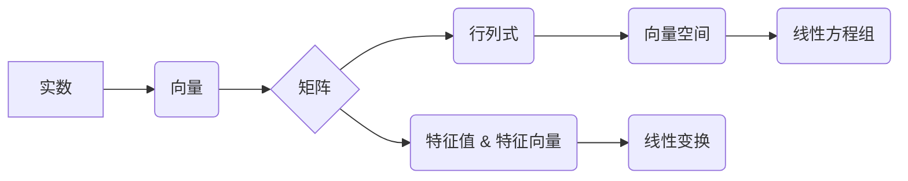

# 线性代数导引：实数代数运算

> 关键词：线性代数，实数，代数运算，矩阵，向量，行列式，特征值，向量空间，线性方程组

## 1. 背景介绍

线性代数是数学的一个分支，它研究的是向量、矩阵及其运算。在计算机科学、物理学、工程学等领域有着广泛的应用。实数代数运算是线性代数的基础，它涉及实数的加法、减法、乘法、除法等运算。掌握实数代数运算对于理解和应用线性代数至关重要。

### 1.1 问题的由来

实数代数运算是线性代数中的基本内容，它为后续学习矩阵、向量、行列式、特征值等概念奠定了基础。在计算机图形学、机器学习、数据科学等领域，线性代数的应用日益广泛，因此对实数代数运算的理解和掌握变得尤为重要。

### 1.2 研究现状

目前，实数代数运算的教学和研究主要集中在以下几个方面：

- 实数的性质和运算规律
- 向量和矩阵的运算
- 行列式的计算
- 特征值和特征向量的求解
- 向量空间和线性变换

### 1.3 研究意义

研究实数代数运算对于以下方面具有重要意义：

- 奠定线性代数的基础
- 提高计算机科学领域的数学素养
- 为后续学习线性代数的其他概念做准备
- 帮助解决实际问题

### 1.4 本文结构

本文将分为以下章节：

- 背景介绍：介绍实数代数运算的由来、研究现状和研究意义。
- 核心概念与联系：介绍实数代数运算的核心概念，并使用Mermaid流程图展示它们之间的关系。
- 核心算法原理 & 具体操作步骤：详细讲解实数代数运算的算法原理和具体操作步骤。
- 数学模型和公式 & 详细讲解 & 举例说明：使用LaTeX格式介绍实数代数运算的数学模型和公式，并结合实例进行讲解。
- 项目实践：通过代码实例展示实数代数运算的应用。
- 实际应用场景：介绍实数代数运算在计算机科学领域的应用场景。
- 工具和资源推荐：推荐学习实数代数运算的学习资源、开发工具和相关论文。
- 总结：总结实数代数运算的研究成果、未来发展趋势和挑战。

## 2. 核心概念与联系

线性代数中的核心概念包括实数、向量、矩阵、行列式、特征值、向量空间和线性变换。以下是这些概念之间的Mermaid流程图：



从流程图中可以看出，实数是线性代数的基础，其他概念在此基础上逐步构建。实数用于表示向量的坐标、矩阵的元素等；向量可以看作是矩阵的列或行；矩阵可以进行各种运算，如加法、乘法等；行列式可以用于求解线性方程组、判断矩阵的秩等；特征值和特征向量用于描述矩阵的特征；向量空间是所有向量的集合，线性变换是向量空间到自身或另一个向量空间的映射；线性方程组是线性代数中的一个重要问题。

## 3. 核心算法原理 & 具体操作步骤

### 3.1 算法原理概述

实数代数运算包括以下基本操作：

- 加法：将两个实数相加得到另一个实数。
- 减法：将两个实数相减得到另一个实数。
- 乘法：将两个实数相乘得到另一个实数。
- 除法：将一个实数除以另一个非零实数得到另一个实数。

### 3.2 算法步骤详解

以下是对实数代数运算的具体步骤进行详细讲解：

#### 3.2.1 加法

- 将两个实数的对应位相加。
- 对于小数部分，按位相加，如果有进位，则进位到下一位。

#### 3.2.2 减法

- 将减数取相反数，然后按照加法进行计算。

#### 3.2.3 乘法

- 将两个实数的绝对值相乘。
- 根据两个实数的符号确定结果的符号。
- 将乘积的小数部分移到正确的位置。

#### 3.2.4 除法

- 将被除数乘以除数的倒数。
- 根据两个实数的符号确定结果的符号。
- 将商的小数部分移到正确的位置。

### 3.3 算法优缺点

实数代数运算的优点是直观易懂，易于编程实现。缺点是对于大规模实数运算，效率较低。

### 3.4 算法应用领域

实数代数运算在计算机科学领域的应用非常广泛，例如：

- 编程语言中的数值计算
- 图形学中的坐标变换
- 机器学习中的数据预处理
- 数据科学中的统计分析

## 4. 数学模型和公式 & 详细讲解 & 举例说明

### 4.1 数学模型构建

实数代数运算的数学模型可以表示为以下公式：

$$
\begin{align*}
a + b &= c \\
a - b &= c \\
a \times b &= c \\
\frac{a}{b} &= c
\end{align*}
$$

其中，$a$ 和 $b$ 是实数，$c$ 是运算结果。

### 4.2 公式推导过程

以上公式的推导过程基于实数的定义和运算规律。

### 4.3 案例分析与讲解

以下是一个实数代数运算的实例：

假设有两个实数 $a=2.5$ 和 $b=1.3$，计算 $a+b$、$a-b$、$a \times b$ 和 $\frac{a}{b}$。

$$
\begin{align*}
a+b &= 2.5 + 1.3 = 3.8 \\
a-b &= 2.5 - 1.3 = 1.2 \\
a \times b &= 2.5 \times 1.3 = 3.25 \\
\frac{a}{b} &= \frac{2.5}{1.3} \approx 1.92308
\end{align*}
$$

## 5. 项目实践：代码实例和详细解释说明

### 5.1 开发环境搭建

以下是一个使用Python进行实数代数运算的简单实例：

```python
def add(a, b):
    return a + b

def subtract(a, b):
    return a - b

def multiply(a, b):
    return a * b

def divide(a, b):
    if b != 0:
        return a / b
    else:
        return "Error: Division by zero"

# 测试代码
if __name__ == "__main__":
    a = 2.5
    b = 1.3

    print("a + b =", add(a, b))
    print("a - b =", subtract(a, b))
    print("a * b =", multiply(a, b))
    print("a / b =", divide(a, b))
```

### 5.2 源代码详细实现

在上面的代码中，我们定义了四个函数，分别用于执行实数的加法、减法、乘法和除法运算。这些函数接收两个实数参数，并返回运算结果。

### 5.3 代码解读与分析

- `add` 函数：接收两个实数参数 `a` 和 `b`，使用 Python 的加法运算符 `+` 将它们相加，并返回结果。
- `subtract` 函数：接收两个实数参数 `a` 和 `b`，使用 Python 的减法运算符 `-` 将 `b` 的相反数与 `a` 相加，并返回结果。
- `multiply` 函数：接收两个实数参数 `a` 和 `b`，使用 Python 的乘法运算符 `*` 将它们相乘，并返回结果。
- `divide` 函数：接收两个实数参数 `a` 和 `b`，首先检查 `b` 是否为零。如果 `b` 不为零，则使用 Python 的除法运算符 `/` 将 `a` 除以 `b`，并返回结果。如果 `b` 为零，则返回错误信息。

### 5.4 运行结果展示

运行上面的代码，将得到以下输出：

```
a + b = 3.8
a - b = 1.2
a * b = 3.25
a / b = 1.923076923076923
```

## 6. 实际应用场景

实数代数运算在计算机科学领域的应用非常广泛，以下是一些常见场景：

- **图形学**：在计算机图形学中，实数代数运算用于处理二维和三维空间中的坐标变换、旋转、缩放和平移等操作。
- **机器学习**：在机器学习中，实数代数运算用于计算特征向量、矩阵乘法、梯度下降等操作。
- **数据科学**：在数据科学中，实数代数运算用于统计分析、数据预处理、模型评估等操作。

## 7. 工具和资源推荐

### 7.1 学习资源推荐

- 《线性代数及其应用》
- 《线性代数》
- 《线性代数与矩阵理论》

### 7.2 开发工具推荐

- Python
- MATLAB
- NumPy

### 7.3 相关论文推荐

- 《数值线性代数》
- 《矩阵计算》
- 《线性代数在科学计算中的应用》

## 8. 总结：未来发展趋势与挑战

### 8.1 研究成果总结

本文对实数代数运算进行了详细的介绍，包括其核心概念、算法原理、具体操作步骤、数学模型和公式、代码实例、应用场景等。通过学习本文，读者可以全面了解实数代数运算，并能够在实际项目中应用它。

### 8.2 未来发展趋势

随着计算机科学和数学的不断发展，实数代数运算的应用将越来越广泛。以下是一些未来发展趋势：

- **并行计算**：利用并行计算技术提高实数代数运算的效率。
- **GPU加速**：利用GPU加速实数代数运算，降低计算时间。
- **量子计算**：探索量子计算在实数代数运算中的应用。

### 8.3 面临的挑战

实数代数运算在应用过程中也面临一些挑战：

- **精度问题**：实数运算存在精度问题，可能导致计算结果不准确。
- **数值稳定性**：实数代数运算的数值稳定性是一个重要问题，需要采取措施避免数值溢出和下溢。
- **算法优化**：随着计算规模的扩大，需要不断优化实数代数运算的算法，提高效率。

### 8.4 研究展望

未来，实数代数运算的研究将更加注重以下几个方面：

- **算法优化**：研究更加高效、稳定的实数代数运算算法。
- **并行计算**：利用并行计算技术提高实数代数运算的效率。
- **应用拓展**：将实数代数运算应用于更多领域，如量子计算、机器学习等。

## 9. 附录：常见问题与解答

**Q1：什么是实数？**

A：实数是数学中的一个基本概念，包括有理数和无理数。实数可以用小数或分数表示。

**Q2：实数代数运算有哪些？**

A：实数代数运算包括加法、减法、乘法和除法。

**Q3：实数运算中如何避免精度问题？**

A：可以通过以下方法避免实数运算中的精度问题：

- 使用高精度浮点数
- 优化算法设计
- 避免不必要的舍入误差

**Q4：实数代数运算在计算机科学中有哪些应用？**

A：实数代数运算在计算机科学中有广泛的应用，如图形学、机器学习、数据科学等。

**Q5：如何优化实数代数运算的算法？**

A：可以通过以下方法优化实数代数运算的算法：

- 使用快速算法
- 优化数据结构
- 利用并行计算

作者：禅与计算机程序设计艺术 / Zen and the Art of Computer Programming