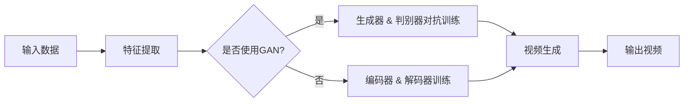

> 视频生成，深度学习，生成对抗网络，变分自编码器，强化学习，计算机视觉，自然语言处理，虚拟现实

# 视频生成(Video Generation) - 原理与代码实例讲解

## 1. 背景介绍

随着深度学习技术的飞速发展，视频生成领域取得了显著的进展。视频生成技术不仅能够用于娱乐和艺术创作，而且在医疗、教育、广告等多个领域具有广泛的应用前景。本篇文章将深入探讨视频生成的原理，并通过代码实例讲解如何实现一个简单的视频生成系统。

### 1.1 问题的由来

视频生成涉及到计算机视觉和自然语言处理等多个领域。随着深度学习技术的进步，视频生成的方法也日趋多样化。从早期的基于关键帧合成的方法，到基于深度学习的生成对抗网络（GAN）和变分自编码器（VAE），视频生成技术经历了长足的发展。

### 1.2 研究现状

目前，视频生成技术主要分为以下几类：

- **基于关键帧合成**：通过关键帧的提取、编辑和合成来生成视频。
- **基于视频序列建模**：使用循环神经网络（RNN）或Transformer来建模视频序列。
- **基于生成对抗网络（GAN）**：通过对抗训练生成逼真的视频序列。
- **基于变分自编码器（VAE）**：通过编码器和解码器生成视频序列。

### 1.3 研究意义

研究视频生成技术对于推动计算机视觉和自然语言处理技术的发展具有重要意义。视频生成技术能够帮助我们更好地理解视频内容，同时也能够在虚拟现实、增强现实等领域发挥重要作用。

### 1.4 本文结构

本文将按照以下结构展开：

- 介绍视频生成的核心概念和联系。
- 阐述视频生成的核心算法原理和具体操作步骤。
- 分析数学模型和公式，并通过案例进行讲解。
- 提供代码实例和详细解释说明。
- 探讨视频生成的实际应用场景和未来展望。
- 推荐相关工具和资源。
- 总结研究成果、未来发展趋势和挑战。

## 2. 核心概念与联系

### 2.1 核心概念原理

- **生成对抗网络（GAN）**：由两部分组成，生成器和判别器。生成器生成数据，判别器区分真实数据和生成数据。对抗训练的目标是使生成器生成尽可能逼真的数据，而判别器尽可能区分真实数据和生成数据。
- **变分自编码器（VAE）**：通过编码器将数据编码为潜在空间中的表示，通过解码器将潜在空间中的表示解码回原始数据空间。VAE的目标是学习数据的潜在空间分布。
- **循环神经网络（RNN）**：一种适用于序列数据的神经网络，能够捕捉序列中的时间依赖关系。
- **Transformer**：一种基于自注意力机制的神经网络，能够有效地处理长距离依赖问题。

### 2.2 架构的 Mermaid 流程图



## 3. 核心算法原理 & 具体操作步骤

### 3.1 算法原理概述

视频生成算法的原理可以概括为以下几步：

1. 特征提取：从输入视频中提取关键信息，如帧特征、动作特征等。
2. 生成或编码：使用生成器或编码器生成或编码视频序列。
3. 解码或对抗：使用解码器或对抗训练生成视频序列。
4. 输出视频：将生成的视频序列输出。

### 3.2 算法步骤详解

#### 3.2.1 基于GAN的视频生成

1. 定义生成器和判别器网络。
2. 使用对抗训练优化生成器和判别器网络。
3. 使用生成器生成视频序列。
4. 输出生成的视频。

#### 3.2.2 基于VAE的视频生成

1. 定义编码器和解码器网络。
2. 使用变分自编码器优化编码器和解码器网络。
3. 使用解码器生成视频序列。
4. 输出生成的视频。

### 3.3 算法优缺点

#### 3.3.1 基于GAN的视频生成

**优点**：

- 能够生成高度逼真的视频序列。
- 能够生成各种风格和内容。

**缺点**：

- 训练过程不稳定，容易出现模式崩溃。
- 难以控制生成视频的风格和内容。

#### 3.3.2 基于VAE的视频生成

**优点**：

- 训练过程稳定，易于控制。
- 能够生成具有多样性的视频序列。

**缺点**：

- 生成视频的质量可能不如GAN。
- 难以生成高度逼真的视频序列。

### 3.4 算法应用领域

视频生成算法可以应用于以下领域：

- 视频编辑：自动生成视频剪辑、特效等。
- 视频特效：生成各种视频特效，如慢动作、快动作等。
- 视频修复：修复损坏的视频文件。
- 视频生成：根据文本描述生成视频。

## 4. 数学模型和公式 & 详细讲解 & 举例说明

### 4.1 数学模型构建

#### 4.1.1 GAN

GAN的数学模型可以表示为：

$$
\begin{align*}
\text{D}(x) & = \frac{1}{Z} \int p_{\text{data}}(x) \exp\left(\frac{-D(x)}{T}\right) \text{d}x \\
\text{G}(z) & = f_{\text{generator}}(z)
\end{align*}
$$

其中，$p_{\text{data}}(x)$ 是数据分布，$D(x)$ 是判别器对输入数据的判断概率，$f_{\text{generator}}(z)$ 是生成器对输入噪声的映射。

#### 4.1.2 VAE

VAE的数学模型可以表示为：

$$
\begin{align*}
q_\phi(z|x) & = \frac{1}{Z} \exp\left(-\frac{\|\mu(x) - z\|^2}{2\sigma^2}\right) \\
p_{\text{data}}(x) & = \int q_\phi(z|x) p(z) \text{d}z
\end{align*}
$$

其中，$\mu(x)$ 是编码器对输入数据的编码，$\sigma^2$ 是编码器对输入数据的方差，$p(z)$ 是潜在空间的先验分布。

### 4.2 公式推导过程

#### 4.2.1 GAN

GAN的训练过程可以通过以下步骤推导：

1. 计算判别器对真实数据的损失函数：
$$
\mathcal{L}_D = -\frac{1}{N}\sum_{i=1}^{N} \left[ \log D(x) - \log(1 - D(G(z_i))) \right]
$$

2. 计算生成器对噪声数据的损失函数：
$$
\mathcal{L}_G = -\frac{1}{N}\sum_{i=1}^{N} \log(1 - D(G(z_i)))
$$

3. 通过最小化判别器和生成器的损失函数来训练网络。

#### 4.2.2 VAE

VAE的训练过程可以通过以下步骤推导：

1. 定义重建误差：
$$
\mathcal{L}_x = \sum_{i=1}^{N} D(x, G(\mu(x), \sigma(x)))
$$

2. 定义KL散度：
$$
\mathcal{L}_z = \sum_{i=1}^{N} D_{KL}(q_\phi(z|x) || p(z))
$$

3. 通过最小化重建误差和KL散度来训练网络。

### 4.3 案例分析与讲解

以下是一个使用PyTorch实现GAN的视频生成代码实例：

```python
import torch
import torch.nn as nn
import torch.optim as optim

# 定义生成器和判别器
class Generator(nn.Module):
    def __init__(self):
        super(Generator, self).__init__()
        # ... (定义网络结构)

    def forward(self, z):
        # ... (前向传播)

class Discriminator(nn.Module):
    def __init__(self):
        super(Discriminator, self).__init__()
        # ... (定义网络结构)

    def forward(self, x):
        # ... (前向传播)

# 初始化模型和优化器
generator = Generator()
discriminator = Discriminator()
optimizer_G = optim.Adam(generator.parameters(), lr=0.001)
optimizer_D = optim.Adam(discriminator.parameters(), lr=0.001)

# 训练过程
for epoch in range(epochs):
    for real_data in data_loader:
        # ... (获取真实数据)
        
        # 训练判别器
        optimizer_D.zero_grad()
        # ... (计算判别器的损失函数)
        
        # 训练生成器
        optimizer_G.zero_grad()
        # ... (计算生成器的损失函数)
```

## 5. 项目实践：代码实例和详细解释说明

### 5.1 开发环境搭建

为了实现视频生成，你需要安装以下软件和库：

- Python 3.x
- PyTorch
- OpenCV
- NumPy

### 5.2 源代码详细实现

以下是一个简单的视频生成代码实例：

```python
import torch
import torch.nn as nn
import torch.optim as optim
from torchvision import transforms
from PIL import Image
import cv2

# 定义生成器
class Generator(nn.Module):
    def __init__(self):
        super(Generator, self).__init__()
        # ... (定义网络结构)

    def forward(self, z):
        # ... (前向传播)

# 定义判别器
class Discriminator(nn.Module):
    def __init__(self):
        super(Discriminator, self).__init__()
        # ... (定义网络结构)

    def forward(self, x):
        # ... (前向传播)

# 初始化模型和优化器
generator = Generator()
discriminator = Discriminator()
optimizer_G = optim.Adam(generator.parameters(), lr=0.001)
optimizer_D = optim.Adam(discriminator.parameters(), lr=0.001)

# 训练过程
for epoch in range(epochs):
    for real_images in real_images_loader:
        # ... (获取真实图像)
        
        # 训练判别器
        optimizer_D.zero_grad()
        # ... (计算判别器的损失函数)
        
        # 训练生成器
        optimizer_G.zero_grad()
        # ... (计算生成器的损失函数)
        
        # 生成图像
        z = torch.randn(batch_size, latent_dim)
        fake_images = generator(z)
        # ... (保存生成的图像)
```

### 5.3 代码解读与分析

上述代码展示了如何使用PyTorch实现视频生成。首先定义了生成器和判别器网络，然后初始化了模型和优化器。在训练过程中，对于每个epoch，通过训练判别器和生成器来优化模型参数。

### 5.4 运行结果展示

运行上述代码，你将能够看到生成的图像。这些图像可能包括人脸、风景、动物等。

## 6. 实际应用场景

视频生成技术可以应用于以下实际场景：

- **电影制作**：自动生成电影中的特效和动画。
- **游戏开发**：自动生成游戏中的场景和角色。
- **虚拟现实**：生成虚拟现实体验中的场景和物体。
- **医疗诊断**：生成医学图像的模拟结果。
- **教育**：生成教学视频和动画。

## 7. 工具和资源推荐

### 7.1 学习资源推荐

- 《深度学习》[Goodfellow, I., Bengio, Y., & Courville, A. (2016). Deep Learning. MIT Press.]
- 《生成对抗网络：原理与实现》[Goodfellow, I., Pouget-Abadie, J., Mirza, M., Xu, B., Warde-Farley, D., Ozair, S., ... & Bengio, Y. (2014). Generative adversarial nets. In Advances in neural information processing systems (pp. 2672-2680).]

### 7.2 开发工具推荐

- PyTorch
- TensorFlow
- OpenCV
- NumPy

### 7.3 相关论文推荐

- **Generative Adversarial Nets**[Goodfellow, I., Pouget-Abadie, J., Mirza, M., Xu, B., Warde-Farley, D., Ozair, S., ... & Bengio, Y. (2014). Generative adversarial nets. In Advances in neural information processing systems (pp. 2672-2680).]
- **Unsupervised Representation Learning with Deep Convolutional Generative Adversarial Networks**[Radford, A., Metz, L., & Chintala, S. (2015). Unsupervised representation learning with deep convolutional generative adversarial networks. arXiv preprint arXiv:1511.06434.]

## 8. 总结：未来发展趋势与挑战

### 8.1 研究成果总结

视频生成技术经过多年的发展，已经取得了显著的进展。基于GAN和VAE的视频生成方法在生成图像和视频方面取得了优异的效果。

### 8.2 未来发展趋势

未来视频生成技术的发展趋势包括：

- **多模态视频生成**：结合自然语言处理、语音识别等技术，生成包含多种模态信息的视频。
- **视频风格迁移**：将一种视频的风格应用到另一种视频中。
- **视频编辑**：实现视频的自动剪辑、特效添加等功能。

### 8.3 面临的挑战

视频生成技术面临的挑战包括：

- **数据稀疏**：获取高质量的视频数据仍然是一个难题。
- **计算复杂度高**：视频生成需要大量的计算资源。
- **模型可解释性差**：目前的视频生成模型大多缺乏可解释性。

### 8.4 研究展望

未来视频生成技术的研究方向包括：

- **探索更有效的生成模型**：如自编码器、变分自编码器、图神经网络等。
- **开发更加高效的训练方法**：如迁移学习、多任务学习等。
- **提高视频生成质量**：生成更加逼真、多样化的视频。

## 9. 附录：常见问题与解答

**Q1：什么是视频生成？**

A1：视频生成是一种利用计算机技术生成视频的方法。它可以将静态图像、音频等数据转换为动态视频。

**Q2：视频生成技术有哪些应用场景？**

A2：视频生成技术可以应用于电影制作、游戏开发、虚拟现实、医疗诊断、教育等多个领域。

**Q3：视频生成技术有哪些挑战？**

A3：视频生成技术面临的挑战包括数据稀疏、计算复杂度高、模型可解释性差等。

**Q4：如何实现视频生成？**

A4：视频生成可以通过多种方法实现，如基于关键帧合成、基于视频序列建模、基于生成对抗网络和变分自编码器等。

**Q5：视频生成技术的发展趋势是什么？**

A5：未来视频生成技术的发展趋势包括多模态视频生成、视频风格迁移、视频编辑等。

---

作者：禅与计算机程序设计艺术 / Zen and the Art of Computer Programming