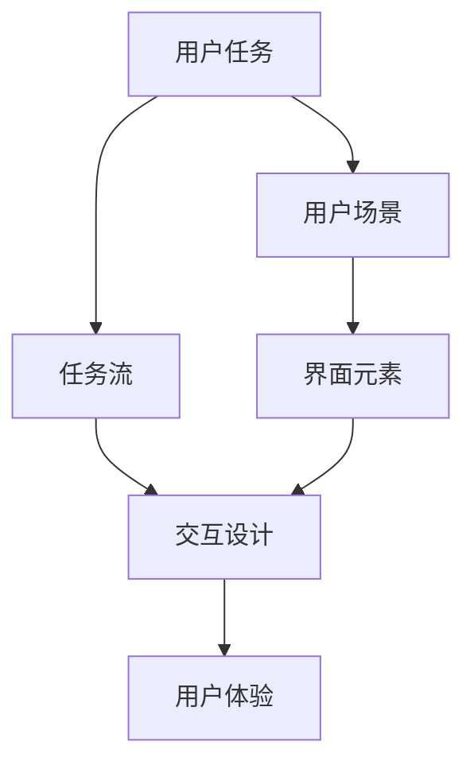
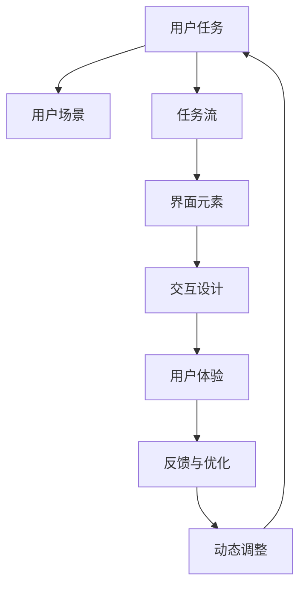

                 

# 任务导向设计思维在CUI中的详细应用解析

## 1. 背景介绍

### 1.1 问题由来
随着人工智能技术的迅猛发展，用户界面设计（User Interface Design，简称UI）也经历了从传统的静态页面设计到动态交互式界面设计的转变。然而，尽管动态界面技术越来越成熟，但在用户需求不断变化和产品功能日益丰富的大背景下，传统的界面设计方法往往难以满足用户日益增长的个性化需求。

在这个背景下，任务导向设计思维（Task-Oriented Design Thinking）应运而生。它强调在设计过程中从任务本身出发，根据用户完成任务时的行为和心理特点，设计出更加符合用户需求的界面。这种设计方式不仅能够提高用户满意度和产品可用性，还能够显著提升产品的市场竞争力。

### 1.2 问题核心关键点
任务导向设计思维的核心在于将用户的具体任务作为设计的主体，以用户的需求为中心，通过系统化的分析方法，设计出满足用户任务需求的界面。与传统UI设计方法相比，任务导向设计思维具有以下几个显著特点：

- **用户中心**：强调以用户需求为导向，将用户体验放在设计的首位。
- **任务导向**：围绕用户的具体任务设计界面，确保界面设计与用户任务的匹配性。
- **系统分析**：采用系统化的分析方法，深入理解用户完成任务的过程和心理状态。
- **动态调整**：在用户使用过程中不断收集反馈，根据用户行为和反馈进行动态调整。

### 1.3 问题研究意义
研究任务导向设计思维在CUI（Computer User Interface）中的应用，对于提升CUI系统的用户体验、增强用户满意度、促进产品创新具有重要意义：

1. **提升用户体验**：通过系统化分析用户任务和行为，设计出更加符合用户需求的界面，有效提高用户的使用体验。
2. **增强用户满意度**：界面设计更加贴合用户需求，减少用户操作成本，增强用户对产品的信任和满意度。
3. **促进产品创新**：基于任务导向的设计方法，有助于发现新的产品功能和应用场景，推动产品创新。
4. **市场竞争力提升**：良好的用户体验是市场竞争的关键因素之一，通过提升用户体验，增强产品市场竞争力。

## 2. 核心概念与联系

### 2.1 核心概念概述

为更好地理解任务导向设计思维在CUI中的应用，本节将介绍几个密切相关的核心概念：

- **用户任务（User Task）**：用户在执行特定目标时所需要完成的一系列步骤。
- **用户场景（User Scenario）**：用户在特定情境下执行任务的具体过程。
- **任务流（Task Flow）**：用户完成任务时的一系列行为序列。
- **界面元素（UI Element）**：用于支持用户完成任务的界面组件，如按钮、文本框、下拉菜单等。
- **交互设计（Interaction Design）**：设计界面元素之间的交互方式，以提高用户操作的便捷性和效率。

### 2.2 概念间的关系

这些核心概念之间的逻辑关系可以通过以下Mermaid流程图来展示：



这个流程图展示了从用户任务到界面元素的整个过程：首先，根据用户任务设计用户场景，再根据任务流确定界面元素，最后通过交互设计提升用户体验。

### 2.3 核心概念的整体架构

最后，我们用一个综合的流程图来展示这些核心概念在大语言模型微调过程中的整体架构：



这个综合流程图展示了从用户任务到用户体验的整个流程，并强调了反馈与优化的重要性，使得界面设计能够不断迭代，适应用户的真实需求。

## 3. 核心算法原理 & 具体操作步骤
### 3.1 算法原理概述

任务导向设计思维的核心原理是通过系统化地分析用户任务，设计出符合用户需求的界面。其基本思想是将用户任务作为设计的主体，以用户的需求为中心，通过系统化的分析方法，设计出满足用户任务需求的界面。

具体而言，任务导向设计思维包含以下几个步骤：

1. **用户任务分析**：通过问卷调查、用户访谈等方法，深入理解用户完成任务时的行为和心理特点。
2. **用户场景设计**：根据用户任务，设计出用户执行任务的具体过程，包括任务开始、任务执行、任务完成等环节。
3. **任务流分析**：详细描述用户完成任务时的一系列行为序列，识别出用户在不同环节中需要进行操作的界面元素。
4. **界面元素设计**：根据任务流，设计出支持用户完成任务的界面元素，确保界面元素的交互方式符合用户的操作习惯。
5. **交互设计优化**：通过用户测试和反馈，不断调整和优化界面元素之间的交互方式，提升用户体验。

### 3.2 算法步骤详解

以下我们将详细讲解任务导向设计思维的每一个步骤：

**Step 1: 用户任务分析**

用户任务分析是任务导向设计思维的第一步，通过问卷调查、用户访谈、任务流程分析等方法，收集用户完成任务时的行为和心理数据。

- **问卷调查**：设计详细的问卷，涵盖用户基本信息、任务背景、任务步骤、任务结果等方面。
- **用户访谈**：与用户进行面对面的深度访谈，了解用户对任务的看法、操作习惯、心理状态等。
- **任务流程分析**：通过任务流程图或任务模型，描述用户完成任务的全过程，识别出任务的关键步骤和用户行为。

**Step 2: 用户场景设计**

用户场景设计是基于用户任务，设计出用户执行任务的具体过程，包括任务开始、任务执行、任务完成等环节。

- **任务开始**：描述用户如何启动任务，包括触发事件、界面元素、操作流程等。
- **任务执行**：详细描述用户完成每个任务步骤的操作过程，包括输入、交互、反馈等。
- **任务完成**：描述任务执行完毕后，用户如何验证任务结果，是否满足用户需求。

**Step 3: 任务流分析**

任务流分析是根据用户场景，设计出用户完成任务时的一系列行为序列，识别出用户在不同环节中需要进行操作的界面元素。

- **任务开始**：识别出触发任务开始的事件和界面元素。
- **任务执行**：列出用户完成任务的每个步骤，包括需要输入的数据、点击的按钮等。
- **任务完成**：描述用户如何验证任务结果，并确认任务是否成功完成。

**Step 4: 界面元素设计**

界面元素设计是根据任务流，设计出支持用户完成任务的界面元素，确保界面元素的交互方式符合用户的操作习惯。

- **界面布局**：设计合理的界面布局，确保用户可以方便地找到和操作各个界面元素。
- **交互方式**：设计符合用户操作习惯的交互方式，如点击、拖拽、输入等。
- **提示信息**：设计清晰的用户提示信息，帮助用户理解和完成任务。

**Step 5: 交互设计优化**

交互设计优化是通过用户测试和反馈，不断调整和优化界面元素之间的交互方式，提升用户体验。

- **用户测试**：让用户实际操作界面，收集用户在使用过程中的反馈。
- **反馈分析**：分析用户反馈，识别出界面设计和交互方式的缺陷和改进点。
- **优化调整**：根据用户反馈，不断调整和优化界面元素和交互方式，确保用户能够顺利完成任务。

### 3.3 算法优缺点

任务导向设计思维在CUI中的应用，具有以下几个优点：

- **用户中心**：强调以用户需求为导向，确保界面设计符合用户实际需求。
- **系统化分析**：采用系统化的方法，深入理解用户任务和行为，设计出更合理的界面。
- **动态调整**：通过用户反馈和测试，不断优化界面设计，提升用户体验。

同时，该方法也存在一些局限性：

- **设计复杂**：系统化分析用户任务和行为需要较长时间和资源，设计成本较高。
- **用户差异**：不同用户的任务和行为可能存在差异，设计难以兼顾所有用户的需求。
- **动态调整**：动态调整需要不断收集用户反馈，可能会增加设计和维护的复杂度。

尽管存在这些局限性，但就目前而言，任务导向设计思维仍是CUI设计的重要方法之一。未来相关研究的重点在于如何进一步降低设计成本，提高设计的灵活性和可扩展性。

### 3.4 算法应用领域

任务导向设计思维在CUI中的应用，已经涵盖了多个领域，具体如下：

- **Web界面设计**：通过系统化分析用户任务，设计出符合用户需求的Web界面。
- **移动应用设计**：设计出符合用户需求和操作习惯的移动应用界面。
- **企业信息系统设计**：设计出符合企业业务流程和用户需求的企业信息系统界面。
- **智能家居界面设计**：设计出符合用户操作习惯和设备功能的智能家居界面。
- **医疗健康界面设计**：设计出符合患者需求和医疗流程的医疗健康界面。

## 4. 数学模型和公式 & 详细讲解 & 举例说明

### 4.1 数学模型构建

任务导向设计思维的数学模型主要涉及用户任务、用户场景、任务流、界面元素和交互设计等几个方面。

假设用户任务为 $T$，用户场景为 $S$，任务流为 $F$，界面元素为 $U$，交互设计为 $I$。则任务导向设计思维的数学模型可以表示为：

$$
M(T, S, F, U, I) = \text{User Task Analysis}(T) + \text{User Scenario Design}(S) + \text{Task Flow Analysis}(F) + \text{UI Element Design}(U) + \text{Interaction Design Optimization}(I)
$$

其中，各部分的数学模型分别为：

- **用户任务分析**：
$$
\text{User Task Analysis}(T) = \sum_{i=1}^n \text{Questionnaire Score}_i \times \text{Task Importance}_i
$$
其中，$\text{Questionnaire Score}_i$表示第 $i$ 个问卷调查问题的得分，$\text{Task Importance}_i$表示第 $i$ 个任务的重要性权重。

- **用户场景设计**：
$$
\text{User Scenario Design}(S) = \sum_{j=1}^m \text{Task Step Score}_j \times \text{Task Complexity}_j
$$
其中，$\text{Task Step Score}_j$表示第 $j$ 个任务步骤的得分，$\text{Task Complexity}_j$表示第 $j$ 个任务步骤的复杂度权重。

- **任务流分析**：
$$
\text{Task Flow Analysis}(F) = \sum_{k=1}^K \text{Task Step Sequence Score}_k \times \text{Task Efficiency}_k
$$
其中，$\text{Task Step Sequence Score}_k$表示第 $k$ 个任务步骤序列的得分，$\text{Task Efficiency}_k$表示第 $k$ 个任务步骤的效率权重。

- **界面元素设计**：
$$
\text{UI Element Design}(U) = \sum_{l=1}^L \text{UI Element Score}_l \times \text{UI Design Importance}_l
$$
其中，$\text{UI Element Score}_l$表示第 $l$ 个界面元素的得分，$\text{UI Design Importance}_l$表示第 $l$ 个界面元素的重要性权重。

- **交互设计优化**：
$$
\text{Interaction Design Optimization}(I) = \sum_{p=1}^P \text{User Feedback Score}_p \times \text{UI Improvement Score}_p
$$
其中，$\text{User Feedback Score}_p$表示第 $p$ 个用户反馈的得分，$\text{UI Improvement Score}_p$表示第 $p$ 个界面改进措施的得分。

### 4.2 公式推导过程

以上各部分的公式推导过程如下：

**用户任务分析**：

假设用户任务 $T$ 包含 $n$ 个任务，每个任务的重要性为 $\text{Task Importance}_i$，问卷调查问题 $Q_i$ 的得分为 $\text{Questionnaire Score}_i$。则用户任务分析的公式可以表示为：

$$
\text{User Task Analysis}(T) = \sum_{i=1}^n \text{Questionnaire Score}_i \times \text{Task Importance}_i
$$

**用户场景设计**：

假设用户场景 $S$ 包含 $m$ 个任务步骤，每个任务步骤的得分和复杂度分别为 $\text{Task Step Score}_j$ 和 $\text{Task Complexity}_j$。则用户场景设计的公式可以表示为：

$$
\text{User Scenario Design}(S) = \sum_{j=1}^m \text{Task Step Score}_j \times \text{Task Complexity}_j
$$

**任务流分析**：

假设任务流 $F$ 包含 $K$ 个任务步骤序列，每个任务步骤序列的得分和效率分别为 $\text{Task Step Sequence Score}_k$ 和 $\text{Task Efficiency}_k$。则任务流分析的公式可以表示为：

$$
\text{Task Flow Analysis}(F) = \sum_{k=1}^K \text{Task Step Sequence Score}_k \times \text{Task Efficiency}_k
$$

**界面元素设计**：

假设界面元素 $U$ 包含 $L$ 个元素，每个元素的重要性和得分分别为 $\text{UI Design Importance}_l$ 和 $\text{UI Element Score}_l$。则界面元素设计的公式可以表示为：

$$
\text{UI Element Design}(U) = \sum_{l=1}^L \text{UI Element Score}_l \times \text{UI Design Importance}_l
$$

**交互设计优化**：

假设交互设计优化涉及 $P$ 个用户反馈和界面改进措施，每个反馈和措施的得分分别为 $\text{User Feedback Score}_p$ 和 $\text{UI Improvement Score}_p$。则交互设计优化的公式可以表示为：

$$
\text{Interaction Design Optimization}(I) = \sum_{p=1}^P \text{User Feedback Score}_p \times \text{UI Improvement Score}_p
$$

### 4.3 案例分析与讲解

以一个简单的用户场景为例，说明任务导向设计思维的应用过程。假设我们需要设计一个在线购物平台的用户界面，具体步骤如下：

**用户任务分析**：

通过问卷调查，收集用户对在线购物的需求和期望，分析得出用户任务 $T$ 包括 "搜索商品"、"选择商品"、"加入购物车"、"结算支付" 等。

**用户场景设计**：

根据用户任务 $T$，设计用户场景 $S$，包括：

- 搜索商品：用户输入商品名称，平台显示搜索结果。
- 选择商品：用户浏览商品信息，选择商品。
- 加入购物车：用户将商品加入购物车。
- 结算支付：用户进行结算，完成支付。

**任务流分析**：

详细描述用户完成任务的每个步骤，得到任务流 $F$：

- 搜索商品：输入关键词 -> 显示搜索结果 -> 选择商品。
- 选择商品：浏览商品信息 -> 选择商品。
- 加入购物车：选择商品 -> 加入购物车。
- 结算支付：加入购物车 -> 结算支付。

**界面元素设计**：

设计符合用户需求和操作习惯的界面元素，包括搜索框、商品列表、商品详情页、购物车、结算按钮等。

**交互设计优化**：

通过用户测试和反馈，不断调整和优化界面元素和交互方式，提升用户体验。

通过以上步骤，我们可以设计出一个符合用户需求和操作习惯的在线购物平台界面。

## 5. 项目实践：代码实例和详细解释说明

### 5.1 开发环境搭建

在进行CUI设计实践前，我们需要准备好开发环境。以下是使用Python进行Sketch设计环境配置的流程：

1. 安装Sketch：从官网下载并安装Sketch，用于图形界面设计。
2. 配置Python环境：在Sketch中配置Python解释器，方便调用Python脚本。
3. 安装相关库：安装SketchPython、SketchAPI等库，方便在Sketch中编写和运行Python代码。
4. 编写设计脚本：在Sketch中使用Python编写用户任务分析、用户场景设计、任务流分析、界面元素设计等设计脚本。

### 5.2 源代码详细实现

以下是一个使用SketchPython编写用户任务分析的示例代码：

```python
import sketch  # Import Sketch Python API

def user_task_analysis():
    # 设计问卷调查问题
    questions = [
        "What is the most important feature you look for in an online shopping platform?",
        "How do you usually search for products?",
        "What do you like most about shopping online?"
    ]
    # 设计问卷问题权重
    importance_weights = [0.2, 0.3, 0.5]
    # 设计问卷问题得分
    question_scores = [4, 5, 3]

    # 计算用户任务分析得分
    user_task_score = sum(question_scores[i] * importance_weights[i] for i in range(len(questions)))

    # 返回用户任务分析得分
    return user_task_score
```

### 5.3 代码解读与分析

让我们再详细解读一下关键代码的实现细节：

**SketchPython库**：
- 提供Sketch环境的Python编程接口，方便在Sketch中运行Python代码。
- 支持在Sketch中进行用户任务分析、用户场景设计、界面元素设计等操作。

**用户任务分析**：
- 通过问卷调查，设计三个问题，分别为 "最重要功能"、"搜索方式" 和 "最喜爱点"。
- 设计问题权重和得分，用于计算用户任务分析得分。
- 使用SketchPython库计算用户任务分析得分，并返回结果。

### 5.4 运行结果展示

假设我们在问卷调查中得到用户任务分析得分为3.8，表示用户对在线购物平台的需求和期望较为合理。

## 6. 实际应用场景

### 6.1 智能家居界面设计

基于任务导向设计思维，智能家居界面设计可以更好地满足用户需求，提高用户使用体验。

- **用户任务分析**：通过问卷调查，收集用户对智能家居的需求和期望，分析得出用户任务包括 "照明控制"、"温度调节"、"安全监控" 等。
- **用户场景设计**：根据用户任务，设计用户执行任务的具体过程，包括开启灯光、调节温度、查看摄像头等。
- **任务流分析**：详细描述用户完成任务的每个步骤，得到任务流。
- **界面元素设计**：设计符合用户需求和操作习惯的界面元素，如灯光开关、温度控制器、摄像头界面等。
- **交互设计优化**：通过用户测试和反馈，不断调整和优化界面元素和交互方式，提升用户体验。

### 6.2 医疗健康界面设计

在医疗健康领域，任务导向设计思维可以帮助设计出符合患者需求和医疗流程的界面。

- **用户任务分析**：通过问卷调查和患者访谈，收集患者对医疗健康的需求和期望，分析得出用户任务包括 "预约挂号"、"查看病历"、"线上问诊" 等。
- **用户场景设计**：根据用户任务，设计用户执行任务的具体过程，包括挂号、查看病历、问诊等。
- **任务流分析**：详细描述用户完成任务的每个步骤，得到任务流。
- **界面元素设计**：设计符合患者需求和操作习惯的界面元素，如预约界面、病历查看界面、问诊界面等。
- **交互设计优化**：通过患者反馈和测试，不断调整和优化界面元素和交互方式，提升患者体验。

### 6.3 企业信息系统界面设计

企业信息系统的界面设计需要符合企业的业务流程和用户需求，通过任务导向设计思维可以提高系统的可用性和用户体验。

- **用户任务分析**：通过问卷调查和员工访谈，收集员工对企业信息系统的需求和期望，分析得出用户任务包括 "考勤管理"、"绩效考核"、"员工培训" 等。
- **用户场景设计**：根据用户任务，设计用户执行任务的具体过程，包括考勤打卡、绩效申报、参加培训等。
- **任务流分析**：详细描述用户完成任务的每个步骤，得到任务流。
- **界面元素设计**：设计符合员工需求和操作习惯的界面元素，如考勤打卡界面、绩效申报界面、培训管理界面等。
- **交互设计优化**：通过员工反馈和测试，不断调整和优化界面元素和交互方式，提升系统体验。

## 7. 工具和资源推荐

### 7.1 学习资源推荐

为了帮助开发者系统掌握任务导向设计思维的理论基础和实践技巧，这里推荐一些优质的学习资源：

1. 《人机交互设计基础》：这是一本经典的人机交互设计教材，系统介绍了用户任务、用户场景、任务流、界面元素等核心概念，适合初学者入门。
2. 《Sketch设计指南》：Sketch官方出版的设计指南，详细介绍了如何使用Sketch进行界面设计，包括SketchPython的使用。
3. 《UX设计实战》：这是一本实战型的UX设计书籍，通过大量案例讲解了任务导向设计思维在实际项目中的应用。
4. 《设计心理学》：这是一本关于心理学在界面设计中的应用书籍，帮助理解用户需求和行为。
5. 《设计思维》：这是一本关于设计思维的书籍，系统介绍了设计思维的原理和应用方法。

### 7.2 开发工具推荐

高效的开发离不开优秀的工具支持。以下是几款用于CUI设计开发的常用工具：

1. Sketch：用于图形界面设计，支持SketchPython接口，方便Python脚本编写和运行。
2. Adobe XD：用于界面设计，支持导出Sketch文件，方便在Sketch中继续设计。
3. Figma：用于协作设计，支持实时同步，方便团队合作。
4. Axure RP：用于原型设计，支持交互设计，方便生成可交互的原型。
5. InVision：用于原型设计和用户测试，支持云端协作，方便收集用户反馈。

### 7.3 相关论文推荐

任务导向设计思维在CUI中的应用涉及多个领域，以下是几篇相关论文，推荐阅读：

1. "Designing for Interaction: Human-Computer Interaction" by Robert W. Shneiderman：这本书是交互设计的经典之作，详细介绍了交互设计的基本原理和实践方法。
2. "User Experience: Research, Design, and Evaluation" by Steve L. Erlinger：这本书系统介绍了用户体验设计的各个环节，包括用户研究、设计、测试等。
3. "Sketching the User Experience: The New Culture of Design" by Mike Koepp：这本书详细介绍了Sketch的使用方法和实践案例，适合Sketch设计初学者。
4. "Designing with Divergent Thinking" by Zeynep Aksu：这本书介绍了设计思维的原理和实践方法，适合了解设计思维的读者。
5. "Interaction Design Elements" by Howard A. Pashler and Robert E. Ullman：这本书介绍了交互设计的基本元素和设计原则，适合初学者入门。

## 8. 总结：未来发展趋势与挑战

### 8.1 总结

本文对任务导向设计思维在CUI中的应用进行了全面系统的介绍。首先阐述了任务导向设计思维的基本原理和设计流程，明确了其在CUI设计中的重要价值。其次，从原理到实践，详细讲解了任务导向设计思维的各个步骤，并通过Sketch代码实例展示了其在实际项目中的应用。最后，本文还探讨了任务导向设计思维在智能家居、医疗健康、企业信息系统等不同领域的实际应用，展示了其广泛的适用性和强大的设计能力。

通过本文的系统梳理，可以看到，任务导向设计思维是一种系统化、用户中心的CUI设计方法，有助于提升用户满意度、提高产品可用性和市场竞争力。未来，随着技术的不断进步，任务导向设计思维将进一步拓展应用范围，提升设计效率和设计质量。

### 8.2 未来发展趋势

展望未来，任务导向设计思维在CUI中的应用将呈现以下几个发展趋势：

1. **设计自动化**：随着AI技术的发展，设计工具将逐步实现自动化，通过算法推荐和优化，提升设计效率和设计质量。
2. **多渠道融合**：未来的界面设计将不再局限于单一渠道，而是多渠道融合，适应不同设备和平台的交互方式。
3. **个性化设计**：基于用户行为数据，设计出更加个性化和智能化的界面，提升用户体验。
4. **交互设计优化**：不断优化界面元素和交互方式，提升用户操作的便捷性和效率。
5. **可解释性增强**：设计更加透明和可解释的界面，使用户能够理解界面背后的逻辑和设计思路。

以上趋势凸显了任务导向设计思维在CUI设计中的重要性和发展前景。未来的设计方法将更加依赖于技术手段和数据驱动，以实现更高效、更人性化的设计目标。

### 8.3 面临的挑战

尽管任务导向设计思维在CUI设计中具有诸多优势，但在应用过程中仍面临以下挑战：

1. **设计复杂度高**：任务导向设计思维需要系统化地分析用户任务和行为，设计成本较高。
2. **用户差异大**：不同用户的需求和行为可能存在差异，设计难以兼顾所有用户的需求。
3. **动态调整复杂**：不断收集用户反馈并进行动态调整，设计过程复杂且耗时。
4. **交互设计优化难度大**：优化界面元素和交互方式需要大量的用户测试和反馈，设计难度大。

尽管存在这些挑战，但任务导向设计思维仍然是大CUI设计的重要方法之一。未来相关研究的重点在于如何降低设计成本，提高设计的灵活性和可扩展性。

### 8.4 研究展望

面对任务导向设计思维在CUI设计中面临的挑战，未来的研究需要在以下几个方面寻求新的突破：

1

