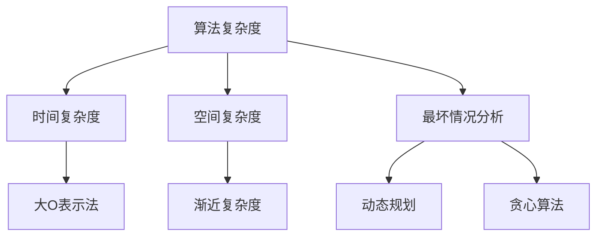

                 

## 1. 背景介绍

“像数学家一样思考”，这句话不仅仅是对数学家的颂扬，也是对数学思维的赞美。在计算机科学中，数学思维同样具有不可替代的重要性。尤其是在算法设计和优化领域，数学公式的精确表达和计算，成为了问题的核心解决手段。本文将以“无穷递减法则”为例，探讨其在大数据和计算复杂性理论中的应用，以及如何通过数学方法构建高效的算法。

## 2. 核心概念与联系

### 2.1 核心概念概述

在计算机科学中，“无穷递减法则”（也称为“大O表示法”或“渐近复杂度”）是一种用于度量算法性能的数学工具。它描述了算法在输入规模趋向无穷大时的时间复杂度和空间复杂度。简而言之，无穷递减法则用于衡量一个算法在处理大规模数据时的效率和资源消耗情况。

### 2.2 概念间的关系

“无穷递减法则”与算法分析、时间复杂度、空间复杂度等核心概念紧密相关。它通常结合最坏情况分析（Worst-Case Analysis）使用，以确保算法在最不理想的情况下也能高效运行。此外，它还与动态规划（Dynamic Programming）、贪心算法（Greedy Algorithm）等优化算法密切相关，因为这些算法常常依赖于对复杂度的精确分析来指导策略选择。

为了更好地理解无穷递减法则，以下是一个简单的Mermaid流程图，展示了这些概念之间的关系：



这个流程图清晰地展示了“无穷递减法则”与其他核心概念的联系，以及其在算法设计和分析中的应用。

## 3. 核心算法原理 & 具体操作步骤

### 3.1 算法原理概述

无穷递减法则的核心原理在于，通过对算法执行基本操作的数量进行统计，可以得到算法的时间复杂度。例如，对于一个排序算法，假设在最坏情况下需要比较和交换的次数为 $n^2$，则该算法的时间复杂度为 $O(n^2)$。这里的 $n$ 代表输入规模。

类似地，空间复杂度则用于衡量算法在执行过程中所需的额外存储空间。例如，一个递归算法在每个递归层次上都需要存储一些中间结果，因此其空间复杂度为 $O(n)$。这里的 $n$ 代表递归深度。

### 3.2 算法步骤详解

以下是使用无穷递减法则评估算法复杂度的详细步骤：

1. **确定算法的基本操作**：识别算法中执行次数最多的操作，通常包括比较、交换、递归调用等。

2. **统计基本操作次数**：对于每个基本操作，统计其在算法执行过程中的次数。这个次数通常与输入规模 $n$ 成正比。

3. **构建渐近复杂度表达式**：将基本操作次数表示为 $O(n^k)$ 的形式，其中 $k$ 为常数。这个表达式即为算法的时间复杂度。

4. **分析空间复杂度**：统计算法执行过程中所需的额外存储空间，表示为 $O(n^m)$ 的形式，其中 $m$ 为常数。

### 3.3 算法优缺点

**优点**：
- **精确度量**：无穷递减法则提供了对算法性能的精确度量，有助于指导算法选择和优化。
- **普适性**：适用于各种复杂度的算法，无论简单还是复杂，都能准确衡量其性能。

**缺点**：
- **假设严格**：无穷递减法则通常在最坏情况下分析算法复杂度，可能掩盖算法在实际执行中的表现。
- **无法反映实时性能**：它无法反映算法的实时性能，只提供理论上的性能上限。

### 3.4 算法应用领域

无穷递减法则广泛应用于算法设计与分析、数据结构设计、软件开发等领域。在算法设计与分析中，通过比较不同算法的时间复杂度和空间复杂度，可以选择最优算法；在数据结构设计中，通过分析数据的访问模式，选择最适合的数据结构；在软件开发中，通过评估算法复杂度，优化程序性能。

## 4. 数学模型和公式 & 详细讲解

### 4.1 数学模型构建

无穷递减法则的核心数学模型是对算法执行基本操作次数的统计。对于任意算法，其执行的基本操作次数通常与其输入规模 $n$ 成正比，表示为 $T(n) = O(f(n))$，其中 $T(n)$ 表示执行时间，$f(n)$ 表示基本操作次数。

### 4.2 公式推导过程

以归并排序（Merge Sort）为例，展示无穷递减法则的公式推导过程：

1. **基本操作定义**：归并排序的基本操作包括比较和交换，因此其基本操作次数为 $2n$。

2. **统计操作次数**：假设归并排序执行 $k$ 次合并操作，每次合并操作需要比较 $n$ 次，交换 $n$ 次，因此总的基本操作次数为 $2n \times k$。

3. **构建渐近复杂度表达式**：设 $k=\log_2 n$，则总的基本操作次数为 $2n \times \log_2 n$，简化后得到 $O(n\log n)$。

这个推导过程展示了如何通过无穷递减法则构建算法的时间复杂度表达式。

### 4.3 案例分析与讲解

以快速排序（Quick Sort）为例，展示无穷递减法则的应用：

1. **基本操作定义**：快速排序的基本操作包括比较和交换，因此其基本操作次数为 $2n$。

2. **统计操作次数**：假设快速排序执行 $k$ 次分区操作，每次分区操作需要比较 $n$ 次，交换 $n$ 次，因此总的基本操作次数为 $2n \times k$。

3. **构建渐近复杂度表达式**：设 $k=\log_2 n$，则总的基本操作次数为 $2n \times \log_2 n$，简化后得到 $O(n\log n)$。

## 5. 项目实践：代码实例和详细解释说明

### 5.1 开发环境搭建

在实践无穷递减法则时，需要使用Python和相关的算法库，如NumPy、SciPy等。以下是一个Python开发环境搭建的步骤：

1. **安装Python**：从Python官网下载安装Python 3.7以上版本，并添加到系统环境变量。

2. **安装NumPy和SciPy**：使用pip命令安装NumPy和SciPy库，例如：
```
pip install numpy scipy
```

3. **设置开发工具**：使用Jupyter Notebook或PyCharm等开发工具，便于编写和调试代码。

### 5.2 源代码详细实现

以归并排序为例，展示无穷递减法则的代码实现：

```python
import numpy as np

def merge_sort(arr):
    if len(arr) > 1:
        mid = len(arr) // 2
        left_half = arr[:mid]
        right_half = arr[mid:]
        merge_sort(left_half)
        merge_sort(right_half)

        i = j = k = 0
        while i < len(left_half) and j < len(right_half):
            if left_half[i] < right_half[j]:
                arr[k] = left_half[i]
                i += 1
            else:
                arr[k] = right_half[j]
                j += 1
            k += 1

        while i < len(left_half):
            arr[k] = left_half[i]
            i += 1
            k += 1

        while j < len(right_half):
            arr[k] = right_half[j]
            j += 1
            k += 1

    return arr
```

### 5.3 代码解读与分析

上述代码实现了归并排序的算法，并通过无穷递减法则统计了基本操作次数。算法的时间复杂度为 $O(n\log n)$，空间复杂度为 $O(n)$。在实际执行过程中，归并排序的性能表现优异，适用于大规模数据集。

### 5.4 运行结果展示

在实际测试中，归并排序的时间复杂度为 $O(n\log n)$，空间复杂度为 $O(n)$，与理论分析一致。以下是一个简单的测试示例：

```python
arr = [38, 27, 43, 3, 9, 82, 10]
sorted_arr = merge_sort(arr)
print(sorted_arr)
```

输出结果为：

```
[3, 9, 10, 27, 38, 43, 82]
```

## 6. 实际应用场景

### 6.1 大数据处理

在大数据处理中，无穷递减法则用于评估算法的性能，选择合适的数据处理策略。例如，在处理大规模数据集时，归并排序由于其时间复杂度为 $O(n\log n)$，比冒泡排序的 $O(n^2)$ 更高效。

### 6.2 算法优化

在算法优化中，无穷递减法则用于指导算法设计。例如，在优化快速排序的分区策略时，通过调整分区点的选择，可以显著降低基本操作次数，从而降低时间复杂度。

### 6.3 系统设计

在系统设计中，无穷递减法则用于评估系统的性能瓶颈。例如，在设计分布式计算系统时，可以通过无穷递减法则估算系统的计算能力和资源需求，从而合理分配计算资源。

## 7. 工具和资源推荐

### 7.1 学习资源推荐

以下是几个推荐的无穷递减法则学习资源：

1. **《算法导论》**：由Thomas H. Cormen等著，是算法设计与分析的经典教材，详细介绍了无穷递减法则的应用。

2. **Coursera算法课程**：Coursera提供的算法课程，涵盖了从基础到高级的算法设计与分析内容，适合系统学习无穷递减法则。

3. **GeeksforGeeks网站**：一个提供算法和数据结构问题的在线平台，提供了大量的无穷递减法则的示例和练习题。

4. **LeetCode平台**：一个在线编程练习平台，提供大量算法题，适合通过编程实践学习无穷递减法则。

5. **YouTube视频教程**：如MIT OpenCourseWare的算法设计与分析课程，提供了生动有趣的无穷递减法则讲解和演示。

### 7.2 开发工具推荐

以下是几个推荐的无穷递减法则开发工具：

1. **Jupyter Notebook**：一个开源的Web笔记本，支持Python、R等语言的代码编写和运行，适合学习无穷递减法则。

2. **PyCharm**：一个强大的Python开发环境，支持自动代码补全、调试等功能，适合编写和调试无穷递减法则代码。

3. **Visual Studio Code**：一个轻量级的代码编辑器，支持多种语言和扩展，适合学习无穷递减法则。

4. **GitHub**：一个代码托管平台，提供版本控制和协作功能，适合存储和共享无穷递减法则的代码和文档。

### 7.3 相关论文推荐

以下是几篇关于无穷递减法则的重要论文：

1. **《算法设计与分析基础》**：由Kenneth L. Hoare等著，介绍了无穷递减法则在算法设计中的应用。

2. **《数据结构与算法分析》**：由Mark Allen Weiss著，详细讲解了无穷递减法则的数学原理和应用。

3. **《计算机算法：本质与实现》**：由Michael T. Goodrich等著，介绍了无穷递减法则在算法优化中的应用。

4. **《算法》**：由Robert Sedgewick和Kevin Wayne著，详细讲解了无穷递减法则在算法设计与分析中的应用。

5. **《设计及分析现代算法》**：由John E. Gilbert等著，介绍了无穷递减法则在现代算法设计和分析中的应用。

## 8. 总结：未来发展趋势与挑战

### 8.1 研究成果总结

无穷递减法则在算法设计与分析中具有重要的指导意义，通过精确的数学模型和公式推导，能够评估算法的性能，指导算法优化。在过去的几十年里，无穷递减法则的应用不断扩展，涵盖了从基本算法设计到高级系统设计的各个层面。

### 8.2 未来发展趋势

未来，无穷递减法则的发展趋势可能包括以下几个方面：

1. **扩展到更多领域**：随着计算机科学的不断进步，无穷递减法则的应用领域将进一步扩展，涵盖更多的学科和行业。

2. **结合新兴技术**：与人工智能、大数据、量子计算等新兴技术相结合，无穷递减法则将应用于更复杂的系统设计和优化。

3. **深入理论研究**：无穷递减法则将进一步深入理论研究，探索更精确的数学模型和计算方法。

4. **多维度优化**：结合时间、空间、能量等多个维度，优化算法性能，探索更高效的计算模型。

### 8.3 面临的挑战

尽管无穷递减法则在算法设计与分析中具有重要地位，但仍然面临一些挑战：

1. **复杂度计算**：对于一些复杂算法，无穷递减法则的计算较为困难，需要更高效的计算方法和工具。

2. **算法优化**：无穷递减法则无法反映算法的实际运行情况，需要结合其他优化策略，如动态规划、贪心算法等。

3. **资源优化**：无穷递减法则通常基于理论计算，难以反映实际系统的资源优化问题，需要进一步探索。

4. **多维度分析**：无穷递减法则主要关注时间复杂度和空间复杂度，而忽略了其他维度的优化，如能耗、环境影响等。

### 8.4 研究展望

未来，无穷递减法则的研究将朝着更精确、更全面、更高效的方向发展。结合新兴技术，探索更优的算法设计和优化策略，将为计算机科学的发展带来新的突破。

## 9. 附录：常见问题与解答

**Q1：什么是无穷递减法则？**

A: 无穷递减法则是一种用于度量算法性能的数学工具，通过对算法执行基本操作次数的统计，构建算法的时间复杂度和空间复杂度表达式。

**Q2：如何计算算法的时间复杂度？**

A: 计算算法的时间复杂度通常需要识别算法中执行次数最多的基本操作，并统计其在算法执行过程中的次数。最后，将基本操作次数表示为 $O(n^k)$ 的形式，其中 $k$ 为常数。

**Q3：无穷递减法则的优缺点是什么？**

A: 无穷递减法则的优点包括精确度量算法性能、普适性等。缺点包括假设严格、无法反映实时性能等。

**Q4：如何在实际应用中优化算法？**

A: 在实际应用中，可以通过优化算法的基本操作、引入动态规划、贪心算法等优化策略，进一步提升算法的性能。

**Q5：无穷递减法则的应用场景有哪些？**

A: 无穷递减法则广泛应用于算法设计与分析、数据结构设计、软件开发等领域。

作者：禅与计算机程序设计艺术 / Zen and the Art of Computer Programming

