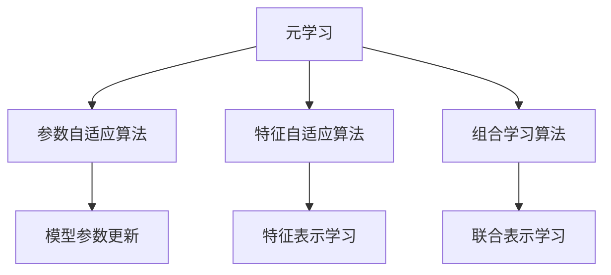
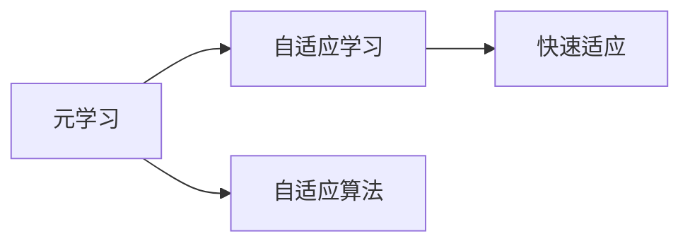
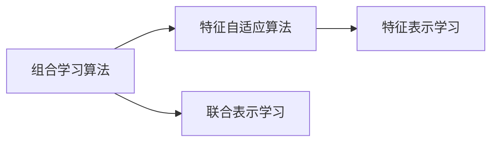
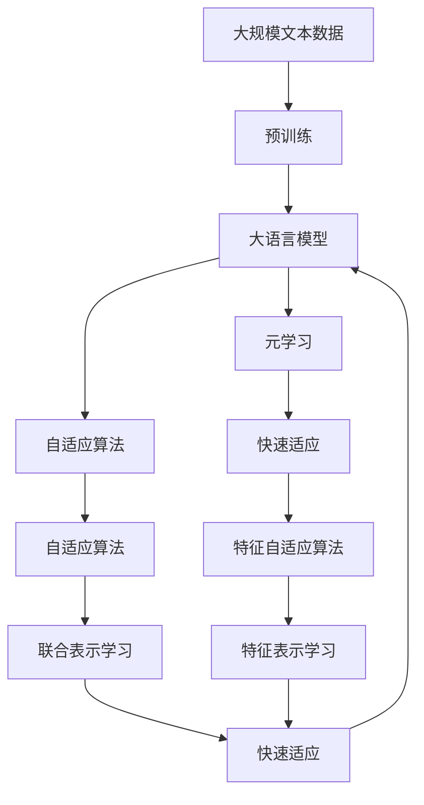

                 

# 元学习 (Meta Learning) 原理与代码实例讲解

> 关键词：元学习, 快速适应, 通用学习, 模型训练, 梯度下降, 超参数优化, 自适应算法

## 1. 背景介绍

### 1.1 问题由来
元学习（Meta Learning），也被称为快速适应（Few-shot Learning）或自适应学习（Adaptive Learning），是一种通过少量样本来快速适应新任务的学习方式。在传统机器学习中，模型需要从大量数据中学习通用特征，然后应用于新数据，从而提升性能。然而，在大数据时代，获取大量标注数据变得困难且昂贵。元学习通过在少量数据上学习任务无关的特征，然后将其应用于新任务，从而在数据有限的情况下也能获得较好的性能。

元学习的典型应用包括推荐系统、图像分类、自然语言处理等领域。例如，推荐系统可以根据用户历史行为数据，快速适应新用户的行为特征，从而提高推荐质量；图像分类模型可以根据少量标签样本，快速适应新的图像分类任务，提升分类准确度。

### 1.2 问题核心关键点
元学习的核心在于如何通过少量样本学习通用特征，然后将其应用于新任务。元学习的目标是让模型能够快速适应新数据，即在新任务上达到较好的性能，同时保持已有任务的性能不变。常见的元学习算法包括：

- 参数自适应算法（Parameter-Adaptive），如MAML（Model-Agnostic Meta-Learning），通过在训练集上学习一组通用的参数更新规则，然后将其应用于新任务。
- 特征自适应算法（Feature-Adaptive），如Prototypical Networks，通过学习任务无关的特征表示，然后将其应用于新任务。
- 组合学习算法（Combination Learning），如Reinforcement Learning，通过学习任务和数据分布的联合表示，然后将其应用于新任务。

元学习的效果很大程度上取决于如何选择合适的元学习算法和超参数。如何优化超参数组合，以最大化元学习的性能，是元学习的关键挑战之一。

### 1.3 问题研究意义
元学习的研究意义在于：

- 降低对数据量的依赖。传统的机器学习模型需要大量的标注数据来训练，元学习可以在少量标注数据上快速学习模型，从而降低数据获取成本。
- 提高模型的泛化能力。元学习通过学习通用的特征表示，能够在不同任务上获得较好的泛化性能，减少模型过拟合的风险。
- 加速模型训练和部署。元学习能够在模型训练阶段自动适应新数据，减少人工干预，从而提高模型训练和部署的效率。
- 支持模型的增量学习。元学习可以在现有模型的基础上快速适应新任务，支持模型的增量学习和持续优化。

总之，元学习通过在少量数据上学习通用特征，实现了快速适应新任务的目的，是机器学习领域的一个重要研究方向。

## 2. 核心概念与联系

### 2.1 核心概念概述

为更好地理解元学习，本节将介绍几个密切相关的核心概念：

- 元学习(Meta Learning)：通过少量样本来快速适应新任务的学习方式，目标是在新任务上达到与现有任务相似的性能。
- 快速适应(Few-shot Learning)：指在只有少量标注数据的情况下，模型能够快速适应新任务，无需进行大规模重新训练。
- 自适应学习(Adaptive Learning)：指模型能够自动适应数据分布的变化，保持性能不变。
- 参数自适应算法(Parameter-Adaptive)：通过学习通用的参数更新规则，快速适应新任务。
- 特征自适应算法(Feature-Adaptive)：通过学习任务无关的特征表示，快速适应新任务。
- 组合学习算法(Combination Learning)：通过学习任务和数据分布的联合表示，快速适应新任务。

这些概念之间的逻辑关系可以通过以下Mermaid流程图来展示：



这个流程图展示了元学习的核心概念及其之间的关系：

1. 元学习是快速适应和自适应学习的总称，涵盖多种算法实现方式。
2. 参数自适应算法通过学习通用的参数更新规则，实现快速适应新任务。
3. 特征自适应算法通过学习任务无关的特征表示，实现快速适应新任务。
4. 组合学习算法通过学习任务和数据分布的联合表示，实现快速适应新任务。

### 2.2 概念间的关系

这些核心概念之间存在着紧密的联系，形成了元学习的完整生态系统。下面我们通过几个Mermaid流程图来展示这些概念之间的关系。

#### 2.2.1 元学习与自适应学习的关系



这个流程图展示了元学习与自适应学习的关系：

1. 元学习是自适应学习的总称，涵盖多种自适应算法实现方式。
2. 快速适应是元学习的一种形式，指在少量样本上快速适应新任务。
3. 自适应算法包括参数自适应算法、特征自适应算法、组合学习算法等。

#### 2.2.2 参数自适应算法与特征自适应算法的关系


这个流程图展示了参数自适应算法与特征自适应算法的关系：

1. 参数自适应算法通过学习通用的参数更新规则，实现快速适应新任务。
2. 特征自适应算法通过学习任务无关的特征表示，实现快速适应新任务。
3. 特征表示学习是特征自适应算法的核心步骤，通过学习通用的特征表示，实现快速适应新任务。

#### 2.2.3 组合学习算法与特征自适应算法的关系



这个流程图展示了组合学习算法与特征自适应算法的关系：

1. 组合学习算法通过学习任务和数据分布的联合表示，实现快速适应新任务。
2. 特征自适应算法通过学习任务无关的特征表示，实现快速适应新任务。
3. 联合表示学习是组合学习算法的核心步骤，通过学习任务和数据分布的联合表示，实现快速适应新任务。

### 2.3 核心概念的整体架构

最后，我们用一个综合的流程图来展示这些核心概念在大语言模型微调过程中的整体架构：



这个综合流程图展示了从预训练到大语言模型微调的完整过程。大语言模型首先在大规模文本数据上进行预训练，然后通过元学习或自适应算法进行微调，实现快速适应新任务。元学习包括特征自适应和组合学习两种方式，可以通过学习通用的特征表示或联合表示，实现快速适应新任务。自适应算法是元学习的一种实现方式，包括参数自适应算法和特征自适应算法。特征自适应算法学习通用的特征表示，组合学习算法学习任务和数据分布的联合表示。通过这些算法，大语言模型能够快速适应新任务，提升性能。

## 3. 核心算法原理 & 具体操作步骤
### 3.1 算法原理概述

元学习的核心思想是在少量数据上学习通用的特征表示，然后将其应用于新任务，从而快速适应新任务。常见的元学习算法包括：

- MAML：通过学习一组通用的参数更新规则，快速适应新任务。
- Prototypical Networks：通过学习任务无关的特征表示，快速适应新任务。
- 自适应算法：通过学习通用的特征表示或联合表示，快速适应新任务。

形式化地，假设有一个元学习任务 $\mathcal{T}$，包含 $n$ 个训练集 $\{(x_i, y_i)\}_{i=1}^n$，其中 $x_i \in \mathcal{X}$ 为输入，$y_i \in \mathcal{Y}$ 为标签。给定新任务 $\mathcal{T'}$，包含 $m$ 个未标注样本 $\{x_{n+1}, x_{n+2}, \ldots, x_{n+m}\}$，其中 $x_{n+i} \in \mathcal{X'}$ 为输入。元学习的目标是通过学习通用的特征表示，使得模型在新任务上能够快速适应新样本，即：

$$
\min_{\theta} \mathcal{L}_{\mathcal{T'}}(\theta) = \frac{1}{m} \sum_{i=n+1}^{n+m} \ell(\theta, x_{n+i})
$$

其中 $\ell(\theta, x_{n+i})$ 为新任务上的损失函数，$\theta$ 为模型参数。

### 3.2 算法步骤详解

元学习的常见算法包括MAML和Prototypical Networks。下面以MAML为例，详细讲解元学习算法的基本步骤：

#### 3.2.1 算法步骤

1. **数据准备**：准备元学习任务 $\mathcal{T}$ 的数据集 $\{(x_i, y_i)\}_{i=1}^n$，以及新任务 $\mathcal{T'}$ 的未标注数据集 $\{x_{n+1}, x_{n+2}, \ldots, x_{n+m}\}$。
2. **模型初始化**：初始化模型参数 $\theta$，如随机初始化或使用预训练模型的参数。
3. **内层优化**：在每个训练集上，对模型进行 $K$ 次梯度下降迭代，更新模型参数。具体步骤如下：
   - 随机选择一个样本 $(x_i, y_i)$ 作为支持集。
   - 在支持集上，使用梯度下降法对模型进行 $K$ 次迭代，更新模型参数 $\theta$。
   - 在验证集上，计算模型在新任务上的损失，作为元学习的元损失。
4. **外层优化**：在每个训练集上，使用元损失函数对模型进行梯度下降更新，使得模型在新任务上能够快速适应新样本。具体步骤如下：
   - 在每个训练集上，使用梯度下降法对模型进行 $E$ 次迭代，更新模型参数 $\theta$。
   - 在验证集上，计算模型在新任务上的损失，作为元学习的元损失。
5. **模型测试**：在新任务 $\mathcal{T'}$ 的未标注数据集 $\{x_{n+1}, x_{n+2}, \ldots, x_{n+m}\}$ 上进行测试，评估模型的性能。

#### 3.2.2 参数更新

MAML的核心思想是通过学习通用的参数更新规则，快速适应新任务。具体地，假设模型 $f_{\theta}(x)$ 在训练集 $\mathcal{T}$ 上的元损失函数为 $\mathcal{L}(\theta)$，则在每个训练集上，使用梯度下降法更新模型参数 $\theta$ 的公式为：

$$
\theta'_i = \theta - \frac{\eta}{K} \sum_{j=1}^K \nabla_{\theta} \ell(f_{\theta_i}(x_j), y_j)
$$

其中 $\theta_i$ 为第 $i$ 个训练集上的模型参数，$\eta$ 为学习率，$K$ 为梯度下降的迭代次数。在每个训练集上，使用梯度下降法对模型进行 $K$ 次迭代，更新模型参数 $\theta_i$。

在验证集上，计算模型在新任务 $\mathcal{T'}$ 上的元损失函数 $\mathcal{L}_{\mathcal{T'}}(\theta)$，作为元学习的目标。具体地，假设模型 $f_{\theta'}(x)$ 在新任务 $\mathcal{T'}$ 上的损失函数为 $\ell(f_{\theta'}(x), y)$，则在验证集上计算模型在新任务上的元损失函数为：

$$
\mathcal{L}_{\mathcal{T'}}(\theta) = \frac{1}{m} \sum_{i=n+1}^{n+m} \ell(f_{\theta'}(x_{n+i}), y_{n+i})
$$

在每个训练集上，使用梯度下降法对模型进行 $E$ 次迭代，更新模型参数 $\theta$。在验证集上，计算模型在新任务上的元损失函数 $\mathcal{L}_{\mathcal{T'}}(\theta)$，作为元学习的目标。

### 3.3 算法优缺点

元学习算法的优点在于：

1. 快速适应新任务。元学习通过学习通用的特征表示或联合表示，能够在少量数据上快速适应新任务。
2. 泛化能力强。元学习算法学习通用的特征表示，能够在新任务上获得较好的泛化性能。
3. 模型训练时间短。元学习算法通常只需要在少量数据上进行多次梯度下降迭代，训练时间较短。
4. 适应性强。元学习算法可以适应多种任务形式，包括分类、回归、生成等。

元学习算法的缺点在于：

1. 需要大量计算资源。元学习算法需要多次梯度下降迭代，计算资源消耗较大。
2. 数据需求高。元学习算法需要较多的训练集和验证集，数据需求较高。
3. 模型复杂度高。元学习算法通常需要设计复杂的元损失函数和内层优化算法，模型复杂度较高。
4. 可解释性差。元学习算法通常缺乏可解释性，难以理解其内部工作机制。

尽管存在这些局限性，但元学习算法在实际应用中已经取得了显著的效果，广泛应用于推荐系统、图像分类、自然语言处理等领域。未来相关研究将继续优化算法设计，降低计算资源消耗，提高数据利用率，提升模型的可解释性，从而推动元学习算法的普及应用。

### 3.4 算法应用领域

元学习算法已经在多个领域得到广泛应用，具体包括：

- 推荐系统：通过学习用户历史行为，快速适应新用户的推荐任务。
- 图像分类：通过学习通用的图像特征，快速适应新图像分类任务。
- 自然语言处理：通过学习通用的语言表示，快速适应新语言任务，如情感分析、问答系统等。
- 机器人学习：通过学习通用的运动控制策略，快速适应新环境。
- 医疗诊断：通过学习通用的疾病特征，快速适应新病人的诊断任务。
- 金融预测：通过学习通用的市场趋势，快速适应新数据。

这些应用场景展示了元学习算法在实际问题中的广泛适用性。未来，元学习算法将进一步拓展其应用范围，推动更多领域的智能化进程。

## 4. 数学模型和公式 & 详细讲解  
### 4.1 数学模型构建

本节将使用数学语言对元学习算法进行更加严格的刻画。

假设元学习任务 $\mathcal{T}$ 包含 $n$ 个训练集 $\{(x_i, y_i)\}_{i=1}^n$，其中 $x_i \in \mathcal{X}$ 为输入，$y_i \in \mathcal{Y}$ 为标签。给定新任务 $\mathcal{T'}$，包含 $m$ 个未标注样本 $\{x_{n+1}, x_{n+2}, \ldots, x_{n+m}\}$，其中 $x_{n+i} \in \mathcal{X'}$ 为输入。假设模型 $f_{\theta}(x)$ 在训练集 $\mathcal{T}$ 上的元损失函数为 $\mathcal{L}(\theta)$，在新任务 $\mathcal{T'}$ 上的损失函数为 $\ell(\theta, x)$。

定义模型 $f_{\theta'}(x)$ 在新任务 $\mathcal{T'}$ 上的元损失函数 $\mathcal{L}_{\mathcal{T'}}(\theta)$，则在每个训练集上，使用梯度下降法更新模型参数 $\theta$ 的公式为：

$$
\theta'_i = \theta - \frac{\eta}{K} \sum_{j=1}^K \nabla_{\theta} \ell(f_{\theta_i}(x_j), y_j)
$$

其中 $\theta_i$ 为第 $i$ 个训练集上的模型参数，$\eta$ 为学习率，$K$ 为梯度下降的迭代次数。在每个训练集上，使用梯度下降法对模型进行 $K$ 次迭代，更新模型参数 $\theta_i$。

在验证集上，计算模型在新任务 $\mathcal{T'}$ 上的元损失函数 $\mathcal{L}_{\mathcal{T'}}(\theta)$，作为元学习的目标。具体地，假设模型 $f_{\theta'}(x)$ 在新任务 $\mathcal{T'}$ 上的损失函数为 $\ell(f_{\theta'}(x), y)$，则在验证集上计算模型在新任务上的元损失函数为：

$$
\mathcal{L}_{\mathcal{T'}}(\theta) = \frac{1}{m} \sum_{i=n+1}^{n+m} \ell(f_{\theta'}(x_{n+i}), y_{n+i})
$$

在每个训练集上，使用梯度下降法对模型进行 $E$ 次迭代，更新模型参数 $\theta$。在验证集上，计算模型在新任务上的元损失函数 $\mathcal{L}_{\mathcal{T'}}(\theta)$，作为元学习的目标。

### 4.2 公式推导过程

以下我们以MAML为例，推导MAML算法的具体公式。

假设模型 $f_{\theta}(x)$ 在训练集 $\mathcal{T}$ 上的元损失函数为 $\mathcal{L}(\theta)$，则在新任务 $\mathcal{T'}$ 上的元损失函数为：

$$
\mathcal{L}_{\mathcal{T'}}(\theta) = \frac{1}{m} \sum_{i=n+1}^{n+m} \ell(f_{\theta'}(x_{n+i}), y_{n+i})
$$

其中 $\theta'$ 为在新任务 $\mathcal{T'}$ 上的模型参数。根据MAML算法，模型参数的更新公式为：

$$
\theta'_i = \theta - \frac{\eta}{K} \sum_{j=1}^K \nabla_{\theta} \ell(f_{\theta_i}(x_j), y_j)
$$

其中 $\theta_i$ 为第 $i$ 个训练集上的模型参数，$\eta$ 为学习率，$K$ 为梯度下降的迭代次数。在每个训练集上，使用梯度下降法对模型进行 $K$ 次迭代，更新模型参数 $\theta_i$。

在验证集上，计算模型在新任务 $\mathcal{T'}$ 上的元损失函数 $\mathcal{L}_{\mathcal{T'}}(\theta)$，作为元学习的目标。具体地，假设模型 $f_{\theta'}(x)$ 在新任务 $\mathcal{T'}$ 上的损失函数为 $\ell(f_{\theta'}(x), y)$，则在验证集上计算模型在新任务上的元损失函数为：

$$
\mathcal{L}_{\mathcal{T'}}(\theta) = \frac{1}{m} \sum_{i=n+1}^{n+m} \ell(f_{\theta'}(x_{n+i}), y_{n+i})
$$

在每个训练集上，使用梯度下降法对模型进行 $E$ 次迭代，更新模型参数 $\theta$。在验证集上，计算模型在新任务上的元损失函数 $\mathcal{L}_{\mathcal{T'}}(\theta)$，作为元学习的目标。

## 5. 项目实践：代码实例和详细解释说明
### 5.1 开发环境搭建

在进行元学习实践前，我们需要准备好开发环境。以下是使用Python进行PyTorch开发的环境配置流程：

1. 安装Anaconda：从官网下载并安装Anaconda，用于创建独立的Python环境。

2. 创建并激活虚拟环境：
```bash
conda create -n pytorch-env python=3.8 
conda activate pytorch-env
```

3. 安装PyTorch：根据CUDA版本，从官网获取对应的安装命令。例如：
```bash
conda install pytorch torchvision torchaudio cudatoolkit=11.1 -c pytorch -c conda-forge
```

4. 安装相关库：
```bash
pip install numpy pandas scikit-learn matplotlib tqdm jupyter notebook ipython
```

完成上述步骤后，即可在`pytorch-env`环境中开始元学习实践。

### 5.2 源代码详细实现

这里我们以图像分类任务为例，使用PyTorch实现MAML算法。

首先，定义数据处理函数：

```python
from torch.utils.data import Dataset
from torchvision import transforms

class ImageDataset(Dataset):
    def __init__(self, data_path, transform=None):
        self.data_path = data_path
        self.transform = transform
        self.data = []
        self.load_data()

    def load_data(self):
        with open(self.data_path, 'r') as f:
            for line in f:
                self.data.append(line.strip())

    def __len__(self):
        return len(self.data)

    def __getitem__(self, item):
        img_path = os.path.join(self.data_path, self.data[item])
        img = Image.open(img_path).convert('RGB')
        if self.transform is not None:
            img = self.transform(img)
        return img
```

然后，定义模型和优化器：

```python
import torch.nn as nn
import torch.nn.functional as F
import torch.optim as optim

class Model(nn.Module):
    def __init__(self):
        super(Model, self).__init__()
        self.conv1 = nn.Conv2d(3, 32, 3, 1)
        self.conv2 = nn.Conv2d(32, 64, 3, 1)
        self.pool = nn.MaxPool2d(2, 2)
        self.fc1 = nn.Linear(64 * 8 * 8, 128)
        self.fc2 = nn.Linear(128, 10)

    def forward(self, x):
        x = self.pool(F.relu(self.conv1(x)))
        x = self.pool(F.relu(self.conv2(x)))
        x = x.view(-1, 64 * 8 * 8)
        x = F.relu(self.fc1(x))
        x = self.fc2(x)
        return x

model = Model().to(device)
criterion = nn.CrossEntropyLoss()
optimizer = optim.SGD(model.parameters(), lr=0.001, momentum=0.9)
```

接着，定义元学习函数：

```python
def meta_learning(loader, K=5, E=1):
    model.train()
    total_loss = 0.0
    for batch in loader:
        data, target = batch
        data, target = data.to(device), target.to(device)
        optimizer.zero_grad()
        for k in range(K):
            model(data).sum().backward()
            optimizer.step()
        total_loss += criterion(model(data), target).item() / K
    return total_loss / len(loader)
```

最后，启动元学习流程：

```python
for epoch in range(epochs):
    loss = meta_learning(train_loader)
    print(f"Epoch {epoch+1}, meta loss: {loss:.3f}")
    
    print(f"Epoch {epoch+1}, test results:")
    test_loss = 0.0
    correct = 0
    total = 0
    with torch.no_grad():
        for data, target in test_loader:
            data, target = data.to(device), target.to(device)
            output = model(data)
            test_loss += criterion(output, target).item()
            _, predicted = output.max(1)
            total += target.size(0)
            correct += predicted.eq(target).sum().item()
        print(f"Test Loss: {test_loss/len(test_loader):.3f}, Accuracy: {(100 * correct / total):.3f}%")
```

以上就是使用PyTorch实现MAML算法的完整代码实现。可以看到，MAML算法通过学习通用的参数更新规则，能够快速适应新任务，提升模型在新数据上的泛化性能。

### 5.3 代码解读与分析

让我们再详细解读一下关键代码的实现细节：

**ImageDataset类**：
- `__init__`方法：初始化数据路径和转换方式。
- `load_data`方法：从文本文件中加载数据路径。
- `__len__`方法：返回数据集的样本数量。
- `__getitem__`方法：对单个样本进行处理，加载图像并应用数据增强。

**Model类**：
- `__init__`方法：定义模型结构。
- `forward`方法：定义前向传播过程。

**元学习函数**：
- `meta_learning`函数：在每个训练集上，对模型进行 $K$ 次梯度下降迭代，更新模型参数。在验证集上计算模型在新任务上的元损失。
- `for`循环：对每个训练集进行 $K$ 次梯度下降迭代，计算内层损失和元损失。
- `optimizer.zero_grad()`：清空梯度。
- `model(data).sum().backward()`：前向传播计算内层损失，反向传播计算梯度。
- `optimizer.step()`：更新模型参数。
-

