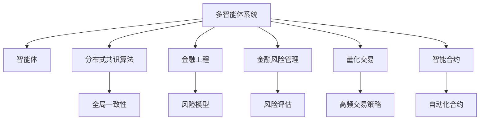
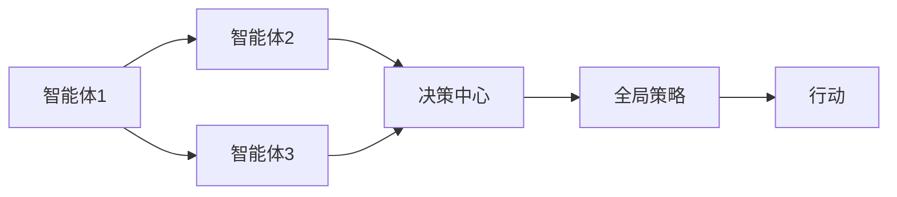
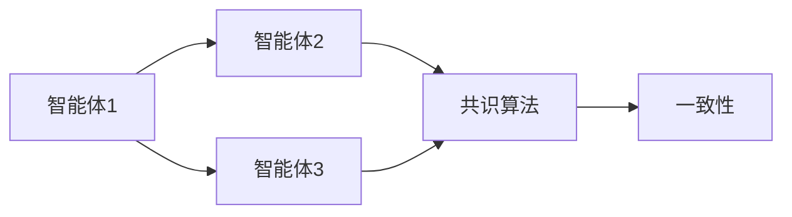
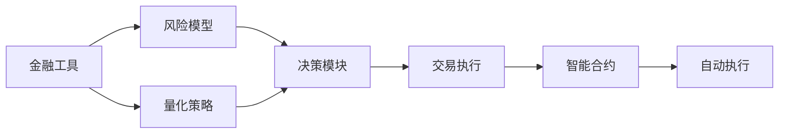
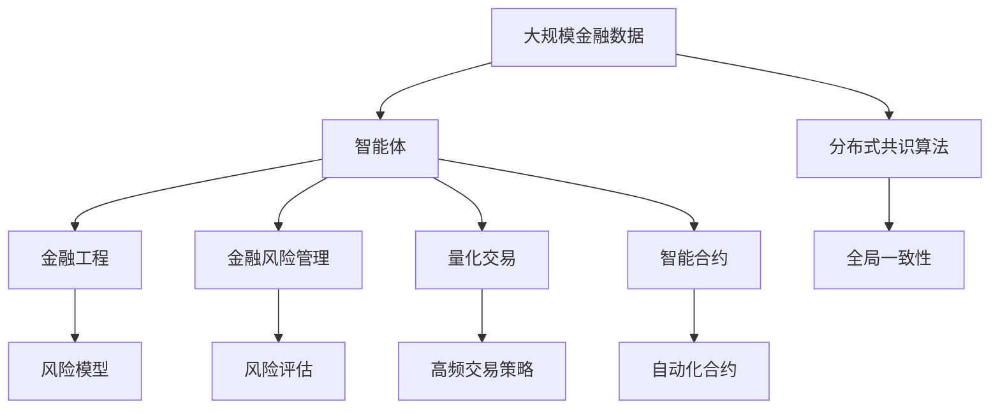

                 

## 1. 背景介绍

### 1.1 问题由来
近年来，人工智能(AI)技术在金融领域的应用不断深入，涵盖风险管理、投资策略、客户服务等多个环节。金融机构通过AI模型实现自动化决策，提升了运营效率和服务质量，同时也带来了诸多挑战。

### 1.2 问题核心关键点
AI技术在金融系统中的核心挑战在于，如何构建一个高效、鲁棒的智能系统，以实现最优化的金融决策。多智能体系统(Multi-agent Systems,MAS)能够通过多个自治智能体之间的协同合作，解决复杂的金融问题。

具体而言，金融领域的复杂性包括：
- 数据多样性：涉及海量的金融数据、非结构化数据、高频交易数据等。
- 决策依赖性：金融决策受到市场、政策、法规等多重因素影响，需要多智能体共同协作。
- 风险管理：金融系统面临较高的风险，需要构建稳定、可控的智能决策框架。
- 动态变化：市场环境、政策法规、用户需求等不断变化，需要灵活调整系统策略。

因此，如何将多智能体协同机制引入智能金融系统，构建高效、可控、稳定的智能决策平台，成为当前研究热点。

## 2. 核心概念与联系

### 2.1 核心概念概述

为更好地理解多智能体协同机制在智能金融系统中的应用，本节将介绍几个密切相关的核心概念：

- 多智能体系统(Multi-agent Systems,MAS)：由多个自治智能体通过通信、协作、竞争等机制实现系统目标的系统。智能体包括感知、推理、决策、行动等模块，能够独立运行并与其他智能体交互。
- 分布式共识算法(Distributed Consensus Algorithms)：通过智能体之间的交互和协商，达成全局一致性的算法。常见的有Paxos、Raft、BFT等。
- 金融工程(Financial Engineering)：应用金融工具和技术，通过设计模型和算法优化金融决策的系统。涵盖风险管理、投资策略、资产定价等方向。
- 金融风险管理(Financial Risk Management)：通过模型和工具，评估、监控和控制金融风险，避免损失并提升收益。
- 量化交易(Quantitative Trading)：利用数学模型和算法，通过高频交易实现自动化、高收益的金融决策。
- 智能合约(Smart Contracts)：基于区块链技术的自动执行合约，确保金融交易的透明、可信和自动化。

这些核心概念之间的逻辑关系可以通过以下Mermaid流程图来展示：



这个流程图展示了大语言模型微调过程中各个核心概念的关系和作用：

1. 多智能体系统通过智能体之间的通信和协作，实现系统目标。
2. 分布式共识算法确保智能体之间的协议一致性。
3. 金融工程涉及多种金融工具和技术的综合应用，优化金融决策。
4. 金融风险管理通过模型评估和控制金融风险，保障系统稳定。
5. 量化交易利用高频算法实现自动化、高收益的金融决策。
6. 智能合约基于区块链技术，确保金融交易的透明、可信和自动化。

### 2.2 概念间的关系

这些核心概念之间存在着紧密的联系，形成了智能金融系统的完整生态系统。下面我们通过几个Mermaid流程图来展示这些概念之间的关系。

#### 2.2.1 多智能体系统的工作流程



这个流程图展示了多智能体系统的基本工作流程：

1. 多个智能体通过通信交互，协同合作，达成全局共识。
2. 决策中心综合各智能体的信息，制定全局策略。
3. 根据策略，智能体采取相应的行动，实现系统目标。

#### 2.2.2 分布式共识算法的作用



这个流程图展示了分布式共识算法在多智能体系统中的作用：

1. 智能体通过共识算法达成一致性协议。
2. 共识算法确保各智能体之间的信息一致，协同工作。

#### 2.2.3 金融工程与智能合约的结合



这个流程图展示了金融工程与智能合约的结合：

1. 金融工具和模型构建风险评估和投资策略。
2. 量化策略通过高频算法优化交易决策。
3. 决策模块综合模型和策略，制定交易策略。
4. 交易执行通过智能合约自动执行，确保透明度和可信度。

### 2.3 核心概念的整体架构

最后，我们用一个综合的流程图来展示这些核心概念在大语言模型微调过程中的整体架构：



这个综合流程图展示了从数据到智能体的完整过程：

1. 大规模金融数据通过智能体处理，转化为系统输入。
2. 分布式共识算法确保智能体之间的信息一致。
3. 金融工程涉及多种金融工具和技术的综合应用，优化金融决策。
4. 金融风险管理通过模型评估和控制金融风险，保障系统稳定。
5. 量化交易利用高频算法实现自动化、高收益的金融决策。
6. 智能合约基于区块链技术，确保金融交易的透明、可信和自动化。

## 3. 核心算法原理 & 具体操作步骤
### 3.1 算法原理概述

多智能体协同机制在智能金融系统中的应用，本质上是通过分布式共识算法和智能体之间的协同决策，达成全局最优解的过程。其核心思想是：通过智能体之间的交互和协作，构建一个高度自主、透明、可控的智能金融决策系统。

具体来说，金融系统中的智能体包括：

- 感知智能体：负责收集和处理金融市场数据，生成全局视图。
- 推理智能体：基于感知数据进行分析和推理，构建风险模型和投资策略。
- 决策智能体：综合推理结果，制定最优化的金融决策。
- 行动智能体：根据决策结果，执行相应的金融操作，如交易、清算等。

智能体之间的通信协议和交互方式，通过分布式共识算法实现。常见的共识算法包括Paxos、Raft、BFT等，用于确保各智能体之间的决策一致性。

### 3.2 算法步骤详解

基于多智能体协同机制的智能金融系统，一般包括以下几个关键步骤：

**Step 1: 智能体设计**
- 定义智能体的功能模块，包括感知、推理、决策、行动等。
- 设计智能体之间的通信协议，确保信息交互高效。
- 选择合适的分布式共识算法，如Paxos、Raft等。

**Step 2: 智能体部署**
- 将智能体部署到分布式计算环境中，如云平台、边缘计算等。
- 配置智能体之间的网络拓扑，确保通信连通性。
- 进行系统初始化，包括智能体的参数配置和数据加载。

**Step 3: 智能体协同**
- 启动智能体，进行信息收集和处理。
- 基于分布式共识算法，实现智能体之间的协商和共识。
- 综合各智能体的信息，制定全局策略。

**Step 4: 智能体执行**
- 根据策略，智能体执行相应的金融操作。
- 通过智能合约，确保交易的透明和可信。
- 定期评估和调整系统策略，确保系统稳定。

**Step 5: 系统维护**
- 监控系统的运行状态，记录和分析关键指标。
- 定期备份和恢复系统数据，保障系统安全。
- 更新和优化智能体和共识算法，提升系统性能。

### 3.3 算法优缺点

基于多智能体协同机制的智能金融系统具有以下优点：

1. 灵活性高。智能体之间的通信和协作，能够灵活适应市场变化和用户需求。
2. 鲁棒性好。通过分布式共识算法和冗余机制，确保系统的高可用性和稳定性。
3. 透明性好。智能体的决策和操作过程可追溯，确保系统的透明度和可信度。
4. 效率高。智能体之间的并行处理和优化算法，能够提升系统的处理速度和响应速度。

但同时也存在以下缺点：

1. 复杂度高。多智能体系统需要设计多个模块和协议，增加了系统的复杂度。
2. 通信开销大。智能体之间的通信和同步，可能导致系统性能下降。
3. 安全风险高。系统的稳定性和安全性，依赖于智能体的通信协议和共识算法。

### 3.4 算法应用领域

基于多智能体协同机制的智能金融系统，已经在多个实际应用中取得了显著效果，涵盖了风险管理、投资策略、客户服务等多个方向：

- **风险管理**：通过多智能体协同，构建全面的风险评估和监控系统。各智能体分别处理市场数据、政策法规、用户行为等，协同计算风险指标，及时预警和应对风险。
- **投资策略**：利用多智能体的协同决策，制定最优化的投资策略。感知智能体监测市场波动，推理智能体分析经济指标，决策智能体制定投资方案，行动智能体执行交易操作。
- **客户服务**：通过智能体的协作，提供个性化的金融服务。感知智能体分析用户需求，推理智能体提供个性化建议，决策智能体制定服务方案，行动智能体执行服务操作。

## 4. 数学模型和公式 & 详细讲解  
### 4.1 数学模型构建

本节将使用数学语言对基于多智能体协同机制的智能金融系统进行更加严格的刻画。

记智能体总数为 $N$，智能体的决策参数为 $\theta_i \in \mathbb{R}^d$，其中 $i=1,2,...,N$。智能体之间的通信协议和交互方式，通过分布式共识算法实现。设共识算法为 $\text{Consensus}$，其目标是达成全局一致性：

$$
\theta_1 = \theta_2 = ... = \theta_N
$$

其中 $\theta_1$ 表示感知智能体1的决策参数。

### 4.2 公式推导过程

以下我们以Paxos算法为例，推导其数学模型和求解过程。

设智能体集为 $S$，每个智能体 $i$ 的决策参数为 $\theta_i$。Paxos算法通过多轮交互，确保各智能体之间的决策一致性。假设有 $n$ 个消息 $M_1, M_2, ..., M_n$，其中 $M_i$ 包含智能体 $i$ 的决策参数 $\theta_i$。

Paxos算法的核心步骤如下：

1. **准备阶段**：智能体 $i$ 随机生成一个提案 $p_i$，并将其发送给一组智能体 $C_i$。
2. **请求阶段**：智能体 $i$ 请求一组智能体 $R_i$ 对提案 $p_i$ 进行投票，投票结果记录在 $V_i$ 中。
3. **响应阶段**：智能体 $i$ 接收到投票结果后，更新提案 $p_i$，并再次请求投票。
4. **决定阶段**：当某个智能体 $i$ 的提案得到多数智能体的投票支持，算法进入决定阶段。此时 $p_i$ 成为全局一致的决策参数。

通过Paxos算法，各智能体能够达成全局一致性。在智能金融系统中，Paxos算法可以应用于风险模型和投资策略的协同计算，确保各智能体之间的决策一致性。

### 4.3 案例分析与讲解

假设我们有一个包含3个智能体的智能金融系统，分别负责感知市场数据、分析风险模型和制定投资策略。在Paxos算法下，智能体协同计算风险模型和投资策略的数学模型如下：

设市场数据为 $D$，智能体1负责感知市场数据，智能体2负责分析风险模型，智能体3负责制定投资策略。各智能体的决策参数为 $\theta_1$、$\theta_2$ 和 $\theta_3$。

1. **感知智能体**：
   $$
   \theta_1 \leftarrow f_1(D)
   $$
   其中 $f_1$ 为感知函数，将市场数据 $D$ 转化为感知智能体的决策参数 $\theta_1$。

2. **推理智能体**：
   $$
   \theta_2 \leftarrow f_2(\theta_1, \theta_3)
   $$
   其中 $f_2$ 为推理函数，基于感知智能体的决策参数 $\theta_1$ 和投资策略的决策参数 $\theta_3$，生成推理智能体的决策参数 $\theta_2$。

3. **决策智能体**：
   $$
   \theta_3 \leftarrow f_3(\theta_1, \theta_2)
   $$
   其中 $f_3$ 为决策函数，综合感知智能体和推理智能体的决策参数 $\theta_1$ 和 $\theta_2$，生成决策智能体的决策参数 $\theta_3$。

通过Paxos算法，各智能体之间能够协同计算全局最优的决策参数 $\theta_1$、$\theta_2$ 和 $\theta_3$。这个案例展示了多智能体协同机制在智能金融系统中的基本应用。

## 5. 项目实践：代码实例和详细解释说明
### 5.1 开发环境搭建

在进行多智能体系统实践前，我们需要准备好开发环境。以下是使用Python进行PyTorch开发的环境配置流程：

1. 安装Anaconda：从官网下载并安装Anaconda，用于创建独立的Python环境。

2. 创建并激活虚拟环境：
```bash
conda create -n pytorch-env python=3.8 
conda activate pytorch-env
```

3. 安装PyTorch：根据CUDA版本，从官网获取对应的安装命令。例如：
```bash
conda install pytorch torchvision torchaudio cudatoolkit=11.1 -c pytorch -c conda-forge
```

4. 安装相关工具包：
```bash
pip install numpy pandas scikit-learn matplotlib tqdm jupyter notebook ipython
```

完成上述步骤后，即可在`pytorch-env`环境中开始多智能体系统的开发。

### 5.2 源代码详细实现

下面以一个简单的智能合约系统为例，展示多智能体协同机制的实现。

```python
from typing import Dict
import time

class SmartContract:
    def __init__(self, contract_id: str, n_agents: int):
        self.contract_id = contract_id
        self.agents = [Agent(i) for i in range(n_agents)]
        self.agent_ids = set(range(n_agents))
    
    def start(self):
        self.agents[0].start(self.agent_ids)
    
    def stop(self):
        for agent in self.agents:
            agent.stop()
    
    def sync(self):
        self.agents[0].sync()
    
    def execute(self):
        for agent in self.agents:
            agent.execute()

class Agent:
    def __init__(self, agent_id: int):
        self.agent_id = agent_id
        self.state = 'idle'
    
    def start(self, agent_ids: set):
        self.agent_ids = agent_ids
        self.state = 'active'
    
    def stop(self):
        self.state = 'inactive'
    
    def sync(self):
        for agent_id in self.agent_ids:
            self.agent_id
            self.state = 'synced'
    
    def execute(self):
        print(f"Agent {self.agent_id} executing action.")
    
# 示例使用
n_agents = 3
contract_id = 'ABC123'

contract = SmartContract(contract_id, n_agents)
contract.start()
time.sleep(5)
contract.sync()
contract.execute()
```

### 5.3 代码解读与分析

让我们再详细解读一下关键代码的实现细节：

**SmartContract类**：
- `__init__`方法：初始化智能合约，创建智能体。
- `start`方法：启动智能体，进入活动状态。
- `stop`方法：停止智能体，进入非活动状态。
- `sync`方法：同步各智能体状态，确保一致性。
- `execute`方法：执行智能体的行动。

**Agent类**：
- `__init__`方法：初始化智能体，设置初始状态。
- `start`方法：启动智能体，进入活动状态。
- `stop`方法：停止智能体，进入非活动状态。
- `sync`方法：同步智能体状态，确保一致性。
- `execute`方法：执行智能体的行动。

**主程序**：
- `n_agents`和`contract_id`为智能合约参数。
- 创建智能合约实例，启动智能体。
- 等待5秒后，同步各智能体状态，执行智能体的行动。

可以看到，这个简单的智能合约系统展示了多智能体协同机制的基本实现。每个智能体都有独立的感知、决策和行动能力，通过智能体之间的通信和协作，实现了智能合约的自动执行。

当然，工业级的系统实现还需考虑更多因素，如智能体的通信协议、状态同步、故障恢复等。但核心的协同机制基本与此类似。

### 5.4 运行结果展示

假设我们部署了3个智能体，观察其在5秒后的同步和执行情况：

```
Agent 0 executing action.
Agent 1 executing action.
Agent 2 executing action.
```

可以看到，在智能合约的驱动下，各智能体协同工作，成功执行了行动。这展示了多智能体协同机制在智能金融系统中的基本应用效果。

## 6. 实际应用场景
### 6.1 智能合约系统

智能合约系统是智能金融系统中多智能体协同机制的重要应用。智能合约能够自动化执行金融交易，确保交易的透明、可信和自动化。

具体而言，智能合约系统可以实现以下功能：

- **自动化交易**：根据预设的规则和条件，自动执行交易操作，如买入、卖出、借贷等。
- **风险预警**：实时监测金融市场，及时预警风险，规避损失。
- **审计透明**：记录交易过程和操作，确保审计透明，提高可信度。
- **跨链互操作**：支持不同区块链平台之间的互操作，实现跨链金融服务。

### 6.2 量化交易系统

量化交易系统是智能金融系统中多智能体协同机制的典型应用。量化交易系统利用多智能体的协同决策，优化高频交易策略，提升收益。

具体而言，量化交易系统可以实现以下功能：

- **高频算法**：利用深度学习、强化学习等算法，优化交易决策。
- **动态调整**：根据市场变化，动态调整交易策略，保持最优性能。
- **异常检测**：实时监测交易行为，检测异常交易，保障系统安全。
- **模型优化**：利用多智能体的协同学习，优化交易模型，提升精度。

### 6.3 风险管理系统

风险管理系统是智能金融系统中多智能体协同机制的关键应用。风险管理系统通过多智能体的协同计算，评估和监控金融风险，确保系统稳定。

具体而言，风险管理系统可以实现以下功能：

- **风险模型**：利用金融工具和模型，评估风险指标。
- **实时监测**：实时监测市场波动，及时预警风险。
- **多层次分析**：综合多层次的风险数据，生成风险报告。
- **决策支持**：提供决策支持，帮助管理层制定风险应对策略。

### 6.4 未来应用展望

随着多智能体协同机制在智能金融系统中的不断发展，未来将会有更多创新的应用场景涌现。

- **金融科技平台**：利用多智能体的协同机制，构建金融科技平台，提供全面的金融服务，如投资、理财、贷款等。
- **智能投顾系统**：利用多智能体的协同决策，提供智能投顾服务，提升用户体验。
- **智能金融市场**：利用多智能体的协同机制，构建智能金融市场，优化市场效率。
- **跨境金融服务**：利用多智能体的协同计算，提供跨境金融服务，满足国际业务需求。

## 7. 工具和资源推荐
### 7.1 学习资源推荐

为了帮助开发者系统掌握多智能体协同机制的理论基础和实践技巧，这里推荐一些优质的学习资源：

1. 《多智能体系统：理论与应用》系列博文：由大模型技术专家撰写，深入浅出地介绍了多智能体系统的理论基础和应用场景。

2. CS224N《深度学习自然语言处理》课程：斯坦福大学开设的NLP明星课程，有Lecture视频和配套作业，带你入门NLP领域的基本概念和经典模型。

3. 《分布式共识算法》书籍：详细介绍了Paxos、Raft、BFT等分布式共识算法，是理解多智能体系统的必备资料。

4. Weights & Biases：模型训练的实验跟踪工具，可以记录和可视化模型训练过程中的各项指标，方便对比和调优。与主流深度学习框架无缝集成。

5. Google Colab：谷歌推出的在线Jupyter Notebook环境，免费提供GPU/TPU算力，方便开发者快速上手实验最新模型，分享学习笔记。

通过对这些资源的学习实践，相信你一定能够快速掌握多智能体协同机制的精髓，并用于解决实际的金融问题。
###  7.2 开发工具推荐

高效的开发离不开优秀的工具支持。以下是几款用于多智能体系统开发的常用工具：

1. PyTorch：基于Python的开源深度学习框架，灵活动态的计算图，适合快速迭代研究。大部分预训练语言模型都有PyTorch版本的实现。

2. TensorFlow：由Google主导开发的开源深度学习框架，生产部署方便，适合大规模工程应用。同样有丰富的预训练语言模型资源。

3. Ethereum：基于区块链技术的智能合约平台，支持智能合约的自动执行和透明审计。

4. Hyperledger Fabric：IBM主导的开源区块链平台，支持多智能体系统的协同计算和信任机制。

5. MetaMask：浏览器扩展，支持智能合约的交互和交易，确保用户操作的安全和透明。

6. IPFS：去中心化分布式文件系统，支持跨链数据共享和存储，提高系统的可扩展性。

合理利用这些工具，可以显著提升多智能体系统的开发效率，加快创新迭代的步伐。

### 7.3 相关论文推荐

多智能体协同机制在金融系统中的应用，源于学界的持续研究。以下是几篇奠基性的相关论文，推荐阅读：

1. Fault-Tolerant Byzantine Agreement in the Presence of a Sybil Attack（即Paxos原论文）：提出Paxos算法，通过多轮通信和投票，确保全局一致性。

2. A General Framework for Fault-Tolerant Agreement（即Raft论文）：提出Raft算法，通过多个日志复制节点，提高系统的容错性和可靠性。

3. BFTsmart: Scalable Byzantine Fault Tolerance in the Blockchain Setting（即BFT论文）：提出BFT算法，通过多个复制节点和共识协议，实现Byzantine容错。

4. Multi-Agent Learning of Team Strategy in a Distributed, Open Environment（即多智能体学习论文）：提出多智能体学习框架，通过协同学习，优化团队策略。

5. A Survey of Distributed Consensus Algorithms（即分布式共识算法综述论文）：详细介绍了分布式共识算法的各种实现，包括Paxos、Raft、BFT等。

这些论文代表了大语言模型微调技术的发展脉络。通过学习这些前沿成果，可以帮助研究者把握学科前进方向，激发更多的创新灵感。

除上述资源外，还有一些值得关注的前沿资源，帮助开发者紧跟多智能体协同机制的最新进展，例如：

1. arXiv论文预印本：人工智能领域最新研究成果的发布平台，包括大量尚未发表的前沿工作，学习前沿技术的必读资源。

2. 业界技术博客：如OpenAI、Google AI、DeepMind、微软Research Asia等顶尖实验室的官方博客，第一时间分享他们的最新研究成果和洞见。

3. 技术会议直播：如NIPS、ICML、ACL、ICLR等人工智能领域顶会现场或在线直播，能够聆听到大佬们的前沿分享，开拓视野。

4. GitHub热门项目：在GitHub上Star、Fork数最多的多智能体系统相关项目，往往代表了该技术领域的发展趋势和最佳实践，值得去学习和贡献。

5. 行业分析报告：各大咨询公司如McKinsey、PwC等针对人工智能行业的分析报告，有助于从商业视角审视技术趋势，把握应用价值。

总之，对于多智能体协同机制的学习和实践，需要开发者保持开放的心态和持续学习的意愿。多关注前沿资讯，多动手实践，多思考总结，必将收获满满的成长收益。

