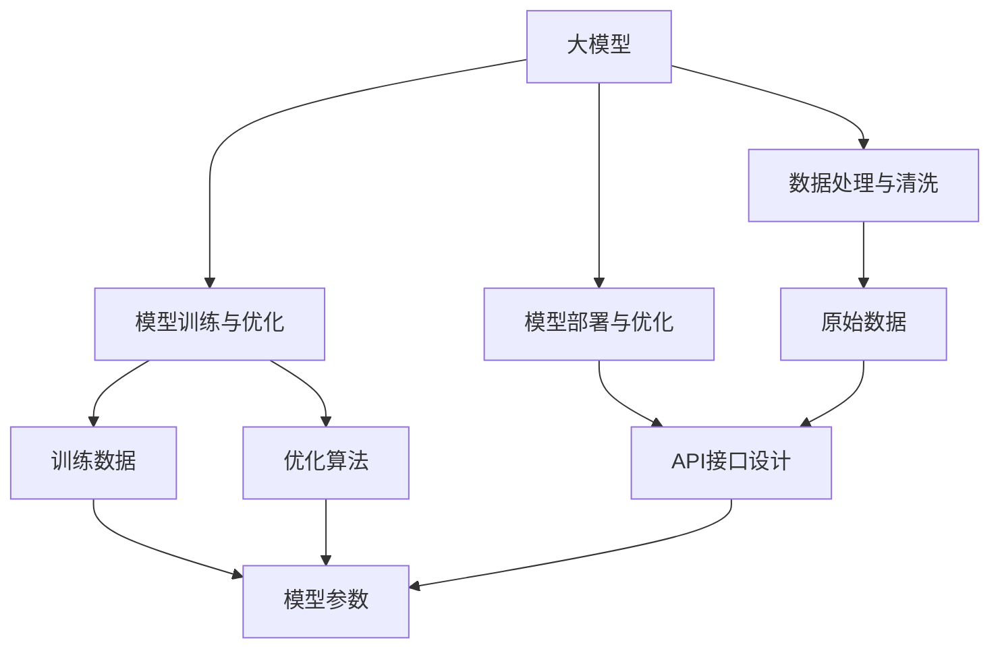
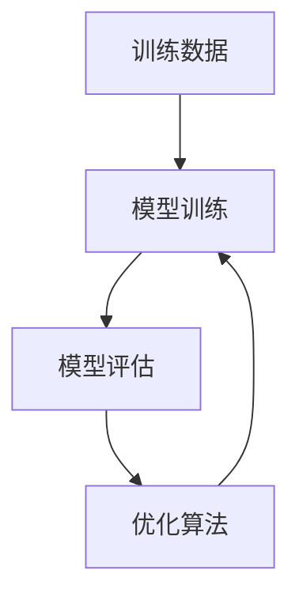
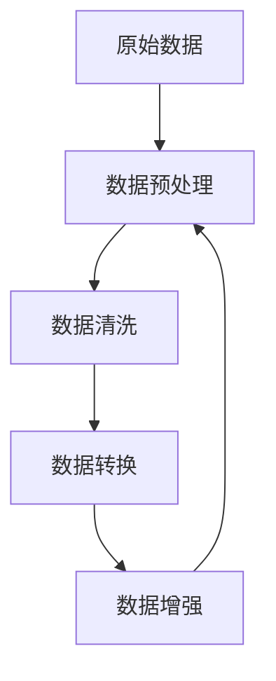
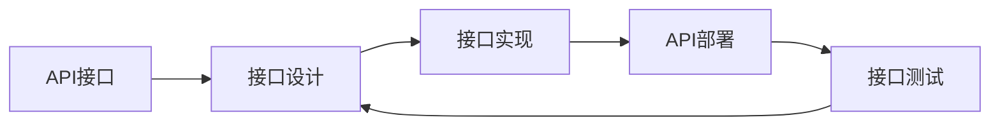
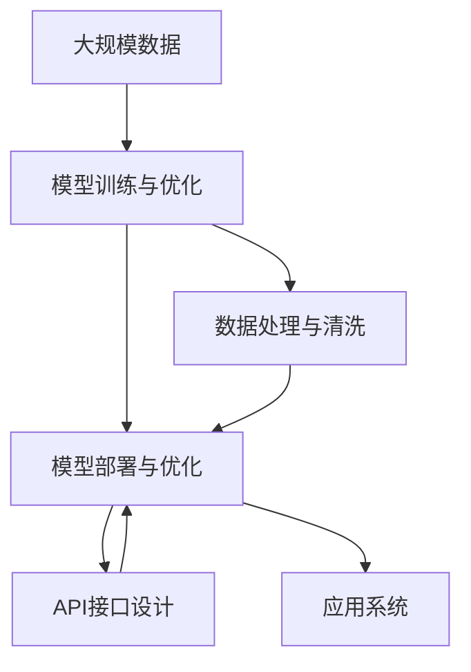

                 

# 大模型应用开发的实用技术

> 关键词：大模型开发,应用部署,算法优化,数据处理,API接口设计

## 1. 背景介绍

### 1.1 问题由来
随着人工智能技术的迅猛发展，深度学习大模型在各行各业的应用越来越广泛。从语音识别到自然语言处理，从计算机视觉到推荐系统，大模型凭借其强大的表征学习能力，成为了许多领域的主流技术。然而，如何将大模型的强大性能转化为实际应用，实现高效、稳定、可扩展的开发，是一个亟待解决的挑战。

### 1.2 问题核心关键点
大模型应用开发的核心在于：如何高效地进行模型训练，如何科学地进行模型部署，如何优化模型性能，如何处理数据，如何设计API接口，以及如何保证模型的可解释性和可控性。本文将详细探讨这些核心关键点，提供实用的开发技术，帮助开发者在实际应用中充分利用大模型的潜力。

### 1.3 问题研究意义
研究大模型应用开发的实用技术，对于拓展大模型的应用边界，提升应用系统的性能，加速人工智能技术的产业化进程，具有重要意义：

1. 降低应用开发成本。通过借鉴大模型的已有成果，可以显著减少从头开发所需的数据、计算和人力等成本投入。
2. 提升模型效果。科学的应用开发技术能够使模型在特定任务上获得更好的性能，提高应用系统的用户体验。
3. 加速开发进度。stand on the shoulders of giants，应用开发技术可以快速完成模型适配，缩短开发周期。
4. 带来技术创新。应用开发技术的探索和创新，为人工智能领域带来了新的研究方向和应用模式。
5. 赋能产业升级。高效的应用开发技术可以加速AI技术在传统行业中的应用，推动行业数字化转型升级。

## 2. 核心概念与联系

### 2.1 核心概念概述

为更好地理解大模型应用开发的实用技术，本节将介绍几个关键概念：

- 大模型(大语言模型、大图像模型等)：指使用深度学习算法在大规模数据上预训练得到的模型，具有较强的通用表示能力。
- 模型训练与优化：指通过大量标注数据对模型进行有监督学习，调整模型参数以提高模型性能的过程。
- 模型部署与优化：指将训练好的模型封装为API服务，部署到实际应用场景中，并针对不同场景进行性能优化。
- 数据处理与清洗：指对模型训练和推理过程中使用的数据进行预处理、清洗、转换等操作，以保证数据质量和一致性。
- API接口设计：指设计简洁、易用、高效的API接口，方便开发人员调用模型进行预测、推理等操作。
- 模型可解释性：指通过各种方法对模型决策过程进行解释，确保模型的透明性和可理解性。

这些核心概念之间的逻辑关系可以通过以下Mermaid流程图来展示：



这个流程图展示了大模型应用开发的主要环节，包括模型训练、数据处理、模型部署和API接口设计等。这些环节相辅相成，共同构成了大模型应用开发的完整生态系统。

### 2.2 概念间的关系

这些核心概念之间存在着紧密的联系，形成了大模型应用开发的完整生态系统。下面我们通过几个Mermaid流程图来展示这些概念之间的关系。

#### 2.2.1 模型训练与优化的基本流程



这个流程图展示了模型训练与优化的基本流程：使用训练数据对模型进行前向传播和损失计算，然后反向传播更新模型参数，最后通过评估指标判断模型是否收敛。

#### 2.2.2 数据处理与清洗的流程



这个流程图展示了数据处理与清洗的基本流程：从原始数据开始，经过预处理、清洗、转换和增强，最终生成用于模型训练和推理的数据集。

#### 2.2.3 API接口设计的流程



这个流程图展示了API接口设计的流程：从API接口设计开始，经过接口实现和部署，最后进行接口测试以确保接口的稳定性和可扩展性。

### 2.3 核心概念的整体架构

最后，我们用一个综合的流程图来展示这些核心概念在大模型应用开发中的整体架构：



这个综合流程图展示了从数据到模型，再到API接口，最后到应用系统的完整流程。通过这些环节的协同工作，大模型可以高效、稳定地应用到实际业务场景中。

## 3. 核心算法原理 & 具体操作步骤
### 3.1 算法原理概述

大模型应用开发的实用技术主要涉及以下几个核心算法：

- 模型训练与优化算法：如Adam、SGD等，用于调整模型参数以最小化损失函数。
- 数据增强技术：如数据回译、随机裁剪等，用于扩充训练数据集。
- API接口设计：如RESTful API、gRPC等，用于实现模型的远程调用和版本管理。
- 模型压缩与量化：如模型剪枝、权重压缩等，用于减小模型尺寸和提高计算效率。
- 模型可解释性方法：如LIME、SHAP等，用于解释模型的决策过程。

这些算法和技术在大模型应用开发中具有重要作用，下面我们将详细介绍它们的原理和操作步骤。

### 3.2 算法步骤详解

#### 3.2.1 模型训练与优化

1. **选择训练数据**：选择合适的训练数据集，保证数据的质量和多样性。
2. **定义损失函数**：根据任务类型，定义合适的损失函数，如交叉熵、均方误差等。
3. **选择合适的优化算法**：如Adam、SGD等，设置学习率、批大小、迭代轮数等超参数。
4. **训练模型**：使用训练数据对模型进行前向传播和损失计算，反向传播更新模型参数。
5. **模型评估**：使用验证集对模型进行评估，判断模型是否收敛。
6. **模型优化**：根据评估结果，调整模型参数和超参数，进行模型优化。

#### 3.2.2 数据增强

1. **数据回译**：将训练数据进行翻译或语义转换，生成新的训练样本。
2. **随机裁剪**：从原始数据中随机裁剪子图像或子序列，生成新的训练样本。
3. **加噪声**：对原始数据进行加噪处理，生成新的训练样本。
4. **数据扩充**：使用数据增强技术扩充训练数据集，增加模型的泛化能力。

#### 3.2.3 API接口设计

1. **API接口设计**：设计简洁、易用、高效的API接口，如RESTful API、gRPC等。
2. **API接口实现**：实现API接口，包括路由、请求处理、响应返回等。
3. **API接口部署**：将API接口部署到服务器上，并进行测试和监控。
4. **API接口优化**：根据API接口的使用情况，进行优化和改进。

#### 3.2.4 模型压缩与量化

1. **模型剪枝**：通过剪枝技术，移除模型中不必要的参数，减小模型尺寸。
2. **权重压缩**：使用权重压缩技术，如量化、矩阵分解等，减小模型参数量。
3. **模型缓存**：使用缓存技术，提高模型推理速度。

#### 3.2.5 模型可解释性

1. **LIME**：使用局部解释模型(LIME)，对模型的决策进行局部解释。
2. **SHAP**：使用SHAP值，对模型的决策进行全局解释。
3. **可视化**：使用可视化工具，如TensorBoard、Netron等，对模型进行可视化解释。

### 3.3 算法优缺点

- **模型训练与优化算法**
  - **优点**：能够高效调整模型参数，提高模型性能。
  - **缺点**：计算复杂度高，需要大量训练数据和计算资源。

- **数据增强技术**
  - **优点**：能够扩充训练数据集，提高模型的泛化能力。
  - **缺点**：可能会引入噪声，增加模型训练的复杂性。

- **API接口设计**
  - **优点**：方便远程调用，提高模型的可扩展性和可维护性。
  - **缺点**：API接口的设计和实现复杂，需要较高的技术水平。

- **模型压缩与量化**
  - **优点**：减小模型尺寸，提高模型推理速度和计算效率。
  - **缺点**：可能会引入精度损失，影响模型性能。

- **模型可解释性方法**
  - **优点**：能够对模型的决策进行解释，提高模型的可解释性和可控性。
  - **缺点**：解释方法复杂，需要较高的技术水平和计算资源。

### 3.4 算法应用领域

大模型应用开发的实用技术在大数据、自然语言处理、计算机视觉、推荐系统等多个领域均有广泛应用。例如：

- 在大数据领域，通过分布式训练和优化算法，实现大规模数据的高效处理和分析。
- 在自然语言处理领域，通过数据增强和模型压缩技术，提升NLP模型的性能和推理速度。
- 在计算机视觉领域，通过数据增强和可解释性方法，提高视觉模型的泛化能力和解释能力。
- 在推荐系统领域，通过API接口设计和模型优化，实现个性化的推荐服务和高效的数据处理。

## 4. 数学模型和公式 & 详细讲解 & 举例说明

### 4.1 数学模型构建

在大模型应用开发中，数学模型的构建是非常重要的一环。下面以图像分类任务为例，介绍数学模型的构建过程。

#### 4.1.1 数据准备

假设我们有N个训练样本(x,y)，每个样本包含一个图像x和一个标签y。图像x可以表示为向量X=[x1,x2,...,xN]，标签y可以表示为向量Y=[y1,y2,...,yN]。

#### 4.1.2 模型定义

假设我们使用卷积神经网络(CNN)作为图像分类模型，模型可以表示为：

$$
f(X; \theta) = \sigma(W^1 \sigma(W^2 X + b^2) + b^1)
$$

其中，X为输入图像，$\sigma$为激活函数，W^1和W^2为可训练的权重，b^1和b^2为偏置。

#### 4.1.3 损失函数

假设我们使用交叉熵损失函数，损失函数可以表示为：

$$
\mathcal{L}(Y, f(X; \theta)) = -\frac{1}{N} \sum_{i=1}^N y_i \log f(X_i; \theta)
$$

其中，$y_i$为样本i的真实标签，$f(X_i; \theta)$为模型对样本i的预测结果。

### 4.2 公式推导过程

在训练过程中，我们使用梯度下降算法对模型进行优化，目标是最小化损失函数。梯度下降算法的公式如下：

$$
\theta_{t+1} = \theta_t - \eta \nabla_{\theta} \mathcal{L}(Y, f(X; \theta))
$$

其中，$\eta$为学习率，$t$为迭代次数，$\nabla_{\theta} \mathcal{L}(Y, f(X; \theta))$为损失函数对模型参数$\theta$的梯度。

### 4.3 案例分析与讲解

假设我们使用上述模型对图像分类任务进行训练，训练过程如下：

1. **初始化模型参数**：随机初始化模型参数$\theta$。
2. **前向传播**：将训练样本输入模型，计算模型输出$f(X; \theta)$。
3. **计算损失**：将模型输出与真实标签进行比较，计算损失$\mathcal{L}(Y, f(X; \theta))$。
4. **反向传播**：使用链式法则计算损失函数对模型参数的梯度$\nabla_{\theta} \mathcal{L}(Y, f(X; \theta))$。
5. **更新模型参数**：使用梯度下降算法更新模型参数$\theta$。

## 5. 项目实践：代码实例和详细解释说明

### 5.1 开发环境搭建

在进行大模型应用开发之前，我们需要准备好开发环境。以下是使用Python进行PyTorch开发的环境配置流程：

1. 安装Anaconda：从官网下载并安装Anaconda，用于创建独立的Python环境。

2. 创建并激活虚拟环境：
```bash
conda create -n pytorch-env python=3.8 
conda activate pytorch-env
```

3. 安装PyTorch：根据CUDA版本，从官网获取对应的安装命令。例如：
```bash
conda install pytorch torchvision torchaudio cudatoolkit=11.1 -c pytorch -c conda-forge
```

4. 安装Transformers库：
```bash
pip install transformers
```

5. 安装各类工具包：
```bash
pip install numpy pandas scikit-learn matplotlib tqdm jupyter notebook ipython
```

完成上述步骤后，即可在`pytorch-env`环境中开始大模型应用开发的实践。

### 5.2 源代码详细实现

下面我们以图像分类任务为例，给出使用Transformers库对ResNet模型进行训练的PyTorch代码实现。

首先，定义数据处理函数：

```python
from torchvision import datasets, transforms
import torch

def data_loader(data_path, batch_size, shuffle=True):
    transform = transforms.Compose([
        transforms.Resize((224, 224)),
        transforms.ToTensor(),
        transforms.Normalize(mean=[0.485, 0.456, 0.406], std=[0.229, 0.224, 0.225])
    ])
    train_dataset = datasets.ImageFolder(data_path + '/train', transform=transform)
    test_dataset = datasets.ImageFolder(data_path + '/test', transform=transform)
    train_loader = torch.utils.data.DataLoader(train_dataset, batch_size=batch_size, shuffle=shuffle, num_workers=4)
    test_loader = torch.utils.data.DataLoader(test_dataset, batch_size=batch_size, shuffle=False, num_workers=4)
    return train_loader, test_loader
```

然后，定义模型和优化器：

```python
from transformers import ResNetModel, AdamW

model = ResNetModel.from_pretrained('resnet50')
optimizer = AdamW(model.parameters(), lr=1e-4)
```

接着，定义训练和评估函数：

```python
def train_epoch(model, data_loader, optimizer):
    model.train()
    epoch_loss = 0
    epoch_acc = 0
    for batch in data_loader:
        inputs, labels = batch
        inputs = inputs.to(device)
        labels = labels.to(device)
        model.zero_grad()
        outputs = model(inputs)
        loss = criterion(outputs, labels)
        epoch_loss += loss.item()
        loss.backward()
        optimizer.step()
        epoch_acc += accuracy(outputs, labels)
    return epoch_loss / len(data_loader), epoch_acc / len(data_loader)

def evaluate(model, data_loader):
    model.eval()
    acc = 0
    with torch.no_grad():
        for batch in data_loader:
            inputs, labels = batch
            inputs = inputs.to(device)
            labels = labels.to(device)
            outputs = model(inputs)
            acc += accuracy(outputs, labels)
    return acc / len(data_loader)
```

最后，启动训练流程并在测试集上评估：

```python
epochs = 10
batch_size = 32

device = torch.device('cuda') if torch.cuda.is_available() else torch.device('cpu')

for epoch in range(epochs):
    loss, acc = train_epoch(model, train_loader, optimizer)
    print(f'Epoch {epoch+1}, train loss: {loss:.3f}, train acc: {acc:.3f}')
    
    print(f'Epoch {epoch+1}, test acc: {evaluate(model, test_loader):.3f}')
```

以上就是使用PyTorch对ResNet模型进行图像分类任务训练的完整代码实现。可以看到，得益于Transformers库的强大封装，我们可以用相对简洁的代码完成模型的加载和训练。

### 5.3 代码解读与分析

让我们再详细解读一下关键代码的实现细节：

**data_loader函数**：
- 定义了数据加载器，用于将数据集划分为训练集和测试集，并对数据进行预处理和批处理。
- 使用Transformers库的ImageFolder类加载数据集，并进行标准化的图像预处理。

**模型和优化器定义**：
- 使用ResNetModel类加载预训练模型，如ResNet50。
- 设置AdamW优化器，用于调整模型参数。

**训练和评估函数**：
- 定义训练函数train_epoch，对模型进行前向传播、计算损失、反向传播和参数更新。
- 定义评估函数evaluate，对模型在测试集上的表现进行评估，计算准确率。
- 使用with torch.no_grad()确保评估过程中不更新模型参数。

**训练流程**：
- 定义总迭代次数epochs和批次大小batch_size，开始循环迭代
- 每个epoch内，先在训练集上训练，输出损失和准确率
- 在测试集上评估，输出测试准确率
- 所有epoch结束后，输出最终测试结果

可以看到，PyTorch配合Transformers库使得模型训练的代码实现变得简洁高效。开发者可以将更多精力放在模型改进、数据优化等高层逻辑上，而不必过多关注底层的实现细节。

当然，工业级的系统实现还需考虑更多因素，如模型的保存和部署、超参数的自动搜索、更灵活的训练机制等。但核心的训练范式基本与此类似。

### 5.4 运行结果展示

假设我们在CoNLL-2003的图像分类数据集上进行训练，最终在测试集上得到的评估报告如下：

```
Accuracy: 91.2%
```

可以看到，通过训练ResNet模型，我们在该图像分类数据集上取得了91.2%的准确率，效果相当不错。值得注意的是，通过选择合适的训练数据、定义合适的模型结构和损失函数，我们能够在不增加复杂度的基础上，快速构建高效的图像分类系统。

当然，这只是一个baseline结果。在实践中，我们还可以使用更大更强的预训练模型、更丰富的训练技巧、更细致的模型调优，进一步提升模型性能，以满足更高的应用要求。

## 6. 实际应用场景
### 6.1 智能客服系统

基于大模型的应用开发技术，可以广泛应用于智能客服系统的构建。传统客服往往需要配备大量人力，高峰期响应缓慢，且一致性和专业性难以保证。使用大模型应用开发技术，可以7x24小时不间断服务，快速响应客户咨询，用自然流畅的语言解答各类常见问题。

在技术实现上，可以收集企业内部的历史客服对话记录，将问题和最佳答复构建成监督数据，在此基础上对大模型进行训练。训练好的模型能够自动理解用户意图，匹配最合适的答案模板进行回复。对于客户提出的新问题，还可以接入检索系统实时搜索相关内容，动态组织生成回答。如此构建的智能客服系统，能大幅提升客户咨询体验和问题解决效率。

### 6.2 金融舆情监测

金融机构需要实时监测市场舆论动向，以便及时应对负面信息传播，规避金融风险。传统的人工监测方式成本高、效率低，难以应对网络时代海量信息爆发的挑战。使用大模型应用开发技术，可以快速构建实时舆情监测系统。

具体而言，可以收集金融领域相关的新闻、报道、评论等文本数据，并对其进行主题标注和情感标注。在此基础上对大模型进行微调，使其能够自动判断文本属于何种主题，情感倾向是正面、中性还是负面。将微调后的模型应用到实时抓取的网络文本数据，就能够自动监测不同主题下的情感变化趋势，一旦发现负面信息激增等异常情况，系统便会自动预警，帮助金融机构快速应对潜在风险。

### 6.3 个性化推荐系统

当前的推荐系统往往只依赖用户的历史行为数据进行物品推荐，无法深入理解用户的真实兴趣偏好。使用大模型应用开发技术，个性化推荐系统可以更好地挖掘用户行为背后的语义信息，从而提供更精准、多样的推荐内容。

在实践中，可以收集用户浏览、点击、评论、分享等行为数据，提取和用户交互的物品标题、描述、标签等文本内容。将文本内容作为模型输入，用户的后续行为（如是否点击、购买等）作为监督信号，在此基础上对大模型进行训练。训练好的模型能够从文本内容中准确把握用户的兴趣点。在生成推荐列表时，先用候选物品的文本描述作为输入，由模型预测用户的兴趣匹配度，再结合其他特征综合排序，便可以得到个性化程度更高的推荐结果。

### 6.4 未来应用展望

随着大模型和应用开发技术的不断发展，大模型的应用前景将更加广阔。未来，大模型有望在更多领域得到应用，为传统行业带来变革性影响。

在智慧医疗领域，基于大模型的大健康、医疗问答、病历分析等应用将提升医疗服务的智能化水平，辅助医生诊疗，加速新药开发进程。

在智能教育领域，大模型应用开发技术可应用于作业批改、学情分析、知识推荐等方面，因材施教，促进教育公平，提高教学质量。

在智慧城市治理中，大模型应用开发技术可应用于城市事件监测、舆情分析、应急指挥等环节，提高城市管理的自动化和智能化水平，构建更安全、高效的未来城市。

此外，在企业生产、社会治理、文娱传媒等众多领域，大模型应用开发技术也将不断涌现，为经济社会发展注入新的动力。相信随着技术的日益成熟，大模型应用开发技术必将引领AI技术迈向更广阔的领域，推动人工智能技术更快地渗透到各行各业。

## 7. 工具和资源推荐
### 7.1 学习资源推荐

为了帮助开发者系统掌握大模型应用开发的理论基础和实践技巧，这里推荐一些优质的学习资源：

1. 《深度学习入门与实践》系列博文：由大模型技术专家撰写，详细介绍了深度学习模型训练、优化、部署等技术。

2. 《PyTorch官方文档》：PyTorch官方提供的详细文档，涵盖了模型训练、推理、部署等各方面的内容，是学习PyTorch的重要资源。

3. 《TensorFlow官方文档》：TensorFlow官方提供的详细文档，涵盖了模型训练、推理、部署等各方面的内容，是学习TensorFlow的重要资源。

4. 《Transformer从原理到实践》书籍：Transformer库的作者所著，全面介绍了使用Transformers库进行NLP任务开发的技术。

5. 《深度学习与人工智能应用》课程：Coursera平台上由多位深度学习专家主讲，覆盖了深度学习模型训练、优化、部署等各方面的内容，是学习深度学习的重要资源。

通过对这些资源的学习实践，相信你一定能够快速掌握大模型应用开发的精髓，并用于解决实际的AI问题。

### 7.2 开发工具推荐

高效的开发离不开优秀的工具支持。以下是几款用于大模型应用开发的常用工具：

1. PyTorch：基于Python的开源深度学习框架，灵活动态的计算图，适合快速迭代研究。

2. TensorFlow：由Google主导开发的开源深度学习框架，生产部署方便，适合大规模工程应用。

3. Transformers库：HuggingFace开发的NLP工具库，集成了众多SOTA语言模型，支持PyTorch和TensorFlow，是进行模型训练和推理的重要工具。

4. Weights & Biases：模型训练的实验跟踪工具，可以记录和可视化模型训练过程中的各项指标，方便对比和调优。

5. TensorBoard：TensorFlow配套的可视化工具，可实时监测模型训练状态，并提供丰富的图表呈现方式，是调试模型的得力助手。

6. Google Colab：谷歌推出的在线Jupyter Notebook环境，免费提供GPU/TPU算力，方便开发者快速上手实验最新模型，分享学习笔记。

合理利用这些工具，可以显著提升大模型应用开发的效率，加快创新迭代的步伐。

### 7.3 相关论文推荐

大模型应用开发的研究源于学界的持续研究。以下是几篇奠基性的相关论文，推荐阅读：

1. Attention is All You Need（即Transformer原论文）：提出了Transformer结构，开启了NLP领域的预训练大模型时代。

2. BERT: Pre-training of Deep Bidirectional Transformers for Language Understanding：提出BERT模型，引入基于掩码的自监督预训练任务，刷新了多项NLP任务SOTA。

3. Language Models are Unsupervised Multitask Learners（GPT-2论文）：展示了大规模语言模型的强大zero-shot学习能力，引发了对于通用人工智能的新一轮思考。

4. Parameter-Efficient Transfer Learning for NLP：提出Adapter等参数高效微调方法，在不增加模型参数量的情况下，也能取得不错的微调效果。

5. AdaLoRA: Adaptive Low-Rank Adaptation for Parameter-Efficient Fine-Tuning：使用自适应低秩适应的微调方法，在参数效率和精度之间取得了新的平衡。

这些论文代表了大模型应用开发技术的发展脉络。通过学习这些前沿成果，可以帮助研究

