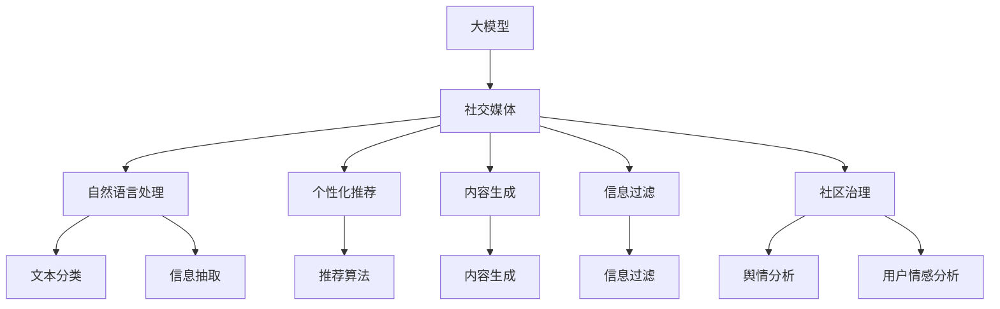

                 

# 大模型时代下的新型社交媒体形态

> 关键词：
- 大模型
- 社交媒体
- 自然语言处理
- 个性化推荐
- 内容生成
- 信息过滤
- 社区生态

## 1. 背景介绍

### 1.1 问题由来

随着人工智能技术和大数据技术的迅猛发展，社交媒体平台的数据规模和应用深度正在发生根本性的变化。传统的社交媒体算法在处理海量数据和复杂用户行为方面显得力不从心，无法满足用户在信息获取和互动体验上的新需求。此时，大语言模型（Large Language Models, LLMs）成为了新的突破口。

大语言模型，如GPT-3、BERT、T5等，通过在大规模无标签文本数据上进行预训练，学习到了丰富的语言知识和常识，具备了强大的语言理解和生成能力。利用这些大模型，社交媒体平台可以为用户提供更加个性化、智能化的信息推荐和服务，改善用户体验，提升平台活跃度和留存率。

### 1.2 问题核心关键点

大模型在社交媒体中的应用主要体现在以下几个方面：

1. **内容生成**：利用大模型自动生成高质量文章、评论、帖子等内容，提升平台内容丰富度，吸引用户关注。
2. **个性化推荐**：根据用户行为和兴趣，利用大模型推荐相关内容，优化用户体验，增加用户粘性。
3. **信息过滤**：使用大模型自动判断信息真实性、筛选敏感内容，维护平台健康生态。
4. **社区治理**：利用大模型进行舆情分析、用户情感分析等，辅助平台管理者更好地管理和运营社区。
5. **客服支持**：使用大模型自动处理用户咨询和反馈，提高客服效率和响应速度。

大模型时代下，社交媒体平台的数据驱动、算法驱动和内容驱动都将实现质的飞跃，为社交媒体带来革命性的变化。

## 2. 核心概念与联系

### 2.1 核心概念概述

要理解大模型在社交媒体中的应用，首先需要了解几个关键概念：

- **大模型**：如GPT-3、BERT、T5等，通过在大规模无标签文本数据上进行预训练，学习到丰富的语言知识和常识，具备强大的语言理解和生成能力。
- **社交媒体**：基于用户间互动的社会化平台，如微博、微信、抖音等，提供信息分享、社交互动、社区治理等功能。
- **自然语言处理**：研究计算机如何理解和生成人类语言的技术，包括文本分类、信息抽取、问答系统等任务。
- **个性化推荐**：根据用户行为和兴趣，自动推荐相关内容，优化用户体验。
- **内容生成**：利用大模型自动生成高质量内容，如文章、评论、帖子等。
- **信息过滤**：使用大模型自动判断信息真实性、筛选敏感内容，维护平台健康生态。
- **社区治理**：利用大模型进行舆情分析、用户情感分析等，辅助平台管理者更好地管理和运营社区。

这些核心概念之间存在紧密的联系，形成了一个完整的社交媒体生态系统。下面通过一个Mermaid流程图来展示这些概念之间的关系：



### 2.2 概念间的关系

大模型和社交媒体平台之间的互动关系主要体现在以下几个方面：

1. **内容生成**：大模型可以根据平台上的文本数据生成高质量的帖子、评论等，丰富平台内容，吸引更多用户。
2. **个性化推荐**：利用大模型的强大理解能力，对用户行为和兴趣进行建模，提供个性化的内容推荐，提升用户满意度。
3. **信息过滤**：大模型可以自动判断信息真实性、筛选敏感内容，维护平台健康生态，减少用户遭受虚假信息和骚扰的风险。
4. **社区治理**：通过大模型进行舆情分析和用户情感分析，辅助平台管理者更好地管理和运营社区，提升平台的用户体验和信任度。

大模型的引入，使得社交媒体平台在处理海量数据和复杂用户行为方面具备了更强的能力，从而在内容丰富度、用户互动体验、社区健康等方面实现了质的提升。

## 3. 核心算法原理 & 具体操作步骤
### 3.1 算法原理概述

大模型在社交媒体中的应用，主要依赖于其强大的语言理解和生成能力。通过对用户行为和兴趣进行建模，利用大模型生成高质量的内容，并对推荐算法进行优化，从而实现个性化推荐。

具体来说，社交媒体平台通过收集用户的行为数据和兴趣标签，使用大模型进行特征提取和表示学习。然后，将这些表示输入到推荐算法中，计算用户和内容的匹配度，生成个性化的推荐结果。此外，大模型还可以用于实时内容生成，为平台提供更丰富、更具吸引力的内容。

### 3.2 算法步骤详解

大模型在社交媒体中的应用，主要包括以下几个关键步骤：

**Step 1: 数据收集与预处理**

社交媒体平台首先收集用户的行为数据和兴趣标签，包括浏览历史、点赞、评论等。这些数据经过预处理，如去除噪声、归一化等，形成可供大模型训练的数据集。

**Step 2: 特征提取与表示学习**

使用大模型对预处理后的数据进行特征提取和表示学习。具体来说，可以将文本数据输入到预训练模型中，得到每个用户和内容的向量表示。这些向量表示可以用于后续的推荐计算和内容生成。

**Step 3: 推荐算法优化**

将用户和内容的向量表示输入到推荐算法中，计算用户和内容的匹配度，生成个性化的推荐结果。常见的推荐算法包括基于协同过滤的算法、基于内容的算法、基于深度学习的算法等。

**Step 4: 实时内容生成**

利用大模型生成实时内容，如文章、评论、帖子等，丰富平台内容，提升用户体验。常见的生成任务包括文本摘要、文本补全、对话生成等。

**Step 5: 信息过滤与社区治理**

使用大模型进行信息过滤，自动判断信息真实性、筛选敏感内容，维护平台健康生态。同时，利用大模型进行舆情分析和用户情感分析，辅助平台管理者更好地管理和运营社区。

### 3.3 算法优缺点

大模型在社交媒体中的应用具有以下优点：

1. **强大的语言理解能力**：大模型能够理解复杂的语言结构和语义关系，为推荐和内容生成提供强大的语义支持。
2. **多模态数据处理能力**：大模型不仅能够处理文本数据，还可以处理图像、视频等多模态数据，提升平台内容的多样性和丰富度。
3. **自动内容生成**：利用大模型自动生成高质量内容，提高内容生产效率，降低运营成本。
4. **个性化推荐**：基于大模型的个性化推荐算法能够更好地理解用户需求，提升用户体验。

同时，大模型在应用中也存在一些缺点：

1. **高计算资源需求**：大模型需要大规模的计算资源进行训练和推理，平台需要投入高额的硬件成本。
2. **过拟合风险**：大模型容易过拟合社交媒体平台特定的数据集，导致在更广泛的场景下表现不佳。
3. **伦理与安全问题**：大模型可能学习到有害信息，生成误导性内容，带来伦理和安全风险。

### 3.4 算法应用领域

大模型在社交媒体中的应用主要集中在以下几个领域：

1. **内容生成**：利用大模型生成高质量文章、评论、帖子等内容，丰富平台内容，吸引用户关注。
2. **个性化推荐**：根据用户行为和兴趣，利用大模型推荐相关内容，优化用户体验。
3. **信息过滤**：使用大模型自动判断信息真实性、筛选敏感内容，维护平台健康生态。
4. **社区治理**：利用大模型进行舆情分析、用户情感分析等，辅助平台管理者更好地管理和运营社区。
5. **客服支持**：使用大模型自动处理用户咨询和反馈，提高客服效率和响应速度。

## 4. 数学模型和公式 & 详细讲解 & 举例说明

### 4.1 数学模型构建

社交媒体平台使用大模型进行个性化推荐时，通常采用的数学模型为协同过滤模型和深度学习模型。协同过滤模型基于用户历史行为和内容标签计算相似度，生成推荐结果。深度学习模型则直接从用户和内容的数据中学习到复杂的特征表示，用于推荐计算。

下面以协同过滤模型为例，展示其数学模型构建过程。

假设社交媒体平台上有N个用户，每个用户有M个历史行为，每个行为表示为(u,i)，其中u为用户ID，i为行为ID（如浏览、点赞、评论等）。每个行为对应一个内容ID，内容表示为i=1,2,...,I。

令 $X$ 为所有用户的历史行为矩阵，$X_{u,i}$ 表示用户u对内容i的评分，即 $X_{u,i}=r_{u,i}$，其中 $r$ 为用户的评分函数。令 $Y$ 为内容的特征向量，$Y_i$ 表示内容i的特征向量，即 $Y_i=\phi(x_i)$，其中 $\phi$ 为特征映射函数。

协同过滤模型的目标是最小化预测误差，即：

$$
\min_{X, Y} \sum_{u=1}^N \sum_{i=1}^I \sum_{j=1}^I (X_{u,i} - \hat{X}_{u,j})^2
$$

其中 $\hat{X}_{u,j}$ 表示用户u对内容j的预测评分。

### 4.2 公式推导过程

协同过滤模型的求解过程主要分为两个步骤：特征提取和推荐计算。

**特征提取**：将内容i输入到预训练大模型中，得到其特征向量 $Y_i$。特征提取过程可以表示为：

$$
Y_i = \phi(x_i)
$$

**推荐计算**：利用用户u的历史行为和内容i的特征向量，计算用户u对内容i的评分 $r_{u,i}$。推荐计算过程可以表示为：

$$
r_{u,i} = \sum_{j=1}^I X_{u,j} Y_j^T
$$

其中 $X_j$ 表示内容j的评分向量，$Y_j^T$ 表示内容j的特征向量转置。

### 4.3 案例分析与讲解

假设某社交媒体平台有100个用户，每个用户浏览了5个不同的内容。利用大模型提取内容的特征向量，构建协同过滤模型进行个性化推荐。

首先，使用大模型对5个内容进行特征提取，得到它们的特征向量 $Y_1, Y_2, Y_3, Y_4, Y_5$。然后，利用每个用户的5个行为，计算每个用户对每个内容的评分 $r_{1,1}, r_{1,2}, \ldots, r_{1,5}$。最后，将用户的历史行为 $X$ 和内容的特征向量 $Y$ 输入到协同过滤模型中，计算用户对每个内容的预测评分 $\hat{X}_{1,1}, \hat{X}_{1,2}, \ldots, \hat{X}_{1,5}$。根据预测评分，为用户推荐最相关的5个内容。

## 5. 项目实践：代码实例和详细解释说明

### 5.1 开发环境搭建

在进行社交媒体平台内容推荐系统的开发前，需要准备好开发环境。以下是使用Python进行PyTorch开发的环境配置流程：

1. 安装Anaconda：从官网下载并安装Anaconda，用于创建独立的Python环境。

2. 创建并激活虚拟环境：
```bash
conda create -n pytorch-env python=3.8 
conda activate pytorch-env
```

3. 安装PyTorch：根据CUDA版本，从官网获取对应的安装命令。例如：
```bash
conda install pytorch torchvision torchaudio cudatoolkit=11.1 -c pytorch -c conda-forge
```

4. 安装TensorFlow：由Google主导开发的开源深度学习框架，生产部署方便，适合大规模工程应用。同样有丰富的预训练语言模型资源。

5. 安装Transformers库：
```bash
pip install transformers
```

6. 安装各类工具包：
```bash
pip install numpy pandas scikit-learn matplotlib tqdm jupyter notebook ipython
```

完成上述步骤后，即可在`pytorch-env`环境中开始微调实践。

### 5.2 源代码详细实现

这里我们以内容生成任务为例，给出使用Transformers库对GPT-3模型进行内容生成的PyTorch代码实现。

首先，定义生成模型：

```python
from transformers import GPT3Model, GPT3Tokenizer

model = GPT3Model.from_pretrained('gpt3')
tokenizer = GPT3Tokenizer.from_pretrained('gpt3')
```

然后，定义生成函数：

```python
from torch.nn.utils.rnn import pad_sequence

def generate_text(model, tokenizer, max_length=128):
    text = "Start of text to generate"
    input_ids = tokenizer.encode(text, return_tensors='pt')
    input_ids = pad_sequence([input_ids], batch_first=True, padding='max_length')
    
    outputs = model.generate(input_ids, max_length=max_length, num_return_sequences=1, temperature=1.0, do_sample=False)
    
    generated_text = tokenizer.decode(outputs[0], skip_special_tokens=True)
    return generated_text
```

最后，启动生成流程：

```python
generated_text = generate_text(model, tokenizer, max_length=128)
print(generated_text)
```

以上就是使用PyTorch对GPT-3进行内容生成的完整代码实现。可以看到，得益于Transformers库的强大封装，我们可以用相对简洁的代码完成GPT-3模型的加载和内容生成。

### 5.3 代码解读与分析

让我们再详细解读一下关键代码的实现细节：

**定义生成模型**：
- 使用Transformers库的GPT3Model和GPT3Tokenizer，从预训练模型和分词器中加载模型和分词器。

**生成函数**：
- 将输入文本转换为token ids，并进行定长padding。
- 将padding后的token ids输入到模型中，生成新的文本。
- 将生成的文本解码为可读文本，返回结果。

**生成流程**：
- 调用生成函数，生成新的文本。
- 打印生成的文本内容。

可以看到，代码实现相对简单，但利用大模型进行内容生成，可以显著提升生成文本的质量和多样性。

## 6. 实际应用场景

### 6.1 智能客服系统

利用大模型进行内容生成，可以为智能客服系统提供自动生成的响应，提升客服效率和用户体验。平台可以将用户的咨询问题输入到预训练模型中，生成对应的回复。这样不仅可以减轻人工客服的负担，还能提升回复的一致性和准确性。

### 6.2 社区内容创作

社交媒体平台可以利用大模型自动生成高质量的文章、评论、帖子等，丰富平台内容，吸引更多用户。例如，利用大模型生成热门话题的讨论、热门事件的评论，提升平台的热度和活跃度。

### 6.3 个性化推荐系统

利用大模型进行推荐算法优化，可以提升个性化推荐系统的性能，提升用户体验。平台可以利用大模型对用户行为和兴趣进行建模，生成个性化的推荐内容，提高用户粘性和满意度。

### 6.4 未来应用展望

随着大模型和微调方法的不断发展，基于大模型微调的社交媒体将呈现以下几个发展趋势：

1. **智能化提升**：大模型将逐步在社交媒体平台的各个环节（如内容生成、推荐、信息过滤等）发挥重要作用，推动平台向更智能化、自动化方向发展。
2. **多模态融合**：社交媒体平台将利用大模型处理文本、图像、视频等多种数据，提升内容的多样性和丰富度，满足用户多方面的需求。
3. **社区治理优化**：利用大模型进行舆情分析和用户情感分析，辅助平台管理者更好地管理和运营社区，提升社区的健康度和互动体验。
4. **个性化推荐优化**：利用大模型进行推荐算法优化，提升个性化推荐系统的性能，满足用户的个性化需求。

## 7. 工具和资源推荐

### 7.1 学习资源推荐

为了帮助开发者系统掌握大模型在社交媒体中的应用，这里推荐一些优质的学习资源：

1. 《Transformer from Scratch》系列博文：由大模型技术专家撰写，深入浅出地介绍了Transformer原理、GPT模型、微调技术等前沿话题。

2. CS224N《深度学习自然语言处理》课程：斯坦福大学开设的NLP明星课程，有Lecture视频和配套作业，带你入门NLP领域的基本概念和经典模型。

3. 《Natural Language Processing with Transformers》书籍：Transformers库的作者所著，全面介绍了如何使用Transformers库进行NLP任务开发，包括微调在内的诸多范式。

4. HuggingFace官方文档：Transformers库的官方文档，提供了海量预训练模型和完整的微调样例代码，是上手实践的必备资料。

5. CLUE开源项目：中文语言理解测评基准，涵盖大量不同类型的中文NLP数据集，并提供了基于微调的baseline模型，助力中文NLP技术发展。

通过对这些资源的学习实践，相信你一定能够快速掌握大模型在社交媒体中的应用技巧，并用于解决实际的NLP问题。

### 7.2 开发工具推荐

高效的开发离不开优秀的工具支持。以下是几款用于大模型微调开发的常用工具：

1. PyTorch：基于Python的开源深度学习框架，灵活动态的计算图，适合快速迭代研究。大部分预训练语言模型都有PyTorch版本的实现。

2. TensorFlow：由Google主导开发的开源深度学习框架，生产部署方便，适合大规模工程应用。同样有丰富的预训练语言模型资源。

3. Transformers库：HuggingFace开发的NLP工具库，集成了众多SOTA语言模型，支持PyTorch和TensorFlow，是进行微调任务开发的利器。

4. Weights & Biases：模型训练的实验跟踪工具，可以记录和可视化模型训练过程中的各项指标，方便对比和调优。与主流深度学习框架无缝集成。

5. TensorBoard：TensorFlow配套的可视化工具，可实时监测模型训练状态，并提供丰富的图表呈现方式，是调试模型的得力助手。

6. Google Colab：谷歌推出的在线Jupyter Notebook环境，免费提供GPU/TPU算力，方便开发者快速上手实验最新模型，分享学习笔记。

合理利用这些工具，可以显著提升大模型微调任务的开发效率，加快创新迭代的步伐。

### 7.3 相关论文推荐

大模型在社交媒体中的应用源于学界的持续研究。以下是几篇奠基性的相关论文，推荐阅读：

1. Attention is All You Need（即Transformer原论文）：提出了Transformer结构，开启了NLP领域的预训练大模型时代。

2. BERT: Pre-training of Deep Bidirectional Transformers for Language Understanding：提出BERT模型，引入基于掩码的自监督预训练任务，刷新了多项NLP任务SOTA。

3. Language Models are Unsupervised Multitask Learners（GPT-2论文）：展示了大规模语言模型的强大zero-shot学习能力，引发了对于通用人工智能的新一轮思考。

4. Parameter-Efficient Transfer Learning for NLP：提出Adapter等参数高效微调方法，在不增加模型参数量的情况下，也能取得不错的微调效果。

5. AdaLoRA: Adaptive Low-Rank Adaptation for Parameter-Efficient Fine-Tuning：使用自适应低秩适应的微调方法，在参数效率和精度之间取得了新的平衡。

6. Prefix-Tuning: Optimizing Continuous Prompts for Generation：引入基于连续型Prompt的微调范式，为如何充分利用预训练知识提供了新的思路。

这些论文代表了大模型微调技术的发展脉络。通过学习这些前沿成果，可以帮助研究者把握学科前进方向，激发更多的创新灵感。

除上述资源外，还有一些值得关注的前沿资源，帮助开发者紧跟大模型微调技术的最新进展，例如：

1. arXiv论文预印本：人工智能领域最新研究成果的发布平台，包括大量尚未发表的前沿工作，学习前沿技术的必读资源。

2. 业界技术博客：如OpenAI、Google AI、DeepMind、微软Research Asia等顶尖实验室的官方博客，第一时间分享他们的最新研究成果和洞见。

3. 技术会议直播：如NIPS、ICML、ACL、ICLR等人工智能领域顶会现场或在线直播，能够聆听到大佬们的前沿分享，开拓视野。

4. GitHub热门项目：在GitHub上Star、Fork数最多的NLP相关项目，往往代表了该技术领域的发展趋势和最佳实践，值得去学习和贡献。

5. 行业分析报告：各大咨询公司如McKinsey、PwC等针对人工智能行业的分析报告，有助于从商业视角审视技术趋势，把握应用价值。

总之，对于大模型在社交媒体中的应用的学习和实践，需要开发者保持开放的心态和持续学习的意愿。多关注前沿资讯，多动手实践，多思考总结，必将收获满满的成长收益。

## 8. 总结：未来发展趋势与挑战

### 8.1 总结

本文对大模型在社交媒体中的应用进行了全面系统的介绍。首先阐述了大模型和微调技术的研究背景和意义，明确了微调在拓展预训练模型应用、提升下游任务性能方面的独特价值。其次，从原理到实践，详细讲解了监督微调的数学原理和关键步骤，给出了微调任务开发的完整代码实例。同时，本文还广泛探讨了微调方法在智能客服、社区内容创作、个性化推荐等多个行业领域的应用前景，展示了微调范式的巨大潜力。此外，本文精选了微调技术的各类学习资源，力求为读者提供全方位的技术指引。

通过本文的系统梳理，可以看到，大模型在社交媒体中的应用已经取得了初步成功，并在内容生成、个性化推荐、信息过滤等多个环节展现了强大的能力。未来，伴随大模型的不断发展，社交媒体平台将能够提供更加智能化、个性化的服务，为用户的社交体验带来质的提升。

### 8.2 未来发展趋势

展望未来，大模型在社交媒体中的应用将呈现以下几个发展趋势：

1. **智能化水平提升**：大模型将在社交媒体的各个环节发挥更重要的作用，推动平台向更智能化、自动化方向发展。
2. **多模态数据处理能力增强**：社交媒体平台将利用大模型处理文本、图像、视频等多种数据，提升内容的多样性和丰富度，满足用户多方面的需求。
3. **个性化推荐系统优化**：利用大模型进行推荐算法优化，提升个性化推荐系统的性能，满足用户的个性化需求。
4. **社区治理优化**：利用大模型进行舆情分析和用户情感分析，辅助平台管理者更好地管理和运营社区，提升社区的健康度和互动体验。

### 8.3 面临的挑战

尽管大模型在社交媒体中的应用已经取得了初步成功，但在迈向更加智能化、普适化应用的过程中，它仍面临着诸多挑战：

1. **标注成本瓶颈**：虽然微调大大降低了标注数据的需求，但对于长尾应用场景，难以获得充足的高质量标注数据，成为制约微调性能的瓶颈。
2. **模型鲁棒性不足**：当前微调模型面对域外数据时，泛化性能往往大打折扣。对于测试样本的微小扰动，微调模型的预测也容易发生波动。
3. **推理效率有待提高**：大模型虽然精度高，但在实际部署时往往面临推理速度慢、内存占用大等效率问题。
4. **可解释性亟需加强**：当前微调模型更像是"黑盒"系统，难以解释其内部工作机制和决策逻辑。对于医疗、金融等高风险应用，算法的可解释性和可审计性尤为重要。
5. **安全性有待保障**：预训练语言模型难免会学习到有害信息，通过微调传递到下游任务，产生误导性、歧视性的输出，给实际应用带来安全隐患。

### 8.4 研究展望

面对大模型在社交媒体应用中所面临的挑战，未来的研究需要在以下几个方面寻求新的突破：

1. **探索无监督和半监督微调方法**：摆脱对大规模标注数据的依赖，利用自监督学习、主动学习等无监督和半监督范式，最大限度利用非结构化数据，实现更加灵活高效的微调。
2. **研究参数高效和计算高效的微调范式**：开发更加参数高效的微调方法，在固定大部分预训练参数的同时，只更新极少量的任务相关参数。同时优化微调模型的计算图，减少前向传播和反向传播的资源消耗，实现更加轻量级、实时性的部署。
3. **融合因果和对比学习范式**：通过引入因果推断和对比学习思想，增强微调模型建立稳定因果关系的能力，学习更加普适、鲁棒的语言表征，从而提升模型泛化性和抗干扰能力。
4. **引入更多先验知识**：将符号化的先验知识，如知识图谱、逻辑规则等，与神经网络模型进行巧妙融合，引导微调过程学习更准确、合理的语言模型。同时加强不同模态数据的整合，实现视觉、语音等多模态信息与文本信息的协同建模。
5. **结合因果分析和博弈论工具**：将因果分析方法引入微调模型，识别出模型决策的关键特征，增强输出解释的因果性和逻辑性。借助博弈论工具刻画人机交互过程，主动探索并规避模型的脆弱点，提高系统稳定性。
6. **纳入伦理道德约束**：在模型训练目标中引入伦理导向的评估指标，过滤和惩罚有偏见、有害的输出倾向。同时加强人工干预和审核，建立模型行为的监管机制，确保输出符合人类价值观和伦理道德。

这些研究方向的探索，必将引领大模型在社交媒体应用中迈向更高的台阶，为构建安全、可靠、可解释、可控的智能系统铺平道路。面向未来，大模型微调技术还需要与其他人工智能技术进行更深入的融合

