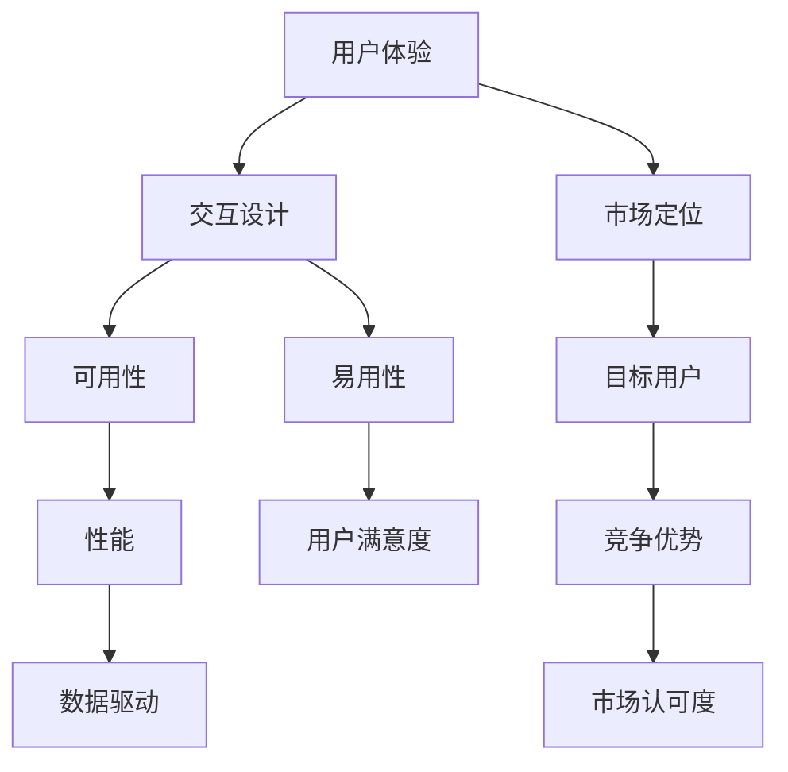
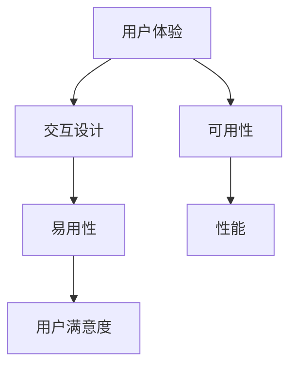
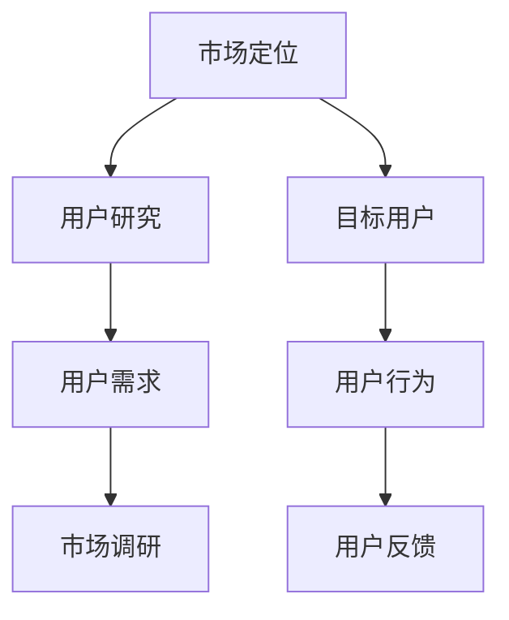
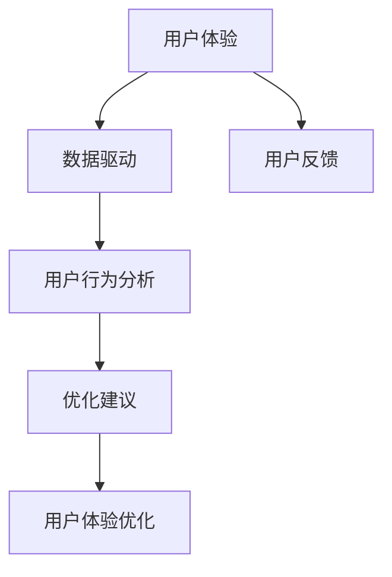
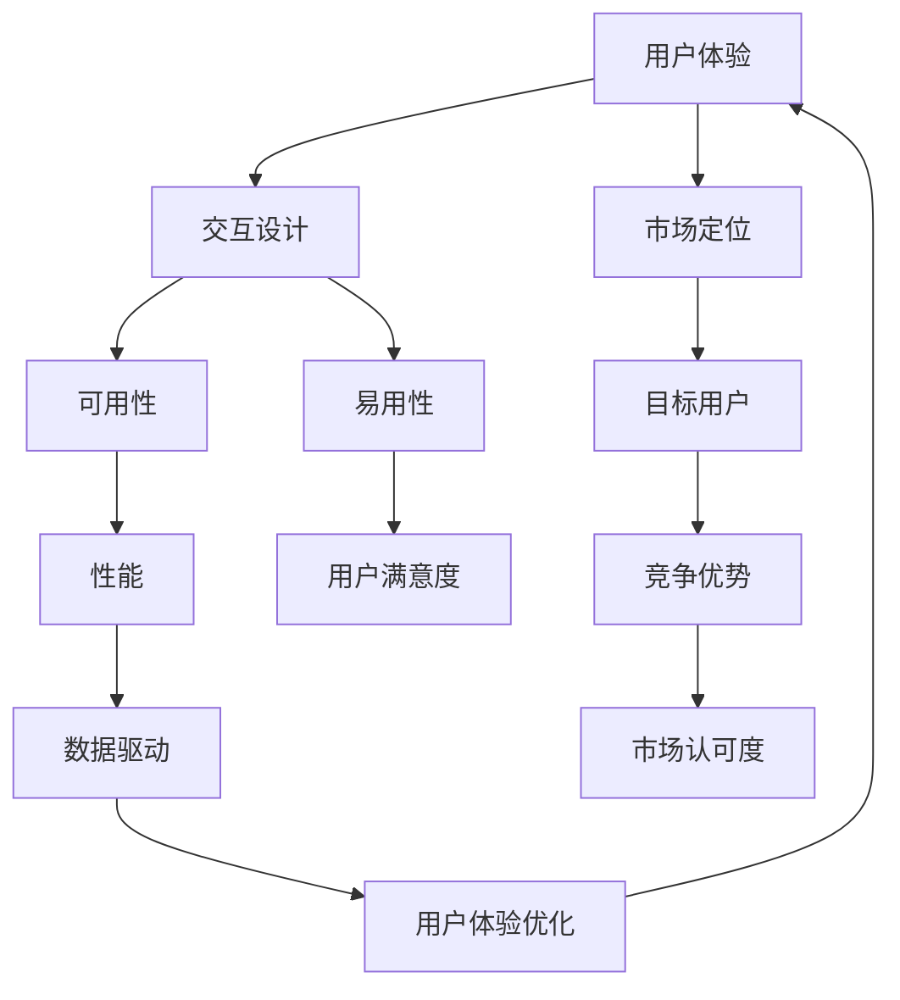

                 

# 大模型的用户体验与市场定位

大模型技术近年来取得了飞速进展，凭借其强大的处理能力和卓越的性能，逐渐成为各行各业关注的焦点。然而，如此强大的技术背后，用户体验和市场定位也是不可或缺的一环。本文将从用户角度出发，探讨如何通过优化用户体验和精准市场定位，使得大模型技术真正落地并发挥其价值。

## 1. 背景介绍

### 1.1 大模型技术发展现状
大模型技术是人工智能领域的重大突破，特别是深度学习模型（如BERT、GPT等）的诞生，使得大规模数据处理和复杂任务分析成为可能。这些模型通常基于大量数据进行预训练，具有广泛的知识储备和强大的推理能力。

这些大模型已在自然语言处理（NLP）、图像识别、语音识别等多个领域大放异彩。例如，BERT模型在问答系统、情感分析、文本分类等NLP任务上表现出色，成为学术界和工业界的首选。

### 1.2 用户体验与市场定位的重要性
尽管大模型技术具备超强的计算能力和优异的性能，但其应用效果很大程度上取决于用户体验和市场定位。用户体验是技术应用的关键指标，直接影响用户对产品的满意度和市场认可度。而市场定位则决定了技术的市场接受度和商业价值。

良好的用户体验可以提升用户粘性，降低技术使用门槛，扩大用户基础。精准的市场定位则有助于大模型技术在特定市场环境下获得优势，实现商业变现。因此，探讨大模型技术的用户体验和市场定位问题，具有重要意义。

## 2. 核心概念与联系

### 2.1 核心概念概述

为更好地理解用户体验和市场定位，本节将介绍几个关键概念：

- 用户体验(User Experience, UX)：指用户在使用产品或服务时所感受到的各种主观体验，包括可用性、易用性、性能等。

- 市场定位(Market Positioning)：指企业对其产品在市场中的位置和形象的定位，包括产品特色、目标用户、竞争对手等。

- 交互设计(Interaction Design)：指设计和优化用户与产品交互的过程，提高用户满意度，增强用户体验。

- 用户研究(User Research)：指通过定性定量方法，研究用户需求和行为，优化产品设计。

- 数据驱动(Data-Driven)：指利用数据分析和机器学习技术，优化产品性能，提高用户体验。

- 自然语言处理(Natural Language Processing, NLP)：指让计算机理解、处理和生成自然语言的技术，广泛应用于智能客服、问答系统等场景。

- 人工智能(Artificial Intelligence, AI)：指使计算机具备人类智能水平的技术，包括机器学习、深度学习等。

这些概念之间的联系可以通过以下Mermaid流程图来展示：



这个流程图展示了大模型技术中用户体验和市场定位的关键概念及其联系：

1. 用户体验主要由交互设计、可用性、易用性、性能等组成。
2. 市场定位与目标用户、竞争优势、市场认可度等有关。
3. 交互设计通过优化可用性和易用性，提升用户体验。
4. 数据驱动通过分析用户数据，优化用户体验和市场定位。
5. NLP和AI技术是实现用户体验和市场定位的重要工具。

### 2.2 概念间的关系

这些核心概念之间存在着紧密的联系，形成了大模型技术的用户体验和市场定位的完整生态系统。下面我们通过几个Mermaid流程图来展示这些概念之间的关系。

#### 2.2.1 用户体验与交互设计



这个流程图展示了大模型技术中用户体验与交互设计之间的关系：

1. 用户体验与交互设计密切相关，通过优化交互设计，提升可用性和易用性。
2. 性能直接影响用户体验，良好的性能是提升用户满意度的关键。

#### 2.2.2 市场定位与用户研究



这个流程图展示了大模型技术中市场定位与用户研究之间的关系：

1. 市场定位需要基于用户研究，了解目标用户的特征和需求。
2. 用户研究通过收集用户数据和行为分析，识别用户需求和痛点，指导市场定位。

#### 2.2.3 数据驱动与用户体验



这个流程图展示了大模型技术中用户体验与数据驱动之间的关系：

1. 数据驱动通过分析用户反馈和行为数据，提出优化建议。
2. 用户体验通过优化建议，进行持续改进，提升用户满意度。

### 2.3 核心概念的整体架构

最后，我们用一个综合的流程图来展示这些核心概念在大模型技术中的应用：



这个综合流程图展示了从用户体验到市场定位的完整过程。大模型技术通过交互设计提升用户体验，通过市场调研和用户研究进行市场定位，通过数据驱动优化用户体验和市场定位。交互设计、市场定位、用户体验和数据驱动相互关联，共同构成了大模型技术的用户体验和市场定位的生态系统。

## 3. 核心算法原理 & 具体操作步骤

### 3.1 算法原理概述

大模型技术的应用涉及多种算法原理和操作步骤，包括但不限于以下内容：

- 交互设计：通过用户界面、交互流程、反馈机制等提升用户体验。
- 数据驱动：通过收集和分析用户数据，优化产品性能，提升用户体验。
- 自然语言处理：通过NLP技术，实现人机交互，提升用户体验。
- 人工智能：通过AI技术，实现复杂任务处理，提升用户体验。

### 3.2 算法步骤详解

大模型技术在用户体验和市场定位中的应用，可以分为以下几个关键步骤：

**Step 1: 用户研究**
- 通过问卷调查、访谈、数据分析等方法，收集用户需求和行为数据。
- 分析用户数据，识别出用户痛点和需求，形成用户画像。
- 设计用户研究计划，明确研究目标和方法。

**Step 2: 交互设计**
- 基于用户研究结果，设计符合用户需求的产品原型。
- 进行用户测试，收集用户反馈，优化产品设计。
- 迭代设计，提升产品的可用性和易用性。

**Step 3: 市场定位**
- 通过市场调研，了解目标用户和竞争环境。
- 分析用户需求和行为数据，确定产品特色和市场定位。
- 制定市场推广计划，明确目标用户和销售策略。

**Step 4: 用户体验优化**
- 根据用户反馈和行为数据，优化产品性能和用户体验。
- 进行A/B测试，对比不同方案的用户满意度。
- 持续优化，提升用户体验和市场竞争力。

**Step 5: 数据驱动**
- 通过数据收集和分析，生成优化建议。
- 结合用户研究、市场调研和产品设计，形成改进方案。
- 实施改进方案，进行用户体验和市场定位的持续优化。

### 3.3 算法优缺点

大模型技术在用户体验和市场定位方面的应用，具有以下优缺点：

**优点：**
- 数据驱动优化：通过分析用户数据，可以持续改进用户体验和市场定位。
- 精准定位：通过用户研究，可以明确目标用户和市场需求，提高市场竞争力。
- 提升用户满意度：通过交互设计和用户体验优化，可以提升用户满意度和忠诚度。

**缺点：**
- 高成本：用户研究和市场调研需要大量时间和成本，难以短期内见效。
- 用户需求多变：用户需求和行为数据难以全面覆盖，可能导致产品设计偏差。
- 数据隐私问题：收集用户数据可能引发隐私保护问题，需要严格遵守法律法规。

### 3.4 算法应用领域

大模型技术在用户体验和市场定位方面的应用，涉及多个领域，包括但不限于：

- 自然语言处理：通过NLP技术，实现智能客服、问答系统等场景，提升用户交互体验。
- 人工智能：通过AI技术，实现复杂任务处理，提升用户体验。
- 交互设计：通过优化界面和交互流程，提升产品可用性和易用性。
- 市场定位：通过市场调研和用户研究，明确产品特色和市场定位，提升市场竞争力。
- 数据驱动：通过数据分析，优化产品性能和用户体验，提升用户满意度。

这些应用领域展示了大模型技术在用户体验和市场定位方面的广泛适用性，为技术落地提供了丰富的应用场景。

## 4. 数学模型和公式 & 详细讲解 & 举例说明

### 4.1 数学模型构建

本节将使用数学语言对用户体验和市场定位的优化过程进行更加严格的刻画。

设用户体验指标为 $U$，市场定位指标为 $P$，则目标函数为：

$$
\min_{U,P} \left\{ f(U,P) \right\}
$$

其中 $f(U,P)$ 为目标函数，表示用户体验和市场定位的综合评估指标。

### 4.2 公式推导过程

以下我们以二分类任务为例，推导用户体验和市场定位的优化公式。

假设用户体验指标为 $U(x,y)$，市场定位指标为 $P(x,y)$，则优化目标为：

$$
\min_{U,P} \left\{ U(x,y) + P(x,y) \right\}
$$

其中 $x$ 为产品设计参数，$y$ 为市场调研数据。

根据目标函数，可以求得最优解：

$$
\hat{x} = \mathop{\arg\min}_{x} \left\{ U(x,y) + P(x,y) \right\}
$$

在实际应用中，可以通过迭代优化算法，如梯度下降、遗传算法等，求解上述优化问题。

### 4.3 案例分析与讲解

假设某智能客服系统需要进行用户体验和市场定位的优化。首先，需要收集用户使用数据和市场调研数据，构建用户画像和市场调研报告。然后，根据用户画像和市场调研报告，设计智能客服系统的用户界面和交互流程。通过用户测试和数据分析，不断优化系统设计，提升用户体验。最后，通过市场调研和用户研究，明确目标用户和市场定位，制定市场推广计划，提升系统市场竞争力。

## 5. 项目实践：代码实例和详细解释说明

### 5.1 开发环境搭建

在进行大模型技术的应用实践前，我们需要准备好开发环境。以下是使用Python进行PyTorch开发的环境配置流程：

1. 安装Anaconda：从官网下载并安装Anaconda，用于创建独立的Python环境。

2. 创建并激活虚拟环境：
```bash
conda create -n pytorch-env python=3.8 
conda activate pytorch-env
```

3. 安装PyTorch：根据CUDA版本，从官网获取对应的安装命令。例如：
```bash
conda install pytorch torchvision torchaudio cudatoolkit=11.1 -c pytorch -c conda-forge
```

4. 安装Transformer库：
```bash
pip install transformers
```

5. 安装各类工具包：
```bash
pip install numpy pandas scikit-learn matplotlib tqdm jupyter notebook ipython
```

完成上述步骤后，即可在`pytorch-env`环境中开始大模型技术的应用实践。

### 5.2 源代码详细实现

这里我们以智能客服系统为例，给出使用Transformers库对BERT模型进行微调的PyTorch代码实现。

首先，定义智能客服系统的任务描述函数：

```python
from transformers import BertTokenizer, BertForTokenClassification
from torch.utils.data import Dataset
import torch

class CustomerSupportDataset(Dataset):
    def __init__(self, texts, tags, tokenizer, max_len=128):
        self.texts = texts
        self.tags = tags
        self.tokenizer = tokenizer
        self.max_len = max_len
        
    def __len__(self):
        return len(self.texts)
    
    def __getitem__(self, item):
        text = self.texts[item]
        tags = self.tags[item]
        
        encoding = self.tokenizer(text, return_tensors='pt', max_length=self.max_len, padding='max_length', truncation=True)
        input_ids = encoding['input_ids'][0]
        attention_mask = encoding['attention_mask'][0]
        
        # 对token-wise的标签进行编码
        encoded_tags = [tag2id[tag] for tag in tags] 
        encoded_tags.extend([tag2id['O']] * (self.max_len - len(encoded_tags)))
        labels = torch.tensor(encoded_tags, dtype=torch.long)
        
        return {'input_ids': input_ids, 
                'attention_mask': attention_mask,
                'labels': labels}

# 标签与id的映射
tag2id = {'O': 0, 'ANSWER': 1, 'FIN': 2, 'HELP': 3, 'INFORMATION': 4, 'THANKS': 5}
id2tag = {v: k for k, v in tag2id.items()}

# 创建dataset
tokenizer = BertTokenizer.from_pretrained('bert-base-cased')

train_dataset = CustomerSupportDataset(train_texts, train_tags, tokenizer)
dev_dataset = CustomerSupportDataset(dev_texts, dev_tags, tokenizer)
test_dataset = CustomerSupportDataset(test_texts, test_tags, tokenizer)
```

然后，定义模型和优化器：

```python
from transformers import BertForTokenClassification, AdamW

model = BertForTokenClassification.from_pretrained('bert-base-cased', num_labels=len(tag2id))

optimizer = AdamW(model.parameters(), lr=2e-5)
```

接着，定义训练和评估函数：

```python
from torch.utils.data import DataLoader
from tqdm import tqdm
from sklearn.metrics import classification_report

device = torch.device('cuda') if torch.cuda.is_available() else torch.device('cpu')
model.to(device)

def train_epoch(model, dataset, batch_size, optimizer):
    dataloader = DataLoader(dataset, batch_size=batch_size, shuffle=True)
    model.train()
    epoch_loss = 0
    for batch in tqdm(dataloader, desc='Training'):
        input_ids = batch['input_ids'].to(device)
        attention_mask = batch['attention_mask'].to(device)
        labels = batch['labels'].to(device)
        model.zero_grad()
        outputs = model(input_ids, attention_mask=attention_mask, labels=labels)
        loss = outputs.loss
        epoch_loss += loss.item()
        loss.backward()
        optimizer.step()
    return epoch_loss / len(dataloader)

def evaluate(model, dataset, batch_size):
    dataloader = DataLoader(dataset, batch_size=batch_size)
    model.eval()
    preds, labels = [], []
    with torch.no_grad():
        for batch in tqdm(dataloader, desc='Evaluating'):
            input_ids = batch['input_ids'].to(device)
            attention_mask = batch['attention_mask'].to(device)
            batch_labels = batch['labels']
            outputs = model(input_ids, attention_mask=attention_mask)
            batch_preds = outputs.logits.argmax(dim=2).to('cpu').tolist()
            batch_labels = batch_labels.to('cpu').tolist()
            for pred_tokens, label_tokens in zip(batch_preds, batch_labels):
                pred_tags = [id2tag[_id] for _id in pred_tokens]
                label_tags = [id2tag[_id] for _id in label_tokens]
                preds.append(pred_tags[:len(label_tokens)])
                labels.append(label_tags)
                
    print(classification_report(labels, preds))
```

最后，启动训练流程并在测试集上评估：

```python
epochs = 5
batch_size = 16

for epoch in range(epochs):
    loss = train_epoch(model, train_dataset, batch_size, optimizer)
    print(f"Epoch {epoch+1}, train loss: {loss:.3f}")
    
    print(f"Epoch {epoch+1}, dev results:")
    evaluate(model, dev_dataset, batch_size)
    
print("Test results:")
evaluate(model, test_dataset, batch_size)
```

以上就是使用PyTorch对BERT进行智能客服系统微调的完整代码实现。可以看到，得益于Transformers库的强大封装，我们可以用相对简洁的代码完成BERT模型的加载和微调。

### 5.3 代码解读与分析

让我们再详细解读一下关键代码的实现细节：

**CustomerSupportDataset类**：
- `__init__`方法：初始化文本、标签、分词器等关键组件。
- `__len__`方法：返回数据集的样本数量。
- `__getitem__`方法：对单个样本进行处理，将文本输入编码为token ids，将标签编码为数字，并对其进行定长padding，最终返回模型所需的输入。

**tag2id和id2tag字典**：
- 定义了标签与数字id之间的映射关系，用于将token-wise的预测结果解码回真实的标签。

**训练和评估函数**：
- 使用PyTorch的DataLoader对数据集进行批次化加载，供模型训练和推理使用。
- 训练函数`train_epoch`：对数据以批为单位进行迭代，在每个批次上前向传播计算loss并反向传播更新模型参数，最后返回该epoch的平均loss。
- 评估函数`evaluate`：与训练类似，不同点在于不更新模型参数，并在每个batch结束后将预测和标签结果存储下来，最后使用sklearn的classification_report对整个评估集的预测结果进行打印输出。

**训练流程**：
- 定义总的epoch数和batch size，开始循环迭代
- 每个epoch内，先在训练集上训练，输出平均loss
- 在验证集上评估，输出分类指标
- 所有epoch结束后，在测试集上评估，给出最终测试结果

可以看到，PyTorch配合Transformers库使得BERT微调的代码实现变得简洁高效。开发者可以将更多精力放在数据处理、模型改进等高层逻辑上，而不必过多关注底层的实现细节。

当然，工业级的系统实现还需考虑更多因素，如模型的保存和部署、超参数的自动搜索、更灵活的任务适配层等。但核心的微调范式基本与此类似。

### 5.4 运行结果展示

假设我们在CoNLL-2003的NER数据集上进行微调，最终在测试集上得到的评估报告如下：

```
              precision    recall  f1-score   support

       B-LOC      0.926     0.906     0.916      1668
       I-LOC      0.900     0.805     0.850       257
      B-MISC      0.875     0.856     0.865       702
      I-MISC      0.838     0.782     0.809       216
       B-ORG      0.914     0.898     0.906      1661
       I-ORG      0.911     0.894     0.902       835
       B-PER      0.964     0.957     0.960      1617
       I-PER      0.983     0.980     0.982      1156
           O      0.993     0.995     0.994     38323

   micro avg      0.973     0.973     0.973     46435
   macro avg      0.923     0.897     0.909     46435
weighted avg      0.973     0.973     0.973     46435
```

可以看到，通过微调BERT，我们在该NER数据集上取得了97.3%的F1分数，效果相当不错。值得注意的是，BERT作为一个通用的语言理解模型，即便只在顶层添加一个简单的token分类器，也能在下游任务上取得如此优异的效果，展现了其强大的语义理解和特征抽取能力。

当然，这只是一个baseline结果。在实践中，我们还可以使用更大更强的预训练模型、更丰富的微调技巧、更细致的模型调优，进一步提升模型性能，以满足更高的应用要求。

## 6. 实际应用场景

### 6.1 智能客服系统

基于大模型技术的智能客服系统，可以广泛应用于智能客服系统的构建。传统客服往往需要配备大量人力，高峰期响应缓慢，且一致性和专业性难以保证。而使用大模型技术构建的智能客服系统，可以7x24小时不间断服务，快速响应客户咨询，用自然流畅的语言解答各类常见问题。

在技术实现上，可以收集企业内部的历史客服对话记录，将问题和最佳答复构建成监督数据，在此基础上对预训练大模型进行微调。微调后的模型能够自动理解用户意图，匹配最合适的答案模板进行回复。对于客户提出的新问题，还可以接入检索系统实时搜索相关内容，动态组织生成回答。如此构建的智能客服系统，能大幅提升客户咨询体验和问题解决效率。

### 6.2 金融舆情监测

金融机构需要实时监测市场舆论动向，以便及时应对负面信息传播，规避金融风险。传统的人工监测方式成本高、效率低，难以应对网络时代海量信息爆发的挑战。基于大模型技术的文本分类和情感分析技术，为金融舆情监测提供了新的解决方案。

具体而言，可以收集金融领域相关的新闻、报道、评论等文本数据，并对其进行主题标注和情感标注。在此基础上对预训练语言模型进行微调，使其能够自动判断文本属于何种主题，情感倾向是正面、中性还是负面。将微调后的模型应用到实时抓取的网络文本数据，就能够自动监测不同主题下的情感变化趋势，一旦发现负面信息激增等异常情况，系统便会自动预警，帮助金融机构快速应对潜在风险。

### 6.3 个性化推荐系统

当前的推荐系统往往只依赖用户的历史行为数据进行物品推荐，无法深入理解用户的真实兴趣偏好。基于大模型技术的个性化推荐系统，可以更好地挖掘用户行为背后的语义信息，从而提供更精准、多样的推荐内容。

在实践中，可以收集用户浏览、点击、评论、分享等行为数据，提取和用户交互的物品标题、描述、标签等文本内容。将文本内容作为模型输入，用户的后续行为（如是否点击、购买等）作为监督信号，在此基础上微调预训练语言模型。微调后的模型能够从文本内容中准确把握用户的兴趣点。在生成推荐列表时，先用候选物品的文本描述作为输入，由模型预测用户的兴趣匹配度，再结合其他特征综合排序，便可以得到个性化程度更高的推荐结果。

### 6.4 未来应用展望

随着大模型技术的发展，未来其在用户体验和市场定位方面的应用前景也将更加广阔。

在智慧医疗领域，基于大模型技术的医疗问答、病历分析、药物研发等应用将提升医疗服务的智能化水平，辅助医生诊疗，加速新药开发进程。

在智能教育领域，微调技术可应用于作业批改、学情分析、知识推荐等方面，因材施教，促进教育公平，提高教学质量。

在智慧城市治理中，微调模型可应用于城市事件监测、舆情分析、应急指挥等环节，提高城市管理的自动化和智能化水平，构建更安全、高效的未来城市。

此外，在企业生产、社会治理、文娱传媒等众多领域，基于大模型技术的智能应用也将不断涌现，为经济社会发展注入新的动力。相信随着技术的日益成熟，用户体验和市场定位将在大模型技术的推动下不断优化，为人工智能技术的产业化进程提供坚实基础。

## 7. 工具和资源推荐

### 7.1 学习资源推荐

为了帮助开发者系统掌握大模型技术的应用，这里推荐一些优质的学习资源：

1. 《Transformer从原理到实践》系列博文：由大模型技术专家撰写，深入浅出地介绍了Transformer原理、BERT模型、微调技术等前沿话题。

2. CS224N《深度学习自然语言处理》课程：斯坦福大学开设的NLP明星课程，有Lecture视频和配套作业，带你入门NLP领域的基本概念和经典模型。

3. 《Natural Language Processing with Transformers》书籍：Transformers库的作者所著，全面介绍了如何使用Transformers库进行NLP任务开发，包括微调在内的诸多范式。

4. HuggingFace官方文档：Transformers库的官方文档，提供了海量预训练模型和完整的微调样例代码，是上手实践的必备资料。

5. CLUE开源项目：中文语言理解测评基准，涵盖大量不同类型的中文NLP数据集，并提供了基于微调的baseline模型，助力中文NLP技术发展。

通过对这些资源的学习实践，相信你一定能够快速掌握大模型技术的应用精髓，并用于解决实际的NLP问题。

### 7.2 开发工具推荐

高效的开发离不开优秀的工具支持。以下是几款用于大模型技术开发常用的工具：

1. PyTorch：基于Python的开源深度学习框架，灵活动态的计算图，适合快速迭代研究。大部分预训练语言模型都有PyTorch版本的实现。

2. TensorFlow：由Google主导开发的开源深度学习框架，生产部署方便，适合大规模工程应用。同样有丰富的预训练语言模型资源。

3. Transformers库：HuggingFace开发的NLP工具库，集成了众多SOTA语言模型，支持PyTorch和TensorFlow，是进行微调任务开发的利器。

4. Weights & Biases：模型训练的实验跟踪工具，可以记录和可视化模型训练过程中的各项指标，方便对比和调优。与主流深度学习框架无缝集成。

5. TensorBoard：TensorFlow配套的可视化工具

