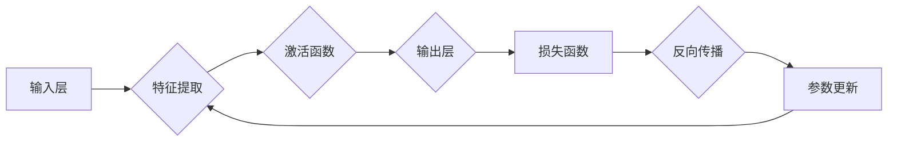

# 神经网络：开启智能新纪元

> 关键词：神经网络，深度学习，人工神经网络，机器学习，感知器，反向传播，神经网络架构，人工智能，深度学习框架

## 1. 背景介绍

自20世纪50年代以来，人工智能（AI）领域经历了多次起伏。其中，神经网络的出现和发展，无疑是最具里程碑意义的突破之一。神经网络，这一模拟人脑神经元工作原理的计算模型，为人工智能带来了新的生命，开启了一个全新的智能时代。

### 1.1 问题的由来

在早期的人工智能研究中，符号主义和知识表示方法占据了主导地位。然而，这些方法在处理复杂模式识别和决策问题时，往往显得力不从心。为了解决这一问题，科学家们开始探索人脑神经元的工作原理，并试图将其模拟到计算机系统中。

### 1.2 研究现状

近年来，随着计算能力的提升和大数据的涌现，深度学习技术得到了快速发展。深度神经网络（DNN）在图像识别、语音识别、自然语言处理等领域取得了突破性成果，推动了人工智能技术的广泛应用。

### 1.3 研究意义

神经网络的研究意义在于：
- 提供了一种高效的模式识别和决策方法，能够处理复杂的非线性问题。
- 模拟人脑神经元的工作原理，为理解人脑信息处理机制提供了新的视角。
- 推动人工智能技术的应用，为人类社会带来更多便利。

### 1.4 本文结构

本文将系统介绍神经网络的基本概念、算法原理、实现步骤、应用场景以及未来发展趋势。内容安排如下：
- 第2部分，介绍神经网络的核心概念与联系。
- 第3部分，详细阐述神经网络的算法原理和具体操作步骤。
- 第4部分，讲解神经网络的数学模型和公式。
- 第5部分，给出神经网络的项目实践案例。
- 第6部分，探讨神经网络在实际应用场景中的案例。
- 第7部分，推荐神经网络相关的学习资源、开发工具和参考文献。
- 第8部分，总结神经网络的研究成果、未来发展趋势和面临的挑战。
- 第9部分，附录中列举常见问题与解答。

## 2. 核心概念与联系

### 2.1 核心概念

- **神经元**：神经网络的基本单元，负责接收输入信号、计算输出信号，并通过权重传递信号。
- **网络层**：由多个神经元组成，负责提取特征、传递信息。
- **激活函数**：对神经元输出进行非线性变换，使神经网络能够学习非线性关系。
- **损失函数**：衡量模型预测结果与真实值之间的差异，用于优化模型参数。
- **反向传播算法**：通过计算损失函数对网络参数的梯度，优化网络参数。

### 2.2 核心概念原理和架构的 Mermaid 流程图



### 2.3 核心概念之间的联系

神经网络由多个层组成，输入层接收原始数据，经过特征提取层提取特征信息，再通过激活函数进行非线性变换，最终输出层得到预测结果。损失函数用于衡量预测结果与真实值之间的差异，反向传播算法根据损失函数对网络参数进行优化，从而提高模型的准确性。

## 3. 核心算法原理 & 具体操作步骤

### 3.1 算法原理概述

神经网络的核心算法包括前向传播和反向传播。

- **前向传播**：从输入层开始，逐层计算每个神经元的输出，直到输出层得到最终预测结果。
- **反向传播**：根据损失函数计算输出层到输入层的梯度，反向更新网络参数，使得模型预测结果更接近真实值。

### 3.2 算法步骤详解

1. **初始化参数**：随机初始化网络参数，包括权重和偏置。
2. **前向传播**：计算每个神经元的输出，并传递到下一层。
3. **计算损失**：使用损失函数计算预测结果与真实值之间的差异。
4. **反向传播**：根据损失函数计算梯度，反向更新网络参数。
5. **迭代优化**：重复步骤2-4，直到满足停止条件（如损失函数收敛、达到预设迭代次数等）。

### 3.3 算法优缺点

#### 优点

- **强大的非线性建模能力**：通过多层网络结构，神经网络可以学习复杂的非线性关系。
- **自动特征提取**：神经网络能够自动从数据中提取特征，无需人工设计特征。
- **泛化能力**：神经网络具有较好的泛化能力，能够适应新的数据分布。

#### 缺点

- **计算复杂度高**：神经网络需要大量的计算资源，对硬件要求较高。
- **数据需求量大**：神经网络需要大量标注数据进行训练，对数据质量要求较高。
- **参数调优困难**：神经网络参数众多，调参过程复杂，需要经验和技巧。

### 3.4 算法应用领域

神经网络在众多领域取得了显著成果，包括：

- **图像识别**：如人脸识别、物体检测、图像分割等。
- **语音识别**：如语音转文字、语音合成、语音情感分析等。
- **自然语言处理**：如文本分类、机器翻译、文本生成等。
- **医疗诊断**：如疾病检测、药物研发、基因分析等。
- **金融风控**：如欺诈检测、信用评分、投资策略等。

## 4. 数学模型和公式 & 详细讲解 & 举例说明

### 4.1 数学模型构建

神经网络的数学模型主要由以下公式构成：

$$
z = \sum_{j} w_{ij} x_j + b_i
$$

$$
a_i = \sigma(z)
$$

$$
\delta_{ij} = \frac{\partial L}{\partial z_j}
$$

$$
\theta = \theta - \alpha \left[ \frac{\partial L}{\partial w_{ij}} + \lambda \frac{\partial L}{\partial w_{ij}} \right]
$$

其中：
- $z$ 为神经元计算结果。
- $w_{ij}$ 为权重。
- $b_i$ 为偏置。
- $a_i$ 为激活函数输出。
- $\sigma$ 为激活函数。
- $L$ 为损失函数。
- $\delta_{ij}$ 为梯度。
- $\theta$ 为参数向量。
- $\alpha$ 为学习率。
- $\lambda$ 为正则化系数。

### 4.2 公式推导过程

以下以单层感知器为例，说明公式推导过程。

#### 激活函数

单层感知器的激活函数通常采用线性激活函数，即：

$$
\sigma(z) = z
$$

#### 损失函数

常见的损失函数包括均方误差（MSE）和交叉熵损失（CrossEntropyLoss）。

- **均方误差**：

$$
L = \frac{1}{2} \sum_{i=1}^n (y_i - a_i)^2
$$

- **交叉熵损失**：

$$
L = -\sum_{i=1}^n y_i \log a_i
$$

#### 反向传播

反向传播算法通过计算损失函数对网络参数的梯度，更新网络参数。

- **计算梯度**：

对于权重 $w_{ij}$ 的梯度：

$$
\frac{\partial L}{\partial w_{ij}} = \frac{\partial L}{\partial z_i} \cdot \frac{\partial z_i}{\partial w_{ij}}
$$

其中：

$$
\frac{\partial L}{\partial z_i} = (y_i - a_i)
$$

$$
\frac{\partial z_i}{\partial w_{ij}} = x_j
$$

- **更新权重**：

$$
\theta = \theta - \alpha \left[ \frac{\partial L}{\partial w_{ij}} + \lambda \frac{\partial L}{\partial w_{ij}} \right]
$$

### 4.3 案例分析与讲解

以下以使用PyTorch实现一个简单的多层感知器模型为例，说明神经网络的实现过程。

```python
import torch
import torch.nn as nn

class NeuralNetwork(nn.Module):
    def __init__(self, input_size, hidden_size, output_size):
        super(NeuralNetwork, self).__init__()
        self.fc1 = nn.Linear(input_size, hidden_size)
        self.relu = nn.ReLU()
        self.fc2 = nn.Linear(hidden_size, output_size)

    def forward(self, x):
        x = self.fc1(x)
        x = self.relu(x)
        x = self.fc2(x)
        return x

# 模型参数
input_size = 784  # 输入层神经元数量
hidden_size = 128  # 隐藏层神经元数量
output_size = 10  # 输出层神经元数量

# 实例化模型
model = NeuralNetwork(input_size, hidden_size, output_size)
```

在这个例子中，我们定义了一个简单的多层感知器模型，包含一个输入层、一个隐藏层和一个输出层。输入层神经元数量与输入数据维度一致，隐藏层神经元数量为128，输出层神经元数量为10。

## 5. 项目实践：代码实例和详细解释说明

### 5.1 开发环境搭建

在进行神经网络项目实践前，我们需要准备好开发环境。以下是使用Python进行PyTorch开发的环境配置流程：

1. 安装Anaconda：从官网下载并安装Anaconda，用于创建独立的Python环境。
2. 创建并激活虚拟环境：
```bash
conda create -n pytorch-env python=3.8
conda activate pytorch-env
```
3. 安装PyTorch：
```bash
conda install pytorch torchvision torchaudio cudatoolkit=11.1 -c pytorch -c conda-forge
```
4. 安装NumPy、Pandas、Scikit-learn、Matplotlib等常用库：
```bash
pip install numpy pandas scikit-learn matplotlib
```

### 5.2 源代码详细实现

以下是一个使用PyTorch实现多层感知器模型的完整示例：

```python
import torch
import torch.nn as nn
import torch.optim as optim
from torch.utils.data import DataLoader, TensorDataset

# 加载数据
x_train = torch.randn(100, 784)
y_train = torch.randint(0, 10, (100,))

# 创建数据集和数据加载器
train_dataset = TensorDataset(x_train, y_train)
train_loader = DataLoader(train_dataset, batch_size=10, shuffle=True)

# 模型参数
input_size = 784  # 输入层神经元数量
hidden_size = 128  # 隐藏层神经元数量
output_size = 10  # 输出层神经元数量

# 实例化模型
model = NeuralNetwork(input_size, hidden_size, output_size)

# 损失函数和优化器
criterion = nn.CrossEntropyLoss()
optimizer = optim.SGD(model.parameters(), lr=0.01)

# 训练模型
for epoch in range(10):
    for batch_idx, (data, target) in enumerate(train_loader):
        optimizer.zero_grad()
        output = model(data)
        loss = criterion(output, target)
        loss.backward()
        optimizer.step()
        if batch_idx % 10 == 0:
            print(f'Train Epoch: {epoch} [{batch_idx * len(data)}/{len(train_loader.dataset)} ({100. * batch_idx / len(train_loader):.0f}%)]\tLoss: {loss.item():.6f}')

# 保存模型
torch.save(model.state_dict(), 'model.pth')
```

### 5.3 代码解读与分析

- **加载数据**：这里我们使用随机生成的数据来模拟真实场景。
- **创建数据集和数据加载器**：使用TensorDataset创建数据集，使用DataLoader进行批量加载。
- **模型参数**：定义输入层、隐藏层和输出层神经元数量。
- **实例化模型**：创建一个多层感知器模型。
- **损失函数和优化器**：定义交叉熵损失函数和SGD优化器。
- **训练模型**：使用训练数据和标签进行模型训练，并在每个epoch结束后打印loss信息。
- **保存模型**：将训练好的模型参数保存到文件中。

通过以上代码，我们可以实现一个简单的多层感知器模型，并将其应用于分类任务。

### 5.4 运行结果展示

运行上述代码后，模型将在训练集上进行训练，并在每个epoch结束后打印loss信息。最终，我们可以将训练好的模型参数保存到文件中，以便后续使用。

## 6. 实际应用场景

### 6.1 图像识别

神经网络在图像识别领域取得了显著成果，如图像分类、物体检测、图像分割等。

- **图像分类**：如ImageNet竞赛，使用神经网络识别图像中的物体类别。
- **物体检测**：如YOLO、SSD等模型，同时检测图像中的物体类别和位置。
- **图像分割**：如FCN、U-Net等模型，将图像分割成不同的区域。

### 6.2 语音识别

神经网络在语音识别领域取得了突破性成果，如图像分类、语音转文字、语音合成等。

- **语音转文字**：如CMU Sphinx、Google Speech-to-Text等模型，将语音转换为文字。
- **语音合成**：如WaveNet、Tacotron等模型，将文本转换为语音。
- **语音情感分析**：识别语音中的情感倾向。

### 6.3 自然语言处理

神经网络在自然语言处理领域取得了显著成果，如图像分类、语音转文字、语音合成等。

- **文本分类**：如情感分析、主题分类、垃圾邮件过滤等。
- **机器翻译**：如神经机器翻译(NMT)、BERT等模型，将一种语言翻译成另一种语言。
- **文本生成**：如GPT、Transformer-XL等模型，生成自然流畅的文本。

### 6.4 未来应用展望

随着神经网络技术的不断发展，其在更多领域的应用将不断拓展，如：

- **医疗诊断**：辅助医生进行疾病检测、药物研发、基因分析等。
- **金融风控**：识别欺诈行为、信用评分、投资策略等。
- **智能客服**：提供7x24小时在线客服，解答客户问题。
- **智能驾驶**：实现无人驾驶，提高交通安全。
- **智能教育**：个性化推荐学习内容，提高学习效率。

## 7. 工具和资源推荐

### 7.1 学习资源推荐

- 《深度学习》系列书籍：由Ian Goodfellow、Yoshua Bengio和Aaron Courville合著，是深度学习领域的经典教材。
- 《神经网络与深度学习》书籍：由邱锡鹏教授编写，深入浅出地介绍了神经网络和深度学习的基础知识。
- Coursera、edX等在线课程：提供丰富的深度学习课程，涵盖理论、实践和前沿技术。
- arXiv论文预印本：人工智能领域最新研究成果的发布平台。

### 7.2 开发工具推荐

- PyTorch：基于Python的开源深度学习框架，易于上手和调试。
- TensorFlow：由Google开发的开源深度学习框架，支持多种编程语言。
- Keras：Python的深度学习库，简洁易用，方便快速搭建模型。

### 7.3 相关论文推荐

- 《A Few Useful Things to Know about Machine Learning》
- 《ImageNet Classification with Deep Convolutional Neural Networks》
- 《Sequence to Sequence Learning with Neural Networks》
- 《Attention Is All You Need》
- 《BERT: Pre-training of Deep Bidirectional Transformers for Language Understanding》

## 8. 总结：未来发展趋势与挑战

### 8.1 研究成果总结

神经网络作为人工智能领域的重要工具，为模式识别、决策和优化等领域提供了新的解决方案。近年来，随着深度学习技术的快速发展，神经网络在图像识别、语音识别、自然语言处理等领域取得了显著成果。

### 8.2 未来发展趋势

- **模型压缩**：降低模型大小、提高推理速度，使神经网络更易于部署。
- **可解释性**：提高模型可解释性，增强用户对模型的信任。
- **迁移学习**：利用预训练模型和迁移学习技术，降低数据需求，提高模型泛化能力。
- **多模态学习**：融合文本、图像、语音等多模态信息，构建更加全面的知识体系。

### 8.3 面临的挑战

- **计算资源**：神经网络对计算资源要求较高，需要不断优化算法和硬件。
- **数据质量**：神经网络对数据质量要求较高，需要收集和标注高质量数据。
- **模型可解释性**：提高模型可解释性，增强用户对模型的信任。
- **伦理和隐私**：关注模型的伦理和隐私问题，避免模型滥用。

### 8.4 研究展望

神经网络作为人工智能领域的重要工具，将在未来发挥越来越重要的作用。随着技术的不断发展和应用场景的不断拓展，神经网络将推动人工智能技术迈向新的高度，为人类社会带来更多福祉。

## 9. 附录：常见问题与解答

**Q1：神经网络与传统机器学习方法有何区别？**

A：神经网络与传统机器学习方法的主要区别在于：
- **非线性建模能力**：神经网络能够学习复杂的非线性关系，而传统机器学习方法通常只能学习线性关系。
- **特征提取**：神经网络能够自动从数据中提取特征，而传统机器学习方法需要人工设计特征。

**Q2：如何优化神经网络模型？**

A：优化神经网络模型可以从以下几个方面入手：
- **模型结构**：调整网络结构，如增加层数、改变层数量等。
- **参数调优**：调整学习率、正则化系数等参数。
- **数据增强**：使用数据增强技术扩充训练集，提高模型泛化能力。
- **模型压缩**：降低模型大小、提高推理速度。

**Q3：神经网络的计算资源需求很高，如何解决这个问题？**

A：降低神经网络计算资源需求可以从以下几个方面入手：
- **模型压缩**：使用模型压缩技术，如知识蒸馏、剪枝等，降低模型大小。
- **混合精度训练**：使用混合精度训练，降低内存占用和计算量。
- **分布式训练**：使用分布式训练技术，提高训练速度。

**Q4：如何提高神经网络的可解释性？**

A：提高神经网络的可解释性可以从以下几个方面入手：
- **注意力机制**：使用注意力机制，使模型关注到重要的特征。
- **解释性AI**：开发解释性AI模型，分析模型决策过程。
- **可视化**：使用可视化技术，直观地展示模型决策过程。

**Q5：神经网络在哪些领域应用广泛？**

A：神经网络在以下领域应用广泛：
- **图像识别**：如图像分类、物体检测、图像分割等。
- **语音识别**：如图像分类、语音转文字、语音合成等。
- **自然语言处理**：如图像分类、语音分类、文本分类、机器翻译等。
- **医疗诊断**：如疾病检测、药物研发、基因分析等。
- **金融风控**：如欺诈检测、信用评分、投资策略等。

---

作者：禅与计算机程序设计艺术 / Zen and the Art of Computer Programming