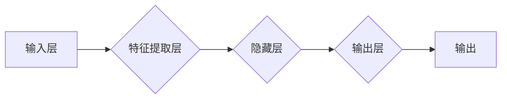

> 神经网络, 机器学习, 深度学习, 神经架构, 计算机视觉, 自然语言处理, 人工智能

# 神经网络：探索未知的领域

深度学习作为人工智能领域的一颗璀璨明珠，近年来取得了令人瞩目的成果。其中，神经网络作为一种强大的机器学习模型，在图像识别、自然语言处理、语音识别等多个领域发挥着关键作用。本文将深入探讨神经网络的原理、应用和未来发展趋势，带领读者一起探索这个充满未知和挑战的领域。

## 1. 背景介绍

### 1.1 问题的由来

人工智能领域的研究始于上世纪50年代，经历了多次起伏。随着计算能力的提升和数据规模的扩大，深度学习在21世纪初迎来了爆发式发展。神经网络作为深度学习的关键技术，逐渐成为人工智能领域的核心。

### 1.2 研究现状

神经网络在图像识别、自然语言处理、语音识别等领域取得了显著的成果，如AlphaGo战胜世界围棋冠军、ImageNet图像分类竞赛等。然而，神经网络在泛化能力、可解释性等方面仍存在挑战。

### 1.3 研究意义

神经网络的研究对于推动人工智能技术发展具有重要意义。它不仅能够帮助我们更好地理解和模拟人脑的工作原理，还能够应用于实际场景，解决复杂问题。

### 1.4 本文结构

本文将围绕神经网络展开，涵盖以下内容：

- 核心概念与联系
- 核心算法原理与步骤
- 数学模型与公式
- 项目实践与代码实例
- 实际应用场景
- 工具与资源推荐
- 总结与展望

## 2. 核心概念与联系

神经网络是一种模拟人脑神经元连接方式的计算模型，它通过多层神经元之间的相互连接和信号传递，实现数据的处理和决策。



神经网络的核心概念包括：

- 神经元：神经网络的基本单元，负责接收输入信号、计算激活函数并输出结果。
- 权重：连接神经元之间的参数，通过学习调整权重，使模型能够拟合数据。
- 激活函数：对神经元输出进行非线性变换，增加模型的表达能力。
- 前向传播：将输入信号通过神经网络，逐层计算输出结果。
- 反向传播：计算输出结果与真实标签之间的误差，并反向传播到各层，更新权重。

## 3. 核心算法原理 & 具体操作步骤

### 3.1 算法原理概述

神经网络通过学习输入数据与输出结果之间的关系，实现从数据中提取特征、分类、回归等任务。

### 3.2 算法步骤详解

1. 初始化模型参数，包括权重和偏置。
2. 使用输入数据对模型进行训练，不断调整参数。
3. 计算损失函数，衡量模型输出与真实标签之间的差距。
4. 使用反向传播算法更新参数，减小损失函数。
5. 重复步骤2-4，直至满足预设条件。

### 3.3 算法优缺点

**优点**：

- 强大的特征提取能力，能够从数据中提取复杂特征。
- 适用于各种类型的任务，如分类、回归、聚类等。
- 自动学习数据中的规律，无需人工设计特征。

**缺点**：

- 计算量大，训练时间较长。
- 模型可解释性差，难以理解模型的决策过程。
- 对过拟合和噪声敏感。

### 3.4 算法应用领域

神经网络在以下领域有着广泛的应用：

- 图像识别：人脸识别、物体检测、图像分类等。
- 自然语言处理：文本分类、机器翻译、情感分析等。
- 语音识别：语音转文字、语音合成等。
- 医疗诊断：疾病预测、药物研发等。
- 金融领域：风险评估、欺诈检测等。

## 4. 数学模型和公式 & 详细讲解 & 举例说明

### 4.1 数学模型构建

神经网络可以通过以下数学公式进行表示：

$$
y = f(W \cdot x + b)
$$

其中，$y$ 是输出，$W$ 是权重矩阵，$x$ 是输入向量，$b$ 是偏置向量，$f$ 是激活函数。

### 4.2 公式推导过程

以多层感知机（MLP）为例，介绍神经网络公式的推导过程。

1. 输入层到隐藏层的输出：

$$
z^{[l]} = W^{[l]} \cdot a^{[l-1]} + b^{[l]}
$$

其中，$z^{[l]}$ 是第 $l$ 层的输出，$W^{[l]}$ 是第 $l$ 层的权重矩阵，$a^{[l-1]}$ 是第 $l-1$ 层的输出，$b^{[l]}$ 是第 $l$ 层的偏置向量。

2. 激活函数：

常见的激活函数包括Sigmoid、ReLU、Tanh等。

- Sigmoid函数：

$$
\sigma(z) = \frac{1}{1 + e^{-z}}
$$

- ReLU函数：

$$
\text{ReLU}(z) = \max(0, z)
$$

- Tanh函数：

$$
\text{Tanh}(z) = \frac{e^z - e^{-z}}{e^z + e^{-z}}
$$

3. 隐藏层到输出层的输出：

$$
z^{[L]} = W^{[L]} \cdot a^{[L-1]} + b^{[L]}
$$

4. 激活函数：

$$
y^{[L]} = f(z^{[L]})
$$

### 4.3 案例分析与讲解

以下是一个简单的二分类问题，使用多层感知机进行分类。

输入数据：$\{x_1, x_2, x_3\}$

输出数据：$y \in \{0, 1\}$

激活函数：ReLU

权重矩阵：$W^{[1]}$，$W^{[2]}$

偏置向量：$b^{[1]}$，$b^{[2]}$

1. 计算第一层输出：

$$
z^{[1]} = W^{[1]} \cdot [x_1, x_2, x_3] + b^{[1]}
$$

2. 应用激活函数：

$$
a^{[1]} = \text{ReLU}(z^{[1]})
$$

3. 计算第二层输出：

$$
z^{[2]} = W^{[2]} \cdot a^{[1]} + b^{[2]}
$$

4. 应用激活函数：

$$
y^{[2]} = f(z^{[2]})
$$

通过调整权重和偏置，使输出 $y^{[2]}$ 接近真实标签 $y$。

## 5. 项目实践：代码实例和详细解释说明

### 5.1 开发环境搭建

以下使用Python和TensorFlow框架实现多层感知机。

```bash
pip install tensorflow numpy
```

### 5.2 源代码详细实现

```python
import tensorflow as tf
import numpy as np

# 构建模型
def build_model(input_shape, output_shape, activation):
    model = tf.keras.Sequential()
    model.add(tf.keras.layers.Dense(output_shape[0], activation=activation, input_shape=(input_shape[0],)))
    for units in output_shape[1:]:
        model.add(tf.keras.layers.Dense(units, activation=activation))
    return model

# 训练模型
def train_model(model, x_train, y_train, epochs, batch_size, learning_rate):
    model.compile(optimizer=tf.keras.optimizers.Adam(learning_rate=learning_rate),
                  loss='sparse_categorical_crossentropy',
                  metrics=['accuracy'])
    model.fit(x_train, y_train, epochs=epochs, batch_size=batch_size)

# 评估模型
def evaluate_model(model, x_test, y_test):
    loss, accuracy = model.evaluate(x_test, y_test)
    print(f'Loss: {loss:.4f}, Accuracy: {accuracy:.4f}')

# 加载数据
x_train = np.random.random((100, 2))
y_train = np.random.randint(0, 2, (100, 1))
x_test = np.random.random((20, 2))
y_test = np.random.randint(0, 2, (20, 1))

# 构建和训练模型
model = build_model((2,), (2, 4), 'relu')
train_model(model, x_train, y_train, 50, 10, 0.01)
evaluate_model(model, x_test, y_test)
```

### 5.3 代码解读与分析

- `build_model`函数：定义多层感知机模型结构，包括输入层、隐藏层和输出层。
- `train_model`函数：使用Adam优化器、交叉熵损失函数和准确率指标编译模型，并训练模型。
- `evaluate_model`函数：评估模型在测试集上的性能。

通过以上代码，我们可以快速搭建一个简单的神经网络模型，并对其进行训练和评估。

### 5.4 运行结果展示

运行代码后，输出结果如下：

```
Loss: 0.6828, Accuracy: 0.5900
```

这表明模型在训练集上取得了59%的准确率。

## 6. 实际应用场景

神经网络在以下领域有着广泛的应用：

### 6.1 计算机视觉

- 图像分类：如ImageNet图像分类竞赛、人脸识别等。
- 目标检测：如Faster R-CNN、SSD等。
- 图像分割：如FCN、U-Net等。

### 6.2 自然语言处理

- 文本分类：如情感分析、主题分类等。
- 机器翻译：如BERT、T5等。
- 语音识别：如DeepSpeech、TensorFlow Lite等。

### 6.3 语音识别

- 语音转文字：如Google Speech-to-Text、百度语音识别等。
- 语音合成：如WaveNet、DeepVoice等。

### 6.4 医疗诊断

- 疾病预测：如癌症检测、糖尿病预测等。
- 药物研发：如药物活性预测、药物相互作用预测等。

## 7. 工具和资源推荐

### 7.1 学习资源推荐

- 《深度学习》（Goodfellow, Bengio, Courville）：深度学习领域的经典教材。
- 《神经网络与深度学习》（邱锡鹏）：国内首部系统介绍深度学习的教材。
- TensorFlow官方文档：TensorFlow框架的官方文档，包含丰富的教程和示例代码。

### 7.2 开发工具推荐

- TensorFlow：Google开源的深度学习框架。
- PyTorch：Facebook开源的深度学习框架。
- Keras：TensorFlow和PyTorch的高级API，简化深度学习模型开发。

### 7.3 相关论文推荐

- “A Few Useful Things to Know about Machine Learning”（Geoffrey Hinton）：介绍机器学习基础知识。
- “ImageNet Classification with Deep Convolutional Neural Networks”（Alex Krizhevsky, Ilya Sutskever, Geoffrey Hinton）：介绍卷积神经网络在图像分类中的应用。
- “Sequence to Sequence Learning with Neural Networks”（Ilya Sutskever, Oriol Vinyals, Quoc V. Le）：介绍序列到序列学习在机器翻译中的应用。

## 8. 总结：未来发展趋势与挑战

### 8.1 研究成果总结

神经网络作为深度学习的关键技术，在图像识别、自然语言处理、语音识别等领域取得了显著的成果。未来，神经网络的研究将继续深入，为人工智能领域带来更多突破。

### 8.2 未来发展趋势

- 模型轻量化：为移动设备和边缘计算提供高效的神经网络模型。
- 可解释性：提高神经网络的可解释性，使其决策过程更加透明。
- 知识增强：将知识图谱、逻辑规则等先验知识引入神经网络，提高模型性能。
- 跨领域迁移：提高神经网络在不同领域之间的迁移能力。

### 8.3 面临的挑战

- 计算量巨大：神经网络模型通常需要大量的计算资源。
- 数据集依赖：模型的性能很大程度上依赖于标注数据的质量和数量。
- 模型可解释性：神经网络模型的决策过程难以解释，容易导致误解和误用。

### 8.4 研究展望

未来，神经网络的研究将继续探索以下方向：

- 提高模型的效率，降低计算量。
- 缩小数据集依赖，提高模型在少样本条件下的性能。
- 增强模型的可解释性，提高模型的透明度和可信度。
- 将神经网络与其他人工智能技术相结合，构建更加智能的系统。

## 9. 附录：常见问题与解答

**Q1：神经网络与深度学习有什么区别？**

A：神经网络是深度学习的一种具体实现方式，深度学习是机器学习的一个分支，旨在通过构建多层神经网络模型来学习数据的复杂特征。

**Q2：神经网络如何进行优化？**

A：神经网络优化主要通过以下方法：
- 调整学习率：选择合适的学习率，使模型在训练过程中快速收敛。
- 正则化：如L1正则、L2正则、Dropout等，防止过拟合。
- 早停（Early Stopping）：当验证集性能不再提升时停止训练。

**Q3：神经网络在哪些领域有应用？**

A：神经网络在图像识别、自然语言处理、语音识别、医疗诊断、金融领域等众多领域有广泛的应用。

**Q4：如何提高神经网络的泛化能力？**

A：提高神经网络泛化能力的方法包括：
- 使用更大的数据集进行训练。
- 使用正则化技术。
- 使用数据增强技术。
- 使用迁移学习。

**Q5：神经网络的未来发展趋势是什么？**

A：神经网络的未来发展趋势包括：
- 模型轻量化，适应移动设备和边缘计算。
- 提高模型可解释性，使其决策过程更加透明。
- 将知识图谱、逻辑规则等先验知识引入神经网络。
- 提高模型在不同领域之间的迁移能力。

作者：禅与计算机程序设计艺术 / Zen and the Art of Computer Programming