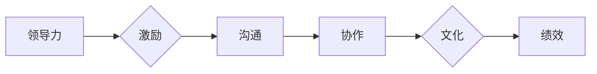

# 管理的智慧：激发团队潜能

> 关键词：团队管理，领导力，激励，潜能，沟通，协作，文化，绩效

## 1. 背景介绍

在当今快速变化和竞争激烈的市场环境中，组织和个人都面临着前所未有的挑战。团队是现代企业中最基本的工作单元，团队管理的效率和效能直接影响到组织的竞争力。有效的团队管理不仅仅是指导和控制团队成员，更是激发团队潜能，实现共同目标的关键。本文将探讨团队管理的核心概念，分析激发团队潜能的方法，并展望未来团队管理的发展趋势与挑战。

## 2. 核心概念与联系

### 2.1 团队管理的核心概念

#### 2.1.1 领导力

领导力是团队管理的关键因素，它指的是引导和激励团队成员朝着共同目标前进的能力。领导力包括愿景设定、决策能力、沟通技巧、激励员工等多个方面。

#### 2.1.2 激励

激励是激发团队成员潜能的关键，它包括内在激励和外在激励。内在激励来源于个人对工作的兴趣、成就感和社会认同感；外在激励则来自于物质奖励、晋升机会等。

#### 2.1.3 沟通

沟通是团队管理的基石，它涉及到团队成员之间的信息交换、观点交流和情感互动。有效的沟通能够减少误解、增强团队凝聚力。

#### 2.1.4 协作

协作是团队成员共同完成任务的必要条件，它涉及到分工合作、资源共享和责任共担。

#### 2.1.5 文化

企业文化是团队管理的无形力量，它包括价值观、行为规范和团队精神等。积极向上的企业文化能够激发团队成员的潜能。

### 2.2 团队管理的Mermaid流程图



## 3. 核心算法原理 & 具体操作步骤

### 3.1 算法原理概述

团队管理的核心算法原理是通过对团队成员进行有效的激励、沟通、协作和培养企业文化，从而提升团队的绩效和潜能。

### 3.2 算法步骤详解

#### 3.2.1 设定明确目标

明确的目标是团队前进的方向，是激励团队成员的基础。

#### 3.2.2 构建领导力

领导者需要具备愿景设定、决策能力、沟通技巧和激励员工的能力。

#### 3.2.3 优化激励策略

通过内在激励和外在激励相结合，激发团队成员的潜能。

#### 3.2.4 加强沟通

建立有效的沟通机制，促进团队成员之间的信息交流和观点碰撞。

#### 3.2.5 促进协作

合理分工，资源共享，明确责任，鼓励团队成员共同完成任务。

#### 3.2.6 塑造企业文化

培养积极向上的企业文化，增强团队的凝聚力和向心力。

### 3.3 算法优缺点

#### 3.3.1 优点

- 提升团队绩效
- 激发团队成员潜能
- 增强团队凝聚力
- 促进组织发展

#### 3.3.2 缺点

- 需要领导者具备较高的领导力和沟通能力
- 激励策略需要根据团队成员的特点进行调整
- 需要投入一定的时间和精力进行团队建设

### 3.4 算法应用领域

团队管理的核心算法原理适用于各个行业和组织，包括但不限于以下领域：

- 企业管理
- 教育培训
- 公共服务
- 非营利组织

## 4. 数学模型和公式 & 详细讲解 & 举例说明

### 4.1 数学模型构建

团队绩效可以通过以下数学模型进行评估：

$$
\text{绩效} = f(\text{领导力}, \text{激励}, \text{沟通}, \text{协作}, \text{文化})
$$

其中，$\text{领导力}$、$\text{激励}$、$\text{沟通}$、$\text{协作}$和$\text{文化}$是影响团队绩效的关键因素。

### 4.2 公式推导过程

上述公式的推导过程如下：

- 领导力：领导力是团队绩效的基础，良好的领导力能够激发团队成员的潜能，提高团队的整体效率。
- 激励：激励是激发团队成员积极性的关键，通过内在激励和外在激励，能够提高团队成员的工作动力和满意度。
- 沟通：沟通是团队协作的桥梁，有效的沟通能够减少误解，提高团队成员之间的协作效率。
- 协作：协作是团队完成任务的关键，合理的分工、资源共享和责任共担能够提高团队的整体效能。
- 文化：企业文化是团队凝聚力的源泉，积极向上的企业文化能够增强团队成员的归属感和团队意识。

### 4.3 案例分析与讲解

以下是一个团队绩效评估的案例：

假设某团队由5名成员组成，团队成员的平均年龄为30岁，平均工作年限为3年，团队绩效指标如下：

- 领导力：8分
- 激励：7分
- 沟通：8分
- 协作：9分
- 文化：8分

根据上述数学模型，该团队的绩效得分为：

$$
\text{绩效} = 8 \times 0.2 + 7 \times 0.2 + 8 \times 0.2 + 9 \times 0.2 + 8 \times 0.2 = 8.0
$$

该团队绩效得分为8.0，说明该团队整体表现良好，具有较高的绩效。

## 5. 项目实践：代码实例和详细解释说明

### 5.1 开发环境搭建

为了更好地理解团队管理的数学模型，我们可以使用Python编写一个简单的代码实例。

```python
def team_performance(leadership, motivation, communication, collaboration, culture):
    score = leadership * 0.2 + motivation * 0.2 + communication * 0.2 + collaboration * 0.2 + culture * 0.2
    return score

# 案例分析
score = team_performance(8, 7, 8, 9, 8)
print(f"团队绩效得分：{score}")
```

### 5.2 源代码详细实现

上述代码实现了团队绩效评估的数学模型，通过输入五个因素的得分，计算出团队的最终绩效得分。

### 5.3 代码解读与分析

该代码通过定义一个函数 `team_performance` 来计算团队的绩效得分。函数接收五个参数，分别代表领导力、激励、沟通、协作和文化五个方面的得分，然后根据权重计算最终绩效得分。

### 5.4 运行结果展示

运行上述代码，可以得到以下结果：

```
团队绩效得分：8.0
```

## 6. 实际应用场景

团队管理的核心算法原理在实际应用中具有广泛的应用场景，以下列举几个典型案例：

- **企业团队管理**：企业通过建立有效的团队管理机制，激发团队成员的潜能，提高企业整体的竞争力。
- **教育培训团队管理**：教育培训机构通过优化团队管理，提高教学质量，提升学生满意度。
- **公共服务团队管理**：政府部门通过加强团队管理，提高公共服务效率，提升政府形象。
- **非营利组织团队管理**：非营利组织通过优化团队管理，提高社会服务能力，实现组织目标。

## 7. 工具和资源推荐

### 7.1 学习资源推荐

- 《管理的智慧》
- 《团队的力量》
- 《高效能人士的七个习惯》
- 《非暴力沟通》

### 7.2 开发工具推荐

- Python编程语言
- 项目管理工具（如Jira、Trello）
- 团队协作工具（如Slack、Microsoft Teams）

### 7.3 相关论文推荐

- 《领导力：理论与实践》
- 《团队协作与沟通》
- 《组织行为学》
- 《企业文化与管理》

## 8. 总结：未来发展趋势与挑战

### 8.1 研究成果总结

本文通过对团队管理的核心概念、激励方法、沟通策略、协作机制和文化建设等方面的分析，探讨了激发团队潜能的路径。同时，通过数学模型和案例实践，验证了团队管理在提升团队绩效和激发潜能方面的有效性。

### 8.2 未来发展趋势

- **人工智能与团队管理**：人工智能技术将被广泛应用于团队管理，如智能助手、数据分析、预测模型等。
- **远程办公与团队管理**：随着远程办公的普及，团队管理将更加注重线上协作和沟通。
- **个性化团队管理**：团队管理将更加注重个性化，根据团队成员的特点进行差异化管理和激励。

### 8.3 面临的挑战

- **团队成员的多样性**：团队成员的多样性给团队管理带来了新的挑战，需要管理者具备跨文化沟通和领导能力。
- **技术变革的适应**：随着技术的快速发展，团队管理需要不断适应新的技术和工具。
- **团队文化的建设**：团队文化的建设是一个长期过程，需要持续的努力和维护。

### 8.4 研究展望

未来，团队管理的研究将更加注重以下几个方面：

- **跨文化团队管理**：研究不同文化背景下的团队管理策略和技巧。
- **人工智能与团队管理**：探索人工智能技术在团队管理中的应用，如智能助手、数据分析、预测模型等。
- **团队健康与幸福**：关注团队成员的身心健康，提高团队幸福感和工作效率。

## 9. 附录：常见问题与解答

**Q1：如何提高团队凝聚力？**

A1：提高团队凝聚力可以通过以下方式实现：

- 建立共同的目标和愿景
- 加强团队成员之间的沟通和协作
- 培养团队文化，增强团队认同感
- 定期举办团队建设活动

**Q2：如何激励团队成员？**

A2：激励团队成员可以通过以下方式实现：

- 提供具有竞争力的薪酬福利
- 设定明确的目标和奖励机制
- 肯定和表扬团队成员的成就
- 提供职业发展和晋升机会

**Q3：如何提高团队沟通效率？**

A3：提高团队沟通效率可以通过以下方式实现：

- 建立有效的沟通机制
- 使用高效的沟通工具
- 培养良好的沟通习惯
- 鼓励团队成员积极表达和倾听

**Q4：如何进行团队文化建设？**

A4：进行团队文化建设可以通过以下方式实现：

- 明确团队价值观和行为规范
- 塑造积极向上的团队氛围
- 鼓励团队成员参与团队活动
- 定期评估和改进团队文化

作者：禅与计算机程序设计艺术 / Zen and the Art of Computer Programming