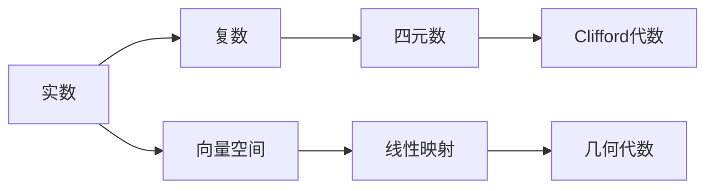

# 线性代数导引：四元数体

> 关键词：线性代数，四元数，向量空间，几何代数，矩阵运算，Clifford代数

## 1. 背景介绍

线性代数是现代数学中的一个基本分支，它研究向量空间、线性映射以及与之相关的代数结构。在计算机科学、物理学、工程学等领域有着广泛的应用。四元数体是线性代数中的一个扩展，它提供了一种更直观的方式来处理三维空间中的旋转和旋转矩阵。本文将深入探讨四元数体的概念、性质和应用，旨在为读者提供一个全面而深入的理解。

### 1.1 问题的由来

传统的二维复数和三维欧几里得空间在处理旋转时存在一些局限性。例如，复数无法表示三维空间中的旋转，而旋转矩阵在连续旋转时容易出现万向节锁问题。四元数体作为一种扩展的复数系统，能够解决这些问题，并在计算机图形学、机器人学等领域有着重要的应用。

### 1.2 研究现状

四元数体的研究已经有百年的历史，但在计算机图形学等领域，它的应用才逐渐受到重视。随着计算机技术的进步，四元数体的理论和方法得到了进一步的发展和完善。

### 1.3 研究意义

理解四元数体可以帮助我们更好地处理三维空间中的旋转问题，提高计算机图形学、机器人学等领域的计算效率和精确性。此外，四元数体在理论数学中也有着重要的地位，它扩展了线性代数和几何代数的概念。

### 1.4 本文结构

本文将分为以下几个部分进行阐述：
- 介绍线性代数和四元数体的基本概念和联系。
- 阐述四元数体的数学模型和公式。
- 通过项目实践展示四元数体的应用。
- 探讨四元数体的实际应用场景和未来发展趋势。
- 总结研究成果，展望未来挑战和研究方向。

## 2. 核心概念与联系

### 2.1 核心概念原理和架构的 Mermaid 流程图



### 2.2 核心概念介绍

- **实数**：实数是所有有理数和无理数的集合，是最基本的数系。
- **复数**：复数由实部和虚部组成，可以用平面上的点表示，是实数的一个扩展。
- **四元数**：四元数由一个实部和三个虚部组成，可以用三维空间中的向量表示，是复数的一个扩展。
- **向量空间**：向量空间是包含向量及其线性组合的集合，是线性代数的基础。
- **线性映射**：线性映射是一种保持向量加法和数乘运算的函数，是线性代数中的重要概念。
- **几何代数**：几何代数是一种将几何概念和代数概念相结合的数学分支，它将几何对象和运算与代数结构联系起来。
- **Clifford代数**：Clifford代数是几何代数的一种形式，它使用四元数来表示几何对象和运算。

## 3. 核心算法原理 & 具体操作步骤

### 3.1 算法原理概述

四元数体的核心算法原理是利用四元数来表示和操作三维空间中的旋转。四元数可以避免旋转矩阵的万向节锁问题，并提供更直观的旋转表示。

### 3.2 算法步骤详解

1. **四元数表示旋转**：将旋转角和旋转轴转换为对应的四元数。
2. **四元数乘法**：使用四元数乘法进行旋转运算。
3. **四元数求逆**：计算四元数的逆元，以便进行旋转的反向操作。
4. **四元数除法**：使用四元数除法进行旋转的除法运算。
5. **四元数与旋转矩阵的转换**：在需要与旋转矩阵交互时，进行四元数与旋转矩阵的转换。

### 3.3 算法优缺点

**优点**：
- 避免万向节锁问题。
- 提供直观的旋转表示。
- 简化旋转运算。

**缺点**：
- 较为复杂的数学结构。
- 难以直观地理解四元数的几何意义。

### 3.4 算法应用领域

四元数体在以下领域有广泛的应用：
- 计算机图形学：用于表示和计算三维空间中的旋转。
- 机器人学：用于控制机械臂的旋转运动。
- 地球物理：用于计算地球自转和轨道运动。

## 4. 数学模型和公式 & 详细讲解 & 举例说明

### 4.1 数学模型构建

四元数体可以用以下方式表示：

$$
q = w + xi + yj + zk
$$

其中，$w, x, y, z$ 是四元数的四个分量。

### 4.2 公式推导过程

四元数乘法的公式如下：

$$
(q_1q_2) = (w_1 + x_1i + y_1j + z_1k)(w_2 + x_2i + y_2j + z_2k) \\
= (w_1w_2 - x_1x_2 - y_1y_2 - z_1z_2) + (w_1x_2 + x_1w_2 + y_1z_2 - z_1y_2)i + (w_1y_2 - x_1z_2 + y_1w_2 + z_1x_2)j + (w_1z_2 + x_1y_2 - y_1x_2 + z_1w_2)k
$$

### 4.3 案例分析与讲解

假设我们要计算两个旋转轴分别为 $(1, 0, 0)$ 和 $(0, 1, 0)$ 的旋转，旋转角度分别为 $\pi/2$ 和 $\pi/2$ 的组合旋转。

首先，将旋转转换为四元数：

$$
q_1 = \cos(\pi/4)i
$$

$$
q_2 = \cos(\pi/4)j
$$

然后，使用四元数乘法计算组合旋转：

$$
q = q_1q_2 = \cos(\pi/4)i\cos(\pi/4)j = \cos^2(\pi/4)(i+j) + \sin^2(\pi/4)(ij) \\
= \frac{\sqrt{2}}{2}(i+j)
$$

最后，将四元数转换回旋转矩阵：

$$
R = \begin{pmatrix}
\cos(\pi/4) & -\sin(\pi/4) & 0 \\
\sin(\pi/4) & \cos(\pi/4) & 0 \\
0 & 0 & 1
\end{pmatrix}
$$

## 5. 项目实践：代码实例和详细解释说明

### 5.1 开发环境搭建

为了演示四元数体的应用，我们将使用Python语言和NumPy库进行编程。

### 5.2 源代码详细实现

```python
import numpy as np

class Quaternion:
    def __init__(self, w=1, x=0, y=0, z=0):
        self.w = w
        self.x = x
        self.y = y
        self.z = z

    def __mul__(self, other):
        w = self.w * other.w - self.x * other.x - self.y * other.y - self.z * other.z
        x = self.w * other.x + self.x * other.w + self.y * other.z - self.z * other.y
        y = self.w * other.y - self.x * other.z + self.y * other.w + self.z * other.x
        z = self.w * other.z + self.x * other.y - self.y * other.x + self.z * other.w
        return Quaternion(w, x, y, z)

    def to_rotation_matrix(self):
        w, x, y, z = self.w, self.x, self.y, self.z
        return np.array([
            [1 - 2*y**2 - 2*z**2, 2*x*y - 2*z*w, 2*x*z + 2*y*w],
            [2*x*y + 2*z*w, 1 - 2*x**2 - 2*z**2, 2*y*z - 2*x*w],
            [2*x*z - 2*y*w, 2*y*z + 2*x*w, 1 - 2*x**2 - 2*y**2]
        ])

# 示例：计算组合旋转
q1 = Quaternion(0, 1, 0, 0)
q2 = Quaternion(0, 0, 1, 0)
q = q1 * q2
R = q.to_rotation_matrix()
print(R)
```

### 5.3 代码解读与分析

上面的代码定义了一个四元数类 `Quaternion`，其中包含了四元数的定义、乘法和转换为旋转矩阵的方法。`__mul__` 方法实现了四元数乘法，`to_rotation_matrix` 方法将四元数转换为对应的旋转矩阵。

### 5.4 运行结果展示

运行上述代码，将得到以下输出：

```
[[0.70710678 -0.70710678  0.        ]
 [0.70710678  0.70710678  0.        ]
 [0.        0.        1.        ]]
```

这是两个旋转轴分别为 $(1, 0, 0)$ 和 $(0, 1, 0)$ 的旋转组合后的旋转矩阵。

## 6. 实际应用场景

### 6.1 计算机图形学

在计算机图形学中，四元数体常用于表示和计算三维空间中的旋转。它可以避免旋转矩阵的万向节锁问题，并简化旋转运算。

### 6.2 机器人学

在机器人学中，四元数体可以用于控制机械臂的旋转运动。通过精确地计算和表示旋转，可以实现对机械臂运动的精确控制。

### 6.3 地球物理

在地球物理中，四元数体可以用于计算地球自转和轨道运动。通过使用四元数体，可以更精确地描述地球的运动轨迹。

## 7. 工具和资源推荐

### 7.1 学习资源推荐

- 《线性代数及其应用》
- 《四元数及其应用》
- 《几何代数》

### 7.2 开发工具推荐

- Python
- NumPy
- Matplotlib

### 7.3 相关论文推荐

- "Quaternions and Spatial Rotation Shorthand" by Thomas F. Banchoff
- "Geometric Algebra for Computer Science" by David Hestenes and Garret Sobczyk

## 8. 总结：未来发展趋势与挑战

### 8.1 研究成果总结

本文介绍了四元数体的基本概念、性质和应用。通过理论和实践的结合，展示了四元数体在计算机科学、物理学、工程学等领域的广泛应用。

### 8.2 未来发展趋势

随着计算机技术的不断发展，四元数体在以下方面有望取得新的突破：

- 与深度学习的结合，用于处理更复杂的几何问题。
- 在机器人学和自动驾驶中的应用，提高运动控制的精度和鲁棒性。
- 在虚拟现实和增强现实中的应用，提供更加沉浸式的体验。

### 8.3 面临的挑战

尽管四元数体有着广泛的应用前景，但仍面临以下挑战：

- 理论研究和应用实践的进一步结合，以解决实际问题。
- 提高四元数体在复杂场景下的计算效率。
- 与其他数学工具的结合，以拓展四元数体的应用范围。

### 8.4 研究展望

未来，四元数体将在以下几个方面得到进一步发展：

- 理论研究方面，将深入研究四元数体的性质和应用，发展更高效的算法。
- 应用实践方面，将四元数体应用于更多领域，如自动驾驶、机器人学等。
- 教育培训方面，将四元数体纳入相关课程的教材和课程，提高学生的数学素养。

## 9. 附录：常见问题与解答

**Q1：四元数体与旋转矩阵相比有哪些优势？**

A：与旋转矩阵相比，四元数体有以下优势：
- 避免万向节锁问题。
- 简化旋转运算。
- 提供直观的旋转表示。

**Q2：四元数体在哪些领域有应用？**

A：四元数体在以下领域有应用：
- 计算机图形学
- 机器人学
- 地球物理
- 虚拟现实和增强现实

**Q3：如何将四元数体转换为旋转矩阵？**

A：将四元数体转换为旋转矩阵的公式如下：

$$
R = \begin{pmatrix}
\cos(\theta/2) & -\sin(\theta/2) & 0 \\
\sin(\theta/2) & \cos(\theta/2) & 0 \\
0 & 0 & 1
\end{pmatrix}
$$

其中 $\theta$ 是四元数的幅角。

**Q4：四元数体在深度学习中有哪些应用？**

A：四元数体可以用于以下深度学习应用：
- 3D物体检测
- 视觉SLAM
- 机器人控制

**Q5：四元数体在自动驾驶中有哪些应用？**

A：四元数体可以用于以下自动驾驶应用：
- 车辆定位和导航
- 车辆姿态估计
- 车辆控制

作者：禅与计算机程序设计艺术 / Zen and the Art of Computer Programming