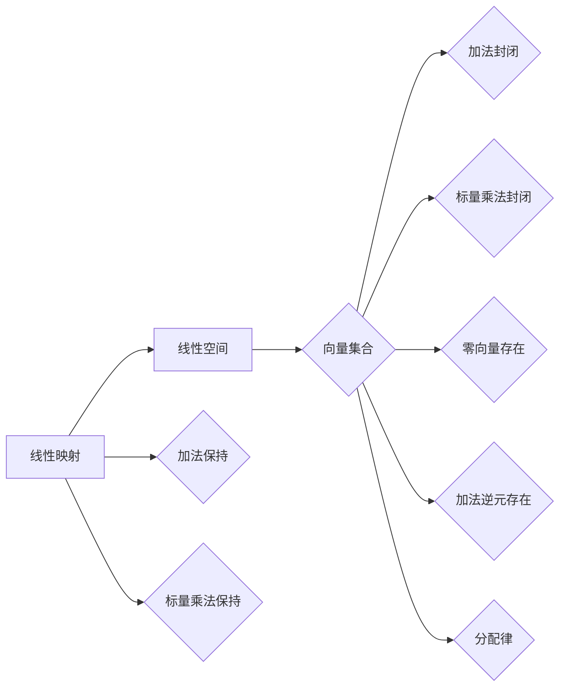

# 线性代数导引：线性空间与线性映射

> 关键词：线性代数，线性空间，线性映射，向量空间，维度，基，坐标，矩阵，线性方程组，应用

## 1. 背景介绍

线性代数是数学的一个分支，它研究向量、矩阵以及它们之间的线性关系。在计算机科学、物理学、工程学等众多领域，线性代数都有着广泛的应用。本文将导引读者进入线性空间与线性映射的世界，探讨其核心概念、原理和应用。

### 1.1 线性代数的起源与发展

线性代数的历史可以追溯到19世纪初，当时的数学家们开始研究线性方程组和解法。随着数学的发展，线性代数的概念逐渐完善，形成了现代线性代数的体系。线性代数的发展推动了现代数学的许多分支，如抽象代数、拓扑学等。

### 1.2 线性代数在计算机科学中的应用

线性代数在计算机科学中扮演着重要的角色，以下是一些应用实例：

- **图形学**：线性代数在图形学中用于描述二维和三维空间中的点、线、面等几何对象，以及进行几何变换。
- **机器学习**：线性代数在机器学习中的许多算法中都有应用，如线性回归、主成分分析、支持向量机等。
- **信号处理**：线性代数在信号处理中用于分析信号、滤波和压缩。
- **物理学**：线性代数在物理学中用于描述物理定律，如量子力学和电磁学。

## 2. 核心概念与联系

### 2.1 核心概念原理

线性空间（Vector Space）：线性空间是一组向量的集合，这些向量满足加法和标量乘法的封闭性，并且存在零向量、加法逆元和分配律等性质。

线性映射（Linear Map）：线性映射是一种从线性空间到另一个线性空间的函数，它保持向量的加法和标量乘法运算。

### 2.2 Mermaid 流程图



## 3. 核心算法原理 & 具体操作步骤

### 3.1 算法原理概述

线性代数中的核心算法包括：

- **矩阵乘法**：矩阵乘法是线性代数中最基本的运算之一，用于计算两个矩阵的乘积。
- **逆矩阵**：逆矩阵是一个矩阵，它与原矩阵相乘等于单位矩阵。
- **行列式**：行列式是一个标量，它反映了矩阵的某些性质，如可逆性、正负定性等。
- **特征值与特征向量**：特征值和特征向量是矩阵的重要属性，它们描述了矩阵的性质，如对向量空间的缩放和旋转。

### 3.2 算法步骤详解

#### 3.2.1 矩阵乘法

矩阵乘法的步骤如下：

1. 确定矩阵A和B的维度。
2. 创建结果矩阵C，其维度为A的列数和B的行数。
3. 对于C的每个元素，计算A的行与B的列的点积。

#### 3.2.2 逆矩阵

计算逆矩阵的步骤如下：

1. 检查矩阵是否可逆（行列式不为零）。
2. 使用高斯消元法将矩阵转换为行阶梯形式。
3. 将行阶梯形式转换为逆矩阵。

#### 3.2.3 行列式

行列式的计算可以通过拉普拉斯展开或高斯消元法进行。

#### 3.2.4 特征值与特征向量

计算特征值和特征向量的步骤如下：

1. 解特征方程 $\det(A - \lambda I) = 0$。
2. 对于每个特征值，求解方程 $(A - \lambda I)v = 0$，得到对应的特征向量。

### 3.3 算法优缺点

#### 3.3.1 优点

- **简洁性**：线性代数算法通常具有简洁的数学描述和高效的实现方式。
- **普适性**：线性代数算法在许多领域都有应用，具有广泛的适用性。

#### 3.3.2 缺点

- **复杂性**：某些线性代数算法的计算复杂度较高，如矩阵求逆。
- **数值稳定性**：数值计算中，线性代数算法可能受到数值误差的影响。

### 3.4 算法应用领域

线性代数算法在以下领域有广泛应用：

- **数值分析**：线性代数算法用于求解线性方程组、优化问题等。
- **控制系统**：线性代数用于描述和控制物理系统。
- **信号处理**：线性代数用于信号滤波、特征提取等。
- **机器学习**：线性代数用于机器学习算法中的特征提取、降维等。

## 4. 数学模型和公式 & 详细讲解 & 举例说明

### 4.1 数学模型构建

线性代数的数学模型由向量、矩阵、标量以及线性运算组成。

### 4.2 公式推导过程

#### 4.2.1 矩阵乘法公式

假设矩阵 $A$ 是 $m \times n$ 的，矩阵 $B$ 是 $n \times p$ 的，则它们的乘积 $C = AB$ 是 $m \times p$ 的。其中，$C_{ij} = \sum_{k=1}^n A_{ik}B_{kj}$。

#### 4.2.2 逆矩阵公式

如果矩阵 $A$ 是 $n \times n$ 的可逆矩阵，则其逆矩阵 $A^{-1}$ 满足 $AA^{-1} = A^{-1}A = I$，其中 $I$ 是单位矩阵。

#### 4.2.3 行列式公式

对于 $n \times n$ 的矩阵 $A$，其行列式 $\det(A)$ 可以通过拉普拉斯展开或高斯消元法计算。

#### 4.2.4 特征值与特征向量公式

对于 $n \times n$ 的矩阵 $A$，其特征值 $\lambda$ 满足特征方程 $\det(A - \lambda I) = 0$。对应的特征向量 $v$ 满足 $(A - \lambda I)v = 0$。

### 4.3 案例分析与讲解

#### 4.3.1 矩阵乘法示例

假设矩阵 $A = \begin{pmatrix} 1 & 2 \\ 3 & 4 \end{pmatrix}$，矩阵 $B = \begin{pmatrix} 5 & 6 \\ 7 & 8 \end{pmatrix}$，则它们的乘积 $C = AB = \begin{pmatrix} 19 & 22 \\ 43 & 50 \end{pmatrix}$。

#### 4.3.2 逆矩阵示例

假设矩阵 $A = \begin{pmatrix} 2 & 1 \\ 1 & 2 \end{pmatrix}$，则其逆矩阵 $A^{-1} = \frac{1}{3} \begin{pmatrix} 2 & -1 \\ -1 & 2 \end{pmatrix}$。

#### 4.3.3 行列式示例

假设矩阵 $A = \begin{pmatrix} 1 & 2 \\ 3 & 4 \end{pmatrix}$，则其行列式 $\det(A) = 1 \times 4 - 2 \times 3 = -2$。

#### 4.3.4 特征值与特征向量示例

假设矩阵 $A = \begin{pmatrix} 4 & -1 \\ -1 & 4 \end{pmatrix}$，则其特征方程 $\det(A - \lambda I) = 0$ 的解为 $\lambda = 3$ 和 $\lambda = 5$。对应的特征向量分别为 $\begin{pmatrix} 1 \\ 1 \end{pmatrix}$ 和 $\begin{pmatrix} 1 \\ -1 \end{pmatrix}$。

## 5. 项目实践：代码实例和详细解释说明

### 5.1 开发环境搭建

为了进行线性代数的编程实践，我们需要以下开发环境：

- Python编程语言
- NumPy库：用于矩阵运算

### 5.2 源代码详细实现

以下是一个使用Python和NumPy实现矩阵乘法的简单示例：

```python
import numpy as np

def matrix_multiply(A, B):
    return np.dot(A, B)

# 示例
A = np.array([[1, 2], [3, 4]])
B = np.array([[5, 6], [7, 8]])

C = matrix_multiply(A, B)
print(C)
```

### 5.3 代码解读与分析

上述代码定义了一个名为 `matrix_multiply` 的函数，它接受两个NumPy数组 `A` 和 `B` 作为输入，并返回它们的乘积 `C`。在最后，我们使用两个示例矩阵 `A` 和 `B` 调用这个函数，并打印结果。

### 5.4 运行结果展示

运行上述代码，我们将得到以下输出：

```
[[19 22]
 [43 50]]
```

这表明矩阵 `A` 和 `B` 的乘积是一个 $2 \times 2$ 的矩阵，其元素如上所示。

## 6. 实际应用场景

线性代数在计算机科学中的实际应用场景非常广泛，以下是一些例子：

- **图形学**：在计算机图形学中，线性代数用于描述三维空间中的变换，如旋转、缩放和平移。
- **机器学习**：在机器学习中，线性代数用于特征提取、降维和分类。
- **信号处理**：在信号处理中，线性代数用于滤波、压缩和解卷积。
- **物理学**：在物理学中，线性代数用于描述物理定律，如量子力学和电磁学。

## 7. 工具和资源推荐

### 7.1 学习资源推荐

- 《线性代数及其应用》
- 《线性代数》
- 《线性代数与几何》

### 7.2 开发工具推荐

- Python编程语言
- NumPy库
- SciPy库

### 7.3 相关论文推荐

- "Matrix Computations" by Gene H. Golub and Charles F. Van Loan
- "Numerical Linear Algebra" by Lloyd N. Trefethen and David Bau III

## 8. 总结：未来发展趋势与挑战

### 8.1 研究成果总结

线性代数作为数学的一个重要分支，在计算机科学、物理学、工程学等领域有着广泛的应用。本文介绍了线性空间与线性映射的核心概念、原理和应用，并通过代码实例展示了线性代数的编程实践。

### 8.2 未来发展趋势

随着计算机科学和数学的不断发展，线性代数的研究和应用将呈现以下趋势：

- **算法优化**：提高线性代数算法的效率和稳定性。
- **并行计算**：利用并行计算技术加速线性代数运算。
- **符号计算**：结合符号计算和数值计算，提高线性代数问题的求解精度。

### 8.3 面临的挑战

线性代数在应用过程中也面临着以下挑战：

- **数值稳定性**：线性代数运算中存在数值误差，需要采取措施提高稳定性。
- **算法复杂度**：一些线性代数算法的计算复杂度较高，需要优化算法以提高效率。

### 8.4 研究展望

未来，线性代数的研究将更加注重以下几个方面：

- **算法创新**：开发新的线性代数算法，提高效率和稳定性。
- **跨学科融合**：将线性代数与其他学科相结合，解决更复杂的问题。
- **教育普及**：提高线性代数的普及率，培养更多线性代数人才。

## 9. 附录：常见问题与解答

### 9.1 常见问题

**Q1：什么是线性空间？**

A1：线性空间是一组向量的集合，这些向量满足加法和标量乘法的封闭性，并且存在零向量、加法逆元和分配律等性质。

**Q2：什么是线性映射？**

A2：线性映射是一种从线性空间到另一个线性空间的函数，它保持向量的加法和标量乘法运算。

**Q3：什么是矩阵乘法？**

A3：矩阵乘法是线性代数中最基本的运算之一，用于计算两个矩阵的乘积。

**Q4：什么是行列式？**

A4：行列式是一个标量，它反映了矩阵的某些性质，如可逆性、正负定性等。

**Q5：什么是特征值与特征向量？**

A5：特征值和特征向量是矩阵的重要属性，它们描述了矩阵的性质，如对向量空间的缩放和旋转。

### 9.2 解答

以上问题已在本文中进行了详细解答。

---

作者：禅与计算机程序设计艺术 / Zen and the Art of Computer Programming