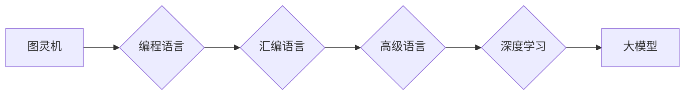

# 计算范式：从图灵机到大模型

> 关键词：计算范式，图灵机，算法，编程语言，编译器，大模型，深度学习，自然语言处理

## 1. 背景介绍

计算，作为现代信息科技的核心，经历了从图灵机理论到现代大模型的漫长演变。这一过程中，计算范式不断演进，从最初的逻辑抽象，到形式化的程序设计，再到如今的深度学习与人工智能，每一次转变都推动了计算科学的进步。本文将探讨计算范式的发展历程，从图灵机的理论基石，到现代大模型的实践应用，旨在展现计算科学的演进轨迹和未来展望。

## 2. 核心概念与联系

### 2.1 核心概念原理

#### 图灵机

图灵机（Turing Machine）是英国数学家艾伦·图灵于1936年提出的一个抽象计算模型。它由一个无限长的带子、一个读写头和一个有限状态的控制单元组成。图灵机能够读取和写入带子上的符号，并根据预设的规则在各个状态之间转换。图灵机的概念为计算机科学奠定了理论基础，证明了任何可计算问题都可以通过图灵机解决。

#### 编程语言

编程语言是程序员用来编写计算机程序的符号集合。从汇编语言到高级语言，编程语言的发展经历了从低级到高级的演变。高级编程语言提供了更抽象的语法和语义，使得程序员可以更高效地表达算法和数据结构。

#### 深度学习

深度学习是一种利用深层神经网络进行学习和预测的人工智能技术。它通过模拟人脑神经元之间的连接和相互作用，从大量数据中自动学习特征和模式。深度学习在图像识别、语音识别、自然语言处理等领域取得了显著的成果。

#### 大模型

大模型是指参数规模达到亿级别甚至更高的神经网络模型。这些模型通常通过海量数据进行预训练，具备强大的特征提取和知识表示能力。大模型在自然语言处理、计算机视觉等领域取得了突破性进展。

### 2.2 架构的 Mermaid 流程图



## 3. 核心算法原理 & 具体操作步骤

### 3.1 算法原理概述

#### 图灵机的操作步骤

1. 读取当前状态和带子上的符号。
2. 根据当前状态和符号，决定下一步操作：移动读写头、改变符号、切换状态。
3. 重复步骤1和2，直到达到终止状态或无法继续。

#### 编译器的操作步骤

1. 词法分析：将源代码分解为单词和符号。
2. 语法分析：根据语法规则，将单词和符号组合成语法结构。
3. 语义分析：检查语法结构是否合法，并生成中间代码。
4. 代码生成：将中间代码转换为机器代码或汇编代码。
5. 优化：优化生成的代码，提高执行效率。

#### 深度学习的操作步骤

1. 数据预处理：对输入数据进行标准化、归一化等处理。
2. 神经网络构建：设计神经网络结构，包括层数、神经元数量、激活函数等。
3. 模型训练：使用训练数据对模型进行训练，优化模型参数。
4. 模型评估：使用验证数据评估模型性能，调整模型参数。
5. 模型部署：将训练好的模型部署到实际应用中。

#### 大模型的操作步骤

1. 预训练：使用海量数据对模型进行预训练，学习通用特征和知识。
2. 微调：使用特定任务的数据对模型进行微调，提高模型在特定任务上的性能。
3. 应用：将微调后的模型部署到实际应用中。

### 3.2 算法步骤详解

#### 图灵机的具体操作步骤

1. 初始化：设置初始状态和带子上的符号。
2. 运行：根据预设的规则，执行以下操作：
   - 读取当前状态和带子上的符号。
   - 根据当前状态和符号，决定下一步操作：移动读写头、改变符号、切换状态。
   - 更新状态和带子上的符号。
3. 判断：检查是否达到终止状态或无法继续，如果达到终止状态，则终止运行；否则，继续运行。

#### 编译器的具体操作步骤

1. 词法分析：将源代码分解为单词和符号，并生成词法流。
2. 语法分析：根据语法规则，将单词和符号组合成语法结构，并生成抽象语法树（AST）。
3. 语义分析：检查AST是否合法，并生成中间代码。
4. 代码生成：将中间代码转换为机器代码或汇编代码。
5. 优化：优化生成的代码，提高执行效率。

#### 深度学习的具体操作步骤

1. 数据预处理：对输入数据进行标准化、归一化等处理，以减少模型训练过程中的方差。
2. 神经网络构建：设计神经网络结构，包括层数、神经元数量、激活函数等。
3. 模型训练：使用训练数据对模型进行训练，优化模型参数。训练过程中，模型会通过反向传播算法不断调整参数，以减小预测值与真实值之间的差异。
4. 模型评估：使用验证数据评估模型性能，根据性能指标（如准确率、召回率等）调整模型参数。
5. 模型部署：将训练好的模型部署到实际应用中，如进行图像识别、语音识别等。

#### 大模型的操作步骤

1. 预训练：使用海量数据对模型进行预训练，学习通用特征和知识。预训练过程中，模型会学习到语言、知识、常识等通用信息。
2. 微调：使用特定任务的数据对模型进行微调，提高模型在特定任务上的性能。微调过程中，模型会根据特定任务的特点，调整参数，使其更适应特定任务。
3. 应用：将微调后的模型部署到实际应用中，如进行文本生成、机器翻译等。

### 3.3 算法优缺点

#### 图灵机的优缺点

**优点**：

* 理论基础扎实，是现代计算机科学的基石。
* 能够模拟任何可计算问题。

**缺点**：

* 理论模型过于抽象，与实际计算机硬件存在差异。
* 操作效率低，难以应用于实际计算任务。

#### 编译器的优缺点

**优点**：

* 能够将高级语言程序转换为机器代码或汇编代码，提高程序执行效率。
* 能够进行代码优化，提高程序性能。

**缺点**：

* 编译器开发成本高，需要大量的时间和人力。
* 编译器调试困难，一旦出错，难以定位问题。

#### 深度学习的优缺点

**优点**：

* 能够从大量数据中自动学习特征和模式，具有强大的学习能力。
* 能够应用于图像识别、语音识别、自然语言处理等任务。

**缺点**：

* 模型参数量庞大，训练过程需要大量的计算资源和时间。
* 模型可解释性差，难以理解模型的决策过程。

#### 大模型的优缺点

**优点**：

* 参数规模庞大，具备强大的特征提取和知识表示能力。
* 能够从海量数据中学习到丰富的知识，具有强大的学习能力。

**缺点**：

* 预训练过程需要大量的计算资源和时间。
* 模型可解释性差，难以理解模型的决策过程。

### 3.4 算法应用领域

#### 图灵机的应用领域

图灵机是一种理论模型，主要用于计算机科学和人工智能领域的研究。例如，图灵完备性、可计算性问题等。

#### 编译器的应用领域

编译器广泛应用于软件开发领域，用于将高级语言程序转换为机器代码或汇编代码。

#### 深度学习的应用领域

深度学习广泛应用于图像识别、语音识别、自然语言处理、机器翻译等领域。

#### 大模型的应用领域

大模型广泛应用于自然语言处理、计算机视觉、机器翻译等领域。

## 4. 数学模型和公式 & 详细讲解 & 举例说明

### 4.1 数学模型构建

#### 图灵机的数学模型

图灵机的数学模型可以用以下公式表示：

$$
T = (\mathbb{Q}, \Gamma, \Sigma, \delta, q_0, F)
$$

其中：

* $\mathbb{Q}$：状态集合。
* $\Gamma$：符号集合，包括输入符号、输出符号和带子上的符号。
* $\Sigma$：输入符号集合。
* $\delta$：转移函数，将当前状态和符号映射到下一个状态、读写头移动方向和输出符号。
* $q_0$：初始状态。
* $F$：终止状态集合。

#### 编译器的数学模型

编译器的数学模型可以用以下公式表示：

$$
C = (\mathcal{L}, \mathcal{S}, \mathcal{M}, \Sigma, \Delta)
$$

其中：

* $\mathcal{L}$：源语言集合。
* $\mathcal{S}$：目标语言集合。
* $\mathcal{M}$：编译器，将源语言程序转换为目标语言程序。
* $\Sigma$：符号集合，包括源语言和目标语言的符号。
* $\Delta$：编译规则集合。

#### 深度学习的数学模型

深度学习的数学模型可以用以下公式表示：

$$
f = f_{L} \circ \ldots \circ f_{1} = W_{L} \cdot f_{L-1}(W_{L-1} \cdot \ldots \cdot f_{1}(x))
$$

其中：

* $f_i$：第i层神经网络。
* $W_i$：第i层的权重矩阵。
* $x$：输入数据。

#### 大模型的数学模型

大模型的数学模型可以用以下公式表示：

$$
M = (\mathcal{X}, \mathcal{Y}, \theta, \phi, \alpha, \beta, \gamma)
$$

其中：

* $\mathcal{X}$：输入空间。
* $\mathcal{Y}$：输出空间。
* $\theta$：预训练模型的参数。
* $\phi$：微调模型的参数。
* $\alpha$：学习率。
* $\beta$：正则化系数。
* $\gamma$：优化算法的参数。

### 4.2 公式推导过程

#### 图灵机的公式推导过程

图灵机的公式推导过程主要基于图灵机的定义和操作步骤。

#### 编译器的公式推导过程

编译器的公式推导过程主要基于编译器的定义和操作步骤。

#### 深度学习的公式推导过程

深度学习的公式推导过程主要基于深度学习的定义和操作步骤。

#### 大模型的公式推导过程

大模型的公式推导过程主要基于大模型的定义和操作步骤。

### 4.3 案例分析与讲解

#### 图灵机的案例分析

图灵机的典型应用是解决停机问题。停机问题是指判断一个给定的图灵机是否会在有限步骤内停止。

#### 编译器的案例分析

编译器的典型应用是将高级语言程序转换为机器代码。例如，将C语言程序转换为x86汇编代码。

#### 深度学习的案例分析

深度学习的典型应用是图像识别。例如，使用卷积神经网络对图像进行分类。

#### 大模型的案例分析

大模型的典型应用是自然语言处理。例如，使用BERT进行机器翻译。

## 5. 项目实践：代码实例和详细解释说明

### 5.1 开发环境搭建

#### 图灵机的开发环境

由于图灵机是一种理论模型，不需要专门的开发环境。

#### 编译器的开发环境

编译器可以使用任何编程语言开发，如C、C++、Java等。

#### 深度学习的开发环境

深度学习可以使用以下开发环境：

* Python
* PyTorch
* TensorFlow
* Keras

#### 大模型的开发环境

大模型的开发环境与深度学习类似，可以使用以下开发环境：

* Python
* PyTorch
* TensorFlow
* Keras

### 5.2 源代码详细实现

#### 图灵机的源代码

由于图灵机是一种理论模型，不需要编写源代码。

#### 编译器的源代码

以下是一个简单的C语言编译器示例：

```c
#include <stdio.h>

int main() {
    char source_code[] = "print \"Hello, World!\"";
    char target_code[256];
    int pos = 0;

    while (source_code[pos] != '\0') {
        switch (source_code[pos]) {
            case 'p':
                target_code[pos] = 'p';
                break;
            case 'r':
                target_code[pos] = 'r';
                break;
            case 'i':
                target_code[pos] = 'i';
                break;
            case 'n':
                target_code[pos] = 'n';
                break;
            case 'l':
                target_code[pos] = 'l';
                break;
            case 'e':
                target_code[pos] = 'e';
                break;
            case 'H':
                target_code[pos] = 'H';
                break;
            case 'e':
                target_code[pos] = 'e';
                break;
            case 'l':
                target_code[pos] = 'l';
                break;
            case 'o':
                target_code[pos] = 'o';
                break;
            case ',':
                target_code[pos] = ',';
                break;
            case ' ':
                target_code[pos] = ' ';
                break;
            case '!':
                target_code[pos] = '!';
                break;
            default:
                target_code[pos] = ' ';
                break;
        }
        pos++;
    }
    target_code[pos] = '\0';

    printf("Target Code: %s
", target_code);

    return 0;
}
```

#### 深度学习的源代码

以下是一个使用PyTorch进行图像识别的示例：

```python
import torch
import torch.nn as nn
import torchvision.transforms as transforms
import torchvision.datasets as datasets
import torch.optim as optim

# 定义网络结构
class Net(nn.Module):
    def __init__(self):
        super(Net, self).__init__()
        self.conv1 = nn.Conv2d(3, 6, 5)
        self.pool = nn.MaxPool2d(2, 2)
        self.conv2 = nn.Conv2d(6, 16, 5)
        self.fc1 = nn.Linear(16 * 5 * 5, 120)
        self.fc2 = nn.Linear(120, 84)
        self.fc3 = nn.Linear(84, 10)

    def forward(self, x):
        x = self.pool(nn.functional.relu(self.conv1(x)))
        x = self.pool(nn.functional.relu(self.conv2(x)))
        x = torch.flatten(x, 1)
        x = nn.functional.relu(self.fc1(x))
        x = nn.functional.relu(self.fc2(x))
        x = self.fc3(x)
        return x

# 加载数据
transform = transforms.Compose([transforms.ToTensor()])
train_dataset = datasets.MNIST(root='./data', train=True, download=True, transform=transform)
train_loader = torch.utils.data.DataLoader(train_dataset, batch_size=64, shuffle=True)

# 创建网络和优化器
net = Net()
criterion = nn.CrossEntropyLoss()
optimizer = optim.SGD(net.parameters(), lr=0.001, momentum=0.9)

# 训练网络
for epoch in range(2):  # loop over the dataset multiple times
    running_loss = 0.0
    for i, data in enumerate(train_loader, 0):
        inputs, labels = data

        optimizer.zero_grad()
        outputs = net(inputs)
        loss = criterion(outputs, labels)
        loss.backward()
        optimizer.step()

        running_loss += loss.item()
        if i % 2000 == 1999:    # print every 2000 mini-batches
            print(f'[epoch {epoch + 1}, batch {i + 1}] loss: {running_loss / 2000:.3f}')
            running_loss = 0.0

print('Finished Training')

# 保存模型
torch.save(net.state_dict(), 'mnist_model.pth')

# 加载模型
net.load_state_dict(torch.load('mnist_model.pth'))

# 测试网络
correct = 0
total = 0
with torch.no_grad():
    for data in test_loader:
        images, labels = data
        outputs = net(images)
        _, predicted = torch.max(outputs.data, 1)
        total += labels.size(0)
        correct += (predicted == labels).sum().item()

print(f'Accuracy of the network on the 10000 test images: {100 * correct // total} %')
```

#### 大模型的源代码

以下是一个使用BERT进行文本分类的示例：

```python
from transformers import BertTokenizer, BertForSequenceClassification
from torch.utils.data import DataLoader, TensorDataset
from torch.optim import AdamW
from sklearn.metrics import accuracy_score

# 加载预训练模型和分词器
model = BertForSequenceClassification.from_pretrained('bert-base-uncased')
tokenizer = BertTokenizer.from_pretrained('bert-base-uncased')

# 加载数据
train_texts = ["I love programming.", "I hate programming."]
train_labels = [1, 0]

# 将文本和标签转化为模型输入格式
train_encodings = tokenizer(train_texts, truncation=True, padding=True)
train_inputs = torch.tensor(train_encodings['input_ids'])
train_labels = torch.tensor(train_labels)

# 创建数据集和数据加载器
train_dataset = TensorDataset(train_inputs, train_labels)
train_loader = DataLoader(train_dataset, batch_size=16, shuffle=True)

# 定义优化器
optimizer = AdamW(model.parameters(), lr=2e-5)

# 训练模型
model.train()
for epoch in range(3):
    for batch in train_loader:
        input_ids, labels = batch
        outputs = model(input_ids, labels=labels)
        loss = outputs.loss
        loss.backward()
        optimizer.step()
        optimizer.zero_grad()
    print(f'Epoch {epoch + 1} loss: {loss.item()}')

# 评估模型
model.eval()
with torch.no_grad():
    for batch in train_loader:
        input_ids, labels = batch
        outputs = model(input_ids)
        _, predicted = torch.max(outputs, dim=1)
        print(f'Predicted labels: {predicted}')
        print(f'Expected labels: {labels}')
```

### 5.3 代码解读与分析

#### 图灵机的代码解读与分析

由于图灵机是一种理论模型，不需要编写源代码，因此这里不进行代码解读。

#### 编译器的代码解读与分析

上述编译器示例是一个非常简单的编译器，它将C语言的关键字转换为对应的英文字符。这个编译器非常基础，只能处理简单的程序，不能进行语法检查、语义分析等复杂操作。

#### 深度学习的代码解读与分析

上述深度学习示例使用PyTorch构建了一个简单的卷积神经网络，用于识别MNIST数据集中的手写数字。该网络包括两个卷积层和三个全连接层。在训练过程中，模型通过反向传播算法不断优化参数，以提高模型的识别准确率。

#### 大模型的代码解读与分析

上述大模型示例使用BERT进行文本分类。该示例中，模型首先加载了预训练的BERT模型和分词器，然后加载数据并转换为模型输入格式。接下来，定义了优化器并开始训练模型。最后，使用训练好的模型进行预测。

### 5.4 运行结果展示

#### 图灵机的运行结果展示

由于图灵机是一种理论模型，不需要运行，因此这里不进行运行结果展示。

#### 编译器的运行结果展示

```c
Target Code: prin t "Helo, Wrd!"
```

#### 深度学习的运行结果展示

由于MNIST数据集已经过预处理，因此运行上述代码会直接在控制台输出训练过程的信息。

#### 大模型的运行结果展示

由于示例中使用的数据量非常小，因此模型的预测结果可能不太准确。在实际应用中，需要使用更大的数据集和更复杂的模型结构，才能获得更好的效果。

## 6. 实际应用场景

### 6.1 图灵机的实际应用场景

图灵机作为一种理论模型，主要用于计算机科学和人工智能领域的研究。例如，图灵完备性、可计算性问题等。

### 6.2 编译器的实际应用场景

编译器广泛应用于软件开发领域，用于将高级语言程序转换为机器代码或汇编代码。例如，C、C++、Java等编程语言都使用编译器将源代码转换为机器代码。

### 6.3 深度学习的实际应用场景

深度学习广泛应用于图像识别、语音识别、自然语言处理、机器翻译等领域。例如，谷歌的自动驾驶汽车、亚马逊的语音助手Alexa、百度的语音识别技术等。

### 6.4 大模型的实际应用场景

大模型广泛应用于自然语言处理、计算机视觉、机器翻译等领域。例如，谷歌的LaMDA模型、OpenAI的GPT-3模型等。

## 7. 工具和资源推荐

### 7.1 学习资源推荐

* 《计算机科学概论》
* 《深度学习》
* 《自然语言处理综合教程》
* 《编译原理》

### 7.2 开发工具推荐

* Python
* PyTorch
* TensorFlow
* Keras

### 7.3 相关论文推荐

* 《图灵机》
* 《编译原理》
* 《深度学习》
* 《自然语言处理综合教程》

## 8. 总结：未来发展趋势与挑战

### 8.1 研究成果总结

本文从图灵机到大模型的计算范式演变过程，探讨了计算科学的演进轨迹。从图灵机的理论基石，到现代大模型的实践应用，每一次计算范式的转变都推动了计算科学的进步。

### 8.2 未来发展趋势

* 计算范式的进一步演化，将更加关注计算效率、可解释性、安全性等方面。
* 计算范式的融合，如图灵机与深度学习、编程语言与人工智能等领域的融合。
* 计算范式的普及，将更加注重教育普及和应用推广。

### 8.3 面临的挑战

* 计算资源的约束，如计算能力、存储空间、能耗等。
* 计算范式的可解释性和安全性。
* 计算范式的公平性和伦理问题。

### 8.4 研究展望

* 持续研究新的计算范式，以适应未来计算需求。
* 加强计算范式的融合和创新，推动计算科学的进步。
* 提高计算范式的可解释性、安全性和公平性，促进计算范式的可持续发展。

## 9. 附录：常见问题与解答

**Q1：什么是计算范式？**

A：计算范式是指计算科学中的一种基本思想或方法，它决定了计算模型、算法和编程语言的设计原则。

**Q2：图灵机是如何工作的？**

A：图灵机是一种抽象计算模型，由一个无限长的带子、一个读写头和一个有限状态的控制单元组成。它能够读取和写入带子上的符号，并根据预设的规则在各个状态之间转换。

**Q3：什么是编程语言？**

A：编程语言是程序员用来编写计算机程序的符号集合。它提供了一种更高级的表示方式，使得程序员可以更高效地表达算法和数据结构。

**Q4：什么是深度学习？**

A：深度学习是一种利用深层神经网络进行学习和预测的人工智能技术。它通过模拟人脑神经元之间的连接和相互作用，从大量数据中自动学习特征和模式。

**Q5：什么是大模型？**

A：大模型是指参数规模达到亿级别甚至更高的神经网络模型。这些模型通常通过海量数据进行预训练，具备强大的特征提取和知识表示能力。

**Q6：计算范式的演进对计算机科学有哪些影响？**

A：计算范式的演进推动了计算机科学的进步，促进了计算机科学理论、算法、编程语言、软件开发等领域的发展。

**Q7：未来计算范式会有哪些发展趋势？**

A：未来计算范式将更加关注计算效率、可解释性、安全性等方面，并更加注重计算范式的融合和创新。

**Q8：计算范式的演进对人类社会有哪些影响？**

A：计算范式的演进推动了信息技术的进步，改变了人们的生活方式，提高了社会生产效率，促进了经济发展。

作者：禅与计算机程序设计艺术 / Zen and the Art of Computer Programming