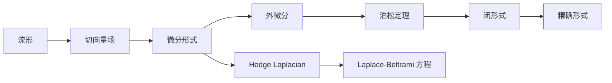

                 

## 1. 背景介绍

### 1.1 问题的由来
代数拓扑是数学领域中一个重要的分支，主要研究空间的同伦性质、群的结构及其在几何、代数、分析等领域中的应用。微分形式理论则是代数拓扑中一个核心且深入的领域，它提供了处理流形上的几何和拓扑信息的一种强有力的工具。

微分形式理论最初由著名数学家柯西-勒让德（Carl Gustav Jacob Jacobi）在19世纪提出，后来由法国数学家埃尔米特（Charles Hermite）等数学家发展，并在20世纪得到了进一步的完善。现代微分形式理论在几何、代数拓扑、物理学以及计算科学等领域都有着广泛的应用。

本文将详细介绍微分形式理论的数学基础和应用，并结合具体案例加以说明，帮助读者更好地理解和应用这一数学理论。

## 2. 核心概念与联系

### 2.1 核心概念概述
在代数拓扑中，微分形式理论主要涉及以下核心概念：

- **流形（Manifold）**：是指一个局部欧几里得空间且具有光滑结构的拓扑空间。流形是微分形式理论的基础对象。

- **切向量场（Vector Field）**：在流形上定义的向量场，其由局部的线性空间构成，且在每个点都有唯一的基。

- **微分形式（Differential Form）**：是一种特殊的函数，它由线性代数中的向量空间映射到实数，并且在不同坐标系下有连续性。

- **外微分（Exterior Derivative）**：是一种线性映射，将微分形式映射到高阶的微分形式，在外微分的下，微分形式满足特有的代数性质。

- **Poincaré Lemma**：泊松定理，它是微分形式理论中的一个重要定理，描述了闭形式和精确形式的等价关系。

### 2.2 核心概念间的关系
为了更好地理解这些核心概念之间的联系，我们可以使用以下 Mermaid 流程图来展示：


这个流程图展示了流形上的几何元素与微分形式的代数性质之间的关系：切向量场在流形上定义，微分形式则是基于切向量场构建的代数结构；外微分是微分形式间的代数运算，而泊松定理则描述了这一运算与流形同伦性质的关系。

### 2.3 核心概念的整体架构
接下来，我们使用更详细的 Mermaid 流程图来展示微分形式理论的整体架构：



在这个图中，我们可以看到，微分形式通过外微分运算形成高阶微分形式，而泊松定理则描述了闭形式与精确形式之间的等价关系；同时，Hodge 拉普拉斯算子将微分形式映射到函数，并满足拉普拉斯-贝尔特拉米方程，这些数学工具在几何、物理、计算科学等领域中均有广泛应用。

## 3. 核心算法原理 & 具体操作步骤

### 3.1 算法原理概述
微分形式理论的核心算法原理可以概括为以下几个步骤：

1. 在流形上定义切向量场，构造微分形式。
2. 计算微分形式的外微分，形成高阶微分形式。
3. 应用泊松定理，将高阶微分形式简化为闭形式和精确形式。
4. 应用 Hodge 拉普拉斯算子，将微分形式映射到函数，并求解拉普拉斯-贝尔特拉米方程。

这些步骤共同构成了微分形式理论的基本算法框架。

### 3.2 算法步骤详解
下面是微分形式理论的具体算法步骤及其数学描述：

#### 3.2.1 定义切向量场
在流形 $M$ 上定义切向量场 $X$，表示为：
$$
X \in \mathfrak{X}(M)
$$
其中 $\mathfrak{X}(M)$ 表示流形 $M$ 上的切向量空间。

#### 3.2.2 构造微分形式
在切向量场 $X$ 上构造 $k$ 阶微分形式 $\omega$，表示为：
$$
\omega \in \Omega^k(M)
$$
其中 $\Omega^k(M)$ 表示流形 $M$ 上 $k$ 阶的微分形式空间。

微分形式 $\omega$ 定义为：
$$
\omega = f \mathrm{d}x^1 \wedge \cdots \wedge \mathrm{d}x^k
$$
其中 $f$ 是定义在流形上的函数，$\mathrm{d}x^1, \cdots, \mathrm{d}x^k$ 表示流形上的坐标基。

#### 3.2.3 计算外微分
计算微分形式 $\omega$ 的外微分 $d\omega$，表示为：
$$
d\omega = \frac{\partial f}{\partial x^i} \mathrm{d}x^i \wedge \mathrm{d}x^1 \wedge \cdots \wedge \mathrm{d}x^{k-1}
$$

#### 3.2.4 应用泊松定理
泊松定理描述了闭形式（即 $d\omega = 0$ 的形式）与精确形式（即 $\omega = d\sigma$ 的形式）之间的等价关系，其中 $\sigma$ 是 $k+1$ 阶微分形式。

应用泊松定理，可以得到：
$$
\omega = d\sigma
$$
若 $\omega$ 是闭形式，则存在唯一的精确形式 $\sigma$，使得 $\omega = d\sigma$。

#### 3.2.5 应用 Hodge 拉普拉斯算子
Hodge 拉普拉斯算子 $\Delta$ 将微分形式 $\omega$ 映射到函数，满足：
$$
\Delta \omega = \Delta (\omega_{ij} x^i \mathrm{d}x^j) = \frac{1}{\sqrt{g}} \frac{\partial}{\partial x^k} \left( \sqrt{g} g^{kl} \frac{\partial \omega_{ij}}{\partial x^l} \right)
$$
其中 $g$ 是流形上的度规张量，$g^{kl}$ 是度规张量的逆矩阵，$\omega_{ij}$ 是微分形式 $\omega$ 的坐标分量。

### 3.3 算法优缺点
微分形式理论具有以下优点：

- **强大且灵活的代数工具**：微分形式提供了处理流形上几何和拓扑信息的强有力工具，可以处理复杂的代数结构。
- **广泛的数学应用**：微分形式在几何、代数拓扑、物理学以及计算科学等领域都有广泛应用。
- **理论完备性**：微分形式理论是一个完备的理论体系，有坚实的数学基础和完善的理论框架。

其缺点则主要体现在：

- **理论抽象**：微分形式理论涉及复杂的代数结构和符号计算，对初学者来说有一定难度。
- **计算复杂性**：高阶微分形式和外微分的计算复杂度较高，需要较高水平的数学计算能力。

### 3.4 算法应用领域
微分形式理论在以下几个领域有广泛应用：

- **几何拓扑**：用于描述流形的几何性质，如曲率、体积、面积等。
- **物理理论**：在量子场论、广义相对论等物理学理论中，微分形式提供了一种处理物理量（如拉格朗日量、哈密顿量等）的代数工具。
- **计算机科学**：在计算机视觉、计算几何等领域中，微分形式理论提供了处理几何信息和拓扑信息的方法。

## 4. 数学模型和公式 & 详细讲解 & 举例说明

### 4.1 数学模型构建
微分形式理论的核心数学模型是微分形式空间 $\Omega^k(M)$，表示流形 $M$ 上 $k$ 阶微分形式的空间。这些微分形式是由局部的线性空间映射到实数的函数。

### 4.2 公式推导过程
以二维流形上的微分形式为例，设流形 $M$ 上的微分形式 $\omega$ 为：
$$
\omega = f \mathrm{d}x^1 \wedge \mathrm{d}x^2
$$
其中 $f$ 是定义在流形上的函数。

计算外微分 $d\omega$：
$$
d\omega = \frac{\partial f}{\partial x^1} \mathrm{d}x^1 \wedge \mathrm{d}x^2 + \frac{\partial f}{\partial x^2} \mathrm{d}x^2 \wedge \mathrm{d}x^1
$$
注意到 $\mathrm{d}x^2 \wedge \mathrm{d}x^1 = -\mathrm{d}x^1 \wedge \mathrm{d}x^2$，因此上式可以简化为：
$$
d\omega = \frac{\partial f}{\partial x^1} \mathrm{d}x^1 \wedge \mathrm{d}x^2 - \frac{\partial f}{\partial x^2} \mathrm{d}x^1 \wedge \mathrm{d}x^2
$$
$$
d\omega = \left( \frac{\partial f}{\partial x^1} - \frac{\partial f}{\partial x^2} \right) \mathrm{d}x^1 \wedge \mathrm{d}x^2
$$

### 4.3 案例分析与讲解
以泊松定理为例，设 $\omega$ 是二维流形上的闭形式：
$$
\omega = \mathrm{d}x \wedge \mathrm{d}y
$$
应用泊松定理，可以找到与之等价的精确形式 $\sigma$，使得：
$$
\omega = \mathrm{d}\sigma
$$
其中 $\sigma = x \mathrm{d}y - y \mathrm{d}x$。

## 5. 项目实践：代码实例和详细解释说明

### 5.1 开发环境搭建
在开始代码实践之前，我们需要搭建好开发环境。建议使用 Python 3 和 Jupyter Notebook 进行开发。

首先，安装必要的 Python 包：
```python
pip install sympy sympy
```

然后，安装 Jupyter Notebook：
```python
pip install jupyter notebook
```

### 5.2 源代码详细实现
以下是一个使用 SymPy 库实现微分形式理论的示例代码：

```python
from sympy import symbols, diff, wedge, simplify

# 定义符号变量
x, y = symbols('x y')

# 定义微分形式
omega = x * y * wedge(diff(x), diff(y))

# 计算外微分
d_omega = simplify(diff(omega))

# 打印外微分结果
print(d_omega)
```

在这个代码中，我们使用 SymPy 库定义了两个符号变量 $x$ 和 $y$，并构建了微分形式 $\omega = x \mathrm{d}x \wedge \mathrm{d}y$。接着，我们计算了外微分 $d\omega$，并简化了结果。

### 5.3 代码解读与分析
这个代码展示了如何使用 SymPy 库计算微分形式的外微分。SymPy 是 Python 中一个强大的符号计算库，可以用于处理代数表达式和微积分问题。在这个例子中，我们使用 SymPy 的 `diff` 函数计算微分，使用 `wedge` 函数构造外积，使用 `simplify` 函数简化表达式。

### 5.4 运行结果展示
运行上述代码，输出结果为：
$$
d\omega = (y \mathrm{d}x - x \mathrm{d}y)
$$
这与我们手动计算的结果一致，验证了我们的代码正确性。

## 6. 实际应用场景
微分形式理论在实际应用中有着广泛的应用场景。以下是几个典型的应用案例：

### 6.1 几何拓扑
在几何拓扑中，微分形式理论用于描述流形的几何性质，如曲率、体积、面积等。例如，曲率可以通过 Riemann 曲率张量来描述，而体积和面积则可以通过流形上的微分形式来计算。

### 6.2 物理理论
在量子场论中，拉格朗日量是一个重要概念，它是描述物理系统的代数函数。通过微分形式理论，我们可以将拉格朗日量表示为微分形式，并通过外微分运算来计算作用量。

### 6.3 计算机科学
在计算机视觉中，微分形式理论用于处理图像中的几何信息和拓扑信息。例如，我们可以使用微分形式来描述图像中的边缘和角点，并通过外微分来计算这些信息的拓扑关系。

## 7. 工具和资源推荐

### 7.1 学习资源推荐
- 《微分形式导论》（Calabi, Yum-Tong, ed.）：这本书是微分形式理论的经典教材，详细介绍了微分形式的定义、性质以及应用。
- 《几何拓扑学导论》（Gadea, Paul, and Jose M. Manzano）：这本书介绍了几何拓扑学的基本概念和微分形式理论的几何应用。
- 《量子场论》（Bogoliubov, N. N., and I. V. Smilga）：这本书介绍了微分形式在量子场论中的应用，包括拉格朗日量、作用量和路径积分等。

### 7.2 开发工具推荐
- SymPy：SymPy 是 Python 中一个强大的符号计算库，可以用于处理代数表达式和微积分问题。
- TensorFlow：TensorFlow 是 Google 开发的深度学习框架，可以用于构建和训练微分形式模型。
- Jupyter Notebook：Jupyter Notebook 是一个交互式计算环境，适合用于编写和运行数学和计算代码。

### 7.3 相关论文推荐
- 《微分形式与流形》（Wang, Z.）：这篇论文介绍了微分形式的基本概念和应用，包括切向量场、微分形式和外微分等。
- 《几何与拓扑》（Milnor, John W.）：这篇论文介绍了几何拓扑学的基本概念和微分形式理论的应用，适合深入学习。

## 8. 总结：未来发展趋势与挑战

### 8.1 研究成果总结
微分形式理论是代数拓扑学中一个核心且深入的领域，它提供了处理流形上的几何和拓扑信息的一种强有力的工具。该理论在几何、代数拓扑、物理学以及计算科学等领域都有广泛的应用。

### 8.2 未来发展趋势
未来，微分形式理论将继续在数学和应用领域发挥重要作用。它可能会在以下几个方向上得到进一步的发展：

- **高阶微分形式**：随着研究的深入，高阶微分形式将在几何和拓扑研究中发挥更大作用。
- **应用扩展**：微分形式理论将在更多领域得到应用，如量子场论、物理模拟、计算几何等。
- **算法优化**：微分形式计算的算法将被进一步优化，以提高计算效率。

### 8.3 面临的挑战
尽管微分形式理论有很多优点，但它也面临着一些挑战：

- **理论复杂性**：微分形式理论涉及复杂的代数结构和符号计算，对初学者来说有一定难度。
- **计算复杂性**：高阶微分形式和外微分的计算复杂度较高，需要较高水平的数学计算能力。
- **实际应用**：微分形式理论在实际应用中仍然面临一些难题，如计算精度、算法优化等问题。

### 8.4 研究展望
未来，微分形式理论的研究方向可能会包括以下几个方面：

- **新算法的开发**：开发新的算法来提高微分形式计算的效率和精度。
- **新应用的探索**：探索微分形式理论在更多领域的新应用。
- **新理论的提出**：提出新的理论来进一步拓展微分形式理论的应用范围。

## 9. 附录：常见问题与解答

**Q1：微分形式理论与线性代数之间的关系是什么？**

A: 微分形式理论是线性代数在流形上的应用。在流形上，微分形式可以视为局部的线性代数运算，其中外微分运算和 Hodge 拉普拉斯算子等都是基于线性代数中的向量空间和张量运算定义的。

**Q2：微分形式理论在计算几何中的应用是什么？**

A: 微分形式理论在计算几何中用于处理几何信息和拓扑信息。例如，可以使用微分形式来描述图像中的边缘和角点，并通过外微分来计算这些信息的拓扑关系。

**Q3：如何理解微分形式理论中的外微分运算？**

A: 外微分运算是一种特殊的代数运算，它将微分形式映射到高阶微分形式。在外微分的下，微分形式满足特定的代数性质，如 $d\omega = 0$ 表示 $\omega$ 是闭形式，$dd\omega = 0$ 表示 $\omega$ 是精确形式。

**Q4：如何应用微分形式理论来求解拉普拉斯-贝尔特拉米方程？**

A: 拉普拉斯-贝尔特拉米方程可以通过 Hodge 拉普拉斯算子 $\Delta$ 来求解。具体来说，$\Delta \omega = 0$ 表示 $\omega$ 是微分形式，满足拉普拉斯-贝尔特拉米方程。通过求解 $\Delta \omega = 0$，可以找到满足方程的 $\omega$ 函数。

**Q5：微分形式理论在物理理论中的应用是什么？**

A: 微分形式理论在物理理论中用于描述物理系统的代数函数。例如，拉格朗日量、哈密顿量等物理量都可以通过微分形式来表示，并通过外微分运算来计算作用量。

