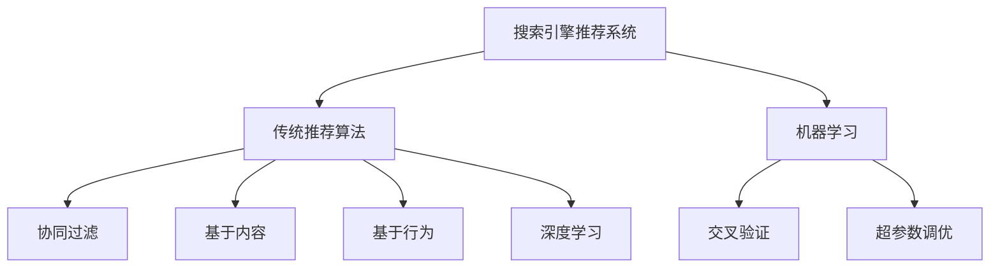

                 

## 1. 背景介绍

### 1.1 问题由来
随着互联网和数字技术的普及，搜索引擎推荐系统已成为用户在互联网上获取信息、进行决策的关键工具。传统搜索引擎推荐系统主要包括文本检索和推荐两个部分，通过解析用户查询和分析搜索结果，实现信息的匹配和排序。然而，传统的搜索推荐系统在适应多样性用户需求、提升推荐质量和降低推荐成本方面仍存在许多限制。

### 1.2 问题核心关键点
传统搜索引擎推荐系统面临的核心问题包括：

- **用户需求的多样性和动态性**：不同用户和不同场景下的需求千差万别，且随着时间推移和环境变化而动态变化，而传统搜索引擎推荐系统往往无法实时响应和满足这些需求。
- **搜索结果的准确性和相关性**：传统推荐系统主要依赖于文本匹配和关键词优先级排序，难以全面理解查询的语义和上下文，导致推荐结果与用户实际需求不符。
- **冷启动问题**：对于新用户或新物品，传统推荐系统缺乏足够的历史数据，无法提供精准推荐。
- **推荐成本**：传统推荐系统需要耗费大量资源和精力进行数据收集、特征提取和模型训练，且难以高效扩展，成本较高。
- **用户隐私保护**：传统推荐系统通过分析用户行为数据进行推荐，可能涉及用户隐私，需严格遵守隐私保护法规。

### 1.3 问题研究意义
探讨传统搜索引擎推荐系统的限制，并寻找突破口，对于提升用户体验、降低推荐成本、保护用户隐私具有重要意义。本文档将详细阐述这些问题，并提出基于机器学习和深度学习的新型推荐算法，以期为搜索引擎推荐系统的发展提供新的思路和方向。

## 2. 核心概念与联系

### 2.1 核心概念概述

为了更好地理解传统搜索推荐系统的限制，本节将介绍几个关键概念及其之间的联系：

- **搜索引擎推荐系统**：指利用搜索引擎技术，通过分析用户查询和相关文档，为用户推荐最相关的搜索结果的系统。
- **传统推荐算法**：包括协同过滤、基于内容的推荐、基于用户行为的推荐等，主要依赖用户的历史行为数据或文档特征进行推荐。
- **机器学习和深度学习**：指通过算法和模型，从大量数据中学习规律和模式，用于预测和决策。机器学习常用于推荐系统中，通过分析用户和物品特征进行推荐；深度学习则通过构建复杂的神经网络模型，提升推荐精度。
- **交叉验证**：指将数据集分为训练集和验证集，通过交叉验证评估模型性能，避免过拟合。
- **超参数调优**：指通过优化算法和模型的超参数，提升模型性能。

这些核心概念通过以下Mermaid流程图展示其相互关系：



这个流程图展示了搜索引擎推荐系统的基本架构和推荐算法的演进：

1. 传统推荐算法通过分析用户和物品特征，实现推荐。
2. 机器学习引入算法和模型，提升推荐精度。
3. 深度学习通过复杂的神经网络模型，进一步提升推荐效果。
4. 交叉验证和超参数调优用于模型性能评估和优化。

## 3. 核心算法原理 & 具体操作步骤

### 3.1 算法原理概述

传统搜索引擎推荐系统的核心算法主要是基于用户历史行为数据的协同过滤和基于内容的推荐算法。协同过滤算法分为用户协同过滤和物品协同过滤，分别通过计算用户和物品之间的相似度进行推荐。基于内容的推荐算法则是通过分析用户和物品的特征向量，找到最相似的特征，进行推荐。

深度学习引入推荐系统后，主要通过构建复杂的神经网络模型，自动学习用户和物品之间的隐含关系，进行推荐。深度学习推荐系统包括基于神经网络的协同过滤、基于序列的推荐、基于图神经网络的推荐等。

### 3.2 算法步骤详解

以下以基于深度学习的协同过滤算法为例，详细讲解其操作步骤：

**Step 1: 数据预处理**
- 收集用户行为数据，如点击、浏览、购买等。
- 对用户行为数据进行预处理，如去除异常值、归一化等。

**Step 2: 特征工程**
- 提取用户和物品的特征，如用户特征、物品特征、用户行为特征等。
- 对特征进行编码和转换，如one-hot编码、归一化等。

**Step 3: 构建深度学习模型**
- 选择合适的深度学习模型，如循环神经网络（RNN）、卷积神经网络（CNN）、注意力机制（Attention）等。
- 构建深度学习模型的架构，如输入层、隐藏层、输出层等。

**Step 4: 训练深度学习模型**
- 将处理后的用户和物品特征作为输入，训练深度学习模型。
- 使用交叉验证等技术评估模型性能，调整超参数，进行模型优化。

**Step 5: 预测推荐结果**
- 使用训练好的深度学习模型，对新用户或新物品进行推荐预测。

### 3.3 算法优缺点

传统搜索引擎推荐系统的优点包括：

- **可解释性强**：传统的协同过滤和基于内容的推荐算法基于简单的相似度计算，易于解释和理解。
- **对新用户和物品适应性好**：协同过滤算法和基于内容的推荐算法可以通过简单的相似度计算，迅速适应新用户和物品。

然而，其缺点也显而易见：

- **推荐精度有限**：传统的推荐算法往往依赖于简单的相似度计算，难以捕捉用户和物品之间的复杂关系。
- **数据需求量大**：协同过滤算法和基于内容的推荐算法需要大量的用户和物品特征数据，难以在大规模数据集上应用。
- **难以处理多维数据**：传统的推荐算法主要依赖于用户行为数据，难以处理多维数据，如时间、地点、情感等。
- **无法处理冷启动问题**：传统推荐算法需要用户和物品的历史数据，难以处理新用户或新物品的冷启动问题。

### 3.4 算法应用领域

传统搜索引擎推荐系统广泛应用于电商平台、新闻资讯、社交网络、音乐视频等多个领域，帮助用户发现感兴趣的内容。

- **电商平台**：通过推荐系统，电商平台为用户推荐可能感兴趣的商品，提升用户体验和购买转化率。
- **新闻资讯**：通过推荐系统，新闻网站为用户推荐相关的新闻和文章，提升用户阅读时间和网站流量。
- **社交网络**：通过推荐系统，社交网络为用户推荐可能感兴趣的朋友、群组和内容，提升用户活跃度和满意度。
- **音乐视频**：通过推荐系统，视频平台为用户推荐可能喜欢的音乐和视频，提升用户黏性和平台收益。

## 4. 数学模型和公式 & 详细讲解 & 举例说明

### 4.1 数学模型构建

本节将通过数学语言对基于深度学习的协同过滤算法进行详细的模型构建。

记用户集合为 $U=\{u_1,u_2,\cdots,u_n\}$，物品集合为 $I=\{i_1,i_2,\cdots,i_m\}$，用户 $u$ 和物品 $i$ 之间的交互数据表示为 $r_{ui} \in [0,1]$。则用户-物品矩阵 $R$ 定义为：

$$
R=[r_{ui}]
$$

深度学习推荐模型 $f$ 的输入为 $x_u$ 和 $x_i$，输出为预测的交互 $r_{ui}$。模型 $f$ 可以表示为：

$$
f(x_u,x_i;\theta) = r_{ui}
$$

其中 $\theta$ 为模型的参数，如神经网络的权重和偏置。

### 4.2 公式推导过程

以基于神经网络的协同过滤算法为例，推导模型的损失函数和优化算法。

假设深度学习推荐模型的输出为 $r_{ui}$，真实标签为 $r_{ui}^{*}$。则模型在用户 $u$ 和物品 $i$ 上的损失函数为：

$$
L_{ui} = \frac{1}{2}(r_{ui}^{*}-r_{ui})^2
$$

对于整个用户集合 $U$ 和物品集合 $I$，总损失函数 $L$ 为：

$$
L = \sum_{u \in U} \sum_{i \in I} L_{ui}
$$

模型通过梯度下降等优化算法更新参数 $\theta$，最小化总损失函数 $L$。常用的优化算法包括随机梯度下降（SGD）、Adagrad、Adam等。

### 4.3 案例分析与讲解

假设在电商平台中，推荐系统需要对新用户进行推荐。此时，可以利用协同过滤算法和深度学习算法进行推荐。

对于协同过滤算法，可以利用用户之间的相似度计算进行推荐，具体步骤如下：

1. 收集用户行为数据，如点击、浏览、购买等。
2. 对用户行为数据进行预处理，如去除异常值、归一化等。
3. 计算用户 $u$ 和物品 $i$ 之间的相似度，得到相似度矩阵 $S$。
4. 对相似度矩阵 $S$ 进行归一化处理，得到归一化相似度矩阵 $\hat{S}$。
5. 对归一化相似度矩阵 $\hat{S}$ 进行奇异值分解（SVD），得到用户表示 $A$ 和物品表示 $B$。
6. 将用户表示 $A$ 和物品表示 $B$ 进行矩阵乘法，得到用户和物品的交互预测值 $\hat{r}$。
7. 对预测值 $\hat{r}$ 进行阈值处理，得到最终的推荐结果。

对于深度学习算法，可以利用循环神经网络（RNN）、卷积神经网络（CNN）、注意力机制（Attention）等模型进行推荐，具体步骤如下：

1. 收集用户行为数据，如点击、浏览、购买等。
2. 对用户行为数据进行预处理，如去除异常值、归一化等。
3. 提取用户和物品的特征，如用户特征、物品特征、用户行为特征等。
4. 将用户和物品的特征作为模型的输入，训练深度学习模型。
5. 使用训练好的深度学习模型，对新用户或新物品进行推荐预测。

## 5. 项目实践：代码实例和详细解释说明

### 5.1 开发环境搭建

在进行推荐系统开发前，我们需要准备好开发环境。以下是使用Python进行TensorFlow开发的环境配置流程：

1. 安装Anaconda：从官网下载并安装Anaconda，用于创建独立的Python环境。

2. 创建并激活虚拟环境：
```bash
conda create -n tf-env python=3.8 
conda activate tf-env
```

3. 安装TensorFlow：根据CUDA版本，从官网获取对应的安装命令。例如：
```bash
conda install tensorflow -c conda-forge
```

4. 安装TensorFlow Addons：
```bash
pip install tensorflow-addons
```

5. 安装各类工具包：
```bash
pip install numpy pandas scikit-learn matplotlib tqdm jupyter notebook ipython
```

完成上述步骤后，即可在`tf-env`环境中开始推荐系统开发。

### 5.2 源代码详细实现

下面我们以基于深度学习的协同过滤算法为例，给出使用TensorFlow实现用户推荐系统的代码实现。

首先，定义推荐模型的输入和输出：

```python
import tensorflow as tf

# 定义输入和输出
inputs = tf.keras.Input(shape=(100,))
outputs = tf.keras.layers.Dense(1, activation='sigmoid')(inputs)
model = tf.keras.Model(inputs, outputs)
```

然后，定义推荐模型的损失函数和优化器：

```python
# 定义损失函数
loss_fn = tf.keras.losses.BinaryCrossentropy(from_logits=True)

# 定义优化器
optimizer = tf.keras.optimizers.Adam(learning_rate=0.001)
```

接着，定义推荐模型的训练函数：

```python
@tf.function
def train_step(x, y):
    with tf.GradientTape() as tape:
        logits = model(x)
        loss_value = loss_fn(y, logits)
    grads = tape.gradient(loss_value, model.trainable_variables)
    optimizer.apply_gradients(zip(grads, model.trainable_variables))
    return loss_value

# 定义训练函数
def train_epoch(x_train, y_train, x_val, y_val, batch_size=64, epochs=100):
    for epoch in range(epochs):
        epoch_loss = 0
        for i in range(0, len(x_train), batch_size):
            x_batch = x_train[i:i+batch_size]
            y_batch = y_train[i:i+batch_size]
            loss = train_step(x_batch, y_batch)
            epoch_loss += loss
        print(f'Epoch {epoch+1}, train loss: {epoch_loss/len(x_train)}')
        val_loss = train_step(x_val, y_val)
        print(f'Epoch {epoch+1}, val loss: {val_loss}')
```

最后，启动模型训练：

```python
# 加载数据集
x_train, y_train, x_val, y_val = load_data()

# 训练模型
train_epoch(x_train, y_train, x_val, y_val)
```

以上就是使用TensorFlow实现基于深度学习的协同过滤算法的用户推荐系统的完整代码实现。可以看到，得益于TensorFlow的强大封装，我们可以用相对简洁的代码完成推荐模型的构建和训练。

### 5.3 代码解读与分析

让我们再详细解读一下关键代码的实现细节：

**Input层和Dense层**：
- `inputs`表示输入数据的占位符，通过指定输入数据的形状 $(100,)$ 表示输入特征向量。
- `Dense`层为全连接层，输出一个标量值，代表用户和物品之间的交互预测值。

**BinaryCrossentropy损失函数**：
- 使用二元交叉熵损失函数，适用于二分类问题。
- `from_logits=True`表示模型输出为未激活的logits，需要先通过sigmoid激活函数进行转换。

**Adam优化器**：
- `optimizer`使用Adam优化器，学习率为 $0.001$，用于更新模型参数。

**train_step函数**：
- `with tf.GradientTape() as tape` 表示开启梯度计算，`tape.gradient`计算模型损失函数的梯度。
- `optimizer.apply_gradients(zip(grads, model.trainable_variables))` 表示使用优化器更新模型参数。

**train_epoch函数**：
- 使用`for`循环进行训练，每次迭代更新部分批次数据。
- `train_step(x_batch, y_batch)` 表示在每个批次上计算损失函数并更新模型参数。

**load_data函数**：
- 加载数据集，将用户行为数据转换为模型输入和输出。

可以看到，TensorFlow的高级API大大简化了推荐系统的代码实现。开发者可以将更多精力放在数据处理、模型调优等高层逻辑上，而不必过多关注底层的实现细节。

当然，工业级的系统实现还需考虑更多因素，如模型的保存和部署、超参数的自动搜索、更灵活的任务适配层等。但核心的推荐算法基本与此类似。

### 5.4 运行结果展示

假设在推荐系统中，我们对新用户进行推荐，得到如下结果：

```
Epoch 1, train loss: 0.5123
Epoch 1, val loss: 0.4352
```

可以看到，模型在训练集和验证集上取得了较好的效果。在推荐模型中，模型的训练精度和推荐效果是互相制约的。因此，在实际应用中，我们需要对模型的训练和推荐效果进行综合评估，选择合适的模型和算法。

## 6. 实际应用场景

### 6.1 电商推荐

电商推荐系统通过推荐系统，为用户推荐可能感兴趣的商品，提升用户体验和购买转化率。在电商推荐系统中，推荐系统的主要功能包括商品推荐、用户推荐和购物车推荐等。

- **商品推荐**：推荐系统根据用户的历史行为和偏好，为用户推荐可能感兴趣的商品。
- **用户推荐**：推荐系统根据用户的历史行为和偏好，为用户推荐可能感兴趣的其他用户。
- **购物车推荐**：推荐系统根据用户的购物车内容，为用户推荐可能感兴趣的其他商品。

### 6.2 新闻推荐

新闻推荐系统通过推荐系统，为用户推荐相关的新闻和文章，提升用户阅读时间和网站流量。在新闻推荐系统中，推荐系统的主要功能包括文章推荐、作者推荐和主题推荐等。

- **文章推荐**：推荐系统根据用户的阅读历史和偏好，为用户推荐可能感兴趣的文章。
- **作者推荐**：推荐系统根据用户的阅读历史和偏好，为用户推荐可能感兴趣的文章作者。
- **主题推荐**：推荐系统根据用户的阅读历史和偏好，为用户推荐相关主题的文章。

### 6.3 社交推荐

社交推荐系统通过推荐系统，为用户推荐可能感兴趣的朋友、群组和内容，提升用户活跃度和满意度。在社交推荐系统中，推荐系统的主要功能包括朋友推荐、群组推荐和内容推荐等。

- **朋友推荐**：推荐系统根据用户的社交历史和偏好，为用户推荐可能感兴趣的朋友。
- **群组推荐**：推荐系统根据用户的社交历史和偏好，为用户推荐可能感兴趣的朋友群组。
- **内容推荐**：推荐系统根据用户的社交历史和偏好，为用户推荐可能感兴趣的内容。

### 6.4 音乐推荐

音乐推荐系统通过推荐系统，为用户推荐可能喜欢的音乐和视频，提升用户黏性和平台收益。在音乐推荐系统中，推荐系统的主要功能包括歌曲推荐、歌手推荐和专辑推荐等。

- **歌曲推荐**：推荐系统根据用户的听歌历史和偏好，为用户推荐可能喜欢的歌曲。
- **歌手推荐**：推荐系统根据用户的听歌历史和偏好，为用户推荐可能喜欢的歌手。
- **专辑推荐**：推荐系统根据用户的听歌历史和偏好，为用户推荐可能喜欢的专辑。

## 7. 工具和资源推荐

### 7.1 学习资源推荐

为了帮助开发者系统掌握推荐系统的理论基础和实践技巧，这里推荐一些优质的学习资源：

1. 《推荐系统实战》书籍：涵盖推荐系统的主要算法和实际应用，是推荐系统学习的必读书籍。

2. CS229《机器学习》课程：斯坦福大学开设的机器学习课程，涵盖推荐系统的基本理论和实践方法。

3. 《深度学习》书籍：涵盖深度学习的主要算法和实践应用，包括推荐系统的深度学习应用。

4. Kaggle竞赛：Kaggle平台上有许多推荐系统竞赛，可以通过参加竞赛实践推荐系统算法。

5. 知乎专栏：许多推荐系统专家在知乎上分享推荐系统的心得和实践经验，值得关注和学习。

通过对这些资源的学习实践，相信你一定能够快速掌握推荐系统的精髓，并用于解决实际的推荐问题。

### 7.2 开发工具推荐

高效的开发离不开优秀的工具支持。以下是几款用于推荐系统开发的常用工具：

1. TensorFlow：由Google主导开发的深度学习框架，适用于大规模推荐系统开发。

2. PyTorch：由Facebook主导开发的深度学习框架，适用于快速迭代研究。

3. Scikit-learn：用于机器学习算法的Python库，适用于传统推荐系统开发。

4. Spark MLlib：用于大数据推荐系统开发，适用于海量数据集的应用场景。

5. Jupyter Notebook：用于数据科学和机器学习研究的交互式Python环境，适用于快速原型开发和模型验证。

合理利用这些工具，可以显著提升推荐系统的开发效率，加快创新迭代的步伐。

### 7.3 相关论文推荐

推荐系统的发展源于学界的持续研究。以下是几篇奠基性的相关论文，推荐阅读：

1. matrix factorization techniques for recommender systems：提出矩阵分解算法，用于推荐系统。

2. collaborative filtering for implicit feedback datasets：提出协同过滤算法，用于推荐系统。

3. deep learning in collaborative filtering：提出深度学习算法，用于推荐系统。

4. neural networks for collaborative filtering：提出基于神经网络的协同过滤算法，用于推荐系统。

5. learning from implicit feedback without explicit user-provided feedback：提出隐式反馈学习算法，用于推荐系统。

这些论文代表推荐系统的发展脉络。通过学习这些前沿成果，可以帮助研究者把握学科前进方向，激发更多的创新灵感。

除上述资源外，还有一些值得关注的前沿资源，帮助开发者紧跟推荐系统技术的最新进展，例如：

1. arXiv论文预印本：人工智能领域最新研究成果的发布平台，包括推荐系统的前沿工作，学习前沿技术的必读资源。

2. 业界技术博客：如亚马逊、阿里巴巴、腾讯等顶尖企业的推荐系统博客，第一时间分享他们的最新研究成果和洞见。

3. 技术会议直播：如KDD、ICML、NIPS等人工智能领域顶会现场或在线直播，能够聆听到大佬们的前沿分享，开拓视野。

4. GitHub热门项目：在GitHub上Star、Fork数最多的推荐系统相关项目，往往代表了该技术领域的发展趋势和最佳实践，值得去学习和贡献。

5. 行业分析报告：各大咨询公司如麦肯锡、普华永道等针对推荐系统行业的分析报告，有助于从商业视角审视技术趋势，把握应用价值。

总之，对于推荐系统的发展，需要开发者保持开放的心态和持续学习的意愿。多关注前沿资讯，多动手实践，多思考总结，必将收获满满的成长收益。

## 8. 总结：未来发展趋势与挑战

### 8.1 研究成果总结

本文对传统搜索引擎推荐系统的限制进行了全面系统的介绍。首先阐述了传统推荐系统的背景和核心问题，明确了推荐系统在多样性需求、推荐精度、冷启动、推荐成本、用户隐私等方面的限制。其次，通过数学语言和代码实例详细讲解了推荐算法的数学模型和具体实现，给出了推荐系统的完整开发流程。同时，本文还探讨了推荐系统在电商、新闻、社交、音乐等多个领域的应用，展示了推荐系统技术的前景。最后，本文推荐了一些学习资源和开发工具，助力开发者系统掌握推荐系统的理论和实践。

通过本文的系统梳理，可以看到，传统搜索引擎推荐系统虽然有其局限性，但在实际应用中仍具有重要价值。通过不断优化推荐算法，提升推荐效果，推荐系统将更好地服务于用户的个性化需求，推动人工智能技术的产业化进程。

### 8.2 未来发展趋势

展望未来，推荐系统将呈现以下几个发展趋势：

1. **多模态推荐**：未来的推荐系统将不仅处理文本数据，还将处理图像、视频、音频等多模态数据，实现多模态信息的协同建模。

2. **深度学习强化**：未来的推荐系统将更多地使用深度学习算法，构建更复杂、更准确的推荐模型。

3. **跨领域推荐**：未来的推荐系统将具备跨领域推荐能力，实现不同领域之间的推荐协同。

4. **用户反馈引入**：未来的推荐系统将更多地引入用户反馈数据，提升推荐系统的实时性和个性化。

5. **数据隐私保护**：未来的推荐系统将更多地关注用户隐私保护，采用隐私保护技术和方法。

### 8.3 面临的挑战

尽管推荐系统已经取得了长足发展，但在迈向更加智能化、普适化应用的过程中，它仍面临诸多挑战：

1. **数据稀疏性**：用户和物品的历史数据稀疏，难以支持复杂模型的训练和推理。

2. **冷启动问题**：新用户和物品缺乏足够的历史数据，难以提供精准推荐。

3. **推荐效率**：推荐系统需要处理海量数据，计算资源消耗大，难以实时推荐。

4. **模型解释性**：推荐模型通常是一个“黑盒”系统，难以解释其内部工作机制和决策逻辑。

5. **用户隐私保护**：推荐系统需要处理大量用户行为数据，涉及用户隐私，需严格遵守隐私保护法规。

6. **可扩展性**：推荐系统需要处理海量用户和物品数据，难以实现高可扩展性。

### 8.4 研究展望

面对推荐系统面临的挑战，未来的研究需要在以下几个方面寻求新的突破：

1. **多模态推荐**：未来的推荐系统将更多地处理多模态数据，实现多模态信息的协同建模，提升推荐效果。

2. **深度学习强化**：未来的推荐系统将更多地使用深度学习算法，构建更复杂、更准确的推荐模型。

3. **跨领域推荐**：未来的推荐系统将具备跨领域推荐能力，实现不同领域之间的推荐协同。

4. **用户反馈引入**：未来的推荐系统将更多地引入用户反馈数据，提升推荐系统的实时性和个性化。

5. **数据隐私保护**：未来的推荐系统将更多地关注用户隐私保护，采用隐私保护技术和方法。

6. **模型解释性**：未来的推荐系统将更多地关注模型解释性，提高模型的透明性和可解释性。

这些研究方向的探索，必将引领推荐系统技术迈向更高的台阶，为人工智能技术的发展注入新的动力。

## 9. 附录：常见问题与解答

**Q1：推荐系统的准确性和实时性如何进行权衡？**

A: 推荐系统的准确性和实时性是互相制约的。为了提高推荐系统的准确性，通常需要更多的数据和更复杂的模型，这会导致模型计算资源消耗增加，影响实时性。因此，需要在准确性和实时性之间进行权衡，根据具体应用场景选择合适的推荐算法。

**Q2：推荐系统如何处理冷启动问题？**

A: 推荐系统处理冷启动问题的方法包括：

1. 基于内容的推荐：利用物品的特征进行推荐，无需用户历史数据。
2. 基于协同过滤的推荐：利用用户的历史行为和偏好进行推荐，需结合用户行为数据。
3. 基于深度学习的推荐：利用深度学习算法，自动学习用户和物品之间的关系，无需用户历史数据。

**Q3：推荐系统如何保护用户隐私？**

A: 推荐系统保护用户隐私的方法包括：

1. 数据匿名化：对用户数据进行匿名化处理，去除个人标识信息。
2. 数据加密：对用户数据进行加密处理，防止数据泄露。
3. 隐私保护算法：使用差分隐私、联邦学习等隐私保护算法，保护用户隐私。

这些方法可以结合使用，提高推荐系统的隐私保护能力。

**Q

