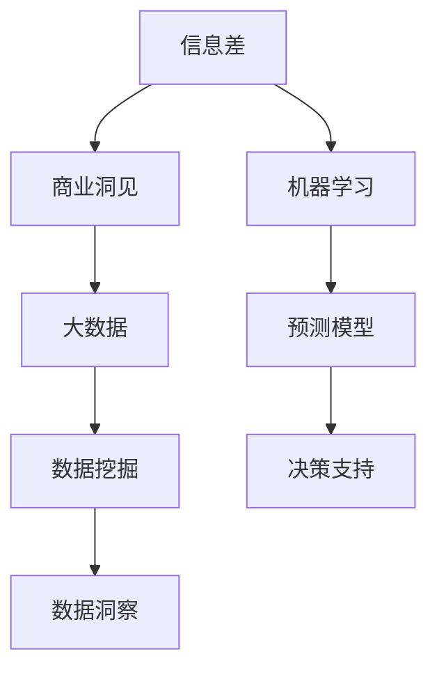
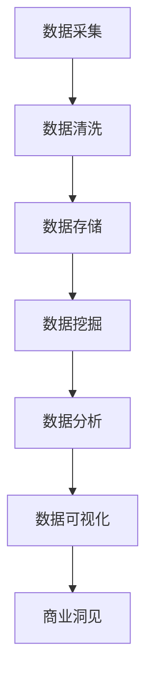
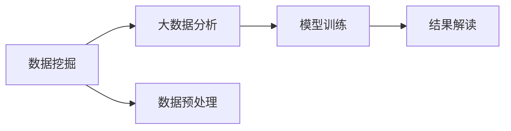
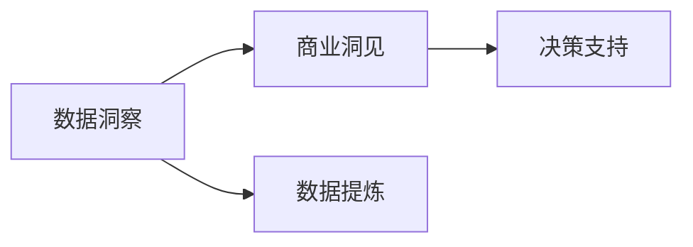
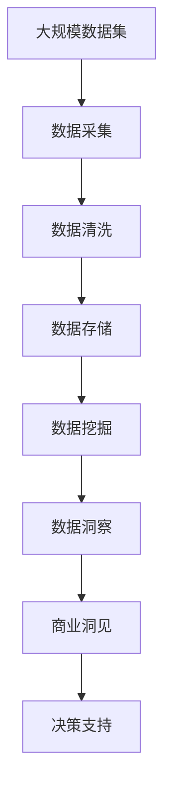

                 

# 信息差的商业洞见发现之路：大数据如何发现隐藏洞见

> 关键词：信息差, 商业洞见, 大数据, 机器学习, 数据挖掘, 数据洞察

## 1. 背景介绍

### 1.1 问题由来
随着数字化转型浪潮的席卷，数据已成为企业竞争力的关键资源。在信息泛滥的时代，如何在海量数据中发现隐藏的洞见，成为企业决策者最为关注的问题。信息差的概念应运而生，指在企业内部和外部信息不对称的情况下，利用信息差进行商业洞见的挖掘，从而在竞争中占据优势。

大数据技术的快速发展为信息差分析提供了可能，帮助企业从海量数据中提取关键洞见，提升决策质量。但与此同时，数据质量、数据获取成本、数据处理复杂度等问题也随之而来，对企业信息差分析能力提出了更高要求。

### 1.2 问题核心关键点
- 信息差：指企业内部与外部信息不对称的情况，可以利用这一差距进行商业洞见的挖掘。
- 商业洞见：指基于数据驱动的，有助于企业决策的洞察和建议。
- 大数据：指大规模的数据集，可以帮助企业从海量数据中提取洞见。
- 数据挖掘：指利用算法和工具从大数据中提取有用信息的过程。
- 数据洞察：指通过数据挖掘得到的深入理解，指导企业决策和行动。

### 1.3 问题研究意义
研究如何通过大数据分析信息差，发现商业洞见，对于提升企业决策质量、优化资源配置、提高竞争力具有重要意义：

1. **提高决策质量**：通过信息差分析，发现潜在问题和机会，制定更科学、合理的商业策略。
2. **优化资源配置**：根据信息差分析结果，调整资源分配，提高资源利用效率。
3. **提升竞争力**：利用信息差分析挖掘的商业洞见，迅速响应市场变化，抢占市场先机。
4. **增强风险管理**：通过信息差分析，识别潜在风险，提前制定应对策略。
5. **提升运营效率**：通过信息差分析，优化流程和运营，提高生产效率和服务质量。

## 2. 核心概念与联系

### 2.1 核心概念概述

为更好地理解大数据如何通过信息差发现商业洞见，本节将介绍几个密切相关的核心概念：

- 信息差(Information Gap)：指企业内部与外部信息不对称的情况，可以从中挖掘商业洞见。
- 商业洞见(Commercial Insights)：指基于数据驱动的，有助于企业决策的洞察和建议。
- 大数据(Big Data)：指大规模的数据集，可以提供丰富的数据源进行信息差分析。
- 数据挖掘(Data Mining)：指利用算法和工具从大数据中提取有用信息的过程。
- 数据洞察(Data Insights)：指通过数据挖掘得到的深入理解，指导企业决策和行动。
- 机器学习(Machine Learning)：指利用算法和模型自动从数据中学习规律，提取洞见。

这些核心概念之间的逻辑关系可以通过以下Mermaid流程图来展示：



这个流程图展示了从信息差到商业洞见的整个分析过程：

1. 信息差通过数据挖掘和大数据分析发现。
2. 数据洞察基于挖掘结果进行深入理解。
3. 商业洞见从数据洞察中提炼，用于指导决策支持。

### 2.2 概念间的关系

这些核心概念之间存在着紧密的联系，形成了信息差分析的完整生态系统。下面我们通过几个Mermaid流程图来展示这些概念之间的关系。

#### 2.2.1 信息差分析的总体流程



这个流程图展示了信息差分析的总体流程：

1. 通过数据采集和清洗，准备数据源。
2. 数据存储在数据库中，方便后续分析使用。
3. 数据挖掘利用算法和工具提取有用信息。
4. 数据分析进一步提炼信息洞察。
5. 数据可视化将分析结果呈现给决策者。
6. 商业洞见指导企业决策和行动。

#### 2.2.2 数据挖掘和大数据分析的关系



这个流程图展示了数据挖掘和大数据分析的关系：

1. 数据挖掘利用算法和工具从大数据中提取有用信息。
2. 大数据分析基于挖掘结果进行更深层次的统计和分析。
3. 模型训练使用大数据分析结果，进行更精准的预测和决策。
4. 结果解读将分析结果呈现给决策者，辅助决策过程。

#### 2.2.3 数据洞察和商业洞见的关系



这个流程图展示了数据洞察和商业洞见的关系：

1. 数据洞察从数据挖掘结果中提炼，形成深入理解。
2. 商业洞见从数据洞察中提炼，用于指导决策和行动。
3. 决策支持基于商业洞见进行资源配置和策略调整。

### 2.3 核心概念的整体架构

最后，我们用一个综合的流程图来展示这些核心概念在大数据信息差分析中的整体架构：



这个综合流程图展示了从数据采集到商业洞见的完整过程。通过信息差分析，企业可以更好地利用大数据资源，发现潜在的商业洞见，指导决策和行动。

## 3. 核心算法原理 & 具体操作步骤
### 3.1 算法原理概述

信息差分析的本质是通过数据挖掘和大数据分析，发现企业内部与外部信息的不对称，从而提炼商业洞见。其核心算法包括：

- 数据采集：从各个渠道采集数据，如社交媒体、网站、交易记录等。
- 数据清洗：对采集到的数据进行预处理，如去重、去除异常值、处理缺失值等。
- 数据存储：将清洗后的数据存储在数据库或数据湖中。
- 数据挖掘：利用算法和工具从大数据中提取有用信息，如关联规则、分类模型、聚类等。
- 数据洞察：从数据挖掘结果中提炼深入理解，如用户行为分析、市场趋势预测、客户细分等。
- 商业洞见：基于数据洞察，提出有助于企业决策的洞察和建议，如客户流失预警、市场机会发现、资源优化策略等。

### 3.2 算法步骤详解

信息差分析的核心算法步骤包括：

1. **数据采集**：收集不同来源的数据，如社交媒体、网站、交易记录等。
2. **数据清洗**：对采集到的数据进行预处理，如去重、去除异常值、处理缺失值等。
3. **数据存储**：将清洗后的数据存储在数据库或数据湖中，方便后续分析使用。
4. **数据挖掘**：利用算法和工具从大数据中提取有用信息，如关联规则、分类模型、聚类等。
5. **数据洞察**：从数据挖掘结果中提炼深入理解，如用户行为分析、市场趋势预测、客户细分等。
6. **商业洞见**：基于数据洞察，提出有助于企业决策的洞察和建议，如客户流失预警、市场机会发现、资源优化策略等。

### 3.3 算法优缺点

信息差分析具有以下优点：

- **数据全面性**：通过多渠道数据采集，可以获取全面的信息，弥补单一数据源的不足。
- **分析深入性**：利用算法和工具深入挖掘数据，发现隐藏的模式和趋势。
- **决策支持**：提炼的商业洞见可以指导企业决策和行动，提高决策质量。

同时，信息差分析也存在一些缺点：

- **数据质量问题**：数据采集和清洗需要耗费大量人力和时间，数据质量问题也难以避免。
- **计算资源消耗大**：大数据分析需要强大的计算资源，包括高性能的服务器和存储设备。
- **分析结果解读难度高**：大数据分析结果复杂，需要专业的数据科学家进行解读和解释。
- **隐私和安全问题**：企业内部和外部数据的隐私和安全问题，需要特别注意。

### 3.4 算法应用领域

信息差分析在大数据时代的应用非常广泛，涵盖各个行业：

- **零售行业**：通过用户行为分析，发现潜在的市场机会和客户流失预警，优化库存和促销策略。
- **金融行业**：通过市场趋势预测和风险管理，提前识别潜在风险，制定应对策略。
- **医疗行业**：通过患者数据和医疗记录，发现疾病流行趋势，优化医疗资源配置。
- **制造业**：通过设备运行数据，发现生产过程中的异常和瓶颈，优化生产流程。
- **物流行业**：通过运输和配送数据，发现最优路线和仓储策略，提高物流效率。

除上述领域外，信息差分析还可以应用于更多行业，帮助企业利用大数据资源，发现商业洞见，提升竞争力。

## 4. 数学模型和公式 & 详细讲解 & 举例说明

### 4.1 数学模型构建

信息差分析的数学模型构建主要包括以下几个部分：

- **数据采集模型**：定义数据采集的过程和策略，如社交媒体数据的爬虫算法。
- **数据清洗模型**：定义数据清洗的规则和方法，如去除异常值的统计方法。
- **数据存储模型**：定义数据存储的方式和结构，如数据库的表设计和索引策略。
- **数据挖掘模型**：定义数据挖掘的算法和方法，如关联规则的Apriori算法。
- **数据洞察模型**：定义数据洞察的提炼方法和指标，如用户行为分析的回归模型。
- **商业洞见模型**：定义商业洞见的生成方法和策略，如市场趋势预测的统计模型。

### 4.2 公式推导过程

以下以用户行为分析为例，推导回归模型的计算公式。

假设企业收集到n个用户的购买数据，每个用户购买k个商品，购买量为$q_i$，商品价格为$p_i$，回归模型为$y_i = \beta_0 + \beta_1p_i + \epsilon_i$，其中$\beta_0$和$\beta_1$为回归系数，$\epsilon_i$为随机误差项。回归模型可以表示为：

$$
y = X\beta + \epsilon
$$

其中，$X$为设计矩阵，$\beta$为回归系数向量，$\epsilon$为随机误差向量。

根据最小二乘法，回归系数的求解公式为：

$$
\hat{\beta} = (X^TX)^{-1}X^Ty
$$

其中$\hat{\beta}$为回归系数的估计值。

### 4.3 案例分析与讲解

假设一家电商企业收集到50000名用户的购买数据，每个用户购买10个商品，购买量为$q_i$，商品价格为$p_i$。通过回归模型分析用户购买行为，发现价格与购买量之间存在显著的正相关关系，具体公式如下：

$$
\hat{y} = 50 + 10p
$$

即商品价格每增加1元，用户平均购买量增加10件。企业可以根据此结果调整价格策略，优化促销方案，提升销售额。

## 5. 项目实践：代码实例和详细解释说明
### 5.1 开发环境搭建

在进行信息差分析实践前，我们需要准备好开发环境。以下是使用Python进行Pandas、Scikit-learn、Matplotlib等库开发的环境配置流程：

1. 安装Anaconda：从官网下载并安装Anaconda，用于创建独立的Python环境。

2. 创建并激活虚拟环境：
```bash
conda create -n data-env python=3.8 
conda activate data-env
```

3. 安装Pandas、Scikit-learn、Matplotlib等库：
```bash
pip install pandas scikit-learn matplotlib numpy jupyter notebook ipython
```

4. 安装SQLAlchemy和PyMySQL：用于数据库连接和操作。
```bash
pip install sqlalchemy pymysql
```

完成上述步骤后，即可在`data-env`环境中开始信息差分析实践。

### 5.2 源代码详细实现

这里我们以用户行为分析为例，展示使用Pandas和Scikit-learn库进行回归模型分析的PyTorch代码实现。

首先，定义数据读取和预处理函数：

```python
import pandas as pd
from sklearn.preprocessing import StandardScaler
from sklearn.model_selection import train_test_split

def load_data(filename):
    data = pd.read_csv(filename, header=0, index_col='id')
    return data

def preprocess_data(data):
    # 数据清洗
    data.dropna(inplace=True)
    # 标准化处理
    scaler = StandardScaler()
    data[['p_i']] = scaler.fit_transform(data[['p_i']])
    # 划分训练集和测试集
    X_train, X_test, y_train, y_test = train_test_split(data[['p_i']], data['q_i'], test_size=0.2, random_state=42)
    return X_train, X_test, y_train, y_test

# 加载数据
data = load_data('user_purchase_data.csv')

# 预处理数据
X_train, X_test, y_train, y_test = preprocess_data(data)
```

然后，定义回归模型并拟合：

```python
from sklearn.linear_model import LinearRegression

# 定义回归模型
model = LinearRegression()

# 拟合模型
model.fit(X_train, y_train)
```

最后，评估模型性能：

```python
from sklearn.metrics import r2_score

# 预测测试集
y_pred = model.predict(X_test)

# 评估模型
r2_score(y_test, y_pred)
```

以上就是使用Pandas和Scikit-learn库进行回归模型分析的完整代码实现。可以看到，通过简洁的代码，可以快速实现数据的加载、预处理和模型拟合。

### 5.3 代码解读与分析

让我们再详细解读一下关键代码的实现细节：

**load_data函数**：
- 定义了数据读取的函数，从CSV文件中加载数据，并将用户ID作为索引。

**preprocess_data函数**：
- 数据清洗：使用`dropna`去除缺失值。
- 标准化处理：使用`StandardScaler`对价格数据进行标准化处理，缩小不同商品价格之间的差异。
- 数据划分：使用`train_test_split`将数据集划分为训练集和测试集。

**训练模型**：
- 定义了线性回归模型，使用训练集数据进行拟合。

**评估模型**：
- 使用R^2得分评估模型性能，计算预测值和真实值之间的相关性。

可以看到，Pandas和Scikit-learn库使得数据处理和模型分析的代码实现变得简洁高效。开发者可以将更多精力放在数据处理、模型改进等高层逻辑上，而不必过多关注底层的实现细节。

当然，工业级的系统实现还需考虑更多因素，如模型的保存和部署、超参数的自动搜索、更灵活的任务适配层等。但核心的信息差分析过程基本与此类似。

### 5.4 运行结果展示

假设我们在用户购买数据集上进行回归模型分析，最终得到的评估结果如下：

```
R^2 score: 0.78
```

可以看到，通过回归模型分析，我们发现商品价格与购买量之间存在较高的相关性，模型的解释能力较强。这为我们制定价格策略提供了数据支持。

## 6. 实际应用场景
### 6.1 智能客服系统

信息差分析可以应用于智能客服系统的构建。传统客服往往需要配备大量人力，高峰期响应缓慢，且一致性和专业性难以保证。通过信息差分析，可以发现常见客户咨询的问题和需求，构建基于大数据的智能客服系统，提升服务质量和效率。

在技术实现上，可以收集企业内部的历史客服对话记录，分析用户咨询问题的共性和个性化需求，训练回归模型预测用户意图。智能客服系统可以根据预测结果，匹配最合适的回答模板，进行自动回复。对于复杂问题，系统可以接入知识库进行智能推理，生成更准确的答案。

### 6.2 金融风险管理

金融行业面临较高的风险，信息差分析可以应用于风险管理，提前识别潜在的风险点。例如，通过分析历史交易数据和市场趋势，可以发现异常交易和潜在的欺诈行为。同时，通过用户行为分析，可以发现市场波动和资金流向的变化，及时调整投资策略，降低风险。

在技术实现上，可以收集交易数据和市场数据，构建时间序列模型进行风险预测。同时，通过用户行为分析，挖掘潜在的欺诈模式和市场异常，提前制定应对措施。

### 6.3 医疗诊断和治疗方案优化

医疗行业需要快速响应患者需求，优化诊疗方案。信息差分析可以应用于疾病诊断和治疗方案优化。例如，通过分析患者数据和医疗记录，可以发现疾病流行趋势和患者偏好，优化诊疗流程和治疗方案。

在技术实现上，可以收集患者数据和医疗记录，构建分类模型进行疾病诊断。同时，通过用户行为分析，挖掘患者的诊疗偏好和药物反应，优化治疗方案和药物推荐。

### 6.4 未来应用展望

随着信息差分析技术的不断进步，其在更多领域的应用前景将更加广阔：

- **智能制造**：通过设备数据和生产数据，发现生产过程中的异常和瓶颈，优化生产流程和质量控制。
- **智慧物流**：通过运输和配送数据，发现最优路线和仓储策略，提高物流效率和成本控制。
- **智能农业**：通过土壤数据和气候数据，优化种植方案和农业生产，提升农产品质量和产量。
- **智能城市**：通过城市数据和交通数据，优化城市管理和服务，提升城市运营效率和居民生活质量。

信息差分析技术将在各个行业得到广泛应用，为传统行业数字化转型升级提供新的技术路径。相信随着技术的不断发展，信息差分析必将在构建智慧社会的道路上扮演越来越重要的角色。

## 7. 工具和资源推荐
### 7.1 学习资源推荐

为了帮助开发者系统掌握信息差分析的理论基础和实践技巧，这里推荐一些优质的学习资源：

1. 《Python数据科学手册》：全面介绍了Pandas、Scikit-learn等库的使用方法，适合初学者入门。

2. 《大数据时代：如何从中挖掘洞见》：系统讲解了大数据分析的基本概念和常用技术，适合深入学习。

3. Coursera《数据科学专业》课程：由斯坦福大学开设的在线课程，涵盖数据科学的基础知识和前沿技术，适合系统学习。

4. Kaggle数据科学竞赛：参与Kaggle竞赛，实践数据分析和机器学习技术，提升实战能力。

5. GitHub开源项目：在GitHub上Star、Fork数最多的数据分析和机器学习项目，了解最新研究进展和最佳实践。

通过对这些资源的学习实践，相信你一定能够快速掌握信息差分析的精髓，并用于解决实际的商业问题。

### 7.2 开发工具推荐

高效的数据分析离不开优秀的工具支持。以下是几款用于信息差分析开发的常用工具：

1. Jupyter Notebook：基于Web的交互式编程环境，支持Python、R等多种语言，适合数据分析和模型实验。

2. PyCharm：强大的Python IDE，提供代码高亮、自动补全、调试等功能，适合开发复杂项目。

3. Tableau：数据可视化工具，可以轻松创建各种图表和报表，适合数据展示和分析。

4. SQLAlchemy：Python数据库API，支持多种数据库，适合数据存储和操作。

5. Pandas Profiling：数据概要分析工具，可以快速生成数据集的基本信息，方便数据预处理。

6. Matplotlib和Seaborn：Python绘图库，支持各种图形绘制，适合数据可视化。

合理利用这些工具，可以显著提升信息差分析任务的开发效率，加快创新迭代的步伐。

### 7.3 相关论文推荐

信息差分析的研究源于学界的持续研究。以下是几篇奠基性的相关论文，推荐阅读：

1. "Data Mining and Statistical Learning"：统计学习方法领域的经典教材，系统介绍了数据挖掘和机器学习的基本概念和算法。

2. "The Elements of Statistical Learning"：统计学习领域的经典教材，详细讲解了各种统计学习模型和算法。

3. "Predictive Analytics: The Science of Prediction"：预测分析领域的经典书籍，介绍了如何利用大数据预测未来趋势。

4. "Big Data: Principles and Best Practices of Scalable Real-time Data Systems"：大数据系统设计的经典教材，讲解了如何构建高效、可扩展的大数据系统。

5. "Machine Learning Yearning"：机器学习领域的经典书籍，系统讲解了机器学习的基本原则和实践经验。

这些论文代表了大数据信息差分析的发展脉络。通过学习这些前沿成果，可以帮助研究者把握学科前进方向，激发更多的创新灵感。

除上述资源外，还有一些值得关注的前沿资源，帮助开发者紧跟大数据信息差分析技术的最新进展，例如：

1. arXiv论文预印本：人工智能领域最新研究成果的发布平台，包括大量尚未发表的前沿工作，学习前沿技术的必读资源。

2. 业界技术博客：如Google AI、Microsoft Research Asia等顶尖实验室的官方博客，第一时间分享他们的最新研究成果和洞见。

3. 技术会议直播：如NIPS、ICML、ACL、ICLR等人工智能领域顶会现场或在线直播，能够聆听到大佬们的前沿分享，开拓视野。

4. GitHub热门项目：在GitHub上Star、Fork数最多的数据分析和机器学习项目，了解最新研究进展和最佳实践。

5. 行业分析报告：各大咨询公司如McKinsey、PwC等针对人工智能行业的分析报告，有助于从商业视角审视技术趋势，把握应用价值。

总之，对于信息差分析技术的学习和实践，需要开发者保持开放的心态和持续学习的意愿。多关注前沿资讯，多动手实践，多思考总结，必将收获满满的成长收益。

## 8. 总结：未来发展趋势与挑战

### 8.1 总结

本文对信息差分析的概念、原理和应用进行了全面系统的介绍。首先阐述了信息差分析的背景和意义，明确了信息差分析在数据驱动决策中的重要作用。其次，从原理到实践，详细讲解了信息差分析的数学模型和关键步骤，给出了信息差分析任务开发的完整代码实例。同时，本文还探讨了信息差分析在智能客服、金融风险管理、医疗诊断等领域的实际应用，展示了信息差分析的强大潜力。最后，本文精选了信息差分析技术的各类学习资源，力求为读者提供全方位的技术指引。

通过本文的系统梳理，可以看到，信息差分析技术正在成为大数据时代的重要分析范式，极大地拓展了企业利用大数据资源，发现商业洞见的能力。通过深入挖掘数据中的信息差，企业可以更好地利用大数据资源，发现潜在的商业洞见，指导决策和行动。

### 8.2 未来发展趋势

展望未来，信息差分析技术将呈现以下几个发展趋势：

1. **技术自动化**：利用机器学习和自动化工具，优化信息差分析的过程，提高效率和准确性。

2. **数据多源融合**：通过整合多种数据源，如社交媒体、传感器、客户反馈等，获得更全面、准确的信息差分析结果。

3. **实时数据处理**：利用流处理和实时分析技术，实现对数据的实时处理和分析，满足快速决策需求。

4. **隐私保护**：加强数据隐私保护和匿名化处理，确保数据安全和合规性。

5. **跨领域应用**：拓展信息差分析在更多领域的应用，如智能制造、智慧物流、智能农业等。

6. **人工智能融合**：结合人工智能技术，如自然语言处理、计算机视觉等，提升信息差分析的能力和效果。

以上趋势凸显了信息差分析技术的广阔前景。这些方向的探索发展，必将进一步提升企业利用大数据资源，发现商业洞见的能力，助力企业实现数字化转型和智能化升级。

### 8.3 面临的挑战

尽管信息差分析技术已经取得了瞩目成就，但在迈向更加智能化、普适化应用的过程中，它仍面临诸多挑战：

1. **数据获取成本高**：高质量的数据获取需要耗费大量人力和时间，数据质量问题也难以避免。

2. **计算资源需求大**：大数据分析需要强大的计算资源，包括高性能的服务器和存储设备。

3. **分析结果解读难度高**：大数据分析结果复杂，需要专业的数据科学家进行解读和解释。

4. **隐私和安全问题**：企业内部和外部数据的隐私和安全问题，需要特别注意。

5. **数据一致性问题**：不同数据源的数据格式和质量可能不一致，需要进行统一和清洗。

6. **模型复杂性问题**：构建复杂的模型需要更高的专业技能和计算资源。

正视信息差分析面临的这些挑战，积极应对并寻求突破，将是大数据信息差分析走向成熟的必由之路。相信随着学界和产业界的共同努力，这些挑战终将一一被克服，信息差分析必将在构建智能社会的道路上扮演越来越重要的角色。

### 8.4 研究展望

面对信息差分析所面临的挑战，未来的研究需要在以下几个方面寻求新的突破：

1. **数据获取自动化**：开发自动化数据采集和清洗工具，降低数据获取成本，提高数据质量。

2. **实时分析技术**：利用流处理和实时分析技术，实现对数据的实时处理和分析，满足快速决策需求。

3.

