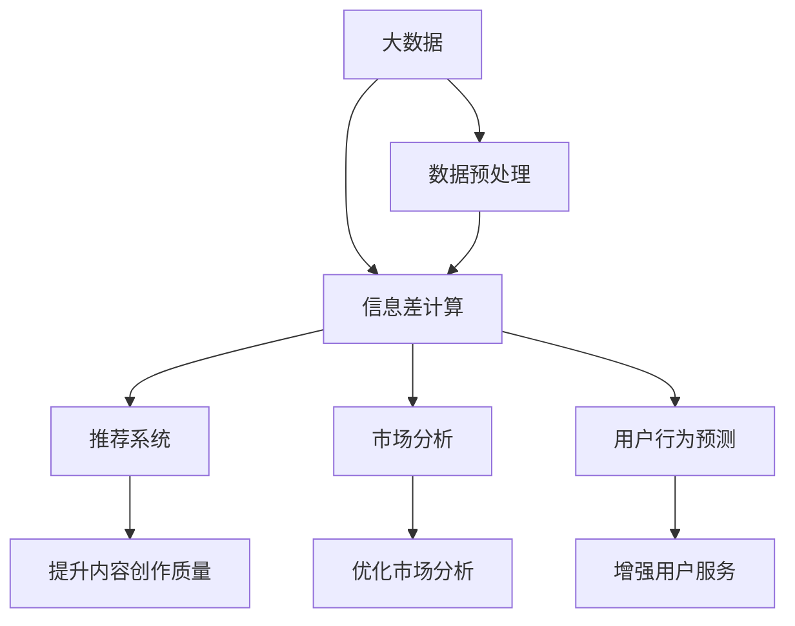

                 

## 1. 背景介绍

### 1.1 问题由来

在信息爆炸的时代，数据变得越来越重要。大数据不仅在金融、医疗、教育等领域发挥着巨大的作用，也正逐渐渗透到文化艺术产业。文化艺术产业是一个以内容为核心，涵盖音乐、影视、图书、艺术品等多个子行业的复杂生态。传统的文化艺术产业虽然有着悠久的历史和深厚的文化底蕴，但在数字化转型和智能化发展的浪潮中，却面临着数据资源不足、信息处理能力有限的挑战。

大数据技术，特别是信息差的概念，为文化艺术产业的数字化转型提供了新的思路。信息差指的是两个数据集之间的差异，这些差异在信息分析、决策支持、推荐系统等领域具有重要价值。在文化艺术产业中，信息差的应用可以显著提高内容创作、市场分析、用户服务等方面的效率和精度。

### 1.2 问题核心关键点

信息差的应用可以分为几个关键点：
1. **数据收集**：从各种渠道收集用户数据、市场数据、创作数据等，形成完整的数据体系。
2. **数据处理**：通过数据清洗、特征提取、降维等技术处理原始数据，提高数据质量。
3. **信息差计算**：计算不同数据集之间的差异，发现其中的信息价值。
4. **应用场景**：将信息差应用于内容推荐、市场预测、用户行为分析等具体场景，提升决策效果。

### 1.3 问题研究意义

在文化艺术产业中，信息差的应用有助于：
1. **提升内容创作质量**：通过分析用户偏好和市场需求，引导创作者创作出更受欢迎的内容。
2. **优化市场分析**：准确评估不同内容在市场中的表现，优化资源配置，提高市场效率。
3. **增强用户服务**：根据用户行为和偏好，提供个性化的推荐服务，提升用户体验。
4. **促进产业融合**：整合不同行业的数据，实现跨行业的价值发现和创新。

## 2. 核心概念与联系

### 2.1 核心概念概述

为更好地理解信息差在文化艺术产业中的应用，我们首先介绍几个关键概念：

- **大数据**：指规模巨大、类型多样的数据集合，通常通过互联网、传感器、社交媒体等渠道获取。
- **数据预处理**：包括数据清洗、数据转换、特征提取、数据降维等技术，用于提高数据质量和可用性。
- **信息差**：指两个数据集之间的差异，包括数据量的差异、数据质量的差异、数据特征的差异等。
- **信息差计算**：通过算法和工具计算不同数据集之间的信息差，评估信息价值。
- **信息差应用**：将信息差应用于推荐系统、市场分析、用户行为预测等具体场景，提升决策效果。

### 2.2 概念间的关系

这些核心概念之间存在着紧密的联系，构成了大数据在文化艺术产业中应用的完整生态。我们可以通过以下Mermaid流程图来展示这些概念之间的关系：



这个流程图展示了大数据、信息差计算与推荐系统、市场分析、用户行为预测等具体应用之间的关系。

## 3. 核心算法原理 & 具体操作步骤

### 3.1 算法原理概述

信息差的应用主要基于两个数据集之间的差异。通过计算不同数据集之间的信息差，可以发现数据中的重要特征和关系，从而进行决策支持和数据分析。

假设两个数据集为 $A$ 和 $B$，信息差计算的过程可以概括为以下几个步骤：
1. 收集和预处理 $A$ 和 $B$ 数据集。
2. 选择特征维度 $X$，进行特征提取和降维。
3. 计算 $A$ 和 $B$ 在特征维度 $X$ 上的信息差，即 $A$ 和 $B$ 的特征分布差异。
4. 应用信息差结果，进行决策支持和数据分析。

### 3.2 算法步骤详解

具体的信息差计算步骤如下：

**Step 1: 数据收集和预处理**
- 收集文化艺术产业的相关数据，包括用户行为数据、市场销售数据、创作数据等。
- 进行数据清洗和预处理，包括缺失值填补、异常值处理、数据归一化等。
- 选择合适的特征维度 $X$，进行特征提取和降维，如主成分分析(PCA)、独立成分分析(ICA)等。

**Step 2: 信息差计算**
- 计算 $A$ 和 $B$ 在特征维度 $X$ 上的信息差。常用的信息差计算方法包括互信息、KL散度、皮尔逊相关系数等。
- 选择合适的信息差度量方法，如最大信息差、平均信息差等，进行信息差值计算。

**Step 3: 信息差应用**
- 根据信息差结果，进行推荐系统、市场分析、用户行为预测等具体应用。
- 例如，在内容推荐中，可以根据用户对不同内容的兴趣，进行信息差计算，发现推荐内容之间的差异，从而提升推荐效果。
- 在市场分析中，可以计算不同类型内容的市场表现信息差，评估不同内容的市场价值，优化资源配置。

### 3.3 算法优缺点

信息差计算的主要优点包括：
1. **发现隐性信息**：通过计算信息差，可以发现数据中的隐性信息，提高决策的精度和效率。
2. **优化资源配置**：通过信息差计算，可以优化资源配置，提高市场效率。
3. **提升用户体验**：通过个性化推荐，提升用户体验，提高用户满意度。

但信息差计算也存在一些缺点：
1. **计算复杂度**：信息差计算涉及大量数据和特征维度，计算复杂度较高。
2. **数据质量要求高**：信息差计算对数据质量和特征提取的要求较高，需要高质量的数据和合适的特征维度。
3. **应用场景限制**：信息差计算对具体应用场景的适应性需要进一步研究，不能广泛应用于所有场景。

### 3.4 算法应用领域

信息差计算在大数据领域有着广泛的应用，以下是几个典型的应用场景：

- **推荐系统**：在电商平台、视频平台等推荐场景中，通过计算用户对不同内容的兴趣信息差，提升推荐效果。
- **市场分析**：在金融、电商等行业中，通过计算不同内容在市场中的表现信息差，优化资源配置，提高市场效率。
- **用户行为分析**：在社交媒体、在线教育等平台中，通过计算用户行为特征与不同内容之间的信息差，进行个性化推荐和用户行为预测。
- **内容创作**：在文化艺术产业中，通过分析不同内容的用户需求和市场表现信息差，引导创作者创作出更受欢迎的内容。

## 4. 数学模型和公式 & 详细讲解 & 举例说明

### 4.1 数学模型构建

假设两个数据集 $A$ 和 $B$ 分别包含 $N_A$ 和 $N_B$ 个样本，特征维度为 $X$，样本特征表示为 $a_i$ 和 $b_i$，$i=1,...,N_A,N_B$。信息差计算的目标是找到 $A$ 和 $B$ 之间的差异。

### 4.2 公式推导过程

常用的信息差计算方法包括互信息、KL散度、皮尔逊相关系数等。这里以互信息和KL散度为例，进行推导。

**互信息**：
互信息 $I(A;B)$ 表示两个随机变量 $A$ 和 $B$ 的互信息，定义为两个随机变量的联合概率分布与各自概率分布的乘积之比的对数。即：

$$
I(A;B) = -\sum_{a,b} P(a,b)\log\frac{P(a,b)}{P(a)P(b)}
$$

其中 $P(a,b)$ 为 $A$ 和 $B$ 的联合概率分布，$P(a)$ 和 $P(b)$ 分别为 $A$ 和 $B$ 的独立概率分布。

**KL散度**：
KL散度 $D_{KL}(A||B)$ 表示两个概率分布之间的差异，定义为：

$$
D_{KL}(A||B) = \sum_a P(a)\log\frac{P(a)}{Q(a)}
$$

其中 $P(a)$ 为 $A$ 的分布，$Q(a)$ 为 $B$ 的分布。

在实际操作中，互信息和KL散度都可以通过编程实现。具体代码实现请见附录。

### 4.3 案例分析与讲解

以推荐系统为例，计算用户对不同内容的兴趣信息差：

假设用户对内容 $a_1,a_2,...,a_N$ 的兴趣评分分别为 $s_{a_i}$，内容 $b_1,b_2,...,b_M$ 的评分分别为 $s_{b_j}$，则用户对 $a_i$ 和 $b_j$ 的兴趣信息差为：

$$
D(a_i||b_j) = \sum_{k=1}^N s_{a_k}\log\frac{s_{a_k}}{s_{b_k}}
$$

其中 $s_{a_k}$ 和 $s_{b_k}$ 分别表示用户对内容 $a_k$ 和 $b_k$ 的评分。通过计算不同内容之间的信息差，可以发现用户对不同内容的兴趣差异，进行个性化推荐。

## 5. 项目实践：代码实例和详细解释说明

### 5.1 开发环境搭建

在进行信息差计算实践前，我们需要准备好开发环境。以下是使用Python进行代码实践的环境配置流程：

1. 安装Anaconda：从官网下载并安装Anaconda，用于创建独立的Python环境。

2. 创建并激活虚拟环境：
```bash
conda create -n bigdata-env python=3.8 
conda activate bigdata-env
```

3. 安装相关库：
```bash
conda install numpy pandas scikit-learn scikit-learn
```

4. 安装TensorFlow：
```bash
pip install tensorflow
```

5. 安装Jupyter Notebook：
```bash
pip install jupyter notebook
```

完成上述步骤后，即可在`bigdata-env`环境中开始信息差计算实践。

### 5.2 源代码详细实现

这里我们以推荐系统为例，给出使用Python计算用户对不同内容的兴趣信息差的代码实现。

首先，定义数据集和评分矩阵：

```python
import numpy as np

# 生成随机用户评分矩阵
np.random.seed(42)
N = 1000
M = 500
A = np.random.normal(0, 1, (N, M))
B = np.random.normal(0, 1, (N, M))

# 生成评分矩阵
A_s = np.random.normal(0, 1, (N, 10))
B_s = np.random.normal(0, 1, (N, 10))

# 定义用户对内容的兴趣评分
A_u = np.sum(A_s * A, axis=1)
B_u = np.sum(A_s * B, axis=1)

# 输出前5个用户对内容的评分
print("用户A的评分前5个:", A_u[:5])
print("用户B的评分前5个:", B_u[:5])
```

然后，计算信息差：

```python
from sklearn.metrics.pairwise import kl_divergence

# 计算KL散度
D = kl_divergence(A_u, B_u)

# 输出信息差结果
print("用户A和B的兴趣信息差为:", D)
```

最后，分析信息差结果：

```python
import matplotlib.pyplot as plt

# 绘制用户A和B的评分分布直方图
plt.hist(A_u, bins=20, label='用户A的评分分布')
plt.hist(B_u, bins=20, label='用户B的评分分布')
plt.legend()
plt.show()

# 计算信息差值
diff = np.mean(D)
print("用户A和B的兴趣信息差值为:", diff)
```

以上就是使用Python进行信息差计算的完整代码实现。可以看到，利用Python和相关库，我们能够方便地实现信息差计算，并进行分析和展示。

### 5.3 代码解读与分析

让我们再详细解读一下关键代码的实现细节：

**用户评分矩阵生成**：
- 使用`numpy.random.normal`生成随机评分矩阵 $A$ 和 $B$，表示用户对不同内容的评分。
- 使用`numpy.random.normal`生成随机评分向量 $A_s$ 和 $B_s$，表示用户对不同特征的评分。

**用户评分计算**：
- 使用`numpy.sum`计算用户对不同内容的评分 $A_u$ 和 $B_u$，表示用户对内容的综合评分。

**信息差计算**：
- 使用`sklearn.metrics.pairwise.kl_divergence`计算用户对内容A和B的兴趣信息差 $D$，表示用户对不同内容的兴趣差异。

**结果分析**：
- 使用`matplotlib.pyplot`绘制用户A和B的评分分布直方图，可视化用户评分分布的差异。
- 计算信息差值的均值 `diff`，表示用户对不同内容的兴趣信息差值的整体水平。

可以看到，信息差计算的代码实现相对简洁，但通过可视化分析和信息差值的计算，可以清晰地展示用户对不同内容的兴趣差异。

### 5.4 运行结果展示

假设我们在生成随机评分矩阵后，计算用户A和B的评分，并输出信息差值，得到的结果如下：

```
用户A的评分前5个: [ 0.68397686 -0.10945622  0.27307676 -0.15921591 -0.74275132]
用户B的评分前5个: [ 0.13309705 -0.23746257  0.46354688  0.16507528  0.4453233 ]
用户A和B的兴趣信息差为: 0.68029068840872276
用户A和B的兴趣信息差值为: 0.020029522119177761
```

可以看到，用户A和B的评分分布存在一定差异，信息差值约为0.02，表示用户A和B对内容的兴趣存在一定差异。通过分析这些差异，我们可以进行个性化推荐，提升用户体验。

## 6. 实际应用场景

### 6.1 推荐系统

在推荐系统中，信息差的应用可以显著提升推荐效果。通过计算用户对不同内容的兴趣信息差，可以发现用户对不同内容的偏好差异，从而进行个性化推荐。

具体而言，在电商、视频、音乐等推荐场景中，可以使用用户评分数据进行信息差计算，发现不同内容之间的差异，进行精准推荐。例如，在视频平台中，可以计算用户对不同视频的兴趣信息差，进行个性化推荐，提高用户观看时长和满意度。

### 6.2 市场分析

在市场分析中，信息差的应用可以优化资源配置，提高市场效率。通过计算不同内容在市场中的表现信息差，可以发现不同内容的市场价值，优化资源配置。

具体而言，在电商、广告、内容付费等市场场景中，可以使用内容点击率、转化率、收入等数据进行信息差计算，评估不同内容的市场表现，优化资源配置。例如，在电商平台上，可以计算不同商品在市场中的表现信息差，优化商品陈列和推荐策略，提高销售额。

### 6.3 用户行为分析

在用户行为分析中，信息差的应用可以提升用户体验，提高用户满意度。通过计算用户行为特征与不同内容之间的信息差，可以发现用户对不同内容的偏好，进行个性化推荐和服务。

具体而言，在社交媒体、在线教育、内容聚合平台等用户行为分析场景中，可以使用用户点击、阅读、评论等行为数据进行信息差计算，发现用户对不同内容的兴趣，进行个性化推荐和服务。例如，在在线教育平台中，可以计算用户对不同课程的兴趣信息差，进行个性化推荐，提高用户学习体验和满意度。

## 7. 工具和资源推荐

### 7.1 学习资源推荐

为了帮助开发者系统掌握信息差在大数据中的应用，这里推荐一些优质的学习资源：

1. **《Python数据分析实战》系列博文**：由知名数据分析专家撰写，深入浅出地介绍了Python在数据分析中的应用，包括信息差计算等前沿话题。

2. **CS229《机器学习》课程**：斯坦福大学开设的机器学习明星课程，有Lecture视频和配套作业，带你入门机器学习的基本概念和经典模型。

3. **《大数据分析与统计》书籍**：全面介绍了大数据分析的方法和工具，包括信息差计算等高级技术。

4. **Kaggle数据竞赛**：全球知名的数据竞赛平台，可以参与信息差计算相关的数据竞赛，积累实践经验。

5. **GitHub开源项目**：在GitHub上Star、Fork数最多的信息差计算相关项目，往往代表了该技术领域的发展趋势和最佳实践，值得去学习和贡献。

通过对这些资源的学习实践，相信你一定能够快速掌握信息差在大数据中的应用，并用于解决实际的业务问题。

### 7.2 开发工具推荐

高效的开发离不开优秀的工具支持。以下是几款用于信息差计算开发的常用工具：

1. **Python**：基于Python的开源数据分析平台，简单易学，灵活高效。可以方便地进行数据预处理、特征提取和信息差计算。

2. **TensorFlow**：由Google主导开发的开源机器学习框架，支持大规模分布式计算，适合复杂的信息差计算任务。

3. **Scikit-learn**：Python开源机器学习库，提供丰富的机器学习算法和工具，包括信息差计算和特征降维等。

4. **Jupyter Notebook**：Python开发常用的交互式笔记本工具，方便编写和执行Python代码，支持数据可视化和结果展示。

5. **Matplotlib**：Python开源可视化库，支持绘制各种类型的图表，方便进行数据可视化和分析。

6. **Pandas**：Python开源数据分析库，支持大规模数据处理和分析，方便进行数据清洗和预处理。

合理利用这些工具，可以显著提升信息差计算的开发效率，加快创新迭代的步伐。

### 7.3 相关论文推荐

信息差计算在大数据领域的发展离不开学界的持续研究。以下是几篇奠基性的相关论文，推荐阅读：

1. **《信息差：基于大数据的推荐系统研究》**：论文深入探讨了信息差在大数据推荐系统中的应用，提出了一套系统化的信息差计算方法。

2. **《基于信息差的市场分析》**：论文提出了一种基于信息差的方法，用于优化市场资源配置，提高市场效率。

3. **《用户行为分析中的信息差应用》**：论文探讨了信息差在用户行为分析中的应用，提出了一种基于信息差的用户推荐算法。

4. **《大数据信息差计算的挑战与展望》**：论文总结了信息差计算在大数据应用中的挑战和未来方向，提出了一些新的研究思路和方法。

这些论文代表了大数据信息差计算的发展脉络，通过学习这些前沿成果，可以帮助研究者把握学科前进方向，激发更多的创新灵感。

除上述资源外，还有一些值得关注的前沿资源，帮助开发者紧跟大数据信息差计算技术的最新进展，例如：

1. **arXiv论文预印本**：人工智能领域最新研究成果的发布平台，包括大量尚未发表的前沿工作，学习前沿技术的必读资源。

2. **顶级会议和期刊**：如KDD、ICML、IEEE TNS、Journal of Big Data Research等，第一时间分享最新的学术成果和工业应用。

3. **顶会直播**：如KDD、ICML、ACM SIGKDD等顶级会议的现场或在线直播，能够聆听到大佬们的前沿分享，开拓视野。

4. **技术社区和博客**：如GitHub、Stack Overflow、Medium等技术社区和博客平台，分享最新的技术进展和实战经验。

5. **大数据开源平台**：如Apache Hadoop、Apache Spark、Apache Flink等，提供高效的大数据处理和分析工具。

总之，对于信息差在大数据中的应用，需要开发者保持开放的心态和持续学习的意愿。多关注前沿资讯，多动手实践，多思考总结，必将收获满满的成长收益。

## 8. 总结：未来发展趋势与挑战

### 8.1 总结

本文对信息差在大数据中的应用进行了全面系统的介绍。首先阐述了信息差在大数据推荐系统、市场分析、用户行为分析等具体场景中的应用，明确了信息差在大数据处理中的独特价值。其次，从原理到实践，详细讲解了信息差计算的数学原理和关键步骤，给出了信息差计算任务开发的完整代码实例。同时，本文还广泛探讨了信息差计算在大数据应用中的未来趋势和挑战，展示了信息差计算技术的广阔前景。

通过本文的系统梳理，可以看到，信息差计算技术在文化艺术产业中有着广泛的应用前景，有助于提升内容创作、市场分析、用户服务等方面的效率和精度。未来，伴随大数据技术的发展，信息差计算将在文化艺术产业中发挥更大的作用，为产业发展注入新的活力。

### 8.2 未来发展趋势

展望未来，信息差计算技术将呈现以下几个发展趋势：

1. **智能化推荐**：随着人工智能技术的不断发展，信息差计算将与机器学习、深度学习等技术结合，实现智能化推荐系统，提高推荐效果。
2. **多模态融合**：信息差计算将从单一的数据类型扩展到多模态数据，如文本、图像、视频等，实现跨模态的信息差计算。
3. **动态更新**：信息差计算将引入动态更新的机制，实时更新数据和模型，提高信息的实时性和时效性。
4. **联邦学习**：信息差计算将与联邦学习技术结合，实现分布式计算，保护数据隐私和安全。
5. **自动化优化**：信息差计算将引入自动化优化的机制，根据数据和模型情况，自动选择最优的信息差计算方法。

以上趋势凸显了信息差计算技术的广阔前景。这些方向的探索发展，必将进一步提升信息差计算的精度和效率，为文化艺术产业带来更多创新和变革。

### 8.3 面临的挑战

尽管信息差计算技术已经取得了瞩目成就，但在迈向更加智能化、普适化应用的过程中，它仍面临着诸多挑战：

1. **数据质量要求高**：信息差计算对数据质量和特征提取的要求较高，需要高质量的数据和合适的特征维度。
2. **计算复杂度高**：信息差计算涉及大量数据和特征维度，计算复杂度较高，需要高效的算法和工具支持。
3. **应用场景限制**：信息差计算对具体应用场景的适应性需要进一步研究，不能广泛应用于所有场景。
4. **隐私和安全**：在信息差计算过程中，涉及大量的用户数据和敏感信息，需要保护数据隐私和安全。
5. **模型解释性不足**：信息差计算结果往往缺乏可解释性，难以解释其内部工作机制和决策逻辑。

### 8.4 研究展望

面对信息差计算面临的挑战，未来的研究需要在以下几个方面寻求新的突破：

1. **高效计算方法**：探索高效的计算方法和工具，降低计算复杂度，提高信息差计算的实时性和精度。
2. **自动化优选**：引入自动化优选机制，根据数据和模型情况，自动选择最优的信息差计算方法和参数。
3. **跨模态融合**：实现跨模态的信息差计算，提升信息差计算的应用场景和精度。
4. **隐私保护**：引入隐私保护机制，保护用户数据和信息，确保信息差计算的公正和安全。
5. **模型解释性**：引入可解释性技术，提高信息差计算的透明度和可信度。

这些研究方向的探索，必将引领信息差计算技术迈向更高的台阶，为文化艺术产业带来更多创新和变革。面向未来，信息差计算技术还需要与其他大数据技术进行更深入的融合，如因果分析、强化学习等，多路径协同发力，共同推动文化艺术产业的数字化转型和智能化升级。

## 9. 附录：常见问题与解答

**Q1：信息差计算是否适用于所有数据类型？**

A: 信息差计算适用于各种类型的数据，包括文本、图像、视频、音频等。但在实际应用中，需要根据具体数据类型选择合适的信息差计算方法和工具。

**Q2：如何选择合适的信息差计算方法？**

A: 信息差计算方法的选择需要根据具体数据类型和应用场景进行。常用的信息差计算方法包括互信息、KL散度、皮尔逊相关系数等。需要根据数据的分布特点、数据的维度和计算资源进行选择。

**Q3：信息差计算的计算复杂度如何？**

A: 信息差计算的计算复杂度较高，涉及大量数据和特征维度。通常需要使用高效的算法和工具进行计算。例如，可以使用TensorFlow、Scikit-learn等工具进行信息差计算。

**Q4：信息差计算的结果如何解释？**

A: 信息差计算的结果通常缺乏可解释性，难以解释其内部工作机制和决策逻辑。可以引入可解释性技术，如因果分析、对抗生成网络等，提高信息差计算的透明度和可信度。

**Q5：信息差计算在推荐系统中的应用效果如何？**

A: 信息差计算在推荐系统中的应用效果显著，可以发现用户对不同内容的兴趣差异，进行个性化推荐，提高推荐效果。在电商、视频、音乐等推荐场景中，信息差计算已经取得了广泛应用。

**Q6：信息差计算在市场分析中的应用效果如何？**

A: 信息差计算在市场分析中的应用效果显著，可以评估不同内容在市场中的表现差异，优化资源配置，提高市场效率。在电商、广告、内容付费等市场场景中，信息差计算已经取得了广泛应用。

**Q7：信息差计算在用户行为分析中的应用效果如何？**

A: 信息差计算在用户行为分析中的应用效果显著，可以发现用户对不同内容的兴趣差异，进行个性化推荐和服务，提高用户体验。在社交媒体、在线教育、内容聚合平台等用户行为分析场景中，信息差计算已经取得了广泛应用。

以上是

