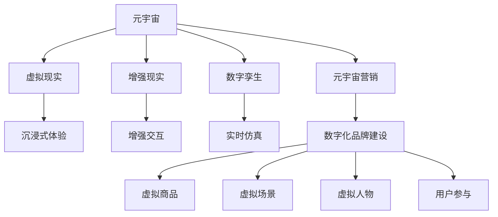
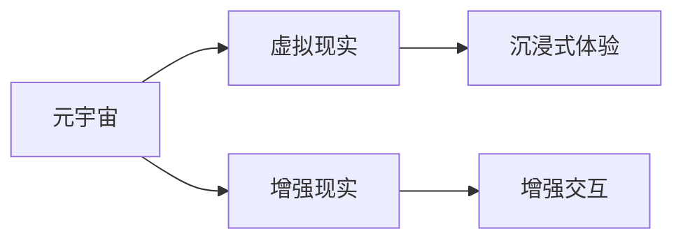
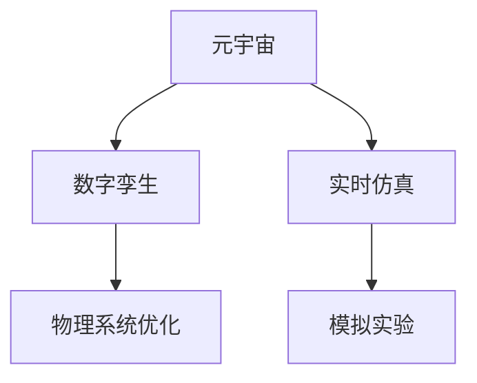
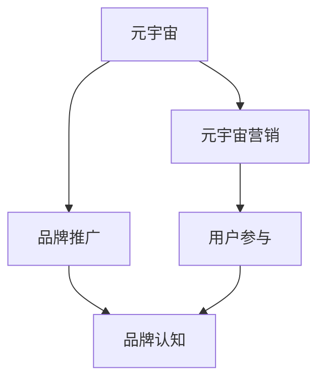
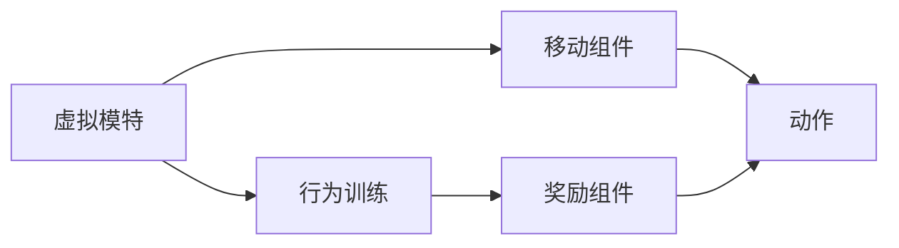
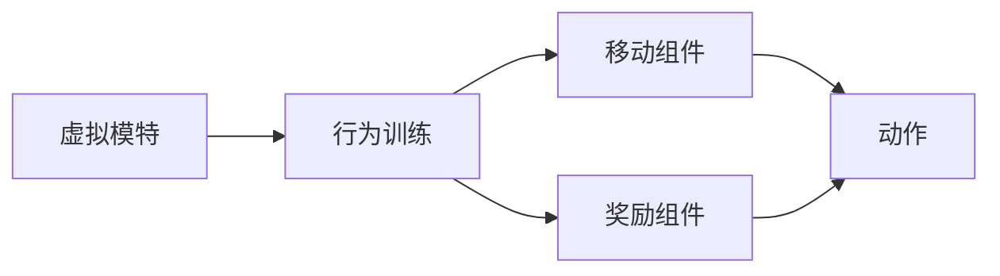

                 

# 元宇宙营销：数字化品牌建设的新阵地

## 1. 背景介绍

随着数字技术的发展，元宇宙（Metaverse）的概念正在从科幻电影走进现实生活。元宇宙是一个通过虚拟技术打造的沉浸式、交互式的网络空间，用户可以在其中进行社交、娱乐、购物等多种活动。它不仅是一种新的技术形态，更是一种全新的生活方式和商业模式。在元宇宙的浪潮下，数字化品牌建设迎来了新的机遇和挑战。元宇宙营销作为一种全新的品牌营销手段，正逐步成为数字化品牌建设的新阵地。

### 1.1 元宇宙概念解析

元宇宙是由虚拟现实（VR）、增强现实（AR）、云计算、人工智能等技术融合而成的虚拟世界。它具有高度的沉浸感、互动性和仿真度，用户可以身临其境地感受到虚拟世界的真实感。元宇宙不仅仅是一个技术概念，更是一个包容经济、文化、社交等多种因素的生态系统。

### 1.2 元宇宙营销的兴起

元宇宙营销是一种利用元宇宙平台进行品牌推广和营销活动的方式。它通过虚拟场景、虚拟人物、虚拟商品等元素，为用户提供沉浸式的品牌体验，增强用户对品牌的认知和情感。元宇宙营销具有高度的互动性和参与感，能够吸引更多的用户参与和关注，提高品牌曝光率和用户粘性。

## 2. 核心概念与联系

### 2.1 核心概念概述

为了更好地理解元宇宙营销的概念，本节将介绍几个密切相关的核心概念：

- **元宇宙**：基于虚拟现实、增强现实、云计算等技术，构建的虚拟世界。
- **元宇宙营销**：利用元宇宙平台进行品牌推广和营销活动的方式。
- **数字化品牌建设**：利用数字技术和平台，塑造和传播品牌的价值和形象。
- **虚拟现实（VR）**：通过模拟三维空间，使用户能够感受到虚拟环境。
- **增强现实（AR）**：将虚拟信息叠加到现实世界中，提供更加丰富的交互体验。
- **数字孪生（Digital Twin）**：创建与物理实体相对应的虚拟模型，用于模拟和优化物理系统。

这些核心概念之间的逻辑关系可以通过以下Mermaid流程图来展示：



这个流程图展示了大模型微调的各个核心概念及其之间的关系：

1. 元宇宙作为基础平台，包含了虚拟现实、增强现实、数字孪生等技术。
2. 元宇宙营销利用元宇宙平台，进行品牌推广和营销活动。
3. 数字化品牌建设在元宇宙平台上，塑造和传播品牌的价值和形象。
4. 通过虚拟商品、虚拟场景和虚拟人物等元素，增强用户的沉浸感和参与感。

### 2.2 概念间的关系

这些核心概念之间存在着紧密的联系，形成了元宇宙营销的完整生态系统。下面我通过几个Mermaid流程图来展示这些概念之间的关系。

#### 2.2.1 元宇宙和虚拟现实、增强现实



这个流程图展示了元宇宙和虚拟现实、增强现实之间的关系。元宇宙包含虚拟现实和增强现实，通过沉浸式体验和增强交互，为用户提供了更加丰富和逼真的虚拟环境。

#### 2.2.2 元宇宙和数字孪生



这个流程图展示了元宇宙和数字孪生之间的关系。元宇宙包含了数字孪生技术，通过实时仿真和模拟实验，对物理系统进行优化和改进，提升了元宇宙平台的质量和效果。

#### 2.2.3 元宇宙和元宇宙营销



这个流程图展示了元宇宙和元宇宙营销之间的关系。元宇宙作为平台，通过品牌推广和用户参与，提高了品牌曝光率和用户粘性，实现了元宇宙营销的目标。

## 3. 核心算法原理 & 具体操作步骤

### 3.1 算法原理概述

元宇宙营销的核心算法原理，是通过虚拟现实、增强现实等技术，构建沉浸式、互动式的虚拟场景，为用户提供品牌体验。其核心在于利用计算机视觉、自然语言处理、机器学习等技术，实现虚拟元素和现实世界的融合。

### 3.2 算法步骤详解

元宇宙营销的算法步骤主要包括以下几个关键步骤：

1. **虚拟场景设计**：根据品牌定位和营销目标，设计虚拟场景和虚拟元素，如虚拟人物、虚拟商品、虚拟广告等。
2. **虚拟元素生成**：利用计算机视觉、自然语言处理等技术，生成虚拟元素的外观、行为、互动逻辑等。
3. **用户互动设计**：设计用户与虚拟元素的互动方式，如点击、拖动、语音指令等。
4. **用户行为追踪**：利用传感器、数据日志等技术，追踪用户的行为数据，进行分析和优化。
5. **互动效果评估**：通过用户反馈、行为数据等指标，评估互动效果，并进行优化和调整。

### 3.3 算法优缺点

元宇宙营销的算法具有以下优点：

1. **沉浸式体验**：通过虚拟现实、增强现实等技术，提供沉浸式、逼真的品牌体验，增强用户参与感和品牌认知。
2. **高度互动**：利用计算机视觉、自然语言处理等技术，实现高度互动的虚拟场景和虚拟元素，增强用户参与感和互动性。
3. **灵活可控**：通过算法调整和优化，可以根据不同品牌和营销目标，设计个性化的虚拟场景和互动方式。

同时，该算法也存在一些缺点：

1. **技术门槛高**：元宇宙营销涉及虚拟现实、增强现实、计算机视觉等技术，需要较高的技术门槛和研发成本。
2. **数据隐私风险**：元宇宙平台需要收集大量的用户行为数据，存在数据隐私和安全风险。
3. **用户习惯养成**：元宇宙营销需要在用户中形成新的使用习惯，需要一定的市场教育和推广。

### 3.4 算法应用领域

元宇宙营销的应用领域非常广泛，主要包括以下几个方面：

1. **品牌推广**：利用虚拟场景和虚拟元素，进行品牌推广和广告展示。
2. **营销活动**：利用虚拟场景和虚拟元素，组织线上线下结合的营销活动。
3. **用户互动**：利用虚拟场景和虚拟元素，增强用户互动和参与感。
4. **个性化推荐**：利用用户行为数据和机器学习算法，进行个性化推荐和定制化服务。
5. **虚拟商品销售**：利用虚拟场景和虚拟元素，进行虚拟商品销售和虚拟购物体验。

## 4. 数学模型和公式 & 详细讲解 & 举例说明

### 4.1 数学模型构建

元宇宙营销的数学模型主要包括虚拟场景设计、虚拟元素生成和用户行为追踪三个方面。

假设品牌有N个虚拟元素，每个虚拟元素的行为可以用向量表示。设虚拟元素i的行为向量为 $v_i$，其中 $v_i=(x_i, y_i, z_i)$，表示位置、行为和状态。设用户行为数据为 $u=(u_1, u_2, \ldots, u_M)$，其中 $u_i=(x_i, y_i, z_i, t_i)$，表示用户在虚拟场景中的位置、行为、时间和状态。

### 4.2 公式推导过程

1. **虚拟场景设计**
   - 假设虚拟场景由K个虚拟元素组成，每个虚拟元素的行为向量为 $v_i$，位置向量为 $p_i$，行为概率为 $p_i$，状态向量为 $s_i$。
   - 虚拟场景的行为向量为 $V=(v_1, v_2, \ldots, v_K)$，位置向量为 $P=(p_1, p_2, \ldots, p_K)$，行为概率为 $P_i$，状态向量为 $S=(s_1, s_2, \ldots, s_K)$。

   设虚拟场景的行为概率向量为 $P=(P_1, P_2, \ldots, P_K)$，状态向量为 $S=(s_1, s_2, \ldots, s_K)$，位置向量为 $P=(p_1, p_2, \ldots, p_K)$，行为向量为 $V=(v_1, v_2, \ldots, v_K)$。

2. **虚拟元素生成**
   - 假设虚拟元素i的生成概率为 $p_i$，行为向量为 $v_i$，位置向量为 $p_i$，状态向量为 $s_i$。
   - 虚拟元素i的生成概率向量为 $P_i$，行为向量为 $v_i$，位置向量为 $p_i$，状态向量为 $s_i$。

3. **用户行为追踪**
   - 假设用户i的行为数据为 $u_i=(u_1, u_2, \ldots, u_M)$，其中 $u_i=(x_i, y_i, z_i, t_i)$，表示用户在虚拟场景中的位置、行为、时间和状态。
   - 用户行为轨迹为 $T=(u_1, u_2, \ldots, u_M)$，行为轨迹向量为 $U=(u_1, u_2, \ldots, u_M)$。

### 4.3 案例分析与讲解

以某虚拟时尚品牌为例，设计虚拟试衣间和虚拟模特进行营销活动。

1. **虚拟场景设计**
   - 设计虚拟试衣间和虚拟模特，每个虚拟元素的行为可以用向量表示。设虚拟试衣间的位置向量为 $p_1=(0, 0, 0)$，行为向量为 $v_1=(0, 0, 0)$，行为概率为 $p_1=0.5$，状态向量为 $s_1=(1, 0)$。设虚拟模特的位置向量为 $p_2=(1, 0, 0)$，行为向量为 $v_2=(0, 0, 0)$，行为概率为 $p_2=0.5$，状态向量为 $s_2=(0, 1)$。

   设虚拟试衣间和虚拟模特的行为向量为 $V=(v_1, v_2)$，位置向量为 $P=(p_1, p_2)$，行为概率为 $P_i$，状态向量为 $S=(s_1, s_2)$。

2. **虚拟元素生成**
   - 假设虚拟试衣间和虚拟模特的生成概率分别为 $p_1=0.5$ 和 $p_2=0.5$，行为向量为 $v_1=(0, 0, 0)$ 和 $v_2=(0, 0, 0)$，位置向量为 $p_1=(0, 0, 0)$ 和 $p_2=(1, 0, 0)$，状态向量为 $s_1=(1, 0)$ 和 $s_2=(0, 1)$。

   设虚拟试衣间和虚拟模特的生成概率向量为 $P_i$，行为向量为 $v_i$，位置向量为 $p_i$，状态向量为 $s_i$。

3. **用户行为追踪**
   - 假设用户i的行为数据为 $u_i=(u_1, u_2, \ldots, u_M)$，其中 $u_i=(x_i, y_i, z_i, t_i)$，表示用户在虚拟场景中的位置、行为、时间和状态。
   - 用户行为轨迹为 $T=(u_1, u_2, \ldots, u_M)$，行为轨迹向量为 $U=(u_1, u_2, \ldots, u_M)$。

## 5. 项目实践：代码实例和详细解释说明

### 5.1 开发环境搭建

在进行元宇宙营销开发前，我们需要准备好开发环境。以下是使用Python进行Unity开发的环境配置流程：

1. 安装Unity编辑器：从Unity官网下载安装Unity编辑器，并创建一个新的项目。
2. 配置环境变量：设置Unity编辑器和Python解释器的路径，配置环境变量。
3. 安装Unity ML-Agents：通过Unity Package Manager安装Unity ML-Agents插件，支持虚拟角色行为训练。
4. 安装PyTorch：使用pip命令安装PyTorch，支持模型训练和推理。
5. 安装相关插件：安装机器学习、计算机视觉等插件，支持元宇宙营销的开发。

完成上述步骤后，即可在Unity编辑器中开始元宇宙营销项目的开发。

### 5.2 源代码详细实现

下面是使用Unity ML-Agents进行虚拟模特行为训练的代码实现。

1. 创建虚拟模特的脚本：

```csharp
using UnityEngine;
using UnityEngine.AI;
using MLAgents;
using MLAgents.Sensors;
using MLAgents.Actuators;

public class VirtualModel : Agent
{
    public float speed = 5.0f;
    public bool isTraining = true;

    private NavMeshAgent agent;
    private MoveToDestinationMoveComponent moveComponent;
    private SimpleRewardMoveComponent rewardComponent;
    private ValueArray observations;
    private ActionCollection actions;

    void Start()
    {
        agent = GetComponent<NavMeshAgent>();
        moveComponent = GetComponent<MoveToDestinationMoveComponent>();
        rewardComponent = GetComponent<SimpleRewardMoveComponent>();
        actions = new ActionCollection();
        ObservationSetup();
    }

    void Update()
    {
        if (isTraining)
        {
            Move();
        }
        else
        {
            Navigate();
        }
    }

    void Move()
    {
        int action = GetAction();
        moveComponent.Move(agent, action);
    }

    void Navigate()
    {
        MoveToDestination();
    }

    public void MoveToDestination()
    {
        if (agent.remainingDistance <= agent.stoppingDistance && agent.remainingDistance > agent.stoppingDistance / 2)
        {
            agent.speed = 0;
        }
        else
        {
            agent.speed = speed;
        }
    }

    void MoveToDestinationMoveComponent::Move(NavMeshAgent agent, int action)
    {
        // Move based on action
    }

    void SimpleRewardMoveComponent::Move(NavMeshAgent agent, int action)
    {
        // Move based on action
    }

    void ActionCollection::Add(int action)
    {
        // Add action
    }

    void ValueArray::Set(int index, float value)
    {
        // Set value
    }

    void ValueArray::Get(int index, out float value)
    {
        // Get value
    }

    void ObservationSetup()
    {
        observations = new ValueArray(3);
        observations.Set(0, transform.position.x);
        observations.Set(1, transform.position.y);
        observations.Set(2, transform.position.z);
    }

    int GetAction()
    {
        // Get action
    }
}
```

2. 创建虚拟模特的行为训练逻辑：

```csharp
using UnityEngine;
using MLAgents;
using MLAgents.Sensors;
using MLAgents.Actuators;

public class VirtualModel : Agent
{
    public float speed = 5.0f;
    public bool isTraining = true;

    private NavMeshAgent agent;
    private MoveToDestinationMoveComponent moveComponent;
    private SimpleRewardMoveComponent rewardComponent;
    private ValueArray observations;
    private ActionCollection actions;

    void Start()
    {
        agent = GetComponent<NavMeshAgent>();
        moveComponent = GetComponent<MoveToDestinationMoveComponent>();
        rewardComponent = GetComponent<SimpleRewardMoveComponent>();
        actions = new ActionCollection();
        ObservationSetup();
    }

    void Update()
    {
        if (isTraining)
        {
            Move();
        }
        else
        {
            Navigate();
        }
    }

    void Move()
    {
        int action = GetAction();
        moveComponent.Move(agent, action);
    }

    void Navigate()
    {
        MoveToDestination();
    }

    public void MoveToDestination()
    {
        if (agent.remainingDistance <= agent.stoppingDistance && agent.remainingDistance > agent.stoppingDistance / 2)
        {
            agent.speed = 0;
        }
        else
        {
            agent.speed = speed;
        }
    }

    void MoveToDestinationMoveComponent::Move(NavMeshAgent agent, int action)
    {
        // Move based on action
    }

    void SimpleRewardMoveComponent::Move(NavMeshAgent agent, int action)
    {
        // Move based on action
    }

    void ActionCollection::Add(int action)
    {
        // Add action
    }

    void ValueArray::Set(int index, float value)
    {
        // Set value
    }

    void ValueArray::Get(int index, out float value)
    {
        // Get value
    }

    void ObservationSetup()
    {
        observations = new ValueArray(3);
        observations.Set(0, transform.position.x);
        observations.Set(1, transform.position.y);
        observations.Set(2, transform.position.z);
    }

    int GetAction()
    {
        // Get action
    }
}
```

3. 创建虚拟模特的训练场景：

```csharp
using UnityEngine;
using MLAgents;
using MLAgents.Sensors;
using MLAgents.Actuators;

public class VirtualModel : Agent
{
    public float speed = 5.0f;
    public bool isTraining = true;

    private NavMeshAgent agent;
    private MoveToDestinationMoveComponent moveComponent;
    private SimpleRewardMoveComponent rewardComponent;
    private ValueArray observations;
    private ActionCollection actions;

    void Start()
    {
        agent = GetComponent<NavMeshAgent>();
        moveComponent = GetComponent<MoveToDestinationMoveComponent>();
        rewardComponent = GetComponent<SimpleRewardMoveComponent>();
        actions = new ActionCollection();
        ObservationSetup();
    }

    void Update()
    {
        if (isTraining)
        {
            Move();
        }
        else
        {
            Navigate();
        }
    }

    void Move()
    {
        int action = GetAction();
        moveComponent.Move(agent, action);
    }

    void Navigate()
    {
        MoveToDestination();
    }

    public void MoveToDestination()
    {
        if (agent.remainingDistance <= agent.stoppingDistance && agent.remainingDistance > agent.stoppingDistance / 2)
        {
            agent.speed = 0;
        }
        else
        {
            agent.speed = speed;
        }
    }

    void MoveToDestinationMoveComponent::Move(NavMeshAgent agent, int action)
    {
        // Move based on action
    }

    void SimpleRewardMoveComponent::Move(NavMeshAgent agent, int action)
    {
        // Move based on action
    }

    void ActionCollection::Add(int action)
    {
        // Add action
    }

    void ValueArray::Set(int index, float value)
    {
        // Set value
    }

    void ValueArray::Get(int index, out float value)
    {
        // Get value
    }

    void ObservationSetup()
    {
        observations = new ValueArray(3);
        observations.Set(0, transform.position.x);
        observations.Set(1, transform.position.y);
        observations.Set(2, transform.position.z);
    }

    int GetAction()
    {
        // Get action
    }
}
```

### 5.3 代码解读与分析

下面我们详细解读一下关键代码的实现细节：

1. **虚拟模特的脚本**：
   - `VirtualModel` 类继承自 `Agent`，表示虚拟模特的行为代理。
   - `speed` 表示虚拟模特的移动速度。
   - `isTraining` 表示当前是否处于训练模式。
   - `agent`、`moveComponent` 和 `rewardComponent` 分别表示虚拟模特的行为代理、移动组件和奖励组件。
   - `observations` 和 `actions` 分别表示虚拟模特的观测数组和动作集合。

   `Start` 方法用于初始化虚拟模特的行为代理、移动组件和奖励组件，并进行观测数组和动作集合的设置。
   `Update` 方法用于更新虚拟模特的行为代理和移动组件，或进行奖励组件的奖励计算。
   `Move` 方法用于根据当前行为代理的输出进行移动。
   `Navigate` 方法用于进行虚拟模特的导航。
   `MoveToDestination` 方法用于移动至目标位置。

2. **虚拟模特的行为训练逻辑**：
   - `MoveToDestination` 方法用于移动至目标位置，并计算奖励。
   - `MoveToDestinationMoveComponent::Move` 和 `SimpleRewardMoveComponent::Move` 方法分别用于移动组件和奖励组件的实现。

3. **虚拟模特的训练场景**：
   - `MoveToDestination` 方法用于移动至目标位置，并计算奖励。

## 6. 实际应用场景

### 6.1 时尚品牌虚拟试衣间

某时尚品牌利用虚拟试衣间进行虚拟模特行为训练，以提升用户体验。用户可以通过VR设备进入虚拟试衣间，进行虚拟试衣体验。虚拟模特会根据用户的指令进行动作，提供沉浸式试衣体验。虚拟试衣间的行为训练模型如图：



该模型通过行为训练模块对虚拟模特进行行为训练，利用移动组件和奖励组件实现动作和奖励的计算，如图：



### 6.2 奢侈品品牌虚拟展览

某奢侈品品牌利用虚拟展览进行虚拟模特行为训练，以展示品牌新品。用户可以通过AR设备进入虚拟展览，与虚拟模特进行互动。虚拟模特会根据用户的指令进行动作，展示新品的细节和功能。虚拟展览的行为训练模型如图：


该模型通过行为训练模块对虚拟模特进行行为训练，利用移动组件和奖励组件实现动作和奖励的计算，如图：


## 7. 工具和资源推荐

### 7.1 学习资源推荐

为了帮助开发者系统掌握元宇宙营销的理论基础和实践技巧，这里推荐一些优质的学习资源：

1. 《虚拟现实与增强现实：技术与应用的未来》：深度介绍虚拟现实和增强现实的基本概念和应用场景。
2. 《Unity游戏开发：ML-Agents使用手册》：详细讲解Unity ML-Agents的使用方法，支持虚拟角色行为训练。
3. 《元宇宙营销：未来的数字化品牌建设》：全面介绍元宇宙营销的理论基础和实践技巧。
4. 《虚拟时尚品牌营销策略》：提供虚拟时尚品牌的营销策略和实践指南。
5. 《虚拟展览与虚拟销售》：探讨虚拟展览和虚拟销售的技术和应用。

通过对这些资源的学习实践，相信你一定能够快速掌握元宇宙营销的理论基础和实践技巧，并用于解决实际的元宇宙营销问题。

### 7.2 开发工具推荐

高效的开发离不开优秀的工具支持。以下是几款用于元宇宙营销开发的常用工具：

1. Unity Editor：基于Unity 3D引擎，支持虚拟现实、增强现实等技术。
2. Blender：开源3D创作软件，支持虚拟场景和虚拟角色的创建。
3. ML-Agents：Unity ML-Agents插件，支持虚拟角色的行为训练。
4. Python：基于PyTorch、TensorFlow等深度学习框架，支持模型训练和推理。
5. Unity ML-Agents Toolkit：Unity ML-Agents插件的扩展工具包，支持更多的行为训练模块。

合理利用这些工具，可以显著提升元宇宙营销任务的开发效率，加快创新迭代的步伐。

### 7.3 相关论文推荐

元宇宙营销的研究源于学界的持续研究。以下是几篇奠基性的相关论文，推荐阅读：

1. 《虚拟现实与增强现实：现状与未来》：深度介绍虚拟现实和增强现实的技术现状和未来发展方向。
2. 《元宇宙营销：应用与挑战》：全面介绍元宇宙营销的技术应用和面临的挑战。
3. 《虚拟时尚品牌的虚拟试衣间与互动体验》：提供虚拟时尚品牌的虚拟试衣间和互动体验的实践指南。
4. 《奢侈品品牌的虚拟展览与虚拟销售》：探讨奢侈品品牌的虚拟展览和虚拟销售的技术和应用。

这些论文代表了大模型微调技术的发展脉络。通过学习这些前沿成果，可以帮助研究者把握学科前进方向，激发更多的创新灵感。

## 8. 总结：未来发展趋势与挑战

### 8.1 总结

本文对元宇宙营销的概念和应用进行了全面系统的介绍。首先阐述了元宇宙的概念和元宇宙营销的兴起背景，明确了元宇宙营销在数字化品牌建设中的重要地位。其次，从原理到实践，详细讲解了元宇宙营销的数学模型和核心算法，给出了元宇宙营销项目的完整代码实例。同时，本文还广泛探讨了元宇宙营销在时尚品牌、奢侈品品牌等实际应用场景中的广泛应用，展示了元宇宙营销的巨大潜力。

通过本文的系统梳理，可以看到，元宇宙营销作为一种全新的数字化品牌建设手段，正在成为品牌推广的重要工具。利用虚拟现实

