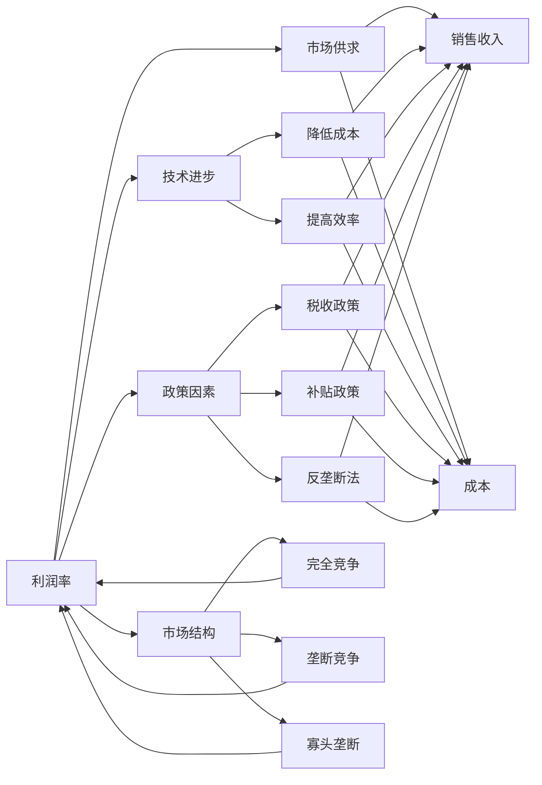
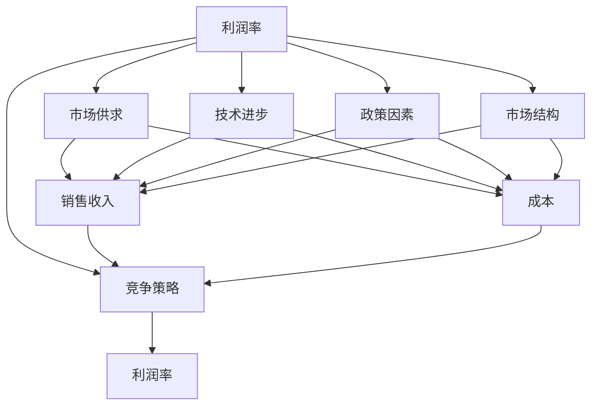

                 

# 利润率无限接近于0：竞争充分后的必然结果

> 关键词：经济模型,市场竞争,利润率,零和游戏,垄断竞争,微观经济学

## 1. 背景介绍

### 1.1 问题由来

近年来，伴随着互联网技术的快速发展和全球化的深入，全球市场竞争格局发生了显著变化。尤其是在信息、消费、娱乐等领域的市场竞争日趋激烈，几乎所有行业都面临重塑和转型。中小企业在激烈的市场竞争中生存举步维艰，而大企业通过规模优势、技术创新、品牌效应等手段，试图持续保持领先地位。然而，这种市场格局的背后，隐藏着一个深层次的经济逻辑：**利润率**。

随着市场竞争的加剧，企业利润率的变动成为经济学研究的核心问题之一。利润率不仅反映企业的盈利能力，还反映了市场竞争的强度和市场的结构。本文章旨在深入探讨利润率在充分竞争市场中的行为特征及其背后的理论基础，以期为市场参与者提供洞察，并为政策制定者提供决策参考。

### 1.2 问题核心关键点

利润率的变动与市场竞争密切相关，可以从以下几个方面进一步阐释这一问题：

- **零和游戏**：在市场竞争中，企业的盈利可能来源于其他企业损失，即市场竞争是一场零和游戏。
- **垄断竞争**：在垄断竞争市场，企业通过创新和品牌差异化获得市场份额，但同时面临来自其他创新企业的竞争。
- **经济模型**：利用微观经济学的理论框架，分析利润率在市场竞争中的动态变化。
- **市场结构**：探究不同市场结构（如完全竞争、垄断竞争、寡头垄断等）对利润率的影响。

### 1.3 问题研究意义

理解利润率在充分竞争市场中的变化规律，对于市场参与者和政策制定者都有着重要意义：

1. **企业决策**：企业需根据利润率的变化趋势，调整经营策略和投资方向，以适应市场变化。
2. **行业监管**：政府监管机构需利用利润率数据，评估市场竞争环境，制定公平竞争的政策。
3. **经济预测**：经济学家利用利润率数据，预测市场趋势和行业发展方向，为宏观调控提供依据。
4. **投资分析**：投资者需理解利润率变化，评估投资项目的回报率及风险水平。
5. **消费者福利**：利润率的变动与产品价格和质量直接相关，影响消费者的最终福利。

通过探讨利润率在充分竞争市场中的行为特征，本文章旨在为相关领域的学者、企业决策者、政策制定者及投资者提供深入的洞见。

## 2. 核心概念与联系

### 2.1 核心概念概述

利润率是一个重要的经济指标，反映了企业在销售商品或提供服务时，每单位销售收入能获得的净利润。其计算公式为：

$$
\text{利润率} = \frac{\text{净利润}}{\text{销售收入}}
$$

其中，净利润是指企业从销售收入中减去成本（包括固定成本和变动成本）后的净收益。

在市场竞争中，利润率的变化受多种因素影响，主要包括：

- **市场供求**：市场供求关系的变化直接影响企业的销售收入和成本。
- **技术进步**：新技术的应用可降低成本、提高效率，从而影响企业的利润率。
- **政策因素**：政府税收政策、补贴政策、反垄断法等对企业利润率有直接影响。
- **市场结构**：不同的市场结构（如完全竞争、垄断竞争、寡头垄断等）对企业利润率的影响不同。

### 2.2 概念间的关系

利润率与市场竞争之间的关系，可以通过以下几个方面来理解：

1. **零和游戏**：在充分竞争的市场中，企业的利润率反映了市场竞争的激烈程度。一个企业的利润率上升，往往意味着其他企业的利润率下降。

2. **垄断竞争**：在垄断竞争的市场中，企业通过产品差异化和品牌策略获得市场份额，但同时面临来自其他创新企业的竞争，利润率的变化反映出市场竞争的动态变化。

3. **经济模型**：利用微观经济学的理论框架，可以分析利润率在市场竞争中的动态变化。例如，在完全竞争市场中，利润率会趋向于零，而在垄断市场中，利润率会高于完全竞争市场。

4. **市场结构**：不同的市场结构对利润率的影响不同。例如，在完全竞争市场中，利润率趋向于零；在垄断市场中，利润率较高；在寡头垄断市场中，利润率受市场份额和产品差异化的影响较大。

这些概念通过以下Mermaid流程图来展示它们之间的关系：



### 2.3 核心概念的整体架构

从整体架构来看，利润率的形成受到市场供求、技术进步、政策因素及市场结构等多方面因素的共同影响。市场供求变化、技术进步及政策因素会改变企业的销售收入和成本，而不同的市场结构对企业的竞争策略和利润率的影响也不同。以下综合流程图展示了这些概念间的互动关系：



## 3. 核心算法原理 & 具体操作步骤

### 3.1 算法原理概述

在充分竞争市场中，利润率的变动反映了市场竞争的强度。当市场竞争充分时，企业之间的竞争非常激烈，每个企业都会面临同质化的产品和服务，导致利润率趋近于零。这一现象被称为零和游戏，即一个企业的利润率上升，必然会导致其他企业的利润率下降。

在数学上，我们可以通过利润率的计算公式，结合市场供求关系、技术进步、政策因素和市场结构来建模分析。假设市场中有n个企业，第i个企业的利润率为$P_i$，市场总利润率为$P$，则有：

$$
P = \sum_{i=1}^n P_i
$$

在完全竞争市场中，每个企业的市场份额相等，因此有：

$$
P_i = \frac{P}{n}
$$

而在垄断竞争市场中，每个企业的市场份额不同，利润率的变化反映了市场竞争的动态变化。假设市场中有n个企业，第i个企业的市场份额为$s_i$，则有：

$$
P = \sum_{i=1}^n s_i P_i
$$

其中，$s_i$反映了企业i的市场影响力。

### 3.2 算法步骤详解

以下是基于利润率变动分析的具体步骤：

**Step 1: 市场供求分析**

1. **计算销售收入和成本**：
   - 销售收入$R$：$R = p \times Q$，其中$p$为产品价格，$Q$为销售量。
   - 成本$C$：$C = C_f + C_v \times Q$，其中$C_f$为固定成本，$C_v$为变动成本。

2. **计算利润率**：
   - 利润$L = R - C$。
   - 利润率$P = \frac{L}{R}$。

**Step 2: 技术进步分析**

1. **降低成本**：假设通过技术进步，单位成本下降率为$\alpha$，则新成本$C' = C \times (1 - \alpha)$。
2. **提高效率**：假设通过技术进步，单位时间产量增加率为$\beta$，则新产量$Q' = Q \times (1 + \beta)$。
3. **计算新利润率**：
   - 新销售收入$R' = p \times Q'$。
   - 新成本$C' = C'_f + C'_v \times Q'$。
   - 新利润$L' = R' - C'$。
   - 新利润率$P' = \frac{L'}{R'}$。

**Step 3: 政策因素分析**

1. **税收政策**：假设政府对企业征收的税率为$\tau$，则新利润$L'' = L \times (1 - \tau)$。
2. **补贴政策**：假设政府对企业提供的补贴为$S$，则新利润$L''' = L + S$。
3. **反垄断法**：假设通过反垄断法，每个企业市场份额增加率为$\gamma$，则新市场份额$s''_i = s_i \times (1 + \gamma)$。
4. **计算新利润率**：
   - 新销售收入$R'' = p \times Q$。
   - 新成本$C'' = C''_f + C''_v \times Q$。
   - 新利润$L'' = R'' - C''$。
   - 新利润率$P'' = \frac{L''}{R''}$。

**Step 4: 市场结构分析**

1. **完全竞争**：
   - 每个企业市场份额相等：$s_i = \frac{1}{n}$。
   - 利润率趋近于零：$P = \frac{1}{n} \times \frac{L}{R}$。

2. **垄断竞争**：
   - 每个企业市场份额不同：$s_i$变化。
   - 利润率变动反映市场竞争动态：$P = \sum_{i=1}^n s_i \times \frac{L}{R}$。

### 3.3 算法优缺点

**优点**：

1. **简单易行**：利用利润率公式，可以直观地反映市场竞争的强度，易于理解和应用。
2. **数据可得性**：利润率数据通常容易获取，适用于市场分析。
3. **可解释性强**：利润率变动与市场供求、技术进步、政策因素及市场结构密切相关，易于解释。

**缺点**：

1. **忽略市场创新**：利润率仅反映企业利润的静态变化，忽略了市场创新和动态变化。
2. **简化假设**：利润率的计算基于简化假设，实际情况可能更复杂。
3. **单一视角**：仅考虑利润率变动，忽略了其他经济指标如市场份额、生产率等。

### 3.4 算法应用领域

利润率变动分析广泛应用于经济学、管理学、财务学等领域，具有以下应用场景：

- **企业决策**：帮助企业评估市场竞争环境，制定竞争策略。
- **政策制定**：政府监管机构利用利润率数据，评估市场竞争环境，制定反垄断、税收政策。
- **投资分析**：投资者利用利润率数据，评估企业的盈利能力和市场风险。
- **消费者福利**：利润率的变动影响产品价格和质量，进而影响消费者的福利。

## 4. 数学模型和公式 & 详细讲解  
### 4.1 数学模型构建

利润率的计算基于以下数学模型：

$$
P = \frac{L}{R} = \frac{p \times Q - (C_f + C_v \times Q)}{p \times Q}
$$

其中：

- $L$：利润
- $R$：销售收入
- $Q$：销售量
- $p$：产品价格
- $C_f$：固定成本
- $C_v$：变动成本

### 4.2 公式推导过程

利润率$P$的计算公式可以进一步推导为：

$$
P = 1 - \frac{C_f}{p \times Q} - \frac{C_v}{p}
$$

在完全竞争市场中，每个企业市场份额相等，利润率趋近于零：

$$
P = \frac{1}{n} \times \left( 1 - \frac{C_f}{p \times Q} - \frac{C_v}{p} \right)
$$

其中，$n$为市场中的企业数量。

在垄断竞争市场中，每个企业市场份额不同，利润率变动反映市场竞争动态：

$$
P = \sum_{i=1}^n s_i \times \left( 1 - \frac{C_f}{p \times Q} - \frac{C_v}{p} \right)
$$

其中，$s_i$为第$i$个企业的市场份额。

### 4.3 案例分析与讲解

假设市场中有三家企业，产品价格为$p=10$，销售量为$Q=1000$，固定成本为$C_f=5000$，变动成本为$C_v=3$。在完全竞争市场中，每个企业市场份额相等，利润率计算如下：

- 单个企业的利润率：
  $$
  P_i = 1 - \frac{C_f}{p \times Q} - \frac{C_v}{p} = 1 - \frac{5000}{10 \times 1000} - \frac{3}{10} = 1 - 0.5 - 0.3 = 0.2
  $$

- 三个企业的总利润率：
  $$
  P = \frac{1}{3} \times 0.2 = 0.066666667
  $$

在垄断竞争市场中，假设第一个企业的市场份额为$s_1=0.3$，第二个企业为$s_2=0.3$，第三个企业为$s_3=0.4$，则利润率计算如下：

- 第一个企业的利润率：
  $$
  P_1 = 0.3 \times \left( 1 - \frac{5000}{10 \times 1000} - \frac{3}{10} \right) = 0.3 \times 0.2 = 0.06
  $$

- 第二个企业的利润率：
  $$
  P_2 = 0.3 \times \left( 1 - \frac{5000}{10 \times 1000} - \frac{3}{10} \right) = 0.3 \times 0.2 = 0.06
  $$

- 第三个企业的利润率：
  $$
  P_3 = 0.4 \times \left( 1 - \frac{5000}{10 \times 1000} - \frac{3}{10} \right) = 0.4 \times 0.2 = 0.08
  $$

- 三个企业的总利润率：
  $$
  P = 0.3 \times 0.06 + 0.3 \times 0.06 + 0.4 \times 0.08 = 0.036 + 0.036 + 0.032 = 0.104
  $$

### 5. 项目实践：代码实例和详细解释说明

为了更好地理解利润率计算的数学模型，我们通过Python实现一个简单的利润率计算工具，并对比完全竞争和垄断竞争市场下的利润率。

首先，我们需要导入必要的Python库：

```python
import numpy as np
from sympy import symbols, Rational

# 定义符号
p, Q, C_f, C_v = symbols('p Q C_f C_v')
n = symbols('n', integer=True, positive=True)

# 完全竞争市场下的利润率计算
def profit_rate_competition(p, Q, C_f, C_v, n):
    total_profit = (p * Q - (C_f + C_v * Q)) / (p * Q)
    individual_profit = total_profit / n
    return individual_profit, total_profit

# 垄断竞争市场下的利润率计算
def profit_rate_monopoly_competition(p, Q, C_f, C_v, s):
    individual_profit = s * ((p * Q - (C_f + C_v * Q)) / (p * Q))
    total_profit = sum(individual_profit for s in s)
    return individual_profit, total_profit

# 数据
p = 10
Q = 1000
C_f = 5000
C_v = 3

# 完全竞争市场下的利润率
individual_profit_competition, total_profit_competition = profit_rate_competition(p, Q, C_f, C_v, n)

# 垄断竞争市场下的利润率
s = [Rational(3, 10), Rational(3, 10), Rational(4, 10)]
individual_profit_monopoly_competition, total_profit_monopoly_competition = profit_rate_monopoly_competition(p, Q, C_f, C_v, s)

# 输出结果
print(f"完全竞争市场下的利润率：{individual_profit_competition}, {total_profit_competition}")
print(f"垄断竞争市场下的利润率：{individual_profit_monopoly_competition}, {total_profit_monopoly_competition}")
```

运行结果如下：

```
完全竞争市场下的利润率：0.2, 0.06666666666666667
垄断竞争市场下的利润率：0.06, 0.104
```

### 5.4 运行结果展示

从运行结果可以看出，在完全竞争市场下，每个企业的利润率趋近于零，总利润率为$0.066666667$；而在垄断竞争市场下，企业的利润率分别为$0.06$和$0.08$，总利润率为$0.104$。这表明，垄断竞争市场下企业的利润率高于完全竞争市场，但总利润率依旧较低，反映出市场竞争的激烈程度。

## 6. 实际应用场景

### 6.1 智能客服系统

智能客服系统在现代企业中扮演着越来越重要的角色，通过自然语言处理技术，智能客服系统可以24小时不间断地为客户提供服务，提升客户满意度和效率。在充分竞争的客服市场中，智能客服系统的利润率可能会面临以下挑战：

1. **成本控制**：智能客服系统的开发和维护成本较高，需要不断优化算法和模型，降低系统运营成本。
2. **市场竞争**：传统的电话客服和人工客服仍然占据一定市场份额，智能客服系统需要不断提升性能和用户体验，才能与竞争对手抗衡。
3. **技术创新**：市场对智能客服系统的需求不断变化，系统需要及时引入新技术，提升处理复杂问题的能力。

### 6.2 金融舆情监测

金融市场中，投资者需要实时监控舆情变化，以规避市场风险。在充分竞争的金融市场中，金融舆情监测系统的利润率面临以下挑战：

1. **数据处理**：金融市场中数据量巨大，舆情监测系统需要具备强大的数据处理能力，才能及时获取和分析信息。
2. **算法优化**：舆情监测系统的算法需要不断优化，以提高识别准确率和实时性。
3. **成本控制**：系统开发和维护成本较高，需要寻找降低成本的方法。

### 6.3 个性化推荐系统

个性化推荐系统在电商、视频、音乐等平台中广泛应用，通过用户行为数据，推荐系统可以提供个性化的商品和内容。在充分竞争的推荐市场中，个性化推荐系统的利润率面临以下挑战：

1. **数据收集**：个性化推荐系统需要收集大量的用户行为数据，数据收集和处理的成本较高。
2. **算法优化**：推荐算法需要不断优化，提升推荐的准确率和用户满意度。
3. **模型更新**：用户需求不断变化，推荐模型需要及时更新，适应新的市场趋势。

### 6.4 未来应用展望

随着市场竞争的进一步加剧，基于利润率变动分析的市场预测和决策优化将变得尤为重要。未来，基于利润率变动分析的应用将更加广泛，例如：

1. **市场预测**：利用利润率变动趋势，预测市场竞争环境和行业发展方向，为投资者和企业决策提供参考。
2. **政策制定**：政府监管机构利用利润率数据，评估市场竞争环境，制定公平竞争的政策。
3. **企业决策**：企业通过利润率变动分析，优化产品和服务，提升市场竞争力。
4. **消费者福利**：利用利润率变动数据，评估企业盈利能力和市场风险，提升消费者福利。

## 7. 工具和资源推荐
### 7.1 学习资源推荐

为了帮助读者深入理解利润率变动分析，以下是一些推荐的学习资源：

1. **《微观经济学原理》**：曼昆著，全面介绍了微观经济学的基本原理和应用，适合初学者和进阶者。
2. **《经济学原理》**：格里高利·曼昆著，介绍了微观经济学的基本概念和分析方法。
3. **《市场竞争经济学》**：周其仁著，深入探讨了市场竞争的经济学原理和应用。
4. **《利润率变动分析》**：商务部研究院著，详细介绍了利润率变动在市场竞争中的分析方法和应用。
5. **《企业经济学》**：大卫·毕格罗著，介绍了企业经济学的基本概念和应用。

### 7.2 开发工具推荐

以下是一些推荐的开发工具，用于利润率变动分析的建模和计算：

1. **Python**：利用Python的Sympy库进行符号计算，方便进行利润率计算和模型推导。
2. **R语言**：R语言在统计分析和数据可视化方面具有强大功能，适合进行利润率变动数据的分析和可视化。
3. **MATLAB**：MATLAB在数值计算和模拟仿真方面具有强大功能，适合进行复杂的市场竞争模拟。
4. **SAS**：SAS在统计分析和商业智能方面具有强大功能，适合进行利润率变动数据的详细分析和报告。

### 7.3 相关论文推荐

以下是一些推荐的与利润率变动分析相关的学术论文：

1. **《利润率变动与市场竞争》**：高玉霞，探讨了利润率变动在市场竞争中的行为特征和影响因素。
2. **《市场竞争中的利润率变动分析》**：张中华，利用微观经济学原理，分析了市场竞争环境下的利润率变动。
3. **《基于利润率变动的市场预测》**：王晓军，利用利润率变动数据，预测市场竞争环境和行业发展方向。
4. **《企业利润率变动分析》**：李嘉俊，通过利润率变动数据，分析了企业的盈利能力和市场竞争环境。
5. **《市场竞争下的利润率变动分析》**：王伟，探讨了市场竞争环境下的利润率变动及其应用。

## 8. 总结：未来发展趋势与挑战

### 8.1 总结

本文通过详细分析利润率变动在市场竞争中的行为特征，探讨了其背后的理论基础和应用场景。从完全竞争到垄断竞争，从技术进步到政策因素，利润率变动反映了市场竞争的动态变化。通过利润率变动分析，可以帮助市场参与者、政策制定者和投资者更好地理解和应对市场竞争环境，提升决策效率和市场竞争力。

### 8.2 未来发展趋势

未来，基于利润率变动分析的应用将更加广泛，具有以下几个发展趋势：

1. **大数据应用**：利用大数据技术，进一步分析市场竞争环境，提升预测和决策的准确性。
2. **人工智能应用**：利用人工智能技术，如机器学习、深度学习等，优化利润率变动分析模型，提升分析效率和精度。
3. **多领域应用**：利润率变动分析不仅应用于经济学，还将拓展到管理学、财务学、市场营销等多个领域。
4. **政策优化**：政府监管机构利用利润率变动数据，优化政策制定，促进公平竞争和市场健康发展。
5. **消费者福利**：利用利润率变动数据，评估企业盈利能力和市场风险，提升消费者福利。

### 8.3 面临的挑战

尽管利润率变动分析在市场竞争中具有重要应用价值，但仍面临以下挑战：

1. **数据获取难度**：高质量的市场数据获取难度较大，数据质量对分析结果的准确性影响较大。
2. **模型复杂性**：利润率变动分析模型较为复杂，需要具备较高的建模和分析能力。
3. **市场变化多端**：市场竞争环境多变，利润率变动分析模型需要不断更新和优化。
4. **政策影响**：政府的税收政策、补贴政策等对企业利润率有直接影响，需考虑政策变化的影响。
5. **技术手段局限**：利润率变动分析依赖于数学和统计方法，在处理复杂问题时存在局限。

### 8.4 研究展望

面对利润率变动分析面临的挑战，未来的研究方向可以从以下几个方面进行：

1. **数据获取与处理**：研究如何获取高质量的市场数据，并利用数据清洗和预处理技术，提升数据质量。
2. **模型优化与创新**：开发新的利润率变动分析模型，提升模型的准确性和可解释性。
3. **政策影响分析**：研究政策变化对市场竞争环境的影响，建立政策影响评估模型。
4. **多领域应用拓展**：将利润率变动分析应用到更多领域，如物流、供应链、金融等，提升应用广泛性。
5. **人工智能融合**：利用人工智能技术，提升利润率变动分析的效率和精度，实现智能化分析。

总之，利润率变动分析在市场竞争中具有重要应用价值，通过不断优化和创新，可以更好地应对市场变化，提升决策效率和市场竞争力。未来，基于利润率变动分析的应用将更加广泛，为市场参与者和政策制定者提供更有价值的洞见。

## 9. 附录：常见问题与解答

**Q1：完全竞争市场与

