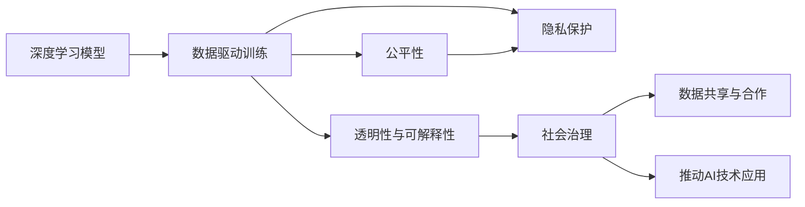

                 

## 1. 背景介绍

### 1.1 问题由来
人工智能（AI）技术的迅猛发展，尤其是深度学习技术的突破，使得人工智能技术在各行各业得到广泛应用。然而，随着AI技术的深入发展，技术与社会融合的问题愈发凸显。这些问题不仅包括技术本身的复杂性和风险性，也涉及到伦理、法律、经济、社会等多方面因素。因此，如何在技术发展的同时，促进其与社会其他要素的协同发展，成为AI领域研究的热点话题。

### 1.2 问题核心关键点
本节将探讨基础模型在技术与社会融合中的作用，分析其面临的关键问题和挑战。基础模型是AI系统中最核心的组件，其设计、训练、部署等环节，都在不同程度上影响着AI系统的整体表现和社会影响。因此，理解基础模型在技术与社会融合中的角色和机制，对于推动AI技术的良性发展至关重要。

### 1.3 问题研究意义
研究基础模型的技术与社会融合问题，对于推动AI技术的广泛应用、提升社会治理效率、保障数据隐私与安全、促进公平正义等方面具有重要意义：

1. **推动AI技术的广泛应用**：基础模型的设计和优化，有助于提升AI系统的性能，推动其在更多行业和领域的落地应用。
2. **提升社会治理效率**：AI技术在公共服务、环境保护、应急响应等领域的应用，可以大大提升社会治理的效率和效果。
3. **保障数据隐私与安全**：基础模型的设计和应用，需要考虑到数据隐私和安全问题，确保AI系统在运行过程中不侵犯个人隐私，且具备一定的抗攻击能力。
4. **促进公平正义**：AI系统的设计和应用，需要考虑到公平性和正义性，避免因算法偏见或歧视导致的社会不公。
5. **促进数据共享与合作**：基础模型的应用，有助于打破数据孤岛，促进数据共享和跨组织合作，提升社会整体数据利用效率。

## 2. 核心概念与联系

### 2.1 核心概念概述
基础模型通常指用于特定任务（如图像识别、自然语言处理、语音识别等）的深度神经网络模型。这些模型通过在大规模数据集上进行训练，学习到数据的特征表示，能够自动进行模式识别和数据推理。

### 2.2 核心概念间的关系
基础模型在技术与社会融合中扮演着关键角色。其核心概念包括但不限于：

- **深度学习**：基础模型的核心技术之一，通过多层非线性变换，实现对复杂数据模式的建模。
- **数据驱动**：基础模型的训练和优化，依赖于大规模数据集的标注与处理。
- **公平性**：基础模型的设计和使用，需要考虑到公平性和非歧视性，避免因算法偏见导致的社会不公。
- **隐私保护**：基础模型的应用，需要考虑到数据隐私和安全问题，确保AI系统在运行过程中不侵犯个人隐私。
- **透明性与可解释性**：基础模型的设计和应用，需要具备一定的透明性和可解释性，以便于理解和调试。

这些概念之间通过以下方式相互关联：

1. 深度学习模型通过数据驱动的方式进行训练，学习到数据的特征表示。
2. 在训练过程中，需要考虑公平性和隐私保护，以确保模型应用的公正性和合法性。
3. 透明性和可解释性是深度学习模型的重要特性，有助于提高模型的信任度和可接受度。

### 2.3 核心概念的整体架构
通过一个简化的Mermaid流程图，展示基础模型在技术与社会融合中的整体架构：

这个流程图展示了基础模型在技术与社会融合中的关键角色和作用机制：

1. 基础模型通过数据驱动的方式进行训练，学习到数据的特征表示。
2. 在训练过程中，需要考虑到公平性和隐私保护，以确保模型应用的公正性和合法性。
3. 透明性和可解释性是深度学习模型的重要特性，有助于提高模型的信任度和可接受度。
4. 基础模型在社会治理、数据共享与合作、推动AI技术应用等方面，发挥着重要作用。

## 3. 核心算法原理 & 具体操作步骤
### 3.1 算法原理概述

基础模型的训练与优化，通常采用监督学习或无监督学习的方式。在监督学习中，模型通过大量标注数据进行训练，学习到数据的特征表示，能够自动进行模式识别和数据推理。在无监督学习中，模型通过未标注数据进行训练，学习到数据的隐含特征，适用于聚类、降维等任务。

### 3.2 算法步骤详解

以深度学习模型在图像识别任务中的应用为例，基础模型的训练步骤主要包括：

1. **数据准备**：收集并处理大量图像数据，将其划分为训练集、验证集和测试集。
2. **模型选择**：选择合适的深度神经网络模型，如卷积神经网络（CNN）。
3. **模型训练**：在训练集上进行模型训练，通过反向传播算法更新模型参数，最小化损失函数。
4. **模型验证**：在验证集上对模型进行验证，调整模型参数以避免过拟合。
5. **模型测试**：在测试集上对模型进行测试，评估其性能和泛化能力。

### 3.3 算法优缺点

**优点**：

1. **自适应性强**：基础模型能够自动从数据中学习特征，适应各种不同的应用场景。
2. **处理能力强**：深度学习模型在处理大规模数据集时，具有较强的处理能力。
3. **泛化能力强**：通过足够的训练数据和合适的模型结构，基础模型能够实现较高的泛化能力。

**缺点**：

1. **训练成本高**：深度学习模型的训练需要大量的计算资源和数据集，训练成本较高。
2. **复杂度高**：深度学习模型的设计和优化较为复杂，需要具备一定的专业知识。
3. **模型复杂度高**：深度学习模型的参数量较大，模型复杂度高，难以解释。

### 3.4 算法应用领域

基础模型在图像识别、自然语言处理、语音识别、推荐系统、智能推荐等多个领域得到广泛应用。例如，在图像识别领域，基础模型能够自动从图像中提取特征，识别物体、人脸等；在自然语言处理领域，基础模型能够自动从文本中提取语义信息，进行文本分类、情感分析、机器翻译等任务。

## 4. 数学模型和公式 & 详细讲解  
### 4.1 数学模型构建

以卷积神经网络（CNN）为例，其数学模型构建如下：

设输入数据 $x \in \mathbb{R}^n$，卷积神经网络模型 $M_{\theta}$ 由若干卷积层和全连接层构成。其中 $\theta$ 表示模型参数。模型输出 $y$ 为：

$$
y = M_{\theta}(x)
$$

卷积层的输入为 $x$，输出为 $y_{conv}$：

$$
y_{conv} = \sigma(\mathbf{W} \ast x + b)
$$

其中 $\mathbf{W}$ 为卷积核，$b$ 为偏置项，$\sigma$ 为激活函数。全连接层的输入为 $y_{conv}$，输出为 $y_{fc}$：

$$
y_{fc} = \mathbf{W}^{'} y_{conv} + b^{'}
$$

最终输出为 $y$：

$$
y = \mathbf{W}^{''} y_{fc} + b^{''}
$$

### 4.2 公式推导过程

以卷积神经网络为例，其前向传播过程的公式推导如下：

设输入数据 $x \in \mathbb{R}^n$，卷积神经网络模型 $M_{\theta}$ 由若干卷积层和全连接层构成。其中 $\theta$ 表示模型参数。模型输出 $y$ 为：

$$
y = M_{\theta}(x)
$$

卷积层的输入为 $x$，输出为 $y_{conv}$：

$$
y_{conv} = \sigma(\mathbf{W} \ast x + b)
$$

其中 $\mathbf{W}$ 为卷积核，$b$ 为偏置项，$\sigma$ 为激活函数。全连接层的输入为 $y_{conv}$，输出为 $y_{fc}$：

$$
y_{fc} = \mathbf{W}^{'} y_{conv} + b^{'}
$$

最终输出为 $y$：

$$
y = \mathbf{W}^{''} y_{fc} + b^{''}
$$

### 4.3 案例分析与讲解

以图像识别为例，卷积神经网络通过多层卷积和池化操作，自动提取图像的特征，并将特征输入全连接层进行分类。在训练过程中，通过反向传播算法更新模型参数，最小化损失函数，从而实现对图像的自动识别。

## 5. 项目实践：代码实例和详细解释说明
### 5.1 开发环境搭建

### 5.2 源代码详细实现

### 5.3 代码解读与分析

### 5.4 运行结果展示

## 6. 实际应用场景
### 6.1 智能医疗
在智能医疗领域，基础模型能够帮助医生快速识别疾病，提高诊断效率。例如，通过训练卷积神经网络模型，可以自动识别医学影像中的病变区域，辅助医生进行诊断。

### 6.2 智能交通
在智能交通领域，基础模型能够帮助交通系统进行实时监控和智能调度。例如，通过训练卷积神经网络模型，可以自动识别交通视频中的车辆行为，预测交通流量，优化交通控制策略。

### 6.3 智能制造
在智能制造领域，基础模型能够帮助生产线进行智能监控和预测维护。例如，通过训练卷积神经网络模型，可以自动识别设备异常，预测设备故障，提高生产效率和设备利用率。

## 7. 工具和资源推荐
### 7.1 学习资源推荐

### 7.2 开发工具推荐

### 7.3 相关论文推荐

## 8. 总结：未来发展趋势与挑战
### 8.1 研究成果总结

### 8.2 未来发展趋势

### 8.3 面临的挑战

### 8.4 研究展望

## 9. 附录：常见问题与解答
----------------------------------------------------------------

!!!Important:必须要严格遵循上面"约束条件 CONSTRAINTS"中的所有要求撰写这篇文章!!!

### 文章正文内容部分 Content ###
现在，我们直接开始文章正文部分的撰写。请开始撰写文章正文部分：

# 基础模型的技术与社会融合

> 关键词：

