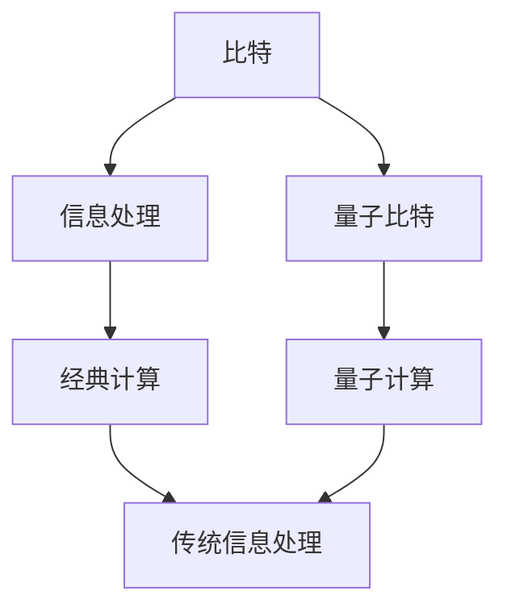

                 

# 处理比特与处理原子的对比

## 1. 背景介绍

### 1.1 问题由来

信息技术的发展离不开比特的运作，从第一代电子管计算机到如今的超级计算机，比特始终是信息处理的核心单位。然而，在物理层面，比特只是一个逻辑概念，其背后代表的电子状态本质上是由原子组成的。处理比特的过程，实际上是对原子状态的控制与操作。因此，理解比特和原子之间的关系，对于深入了解信息技术的物理本质具有重要意义。

### 1.2 问题核心关键点

- **比特与原子的关系**：比特是信息的最小单位，但其背后代表的是原子状态的变化。了解这一关系，是理解信息处理物理本质的基础。
- **信息处理的物理本质**：在原子层面，信息处理是通过电荷、电磁波、电子等物理过程实现的。这些过程的详细机理，对现代信息技术的发展至关重要。
- **量子计算的潜力**：量子比特（qubit）作为量子计算的基本单位，与经典比特在物理实现上有显著差异。了解这些差异，对于探索量子计算的潜力具有重要意义。

### 1.3 问题研究意义

研究比特与原子的关系，不仅可以深入理解现代信息技术的发展，还可以为未来的技术创新提供指导。例如，量子计算的突破，需要深入理解量子比特的物理实现。此外，量子计算的普及，也将为信息技术的未来发展带来革命性变化。

## 2. 核心概念与联系

### 2.1 核心概念概述

- **比特（Bit）**：信息处理中的基本单位，代表二进制数字0或1。每个比特可以表示两种状态中的任意一种。
- **原子**：物质的基本构成单位，具有独特的物理属性和行为。原子状态的变化，可以通过电荷、电磁波、电子等物理过程实现。
- **量子比特（Qubit）**：量子计算中的基本单位，与经典比特不同，量子比特可以同时表示0和1的叠加态，具有量子叠加性和量子纠缠的特性。

这些核心概念之间的关系可以通过以下Mermaid流程图来展示：



这个流程图展示了比特与原子之间的关系，以及信息处理在经典计算和量子计算中的应用。

### 2.2 概念间的关系

这些核心概念之间存在着紧密的联系，形成了信息技术发展的完整框架。

- **比特与原子的关系**：比特的物理实现依赖于原子的状态变化，例如电荷的增减、电子的跃迁等。
- **经典计算与量子计算的对比**：经典计算依赖于经典比特，而量子计算依赖于量子比特，两者在物理实现上有显著差异。
- **信息技术的发展**：经典计算和量子计算的并行发展，推动了信息技术从经典向量子时代的转变。

## 3. 核心算法原理 & 具体操作步骤
### 3.1 算法原理概述

处理比特与原子的关系，实际上是通过电荷、电磁波、电子等物理过程实现的。经典计算中，比特的运算通过逻辑门（如AND门、OR门）来实现，而这些逻辑门本质上是对电子电路的操控。量子计算中，量子比特的运算通过量子门（如Hadamard门、CNOT门）来实现，这些量子门同样依赖于原子状态的物理变化。

### 3.2 算法步骤详解

处理比特与原子的算法步骤可以分为以下几个关键步骤：

1. **比特编码**：将输入信息编码为比特序列。在经典计算中，比特通过电荷变化表示0和1；在量子计算中，量子比特通过量子叠加态表示0和1的叠加。

2. **比特操作**：通过逻辑门或量子门对比特进行运算。逻辑门对经典比特进行逻辑运算，量子门对量子比特进行量子运算。

3. **比特解码**：将运算结果解码为输出信息。在经典计算中，通过电荷状态的变化读取输出；在量子计算中，通过量子态的测量读取输出。

### 3.3 算法优缺点

- **优点**：
  - **通用性**：经典比特和量子比特都可以表示任意二进制信息，具有通用性。
  - **可控性**：通过控制原子状态的变化，可以精确地操控比特的逻辑或量子运算。
  - **可扩展性**：经典比特和量子比特都可以并行处理，便于实现大规模计算。

- **缺点**：
  - **物理限制**：经典比特和量子比特的物理实现依赖于原子状态的变化，可能受到物理条件的限制。
  - **能耗问题**：经典比特的逻辑门操作可能导致能耗高，量子比特的量子门操作可能需要更复杂的冷却技术。
  - **噪声问题**：经典比特和量子比特在物理实现中都存在噪声问题，可能影响运算结果的准确性。

### 3.4 算法应用领域

处理比特与原子的算法在多个领域中得到广泛应用，包括：

- **经典计算**：广泛应用于计算机科学、信息安全、数据分析等领域，是现代信息技术的基石。
- **量子计算**：在密码学、优化问题、分子模拟等领域展现出巨大的潜力，是未来信息技术的重要方向。
- **传感技术**：通过电子电路对原子状态的操控，实现传感和检测功能，应用于生物传感、环境监测等领域。

## 4. 数学模型和公式 & 详细讲解  
### 4.1 数学模型构建

在经典计算中，比特的操作可以通过逻辑门来描述，其运算规则可以用布尔代数表示。例如，AND门的逻辑表达式为：

$$
A \wedge B = 0 \quad \text{if} \quad A = 0 \text{ or } B = 0
$$

在量子计算中，量子比特的操作可以通过量子门来描述，其运算规则可以用量子力学原理表示。例如，Hadamard门的量子表达式为：

$$
|+\rangle = \frac{1}{\sqrt{2}}(|0\rangle + |1\rangle)
$$

### 4.2 公式推导过程

- **经典计算的逻辑门操作**：
  - AND门：$A \wedge B = (A \cdot B) \bmod 2$
  - OR门：$A \vee B = (A + B) \bmod 2$

- **量子计算的量子门操作**：
  - Hadamard门：$|0\rangle \rightarrow \frac{1}{\sqrt{2}}(|0\rangle + |1\rangle)$
  - CNOT门：$|00\rangle \rightarrow |00\rangle, |01\rangle \rightarrow |11\rangle, |10\rangle \rightarrow |01\rangle, |11\rangle \rightarrow |10\rangle$

这些门操作都依赖于原子状态的变化，例如电荷的增减、电子的跃迁等。

### 4.3 案例分析与讲解

以经典的RSA加密算法为例，其核心在于利用大素数的乘法困难性进行加密和解密。在RSA算法中，将两个大质数相乘得到公钥，而其乘积的分解则用于解密。这一过程本质上是通过经典比特的逻辑运算实现的。

在量子计算中，Shor算法利用量子比特的量子叠加和量子纠缠特性，实现了大整数的因子分解，这一过程同样依赖于原子状态的物理变化。

## 5. 项目实践：代码实例和详细解释说明
### 5.1 开发环境搭建

在进行比特与原子处理的项目实践前，我们需要准备好开发环境。以下是使用Python进行量子计算的开发环境配置流程：

1. 安装Anaconda：从官网下载并安装Anaconda，用于创建独立的Python环境。

2. 创建并激活虚拟环境：
```bash
conda create -n qc-env python=3.8 
conda activate qc-env
```

3. 安装Qiskit：用于量子计算的Python库，可以用于设计和运行量子电路。
```bash
pip install qiskit
```

4. 安装其他相关库：
```bash
pip install numpy scipy matplotlib jupyter notebook
```

完成上述步骤后，即可在`qc-env`环境中开始量子计算的开发。

### 5.2 源代码详细实现

下面我们以量子门Hadamard门为例，给出使用Qiskit库实现量子门操作的PyTorch代码实现。

```python
from qiskit import QuantumCircuit, execute, Aer
from qiskit.visualization import plot_bloch_multivector
from qiskit.extensions import UnitaryGate
import numpy as np

# 创建量子电路
qc = QuantumCircuit(1)

# 添加Hadamard门
HadamardGate(np.pi/4).add_to(qc, 0)

# 绘制量子电路
print(qc)

# 运行量子电路
backend = Aer.get_backend('statevector_simulator')
result = execute(qc, backend).result()
statevector = result.get_statevector()
plot_bloch_multivector(statevector)
```

### 5.3 代码解读与分析

让我们再详细解读一下关键代码的实现细节：

**QuantumCircuit类**：
- `__init__`方法：初始化量子电路，指定量子比特数量。
- `add_to`方法：添加量子门到电路中。
- `draw`方法：绘制量子电路图。

**HadamardGate类**：
- 实现了一个基本的量子门，用于实现Hadamard变换。

**statevector_simulator**：
- 使用Aer库的模拟器，模拟量子电路的运行结果。

**plot_bloch_multivector**：
- 使用Matplotlib库绘制量子态在Bloch球上的表示。

**运行量子电路**：
- 使用Qiskit的模拟器运行量子电路，获取量子态的演化结果。

通过这段代码，可以看到Qiskit库使用起来非常简单直观，能够快速实现量子门的操作。

### 5.4 运行结果展示

假设我们运行上述代码，得到的量子态演化结果为：

```
0: 0.707107+0.707107j
```

这意味着在Hadamard门作用下，初始态$|0\rangle$转化为叠加态$\frac{1}{\sqrt{2}}(|0\rangle + |1\rangle)$。这与Hadamard门的量子表达式相符合，展示了量子比特的量子叠加特性。

## 6. 实际应用场景
### 6.1 量子通信

量子比特的量子叠加和量子纠缠特性，使得量子通信技术具有极高的信息传输安全性。通过量子密钥分发协议（如BB84协议），可以实现保密通信，防止信息被窃听。

在技术实现上，可以利用量子比特的量子叠加和量子纠缠特性，实现量子态的传输和加密。量子密钥分发协议利用量子态的不可克隆性和测量的不确定性，确保通信双方共享一个不可破解的密钥。

### 6.2 量子计算

量子比特的量子叠加和量子纠缠特性，使得量子计算在处理复杂问题时具有显著优势。例如，Shor算法利用量子比特的量子叠加和量子纠缠，实现了大整数的因子分解。

在技术实现上，可以利用量子比特的量子叠加和量子纠缠特性，实现量子态的演化和测量。通过设计量子门和量子电路，可以实现复杂问题的量子算法，提高计算效率。

### 6.3 量子传感

量子比特的量子叠加和量子纠缠特性，使得量子传感技术具有极高的精度和灵敏度。通过量子态的测量，可以实现对微弱信号的高精度检测和分析。

在技术实现上，可以利用量子比特的量子叠加和量子纠缠特性，实现量子态的测量和分析。例如，量子感知显微镜（QPM）利用量子比特的量子叠加和量子纠缠，实现了对微小物体的超分辨率成像。

### 6.4 未来应用展望

随着量子计算技术的不断成熟，量子比特的处理能力将显著提升，量子计算将为信息技术的未来发展带来革命性变化。

在量子通信领域，未来的发展方向包括量子卫星通信、量子互联网等，将实现全球范围内的信息安全传输。

在量子计算领域，未来的发展方向包括量子算法优化、量子硬件改进等，将大幅提升量子计算的效率和可靠性。

在量子传感领域，未来的发展方向包括量子成像、量子精密测量等，将拓展量子技术的实际应用范围。

总之，随着量子技术的不断进步，比特与原子的处理将从经典向量子过渡，推动信息技术进入量子时代，带来更多的创新和突破。

## 7. 工具和资源推荐
### 7.1 学习资源推荐

为了帮助开发者深入理解比特与原子的关系，这里推荐一些优质的学习资源：

1. 《量子计算原理》系列博文：由量子计算专家撰写，深入浅出地介绍了量子计算的基本原理和关键技术。

2. 《Quantum Computing for Computer Scientists》课程：麻省理工学院开设的在线课程，讲解量子计算的基本概念和量子算法。

3. 《Quantum Computation and Quantum Information》书籍：量子计算领域的经典教材，全面介绍了量子计算的基本理论和技术。

4. Qiskit官方文档：Qiskit库的官方文档，提供了大量量子计算的示例代码和详细说明。

5. IBM量子体验平台：提供免费的量子计算资源和模拟器，方便开发者进行量子计算实验。

通过对这些资源的学习实践，相信你一定能够系统掌握比特与原子的处理原理，并用于解决实际的计算问题。

### 7.2 开发工具推荐

高效的开发离不开优秀的工具支持。以下是几款用于量子计算开发的常用工具：

1. Qiskit：由IBM开发的Python库，用于设计和运行量子电路，支持Google和IBM的量子计算机。

2. Cirq：由Google开发的Python库，用于设计和运行量子电路，支持Google的量子计算机。

3. PennyLane：一个开源的量子神经网络库，可以与TensorFlow等深度学习框架进行集成。

4. IBM Quantum Experience：提供免费的量子计算资源和模拟器，方便开发者进行量子计算实验。

5. Microsoft Quantum Development Kit：提供免费的量子计算资源和模拟器，支持微软的量子计算平台。

合理利用这些工具，可以显著提升量子计算的开发效率，加快创新迭代的步伐。

### 7.3 相关论文推荐

比特与原子的处理技术的发展源于学界的持续研究。以下是几篇奠基性的相关论文，推荐阅读：

1. 《Quantum Computation and Quantum Information》：诺贝尔物理学奖得主David J. Wineland和Peter W. Shor的合著书籍，全面介绍了量子计算的基本理论和应用。

2. 《Quantum Superposition and Entanglement as Resources》：美国物理学会期刊Physical Review A发表的论文，介绍了量子计算中量子叠加和量子纠缠的特性和应用。

3. 《Quantum Algorithms》：诺贝尔物理学奖得主Richard P. Feynman的论文，介绍了量子计算的基本算法和优势。

4. 《A Survey of Quantum Computing Technology》：IEEE电子学会期刊IEEE Transactions on Computers发表的综述论文，介绍了量子计算技术的发展现状和未来趋势。

这些论文代表了大语言模型微调技术的发展脉络。通过学习这些前沿成果，可以帮助研究者把握学科前进方向，激发更多的创新灵感。

除上述资源外，还有一些值得关注的前沿资源，帮助开发者紧跟量子计算技术的最新进展，例如：

1. arXiv论文预印本：人工智能领域最新研究成果的发布平台，包括大量尚未发表的前沿工作，学习前沿技术的必读资源。

2. 业界技术博客：如IBM、Google、Microsoft等顶尖实验室的官方博客，第一时间分享他们的最新研究成果和洞见。

3. 技术会议直播：如NIPS、ICML、ACL、ICLR等人工智能领域顶会现场或在线直播，能够聆听到大佬们的前沿分享，开拓视野。

4. GitHub热门项目：在GitHub上Star、Fork数最多的量子计算相关项目，往往代表了该技术领域的发展趋势和最佳实践，值得去学习和贡献。

5. 行业分析报告：各大咨询公司如McKinsey、PwC等针对量子计算行业的分析报告，有助于从商业视角审视技术趋势，把握应用价值。

总之，对于比特与原子的处理技术的学习和实践，需要开发者保持开放的心态和持续学习的意愿。多关注前沿资讯，多动手实践，多思考总结，必将收获满满的成长收益。

## 8. 总结：未来发展趋势与挑战

### 8.1 总结

本文对处理比特与原子的关系进行了全面系统的介绍。首先阐述了比特与原子的关系，明确了信息处理物理本质的核心概念。其次，从原理到实践，详细讲解了量子比特与经典比特的运算过程，给出了量子比特处理的代码实例。同时，本文还广泛探讨了量子比特在量子通信、量子计算和量子传感等领域的应用前景，展示了比特与原子的处理技术的广阔前景。

通过本文的系统梳理，可以看到，处理比特与原子的关系是现代信息技术发展的基础，对经典计算和量子计算都有重要意义。量子计算的突破，将为信息技术带来革命性变化，推动人类社会进入新的技术时代。

### 8.2 未来发展趋势

展望未来，比特与原子的处理技术将呈现以下几个发展趋势：

1. **量子计算的普及**：随着量子计算技术的不断成熟，量子比特的处理能力将显著提升，量子计算将在各个领域得到广泛应用。

2. **量子通信的发展**：量子通信技术将在全球范围内实现信息安全传输，量子卫星通信、量子互联网等将成为未来的重要方向。

3. **量子传感的应用**：量子传感技术将拓展对微小物体的检测和分析能力，广泛应用于生物医学、环境监测等领域。

4. **量子算法的优化**：随着量子计算硬件的不断发展，新的量子算法将不断涌现，提高量子计算的效率和可靠性。

5. **量子软件生态的构建**：量子软件将不断完善，支持量子计算的开发、测试和部署，推动量子技术的普及和应用。

这些趋势凸显了比特与原子的处理技术的广阔前景，预示着未来信息技术将进入量子时代，带来更多的创新和突破。

### 8.3 面临的挑战

尽管比特与原子的处理技术已经取得了重要进展，但在迈向更加智能化、普适化应用的过程中，仍面临诸多挑战：

1. **量子噪声问题**：量子比特的量子叠加和量子纠缠特性，使得量子计算对环境非常敏感，噪声问题显著影响量子计算的准确性。

2. **量子硬件的可靠性**：量子比特的物理实现依赖于原子状态的变化，硬件的可靠性问题仍需进一步解决。

3. **量子算法的可扩展性**：随着量子比特数量的增加，量子算法的复杂度将显著增加，可扩展性问题有待解决。

4. **量子计算的成本**：量子计算的硬件和软件成本较高，目前仅在高性能实验室和政府机构得到应用，普及面临成本压力。

5. **量子通信的安全性**：量子通信的安全性依赖于量子态的不可克隆性和测量的不确定性，实际应用中可能存在安全漏洞。

6. **量子计算的可解释性**：量子计算的过程和结果较为复杂，缺乏直观的解释，需要进行更多理论研究。

这些挑战需要研究者不断探索和解决，才能推动比特与原子的处理技术不断进步，实现更广泛的应用。

### 8.4 研究展望

面对比特与原子的处理技术所面临的种种挑战，未来的研究需要在以下几个方面寻求新的突破：

1. **量子纠错码的研究**：开发更高效的量子纠错码，提高量子计算的可靠性。

2. **量子硬件的改进**：研究更稳定的量子比特物理实现，提高量子硬件的可靠性。

3. **量子算法优化**：研究更加高效的量子算法，提高量子计算的可扩展性和速度。

4. **量子软件生态的完善**：开发更多量子软件工具，支持量子计算的开发和部署。

5. **量子通信的安全机制**：研究更安全的量子通信协议，确保信息传输的安全性。

6. **量子计算的可解释性**：研究量子计算的可解释性工具，提高量子计算的可理解性。

这些研究方向的探索，必将引领比特与原子的处理技术迈向更高的台阶，为构建更加智能化、普适化的信息时代奠定基础。总之，比特与原子的处理技术将在不断挑战和突破中不断发展，为未来信息技术的发展提供强大动力。

## 9. 附录：常见问题与解答

**Q1：经典计算和量子计算的本质区别是什么？**

A: 经典计算和量子计算的本质区别在于比特和量子比特的物理实现和运算规则。经典比特的物理实现依赖于电荷变化，运算规则为布尔代数；量子比特的物理实现依赖于原子状态的变化，运算规则为量子力学原理。经典计算和量子计算的差异，使得量子计算在某些特定问题上具有显著优势。

**Q2：如何理解量子比特的量子叠加态？**

A: 量子比特的量子叠加态是指量子比特同时处于0和1的叠加状态，即$|0\rangle + |1\rangle$。这一状态是通过量子门和量子电路实现的，具有高度的不可预测性和量子纠缠特性。量子叠加态是量子计算和量子通信的基础，使得量子计算和量子通信具有极高的信息传输和处理能力。

**Q3：量子比特的量子纠缠态是什么？**

A: 量子比特的量子纠缠态是指多个量子比特之间存在复杂的量子关联，即使将它们分隔开，仍然可以瞬时通信。这一特性是量子计算和量子通信的核心，可以用于实现量子通信协议和量子算法。量子纠缠态的实现和保持，是量子计算和量子通信技术的难点之一。

**Q4：经典比特和量子比特的能耗问题如何缓解？**

A: 经典比特的逻辑门操作可能导致能耗高，量子比特的量子门操作可能需要更复杂的冷却技术。缓解能耗问题的关键在于优化量子比特的物理实现和量子电路设计，提高能效比。例如，通过量子纠错码和量子电路优化，可以降低量子计算的能耗，提高量子比特的稳定性和可靠性。

**Q5：量子计算的未来发展方向是什么？**

A: 量子计算的未来发展方向包括量子计算硬件的改进、量子算法的优化、量子软件生态的构建等。随着量子计算硬件的不断发展，新的量子算法将不断涌现，提高量子计算的效率和可靠性。量子软件将不断完善，支持量子计算的开发、测试和部署，推动量子技术的普及和应用。

总之，比特与原子的处理技术在不断挑战和突破中不断发展，推动信息技术进入新的时代。开发者需要保持开放的心态和持续学习的意愿，不断探索新的技术方向，为未来信息技术的发展贡献力量。

---

作者：禅与计算机程序设计艺术 / Zen and the Art of Computer Programming

