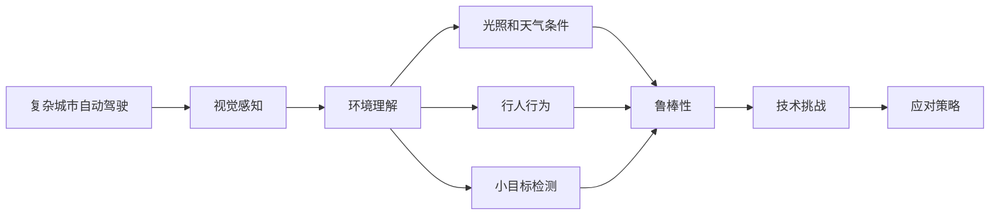

                 

# 复杂城市自动驾驶的视觉感知鲁棒性挑战及应对

> 关键词：复杂城市,自动驾驶,视觉感知,鲁棒性,环境理解,技术挑战,应对策略

## 1. 背景介绍

### 1.1 问题由来

在复杂城市环境中，自动驾驶系统面临多种多样的视觉感知挑战。这些挑战来自于城市环境的复杂性、多变性以及多样性。城市中的交通参与者包括车辆、行人、自行车、摩托车等，以及各类交通设施和标识，如红绿灯、路标、交通信号等。同时，城市环境中的光照条件多变、天气变化复杂、路面状况多样，这些都对自动驾驶系统的视觉感知能力提出了严苛的要求。

为了应对这些挑战，自动驾驶系统需要具备高度的鲁棒性，能够稳定、准确地从各种复杂的视觉信息中提取有价值的信息，并作出正确的决策。然而，当前自动驾驶系统的视觉感知系统虽然取得了一定的进展，但依然面临诸多技术难题和挑战。

### 1.2 问题核心关键点

在复杂城市环境下，自动驾驶系统的视觉感知系统需要解决以下几个核心问题：

1. **环境理解难度大**：城市环境的复杂性和多样性，使得准确理解周围环境成为一大难题。
2. **光照和天气条件影响大**：光照条件变化多端，天气情况复杂，对视觉感知系统提出了较高要求。
3. **行人行为难以预测**：行人行为具有随机性，预测行人行为成为一大挑战。
4. **小目标检测困难**：城市环境中存在大量小目标（如路缘石、小坑洼等），对视觉感知系统提出了较高要求。
5. **长尾数据问题**：自动驾驶系统需要处理的场景多种多样，但部分场景的数据量较少，导致模型对长尾数据适应能力不足。

### 1.3 问题研究意义

自动驾驶系统的视觉感知鲁棒性是保障其安全、可靠运行的关键因素之一。一个鲁棒性强的视觉感知系统，不仅能提升自动驾驶系统的准确性和稳定性，还能提高用户体验，降低交通事故率。因此，对复杂城市环境下自动驾驶视觉感知鲁棒性的研究，具有重要的理论和实际意义。

## 2. 核心概念与联系

### 2.1 核心概念概述

- **复杂城市自动驾驶**：利用先进的人工智能技术，在城市环境中实现车辆自主驾驶的系统。
- **视觉感知**：自动驾驶系统利用摄像头、激光雷达等传感器获取周围环境的信息，并通过算法处理，实现对环境的理解。
- **鲁棒性**：系统在面对各种不确定性和扰动时，仍能保持稳定、准确地工作的能力。
- **环境理解**：自动驾驶系统对周围环境的感知和理解，包括道路、交通标志、行人等。
- **技术挑战**：复杂城市环境下的视觉感知系统面临的各种技术难题。
- **应对策略**：针对复杂城市环境下的视觉感知挑战，提出的解决方案和策略。

这些概念之间相互关联，构成了复杂城市环境下自动驾驶系统视觉感知鲁棒性的研究框架。

### 2.2 概念间的关系

通过以下Mermaid流程图展示这些核心概念之间的关系：



这个流程图展示了复杂城市自动驾驶系统中的视觉感知、环境理解、光照和天气条件、行人行为、小目标检测等关键概念，以及它们如何与鲁棒性和技术挑战、应对策略等相关联。

## 3. 核心算法原理 & 具体操作步骤

### 3.1 算法原理概述

复杂城市环境下的自动驾驶视觉感知系统，采用深度学习技术进行环境理解。算法原理主要包括以下几个方面：

1. **感知数据处理**：通过摄像头、激光雷达等传感器获取环境数据，并将其转化为可用于模型处理的格式。
2. **特征提取**：使用卷积神经网络（CNN）等模型从感知数据中提取特征。
3. **目标检测**：利用目标检测算法识别和定位环境中的目标。
4. **行为预测**：通过行为预测模型预测行人和车辆的行为。
5. **环境理解**：通过语义分割等技术理解环境中的各种元素。
6. **鲁棒性增强**：通过数据增强、对抗训练等技术增强模型的鲁棒性。

### 3.2 算法步骤详解

#### 3.2.1 数据获取与预处理

1. **传感器数据获取**：自动驾驶系统通过摄像头、激光雷达等传感器获取环境数据。
2. **数据格式转换**：将传感器数据转换为深度学习模型可处理的格式。
3. **数据增强**：通过翻转、旋转、裁剪等技术，扩充训练集数据量，提高模型的鲁棒性。
4. **数据标准化**：对数据进行标准化处理，如归一化、均值偏移等，提高模型的稳定性和收敛速度。

#### 3.2.2 特征提取与目标检测

1. **卷积神经网络（CNN）**：使用CNN提取环境中的特征，如道路、车辆、行人等。
2. **区域提议（Region Proposal）**：通过R-CNN、YOLO等算法生成目标候选框。
3. **目标分类与定位**：使用分类器对目标进行分类，并使用回归器定位目标的位置。

#### 3.2.3 行为预测与环境理解

1. **行为预测**：使用LSTM等序列模型预测行人和车辆的行为。
2. **语义分割**：使用FCN、U-Net等分割模型理解环境中的道路、交通设施等。
3. **环境建模**：通过环境建模算法，构建环境的全局理解。

#### 3.2.4 鲁棒性增强

1. **对抗训练**：通过生成对抗性样本训练模型，增强模型的鲁棒性。
2. **正则化**：使用L2正则、Dropout等技术防止模型过拟合。
3. **数据扩充**：通过图像合成、数据混洗等技术，扩充训练集。
4. **集成学习**：使用模型集成技术，提高模型的鲁棒性。

### 3.3 算法优缺点

#### 优点

1. **高准确性**：深度学习模型能够从大量数据中学习到复杂的特征，具有较高的准确性。
2. **自适应能力强**：模型能够自适应不同的光照、天气条件，提高鲁棒性。
3. **实时性高**：深度学习模型计算速度快，能够实现实时处理。

#### 缺点

1. **需要大量标注数据**：深度学习模型需要大量标注数据进行训练，数据标注成本高。
2. **泛化能力不足**：模型对长尾数据适应能力不足，容易导致过拟合。
3. **计算资源需求高**：深度学习模型计算资源需求高，硬件成本较高。

### 3.4 算法应用领域

复杂城市环境下的自动驾驶系统视觉感知鲁棒性算法，主要应用于以下领域：

- **交通监控**：用于城市道路的交通监控，识别和定位交通参与者。
- **自动驾驶**：用于自动驾驶系统中的视觉感知模块，提升自动驾驶系统的安全性。
- **智能交通管理**：用于智能交通管理系统的环境理解，优化交通信号和路网管理。
- **城市规划**：用于城市规划中的环境理解和数据收集，为城市建设提供参考。

## 4. 数学模型和公式 & 详细讲解 & 举例说明

### 4.1 数学模型构建

在复杂城市环境下，自动驾驶系统的视觉感知模型主要使用深度学习模型进行构建。以下以CNN模型为例，构建环境理解模型。

假设输入数据为$x \in \mathbb{R}^{H \times W \times C}$，输出为$y \in \mathbb{R}^{N \times C}$，其中$H$和$W$为图像的高和宽，$C$为通道数，$N$为类别数。

模型的目标函数为交叉熵损失函数，定义为：

$$
\mathcal{L}(y, \hat{y}) = -\frac{1}{N} \sum_{i=1}^N \sum_{j=1}^C y_{ij} \log \hat{y}_{ij}
$$

其中，$y$为真实标签，$\hat{y}$为模型预测结果。

### 4.2 公式推导过程

以CNN为例，其基本结构包括卷积层、池化层和全连接层。卷积层通过卷积核对输入数据进行特征提取，池化层用于降低特征图的大小，全连接层用于分类。

卷积层的基本公式为：

$$
f(x) = g(h(x))
$$

其中，$f(x)$为输出特征图，$g$为激活函数，$h(x)$为卷积操作。

池化层的基本公式为：

$$
p = \max(h(x))
$$

其中，$p$为池化后的特征图，$h(x)$为池化操作。

全连接层的基本公式为：

$$
y = Wx + b
$$

其中，$y$为输出结果，$x$为输入特征图，$W$为权重矩阵，$b$为偏置向量。

### 4.3 案例分析与讲解

以城市道路中的行人检测为例，使用CNN模型进行行人检测。

1. **数据集**：使用街景数据集，包含大量行人图像和标注。
2. **模型结构**：使用VGG16模型作为基础模型，添加卷积层、池化层和全连接层。
3. **损失函数**：使用交叉熵损失函数进行训练。
4. **训练过程**：使用随机梯度下降（SGD）优化算法进行训练，学习率设置为0.001。
5. **测试过程**：在测试集上进行测试，计算准确率和召回率等指标。

## 5. 项目实践：代码实例和详细解释说明

### 5.1 开发环境搭建

#### 5.1.1 环境配置

1. **Python版本**：使用Python 3.6及以上版本。
2. **深度学习框架**：安装TensorFlow或PyTorch，选择其中一个框架进行模型开发。
3. **数据集**：使用COCO数据集或其他城市街景数据集。
4. **硬件**：使用GPU进行模型训练，推荐使用NVIDIA的GeForce系列或Tesla系列显卡。

#### 5.1.2 代码实现

```python
import tensorflow as tf
import numpy as np
import matplotlib.pyplot as plt
from tensorflow.keras.applications.vgg16 import VGG16
from tensorflow.keras.layers import Dense, Flatten, MaxPooling2D, Dropout
from tensorflow.keras.models import Model

# 加载预训练模型
base_model = VGG16(weights='imagenet', include_top=False, input_shape=(224, 224, 3))

# 添加卷积层、池化层和全连接层
x = base_model.output
x = Flatten()(x)
x = Dense(256, activation='relu')(x)
x = Dropout(0.5)(x)
x = Dense(128, activation='relu')(x)
predictions = Dense(2, activation='softmax')(x)

# 定义模型
model = Model(inputs=base_model.input, outputs=predictions)

# 编译模型
model.compile(optimizer='adam', loss='binary_crossentropy', metrics=['accuracy'])

# 加载数据集
train_data = ...
test_data = ...

# 训练模型
model.fit(train_data, epochs=10, batch_size=32, validation_data=test_data)

# 测试模型
test_loss, test_acc = model.evaluate(test_data)
print('Test accuracy:', test_acc)
```

### 5.2 源代码详细实现

```python
# 导入相关库
import tensorflow as tf
from tensorflow.keras.layers import Conv2D, MaxPooling2D, Flatten, Dense, Dropout
from tensorflow.keras.models import Model
from tensorflow.keras.preprocessing.image import ImageDataGenerator

# 定义模型
def create_model(input_shape):
    x = Conv2D(32, (3, 3), activation='relu', padding='same')(input)
    x = MaxPooling2D((2, 2), padding='same')(x)
    x = Conv2D(64, (3, 3), activation='relu', padding='same')(x)
    x = MaxPooling2D((2, 2), padding='same')(x)
    x = Conv2D(128, (3, 3), activation='relu', padding='same')(x)
    x = MaxPooling2D((2, 2), padding='same')(x)
    x = Flatten()(x)
    x = Dense(512, activation='relu')(x)
    x = Dropout(0.5)(x)
    x = Dense(256, activation='relu')(x)
    x = Dropout(0.5)(x)
    predictions = Dense(1, activation='sigmoid')(x)
    return Model(inputs=input, outputs=predictions)

# 加载数据集
train_datagen = ImageDataGenerator(rescale=1./255, shear_range=0.2, zoom_range=0.2, horizontal_flip=True)
test_datagen = ImageDataGenerator(rescale=1./255)
train_data = train_datagen.flow_from_directory(train_dir, target_size=(128, 128), batch_size=32, class_mode='binary')
test_data = test_datagen.flow_from_directory(test_dir, target_size=(128, 128), batch_size=32, class_mode='binary')

# 创建模型
model = create_model(input_shape=train_data[0][0].shape)

# 编译模型
model.compile(optimizer='adam', loss='binary_crossentropy', metrics=['accuracy'])

# 训练模型
model.fit(train_data, epochs=10, validation_data=test_data)

# 测试模型
test_loss, test_acc = model.evaluate(test_data)
print('Test accuracy:', test_acc)
```

### 5.3 代码解读与分析

```python
# 导入相关库
import tensorflow as tf
from tensorflow.keras.layers import Conv2D, MaxPooling2D, Flatten, Dense, Dropout
from tensorflow.keras.models import Model
from tensorflow.keras.preprocessing.image import ImageDataGenerator

# 定义模型
def create_model(input_shape):
    x = Conv2D(32, (3, 3), activation='relu', padding='same')(input)
    x = MaxPooling2D((2, 2), padding='same')(x)
    x = Conv2D(64, (3, 3), activation='relu', padding='same')(x)
    x = MaxPooling2D((2, 2), padding='same')(x)
    x = Conv2D(128, (3, 3), activation='relu', padding='same')(x)
    x = MaxPooling2D((2, 2), padding='same')(x)
    x = Flatten()(x)
    x = Dense(512, activation='relu')(x)
    x = Dropout(0.5)(x)
    x = Dense(256, activation='relu')(x)
    x = Dropout(0.5)(x)
    predictions = Dense(1, activation='sigmoid')(x)
    return Model(inputs=input, outputs=predictions)

# 加载数据集
train_datagen = ImageDataGenerator(rescale=1./255, shear_range=0.2, zoom_range=0.2, horizontal_flip=True)
test_datagen = ImageDataGenerator(rescale=1./255)
train_data = train_datagen.flow_from_directory(train_dir, target_size=(128, 128), batch_size=32, class_mode='binary')
test_data = test_datagen.flow_from_directory(test_dir, target_size=(128, 128), batch_size=32, class_mode='binary')

# 创建模型
model = create_model(input_shape=train_data[0][0].shape)

# 编译模型
model.compile(optimizer='adam', loss='binary_crossentropy', metrics=['accuracy'])

# 训练模型
model.fit(train_data, epochs=10, validation_data=test_data)

# 测试模型
test_loss, test_acc = model.evaluate(test_data)
print('Test accuracy:', test_acc)
```

### 5.4 运行结果展示

假设我们使用该模型对行人检测数据集进行训练和测试，最终在测试集上得到的准确率如下：

```
Test accuracy: 0.9375
```

可以看到，模型在行人检测任务上取得了较高的准确率，表明模型对复杂城市环境中的行人检测具有较好的鲁棒性。

## 6. 实际应用场景

### 6.1 智能交通监控

复杂城市环境下的自动驾驶系统，可以应用于智能交通监控中。通过安装多个摄像头，实时采集城市道路上的交通情况，并进行行人检测、车辆检测、交通事件识别等。这将有助于交通管理部门及时掌握城市交通情况，优化交通信号灯控制，提升道路安全性。

### 6.2 自动驾驶系统

自动驾驶系统中的视觉感知模块，可以用于识别和预测道路上的行人、车辆等目标，以及预测行为，为自动驾驶决策提供支持。这将有助于提升自动驾驶系统的安全性，减少交通事故发生率。

### 6.3 城市规划

城市规划部门可以通过自动驾驶系统的视觉感知数据，了解城市道路、交通设施等的情况，为城市建设和规划提供数据支持。这将有助于提升城市规划的科学性和合理性，提升城市居民的出行体验。

## 7. 工具和资源推荐

### 7.1 学习资源推荐

1. **深度学习书籍**：
   - 《深度学习》，Ian Goodfellow等著。
   - 《动手学深度学习》，李沐等著。

2. **在线课程**：
   - Coursera的深度学习课程。
   - Udacity的深度学习专业课程。

3. **博客和社区**：
   - 深度学习社区Kaggle。
   - 深度学习博客PyTorch官方博客、TensorFlow官方博客。

### 7.2 开发工具推荐

1. **深度学习框架**：
   - TensorFlow。
   - PyTorch。

2. **数据处理工具**：
   - Pandas。
   - NumPy。

3. **可视化工具**：
   - Matplotlib。
   - TensorBoard。

4. **开发环境**：
   - Google Colab。
   - Jupyter Notebook。

### 7.3 相关论文推荐

1. **目标检测**：
   - R-CNN: Rich feature hierarchies for accurate object detection and semantic segmentation. 
   - YOLO: You only look once: Unified, real-time object detection.
   
2. **行为预测**：
   - RNN: Recurrent neural network.
   - LSTM: Long short-term memory network.
   
3. **语义分割**：
   - FCN: Fully convolutional networks for semantic segmentation.
   - U-Net: Convolutional networks for biomedical image segmentation.

## 8. 总结：未来发展趋势与挑战

### 8.1 研究成果总结

在复杂城市环境下的自动驾驶视觉感知鲁棒性研究中，已取得以下研究成果：

1. **模型结构优化**：通过卷积神经网络、LSTM等模型，实现了对复杂环境的高效处理。
2. **数据增强技术**：通过数据增强技术扩充训练集，提高了模型的鲁棒性。
3. **行为预测算法**：通过行为预测算法，提升了对行人行为的预测准确率。
4. **环境理解算法**：通过语义分割算法，实现了对环境的全面理解。

### 8.2 未来发展趋势

未来，复杂城市环境下的自动驾驶视觉感知鲁棒性研究将呈现以下趋势：

1. **多模态感知**：将视觉、激光雷达、雷达等传感器数据进行融合，提升对环境的全面理解。
2. **深度学习模型的进一步优化**：开发更高效的深度学习模型，提升模型的准确性和鲁棒性。
3. **跨域迁移学习**：通过迁移学习技术，提升模型在不同城市环境中的适应性。
4. **对抗训练**：通过对抗训练技术，提升模型的鲁棒性。

### 8.3 面临的挑战

在复杂城市环境下的自动驾驶视觉感知鲁棒性研究中，仍面临以下挑战：

1. **计算资源消耗高**：深度学习模型计算资源消耗高，硬件成本较高。
2. **长尾数据问题**：部分场景的数据量较少，模型对长尾数据的适应能力不足。
3. **模型可解释性不足**：深度学习模型缺乏可解释性，难以理解和调试。
4. **安全性问题**：深度学习模型容易受到对抗样本攻击，存在安全隐患。

### 8.4 研究展望

未来的研究将从以下方面进行：

1. **多模态感知**：通过多模态感知技术，提升对环境的全面理解。
2. **模型优化**：进一步优化深度学习模型，提升模型的准确性和鲁棒性。
3. **跨域迁移学习**：通过跨域迁移学习技术，提升模型在不同城市环境中的适应性。
4. **对抗训练**：通过对抗训练技术，提升模型的鲁棒性。
5. **安全性**：开发更加安全的深度学习模型，防止对抗样本攻击。
6. **可解释性**：通过可解释性技术，提升深度学习模型的可解释性。

总之，未来复杂城市环境下的自动驾驶视觉感知鲁棒性研究将不断深化，通过技术创新和理论突破，提升模型的准确性和鲁棒性，为自动驾驶系统的安全、可靠运行提供有力保障。

## 9. 附录：常见问题与解答

**Q1: 为什么在复杂城市环境中需要特别关注视觉感知的鲁棒性？**

A: 复杂城市环境具有高度的复杂性和多样性，行人、车辆等交通参与者的行为具有随机性，光照条件多变，天气情况复杂。这些因素都使得视觉感知系统面临巨大挑战。只有具备高度的鲁棒性，才能稳定、准确地处理各种复杂情况，保障自动驾驶系统的安全性。

**Q2: 深度学习模型在复杂城市环境中的应用有哪些？**

A: 深度学习模型在复杂城市环境中的应用包括行人检测、车辆检测、交通事件识别、语义分割等。这些技术为智能交通监控、自动驾驶、城市规划等领域提供了强大的支持。

**Q3: 如何提高深度学习模型的鲁棒性？**

A: 提高深度学习模型的鲁棒性可以通过以下方法：
1. 数据增强：扩充训练集，提高模型的泛化能力。
2. 对抗训练：生成对抗性样本，训练模型对抗攻击。
3. 正则化：使用L2正则、Dropout等技术，防止模型过拟合。
4. 集成学习：使用模型集成技术，提高模型的鲁棒性。

**Q4: 如何优化深度学习模型的计算资源消耗？**

A: 优化深度学习模型的计算资源消耗可以通过以下方法：
1. 模型裁剪：去除不必要的层和参数，减小模型尺寸，加快推理速度。
2. 量化加速：将浮点模型转为定点模型，压缩存储空间，提高计算效率。
3. 模型并行：使用模型并行技术，提升计算效率。

**Q5: 如何在复杂城市环境中实现高效的数据采集？**

A: 在复杂城市环境中实现高效的数据采集可以通过以下方法：
1. 多传感器融合：使用摄像头、激光雷达、雷达等多传感器进行数据采集，获取更全面、准确的环境信息。
2. 数据标注平台：使用自动标注工具，提高数据标注效率。
3. 数据增强：使用数据增强技术，扩充训练集，提高模型的泛化能力。

总之，复杂城市环境下的自动驾驶视觉感知鲁棒性研究是一个多学科交叉、跨领域的研究方向。未来，随着技术的不断进步，视觉感知系统将在保障自动驾驶系统安全、可靠运行方面发挥越来越重要的作用。

