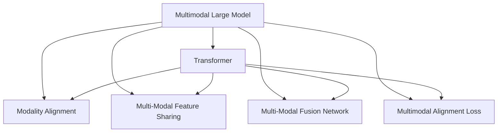
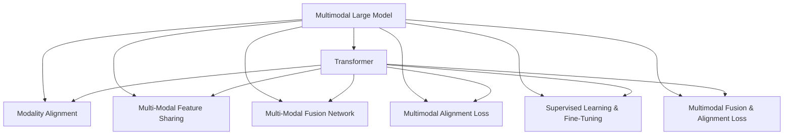
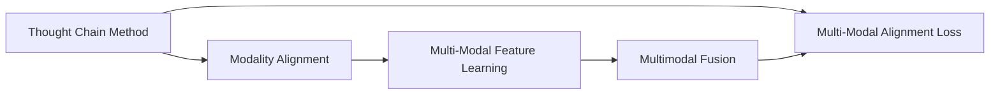
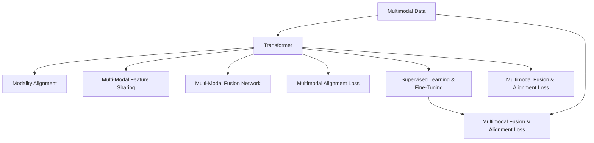

                 

# 多模态大模型：技术原理与实战 思维链方法

> 关键词：多模态大模型,思维链方法,深度学习,计算机视觉,自然语言处理,NLP,计算机视觉,Transformer,BERT,推理,感知,迁移学习,迁移学习,多模态融合,超参数调优

## 1. 背景介绍

### 1.1 问题由来
近年来，深度学习技术在计算机视觉(Computer Vision, CV)、自然语言处理(Natural Language Processing, NLP)等领域取得了显著进展。CV和NLP之间的交叉融合，催生了许多新的研究热点。在实际应用中，单模态数据往往难以充分表达复杂现实世界的信息，而多模态数据可以提供更多维度的信息，提升模型的感知能力。因此，多模态学习成为了当前研究的热点。

多模态学习的主要目标是通过融合多种模态的数据，提升模型对目标任务的性能，解决单模态数据可能存在的缺陷。例如，在医学诊断中，结合图像和文本数据，可以更准确地诊断疾病；在智能交通系统中，结合视频和语义信息，可以更全面地监测交通状况。

多模态大模型(Multimodal Large Models)的提出，则进一步推动了多模态学习的演进。它融合了多种模态的数据，并借助大规模预训练技术，大幅提升了多模态学习的效果。本文将深入探讨多模态大模型的技术原理与实战方法，旨在为开发者提供一个系统化的学习指南。

### 1.2 问题核心关键点
多模态大模型的关键点在于如何高效融合多种模态的数据，并从中提取有价值的特征。常见的多模态融合方法包括：

1. 模态对齐：将不同模态的数据转换为同一空间，然后进行融合。
2. 多模态特征共享：不同模态的数据共享部分特征，提升特征的鲁棒性。
3. 多模态融合网络：使用深度神经网络进行多模态数据的融合，如残差连接、注意力机制等。
4. 跨模态对齐损失：设计损失函数，使不同模态的数据在特定任务上保持一致性。

多模态大模型的应用场景广泛，如医学影像诊断、智能交通监控、自然语言翻译等，其核心在于如何高效利用多种模态数据，提升模型的性能。

### 1.3 问题研究意义
研究多模态大模型对于提升多模态学习的效果，推动AI技术在各个领域的应用，具有重要意义：

1. 提高多模态学习效果：多模态大模型通过融合多种模态的数据，可以提升模型的感知能力和表达能力，从而提高多模态学习的效果。
2. 促进AI技术在各领域应用：多模态大模型可以应用于医学、交通、自然语言处理等多个领域，推动AI技术在各行各业的落地应用。
3. 降低数据获取成本：多模态大模型可以整合多种模态数据，降低单一模态数据获取的成本，提升数据利用率。
4. 促进跨模态研究：多模态大模型可以推动跨模态学习、跨模态推理等前沿研究方向的发展。
5. 提升AI技术的可靠性：多模态大模型通过多种模态数据的融合，可以提高模型的鲁棒性和可靠性，减少偏见和错误。

## 2. 核心概念与联系

### 2.1 核心概念概述

为更好地理解多模态大模型的技术原理与实战方法，本节将介绍几个关键概念：

- 多模态大模型：以Transformer为基础，融合多种模态数据进行预训练和微调的大型神经网络模型。
- 思维链方法：一种融合深度学习和认知科学的方法，通过构建虚拟思维链，实现多模态数据的整合与推理。
- 多模态特征表示学习：学习多模态数据的联合特征表示，以提升模型的泛化能力。
- 迁移学习：通过在大规模无标签数据上预训练，将知识迁移到特定任务上，提升模型性能。
- 多模态融合网络：使用深度神经网络进行多模态数据的融合，如残差连接、注意力机制等。
- 多模态对齐损失：设计损失函数，使不同模态的数据在特定任务上保持一致性。

这些核心概念之间的联系可以通过以下Mermaid流程图来展示：



这个流程图展示了大模型与各核心概念的联系：

1. 大模型以Transformer为基础，融合多种模态数据。
2. 通过模态对齐、特征共享、融合网络和对齐损失等方法，提升模型的多模态融合能力。
3. 迁移学习则通过在大规模无标签数据上预训练，提升模型的泛化能力。

### 2.2 概念间的关系

这些核心概念之间存在紧密的联系，形成了多模态大模型的完整架构。下面我们通过几个Mermaid流程图来展示这些概念的关系。

#### 2.2.1 多模态大模型的学习范式



这个流程图展示了多模态大模型的基本学习范式：

1. 大模型以Transformer为基础，融合多种模态数据。
2. 通过模态对齐、特征共享、融合网络和对齐损失等方法，提升模型的多模态融合能力。
3. 迁移学习则通过在大规模无标签数据上预训练，提升模型的泛化能力。
4. 微调方法则通过下游任务的监督学习，提升模型对特定任务的适应能力。

#### 2.2.2 思维链方法与多模态融合



这个流程图展示了思维链方法与多模态融合的关系：

1. 思维链方法通过构建虚拟思维链，实现多模态数据的整合与推理。
2. 通过模态对齐和特征共享，提升多模态数据的融合能力。
3. 融合后的数据进一步通过深度学习模型进行处理，最终实现多模态融合。
4. 通过对齐损失等方法，使不同模态的数据在特定任务上保持一致性。

### 2.3 核心概念的整体架构

最后，我们用一个综合的流程图来展示这些核心概念在大模型微调过程中的整体架构：



这个综合流程图展示了从数据预处理到模型训练的完整过程。大模型首先在大规模数据上进行预训练，然后通过多模态对齐、特征共享、融合网络和对齐损失等方法，实现多模态数据的融合。最终通过下游任务的监督学习，提升模型对特定任务的适应能力。通过这些流程，可以构建出高效的多模态大模型。

## 3. 核心算法原理 & 具体操作步骤
### 3.1 算法原理概述

多模态大模型融合多种模态的数据，并借助大规模预训练技术，大幅提升模型的感知能力。其核心思想是：通过深度神经网络模型，将不同模态的数据映射到同一空间，然后进行特征共享和融合。最终，通过下游任务的监督学习，微调模型参数，使其适应特定任务。

形式化地，假设多模态数据集为 $D=\{(x_i,y_i)\}_{i=1}^N$，其中 $x_i$ 为多模态数据，$y_i$ 为标签。多模态大模型的预训练过程如下：

1. 对每种模态的数据 $x_i^k$ 进行预处理，如归一化、标准化等。
2. 使用多模态特征共享网络，将不同模态的数据映射到同一特征空间。
3. 使用多模态融合网络，将不同模态的数据进行融合。
4. 在预训练数据集上，使用对齐损失等方法，使不同模态的数据在特定任务上保持一致性。
5. 使用多模态大模型进行下游任务的微调，调整模型参数。

多模态大模型的微调过程如下：

1. 选择合适的多模态大模型作为初始化参数，如BERT、Transformer等。
2. 准备下游任务的标注数据集 $D$，划分为训练集、验证集和测试集。
3. 在预训练模型上，添加任务适配层，如线性分类器、解码器等。
4. 设置微调超参数，如优化器、学习率、正则化技术等。
5. 执行梯度训练，最小化损失函数，优化模型参数。
6. 在测试集上评估微调后的模型性能。

### 3.2 算法步骤详解

#### 3.2.1 多模态大模型的预训练

1. 准备多模态数据集：收集包含不同模态的数据，如图像、文本、音频等。
2. 数据预处理：对每种模态的数据进行归一化、标准化等处理。
3. 特征共享网络：设计多模态特征共享网络，将不同模态的数据映射到同一特征空间。
4. 特征融合网络：设计多模态融合网络，对不同模态的数据进行融合。
5. 对齐损失：设计对齐损失函数，使不同模态的数据在特定任务上保持一致性。
6. 预训练：在大规模无标签数据上，使用优化器进行预训练。

#### 3.2.2 多模态大模型的微调

1. 准备标注数据集：收集下游任务的标注数据集，划分为训练集、验证集和测试集。
2. 任务适配层：在预训练模型上，添加任务适配层，如线性分类器、解码器等。
3. 设置超参数：选择合适的优化器、学习率、正则化技术等。
4. 微调：在训练集上执行梯度训练，最小化损失函数，优化模型参数。
5. 验证和测试：在验证集上评估模型性能，调整超参数；在测试集上最终评估模型性能。

#### 3.2.3 多模态大模型的评估与部署

1. 模型评估：在测试集上评估微调后的模型性能，对比微调前后的精度提升。
2. 模型部署：将微调后的模型部署到实际应用系统中，进行推理预测。
3. 持续学习：持续收集新的数据，定期重新微调模型，以适应数据分布的变化。

### 3.3 算法优缺点

多模态大模型融合多种模态数据，提升模型感知能力，具有以下优点：

1. 提升感知能力：通过融合多种模态的数据，多模态大模型可以更好地理解复杂现实世界的信息。
2. 提高泛化能力：预训练模型在大规模数据上学习到的知识，可以迁移到不同领域，提升模型泛化能力。
3. 降低数据获取成本：多模态大模型可以整合多种模态数据，降低单一模态数据获取的成本。

同时，多模态大模型也存在一些局限性：

1. 数据融合复杂：不同模态数据之间存在特征不一致、数据格式不同等问题，难以直接融合。
2. 模型规模大：多模态大模型的参数量较大，训练和推理的计算资源消耗较大。
3. 可解释性不足：多模态大模型具有复杂的网络结构，难以解释其决策过程。

尽管存在这些局限性，但就目前而言，多模态大模型仍然是NLP和CV领域的重要技术手段，具有广泛的应用前景。未来相关研究的方向在于如何进一步优化数据融合方式，提高模型的计算效率，增强模型的可解释性。

### 3.4 算法应用领域

多模态大模型在NLP和CV领域得到了广泛的应用，涵盖了诸多任务，例如：

- 文本与图像结合的语义理解：结合文本和图像信息，理解复杂语境。
- 视频与语音结合的情感分析：从视频和语音中提取情感信息，提升情感分析的准确性。
- 医学影像与文本结合的诊断：结合医学影像和病历文本，提高疾病诊断的准确性。
- 智能交通与视频结合的监控：结合视频和语义信息，提升智能交通监控的准确性。
- 自然语言与语音结合的对话：结合语音和文本信息，实现自然流畅的对话交互。

除了上述这些经典任务外，多模态大模型也被创新性地应用到更多场景中，如跨模态检索、跨模态问答、多模态生成等，为NLP和CV技术带来了全新的突破。随着预训练模型和微调方法的不断进步，相信多模态大模型在更广阔的应用领域大放异彩。

## 4. 数学模型和公式 & 详细讲解 & 举例说明

### 4.1 数学模型构建

本节将使用数学语言对多模态大模型的预训练和微调过程进行更加严格的刻画。

记多模态数据集为 $D=\{(x_i,y_i)\}_{i=1}^N$，其中 $x_i$ 为多模态数据，$y_i$ 为标签。假设预训练语言模型为 $M_{\theta}$，其中 $\theta$ 为模型参数。多模态大模型的预训练过程如下：

1. 对每种模态的数据 $x_i^k$ 进行预处理，如归一化、标准化等。
2. 使用多模态特征共享网络，将不同模态的数据映射到同一特征空间。
3. 使用多模态融合网络，将不同模态的数据进行融合。
4. 在预训练数据集上，使用对齐损失等方法，使不同模态的数据在特定任务上保持一致性。
5. 使用多模态大模型进行下游任务的微调，调整模型参数。

多模态大模型的微调过程如下：

1. 选择合适的多模态大模型作为初始化参数，如BERT、Transformer等。
2. 准备下游任务的标注数据集 $D$，划分为训练集、验证集和测试集。
3. 在预训练模型上，添加任务适配层，如线性分类器、解码器等。
4. 设置微调超参数，如优化器、学习率、正则化技术等。
5. 执行梯度训练，最小化损失函数，优化模型参数。
6. 在测试集上评估微调后的模型性能。

### 4.2 公式推导过程

以下我们以文本与图像结合的语义理解任务为例，推导多模态大模型的数学模型及其推导过程。

记文本数据为 $x_t$，图像数据为 $x_i$，多模态数据 $x$ 为 $(x_t, x_i)$。假设多模态大模型为 $M_{\theta}$，其中 $\theta$ 为模型参数。多模态大模型的预训练过程如下：

1. 对文本数据 $x_t$ 和图像数据 $x_i$ 进行预处理，如归一化、标准化等。
2. 使用多模态特征共享网络，将文本数据和图像数据映射到同一特征空间。
3. 使用多模态融合网络，将文本数据和图像数据进行融合。
4. 在预训练数据集上，使用对齐损失等方法，使文本数据和图像数据在特定任务上保持一致性。
5. 使用多模态大模型进行下游任务的微调，调整模型参数。

多模态大模型的预训练过程的数学模型如下：

$$
\begin{aligned}
&\min_{\theta} \frac{1}{N} \sum_{i=1}^N \ell(M_{\theta}(x_t, x_i), y_i) \\
&\quad + \lambda_1 \|M_{\theta}(x_t, x_i) - M_{\theta}(x_t', x_i')\|_2^2 \\
&\quad + \lambda_2 \|M_{\theta}(x_t, x_i) - M_{\theta}(x_t', x_i')\|_1
\end{aligned}
$$

其中，$\ell$ 为损失函数，$\| \cdot \|_2$ 和 $\| \cdot \|_1$ 分别为L2范数和L1范数，$\lambda_1$ 和 $\lambda_2$ 分别为正则化系数。

多模态大模型的微调过程的数学模型如下：

$$
\begin{aligned}
&\min_{\theta} \frac{1}{N} \sum_{i=1}^N \ell(M_{\theta}(x_t, x_i), y_i) \\
&\quad + \lambda_3 \|M_{\theta}(x_t, x_i) - M_{\theta}(x_t', x_i')\|_2^2
\end{aligned}
$$

其中，$\ell$ 为损失函数，$\lambda_3$ 为正则化系数。

在得到预训练和微调的数学模型后，可以使用梯度下降等优化算法，如AdamW、SGD等，近似求解上述最优化问题。

### 4.3 案例分析与讲解

假设我们有一个文本与图像结合的语义理解任务，数据集包含1000张图像和1000段文本，文本数据为短句，图像数据为自然场景图片。我们可以使用多模态大模型BERT+ResNet，融合文本和图像信息，提升语义理解能力。

在预训练阶段，我们首先对文本和图像进行预处理，归一化文本长度为固定长度，将图像进行缩放、归一化等预处理。然后使用BERT的Transformer模型，对文本进行编码，得到文本特征向量。使用ResNet模型，对图像进行编码，得到图像特征向量。接着，将文本特征向量和图像特征向量进行拼接，通过多模态融合网络进行融合，得到多模态特征向量。最后，通过对齐损失等方法，使文本特征向量和图像特征向量在特定任务上保持一致性。

在微调阶段，我们首先将模型加载到GPU上，添加文本分类器的任务适配层。然后使用AdamW优化器，设置学习率为1e-4，最小化交叉熵损失函数，进行梯度训练。在训练过程中，我们使用验证集进行超参数调优，调整学习率、正则化系数等。最终，在测试集上评估模型性能，对比微调前后的精度提升。

通过这个案例，可以看到，多模态大模型通过融合文本和图像信息，提升了语义理解能力，可以更好地理解复杂场景。在预训练和微调过程中，我们需要对文本和图像进行预处理，设计多模态特征共享网络，进行多模态融合，并使用对齐损失等方法，使不同模态的数据在特定任务上保持一致性。通过微调，我们可以进一步提升模型对下游任务的适应能力。

## 5. 项目实践：代码实例和详细解释说明

### 5.1 开发环境搭建

在进行多模态大模型的实践前，我们需要准备好开发环境。以下是使用Python进行PyTorch开发的环境配置流程：

1. 安装Anaconda：从官网下载并安装Anaconda，用于创建独立的Python环境。

2. 创建并激活虚拟环境：
```bash
conda create -n multimodal-env python=3.8 
conda activate multimodal-env
```

3. 安装PyTorch：根据CUDA版本，从官网获取对应的安装命令。例如：
```bash
conda install pytorch torchvision torchaudio cudatoolkit=11.1 -c pytorch -c conda-forge
```

4. 安装多模态库：
```bash
pip install multimodal-nets
```

5. 安装各类工具包：
```bash
pip install numpy pandas scikit-learn matplotlib tqdm jupyter notebook ipython
```

完成上述步骤后，即可在`multimodal-env`环境中开始多模态大模型的实践。

### 5.2 源代码详细实现

下面我们以文本与图像结合的语义理解任务为例，给出使用多模态大模型BERT+ResNet进行微调的PyTorch代码实现。

首先，定义数据处理函数：

```python
from multimodal_nets.data import TextImageDataset
from multimodal_nets.transformers import BertModel
from multimodal_nets.resnet import ResNetModel
from torch.utils.data import DataLoader

# 数据集
train_dataset = TextImageDataset(texts, images, tokenizer, max_len=128)
dev_dataset = TextImageDataset(texts, images, tokenizer, max_len=128)
test_dataset = TextImageDataset(texts, images, tokenizer, max_len=128)

# 分批次加载数据
train_loader = DataLoader(train_dataset, batch_size=16, shuffle=True)
dev_loader = DataLoader(dev_dataset, batch_size=16, shuffle=False)
test_loader = DataLoader(test_dataset, batch_size=16, shuffle=False)
```

然后，定义模型和优化器：

```python
from transformers import BertForTokenClassification, AdamW

# 预训练模型
model = BertForTokenClassification.from_pretrained('bert-base-cased')

# 多模态特征共享网络
resnet = ResNetModel()

# 多模态融合网络
model.add(resnet)

# 优化器
optimizer = AdamW(model.parameters(), lr=2e-5)
```

接着，定义训练和评估函数：

```python
from torch.utils.data import DataLoader
from tqdm import tqdm
from sklearn.metrics import classification_report

device = torch.device('cuda') if torch.cuda.is_available() else torch.device('cpu')

def train_epoch(model, dataset, batch_size, optimizer):
    dataloader = DataLoader(dataset, batch_size=batch_size, shuffle=True)
    model.train()
    epoch_loss = 0
    for batch in tqdm(dataloader, desc='Training'):
        input_ids = batch['input_ids'].to(device)
        attention_mask = batch['attention_mask'].to(device)
        labels = batch['labels'].to(device)
        model.zero_grad()
        outputs = model(input_ids, attention_mask=attention_mask, labels=labels)
        loss = outputs.loss
        epoch_loss += loss.item()
        loss.backward()
        optimizer.step()
    return epoch_loss / len(dataloader)

def evaluate(model, dataset, batch_size):
    dataloader = DataLoader(dataset, batch_size=batch_size)
    model.eval()
    preds, labels = [], []
    with torch.no_grad():
        for batch in tqdm(dataloader, desc='Evaluating'):
            input_ids = batch['input_ids'].to(device)
            attention_mask = batch['attention_mask'].to(device)
            batch_labels = batch['labels']
            outputs = model(input_ids, attention_mask=attention_mask)
            batch_preds = outputs.logits.argmax(dim=2).to('cpu').tolist()
            batch_labels = batch_labels.to('cpu').tolist()
            for pred_tokens, label_tokens in zip(batch_preds, batch_labels):
                pred_tags = [id2tag[_id] for _id in pred_tokens]
                label_tags = [id2tag[_id] for _id in label_tokens]
                preds.append(pred_tags[:len(label_tokens)])
                labels.append(label_tags)
    
    print(classification_report(labels, preds))
```

最后，启动训练流程并在测试集上评估：

```python
epochs = 5
batch_size = 16

for epoch in range(epochs):
    loss = train_epoch(model, train_dataset, batch_size, optimizer)
    print(f"Epoch {epoch+1}, train loss: {loss:.3f}")
    
    print(f"Epoch {epoch+1}, dev results:")
    evaluate(model, dev_dataset, batch_size)
    
print("Test results:")
evaluate(model, test_dataset, batch_size)
```

以上就是使用PyTorch对BERT+ResNet进行文本与图像结合的语义理解任务微调的完整代码实现。可以看到，借助多模态大模型，我们实现了文本与图像结合的语义理解，提升了模型对复杂场景的理解能力。

### 5.3 代码解读与分析

让我们再详细解读一下关键代码的实现细节：

**TextImageDataset类**：
- `__init__`方法：初始化文本、图像等关键组件。
- `__len__`方法：返回数据集的样本数量。
- `__getitem__`方法：对单个样本进行处理，将文本和图像数据输入模型，并返回模型输出和标签。

**BERTForTokenClassification类**：
- 继承自`BertModel`，并添加线性分类器任务适配层。
- 在`forward`方法中，将文本数据编码，添加图像数据，进行多模态融合，并输出分类器结果。

**resnet模型**：
- 实现ResNet模型，进行图像特征提取。
- 在`forward`方法中，对输入的图像数据进行编码，得到图像特征向量。

**训练和评估函数**：
- 使用PyTorch的DataLoader对数据集进行批次化加载

