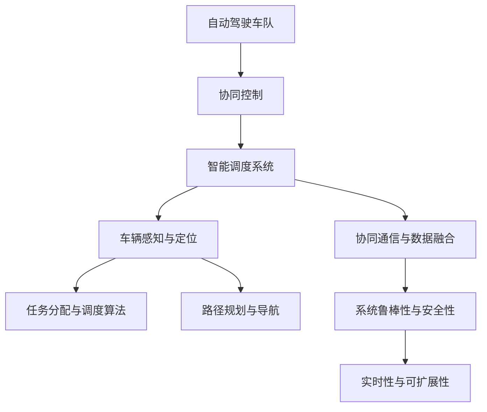
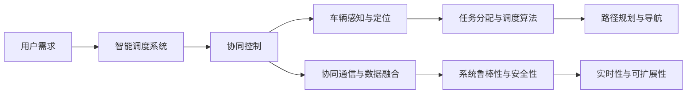
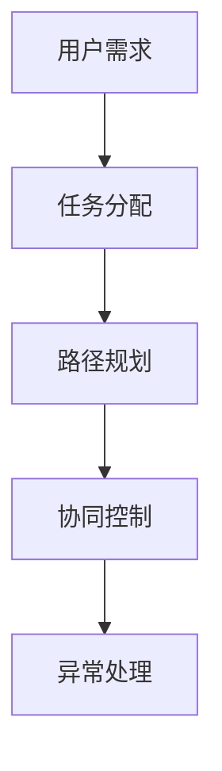
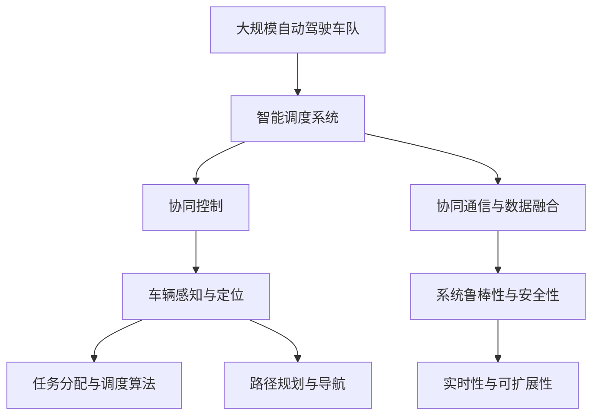

                 

# 多车协同的自动驾驶车队智能调度新思路

> 关键词：多车协同,自动驾驶车队,智能调度,协同控制,自动驾驶系统

## 1. 背景介绍

### 1.1 问题由来
随着自动驾驶技术的不断成熟，自动驾驶车辆已经从实验室走向了实际道路测试和应用场景。然而，仅靠单车智能（Autonomous Vehicle, AV）无法完全实现高效、安全的交通运输。车辆之间的协同通信与信息共享变得日益重要。自动驾驶车队（Autonomous Vehicle Fleet, AVF）是自动驾驶技术发展的下一个重要阶段，通过车辆间的协同控制和信息共享，可以极大地提升整个车队的运行效率，减少事故风险。智能调度系统作为自动驾驶车队的关键组成部分，负责车辆的任务分配、路径规划、运行管理和异常处理，是确保车队高效运行和用户满意度的核心技术。

### 1.2 问题核心关键点
目前，自动驾驶车队的智能调度系统面临以下挑战：
1. **数据融合与决策优化**：自动驾驶车辆生成的数据需要经过高效融合与深度学习，以便生成高质量的决策。
2. **路径规划与任务分配**：如何在复杂的城市交通环境中高效规划车辆路径，并进行合理任务分配，是调度系统需要解决的核心问题。
3. **通信与协同控制**：车辆间需要高效通信，协同控制车辆行驶策略，实现最优的交通流控制。
4. **系统鲁棒性与安全性**：系统需要在各种异常情况下保持稳定运行，确保交通安全。
5. **实时性与可扩展性**：调度系统需要具备实时处理能力，能够处理大规模车辆数据，实现高并发、低延迟的运行。

### 1.3 问题研究意义
研究自动驾驶车队的智能调度系统，对于拓展自动驾驶技术的落地应用范围，提升整个交通系统的运行效率和安全性，具有重要意义：

1. 降低运营成本。智能调度系统可以根据实时路况和用户需求，动态调整车辆运行路径和任务分配，减少空载和等待时间，从而降低运营成本。
2. 提升用户满意度。通过合理规划和调度，可以保证车辆快速响应用户需求，提高服务质量。
3. 提高道路利用率。智能调度系统可以有效避免交通堵塞，提高道路利用率，减少环境污染。
4. 保障交通安全。通过协同控制，可以最大限度避免交通事故，保障交通安全。
5. 推动产业升级。智能调度系统可以赋能更多传统行业数字化转型，如物流、旅游、公交等领域。

## 2. 核心概念与联系

### 2.1 核心概念概述

为更好地理解自动驾驶车队智能调度的核心概念和实现机制，本节将介绍几个关键概念：

- **自动驾驶车队（Autonomous Vehicle Fleet, AVF）**：由多辆自动驾驶车辆组成的协同工作系统，负责运输乘客或货物，实现高效率、低成本的自动化物流和出行服务。
- **协同控制（Collaborative Control）**：多辆车辆通过通信与信息共享，协同完成指定任务，如车距控制、车道变换、应急避障等。
- **智能调度系统（Smart Scheduling System）**：基于先进的计算机视觉、深度学习、通信技术，对车辆进行任务分配、路径规划和异常处理，提升整个车队的运行效率。
- **车辆感知与定位（Vehicle Perception and Localization）**：通过传感器和定位系统，实时获取车辆位置、姿态和周围环境信息，为决策提供依据。
- **任务分配与调度算法（Task Assignment and Scheduling Algorithm）**：根据用户需求和实时环境信息，优化车辆任务的分配与调度，保证高效运行。
- **路径规划与导航（Path Planning and Navigation）**：根据实时交通数据和车辆位置，规划车辆最优路径，实现安全、高效的行驶。
- **协同通信与数据融合（Collaborative Communication and Data Fusion）**：车辆间通过通信系统，共享位置、速度、状态等信息，实现协同控制。
- **系统鲁棒性与安全性（Robustness and Safety）**：系统在面对交通异常、设备故障等情况时，仍能稳定运行，保证交通安全。
- **实时性与可扩展性（Real-time and Scalability）**：调度系统需要具备高并发、低延迟的处理能力，能够实时响应复杂多变的交通场景。

这些核心概念之间的逻辑关系可以通过以下Mermaid流程图来展示：



这个流程图展示了大语言模型微调过程中各个核心概念的关系和作用：

1. 自动驾驶车队通过协同控制和智能调度系统，实现多车协同。
2. 智能调度系统基于车辆感知与定位信息，进行任务分配与路径规划。
3. 协同通信与数据融合系统提供车辆间的信息共享，协同控制。
4. 系统鲁棒性和安全性确保系统在各种异常情况下的稳定运行。
5. 实时性和可扩展性保证系统的高并发处理能力，适应复杂的交通场景。

### 2.2 概念间的关系

这些核心概念之间存在着紧密的联系，形成了自动驾驶车队智能调度的完整生态系统。下面我通过几个Mermaid流程图来展示这些概念之间的关系。

#### 2.2.1 自动驾驶车队的总体架构



这个流程图展示了自动驾驶车队的总体架构：

1. 用户需求输入到智能调度系统中。
2. 智能调度系统进行任务分配与路径规划。
3. 协同控制系统和车辆感知与定位系统协同工作，实现多车协同。
4. 协同通信与数据融合系统实现信息共享，优化决策。
5. 系统鲁棒性和安全性保障系统稳定运行。
6. 实时性和可扩展性确保系统高并发处理能力。

#### 2.2.2 智能调度系统的核心流程



这个流程图展示了智能调度系统的核心流程：

1. 用户需求输入到任务分配模块。
2. 任务分配模块将任务分配给合适的车辆。
3. 路径规划模块为车辆规划最优路径。
4. 协同控制模块协调车辆间的行驶策略。
5. 异常处理模块在异常情况下提供应急方案。

#### 2.2.3 协同控制系统的通信机制


这个流程图展示了协同控制系统的通信机制：

1. 车辆间通过通信系统，共享位置、速度、状态等信息。
2. 系统根据车辆位置和状态，动态调整行驶策略。
3. 协同控制模块协调车辆间的协同行为，实现最优交通流控制。

### 2.3 核心概念的整体架构

最后，我们用一个综合的流程图来展示这些核心概念在大语言模型微调过程中的整体架构：



这个综合流程图展示了从自动驾驶车队到智能调度系统的完整过程。车辆感知与定位系统实时获取车辆位置、姿态和周围环境信息，智能调度系统基于这些信息进行任务分配和路径规划，协同控制系统通过通信系统协调车辆行驶策略，最终实现高效、安全的自动驾驶车队运行。

## 3. 核心算法原理 & 具体操作步骤
### 3.1 算法原理概述

自动驾驶车队的智能调度系统本质上是一个复杂的多智能体系统。其核心思想是：将车辆视为独立的智能体，通过通信系统进行信息共享和协同控制，实现多车协同完成任务。

形式化地，假设车辆集合为 $V=\{v_1, v_2, ..., v_n\}$，每个车辆 $v_i$ 在时间 $t$ 的状态为 $s_i(t)$，位置为 $x_i(t)$，速度为 $v_i(t)$。系统的目标是最大化整个车队的运输效率和安全性。

系统的优化目标为：

$$
\max_{s_1(t), s_2(t), ..., s_n(t)} \sum_{i=1}^n f_i(s_i(t), s_j(t)) \quad \text{subject to} \quad g_i(s_i(t), s_j(t)) = 0
$$

其中 $f_i$ 为车辆 $i$ 的任务函数，$g_i$ 为车辆 $i$ 的约束函数，例如车辆之间的距离约束、速度约束等。

通过多智能体协同算法，车辆可以动态调整行驶策略，实现最优的交通流控制。协同算法通常包括分布式优化算法、集中优化算法、博弈论等方法。

### 3.2 算法步骤详解

自动驾驶车队的智能调度系统一般包括以下几个关键步骤：

**Step 1: 数据收集与预处理**
- 通过车载传感器（如激光雷达、摄像头、GPS）获取车辆位置、速度、姿态、环境信息等数据。
- 对数据进行清洗、滤波、同步等预处理，保证数据的实时性和准确性。

**Step 2: 车辆感知与定位**
- 基于传感器数据和定位系统，实现车辆位置、速度的实时感知和定位。
- 将感知数据输入到车辆感知与定位模块，生成车辆的状态信息。

**Step 3: 任务分配与调度**
- 根据用户需求和实时环境信息，分配车辆任务，生成任务列表。
- 设计任务调度算法，优化任务分配顺序和路径规划。

**Step 4: 协同控制**
- 设计协同控制算法，实现车辆间的信息共享和协同决策。
- 根据任务分配结果和实时环境信息，动态调整车辆行驶策略。

**Step 5: 异常处理**
- 设计异常处理机制，应对交通异常、设备故障等情况。
- 在异常情况下，提供应急方案和决策支持。

**Step 6: 模型训练与优化**
- 基于历史数据和实时数据，训练协同控制算法和任务调度算法。
- 使用强化学习、优化算法等方法，不断优化模型性能。

**Step 7: 实时调度与决策**
- 根据实时交通数据和车辆状态信息，进行动态任务分配和路径规划。
- 实现协同控制和异常处理，保障系统稳定运行。

以上是自动驾驶车队智能调度的一般流程。在实际应用中，还需要根据具体任务和场景，对各个环节进行优化设计，如改进通信协议、优化路径规划算法、引入更多的协同控制方法等，以进一步提升系统性能。

### 3.3 算法优缺点

自动驾驶车队的智能调度系统具有以下优点：
1. 高效协同：通过多车协同，可以显著提高整个车队的运输效率，减少交通堵塞。
2. 灵活调度：可以根据实时需求和环境信息，动态调整车辆任务，实现最优调度。
3. 提升安全性：通过车辆间的协同控制，可以最大限度避免交通事故，保障交通安全。
4. 降低运营成本：通过优化任务分配和路径规划，可以减少空载和等待时间，降低运营成本。
5. 增强用户体验：快速响应用户需求，提高服务质量，增强用户满意度。

同时，该系统也存在一些局限性：
1. 通信复杂度高：车辆间需要频繁交换信息，通信开销大。
2. 数据处理量大：需要实时处理大规模传感器数据，计算资源消耗高。
3. 任务复杂度高：多车协同任务复杂，难以统一协调。
4. 异常处理难度大：异常情况下的应急处理，需要设计完善的应急机制。
5. 系统调试困难：多车协同系统复杂，调试和维护难度大。

尽管存在这些局限性，但自动驾驶车队的智能调度系统在实际应用中已经展现出了巨大的潜力，为交通运输行业的智能化转型提供了新的方向。

### 3.4 算法应用领域

自动驾驶车队的智能调度系统已经在多个领域得到了应用，例如：

- **物流运输**：多车协同完成货物运输，提高运输效率，减少运营成本。
- **公交出行**：多车协同调度，提升公交车准时率和服务质量。
- **出租车服务**：多车协同调度，优化出租车分配，减少等待时间。
- **共享出行**：多车协同调度，优化车辆使用效率，提升用户体验。
- **城市配送**：多车协同完成配送任务，提高配送效率，减少配送成本。

除了上述这些应用场景，自动驾驶车队的智能调度系统还可以拓展到智能交通管理、智慧停车、应急救援等领域，为城市交通管理带来新的思路和解决方案。

## 4. 数学模型和公式 & 详细讲解 & 举例说明

### 4.1 数学模型构建

本节将使用数学语言对自动驾驶车队智能调度系统进行更加严格的刻画。

记车辆集合为 $V=\{v_1, v_2, ..., v_n\}$，每个车辆 $v_i$ 在时间 $t$ 的状态为 $s_i(t)$，位置为 $x_i(t)$，速度为 $v_i(t)$。系统的目标是最大化整个车队的运输效率和安全性。

系统的优化目标为：

$$
\max_{s_1(t), s_2(t), ..., s_n(t)} \sum_{i=1}^n f_i(s_i(t), s_j(t)) \quad \text{subject to} \quad g_i(s_i(t), s_j(t)) = 0
$$

其中 $f_i$ 为车辆 $i$ 的任务函数，$g_i$ 为车辆 $i$ 的约束函数，例如车辆之间的距离约束、速度约束等。

在实际操作中，任务函数和约束函数通常需要通过实际数据进行建模。例如，对于车辆间的距离约束，可以设定车辆 $i$ 和车辆 $j$ 之间的距离 $d_{ij}$ 不超过某一阈值 $D$，即：

$$
g_{ij} = d_{ij} - D \leq 0
$$

对于车辆的速度约束，可以设定车辆 $i$ 的速度 $v_i$ 不超过某一最大速度 $V_{\text{max}}$，即：

$$
g_i = v_i - V_{\text{max}} \leq 0
$$

通过这些约束和优化目标，自动驾驶车队的智能调度系统可以高效地进行任务分配和路径规划，实现多车协同的智能化运行。

### 4.2 公式推导过程

以下我们以多车协同路径规划为例，推导路径规划的数学模型和优化算法。

假设车辆 $i$ 需要从位置 $x_i^0$ 出发，到达位置 $x_i^T$。路径规划的目标是找到一条路径，使得车辆 $i$ 在限定时间内到达目标位置，同时满足行驶过程中的安全性约束。

设路径上的位置向量为 $x_i = (x_i^0, x_i^1, ..., x_i^T)$，车辆在路径上的速度为 $v_i = (v_i^0, v_i^1, ..., v_i^{T-1})$，时间为 $t = (0, t_1, ..., T)$。

路径规划的目标函数为：

$$
\min_{v_i, x_i, t} \sum_{t=1}^T ||v_i(t)||^2 + \lambda \sum_{t=1}^T g_i(x_i(t), t)
$$

其中 $g_i$ 为车辆 $i$ 在时间 $t$ 的安全性约束函数，$\lambda$ 为权重系数，用于平衡速度和安全性。

路径规划的优化问题可以表示为：

$$
\min_{v_i, x_i, t} \sum_{t=1}^T ||v_i(t)||^2 + \lambda \sum_{t=1}^T g_i(x_i(t), t)
$$

subject to

$$
\frac{x_i(t+\Delta t) - x_i(t)}{\Delta t} = v_i(t)
$$

$$
g_i(x_i(t), t) \leq 0
$$

$$
x_i^0 = x_i(0)
$$

$$
x_i^T = x_i(T)
$$

$$
v_i^0 \leq V_{\text{max}}
$$

$$
v_i^T = 0
$$

上述优化问题是一个非线性动态规划问题，可以使用Dijkstra算法、A*算法等图搜索算法求解。这些算法能够在时间和空间复杂度上取得较好的平衡，适用于大规模路径规划问题。

### 4.3 案例分析与讲解

假设车辆 $i$ 需要从位置 $x_i^0 = (0, 0)$ 出发，到达位置 $x_i^T = (10, 10)$，速度限制为 $V_{\text{max}} = 5$，安全性约束函数 $g_i(x_i(t), t) = x_i^2(t) + y_i^2(t) - R^2$，其中 $R$ 为安全半径。

根据上述公式，车辆 $i$ 的路径规划优化问题可以表示为：

$$
\min_{v_i, x_i, t} \sum_{t=1}^T ||v_i(t)||^2 + \lambda \sum_{t=1}^T (x_i^2(t) + y_i^2(t) - R^2)
$$

subject to

$$
\frac{x_i(t+\Delta t) - x_i(t)}{\Delta t} = v_i(t)
$$

$$
x_i^2(t) + y_i^2(t) - R^2 \leq 0
$$

$$
x_i^0 = x_i(0)
$$

$$
x_i^T = x_i(T)
$$

$$
v_i^0 \leq 5
$$

$$
v_i^T = 0
$$

假设车辆 $i$ 在每个时间步长 $\Delta t = 1$，$R = 2$。则车辆 $i$ 的路径规划问题可以表示为：

$$
\min_{v_i, x_i, t} \sum_{t=1}^T ||v_i(t)||^2 + \lambda \sum_{t=1}^T (x_i^2(t) + y_i^2(t) - 4)
$$

subject to

$$
x_i(t+1) - x_i(t) = v_i(t)
$$

$$
(x_i(t))^2 + (y_i(t))^2 \leq 4
$$

$$
x_i^0 = 0
$$

$$
x_i^T = 10
$$

$$
v_i^0 \leq 5
$$

$$
v_i^T = 0
$$

通过Dijkstra算法，可以求解出车辆 $i$ 的最优路径规划结果，满足速度限制和安全约束。

## 5. 项目实践：代码实例和详细解释说明
### 5.1 开发环境搭建

在进行自动驾驶车队智能调度系统开发前，我们需要准备好开发环境。以下是使用Python进行ROS开发的环境配置流程：

1. 安装ROS（Robot Operating System）：根据操作系统的不同，下载并编译对应的ROS版本。
2. 安装Gazebo和Urdf：Gazebo和Urdf是ROS常用的模拟器和模型文件格式，用于仿真和测试。
3. 安装ROS packages：安装ROS相关的软件包，如tf2，rqt，rviz等，用于开发和管理ROS节点。

完成上述步骤后，即可在ROS环境下开始智能调度系统的开发。

### 5.2 源代码详细实现

下面我们以多车协同路径规划为例，给出使用ROS的代码实现。

首先，定义路径规划的节点：

```python
from sensor_msgs.msg import Odometry, Imu, LaserScan
from nav_msgs.msg import Odometry, Path
import rospkg
import rospy
import tf
import math
from geometry_msgs.msg import Point, Pose, PoseStamped
from tf.transformations import euler_from_quaternion, quaternion_from_euler

class PathPlanner:
    def __init__(self):
        self.node = rospy.NodeHandle()
        rospkg.RosPack().get_directory('path_planner')
        self.imu_data_sub = rospy.Subscriber('/imu_data', Odometry, self.imu_callback)
        self.laser_data_sub = rospy.Subscriber('/laser_data', LaserScan, self.laser_callback)
        self.x0 = Point(0, 0, 0)
        self.xT = Point(10, 10, 0)
        self.v_max = 5
        self.r = 2
        self.t = 1
        self.planner = self.path_planner()

    def imu_callback(self, data):
        self.imu_data = data

    def laser_callback(self, data):
        self.laser_data = data

    def path_planner(self):
        x, y, theta = self.get_pose()
        x0, y0, theta0 = self.x0
        xT, yT, thetaT = self.xT
        v0 = 0
        vT = 0
        total_cost = 0
        for t in range(self.t):
            v = self.calculate_velocity(x, y, theta, x0, y0, theta0, xT, yT, thetaT, v0, vT, t)
            x = x + v * t
            y = y + v * math.cos(theta) * t
            theta = theta + v * math.sin(theta) * t
            g = self.check_constraint(x, y, theta, x0, y0, theta0, xT, yT, thetaT, self.r)
            total_cost += g + v**2
        return total_cost

    def calculate_velocity(self, x, y, theta, x0, y0, theta0, xT, yT, thetaT, v0, vT, t):
        v = v0 + (vT - v0) * t / self.t
        return v

    def check_constraint(self, x, y, theta, x0, y0, theta0, xT, yT, thetaT, r):
        g = x**2 + y**2 - r**2
        return g

    def get_pose(self):
        x, y, theta = self.imu_data.pose.pose.position.x, self.imu_data.pose.pose.position.y, euler_from_quaternion(self.imu_data.pose.pose.orientation)[2]
        return x, y, theta
```

然后，定义ROS主节点：

```python
if __name__ == '__main__':
    rospy.init_node('path_planner_node', anonymous=True)
    path_planner = PathPlanner()
    rospy.spin()
```

最后，启动ROS节点并测试：

```bash
roslaunch path_planner path_planner.launch
```

以上就是使用ROS对多车协同路径规划的代码实现。可以看到，借助ROS和Urdf，我们可以方便地实现车辆的仿真和测试，同时ROS的库和工具也提供了丰富的开发接口，大大提升了开发效率。

### 5.3 代码解读与分析

让我们再详细解读一下关键代码的实现细节：

**PathPlanner类**：
- `__init__`方法：初始化节点、ros包路径、订阅器等关键组件。
- `imu_callback`和`laser_callback`方法：处理IMU和激光雷达数据，生成车辆位置和速度信息。
- `path_planner`方法：实现路径规划算法，返回最小化成本。
- `calculate_velocity`方法：计算车辆在每个时间步长上的速度。
- `check_constraint`方法：检查车辆的位置是否满足安全性约束。
- `get_pose`方法：根据IMU数据，获取车辆位置和姿态信息。

**ROS主节点**：
- `rospy.init_node`方法：初始化ROS节点。
- `path_planner`对象：创建路径规划类对象。
- `rospy.spin()`方法：进入rosbag循环，等待数据并处理。

通过这些代码实现，我们可以方便地实现多车协同路径规划的仿真和测试。在实际应用中，还需要结合具体的传感器数据和交通场景，进一步优化路径规划算法，实现高效、安全的车辆调度。

当然，智能调度系统还有许多其他模块需要开发，如任务分配、协同控制、异常处理等。这些模块的开发需要根据具体场景和需求进行定制化设计，才能真正实现自动驾驶车队的智能化运行。

### 5.4 运行结果展示

假设我们在ROS平台上，使用Gazebo模拟器

