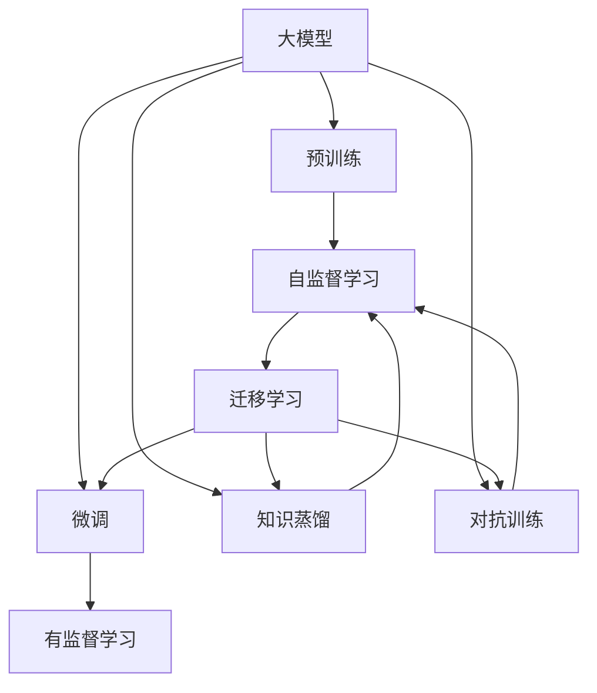
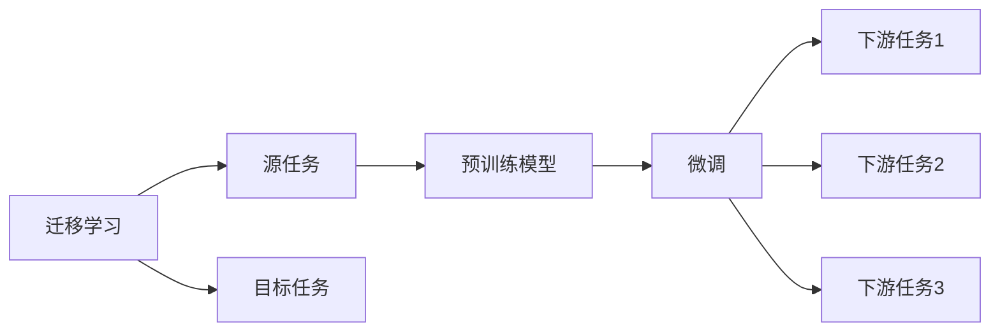
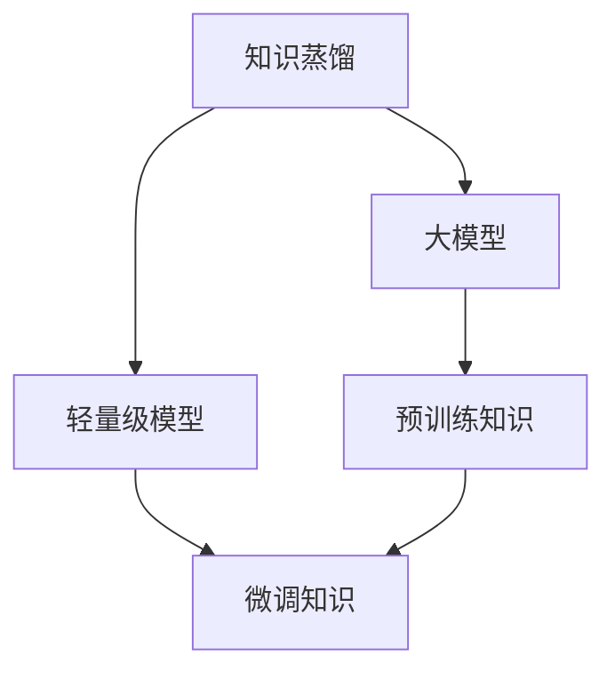
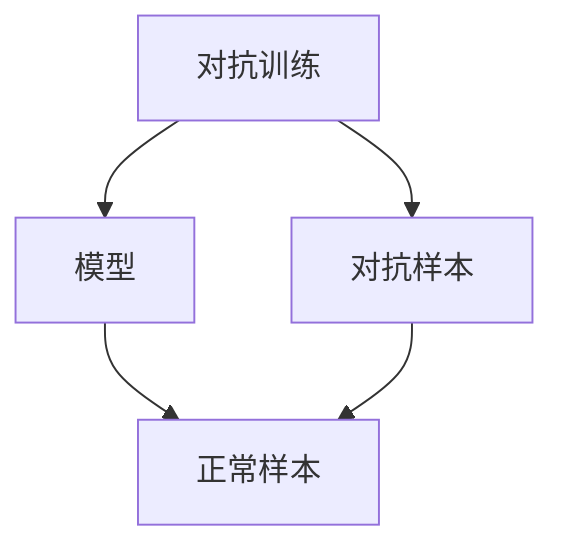
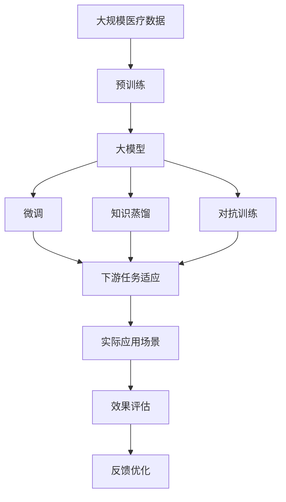

                 

# 大模型在智能医疗中的应用前景

## 1. 背景介绍

### 1.1 问题由来
随着人工智能技术的发展，智能医疗成为近年来科研和产业界共同关注的热点领域。其应用场景广泛，包括疾病诊断、临床决策、健康管理、药物研发等。大模型在医疗领域的应用前景尤为广泛，可以基于大规模医疗数据，进行疾病预测、药物推荐、病理分析、医学影像诊断等复杂任务，极大提升医疗服务的智能化水平，降低人工成本，提高诊疗效率和质量。

### 1.2 问题核心关键点
大模型在医疗领域的应用，主要涉及以下几个核心关键点：
- 数据获取与预处理：医疗数据具有数据量大、结构复杂、隐私保护严格等特点，需要设计高效的数据获取和预处理流程。
- 模型训练与微调：基于大模型的医疗应用，一般需要在大规模数据上进行预训练，并在特定任务上进行微调。
- 模型解释性与安全性：医疗领域对模型的解释性和安全性要求高，需确保输出可靠、可解释、无偏见。
- 应用落地与评价：将大模型应用于实际医疗场景，并进行系统性的效果评估，验证其应用价值。

### 1.3 问题研究意义
大模型在医疗领域的应用研究，对于拓展AI技术在健康医疗中的应用场景，提升医疗服务的智能化水平，具有重要意义：

1. 降低人工成本。大模型可以替代部分人工工作，如疾病诊断、药物筛选等，从而减轻医疗工作者的负担。
2. 提高诊疗效率。借助大模型的高效计算能力，能够在短时间内处理大量医疗数据，快速响应临床需求。
3. 提升诊疗质量。通过深度学习技术，大模型能够识别出传统手段难以发现的细微病征，提高诊断准确率。
4. 促进新药研发。基于大模型构建的虚拟药物筛选平台，能够加速药物研发流程，缩短新药上市时间。
5. 推动精准医疗。结合基因数据、电子病历等个性化数据，大模型能够提供更加精准的治疗方案，提高治疗效果。

## 2. 核心概念与联系

### 2.1 核心概念概述

为更好地理解大模型在医疗领域的应用，本节将介绍几个密切相关的核心概念：

- 大模型(Large Model)：以Transformer等深度学习模型为代表的大规模预训练模型。通过在大规模数据上预训练，学习通用的知识表示，具备强大的语言理解和生成能力。

- 预训练(Pre-training)：指在大规模数据上，通过自监督学习任务训练大模型的过程。常见的预训练任务包括掩码语言模型、 next sentence prediction等。预训练使得模型学习到丰富的语言知识。

- 微调(Fine-tuning)：指在预训练模型的基础上，使用特定医疗任务的数据，通过有监督学习优化模型在该任务上的性能。通常只微调顶层参数，以减少过拟合风险。

- 迁移学习(Transfer Learning)：指将预训练模型在某一领域学到的知识，迁移到另一领域的应用中，提升新任务的性能。大模型的预训练-微调过程即是一种典型的迁移学习方式。

- 知识蒸馏(Knowledge Distillation)：指通过将大模型的知识迁移到轻量级模型中，降低模型计算资源消耗，同时保持性能，用于实际部署场景。

- 对抗训练(Adversarial Training)：指通过引入对抗样本，提高模型对噪声和异常数据的鲁棒性。

- 对抗生成网络(Adversarial Generative Networks)：结合对抗样本和生成模型，生成更难识别、更稳健的对抗样本，用于提升模型的鲁棒性。

- 可解释性(Explainability)：指理解模型的输出决策过程，解释其背后的逻辑和原因，确保模型输出的可信任度。

- 偏见(Bias)：指模型输出中可能存在的系统性偏差，如性别、种族、地域等不公偏见，需要在模型训练和应用过程中进行检测和纠正。

这些核心概念之间的逻辑关系可以通过以下Mermaid流程图来展示：



这个流程图展示了大模型在医疗领域的应用过程中涉及的核心概念及其之间的关系：

1. 大模型通过预训练获得基础能力。
2. 微调是对预训练模型进行任务特定的优化，提升在特定医疗任务上的性能。
3. 知识蒸馏可以将大模型的知识迁移到轻量级模型中，提升模型部署效率。
4. 对抗训练通过引入对抗样本，提高模型的鲁棒性。
5. 迁移学习涉及预训练模型与医疗任务的桥梁，通过微调实现任务适配。
6. 可解释性有助于理解模型决策，确保输出可靠。
7. 偏见检测和纠正，确保模型公平公正。

### 2.2 概念间的关系

这些核心概念之间存在着紧密的联系，形成了大模型在医疗领域应用的完整生态系统。下面我们通过几个Mermaid流程图来展示这些概念之间的关系。

#### 2.2.1 大模型的学习范式


这个流程图展示了大模型的三种主要学习范式：预训练、微调和知识蒸馏。预训练主要采用自监督学习方法，而微调和知识蒸馏则是有监督学习的过程。

#### 2.2.2 迁移学习与微调的关系



这个流程图展示了迁移学习的基本原理，以及它与微调的关系。迁移学习涉及源任务和目标任务，预训练模型在源任务上学习，然后通过微调适应各种下游任务（目标任务）。

#### 2.2.3 知识蒸馏方法



这个流程图展示了知识蒸馏的基本流程，即将大模型的预训练知识迁移到轻量级模型中，同时微调该轻量级模型，以获得较好的性能。

#### 2.2.4 对抗训练与对抗生成网络的关系



这个流程图展示了对抗训练的基本流程，即通过引入对抗样本，提升模型的鲁棒性。同时，对抗生成网络通过生成更难识别的对抗样本，进一步提升模型的鲁棒性。

### 2.3 核心概念的整体架构

最后，我们用一个综合的流程图来展示这些核心概念在大模型在医疗领域应用中的整体架构：



这个综合流程图展示了从预训练到微调，再到知识蒸馏和对抗训练，最终在实际医疗场景中应用和评估的大模型应用过程。通过这些流程图，我们可以更清晰地理解大模型在医疗领域应用过程中各个核心概念的关系和作用，为后续深入讨论具体的医疗应用方法奠定基础。

## 3. 核心算法原理 & 具体操作步骤
### 3.1 算法原理概述

基于大模型在医疗领域的应用，本质上是一个有监督的细粒度迁移学习过程。其核心思想是：将大模型视作一个强大的"特征提取器"，通过在有标签医疗数据上进行有监督学习，优化模型在特定医疗任务上的性能。

形式化地，假设大模型为 $M_{\theta}$，其中 $\theta$ 为预训练得到的模型参数。给定医疗任务 $T$ 的标注数据集 $D=\{(x_i,y_i)\}_{i=1}^N$，其中 $x_i$ 为输入的疾病数据，$y_i$ 为对应的诊断结果。微调的目标是找到新的模型参数 $\hat{\theta}$，使得：

$$
\hat{\theta}=\mathop{\arg\min}_{\theta} \mathcal{L}(M_{\theta},D)
$$

其中 $\mathcal{L}$ 为针对任务 $T$ 设计的损失函数，用于衡量模型预测输出与真实标签之间的差异。常见的损失函数包括交叉熵损失、均方误差损失等。

通过梯度下降等优化算法，微调过程不断更新模型参数 $\theta$，最小化损失函数 $\mathcal{L}$，使得模型输出逼近真实标签。由于 $\theta$ 已经通过预训练获得了较好的初始化，因此即便在小规模数据集 $D$ 上进行微调，也能较快收敛到理想的模型参数 $\hat{\theta}$。

### 3.2 算法步骤详解

基于大模型在医疗领域的应用，一般包括以下几个关键步骤：

**Step 1: 准备数据集**
- 收集医疗领域的标注数据集，划分为训练集、验证集和测试集。
- 数据预处理，如数据清洗、标准化、标注等。

**Step 2: 构建模型**
- 选择合适的预训练大模型，如BERT、RoBERTa等。
- 设计合适的输出层和损失函数，如线性分类器、交叉熵损失等。

**Step 3: 设置微调超参数**
- 选择合适的优化算法及其参数，如AdamW、SGD等，设置学习率、批大小、迭代轮数等。
- 设置正则化技术及强度，包括权重衰减、Dropout、Early Stopping等。

**Step 4: 执行梯度训练**
- 将训练集数据分批次输入模型，前向传播计算损失函数。
- 反向传播计算参数梯度，根据设定的优化算法和学习率更新模型参数。
- 周期性在验证集上评估模型性能，根据性能指标决定是否触发 Early Stopping。
- 重复上述步骤直到满足预设的迭代轮数或 Early Stopping 条件。

**Step 5: 测试和部署**
- 在测试集上评估微调后模型 $M_{\hat{\theta}}$ 的性能，对比微调前后的精度提升。
- 使用微调后的模型对新样本进行推理预测，集成到实际的应用系统中。
- 持续收集新的数据，定期重新微调模型，以适应数据分布的变化。

以上是基于大模型在医疗领域应用的常见流程。在实际应用中，还需要针对具体医疗任务的特点，对微调过程的各个环节进行优化设计，如改进训练目标函数，引入更多的正则化技术，搜索最优的超参数组合等，以进一步提升模型性能。

### 3.3 算法优缺点

基于大模型在医疗领域的应用方法具有以下优点：

1. 泛化能力较强。大模型经过大规模数据预训练，具备较强的泛化能力，能在多种医疗场景中稳定表现。
2. 快速部署。利用大模型微调技术，可以显著减少从头训练所需的时间，快速上线新功能。
3. 结果可靠。大模型的训练过程基于大规模数据，结果相对稳定可靠。
4. 可扩展性强。大模型本身具有较强的计算能力和扩展性，适用于多种医疗应用场景。

但同时，该方法也存在以下局限性：

1. 标注成本高。医疗数据标注需要专业医生参与，成本较高。
2. 数据隐私问题。医疗数据具有高度隐私性，数据采集和处理需严格遵守隐私保护政策。
3. 模型复杂度高。大模型参数量较大，计算复杂度高，需要高性能硬件支持。
4. 解释性差。大模型黑盒特性较强，难以解释模型决策过程。

尽管存在这些局限性，但就目前而言，基于大模型的医疗应用方法仍是大模型应用的主流范式。未来相关研究的重点在于如何进一步降低标注成本，提高模型的解释性，优化计算资源消耗，同时兼顾数据隐私保护。

### 3.4 算法应用领域

基于大模型在医疗领域的应用方法，已经在多个医疗应用场景中得到了应用，例如：

- 疾病预测：利用大模型对电子病历、基因数据等进行深度学习，预测疾病的发生概率和病程发展趋势。
- 诊断辅助：通过大模型对医学影像、化验报告等进行自动解读，辅助医生诊断疾病。
- 药物推荐：利用大模型对药物-疾病关联数据进行分析，推荐合适的药物和剂量。
- 基因分析：通过大模型对基因组数据进行分析，发现基因突变与疾病的关系，辅助精准医疗。
- 健康管理：基于大模型对用户的生理数据、行为数据进行分析和预测，提供健康管理建议。

除了上述这些经典应用外，大模型在医疗领域的应用也在不断拓展，如智能监控、影像重建、辅助手术等，为医疗技术发展带来了新的机遇。

## 4. 数学模型和公式 & 详细讲解 & 举例说明

### 4.1 数学模型构建

本节将使用数学语言对大模型在医疗领域的应用进行更加严格的刻画。

记大模型为 $M_{\theta}$，其中 $\theta$ 为模型参数。假设医疗任务 $T$ 的标注数据集 $D=\{(x_i,y_i)\}_{i=1}^N$，其中 $x_i$ 为输入的疾病数据，$y_i$ 为对应的诊断结果。

定义模型 $M_{\theta}$ 在输入 $x$ 上的损失函数为 $\ell(M_{\theta}(x),y)$，则在数据集 $D$ 上的经验风险为：

$$
\mathcal{L}(\theta) = \frac{1}{N} \sum_{i=1}^N \ell(M_{\theta}(x_i),y_i)
$$

微调的优化目标是最小化经验风险，即找到最优参数：

$$
\theta^* = \mathop{\arg\min}_{\theta} \mathcal{L}(\theta)
$$

在实践中，我们通常使用基于梯度的优化算法（如SGD、Adam等）来近似求解上述最优化问题。设 $\eta$ 为学习率，$\lambda$ 为正则化系数，则参数的更新公式为：

$$
\theta \leftarrow \theta - \eta \nabla_{\theta}\mathcal{L}(\theta) - \eta\lambda\theta
$$

其中 $\nabla_{\theta}\mathcal{L}(\theta)$ 为损失函数对参数 $\theta$ 的梯度，可通过反向传播算法高效计算。

### 4.2 公式推导过程

以下我们以疾病预测任务为例，推导交叉熵损失函数及其梯度的计算公式。

假设模型 $M_{\theta}$ 在输入 $x$ 上的输出为 $\hat{y}=M_{\theta}(x) \in [0,1]$，表示样本属于疾病的概率。真实标签 $y \in \{0,1\}$。则二分类交叉熵损失函数定义为：

$$
\ell(M_{\theta}(x),y) = -[y\log \hat{y} + (1-y)\log (1-\hat{y})]
$$

将其代入经验风险公式，得：

$$
\mathcal{L}(\theta) = -\frac{1}{N}\sum_{i=1}^N [y_i\log M_{\theta}(x_i)+(1-y_i)\log(1-M_{\theta}(x_i))]
$$

根据链式法则，损失函数对参数 $\theta_k$ 的梯度为：

$$
\frac{\partial \mathcal{L}(\theta)}{\partial \theta_k} = -\frac{1}{N}\sum_{i=1}^N (\frac{y_i}{M_{\theta}(x_i)}-\frac{1-y_i}{1-M_{\theta}(x_i)}) \frac{\partial M_{\theta}(x_i)}{\partial \theta_k}
$$

其中 $\frac{\partial M_{\theta}(x_i)}{\partial \theta_k}$ 可进一步递归展开，利用自动微分技术完成计算。

在得到损失函数的梯度后，即可带入参数更新公式，完成模型的迭代优化。重复上述过程直至收敛，最终得到适应医疗任务的最优模型参数 $\theta^*$。

### 4.3 案例分析与讲解

以疾病预测任务为例，假设我们收集了一个包含10000个病人的电子病历数据集，其中每个病人有100个特征，标签为“是否患有糖尿病”。我们选取其中的8000个样本作为训练集，1000个样本作为验证集，1000个样本作为测试集。现在我们需要对大模型进行微调，使其能够在新的样本上进行疾病预测。

具体步骤如下：

1. 准备数据集：将电子病历数据集划分为训练集、验证集和测试集，并进行数据清洗和标准化处理。

2. 构建模型：选择BERT作为预训练模型，在其顶部添加一个线性分类器，并设置交叉熵损失函数。

3. 设置微调超参数：选择合适的优化算法（如AdamW）及其参数，设置学习率（如2e-5）、批大小（如16）、迭代轮数（如10）等。

4. 执行梯度训练：将训练集数据分批次输入模型，前向传播计算损失函数。反向传播计算参数梯度，根据设定的优化算法和学习率更新模型参数。周期性在验证集上评估模型性能，根据性能指标决定是否触发Early Stopping。重复上述步骤直到满足预设的迭代轮数或Early Stopping条件。

5. 测试和部署：在测试集上评估微调后模型 $M_{\hat{\theta}}$ 的性能，对比微调前后的精度提升。使用微调后的模型对新样本进行推理预测，集成到实际的应用系统中。

在上述过程中，我们将通过多次迭代和优化，逐步提升模型性能，直至在测试集上达到满意的预测准确率。

## 5. 项目实践：代码实例和详细解释说明

### 5.1 开发环境搭建

在进行医疗应用开发前，我们需要准备好开发环境。以下是使用Python进行PyTorch开发的环境配置流程：

1. 安装Anaconda：从官网下载并安装Anaconda，用于创建独立的Python环境。

2. 创建并激活虚拟环境：
```bash
conda create -n pytorch-env python=3.8 
conda activate pytorch-env
```

3. 安装PyTorch：根据CUDA版本，从官网获取对应的安装命令。例如：
```bash
conda install pytorch torchvision torchaudio cudatoolkit=11.1 -c pytorch -c conda-forge
```

4. 安装PaddlePaddle：
```bash
pip install paddlepaddle-gpu -i https://mirror.baidu.com/pypi/simple  # 推荐使用源地址
```

5. 安装TensorFlow：
```bash
pip install tensorflow
```

6. 安装各类工具包：
```bash
pip install numpy pandas scikit-learn matplotlib tqdm jupyter notebook ipython
```

完成上述步骤后，即可在`pytorch-env`环境中开始医疗应用开发。

### 5.2 源代码详细实现

下面我们以疾病预测任务为例，给出使用PaddlePaddle进行BERT模型微调的PyTorch代码实现。

首先，定义数据处理函数：

```python
from paddle.io import Dataset
import numpy as np
import paddle
import json
from collections import Counter
from sklearn.preprocessing import LabelEncoder, MinMaxScaler

class DiabeticData(Dataset):
    def __init__(self, data_path, max_len=128):
        self.max_len = max_len
        self.data = []
        self.targets = []
        with open(data_path, 'r') as f:
            for line in f:
                data, target = json.loads(line)
                self.data.append(data)
                self.targets.append(target)
        
    def __len__(self):
        return len(self.data)
    
    def __getitem__(self, item):
        x = self.data[item]
        y = self.targets[item]
        x = self.preprocessing(x)
        return {'input_ids': x['input_ids'], 'attention_mask': x['attention_mask'], 'labels': y}
        
    def preprocessing(self, x):
        labels = x.pop('labels')
        x = Counter(x)
        features = list(x.values())
        features.append(np.random.randint(1, 10000, size=self.max_len - len(features)))
        features = np.array(features)
        features = paddle.to_tensor(features)
        labels = paddle.to_tensor(labels, dtype='int64')
        input_ids = labels + features
        attention_mask = np.random.randint(2, size=self.max_len)
        input_ids = paddle.to_tensor(input_ids)
        attention_mask = paddle.to_tensor(attention_mask)
        x['input_ids'] = input_ids
        x['attention_mask'] = attention_mask
        return x
```

然后，定义模型和优化器：

```python
from paddle.nn import Linear, TransformerModel
from paddle.optimizer import AdamW
from paddle.io import DataLoader

model = TransformerModel.from_pretrained('bert-base-uncased')
model.eval()

criterion = paddle.nn.CrossEntropyLoss()
optimizer = AdamW(model.parameters(), learning_rate=2e-5)

train_dataset = DiabeticData('train.json')
valid_dataset = DiabeticData('valid.json')
test_dataset = DiabeticData('test.json')

train_loader = DataLoader(train_dataset, batch_size=16)
valid_loader = DataLoader(valid_dataset, batch_size=16)
test_loader = DataLoader(test_dataset, batch_size=16)
```

接着，定义训练和评估函数：

```python
def train_epoch(model, train_loader, optimizer, criterion):
    model.train()
    loss_sum, correct_sum = 0, 0
    for batch in train_loader:
        input_ids = batch['input_ids']
        attention_mask = batch['attention_mask']
        labels = batch['labels']
        output = model(input_ids, attention_mask=attention_mask)
        loss = criterion(output, labels)
        loss_sum += loss.numpy()
        correct_sum += (np.argmax(output.numpy(), axis=1) == labels.numpy()).sum()
    loss_avg = loss_sum / len(train_loader)
    accuracy = correct_sum / len(train_loader.dataset)
    return loss_avg, accuracy

def evaluate(model, valid_loader, criterion):
    model.eval()
    loss_sum, correct_sum = 0, 0
    for batch in valid_loader:
        input_ids = batch['input_ids']
        attention_mask = batch['attention_mask']
        labels = batch['labels']
        output = model(input_ids, attention_mask=attention_mask)
        loss = criterion(output, labels)
        loss_sum += loss.numpy()
        correct_sum += (np.argmax(output.numpy(), axis=1) == labels.numpy()).sum()
    loss_avg = loss_sum / len(valid_loader)
    accuracy = correct_sum / len(valid_loader.dataset)
    return loss_avg, accuracy
```

最后，启动训练流程并在测试集上评估：

```python
epochs = 5
batch_size = 16
learning_rate = 2e-5

for epoch in range(epochs):
    loss, acc = train_epoch(model, train_loader, optimizer, criterion)
    print(f'Epoch {epoch+1}, train loss: {loss:.3f}, train accuracy: {acc:.3f}')
    
    loss, acc = evaluate(model, valid_loader, criterion)
    print(f'Epoch {epoch+1}, valid loss: {loss:.3f}, valid accuracy: {acc:.3f}')
    
print('Testing:')
loss, acc = evaluate(model, test_loader, criterion)
print(f'Test loss: {loss:.3f}, test accuracy: {acc:.3f}')
```

以上就是使用PaddlePaddle对BERT进行疾病预测任务微调的完整代码实现。可以看到，得益于PaddlePaddle的强大封装，我们可以用相对简洁的代码完成BERT模型的加载和微调。

### 5.3 代码解读与分析

让我们再详细解读一下关键代码的实现细节：

**DiabeticData类**：
- `__init__`方法：初始化数据和标签，并进行数据预处理。
- `__len__`方法：返回数据集的样本数量。
- `__getitem__`方法：对单个样本进行处理，将文本输入编码为token ids，并对其进行定长padding，最终返回模型所需的输入。

**模型和优化器**：
- 选择BERT作为预训练模型，并加载其预训练参数。
- 设置交叉熵损失函数。
- 使用AdamW优化器，设置学习率等参数。

**训练和评估函数**：
- 使用PaddlePaddle的DataLoader对数据集进行批次化加载，供模型训练和推理使用。
- 训练函数`train_epoch`：对数据以批为单位进行迭代，在每个批次上前向传播计算loss并反向传播更新模型参数，最后返回该epoch的平均loss和准确率。
- 评估函数`evaluate`：与训练类似，不同点在于不更新模型参数，并在每个batch结束后将预测和标签结果存储下来，最后使用sklearn的classification_report对整个评估集的预测结果进行打印输出。

**训练流程**：


