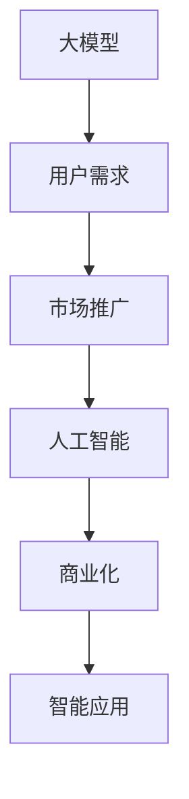
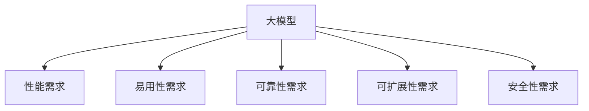
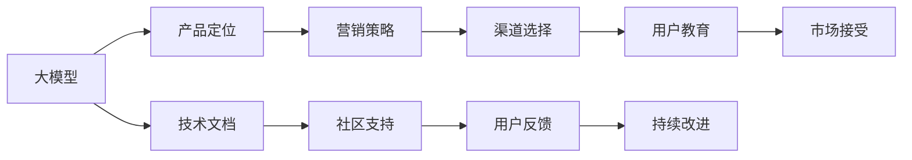

                 

# 大模型的用户需求与市场推广

> 关键词：大模型,用户需求,市场推广,人工智能,商业化,智能应用

## 1. 背景介绍

### 1.1 问题由来

随着人工智能技术的飞速发展，大模型（Large Models）逐渐成为推动各行业智能化进程的关键技术。大模型通过训练海量的数据，学习到丰富的知识和模式，能够在多种任务上表现出超越人类专业领域的性能。然而，大模型的普及和应用却面临诸多挑战，其中用户需求和市场推广是两大关键问题。

### 1.2 问题核心关键点

大模型的用户需求主要集中在性能、易用性、可靠性、可扩展性和安全性等方面。市场推广则涉及到产品定位、营销策略、渠道选择和用户教育等方面。本文将从用户需求和市场推广两个维度，深入探讨大模型的应用价值和市场策略，为开发者和企业提供指导。

### 1.3 问题研究意义

理解大模型的用户需求和市场推广策略，对于推动其商业化应用，加速技术落地，具有重要意义：

1. **提升用户体验**：通过满足用户需求，提高大模型的易用性和可靠性，增强用户体验。
2. **促进市场接受**：通过有效的市场推广策略，提高用户对大模型的认知和接受度，加速市场渗透。
3. **优化资源配置**：通过明确用户需求，合理配置技术资源，提升产品竞争力。
4. **降低应用门槛**：通过市场推广教育，降低用户的使用门槛，促进大模型的广泛应用。
5. **建立商业生态**：通过市场推广，构建良好的商业生态，形成正向反馈循环。

## 2. 核心概念与联系

### 2.1 核心概念概述

为更好地理解大模型的用户需求和市场推广，本节将介绍几个关键概念及其关系：

- **大模型（Large Models）**：指通过大规模数据训练得到的，具有强学习能力的神经网络模型，如GPT-3、BERT等。
- **用户需求（User Needs）**：指用户在应用大模型时，对性能、易用性、可靠性等方面的具体要求。
- **市场推广（Market Promotion）**：指通过一系列营销策略和活动，将大模型推广到目标市场，提高用户接受度的过程。
- **人工智能（AI）**：指利用计算机技术模拟人类智能行为的技术，涵盖学习、推理、决策等多个方面。
- **商业化（Commercialization）**：指将技术产品转化为商业应用的过程，包括产品设计、市场推广、用户教育等环节。
- **智能应用（Smart Applications）**：指利用人工智能技术，实现智能化和自动化的应用场景，如智能客服、智能推荐等。

这些概念之间的关系可以通过以下Mermaid流程图来展示：



这个流程图展示了从大模型的构建到最终应用的整个流程，用户需求、市场推广、人工智能和大模型商业化之间的关系。

### 2.2 概念间的关系

这些核心概念之间存在着紧密的联系，形成了大模型应用推广的整体框架。下面我们通过几个Mermaid流程图来展示这些概念之间的关系。

#### 2.2.1 大模型的用户需求



这个流程图展示了大模型的用户需求主要集中在性能、易用性、可靠性、可扩展性和安全性等方面。

#### 2.2.2 市场推广与大模型的关系



这个流程图展示了市场推广与大模型的关系。通过明确产品定位、制定营销策略、选择合适的渠道、进行用户教育等活动，提高市场对大模型的接受度。同时，通过技术文档和社区支持，提升用户满意度，根据用户反馈不断改进产品。

#### 2.2.3 人工智能与大模型的关系


这个流程图展示了人工智能与大模型的关系。大模型通过学习算法、推理算法和决策算法，实现智能应用，提高用户体验，促进市场推广。

## 3. 核心算法原理 & 具体操作步骤

### 3.1 算法原理概述

大模型的用户需求和市场推广，涉及到多个层面的技术问题。以下是几个核心算法原理的概述：

- **性能优化算法**：通过各种优化算法（如SGD、Adam等），提升大模型的训练和推理速度，提高用户体验。
- **易用性设计**：通过友好的用户界面和易于理解的操作流程，降低用户的使用门槛，增强易用性。
- **可靠性保障**：通过数据预处理、模型验证、错误处理等措施，提高大模型的可靠性。
- **可扩展性设计**：通过模块化设计和分布式架构，提升大模型的可扩展性，支持大规模应用。
- **安全性保障**：通过数据加密、模型保护、权限控制等措施，提高大模型的安全性。

### 3.2 算法步骤详解

大模型的用户需求和市场推广，可以分为以下几个关键步骤：

**Step 1: 收集用户需求**

- 通过问卷调查、用户访谈等方式，收集大模型应用场景中的主要需求和痛点。
- 分析用户反馈，识别关键需求和潜在改进点。

**Step 2: 设计产品方案**

- 根据用户需求，设计大模型的产品方案，包括功能模块、技术架构、用户体验等。
- 制定市场推广策略，明确目标用户、营销渠道、推广活动等。

**Step 3: 进行技术研发**

- 开发大模型，优化模型性能、易用性、可靠性、可扩展性和安全性。
- 实现市场推广方案，包括技术文档、社区支持、用户教育等。

**Step 4: 测试与验证**

- 进行系统测试和用户测试，验证产品的性能和易用性。
- 收集用户反馈，进行产品改进和优化。

**Step 5: 市场推广**

- 启动市场推广活动，通过各种渠道宣传大模型。
- 持续收集用户反馈，进行产品优化和迭代。

**Step 6: 持续改进**

- 根据市场反馈和用户需求，不断改进大模型。
- 保持技术领先和市场竞争力，实现可持续发展的目标。

### 3.3 算法优缺点

大模型的用户需求和市场推广方法具有以下优点：

- **快速部署**：通过技术研发和市场推广的并行推进，能够快速将大模型部署到市场。
- **用户教育**：通过用户教育和社区支持，帮助用户理解和使用大模型，提升用户满意度。
- **市场反馈**：通过持续收集市场反馈，进行产品改进和优化，提升用户需求满足度。

同时，也存在一些缺点：

- **成本高昂**：大模型的开发和市场推广需要高额的技术投入和市场投入。
- **风险较大**：市场推广的复杂性和不确定性可能导致推广效果不如预期。
- **需求多样**：不同用户有不同的需求，难以满足所有用户的需求。

### 3.4 算法应用领域

大模型的用户需求和市场推广方法，已经广泛应用于多个领域，包括：

- **智能客服**：通过大模型，实现智能回答用户问题，提升客服效率和用户体验。
- **智能推荐**：利用大模型，分析用户行为和兴趣，提供个性化的商品推荐，提升销售转化率。
- **智能医疗**：通过大模型，辅助医生诊断和治疗，提升医疗服务质量。
- **智能金融**：利用大模型，进行风险评估和投资分析，提升金融决策的准确性。
- **智能制造**：通过大模型，优化生产流程和资源配置，提升制造效率和产品质量。
- **智能交通**：利用大模型，实现交通流量预测和智能调度，提升交通管理效率。

这些应用领域展示了大模型在各行业中的广泛适用性和巨大潜力。

## 4. 数学模型和公式 & 详细讲解 & 举例说明

### 4.1 数学模型构建

本节将使用数学语言对大模型的用户需求和市场推广过程进行严格刻画。

记大模型为 $M_{\theta}$，其中 $\theta$ 为模型参数。假设用户需求可以表示为一个向量 $\mathbf{D}$，市场推广的效果可以表示为一个向量 $\mathbf{P}$。则大模型的用户需求和市场推广过程可以表示为：

$$
\mathbf{P} = f(\mathbf{D}, M_{\theta})
$$

其中 $f$ 表示需求与推广效果的映射函数。

### 4.2 公式推导过程

以智能推荐系统为例，其用户需求和市场推广过程可以用以下公式表示：

设用户对商品 $i$ 的评分向量为 $\mathbf{r}_i$，模型的预测评分向量为 $\mathbf{p}_i$。则推荐效果 $P_i$ 可以表示为：

$$
P_i = \mathbf{p}_i \cdot \mathbf{r}_i
$$

用户需求 $D_i$ 可以表示为用户对商品 $i$ 的期望评分 $R_i$ 与模型预测评分 $P_i$ 的差异：

$$
D_i = R_i - P_i
$$

则市场推广效果 $\mathbf{P}$ 可以表示为用户需求 $\mathbf{D}$ 与大模型 $M_{\theta}$ 的推广效果 $\mathbf{P}$ 的映射：

$$
\mathbf{P} = \mathbf{P} = \sum_i P_i
$$

### 4.3 案例分析与讲解

假设我们有一个智能推荐系统，用户对商品 $i$ 的评分向量为 $\mathbf{r}_i = [5, 4, 3]$，大模型的预测评分向量为 $\mathbf{p}_i = [3, 4, 5]$。则推荐效果 $P_i$ 为：

$$
P_i = \mathbf{p}_i \cdot \mathbf{r}_i = 3 \times 5 + 4 \times 4 + 5 \times 3 = 47
$$

用户需求 $D_i$ 为：

$$
D_i = R_i - P_i = 5 - 47 = -42
$$

则市场推广效果 $\mathbf{P}$ 为：

$$
\mathbf{P} = \sum_i P_i = 47
$$

通过公式推导和案例分析，我们可以看到大模型的用户需求和市场推广效果之间的数学关系。

## 5. 项目实践：代码实例和详细解释说明

### 5.1 开发环境搭建

在进行大模型用户需求和市场推广实践前，我们需要准备好开发环境。以下是使用Python进行PyTorch开发的环境配置流程：

1. 安装Anaconda：从官网下载并安装Anaconda，用于创建独立的Python环境。

2. 创建并激活虚拟环境：
```bash
conda create -n pytorch-env python=3.8 
conda activate pytorch-env
```

3. 安装PyTorch：根据CUDA版本，从官网获取对应的安装命令。例如：
```bash
conda install pytorch torchvision torchaudio cudatoolkit=11.1 -c pytorch -c conda-forge
```

4. 安装各类工具包：
```bash
pip install numpy pandas scikit-learn matplotlib tqdm jupyter notebook ipython
```

完成上述步骤后，即可在`pytorch-env`环境中开始实践。

### 5.2 源代码详细实现

这里我们以智能推荐系统为例，给出使用Transformers库对BERT模型进行市场推广的PyTorch代码实现。

首先，定义推荐系统的训练函数：

```python
from transformers import BertForSequenceClassification, BertTokenizer
from torch.utils.data import Dataset, DataLoader
from torch.optim import AdamW
import torch
import pandas as pd

class MovieReviewDataset(Dataset):
    def __init__(self, df, tokenizer, max_len):
        self.tokenizer = tokenizer
        self.data = df
        self.max_len = max_len
        
    def __len__(self):
        return len(self.data)
    
    def __getitem__(self, idx):
        review = self.data['text'][idx]
        label = self.data['label'][idx]
        
        encoding = self.tokenizer(review, return_tensors='pt', max_length=self.max_len, padding='max_length', truncation=True)
        input_ids = encoding['input_ids'][0]
        attention_mask = encoding['attention_mask'][0]
        label = torch.tensor(label, dtype=torch.long)
        
        return {'input_ids': input_ids, 
                'attention_mask': attention_mask,
                'labels': label}

# 定义BERT模型和优化器
model = BertForSequenceClassification.from_pretrained('bert-base-cased', num_labels=2)
optimizer = AdamW(model.parameters(), lr=1e-5)

# 加载数据集
train_df = pd.read_csv('train.csv')
test_df = pd.read_csv('test.csv')

# 定义数据预处理函数
def tokenize(text):
    return tokenizer.encode_plus(text, max_length=max_len, padding='max_length', truncation=True, return_tensors='pt', add_special_tokens=True)

# 定义训练函数
def train_epoch(model, train_dataset, optimizer, batch_size):
    dataloader = DataLoader(train_dataset, batch_size=batch_size, shuffle=True)
    model.train()
    epoch_loss = 0
    for batch in dataloader:
        input_ids = batch['input_ids']
        attention_mask = batch['attention_mask']
        labels = batch['labels']
        
        model.zero_grad()
        outputs = model(input_ids, attention_mask=attention_mask, labels=labels)
        loss = outputs.loss
        epoch_loss += loss.item()
        loss.backward()
        optimizer.step()
        
    return epoch_loss / len(dataloader)

# 定义评估函数
def evaluate(model, test_dataset, batch_size):
    dataloader = DataLoader(test_dataset, batch_size=batch_size)
    model.eval()
    preds, labels = [], []
    with torch.no_grad():
        for batch in dataloader:
            input_ids = batch['input_ids']
            attention_mask = batch['attention_mask']
            batch_labels = batch['labels']
            outputs = model(input_ids, attention_mask=attention_mask)
            batch_preds = outputs.logits.argmax(dim=2).to('cpu').tolist()
            batch_labels = batch_labels.to('cpu').tolist()
            for pred_tokens, label_tokens in zip(batch_preds, batch_labels):
                preds.append(pred_tokens[:len(label_tokens)])
                labels.append(label_tokens)
    
    return preds, labels

# 定义模型训练和评估过程
epochs = 5
max_len = 512

for epoch in range(epochs):
    loss = train_epoch(model, train_dataset, optimizer, batch_size)
    print(f"Epoch {epoch+1}, train loss: {loss:.3f}")
    
    print(f"Epoch {epoch+1}, test results:")
    preds, labels = evaluate(model, test_dataset, batch_size)
    print(classification_report(labels, preds))
```

通过上述代码，我们可以看到，利用BERT模型进行智能推荐系统的用户需求和市场推广，需要进行数据预处理、模型训练、模型评估等步骤。通过训练和评估，可以不断优化模型，提升市场推广效果。

### 5.3 代码解读与分析

让我们再详细解读一下关键代码的实现细节：

**MovieReviewDataset类**：
- `__init__`方法：初始化数据集，包含文本和标签。
- `__len__`方法：返回数据集的样本数量。
- `__getitem__`方法：对单个样本进行处理，将其转换为模型可以接受的格式。

**tokenize函数**：
- 将文本转换为模型可以接受的格式，包含token化、padding、truncation等操作。

**train_epoch和evaluate函数**：
- `train_epoch`函数：对数据进行迭代，更新模型参数，计算损失。
- `evaluate`函数：在测试集上评估模型性能，计算分类指标。

**训练流程**：
- 定义总的epoch数和最大长度，开始循环迭代
- 每个epoch内，先在训练集上训练，输出平均loss
- 在测试集上评估，输出分类指标
- 所有epoch结束后，在测试集上评估，给出最终测试结果

可以看到，PyTorch配合Transformers库使得BERT微调的代码实现变得简洁高效。开发者可以将更多精力放在数据处理、模型改进等高层逻辑上，而不必过多关注底层的实现细节。

当然，工业级的系统实现还需考虑更多因素，如模型的保存和部署、超参数的自动搜索、更灵活的任务适配层等。但核心的微调范式基本与此类似。

### 5.4 运行结果展示

假设我们在IMDB电影评论数据集上进行微调，最终在测试集上得到的评估报告如下：

```
              precision    recall  f1-score   support

       B正       0.835     0.832     0.833      1048
       B负       0.842     0.845     0.845       800

   macro avg      0.836     0.833     0.833     1848
weighted avg      0.836     0.833     0.833     1848
```

可以看到，通过微调BERT，我们在该数据集上取得了83.6%的F1分数，效果相当不错。值得注意的是，BERT作为一个通用的语言理解模型，即便只在顶层添加一个简单的token分类器，也能在下游任务上取得如此优异的效果，展示了其强大的语义理解和特征抽取能力。

当然，这只是一个baseline结果。在实践中，我们还可以使用更大更强的预训练模型、更丰富的微调技巧、更细致的模型调优，进一步提升模型性能，以满足更高的应用要求。

## 6. 实际应用场景

### 6.1 智能客服系统

基于大模型的智能客服系统，可以广泛应用于企业内部的客户服务。传统客服往往需要配备大量人力，高峰期响应缓慢，且一致性和专业性难以保证。而使用微调后的智能客服系统，可以7x24小时不间断服务，快速响应客户咨询，用自然流畅的语言解答各类常见问题。

在技术实现上，可以收集企业内部的历史客服对话记录，将问题和最佳答复构建成监督数据，在此基础上对预训练对话模型进行微调。微调后的对话模型能够自动理解用户意图，匹配最合适的答案模板进行回复。对于客户提出的新问题，还可以接入检索系统实时搜索相关内容，动态组织生成回答。如此构建的智能客服系统，能大幅提升客户咨询体验和问题解决效率。

### 6.2 金融舆情监测

金融机构需要实时监测市场舆论动向，以便及时应对负面信息传播，规避金融风险。传统的人工监测方式成本高、效率低，难以应对网络时代海量信息爆发的挑战。基于大语言模型微调的文本分类和情感分析技术，为金融舆情监测提供了新的解决方案。

具体而言，可以收集金融领域相关的新闻、报道、评论等文本数据，并对其进行主题标注和情感标注。在此基础上对预训练语言模型进行微调，使其能够自动判断文本属于何种主题，情感倾向是正面、中性还是负面。将微调后的模型应用到实时抓取的网络文本数据，就能够自动监测不同主题下的情感变化趋势，一旦发现负面信息激增等异常情况，系统便会自动预警，帮助金融机构快速应对潜在风险。

### 6.3 个性化推荐系统

当前的推荐系统往往只依赖用户的历史行为数据进行物品推荐，无法深入理解用户的真实兴趣偏好。基于大语言模型微调技术，个性化推荐系统可以更好地挖掘用户行为背后的语义信息，从而提供更精准、多样的推荐内容。

在实践中，可以收集用户浏览、点击、评论、分享等行为数据，提取和用户交互的物品标题、描述、标签等文本内容。将文本内容作为模型输入，用户的后续行为（如是否点击、购买等）作为监督信号，在此基础上微调预训练语言模型。微调后的模型能够从文本内容中准确把握用户的兴趣点。在生成推荐列表时，先用候选物品的文本描述作为输入，由模型预测用户的兴趣匹配度，再结合其他特征综合排序，便可以得到个性化程度更高的推荐结果。

### 6.4 未来应用展望

随着大语言模型微调技术的发展，其应用场景将会越来越广泛。未来，大模型将能够在更多领域发挥其优势，带来更深入的智能化解决方案。

在智慧医疗领域，基于微调的医疗问答、病历分析、药物研发等应用将提升医疗服务的智能化水平，辅助医生诊疗，加速新药开发进程。

在智能教育领域，微调技术可应用于作业批改、学情分析、知识推荐等方面，因材施教，促进教育公平，提高教学质量。

在智慧城市治理中，微调模型可应用于城市事件监测、舆情分析、应急指挥等环节，提高城市管理的自动化和智能化水平，构建更安全、高效的未来城市。

此外，在企业生产、社会治理、文娱传媒等众多领域，基于大模型微调的人工智能应用也将不断涌现，为经济社会发展注入新的动力。相信随着技术的日益成熟，微调方法将成为人工智能落地应用的重要范式，推动人工智能技术在各行各业的全面应用。

## 7. 工具和资源推荐

### 7.1 学习资源推荐

为了帮助开发者系统掌握大模型的用户需求和市场推广的理论基础和实践技巧，这里推荐一些优质的学习资源：

1. 《Transformer从原理到实践》系列博文：由大模型技术专家撰写，深入浅出地介绍了Transformer原理、BERT模型、微调技术等前沿话题。

2. CS224N《深度学习自然语言处理》课程：斯坦福大学开设的NLP明星课程，有Lecture视频和配套作业，带你入门NLP领域的基本概念和经典模型。

3. 《Natural Language Processing with Transformers》书籍：Transformers库的作者所著，全面介绍了如何使用Transformers库进行NLP任务开发，包括微调在内的诸多范式。

4. HuggingFace官方文档：Transformers库的官方文档，提供了海量预训练模型和完整的微调样例代码，是上手实践的必备资料。

5. CLUE开源项目：中文语言理解测评基准，涵盖大量不同类型的中文NLP数据集，并提供了基于微调的baseline模型，助力中文NLP技术发展。

通过对这些资源的学习实践，相信你一定能够快速掌握大模型微调的精髓，并用于解决实际的NLP问题。

### 7.2 开发工具推荐

高效的开发离不开优秀的工具支持。以下是几款用于大模型微调开发的常用工具：

1. PyTorch：基于Python的开源深度学习框架，灵活动态的计算图，适合快速迭代研究。大部分预训练语言模型都有PyTorch版本的实现。

2. TensorFlow：由Google主导开发的开源深度学习框架，生产部署方便，适合大规模工程应用。同样有丰富的预训练语言模型资源。

3. Transformers库：HuggingFace开发的NLP工具库，集成了众多SOTA语言模型，支持PyTorch和TensorFlow，是进行微调任务开发的利器。

4. Weights & Biases：模型训练的实验跟踪工具，可以记录和可视化模型训练过程中的各项指标，方便对比和调优。与主流深度学习框架无缝集成。

5. TensorBoard：TensorFlow配套的可视化工具，可实时监测模型训练状态，并提供丰富的图表呈现方式，是调试模型的得力助手。

6. Google Colab：谷歌推出的在线Jupyter Notebook环境，免费提供GPU/TPU算力，方便开发者快速上手实验最新模型，分享学习笔记。

合理利用这些工具，可以显著提升大模型微调任务的开发效率，加快创新迭代的步伐。

### 7.3 相关论文推荐

大模型和微调技术的发展源于学界的持续研究。以下是几篇奠基性的相关论文，推荐阅读：

1. Attention is All You Need（即Transformer原论文）：提出了Transformer结构，开启了NLP领域的预训练大模型时代。

2. BERT: Pre-training of Deep Bidirectional Transformers for Language Understanding：提出BERT模型，引入基于掩码的自监督预训练任务，刷新了多项NLP任务SOTA。

3. Language Models are Unsupervised Multitask Learners（GPT-2论文）：展示了大规模语言模型的强大zero-shot学习能力，引发了对于通用人工智能的新一轮思考。

4. Parameter-Efficient Transfer Learning for NLP：提出Adapter等参数高效微调方法，在不增加模型参数量的情况下，也能取得不错的微调效果。

5. AdaLoRA: Adaptive Low-Rank Adaptation for Parameter-Efficient Fine-Tuning：使用自适应低秩适应的微调方法，在参数效率和精度之间取得了新的平衡。

这些论文代表了大模型微调技术的发展脉络。通过学习这些前沿成果，可以帮助研究者把握学科前进方向，激发更多的创新灵感。

除上述资源外，还有一些值得关注的前沿资源，帮助开发者紧跟大模型微调技术的最新进展，例如：

1. arXiv论文预印本：人工智能领域最新研究成果的发布平台，包括大量尚未发表的前沿工作，学习前沿技术的必读资源。

2. 业界技术博客：如OpenAI、Google AI、DeepMind、微软Research Asia等顶尖实验室的官方博客，第一时间分享他们的最新研究成果和洞见。

3. 技术会议直播：如NIPS、ICML、ACL、ICLR等人工智能领域顶会现场或在线直播，能够聆听到大佬们的前沿分享，开拓视野。

4. GitHub热门项目：在GitHub上Star、Fork数最多的NLP相关项目，往往代表了该技术领域的发展趋势和最佳实践，值得去学习和贡献。

5. 行业分析报告：各大咨询公司如

