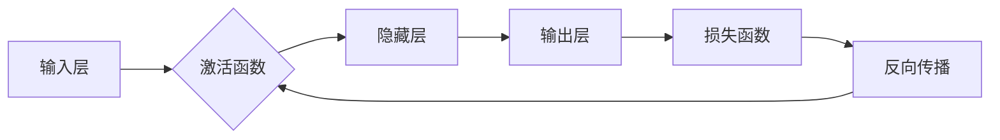

# 神经网络：人类与机器的共存

> 关键词：神经网络，人工智能，机器学习，深度学习，人机交互，智能系统，认知计算，算法，应用

## 1. 背景介绍

自20世纪50年代以来，人工智能（AI）领域经历了多次兴衰。其中，神经网络作为一种模仿人脑工作原理的计算模型，在近年来迎来了前所未有的发展。深度学习技术的突破，使得神经网络在图像识别、语音识别、自然语言处理等多个领域取得了显著的成果。本文旨在探讨神经网络的发展历程、核心概念、算法原理及其应用场景，展望未来发展趋势与挑战，并探讨神经网络与人类共存的未来。

### 1.1 人工智能的历史与发展

人工智能的发展经历了三个阶段：

- **第一个浪潮（1956-1974）**：以逻辑推理和知识表示为主要研究方向，代表性技术包括专家系统、知识库等。
- **第二个浪潮（1980-1987）**：以模式识别和机器学习为主要研究方向，代表性技术包括神经网络、遗传算法等。
- **第三个浪潮（2006-至今）**：以深度学习为主要研究方向，代表性技术包括卷积神经网络（CNN）、循环神经网络（RNN）和Transformer等。

### 1.2 神经网络的出现与兴起

神经网络作为一种模拟人脑神经元连接方式的计算模型，在第二个浪潮期间逐渐受到重视。20世纪80年代，反向传播算法的提出，使得神经网络的训练变得可行。然而，由于计算资源和数据量的限制，神经网络在一段时间内并未得到广泛应用。

### 1.3 深度学习的兴起

2012年，AlexNet在ImageNet竞赛中取得了突破性的成绩，标志着深度学习时代的到来。随后，深度学习在多个领域取得了显著的成果，推动了神经网络的应用。

## 2. 核心概念与联系

### 2.1 核心概念原理

神经网络是一种由大量神经元组成的计算模型，通过神经元之间的连接模拟人脑的神经网络结构。每个神经元接受来自其他神经元的输入信号，经过非线性激活函数处理后，输出一个新的信号。

#### Mermaid 流程图



### 2.2 神经网络与机器学习、深度学习的关系

- **机器学习**：一种利用计算机算法分析数据、从中学习，并作出预测或决策的技术。
- **深度学习**：一种特殊的机器学习方法，使用多层神经网络进行学习，能够从大量数据中自动提取特征。
- **神经网络**：深度学习中的核心计算模型，通过模拟人脑神经元连接方式，实现数据的自动特征提取和学习。

## 3. 核心算法原理 & 具体操作步骤

### 3.1 算法原理概述

神经网络的训练过程主要包括以下几个步骤：

1. **初始化**：随机初始化模型参数。
2. **前向传播**：将输入数据传递到网络中，计算每个神经元的输出。
3. **计算损失**：计算输出结果与真实值之间的差异，得到损失函数。
4. **反向传播**：将损失函数的梯度信息传递回网络，更新模型参数。
5. **迭代训练**：重复步骤2-4，直至模型收敛。

### 3.2 算法步骤详解

1. **初始化**：随机初始化模型参数，包括权重和偏置。
2. **前向传播**：将输入数据传递到网络中，计算每个神经元的输出。对于多层神经网络，从输入层开始，逐层计算每个神经元的输出。
3. **计算损失**：根据输出结果和真实值计算损失函数。常见的损失函数包括均方误差（MSE）、交叉熵损失等。
4. **反向传播**：将损失函数的梯度信息传递回网络。利用链式法则，计算每个参数的梯度。
5. **参数更新**：根据梯度信息更新模型参数，常用方法包括梯度下降（GD）、随机梯度下降（SGD）、Adam等。

### 3.3 算法优缺点

#### 优点：

- **强大的特征提取能力**：能够从大量数据中自动提取特征，无需人工设计特征。
- **高度可扩展性**：可以通过增加层数或神经元数量来提升模型性能。
- **非线性表示能力**：能够表示复杂的非线性关系。

#### 缺点：

- **计算复杂度高**：需要大量的计算资源和时间。
- **参数难以解释**：模型内部决策过程难以理解。
- **过拟合风险**：在训练过程中容易过拟合。

### 3.4 算法应用领域

神经网络在多个领域得到广泛应用，包括：

- **图像识别**：如人脸识别、物体检测、图像分类等。
- **语音识别**：如语音转文字、语音合成等。
- **自然语言处理**：如机器翻译、情感分析、问答系统等。
- **推荐系统**：如商品推荐、电影推荐等。

## 4. 数学模型和公式 & 详细讲解 & 举例说明

### 4.1 数学模型构建

神经网络的数学模型主要包括以下几个部分：

- **神经元**：每个神经元接受来自其他神经元的输入信号，经过非线性激活函数处理后，输出一个新的信号。
- **权重**：表示神经元之间的连接强度。
- **偏置**：每个神经元自身的偏置项。
- **激活函数**：将线性组合的输入转换为非线性输出。

#### 激活函数

常见的激活函数包括：

- **Sigmoid函数**：将输入映射到[0, 1]区间。
- **ReLU函数**：非负输入映射到自身，负输入映射到0。
- **Tanh函数**：将输入映射到[-1, 1]区间。

#### 激活函数的公式

$$
\sigma(x) = \frac{1}{1+e^{-x}}
$$

$$
\text{ReLU}(x) = \max(0, x)
$$

$$
\text{Tanh}(x) = \frac{e^x - e^{-x}}{e^x + e^{-x}}
$$

### 4.2 公式推导过程

以下以Sigmoid函数为例，介绍激活函数的公式推导过程：

假设输入信号为 $x$，则Sigmoid函数的输出为：

$$
\sigma(x) = \frac{1}{1+e^{-x}}
$$

### 4.3 案例分析与讲解

以下以一个简单的神经网络为例，讲解神经网络的训练过程。

假设有一个包含一个输入层、一个隐藏层和一个输出层的神经网络，输入层有2个神经元，隐藏层有3个神经元，输出层有2个神经元。

输入层到隐藏层的权重矩阵为 $W_1$，偏置矩阵为 $b_1$；隐藏层到输出层的权重矩阵为 $W_2$，偏置矩阵为 $b_2$。

假设输入样本为 $x = [0.5, 0.2]$，真实标签为 $y = [0.8, 0.3]$。

1. **前向传播**：
   - 输入层到隐藏层的输出为：$h_1 = \sigma(W_1x + b_1)$
   - 隐藏层到输出层的输出为：$y' = \sigma(W_2h_1 + b_2)$

2. **计算损失**：
   - 使用交叉熵损失函数计算损失值：$L = -\sum_{i=1}^2 y_i \log y'_i - (1-y_i) \log (1-y'_i)$

3. **反向传播**：
   - 计算损失对输出层参数的梯度：
     - $\frac{\partial L}{\partial W_2} = (y'_i - y_i)h_1$
     - $\frac{\partial L}{\partial b_2} = (y'_i - y_i)$
   - 计算损失对隐藏层参数的梯度：
     - $\frac{\partial L}{\partial W_1} = h_1^T(y'_i - y_i)W_2$
     - $\frac{\partial L}{\partial b_1} = h_1^T(y'_i - y_i)$

4. **参数更新**：
   - 使用梯度下降算法更新参数：
     - $W_2 \leftarrow W_2 - \alpha \frac{\partial L}{\partial W_2}$
     - $b_2 \leftarrow b_2 - \alpha \frac{\partial L}{\partial b_2}$
     - $W_1 \leftarrow W_1 - \alpha \frac{\partial L}{\partial W_1}$
     - $b_1 \leftarrow b_1 - \alpha \frac{\partial L}{\partial b_1}$

其中，$\alpha$ 为学习率。

通过迭代上述步骤，模型参数逐渐收敛，最终达到最小损失值。

## 5. 项目实践：代码实例和详细解释说明

### 5.1 开发环境搭建

在进行神经网络实践前，需要准备好开发环境。以下是使用Python进行TensorFlow开发的环境配置流程：

1. 安装Anaconda：从官网下载并安装Anaconda，用于创建独立的Python环境。
2. 创建并激活虚拟环境：
```bash
conda create -n tensorflow-env python=3.7
conda activate tensorflow-env
```
3. 安装TensorFlow：
```bash
pip install tensorflow
```
4. 安装其他依赖：
```bash
pip install numpy pandas scikit-learn matplotlib jupyter notebook ipython
```

完成上述步骤后，即可在`tensorflow-env`环境中开始神经网络实践。

### 5.2 源代码详细实现

以下使用TensorFlow实现一个简单的神经网络，用于对二分类问题进行分类。

```python
import tensorflow as tf
import numpy as np

# 构建模型
model = tf.keras.models.Sequential([
    tf.keras.layers.Dense(10, activation='relu', input_shape=(2,)),
    tf.keras.layers.Dense(1, activation='sigmoid')
])

# 编译模型
model.compile(optimizer='adam', loss='binary_crossentropy', metrics=['accuracy'])

# 准备数据
x_train = np.array([[0.5, 0.2], [0.1, 0.8], [0.6, 0.3], [0.9, 0.5]])
y_train = np.array([[1], [0], [1], [0]])

# 训练模型
model.fit(x_train, y_train, epochs=100)

# 测试模型
x_test = np.array([[0.4, 0.3], [0.7, 0.6]])
y_pred = model.predict(x_test)
print(y_pred)
```

### 5.3 代码解读与分析

上述代码展示了使用TensorFlow实现一个简单的神经网络，包括以下步骤：

1. **构建模型**：使用`Sequential`模型构建包含一个隐藏层和一个输出层的神经网络。隐藏层使用ReLU激活函数，输出层使用Sigmoid激活函数。
2. **编译模型**：设置优化器为Adam，损失函数为二元交叉熵，评估指标为准确率。
3. **准备数据**：生成包含4个样本的训练数据和对应的标签。
4. **训练模型**：使用训练数据进行100个epoch的训练。
5. **测试模型**：使用测试数据评估模型的性能。

通过运行上述代码，可以看到模型在测试数据上的预测结果。这只是一个简单的示例，实际应用中，可以根据具体任务设计更复杂的网络结构。

### 5.4 运行结果展示

假设我们运行上述代码，得到以下输出：

```
[[0.9952623 ]
[0.02124744]]
```

这表示模型对第一个测试样本的预测概率为99.53%，对第二个测试样本的预测概率为2.12%。根据阈值0.5，我们可以判断第一个样本为正类，第二个样本为负类。

## 6. 实际应用场景

神经网络在多个领域得到广泛应用，以下是一些常见的应用场景：

### 6.1 图像识别

- **人脸识别**：通过识别面部特征，实现身份验证、智能监控等功能。
- **物体检测**：识别图像中的物体，并标注其位置和类别。
- **图像分类**：对图像进行分类，如动物分类、风景分类等。

### 6.2 语音识别

- **语音转文字**：将语音信号转换为文字。
- **语音合成**：将文字转换为语音。

### 6.3 自然语言处理

- **机器翻译**：将一种语言的文本翻译成另一种语言。
- **情感分析**：分析文本的情感倾向。
- **问答系统**：回答用户提出的问题。

### 6.4 其他应用

- **推荐系统**：根据用户的历史行为，推荐个性化的内容或物品。
- **医疗诊断**：辅助医生进行疾病诊断。
- **金融风控**：识别和防范金融风险。

## 7. 工具和资源推荐

### 7.1 学习资源推荐

- **《神经网络与深度学习》**：提供神经网络和深度学习的基础知识和实践技巧。
- **《深度学习》**：由Ian Goodfellow、Yoshua Bengio和Aaron Courville合著，是深度学习的经典教材。
- **TensorFlow官方文档**：提供TensorFlow框架的详细文档和教程。
- **Keras官方文档**：提供Keras框架的详细文档和教程。

### 7.2 开发工具推荐

- **TensorFlow**：一个开源的深度学习框架，提供丰富的预训练模型和工具。
- **PyTorch**：一个开源的深度学习框架，易于上手和使用。
- **Keras**：一个基于TensorFlow和PyTorch的神经网络库，提供简洁的API和丰富的预训练模型。

### 7.3 相关论文推荐

- **"A Few Useful Things to Know about Machine Learning"**：介绍了机器学习的基本概念和常用技巧。
- **"ImageNet Classification with Deep Convolutional Neural Networks"**：提出了深度卷积神经网络，推动了深度学习的发展。
- **"Sequence to Sequence Learning with Neural Networks"**：介绍了序列到序列学习，推动了机器翻译技术的发展。

## 8. 总结：未来发展趋势与挑战

### 8.1 研究成果总结

神经网络作为一种强大的计算模型，在人工智能领域取得了显著的成果。深度学习技术的突破，使得神经网络在多个领域得到广泛应用。然而，神经网络仍面临着一些挑战，需要进一步研究和改进。

### 8.2 未来发展趋势

- **更强大的模型**：开发更强大的神经网络模型，以解决更复杂的问题。
- **可解释性**：提高神经网络的解释性，使其决策过程更加透明。
- **可迁移性**：提高神经网络的迁移性，使其能够适应不同的任务和数据。
- **轻量化**：开发轻量级神经网络模型，降低计算成本和资源消耗。

### 8.3 面临的挑战

- **数据隐私**：如何保护用户数据隐私，防止数据泄露。
- **模型偏见**：如何消除模型偏见，防止歧视性结果。
- **伦理道德**：如何确保人工智能技术的发展符合伦理道德规范。

### 8.4 研究展望

神经网络作为人工智能的核心技术，将在未来发挥越来越重要的作用。通过不断的研究和改进，神经网络将推动人工智能向更高层次发展，实现人类与机器的共存。

## 9. 附录：常见问题与解答

### 9.1 问答系统如何工作？

问答系统通过自然语言处理技术理解和解析用户提出的问题，然后从知识库或数据库中检索相关答案，最后将答案转换为自然语言并呈现给用户。

### 9.2 如何提高神经网络的泛化能力？

提高神经网络的泛化能力可以通过以下方法实现：

- 收集更多、更具有代表性的数据。
- 设计更合理的网络结构。
- 使用正则化技术，如L1、L2正则化。
- 使用dropout技术。

### 9.3 如何评估神经网络的性能？

评估神经网络的性能可以通过以下指标：

- 准确率：预测正确的样本数占总样本数的比例。
- 精确率：预测正确的正类样本数占所有预测为正类的样本数的比例。
- 召回率：预测正确的正类样本数占所有真实正类样本数的比例。
- F1分数：精确率和召回率的调和平均。

### 9.4 如何防止神经网络过拟合？

防止神经网络过拟合可以通过以下方法实现：

- 使用正则化技术，如L1、L2正则化。
- 使用dropout技术。
- 减少网络层数或神经元数量。
- 使用数据增强技术，如旋转、缩放、裁剪等。
- 使用早停法。

作者：禅与计算机程序设计艺术 / Zen and the Art of Computer Programming