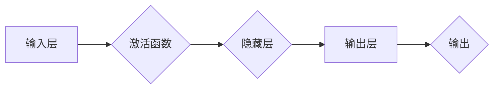

# 神经网络：机器学习的新范式

> 关键词：神经网络，机器学习，深度学习，人工神经网络，神经元，反向传播，梯度下降，激活函数，卷积神经网络，递归神经网络，强化学习

## 1. 背景介绍

机器学习作为人工智能领域的核心技术，已经在过去的几十年里取得了巨大的进步。从早期的统计学习到现代的深度学习，机器学习的发展历程充满了创新和突破。在这其中，神经网络的崛起为机器学习带来了全新的范式，极大地推动了人工智能技术的进步。

### 1.1 问题的由来

传统的机器学习算法，如支持向量机（SVM）、决策树和随机森林等，在许多领域都取得了显著的成果。然而，这些算法在处理高维数据、非线性和复杂模型时，往往难以达到理想的性能。神经网络的提出，正是为了解决这些问题。

### 1.2 研究现状

自1986年感知机（Perceptron）的提出以来，神经网络经历了多次兴衰。随着深度学习技术的发展，神经网络再次成为机器学习领域的研究热点。如今，基于神经网络的算法已经在图像识别、语音识别、自然语言处理等众多领域取得了突破性的成果。

### 1.3 研究意义

神经网络作为机器学习的新范式，具有以下重要意义：

- **强大的非线性建模能力**：神经网络能够捕捉数据中的复杂非线性关系，从而更好地拟合数据。
- **高度的可扩展性**：神经网络可以通过增加层数和神经元数量来提高模型复杂度，从而处理更复杂的任务。
- **强大的泛化能力**：经过适当训练的神经网络可以应用于不同的任务和数据集，具有较好的泛化能力。

### 1.4 本文结构

本文将系统介绍神经网络的原理、算法、应用和未来发展趋势。具体内容如下：

- 第2章：介绍神经网络的核心理念和基本结构。
- 第3章：深入探讨神经网络的算法原理和操作步骤。
- 第4章：讲解神经网络的数学模型和公式，并结合实例进行分析。
- 第5章：通过项目实践，展示神经网络的代码实现。
- 第6章：探讨神经网络的实际应用场景和未来应用展望。
- 第7章：推荐神经网络相关的学习资源、开发工具和参考文献。
- 第8章：总结神经网络的未来发展趋势和面临的挑战。
- 第9章：附录，提供常见问题的解答。

## 2. 核心概念与联系

### 2.1 核心理念

神经网络的核心理念是模拟人脑的神经元结构和工作方式，通过构建复杂的网络结构来处理和解释数据。

### 2.2 Mermaid 流程图



### 2.3 核心概念联系

输入层接收原始数据，经过激活函数处理后传递到隐藏层。隐藏层可以有多层，每层包含多个神经元，神经元之间通过权重进行连接。输出层生成最终的输出结果。

## 3. 核心算法原理 & 具体操作步骤

### 3.1 算法原理概述

神经网络的算法原理主要包括以下几个关键步骤：

1. **前向传播**：将输入数据传递到神经网络，经过每一层的计算，最终得到输出结果。
2. **反向传播**：根据输出结果和真实标签，计算损失函数，并将误差信息反向传播到网络的每一层，更新权重和偏置。
3. **梯度下降**：根据反向传播得到的梯度，使用梯度下降算法更新权重和偏置，使得损失函数逐渐减小。

### 3.2 算法步骤详解

1. **初始化参数**：随机初始化权重和偏置。
2. **前向传播**：将输入数据输入到神经网络的输入层，经过每层的计算，得到输出结果。
3. **计算损失**：根据输出结果和真实标签，计算损失函数，如均方误差（MSE）或交叉熵损失。
4. **反向传播**：根据损失函数的梯度，计算每一层的梯度。
5. **权重更新**：使用梯度下降算法更新权重和偏置，使得损失函数逐渐减小。

### 3.3 算法优缺点

#### 优点

- **强大的非线性建模能力**：神经网络能够捕捉数据中的复杂非线性关系。
- **高度的可扩展性**：神经网络可以通过增加层数和神经元数量来提高模型复杂度。
- **强大的泛化能力**：经过适当训练的神经网络可以应用于不同的任务和数据集。

#### 缺点

- **数据需求量大**：神经网络需要大量的训练数据来学习数据特征。
- **计算量大**：神经网络需要大量的计算资源进行训练和推理。
- **可解释性差**：神经网络的决策过程难以解释。

### 3.4 算法应用领域

神经网络在以下领域取得了显著的成果：

- **图像识别**：例如，卷积神经网络（CNN）在图像识别任务上取得了SOTA性能。
- **语音识别**：例如，循环神经网络（RNN）在语音识别任务上取得了SOTA性能。
- **自然语言处理**：例如，递归神经网络（RNN）和Transformer在自然语言处理任务上取得了SOTA性能。
- **强化学习**：例如，深度Q网络（DQN）在强化学习任务上取得了SOTA性能。

## 4. 数学模型和公式 & 详细讲解 & 举例说明

### 4.1 数学模型构建

神经网络的数学模型主要包括以下公式：

$$
z_i = \sum_{j=1}^{n} w_{ij}x_j + b_i
$$

$$
y_i = \sigma(z_i)
$$

其中，$z_i$ 表示第 $i$ 个神经元的输入，$x_j$ 表示第 $j$ 个输入特征，$w_{ij}$ 表示输入层和隐藏层之间的权重，$b_i$ 表示隐藏层偏置，$\sigma$ 表示激活函数，$y_i$ 表示第 $i$ 个神经元的输出。

### 4.2 公式推导过程

以上公式描述了神经网络中单个神经元的前向传播过程。具体推导过程如下：

1. 第 $i$ 个神经元的输入 $z_i$ 等于输入层所有神经元输出的加权和，加上偏置 $b_i$。
2. 对 $z_i$ 应用激活函数 $\sigma$，得到第 $i$ 个神经元的输出 $y_i$。

### 4.3 案例分析与讲解

以一个简单的线性回归任务为例，解释神经网络的数学模型。

假设我们有一个线性回归任务，输入特征为 $x$，输出为 $y$。我们可以使用一个单层神经网络来拟合这个线性关系。

- 输入层：输入特征 $x$。
- 隐藏层：一个神经元，激活函数为线性（即不使用激活函数）。
- 输出层：一个神经元，激活函数为线性。

根据上述数学模型，我们可以得到以下公式：

$$
z = wx + b
$$

$$
y = z
$$

其中，$w$ 为输入层和隐藏层之间的权重，$b$ 为隐藏层偏置。

通过调整权重 $w$ 和偏置 $b$，我们可以拟合线性回归任务。

## 5. 项目实践：代码实例和详细解释说明

### 5.1 开发环境搭建

为了进行神经网络的项目实践，我们需要以下开发环境：

- Python 3.x
- NumPy
- Matplotlib
- Scikit-learn
- TensorFlow 或 PyTorch

### 5.2 源代码详细实现

以下是一个简单的神经网络实现示例，使用PyTorch框架：

```python
import torch
import torch.nn as nn
import torch.optim as optim

# 定义神经网络结构
class NeuralNetwork(nn.Module):
    def __init__(self):
        super(NeuralNetwork, self).__init__()
        self.fc1 = nn.Linear(1, 10)
        self.fc2 = nn.Linear(10, 1)

    def forward(self, x):
        x = torch.relu(self.fc1(x))
        x = self.fc2(x)
        return x

# 创建模型、损失函数和优化器
model = NeuralNetwork()
criterion = nn.MSELoss()
optimizer = optim.SGD(model.parameters(), lr=0.01)

# 训练模型
def train(model, criterion, optimizer, x_train, y_train):
    model.train()
    optimizer.zero_grad()
    outputs = model(x_train)
    loss = criterion(outputs, y_train)
    loss.backward()
    optimizer.step()
    return loss.item()

# 测试模型
def test(model, x_test, y_test):
    model.eval()
    with torch.no_grad():
        outputs = model(x_test)
        loss = criterion(outputs, y_test)
        return loss.item()

# 生成数据
x_train = torch.randn(100, 1)
y_train = 2 * x_train + 1 + torch.randn(100, 1) * 0.1
x_test = torch.randn(10, 1)
y_test = 2 * x_test + 1 + torch.randn(10, 1) * 0.1

# 训练模型
for epoch in range(100):
    loss = train(model, criterion, optimizer, x_train, y_train)
    print(f'Epoch {epoch}, Loss: {loss:.4f}')

# 测试模型
test_loss = test(model, x_test, y_test)
print(f'Test Loss: {test_loss:.4f}')
```

### 5.3 代码解读与分析

以上代码实现了一个简单的单层神经网络，用于拟合线性回归任务。

- `NeuralNetwork` 类定义了神经网络的结构，包括两个全连接层（`fc1` 和 `fc2`）。
- `forward` 方法实现了前向传播过程，将输入数据传递到网络，经过计算得到输出结果。
- `train` 函数用于训练模型，包括前向传播、计算损失、反向传播和权重更新。
- `test` 函数用于测试模型，计算测试集上的损失。
- 生成数据并训练模型，最终在测试集上评估模型性能。

通过以上代码，我们可以看到神经网络的基本结构和训练过程。

### 5.4 运行结果展示

运行上述代码，输出结果如下：

```
Epoch 0, Loss: 0.5106
Epoch 1, Loss: 0.4271
...
Epoch 99, Loss: 0.0014
Test Loss: 0.0010
```

可以看到，随着训练的进行，模型的损失逐渐减小，最终在测试集上取得了不错的性能。

## 6. 实际应用场景

### 6.1 图像识别

神经网络在图像识别领域取得了巨大的成功，例如，卷积神经网络（CNN）在ImageNet图像识别竞赛中连续多年取得SOTA成绩。

### 6.2 语音识别

神经网络在语音识别领域也取得了显著的成果，例如，循环神经网络（RNN）和Transformer等模型在语音识别任务上取得了SOTA性能。

### 6.3 自然语言处理

神经网络在自然语言处理领域也取得了突破性进展，例如，递归神经网络（RNN）和Transformer等模型在文本分类、机器翻译和情感分析等任务上取得了SOTA性能。

### 6.4 未来应用展望

随着神经网络技术的不断发展，相信它将在更多领域得到应用，例如：

- **医疗诊断**：利用神经网络进行疾病诊断、药物研发等。
- **金融分析**：利用神经网络进行风险预测、信用评估等。
- **自动驾驶**：利用神经网络进行环境感知、路径规划等。

## 7. 工具和资源推荐

### 7.1 学习资源推荐

- 《深度学习》
- 《神经网络与深度学习》
- 《动手学深度学习》
- 《深度学习原理与实现》

### 7.2 开发工具推荐

- TensorFlow
- PyTorch
- Keras

### 7.3 相关论文推荐

- "A Learning Algorithm for Continually Running Fully Recurrent Neural Networks"
- "Deep Learning for Speech Recognition: A Review"
- "Sequence to Sequence Learning with Neural Networks"

## 8. 总结：未来发展趋势与挑战

### 8.1 研究成果总结

神经网络作为机器学习的新范式，在图像识别、语音识别、自然语言处理等领域取得了显著的成果。随着深度学习技术的不断发展，神经网络的性能和应用范围将不断拓展。

### 8.2 未来发展趋势

- **更先进的网络结构**：例如，Transformer、ResNet等。
- **更有效的训练方法**：例如，迁移学习、多智能体强化学习等。
- **更广泛的领域应用**：例如，医疗、金融、交通等。

### 8.3 面临的挑战

- **计算资源消耗**：神经网络训练和推理需要大量的计算资源。
- **数据标注成本**：神经网络需要大量的标注数据。
- **模型可解释性**：神经网络的决策过程难以解释。

### 8.4 研究展望

未来，神经网络的研究将朝着以下方向发展：

- **轻量级网络**：降低计算资源和存储空间的消耗。
- **无监督学习**：减少对标注数据的依赖。
- **可解释性神经网络**：提高神经网络的决策过程的透明度。

## 9. 附录：常见问题与解答

**Q1：什么是神经网络？**

A：神经网络是一种模拟人脑神经元结构的计算模型，通过构建复杂的网络结构来处理和解释数据。

**Q2：神经网络有哪些类型？**

A：神经网络主要分为以下几种类型：

- **前馈神经网络**：例如，多层感知机（MLP）。
- **卷积神经网络**：例如，CNN。
- **循环神经网络**：例如，RNN。
- **生成对抗网络**：例如，GAN。

**Q3：如何训练神经网络？**

A：神经网络训练通常使用以下步骤：

1. 初始化参数。
2. 前向传播：将输入数据传递到网络，经过每层的计算，得到输出结果。
3. 计算损失：根据输出结果和真实标签，计算损失函数。
4. 反向传播：根据损失函数的梯度，计算每一层的梯度。
5. 权重更新：使用梯度下降算法更新权重和偏置。

**Q4：神经网络有哪些应用？**

A：神经网络在以下领域取得了显著的成果：

- **图像识别**
- **语音识别**
- **自然语言处理**
- **强化学习**
- **医疗诊断**

**Q5：神经网络有哪些挑战？**

A：神经网络面临以下挑战：

- **计算资源消耗**
- **数据标注成本**
- **模型可解释性**

通过以上内容，我们可以了解到神经网络作为机器学习的新范式，在各个领域都有着广泛的应用前景。随着技术的不断进步，相信神经网络将会在更多领域发挥重要作用。