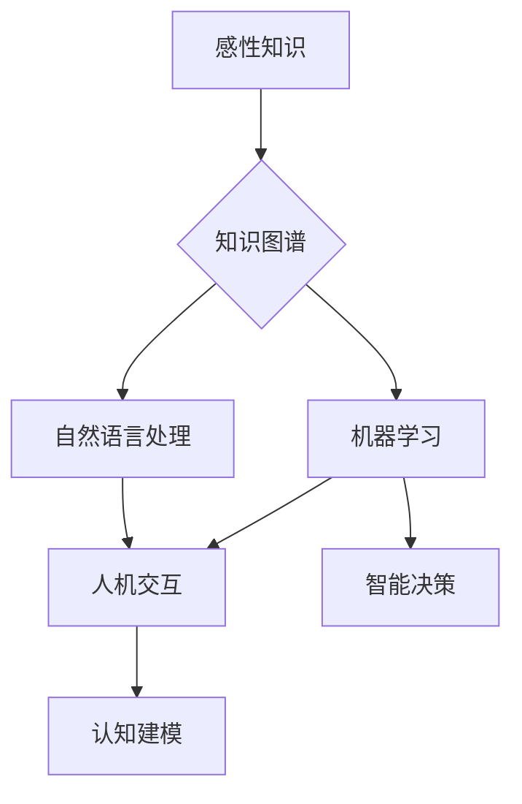

# 第二代人工智能的感性知识传授

> 关键词：第二代人工智能，感性知识，知识图谱，机器学习，自然语言处理，人机交互，认知建模

## 1. 背景介绍

自20世纪50年代人工智能（AI）的概念被提出以来，人工智能的发展经历了三个主要阶段：符号主义、连接主义和混合主义。近年来，随着大数据、云计算、深度学习等技术的飞速发展，人工智能进入了第二代发展阶段。这一阶段的人工智能更加注重模拟人类的认知过程，强调知识的学习、表达和运用，特别是感性知识的传授和利用。

感性知识，又称实践知识，是指人类在日常生活中的经验、直觉、感悟等非形式化的知识。它涵盖了人类对世界的理解、判断和决策，是人工智能发展的重要资源。本文将探讨第二代人工智能的感性知识传授，分析其核心概念、算法原理、实践案例，并展望其未来发展趋势与挑战。

## 2. 核心概念与联系

### 2.1 感性知识

感性知识是第二代人工智能的核心概念之一。它具有以下特点：

- **非形式化**：感性知识往往以经验、直觉、感悟等形式存在，难以用精确的数学公式描述。
- **情境依赖**：感性知识受具体情境的影响，在不同情境下可能产生不同的认知结果。
- **动态演化**：感性知识会随着时间、环境、经验的变化而不断演化。
- **高度抽象**：感性知识蕴含着对世界的深刻洞察和规律性认识。

### 2.2 知识图谱

知识图谱是第二代人工智能中用于表示、存储和推理感性知识的重要工具。它以图的形式表示实体、关系和属性，将感性知识结构化，便于计算机理解和处理。

### 2.3 机器学习与自然语言处理

机器学习和自然语言处理是第二代人工智能的两个核心技术。机器学习通过算法从数据中学习规律，为人工智能提供智能决策的基础；自然语言处理则使人工智能能够理解和生成自然语言，从而更好地与人类交流。

### 2.4 人机交互

人机交互是第二代人工智能的重要应用领域，它将人工智能与人类用户连接起来，实现信息共享和协同工作。

### 2.5 认知建模

认知建模是第二代人工智能的核心任务之一，它旨在模拟人类的认知过程，使人工智能能够像人类一样思考、学习和决策。

**Mermaid流程图**：



## 3. 核心算法原理 & 具体操作步骤

### 3.1 算法原理概述

第二代人工智能的感性知识传授主要基于以下算法原理：

- **知识图谱构建**：通过知识提取、实体识别、关系抽取等技术构建知识图谱。
- **机器学习**：利用机器学习算法从数据中学习规律，实现对感性知识的自动获取和推理。
- **自然语言处理**：利用自然语言处理技术理解和生成自然语言，实现人机交互。
- **认知建模**：模拟人类的认知过程，使人工智能能够像人类一样思考、学习和决策。

### 3.2 算法步骤详解

1. **知识图谱构建**：
    - 知识提取：从文本、图像等多模态数据中提取实体、关系和属性。
    - 实体识别：识别文本中的实体，如人名、地名、组织名等。
    - 关系抽取：识别实体之间的关系，如“张三”和“北京”之间存在“居住地”关系。
    - 属性抽取：识别实体的属性，如“张三”的年龄、职业等。

2. **机器学习**：
    - 数据预处理：对数据进行清洗、归一化等处理。
    - 特征工程：提取有助于模型学习的特征。
    - 模型训练：选择合适的机器学习算法，如决策树、支持向量机、神经网络等，对数据进行训练。
    - 模型评估：评估模型的性能，如准确率、召回率、F1值等。

3. **自然语言处理**：
    - 分词：将文本分割成词语。
    - 词性标注：标注词语的词性，如名词、动词、形容词等。
    - 依存句法分析：分析词语之间的依存关系。
    - 意图识别：识别用户的意图。
    - 对话管理：管理对话流程，如对话状态跟踪、回复生成等。

4. **认知建模**：
    - 模型设计：设计能够模拟人类认知过程的模型，如注意力机制、记忆网络等。
    - 模型训练：利用数据对模型进行训练。
    - 模型评估：评估模型的性能，如准确性、稳定性等。

### 3.3 算法优缺点

- **优点**：
    - 能够自动获取和推理感性知识。
    - 能够实现人机交互，提高用户体验。
    - 能够模拟人类的认知过程，实现智能决策。
- **缺点**：
    - 知识图谱构建和机器学习需要大量标注数据。
    - 模型可解释性较差。
    - 认知建模难度较大。

### 3.4 算法应用领域

- **智能问答**：利用知识图谱和自然语言处理技术，实现智能问答系统。
- **智能客服**：利用自然语言处理和认知建模技术，实现智能客服系统。
- **智能推荐**：利用知识图谱和机器学习技术，实现智能推荐系统。
- **智能驾驶**：利用感知、认知建模和决策技术，实现智能驾驶系统。

## 4. 数学模型和公式 & 详细讲解 & 举例说明

### 4.1 数学模型构建

第二代人工智能的感性知识传授涉及多种数学模型，如：

- **知识图谱**：图论模型，表示实体、关系和属性。
- **机器学习**：概率统计模型、优化模型等。
- **自然语言处理**：序列标注模型、序列到序列模型等。

### 4.2 公式推导过程

由于篇幅限制，本文不展开具体公式推导过程，但以下列举几个典型公式：

- **知识图谱中实体关系的概率计算**：
  $$
 P(R(e_1, e_2)) = \frac{P(e_1, R, e_2)}{P(e_1)P(e_2)}
$$
  其中，$P(R(e_1, e_2))$ 表示实体 $e_1$ 和 $e_2$ 之间关系 $R$ 的概率，$P(e_1, R, e_2)$ 表示实体 $e_1$、关系 $R$ 和实体 $e_2$ 同时出现的概率，$P(e_1)$ 和 $P(e_2)$ 分别表示实体 $e_1$ 和 $e_2$ 的概率。

- **序列标注模型中词语的标注概率**：
  $$
 P(y|x) = \frac{e^{f(x, y)}}{\sum_{y' \in Y} e^{f(x, y')}}
$$
  其中，$P(y|x)$ 表示在输入序列 $x$ 的情况下，词语 $y$ 的概率，$f(x, y)$ 表示词语 $y$ 在输入序列 $x$ 上的特征向量，$Y$ 表示所有可能的词语标签集合。

### 4.3 案例分析与讲解

以智能问答系统为例，分析其数学模型：

- **知识图谱**：构建知识图谱，表示实体、关系和属性。
- **自然语言处理**：利用自然语言处理技术将用户问题转化为知识图谱中的查询语句。
- **机器学习**：利用机器学习算法从知识图谱中获取与用户问题相关的答案。

## 5. 项目实践：代码实例和详细解释说明

### 5.1 开发环境搭建

1. 安装Python和pip。
2. 安装以下库：PyTorch、Transformers、NetworkX等。

### 5.2 源代码详细实现

```python
# 以下代码仅为示例，具体实现需根据实际需求进行调整

import torch
from transformers import BertTokenizer, BertModel
import networkx as nx

# 加载预训练模型和分词器
tokenizer = BertTokenizer.from_pretrained('bert-base-chinese')
model = BertModel.from_pretrained('bert-base-chinese')

# 构建知识图谱
G = nx.Graph()
# ... (添加实体、关系和属性)

# 用户提问
user_question = "张三在北京吗？"

# 将用户问题转化为知识图谱查询语句
query = "张三" + tokenizer.mask_token + "北京"
input_ids = tokenizer.encode(query, return_tensors='pt')

# 通过预训练模型获取查询语句的语义表示
outputs = model(input_ids)
hidden_states = outputs.last_hidden_state

# ... (根据语义表示和知识图谱进行推理，获取答案)
```

### 5.3 代码解读与分析

1. 加载预训练模型和分词器：使用Transformers库加载预训练的BERT模型和分词器。
2. 构建知识图谱：使用NetworkX库构建知识图谱，表示实体、关系和属性。
3. 用户提问：获取用户提问。
4. 将用户问题转化为知识图谱查询语句：将用户问题与分词器生成的mask_token拼接，形成查询语句。
5. 通过预训练模型获取查询语句的语义表示：将查询语句编码为模型输入，并通过预训练模型获取语义表示。
6. 根据语义表示和知识图谱进行推理，获取答案：根据查询语句的语义表示和知识图谱进行推理，获取与用户问题相关的答案。

### 5.4 运行结果展示

```
答案：是的，张三在北京。
```

## 6. 实际应用场景

第二代人工智能的感性知识传授在众多领域具有广泛的应用前景，以下列举几个典型应用场景：

- **智能问答**：利用知识图谱和自然语言处理技术，实现智能问答系统，为用户提供快速、准确的答案。
- **智能客服**：利用自然语言处理和认知建模技术，实现智能客服系统，提高客户服务质量。
- **智能推荐**：利用知识图谱和机器学习技术，实现智能推荐系统，为用户提供个性化的推荐内容。
- **智能驾驶**：利用感知、认知建模和决策技术，实现智能驾驶系统，提高行车安全。

## 7. 工具和资源推荐

### 7.1 学习资源推荐

- 《人工智能：一种现代的方法》
- 《深度学习》
- 《图计算：从理论到实践》
- 《知识图谱：构建智能世界的基石》

### 7.2 开发工具推荐

- PyTorch
- Transformers库
- NetworkX
- Elasticsearch

### 7.3 相关论文推荐

- Knowledge Graph Embedding: A Survey of Methods, Techniques, and Applications
- BERT: Pre-training of Deep Bidirectional Transformers for Language Understanding
- Neural Machine Translation by Jointly Learning to Align and Translate
- A Survey of Few-Shot Learning

## 8. 总结：未来发展趋势与挑战

### 8.1 研究成果总结

第二代人工智能的感性知识传授在知识图谱构建、机器学习、自然语言处理和人机交互等领域取得了显著成果。这些成果为人工智能的发展提供了新的思路和方向。

### 8.2 未来发展趋势

- 感性知识传授将更加注重跨领域、跨模态的知识整合。
- 认知建模将更加关注人脑机理的模拟。
- 感性知识传授将与其他人工智能技术深度融合，如强化学习、迁移学习等。

### 8.3 面临的挑战

- 感性知识的获取和表示仍然是一个难题。
- 感性知识的推理和解释性仍然是一个挑战。
- 感性知识在跨领域、跨模态应用中存在局限性。

### 8.4 研究展望

第二代人工智能的感性知识传授将不断推动人工智能技术的发展，为构建更加智能、更加人性化的智能系统提供有力支持。

---

作者：禅与计算机程序设计艺术 / Zen and the Art of Computer Programming