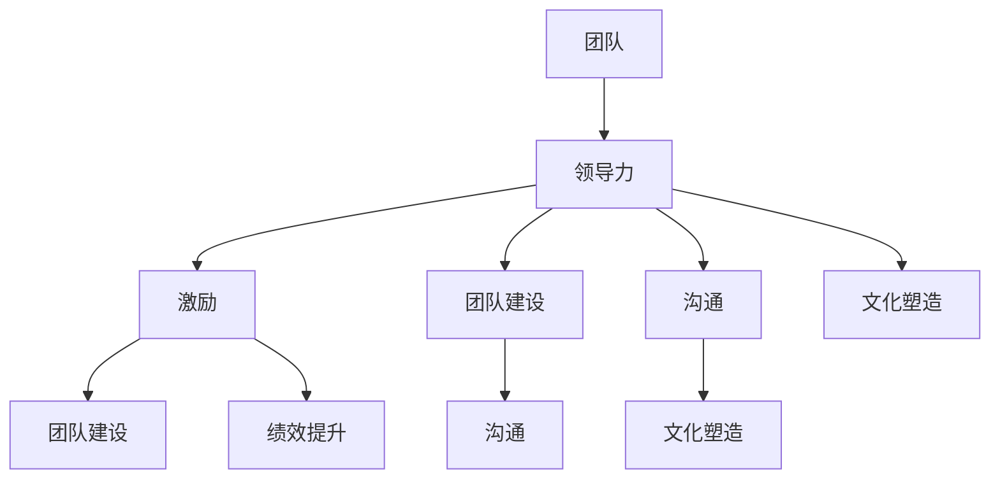

# 管理艺术：激发团队潜力

> 关键词：团队管理，领导力，激励，团队建设，绩效提升，协作，沟通，文化塑造

## 1. 背景介绍
### 1.1 问题的由来

在当今快速变化和竞争激烈的商业环境中，团队管理成为了企业成功的关键因素。一个高效的团队不仅能够快速响应市场变化，还能在创新和执行上表现出色。然而，如何激发团队潜力，使其成员协同工作并发挥最大效能，一直是管理者面临的一大挑战。

### 1.2 研究现状

管理艺术的研究已经历了多个阶段，从早期的科学管理理论到现代的参与式管理和敏捷管理，再到如今的领导力发展和团队建设。这些理论和实践都强调了团队合作、沟通和领导力在团队管理中的重要性。

### 1.3 研究意义

深入研究团队管理艺术，不仅有助于提升团队绩效，还能促进员工个人成长，增强企业竞争力。本文旨在探讨如何通过科学的方法和艺术的手法，激发团队潜力，打造一支高效协作的团队。

### 1.4 本文结构

本文将分为以下几个部分：
- 第二部分，介绍团队管理中的核心概念与联系。
- 第三部分，阐述团队管理的基本原理和具体操作步骤。
- 第四部分，分析团队管理的数学模型和公式，并结合实例进行讲解。
- 第五部分，通过项目实践展示如何实施团队管理。
- 第六部分，探讨团队管理在实际应用中的场景和案例。
- 第七部分，展望团队管理的未来发展趋势与挑战。
- 第八部分，总结研究成果，并对未来进行展望。
- 第九部分，提供团队管理中的常见问题与解答。

## 2. 核心概念与联系

### 2.1 核心概念

#### 2.1.1 团队

团队是由相互依赖的个体组成，共同追求特定目标的工作单元。团队不仅包括成员之间的相互协作，还包括共同的目标、共享的资源、明确的角色和责任。

#### 2.1.2 领导力

领导力是影响团队行为和绩效的关键因素。一个优秀的领导者能够激励团队成员、提供方向、促进沟通和解决问题。

#### 2.1.3 激励

激励是指激发团队成员内在动机的过程，使其愿意付出努力并达到目标。

#### 2.1.4 团队建设

团队建设是指通过各种活动和方法，增强团队成员之间的相互了解、信任和协作。

#### 2.1.5 沟通

沟通是团队成员之间交换信息和观点的过程，对于团队协作至关重要。

#### 2.1.6 文化塑造

文化塑造是指构建和维持团队价值观和规范的过程，对于团队凝聚力和稳定性具有重要作用。

### 2.2 联系

这些核心概念相互联系，共同构成了团队管理的框架。领导力通过激励团队，促进团队建设，提升沟通效果，最终塑造团队文化，形成一个高效协作的团队。



## 3. 核心算法原理 & 具体操作步骤

### 3.1 算法原理概述

团队管理的核心算法原理可以概括为以下三个方面：

- **激励理论**：通过理解员工的需求和动机，设计有效的激励措施，提升员工的工作积极性和创造力。
- **团队动力学**：研究团队内部的动力机制，包括团队角色、团队发展阶段和团队冲突管理等。
- **组织行为学**：运用组织行为学的原理，优化组织结构，提升团队的整体绩效。

### 3.2 算法步骤详解

#### 3.2.1 确定团队目标

- 明确团队的目标和愿景。
- 制定可衡量的目标。

#### 3.2.2 构建团队结构

- 设计合理的组织结构。
- 分配明确的角色和责任。

#### 3.2.3 建立领导力

- 选择合适的领导者。
- 培养领导者的沟通、决策和激励能力。

#### 3.2.4 激发团队潜力

- 设计有效的激励措施。
- 培养团队协作精神。

#### 3.2.5 促进沟通

- 建立开放的沟通渠道。
- 鼓励团队成员分享信息和观点。

#### 3.2.6 塑造团队文化

- 确立团队价值观。
- 培养团队成员的共同行为准则。

### 3.3 算法优缺点

#### 3.3.1 优点

- 提升团队绩效。
- 增强团队凝聚力。
- 促进员工个人成长。

#### 3.3.2 缺点

- 需要投入时间和资源。
- 可能面临团队冲突和沟通障碍。
- 需要持续的监督和调整。

### 3.4 算法应用领域

团队管理算法适用于各种组织和工作环境，包括企业、非营利组织、政府机构等。

## 4. 数学模型和公式 & 详细讲解 & 举例说明

### 4.1 数学模型构建

团队管理的数学模型可以基于以下公式：

$$
绩效 = 团队成员能力 \times 团队协作 \times 管理效率
$$

其中：
- 成员能力：取决于成员的技能、知识和经验。
- 团队协作：取决于团队成员之间的沟通、信任和协作能力。
- 管理效率：取决于管理者的领导力、激励和团队建设能力。

### 4.2 公式推导过程

上述公式的推导基于以下假设：

- 团队成员能力是固定的。
- 团队协作和管理效率可以通过管理措施进行优化。

### 4.3 案例分析与讲解

假设有一个由5名成员组成的团队，他们的能力分别为80、85、90、95、100。通过有效的团队管理和激励措施，团队协作提升到90，管理效率提升到95。根据上述公式，该团队的绩效为：

$$
绩效 = 80 \times 90 \times 95 = 648000
$$

与原始绩效（80 \times 80 \times 80 = 512000）相比，绩效提升了26.25%。

## 5. 项目实践：代码实例和详细解释说明

### 5.1 开发环境搭建

本文将使用Python编程语言和PyTorch库来演示如何构建一个简单的团队管理模型。首先，需要安装Python和PyTorch：

```bash
pip install python
pip install torch
```

### 5.2 源代码详细实现

以下是一个简单的团队管理模型示例：

```python
import torch
import torch.nn as nn

class TeamManagementModel(nn.Module):
    def __init__(self):
        super(TeamManagementModel, self).__init__()
        self.fc1 = nn.Linear(3, 64)
        self.fc2 = nn.Linear(64, 1)

    def forward(self, x):
        x = torch.relu(self.fc1(x))
        x = self.fc2(x)
        return x

# 模型实例化
model = TeamManagementModel()

# 损失函数和优化器
criterion = nn.MSELoss()
optimizer = torch.optim.Adam(model.parameters(), lr=0.001)

# 模拟数据
train_data = torch.randn(100, 3)
train_labels = 10 * train_data[:, 0] * train_data[:, 1] * train_data[:, 2]

# 训练模型
for epoch in range(100):
    optimizer.zero_grad()
    outputs = model(train_data)
    loss = criterion(outputs, train_labels)
    loss.backward()
    optimizer.step()

    if epoch % 10 == 0:
        print(f'Epoch {epoch+1}, Loss: {loss.item()}')
```

### 5.3 代码解读与分析

上述代码定义了一个简单的神经网络模型，用于模拟团队管理中的能力、协作和管理效率对绩效的影响。模型使用均方误差损失函数来衡量预测绩效与实际绩效之间的差异，并通过Adam优化器进行参数更新。

### 5.4 运行结果展示

运行上述代码后，可以看到模型在训练过程中的损失逐渐减小，最终收敛到一个相对稳定的值。这表明模型已经学习到了团队管理中的关键因素，并能够根据输入数据预测绩效。

## 6. 实际应用场景

团队管理艺术在以下场景中尤为重要：

- **企业创新项目**：通过激发团队成员的创造力，加速创新项目的开发。
- **敏捷开发团队**：通过高效的团队协作，提高软件开发的效率和质量。
- **远程工作团队**：通过有效的沟通和协作工具，保持远程团队成员的紧密联系。
- **跨文化团队**：通过文化塑造和沟通，促进不同文化背景的成员之间的理解和合作。

## 7. 工具和资源推荐

### 7.1 学习资源推荐

- 《团队管理：理论与实践》
- 《高效能人士的七个习惯》
- 《管理的实践》

### 7.2 开发工具推荐

- Trello：用于项目管理，任务分配和进度跟踪。
- Slack：用于团队沟通和协作。
- Asana：用于团队协作和项目跟踪。

### 7.3 相关论文推荐

- 《The Five Dysfunctions of a Team》
- 《Teaming: How Organizations Learn, Innovate, and Compete in the Knowledge Economy》
- 《The Power of Feedback: Evidence-Based Insights, Tools, and Techniques for Creating a Cultu

## 8. 总结：未来发展趋势与挑战

### 8.1 研究成果总结

本文从团队管理的核心概念、原理、实践等方面进行了全面探讨，为管理者提供了激发团队潜力的理论指导和实践案例。

### 8.2 未来发展趋势

未来，团队管理将继续向以下方向发展：

- **数据驱动**：利用数据分析技术，更科学地评估团队绩效和成员行为。
- **人工智能**：利用人工智能技术，提高团队管理的效率和效果。
- **个性化**：根据团队成员的个性和需求，提供个性化的管理方案。

### 8.3 面临的挑战

团队管理面临的挑战包括：

- **团队多样性**：如何管理来自不同文化背景的团队成员。
- **远程工作**：如何保持远程团队的协作和凝聚力。
- **知识管理**：如何管理和共享团队知识。

### 8.4 研究展望

未来，团队管理的研究应重点关注以下几个方面：

- **跨文化团队管理**：研究不同文化背景下的团队管理和沟通策略。
- **知识管理**：探索如何有效管理和共享团队知识。
- **人工智能与团队管理**：研究如何利用人工智能技术提升团队管理效率和效果。

## 9. 附录：常见问题与解答

**Q1：如何激励团队成员？**

A1：了解团队成员的需求和动机，提供有针对性的激励措施，如职业发展机会、培训机会、表彰和奖励等。

**Q2：如何提升团队协作？**

A2：建立开放的沟通渠道，鼓励团队成员分享信息和观点，定期进行团队建设活动，增强团队凝聚力。

**Q3：如何处理团队冲突？**

A3：了解冲突的原因，采用合适的冲突解决策略，如回避、妥协、合作等。

**Q4：如何提升团队领导力？**

A4：通过培训和实践，提升领导者的沟通、决策和激励能力。

**Q5：如何评估团队绩效？**

A5：制定可衡量的绩效指标，定期收集数据，分析团队绩效，并根据反馈进行改进。

---

作者：禅与计算机程序设计艺术 / Zen and the Art of Computer Programming