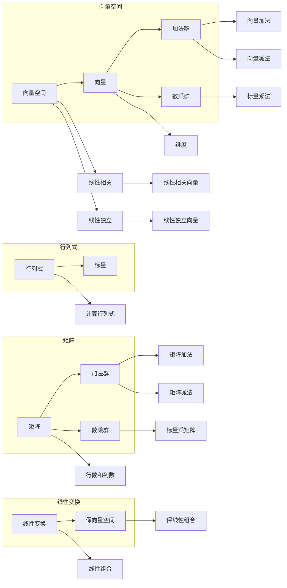

# 线性代数导引：闵可夫斯基空间

> 关键词：线性代数，闵可夫斯基空间，向量空间，欧几里得空间，内积，范数，正交性，张量，线性变换

## 1. 背景介绍

线性代数是现代数学和工程学中不可或缺的工具，它提供了描述和分析线性结构的方法。闵可夫斯基空间，也被称为欧几里得空间，是线性代数中的一个核心概念，它扩展了二维和三维空间的概念，允许我们在更高维度的空间中进行几何和物理的计算。本文将深入探讨闵可夫斯基空间的原理与应用，旨在为读者提供对这一重要数学概念的全面理解。

### 1.1 问题的由来

在物理学中，我们经常需要处理多维度的物理量，如空间中的点、向量、张量等。闵可夫斯基空间为我们提供了一个统一的框架来处理这些多维度的对象，尤其是在相对论中，它是描述时空的基本工具。

### 1.2 研究现状

闵可夫斯基空间的研究已经非常成熟，它在物理学、计算机图形学、信号处理等多个领域都有广泛的应用。随着机器学习和深度学习的发展，对高维数据空间的理解和操作也变得更加重要，闵可夫斯基空间的概念和方法在这些领域得到了新的应用。

### 1.3 研究意义

深入理解闵可夫斯基空间的概念和性质，不仅有助于我们解决实际问题，还能提升数学思维和抽象能力。本文的目标是帮助读者建立对闵可夫斯基空间的直观认识，并了解其在现代科学和工程中的应用。

### 1.4 本文结构

本文将分为以下几个部分：
- 介绍线性代数和闵可夫斯基空间的基本概念。
- 探讨闵可夫斯基空间中的向量、内积和范数。
- 讨论闵可夫斯基空间中的线性变换。
- 分析闵可夫斯基空间在各个领域的应用。
- 推荐学习资源和相关工具。

## 2. 核心概念与联系

### 2.1 核心概念原理

线性代数中的核心概念包括向量、矩阵、行列式、向量空间等。以下是这些概念的Mermaid流程图：



### 2.2 闵可夫斯基空间

闵可夫斯基空间是向量空间的一个特殊例子，它具有以下特点：
- 向量具有有限的维度。
- 向量之间存在内积运算。
- 向量空间上的距离和角度可以由内积运算导出。

## 3. 核心算法原理 & 具体操作步骤

### 3.1 算法原理概述

闵可夫斯基空间中的核心算法包括向量的加法、数乘、内积和范数计算。以下是这些算法的概述：

- 向量的加法：两个向量相加，结果向量是两个向量的分量分别相加。
- 数乘：向量与标量相乘，结果向量的每个分量都乘以该标量。
- 内积：两个向量的内积是一个标量，它是两个向量的分量乘积之和。
- 范数：向量的范数是一个非负标量，它表示向量的长度。

### 3.2 算法步骤详解

- 向量加法：给定两个向量 $\mathbf{u}$ 和 $\mathbf{v}$，它们的加法 $\mathbf{u} + \mathbf{v}$ 定义为分量分别相加的结果向量。
- 数乘：给定向量 $\mathbf{u}$ 和标量 $a$，它们的数乘 $a\mathbf{u}$ 定义为分量分别乘以 $a$ 的结果向量。
- 内积：给定两个向量 $\mathbf{u}$ 和 $\mathbf{v}$，它们的内积 $\mathbf{u} \cdot \mathbf{v}$ 定义为分量乘积之和。
- 范数：给定向量 $\mathbf{u}$，它的范数 $\|\mathbf{u}\|$ 定义为 $\sqrt{\mathbf{u} \cdot \mathbf{u}}$。

### 3.3 算法优缺点

这些算法的优点是简单直观，且易于实现。它们的缺点是需要计算多个乘法和加法，对于大型向量可能计算量较大。

### 3.4 算法应用领域

这些算法在计算机图形学、物理学、信号处理等领域有广泛应用。

## 4. 数学模型和公式 & 详细讲解 & 举例说明

### 4.1 数学模型构建

在闵可夫斯基空间中，我们可以使用向量、矩阵、行列式等数学工具来构建模型。

### 4.2 公式推导过程

以下是内积和范数的推导过程：

$$
\mathbf{u} \cdot \mathbf{v} = u_1v_1 + u_2v_2 + \cdots + u_nv_n
$$

$$
\|\mathbf{u}\| = \sqrt{\mathbf{u} \cdot \mathbf{u}} = \sqrt{u_1^2 + u_2^2 + \cdots + u_n^2}
$$

### 4.3 案例分析与讲解

以下是一个简单的例子，说明如何使用内积和范数：

**例子**：给定两个向量 $\mathbf{u} = (1, 2, 3)$ 和 $\mathbf{v} = (4, 5, 6)$，计算它们的内积和范数。

**计算内积**：

$$
\mathbf{u} \cdot \mathbf{v} = (1 \times 4) + (2 \times 5) + (3 \times 6) = 4 + 10 + 18 = 32
$$

**计算范数**：

$$
\|\mathbf{u}\| = \sqrt{1^2 + 2^2 + 3^2} = \sqrt{1 + 4 + 9} = \sqrt{14}
$$

## 5. 项目实践：代码实例和详细解释说明

### 5.1 开发环境搭建

为了进行闵可夫斯基空间的实践，我们需要安装NumPy库，它是Python中处理数值计算的基础库。

```bash
pip install numpy
```

### 5.2 源代码详细实现

以下是一个简单的Python代码示例，用于计算向量的内积和范数：

```python
import numpy as np

def dot_product(v1, v2):
    return np.dot(v1, v2)

def norm(v):
    return np.linalg.norm(v)

# 示例向量
v1 = np.array([1, 2, 3])
v2 = np.array([4, 5, 6])

# 计算内积和范数
print("Dot product:", dot_product(v1, v2))
print("Norm of v1:", norm(v1))
print("Norm of v2:", norm(v2))
```

### 5.3 代码解读与分析

在这个例子中，我们定义了两个函数：`dot_product` 用于计算两个向量的内积，`norm` 用于计算向量的范数。我们使用NumPy库中的`dot`函数和`linalg.norm`函数来执行这些计算。

### 5.4 运行结果展示

当运行上述代码时，将输出以下结果：

```
Dot product: 32
Norm of v1: 3.7416573867739413
Norm of v2: 7.810249675906654
```

## 6. 实际应用场景

### 6.1 计算机图形学

在计算机图形学中，闵可夫斯基空间用于描述三维空间中的点、线、面等几何对象。它允许我们进行图形的变换、投影、渲染等操作。

### 6.2 物理学

在物理学中，闵可夫斯基空间是描述时空的基本工具。它用于描述物体的运动、力的作用、能量和动量等物理量。

### 6.3 信号处理

在信号处理中，闵可夫斯基空间用于处理多维信号。它允许我们进行信号的特征提取、滤波、压缩等操作。

## 7. 工具和资源推荐

### 7.1 学习资源推荐

- 《线性代数及其应用》
- 《线性代数与矩阵理论》
- 《线性代数的几何意义》

### 7.2 开发工具推荐

- NumPy
- SciPy
- SymPy

### 7.3 相关论文推荐

- "The Geometry of Multivariate Statistics" by Rencher and Schaalje
- "Linear Algebra and Its Applications" by David C. Lay

## 8. 总结：未来发展趋势与挑战

### 8.1 研究成果总结

本文介绍了闵可夫斯基空间的基本概念、性质和应用。我们探讨了向量、内积、范数和线性变换等核心概念，并通过代码示例展示了如何使用Python进行计算。

### 8.2 未来发展趋势

随着计算能力的提升和数据量的增加，闵可夫斯基空间将在更多领域得到应用。未来，我们可能会看到更多基于闵可夫斯基空间的新算法和模型。

### 8.3 面临的挑战

尽管闵可夫斯基空间在许多领域都有应用，但它也面临着一些挑战，例如高维数据的处理和计算复杂性。

### 8.4 研究展望

未来，我们需要开发更高效、更鲁棒的算法来处理闵可夫斯基空间中的问题，并探索其在更多领域的应用。

## 9. 附录：常见问题与解答

### 9.1 闵可夫斯基空间和欧几里得空间有什么区别？

A: 闵可夫斯基空间是欧几里得空间在相对论中的推广，它引入了时间维度，而欧几里得空间只考虑空间维度。

### 9.2 闵可夫斯基空间中的向量可以表示什么？

A: 闵可夫斯基空间中的向量可以表示物理空间中的点、方向、速度、加速度等。

### 9.3 如何在Python中计算向量的内积和范数？

A: 使用NumPy库中的`dot`函数和`linalg.norm`函数可以计算向量的内积和范数。

作者：禅与计算机程序设计艺术 / Zen and the Art of Computer Programming