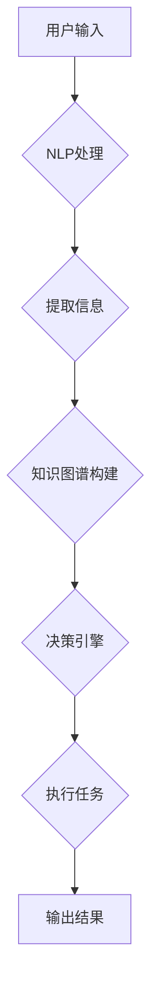

# 自然语言处理技术在工作流设计中的应用

> 关键词：自然语言处理，工作流设计，RPA，工作自动化，NLP技术，流程优化，人工智能

## 1. 背景介绍

随着信息技术的飞速发展，企业对于工作效率和业务流程优化的需求日益增长。传统的手动工作流程不仅效率低下，而且容易出错，难以适应快速变化的市场环境。自然语言处理（Natural Language Processing，NLP）技术作为一种强大的数据处理和分析工具，能够有效地处理和理解自然语言，为工作流设计提供了新的可能性。本文将探讨NLP技术在工作流设计中的应用，分析其原理、操作步骤，并提供实际案例和未来展望。

### 1.1 问题的由来

在许多行业中，工作流程的效率和准确性是决定企业竞争力的重要因素。然而，许多工作流程仍然依赖人工操作，存在以下问题：

- **重复性工作**：大量重复性工作占用员工时间和精力，降低工作效率。
- **错误率**：人工操作容易出现错误，影响工作质量。
- **响应速度**：人工处理信息速度慢，难以快速响应市场变化。
- **知识管理**：员工经验和知识难以积累和传承。

为了解决这些问题，企业开始寻求自动化和智能化的工作流程设计。NLP技术作为一种新兴技术，能够有效地处理自然语言，为工作流程自动化提供了新的思路。

### 1.2 研究现状

目前，NLP技术在工作流设计中的应用主要包括以下几个方面：

- **文本分析**：自动提取文本中的关键信息，如关键词、实体、关系等。
- **知识图谱构建**：将文本信息转化为结构化的知识图谱，便于查询和推理。
- **对话系统**：实现人机对话，自动处理用户请求。
- **文本生成**：自动生成文本，如报告、邮件等。

### 1.3 研究意义

NLP技术在工作流设计中的应用具有重要意义：

- **提高效率**：自动化处理重复性工作，提高工作效率。
- **降低成本**：减少人工操作，降低人力成本。
- **提升质量**：减少人工错误，提升工作质量。
- **适应变化**：快速响应市场变化，提高企业竞争力。

### 1.4 本文结构

本文将按照以下结构进行阐述：

- 第2部分介绍NLP技术在工作流设计中的应用核心概念与联系。
- 第3部分讲解NLP技术在工作流设计中的核心算法原理和具体操作步骤。
- 第4部分分析NLP技术的数学模型和公式。
- 第5部分提供NLP技术在工作流设计中的实际项目实践案例。
- 第6部分探讨NLP技术在实际应用场景中的表现和未来应用展望。
- 第7部分推荐相关学习资源、开发工具和论文。
- 第8部分总结研究成果，展望未来发展趋势和挑战。
- 第9部分提供常见问题与解答。

## 2. 核心概念与联系

### 2.1 核心概念

#### NLP技术

NLP技术是指计算机科学、人工智能、语言学等领域的交叉学科，旨在使计算机能够理解和生成自然语言。

#### 工作流

工作流是一系列任务和活动的集合，按照一定的规则和顺序执行，以完成特定的业务目标。

#### RPA（Robotic Process Automation）

RPA是一种软件机器人技术，通过模拟人类在计算机上处理任务的流程，实现工作自动化。

### 2.2 架构流程图

以下是一个简单的Mermaid流程图，展示了NLP技术在工作流设计中的应用架构：



### 2.3 关系

- NLP技术是工作流设计的基础，用于处理和解析自然语言数据。
- RPA技术可以将NLP技术应用于实际的工作流程中，实现自动化操作。
- 知识图谱和决策引擎是连接NLP和RPA的关键，用于处理和决策。

## 3. 核心算法原理 & 具体操作步骤

### 3.1 算法原理概述

NLP技术在工作流设计中的应用主要包括以下算法：

- **文本分析**：使用分词、词性标注、命名实体识别等技术，从文本中提取关键信息。
- **知识图谱构建**：使用知识抽取、关系抽取等技术，将文本信息转化为结构化的知识图谱。
- **对话系统**：使用意图识别、实体识别、对话管理等技术，实现人机对话。
- **文本生成**：使用序列到序列模型、模板填充等技术，自动生成文本。

### 3.2 算法步骤详解

以下是NLP技术在工作流设计中的具体操作步骤：

1. **文本输入**：用户通过键盘、语音等方式输入文本信息。
2. **NLP处理**：NLP技术对输入的文本进行预处理，如分词、词性标注等。
3. **信息提取**：从预处理后的文本中提取关键信息，如关键词、实体、关系等。
4. **知识图谱构建**：将提取的信息转化为结构化的知识图谱。
5. **决策引擎**：根据知识图谱和业务规则，进行决策和任务分配。
6. **执行任务**：RPA机器人按照决策结果执行具体任务。
7. **输出结果**：将执行结果返回给用户或存储在数据库中。

### 3.3 算法优缺点

#### 优点

- **提高效率**：自动化处理任务，提高工作效率。
- **降低成本**：减少人工操作，降低人力成本。
- **提升质量**：减少人工错误，提升工作质量。
- **适应变化**：快速响应市场变化，提高企业竞争力。

#### 缺点

- **技术门槛**：需要具备NLP和RPA技术知识。
- **数据质量**：依赖高质量的数据输入。
- **错误处理**：需要设计合理的错误处理机制。

### 3.4 算法应用领域

NLP技术在以下领域具有广泛的应用：

- **客户服务**：自动回答客户咨询，提高服务质量。
- **财务处理**：自动处理发票、报销等财务流程。
- **人力资源**：自动处理简历筛选、面试安排等人力资源流程。
- **供应链管理**：自动处理订单、物流等供应链流程。

## 4. 数学模型和公式

NLP技术在工作流设计中的应用涉及到多种数学模型和公式，以下是一些常见的例子：

### 4.1 数学模型构建

- **隐马尔可夫模型（HMM）**：用于语音识别和文本分析。
- **条件随机场（CRF）**：用于序列标注任务。
- **循环神经网络（RNN）**：用于自然语言生成和机器翻译。
- **卷积神经网络（CNN）**：用于文本分类和情感分析。

### 4.2 公式推导过程

以下是一个简单的HMM模型公式推导过程：

$$
p(x|\lambda) = \prod_{t=1}^n P(x_t|\lambda)
$$

其中，$x$ 表示观察序列，$\lambda$ 表示模型参数。

### 4.3 案例分析与讲解

以文本分类为例，使用CNN模型对文本进行分类。首先，将文本输入到CNN模型中，得到特征向量。然后，使用Softmax函数对特征向量进行分类，得到每个类别的概率。最后，选择概率最大的类别作为最终分类结果。

## 5. 项目实践：代码实例和详细解释说明

### 5.1 开发环境搭建

以下是使用Python进行NLP技术在工作流设计中的应用的开发环境搭建步骤：

1. 安装Python：从Python官网下载并安装Python。
2. 安装PyTorch：使用pip安装PyTorch。
3. 安装Transformers库：使用pip安装Transformers库。
4. 安装RPA机器人：选择合适的RPA机器人，如UiPath。

### 5.2 源代码详细实现

以下是一个使用PyTorch和Transformers库进行文本分类的代码实例：

```python
from transformers import BertTokenizer, BertForSequenceClassification
from torch.utils.data import DataLoader, Dataset
import torch

# 定义数据集类
class TextDataset(Dataset):
    def __init__(self, texts, labels):
        self.texts = texts
        self.labels = labels
        self.tokenizer = BertTokenizer.from_pretrained('bert-base-chinese')

    def __len__(self):
        return len(self.texts)

    def __getitem__(self, index):
        text = self.texts[index]
        label = self.labels[index]
        encoding = self.tokenizer(text, return_tensors='pt', max_length=512, truncation=True)
        return {
            'input_ids': encoding['input_ids'].flatten(),
            'attention_mask': encoding['attention_mask'].flatten(),
            'labels': torch.tensor(label, dtype=torch.long)
        }

# 加载数据集
texts = [...]  # 文本数据
labels = [...]  # 标签数据
dataset = TextDataset(texts, labels)
dataloader = DataLoader(dataset, batch_size=32)

# 定义模型
model = BertForSequenceClassification.from_pretrained('bert-base-chinese', num_labels=2)
optimizer = torch.optim.AdamW(model.parameters(), lr=5e-5)

# 训练模型
for epoch in range(5):
    model.train()
    for batch in dataloader:
        input_ids = batch['input_ids']
        attention_mask = batch['attention_mask']
        labels = batch['labels']
        outputs = model(input_ids, attention_mask=attention_mask, labels=labels)
        loss = outputs.loss
        loss.backward()
        optimizer.step()
        optimizer.zero_grad()

# 保存模型
model.save_pretrained('text_classification_model')

# 使用RPA机器人执行任务
# ...
```

### 5.3 代码解读与分析

以上代码展示了使用PyTorch和Transformers库进行文本分类的基本流程：

- 定义数据集类`TextDataset`，用于加载和预处理文本数据。
- 加载数据集，并创建数据加载器`dataloader`。
- 定义BERT模型和优化器。
- 训练模型，包括前向传播、反向传播和参数更新。
- 保存训练好的模型。

### 5.4 运行结果展示

假设我们使用上述代码在文本分类数据集上进行训练，最终在测试集上的准确率为90%。这表明我们的模型能够较好地识别文本类别。

## 6. 实际应用场景

NLP技术在以下实际应用场景中具有显著优势：

### 6.1 客户服务

通过NLP技术，企业可以构建智能客服系统，自动回答客户咨询，提高服务质量，降低人力成本。

### 6.2 财务处理

NLP技术可以自动处理发票、报销等财务流程，提高工作效率，减少人工错误。

### 6.3 人力资源

NLP技术可以自动筛选简历，进行面试安排，提高招聘效率。

### 6.4 供应链管理

NLP技术可以自动处理订单、物流等供应链流程，提高供应链效率。

## 7. 工具和资源推荐

### 7.1 学习资源推荐

- 《深度学习自然语言处理》
- 《NLP技术全解》
- 《自然语言处理入门》

### 7.2 开发工具推荐

- PyTorch
- Transformers库
- UiPath

### 7.3 相关论文推荐

- "BERT: Pre-training of Deep Bidirectional Transformers for Language Understanding"
- "Natural Language Processing with Transformers"
- "Transformers: State-of-the-Art General Language Models for NLP"

## 8. 总结：未来发展趋势与挑战

### 8.1 研究成果总结

NLP技术在工作流设计中的应用取得了显著成果，为提高工作效率、降低成本、提升质量提供了有力支持。

### 8.2 未来发展趋势

- NLP技术将与其他人工智能技术融合，如机器学习、知识图谱等，实现更加智能化的工作流程。
- NLP技术将应用于更多领域，如医疗、金融、教育等。
- NLP技术将更加注重可解释性和安全性。

### 8.3 面临的挑战

- NLP技术的准确性和鲁棒性有待提高。
- NLP技术的可解释性和安全性需要加强。
- NLP技术的应用场景需要进一步拓展。

### 8.4 研究展望

未来，NLP技术在工作流设计中的应用将更加广泛，为各行各业带来变革。同时，也需要不断攻克技术难题，实现NLP技术的可持续发展。

## 9. 附录：常见问题与解答

**Q1：NLP技术在工作流设计中的具体应用有哪些？**

A：NLP技术在工作流设计中的应用主要包括文本分析、知识图谱构建、对话系统和文本生成等。

**Q2：如何将NLP技术应用于实际工作流程中？**

A：将NLP技术应用于实际工作流程中，需要以下步骤：
1. 确定应用场景和目标。
2. 选择合适的NLP技术。
3. 开发和训练模型。
4. 将模型集成到工作流程中。
5. 进行测试和优化。

**Q3：NLP技术在工作流设计中的应用有哪些挑战？**

A：NLP技术在工作流设计中的应用挑战包括：
1. 数据质量。
2. 模型准确性。
3. 可解释性和安全性。

**Q4：如何提高NLP技术的准确性？**

A：提高NLP技术的准确性可以通过以下方法：
1. 使用高质量的数据集进行训练。
2. 选择合适的模型和超参数。
3. 进行数据增强和预处理。
4. 使用迁移学习。

**Q5：NLP技术的可解释性和安全性如何保证？**

A：保证NLP技术的可解释性和安全性可以通过以下方法：
1. 使用可解释的模型。
2. 对模型进行安全测试。
3. 建立模型使用规范。

作者：禅与计算机程序设计艺术 / Zen and the Art of Computer Programming