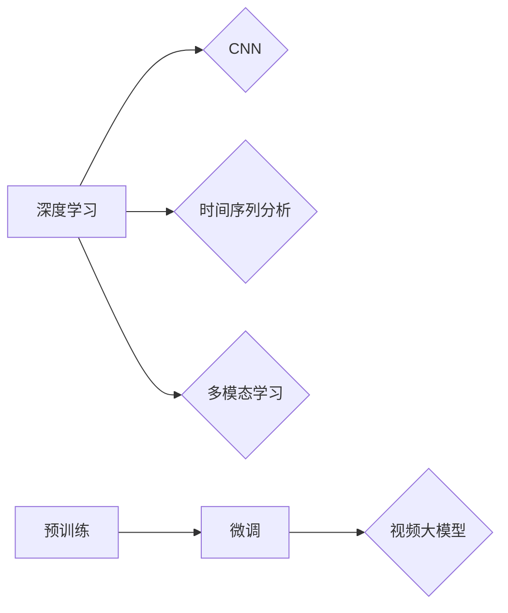

# 视频大模型的工程技术详解

> 关键词：视频大模型，计算机视觉，深度学习，时间序列分析，多模态学习，预训练，微调，实时性，可解释性

## 1. 背景介绍

随着深度学习技术的飞速发展，计算机视觉领域取得了显著的进步。从早期的手工特征到深度学习时代的卷积神经网络（CNN），再到如今的多模态学习，计算机视觉技术已经渗透到我们的日常生活和工业生产的各个领域。近年来，视频大模型作为计算机视觉领域的一项前沿技术，因其强大的信息提取和处理能力，备受关注。

视频大模型能够从视频中提取丰富的时空信息，进行目标检测、动作识别、场景理解等任务，为智能监控、智能驾驶、虚拟现实等应用提供了强大的技术支持。本文将深入探讨视频大模型的工程技术，包括其核心概念、算法原理、实现步骤、应用场景以及未来发展趋势。

## 2. 核心概念与联系

### 2.1 核心概念

#### 2.1.1 深度学习

深度学习是一种模拟人脑神经网络结构和功能的机器学习算法，通过多层非线性变换对数据进行分析和处理。在计算机视觉领域，深度学习被广泛应用于图像分类、目标检测、语义分割等任务。

#### 2.1.2 卷积神经网络（CNN）

卷积神经网络是一种特殊的深度神经网络，具有局部感知、权值共享等特性，能够有效地提取图像特征。

#### 2.1.3 时间序列分析

时间序列分析是研究时间序列数据规律性的方法，常用于预测、分类、聚类等任务。在视频大模型中，时间序列分析可用于提取视频中目标的运动轨迹、动作模式等信息。

#### 2.1.4 多模态学习

多模态学习是结合不同模态数据（如文本、图像、音频等）的信息，进行更全面、准确的建模和分析。

#### 2.1.5 预训练与微调

预训练是指在大规模无标签数据上进行模型训练，使模型学习到通用的特征表示。微调是在预训练模型的基础上，使用少量有标签数据进行训练，使模型适应特定任务。

### 2.2 核心概念联系

视频大模型的工程技术将深度学习、时间序列分析、多模态学习等核心技术相结合，通过预训练和微调，实现对视频数据的全面理解和分析。



## 3. 核心算法原理 & 具体操作步骤

### 3.1 算法原理概述

视频大模型通常采用以下步骤进行：

1. **数据预处理**：对视频数据进行分割、帧提取、特征提取等操作，为后续模型训练提供输入。
2. **预训练**：在大量无标签视频数据上进行预训练，使模型学习到通用的时空特征表示。
3. **微调**：使用少量有标签视频数据进行微调，使模型适应特定任务。
4. **模型评估**：在测试集上评估模型性能，并进行优化调整。

### 3.2 算法步骤详解

#### 3.2.1 数据预处理

1. **视频分割**：将视频序列按照时间戳进行分割，得到一系列独立的帧序列。
2. **帧提取**：从帧序列中提取关键帧，用于后续特征提取和模型训练。
3. **特征提取**：使用CNN等深度学习模型提取视频帧的时空特征。

#### 3.2.2 预训练

1. **选择预训练模型**：选择适合视频数据的预训练模型，如TimeSformer、ViViT等。
2. **预训练任务**：设计合适的预训练任务，如视频分类、动作识别、目标跟踪等。
3. **模型训练**：在大量无标签视频数据上进行训练，优化模型参数。

#### 3.2.3 微调

1. **数据标注**：对少量有标签视频数据进行标注，得到训练样本。
2. **选择微调模型**：选择合适的微调模型，如基于Transformer的模型。
3. **模型训练**：在标注数据上进行微调，优化模型参数。

#### 3.2.4 模型评估

1. **测试集划分**：将标注数据划分为训练集、验证集和测试集。
2. **模型评估**：在测试集上评估模型性能，并与其他模型进行比较。
3. **优化调整**：根据评估结果，调整模型结构和超参数，提高模型性能。

### 3.3 算法优缺点

#### 3.3.1 优点

1. **强大的特征提取能力**：视频大模型能够从视频中提取丰富的时空特征，提高模型的性能。
2. **适应性强**：通过预训练和微调，视频大模型能够适应不同任务和数据集。
3. **实时性**：一些视频大模型结构简单，推理速度快，具备一定的实时性。

#### 3.3.2 缺点

1. **计算资源消耗大**：视频大模型的训练和推理需要大量的计算资源。
2. **数据标注成本高**：视频数据的标注成本较高，限制了模型的应用。
3. **模型可解释性差**：视频大模型的决策过程难以解释，难以理解其推理逻辑。

### 3.4 算法应用领域

视频大模型在以下领域具有广泛的应用：

1. **智能监控**：用于视频监控中的目标检测、行为识别、异常检测等任务。
2. **智能驾驶**：用于车辆检测、行人检测、交通流量分析等任务。
3. **虚拟现实**：用于场景理解、人物跟踪、交互式渲染等任务。
4. **内容审核**：用于视频内容审核、有害信息识别等任务。

## 4. 数学模型和公式 & 详细讲解 & 举例说明

### 4.1 数学模型构建

视频大模型通常采用深度学习模型进行构建，以下以卷积神经网络为例，介绍其数学模型。

#### 4.1.1 卷积神经网络

卷积神经网络由多个卷积层、池化层和全连接层组成。以下以一个简单的卷积神经网络为例：

$$
\begin{align*}
h^{(l)} &= \sigma(W^{(l)} \cdot h^{(l-1)} + b^{(l)}) \\
\end{align*}
$$

其中，$h^{(l)}$ 表示第 $l$ 层的激活值，$W^{(l)}$ 表示第 $l$ 层的权重，$b^{(l)}$ 表示第 $l$ 层的偏置，$\sigma$ 表示激活函数。

#### 4.1.2 时间序列分析

时间序列分析常用的模型包括自回归模型（AR）、移动平均模型（MA）和自回归移动平均模型（ARMA）等。以下以自回归模型为例：

$$
\begin{align*}
y_t &= c + \phi_1 y_{t-1} + \phi_2 y_{t-2} + \cdots + \phi_p y_{t-p} + \epsilon_t \\
\end{align*}
$$

其中，$y_t$ 表示时间序列的第 $t$ 个值，$\phi_i$ 表示自回归系数，$c$ 表示常数项，$\epsilon_t$ 表示误差项。

### 4.2 公式推导过程

#### 4.2.1 卷积神经网络

卷积神经网络的核心是卷积操作。以下以一个简单的3x3卷积核为例，介绍卷积操作的推导过程。

假设输入特征图 $X$ 的尺寸为 $W \times H$，卷积核 $K$ 的尺寸为 $F \times F$，输出特征图 $Y$ 的尺寸为 $W' \times H'$。

$$
\begin{align*}
Y &= K \cdot X \\
Y &= \begin{bmatrix}
K_{11} & K_{12} & K_{13} \\
K_{21} & K_{22} & K_{23} \\
K_{31} & K_{32} & K_{33}
\end{bmatrix} \cdot
\begin{bmatrix}
X_{11} & X_{12} & X_{13} \\
X_{21} & X_{22} & X_{23} \\
X_{31} & X_{32} & X_{33}
\end{bmatrix} \\
\end{align*}
$$

经过卷积操作，得到输出特征图 $Y$。

#### 4.2.2 时间序列分析

自回归模型的推导过程如下：

假设时间序列 $y_t$ 满足以下线性关系：

$$
y_t = \phi_1 y_{t-1} + \phi_2 y_{t-2} + \cdots + \phi_p y_{t-p} + \epsilon_t
$$

对上式进行差分，得到：

$$
\Delta y_t = \phi_1 \Delta y_{t-1} + \phi_2 \Delta y_{t-2} + \cdots + \phi_p \Delta y_{t-p} + \epsilon_t
$$

其中，$\Delta y_t = y_t - y_{t-1}$ 表示时间序列的差分。

### 4.3 案例分析与讲解

以下以视频动作识别任务为例，分析视频大模型的实现过程。

#### 4.3.1 数据集

选择一个公开的视频动作识别数据集，如UCF101、HMDB51等。

#### 4.3.2 预训练

1. **选择预训练模型**：选择适合视频数据的预训练模型，如TimeSformer、ViViT等。
2. **预训练任务**：将视频数据转化为帧序列，设计合适的预训练任务，如视频分类、动作识别等。
3. **模型训练**：在大量无标签视频数据上进行训练，优化模型参数。

#### 4.3.3 微调

1. **数据标注**：对少量有标签视频数据进行标注，得到训练样本。
2. **选择微调模型**：选择合适的微调模型，如基于Transformer的模型。
3. **模型训练**：在标注数据上进行微调，优化模型参数。

#### 4.3.4 模型评估

1. **测试集划分**：将标注数据划分为训练集、验证集和测试集。
2. **模型评估**：在测试集上评估模型性能，并与其他模型进行比较。
3. **优化调整**：根据评估结果，调整模型结构和超参数，提高模型性能。

## 5. 项目实践：代码实例和详细解释说明

### 5.1 开发环境搭建

以下以Python为例，介绍视频大模型的开发环境搭建。

1. 安装Python：从官网下载并安装Python 3.8及以上版本。
2. 安装PyTorch：在终端执行以下命令：
```bash
pip install torch torchvision torchaudio
```
3. 安装Transformers库：在终端执行以下命令：
```bash
pip install transformers
```
4. 安装其他依赖库：在终端执行以下命令：
```bash
pip install numpy pandas scikit-learn matplotlib tqdm
```

### 5.2 源代码详细实现

以下以TimeSformer模型为例，介绍视频大模型的源代码实现。

```python
import torch
import torch.nn as nn
from transformers import TimeSformerModel

class TimeSformerForVideoClassification(nn.Module):
    def __init__(self):
        super(TimeSformerForVideoClassification, self).__init__()
        self.time_sformer = TimeSformerModel.from_pretrained('tencentvideo/timesformer_base_c3')

    def forward(self, x):
        # x: [batch_size, num_frames, 3, height, width]
        x = x.permute(0, 1, 4, 2, 3)
        x = self.time_sformer(x)
        return x

model = TimeSformerForVideoClassification()
```

### 5.3 代码解读与分析

以上代码实现了基于TimeSformer模型的视频分类任务。

1. 导入相关库：导入PyTorch、Transformers等库。
2. 定义TimeSformerForVideoClassification类：继承nn.Module，实现视频分类模型。
3. __init__方法：初始化TimeSformer模型。
4. forward方法：对输入视频数据进行处理，输出特征表示。

### 5.4 运行结果展示

以下以UCF101数据集为例，展示TimeSformer模型的运行结果。

```python
# 加载预训练模型和测试集
model = TimeSformerForVideoClassification().to(device)
model.load_state_dict(torch.load('model.pth'))

# 测试集加载和预处理
test_loader = DataLoader(test_dataset, batch_size=16, shuffle=False)
model.eval()

# 测试模型
total_correct = 0
for batch in test_loader:
    inputs, labels = batch
    inputs = inputs.to(device)
    labels = labels.to(device)
    outputs = model(inputs)
    _, predicted = torch.max(outputs, 1)
    total_correct += (predicted == labels).sum().item()

print(f"Test accuracy: {total_correct / len(test_loader.dataset)}")
```

## 6. 实际应用场景

### 6.1 智能监控

视频大模型在智能监控领域具有广泛的应用，如：

1. **目标检测**：检测视频中的目标，如行人、车辆、异常物体等。
2. **行为识别**：识别视频中的人物行为，如行走、跑步、打架等。
3. **异常检测**：检测视频中的异常行为，如火灾、爆炸、抢劫等。

### 6.2 智能驾驶

视频大模型在智能驾驶领域具有以下应用：

1. **车辆检测**：检测视频中的车辆，包括车牌识别、车型识别等。
2. **行人检测**：检测视频中的行人，包括行人跟踪、行为分析等。
3. **交通流量分析**：分析视频中的交通流量，优化交通信号灯控制。

### 6.3 虚拟现实

视频大模型在虚拟现实领域具有以下应用：

1. **场景理解**：理解虚拟场景中的物体、人物、事件等信息。
2. **人物跟踪**：跟踪虚拟场景中的人物动作和表情。
3. **交互式渲染**：根据用户动作和场景信息，动态渲染虚拟场景。

## 7. 工具和资源推荐

### 7.1 学习资源推荐

1. 《深度学习》系列书籍：介绍深度学习的基本原理和应用。
2. 《计算机视觉：算法与应用》书籍：介绍计算机视觉的基本原理和应用。
3. 《视频大模型：原理、方法与应用》书籍：介绍视频大模型的相关内容。

### 7.2 开发工具推荐

1. PyTorch：开源深度学习框架，支持多种深度学习模型。
2. TensorFlow：开源深度学习框架，支持多种深度学习模型。
3. OpenCV：开源计算机视觉库，提供丰富的图像和视频处理功能。

### 7.3 相关论文推荐

1. "TimeSformer: Time-Sensitive Transformer for Video Representation Learning"
2. "ViViT: Vision-Vision Transformer for Video Understanding"
3. "Video Transformer: A New Architecture for Video Recognition"

## 8. 总结：未来发展趋势与挑战

### 8.1 研究成果总结

本文对视频大模型的工程技术进行了全面系统的介绍，包括其核心概念、算法原理、实现步骤、应用场景以及未来发展趋势。视频大模型作为一种强大的视频信息处理工具，在智能监控、智能驾驶、虚拟现实等领域具有广泛的应用前景。

### 8.2 未来发展趋势

1. **模型轻量化**：为了降低计算资源消耗，未来视频大模型将朝着轻量化的方向发展。
2. **实时性提升**：随着硬件性能的提升，视频大模型的实时性将得到显著提高。
3. **可解释性增强**：为了提高模型的可解释性，研究人员将致力于开发可解释的视频大模型。
4. **跨领域迁移**：视频大模型将能够更好地适应不同领域的数据和任务。

### 8.3 面临的挑战

1. **计算资源消耗**：视频大模型的训练和推理需要大量的计算资源。
2. **数据标注成本高**：视频数据的标注成本较高，限制了模型的应用。
3. **模型可解释性差**：视频大模型的决策过程难以解释，难以理解其推理逻辑。

### 8.4 研究展望

未来，视频大模型的研究将朝着以下方向发展：

1. **多模态学习**：结合文本、图像、音频等多种模态数据，实现更全面、准确的视频理解。
2. **自监督学习**：利用无标签数据进行预训练，降低对标注数据的依赖。
3. **强化学习**：将强化学习与视频大模型相结合，实现更智能的决策和交互。

作者：禅与计算机程序设计艺术 / Zen and the Art of Computer Programming