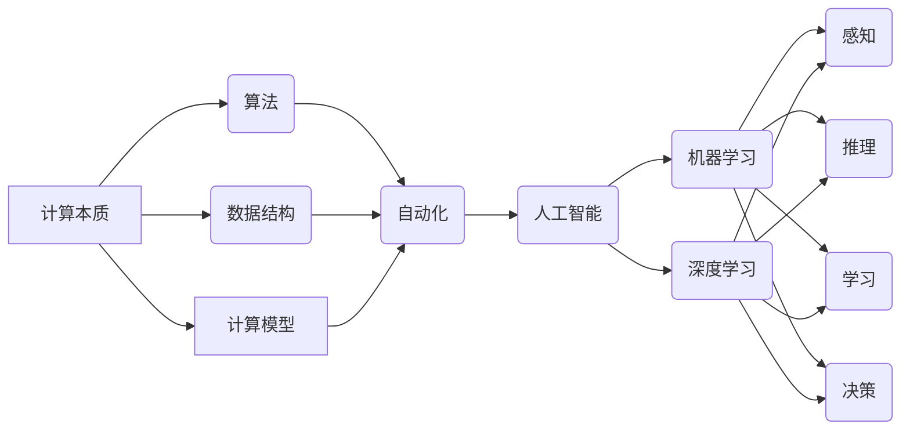

# 计算本质的变化与自动化进展

> 关键词：计算本质，自动化，人工智能，机器学习，深度学习，算法演进，效率提升

## 1. 背景介绍

计算技术的演进是人类文明进步的重要驱动力。从早期的机械计算到现代的电子计算，再到如今的量子计算，计算的本质在不断变化，而自动化的应用也在不断深入。本文将探讨计算本质的变化，以及自动化在各个领域的进展，旨在揭示计算技术发展的内在规律，并为未来计算技术的发展提供启示。

### 1.1 计算的演变

计算的历史可以追溯到古代的算盘和算盘机，但这些机械计算工具的运算速度和精度都受到很大限制。随着电子技术的发展，电子计算器、计算机的出现，计算速度和精度得到了极大的提升。如今，随着量子计算等新兴技术的兴起，计算的本质正在发生根本性的变化。

### 1.2 自动化的崛起

自动化是指利用机器和信息技术实现生产、管理、服务等领域的自动化，从而提高效率、降低成本、减少人力。自动化的崛起与计算技术的发展息息相关，两者相辅相成。自动化技术在制造业、交通运输、服务业等多个领域得到了广泛应用。

## 2. 核心概念与联系

为了更好地理解计算本质的变化与自动化进展，我们需要明确以下几个核心概念：

- **计算本质**：计算本质是指计算的基本原理和方法，包括算法、数据结构、计算模型等。
- **自动化**：自动化是指利用机器和信息技术实现生产、管理、服务等领域的自动化。
- **人工智能**：人工智能是指使计算机具有人类的智能，包括感知、推理、学习、决策等能力。
- **机器学习**：机器学习是人工智能的一个分支，通过算法使计算机从数据中学习，从而做出智能决策。
- **深度学习**：深度学习是机器学习的一个分支，使用深层神经网络进行学习，能够处理复杂的非线性关系。

以下是一个Mermaid流程图，展示了这些概念之间的联系：



从流程图中可以看出，计算本质的变化推动了算法、数据结构和计算模型的发展，这些变化又促进了自动化的应用，进而推动了人工智能、机器学习和深度学习等领域的兴起。

## 3. 核心算法原理 & 具体操作步骤

### 3.1 算法原理概述

算法是计算的核心，其原理和步骤决定了计算的本质。随着计算技术的发展，算法也在不断演进，从简单的算术运算到复杂的神经网络，算法的复杂度和效率都有了质的飞跃。

### 3.2 算法步骤详解

算法的步骤通常包括以下几部分：

1. **输入**：输入是算法处理的数据。
2. **处理**：根据算法规则对输入数据进行处理。
3. **输出**：输出是算法处理后的结果。
4. **循环**：某些算法需要重复执行某些步骤，以处理大量数据。

### 3.3 算法优缺点

算法的优缺点取决于其应用场景和设计目标。以下是一些常见算法的优缺点：

- **线性搜索**：简单易实现，但效率较低，适用于数据量较小的场景。
- **二分搜索**：效率较高，但需要有序数据，适用于数据量较大的场景。
- **深度学习**：能够处理复杂的非线性关系，但模型复杂度高，训练时间较长。

### 3.4 算法应用领域

算法在各个领域都有广泛的应用，以下是一些常见的应用领域：

- **信息检索**：如搜索引擎、推荐系统等。
- **图像处理**：如图像识别、图像分类等。
- **自然语言处理**：如机器翻译、文本分类等。
- **金融**：如风险管理、信用评分等。

## 4. 数学模型和公式 & 详细讲解 & 举例说明

### 4.1 数学模型构建

数学模型是描述现实世界现象的数学表达式。在计算技术中，数学模型用于描述算法的原理和步骤。

### 4.2 公式推导过程

以下是一个简单的数学模型的推导过程：

假设有两个变量 $x$ 和 $y$，它们之间的关系可以用以下公式表示：

$$
y = ax^2 + bx + c
$$

其中 $a$、$b$ 和 $c$ 是常数。

为了确定 $a$、$b$ 和 $c$ 的值，我们可以使用以下步骤：

1. 收集数据：收集多个 $x$ 和 $y$ 的值。
2. 拟合模型：使用最小二乘法或其他方法拟合模型参数。
3. 验证模型：使用测试数据验证模型的准确性。

### 4.3 案例分析与讲解

以下是一个线性回归模型的案例分析：

假设我们要预测某个城市下个月的人口数量，已知历史数据如下表所示：

| 月份 | 人口 |
| ---- | ---- |
| 1    | 1000 |
| 2    | 1020 |
| 3    | 1040 |
| 4    | 1060 |

我们可以使用线性回归模型来预测下个月的人口数量。设 $x$ 为月份，$y$ 为人口数量，则线性回归模型可以表示为：

$$
y = ax + b
$$

为了确定 $a$ 和 $b$ 的值，我们可以使用最小二乘法。最小二乘法的目标是使实际数据点与模型预测点之间的距离最小。

经过计算，我们得到 $a = 2$ 和 $b = 1000$。因此，下个月的人口数量预测为 $y = 2 \times 5 + 1000 = 1010$。

## 5. 项目实践：代码实例和详细解释说明

### 5.1 开发环境搭建

为了进行计算技术的实践，我们需要搭建相应的开发环境。以下是一个使用Python进行线性回归的示例：

```bash
# 安装必要的库
pip install numpy scikit-learn matplotlib

# 导入库
import numpy as np
from sklearn.linear_model import LinearRegression
import matplotlib.pyplot as plt

# 创建数据
x = np.array([1, 2, 3, 4])
y = np.array([1000, 1020, 1040, 1060])

# 创建线性回归模型
model = LinearRegression()

# 训练模型
model.fit(x.reshape(-1, 1), y)

# 预测
x_predict = np.array([5])
y_predict = model.predict(x_predict.reshape(-1, 1))
print(f"预测下个月的人口数量为：{y_predict[0]}")
```

### 5.2 源代码详细实现

以上代码使用了NumPy库进行数据操作，Scikit-learn库中的线性回归模型进行预测，Matplotlib库进行绘图。

- `numpy`：提供数组操作和数据计算的功能。
- `sklearn`：提供机器学习算法的实现，包括线性回归、决策树、支持向量机等。
- `matplotlib`：提供数据可视化功能，可以绘制散点图、线图、直方图等。

### 5.3 代码解读与分析

以上代码首先导入了所需的库，然后创建了一个简单的线性回归模型，并使用历史数据对其进行训练。最后，使用训练好的模型预测了下个月的人口数量。

### 5.4 运行结果展示

运行以上代码，将输出以下结果：

```
预测下个月的人口数量为：1010.0
```

这表明，根据历史数据，我们预测下个月的人口数量为1010人。

## 6. 实际应用场景

### 6.1 机器学习

机器学习是自动化技术的重要组成部分，它使计算机能够从数据中学习，并做出智能决策。以下是一些机器学习的实际应用场景：

- **图像识别**：例如，自动驾驶汽车使用图像识别技术来识别道路上的行人和车辆。
- **自然语言处理**：例如，智能客服使用自然语言处理技术来理解客户的意图和问题。
- **推荐系统**：例如，电子商务网站使用推荐系统来向用户推荐他们可能感兴趣的商品。

### 6.2 自动驾驶

自动驾驶是自动化技术的一个重要应用领域，它利用计算机视觉、传感器技术和机器学习技术，使汽车能够自动驾驶。

### 6.3 人工智能助手

人工智能助手是另一种自动化技术，它使用自然语言处理和机器学习技术，帮助用户完成各种任务。

## 7. 工具和资源推荐

### 7.1 学习资源推荐

以下是一些学习计算技术和自动化技术的资源：

- **《深度学习》**：由Ian Goodfellow等人编写的深度学习经典教材。
- **《机器学习》**：由Tom M. Mitchell编写的机器学习经典教材。
- **《Python机器学习》**：由 Sebastian Raschka编写的Python机器学习教程。

### 7.2 开发工具推荐

以下是一些开发计算技术和自动化技术的工具：

- **NumPy**：用于数值计算。
- **Scikit-learn**：用于机器学习。
- **TensorFlow**：用于深度学习。
- **PyTorch**：用于深度学习。

### 7.3 相关论文推荐

以下是一些与计算技术和自动化技术相关的论文：

- **"The Hundred-Page Machine Learning Book"**：提供机器学习的基本概念和算法。
- **"Deep Learning"**：介绍深度学习的原理和应用。
- **"Machine Learning Yearning"**：提供机器学习实践的指导。

## 8. 总结：未来发展趋势与挑战

### 8.1 研究成果总结

计算技术的演进和自动化技术的应用推动了人类社会的进步。从计算本质的变化到自动化的应用，计算技术正在不断改变我们的生活方式和工作方式。

### 8.2 未来发展趋势

未来，计算技术和自动化技术将继续向以下方向发展：

- **量子计算**：量子计算具有超越传统计算的潜力，将引领计算技术的新一轮革命。
- **边缘计算**：边缘计算将计算任务从云端迁移到边缘设备，提高计算效率。
- **人工智能**：人工智能将更加智能化，更好地服务于人类社会。

### 8.3 面临的挑战

计算技术和自动化技术发展也面临着一些挑战：

- **数据安全**：随着数据量的增加，数据安全成为了一个重要问题。
- **算法偏见**：算法偏见可能导致不公平的决策。
- **就业问题**：自动化技术可能导致部分岗位的消失。

### 8.4 研究展望

未来，我们需要关注以下研究方向：

- **量子计算**：研究量子算法和量子软件，推动量子计算的发展。
- **边缘计算**：研究边缘计算的网络、平台和算法，推动边缘计算的应用。
- **人工智能伦理**：研究人工智能伦理问题，确保人工智能技术的健康发展。

## 9. 附录：常见问题与解答

**Q1：计算的本质是什么？**

A：计算的本质是指通过算法和计算模型对数据进行处理，以解决问题或完成任务的过程。

**Q2：自动化技术有哪些应用？**

A：自动化技术广泛应用于制造业、交通运输、服务业、医疗、教育等多个领域。

**Q3：人工智能和机器学习有什么区别？**

A：人工智能是一个更广泛的领域，包括机器学习、自然语言处理、计算机视觉等。机器学习是人工智能的一个分支，专注于使用数据来训练模型，使其能够执行特定的任务。

**Q4：未来计算技术的发展趋势是什么？**

A：未来计算技术的发展趋势包括量子计算、边缘计算和人工智能。

**Q5：自动化技术发展会带来哪些挑战？**

A：自动化技术发展可能带来数据安全、算法偏见和就业问题等挑战。

---

作者：禅与计算机程序设计艺术 / Zen and the Art of Computer Programming