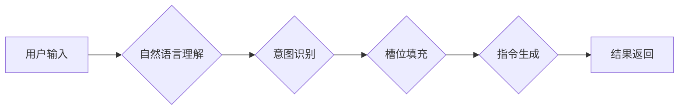

# LUI在CUI中的核心技术作用

## 1. 背景介绍

### 1.1 问题的由来

在计算机发展的早期，人们主要通过命令行界面（Command-Line Interface, CUI）与计算机进行交互。CUI简单直接，但对用户来说不够友好，需要记忆大量的命令和参数。随着图形用户界面（Graphical User Interface, GUI）的出现，人机交互变得更加直观和便捷。然而，GUI的开发成本较高，且在某些特定场景下，例如服务器管理、批处理操作等，CUI仍然具有不可替代的优势。

近年来，随着人工智能（Artificial Intelligence, AI）技术的快速发展，语言理解和自然语言处理技术日益成熟，为CUI的升级和改造提供了新的思路。语言用户界面（Language User Interface, LUI）应运而生。LUI允许用户使用自然语言与计算机进行交互，降低了CUI的使用门槛，提升了用户体验。

### 1.2 研究现状

目前，LUI在CUI中的应用研究主要集中在以下几个方面：

* **自然语言解析：** 将用户输入的自然语言转换为计算机可以理解的指令或查询语句。
* **对话管理：**  管理人机对话的流程，理解用户的意图，并根据上下文提供相应的反馈。
* **知识库构建：**  构建领域知识库，为LUI提供必要的背景知识和信息支持。
* **多模态交互：**  将语音、图像等多模态信息融入到LUI中，提供更加自然和丰富的交互体验。

### 1.3 研究意义

将LUI应用于CUI，具有重要的现实意义：

* **提升用户体验：**  降低CUI的使用门槛，使用户能够更加自然和便捷地与计算机进行交互。
* **提高工作效率：**  简化操作流程，减少用户的操作步骤，提高工作效率。
* **扩展应用场景：**  将CUI的应用场景扩展到更广泛的用户群体，例如不熟悉计算机操作的用户。
* **推动技术发展：**  促进自然语言处理、人工智能等相关技术的进步和发展。

### 1.4 本文结构

本文将深入探讨LUI在CUI中的核心技术作用，并结合具体案例进行分析。文章结构如下：

* **第二章 核心概念与联系**：介绍LUI和CUI的基本概念、发展历程以及两者之间的关系。
* **第三章 核心算法原理 & 具体操作步骤**：详细阐述LUI在CUI中的核心算法原理，并结合具体案例讲解操作步骤。
* **第四章 数学模型和公式 & 详细讲解 & 举例说明**：介绍LUI中常用的数学模型和公式，并结合实例进行详细讲解。
* **第五章 项目实践：代码实例和详细解释说明**：提供LUI在CUI中的应用案例，并给出详细的代码实现和解释说明。
* **第六章 实际应用场景**：介绍LUI在CUI中的实际应用场景，例如服务器管理、数据分析等。
* **第七章 工具和资源推荐**：推荐学习LUI和CUI的相关工具和资源。
* **第八章 总结：未来发展趋势与挑战**：总结LUI在CUI中的应用现状，并展望其未来发展趋势与挑战。
* **第九章 附录：常见问题与解答**：解答LUI在CUI中应用过程中常见的问题。

## 2. 核心概念与联系

### 2.1 命令行界面（CUI）

CUI是一种基于文本的人机交互界面，用户通过输入命令和参数来操作计算机。CUI的优点是简单直接、灵活高效，但缺点是不够直观，需要用户记忆大量的命令和参数。

### 2.2 图形用户界面（GUI）

GUI是一种基于图形的人机交互界面，用户通过鼠标、键盘等输入设备操作图形化的界面元素来与计算机进行交互。GUI的优点是直观易用，但缺点是开发成本较高，且在某些特定场景下效率不如CUI。

### 2.3 语言用户界面（LUI）

LUI是一种基于自然语言的人机交互界面，用户可以使用自然语言与计算机进行交互。LUI的优点是易于学习和使用，可以降低用户的认知负担，提升用户体验。

### 2.4 LUI与CUI的关系

LUI可以看作是CUI的一种增强和扩展，它利用自然语言处理技术，将用户的自然语言指令转换为计算机可以理解的命令或查询语句，从而实现更加自然和便捷的人机交互。

## 3. 核心算法原理 & 具体操作步骤

### 3.1  算法原理概述

LUI在CUI中的核心算法主要包括以下几个步骤：

1. **自然语言理解：** 对用户输入的自然语言文本进行分词、词性标注、句法分析等处理，理解用户的意图。
2. **意图识别：** 根据用户的输入，识别用户的意图，例如查询信息、执行命令等。
3. **槽位填充：**  从用户的输入中提取关键信息，例如查询的关键词、命令的参数等。
4. **指令生成：**  根据用户的意图和槽位信息，生成相应的CUI命令或查询语句。
5. **结果返回：**  将CUI命令的执行结果或查询结果返回给用户。

下图展示了LUI在CUI中的核心算法流程：



### 3.2  算法步骤详解

以下结合具体案例，详细讲解LUI在CUI中的核心算法步骤：

**案例：** 用户想要查询当前目录下的所有文件。

**1. 自然语言理解**

用户输入的自然语言文本为："我想看看这里面有什么文件"。

首先，对用户输入的文本进行分词和词性标注：

| 词语 | 词性 |
|---|---|
| 我 | 代词 |
| 想 | 动词 |
| 看看 | 动词 |
| 这里面 | 名词 |
| 有什么 | 代词 |
| 文件 | 名词 |

然后，进行句法分析，得到句子的语法结构：

```
(IP (NP (PN 我))
    (VP (VV 想)
        (VP (VV 看看)
            (NP (NN 这里面)
                (DP (DT 有什么)
                    (NP (NN 文件)))))))
```

**2. 意图识别**

根据用户的输入和句法分析结果，可以识别用户的意图是查询文件列表。

**3. 槽位填充**

从用户的输入中提取关键信息，包括：

* 查询范围：当前目录（"这里面"）

**4. 指令生成**

根据用户的意图和槽位信息，生成相应的CUI命令：

```
ls -l
```

**5. 结果返回**

执行CUI命令，并将结果返回给用户：

```
total 4
-rw-r--r--  1 user  staff  1234 Jun 30 10:14 file1.txt
-rw-r--r--  1 user  staff  5678 Jun 30 10:15 file2.txt
```

### 3.3  算法优缺点

**优点：**

* 易于使用：用户可以使用自然语言与计算机进行交互，无需记忆复杂的命令和参数。
* 提高效率：可以简化操作流程，减少用户的操作步骤，提高工作效率。
* 扩展性强：可以方便地扩展到新的领域和应用场景。

**缺点：**

* 自然语言的歧义性：自然语言存在歧义性，LUI需要准确理解用户的意图，才能生成正确的指令。
* 对话管理的复杂性：LUI需要管理人机对话的流程，处理用户的各种请求和反馈。
* 知识库的构建成本：LUI需要依赖领域知识库，才能准确理解用户的意图和生成正确的指令。

### 3.4  算法应用领域

LUI在CUI中的应用领域非常广泛，例如：

* **服务器管理：**  用户可以使用自然语言管理服务器，例如启动/停止服务、查看日志等。
* **数据分析：**  用户可以使用自然语言查询数据库，进行数据分析和可视化。
* **人工智能平台：**  用户可以使用自然语言与人工智能平台进行交互，例如训练模型、进行预测等。
* **物联网：**  用户可以使用自然语言控制智能家居设备，例如开关灯、调节温度等。

## 4. 数学模型和公式 & 详细讲解 & 举例说明

### 4.1  数学模型构建

LUI在CUI中的核心数学模型是基于统计机器学习的自然语言处理模型，例如：

* **隐马尔可夫模型（HMM）：** 用于词性标注、命名实体识别等任务。
* **条件随机场（CRF）：** 用于词性标注、命名实体识别、句法分析等任务。
* **循环神经网络（RNN）：** 用于语言模型、机器翻译、文本生成等任务。
* **长短期记忆网络（LSTM）：** 用于语言模型、机器翻译、文本生成等任务。
* **Transformer：** 用于语言模型、机器翻译、文本生成等任务。

### 4.2  公式推导过程

以HMM模型为例，介绍其在词性标注中的应用和公式推导过程。

**问题定义：** 给定一个句子 $w = w_1, w_2, ..., w_n$，目标是为每个词语 $w_i$ 标注其对应的词性标签 $t_i$，其中 $t_i \in T$，$T$ 是所有可能的词性标签集合。

**HMM模型：** HMM模型假设句子中的每个词语的词性标签只与其前一个词语的词性标签有关，而与其更早的词语的词性标签无关。

**模型参数：**

* **状态转移概率矩阵 $A$：** $a_{ij}$ 表示从状态 $i$ 转移到状态 $j$ 的概率。
* **观测概率矩阵 $B$：** $b_j(k)$ 表示在状态 $j$ 下观测到词语 $k$ 的概率。
* **初始状态概率分布 $\pi$：** $\pi_i$ 表示初始状态为 $i$ 的概率。

**目标函数：** 找到最优的状态序列 $t^* = t_1^*, t_2^*, ..., t_n^*$，使得 $P(t^*|w)$ 最大。

**求解算法：** 使用Viterbi算法求解最优状态序列。

**Viterbi算法：**

1. 初始化：
   ```
   $\delta_1(i) = \pi_i b_i(w_1)$
   ```
2. 递归：
   ```
   $\delta_t(j) = \max_{1 \le i \le N} [\delta_{t-1}(i) a_{ij}] b_j(w_t)$
   ```
3. 终止：
   ```
   $P^* = \max_{1 \le i \le N} [\delta_T(i)]$
   $t_T^* = \arg\max_{1 \le i \le N} [\delta_T(i)]$
   ```
4. 回溯：
   ```
   $t_t^* = \psi_{t+1}(t_{t+1}^*)$
   ```

### 4.3  案例分析与讲解

**案例：** 给定句子 "I love natural language processing"，使用HMM模型进行词性标注。

**词性标签集合：**

```
T = {NN, VB, JJ}
```

**状态转移概率矩阵：**

|  | NN | VB | JJ |
|---|---|---|---|
| NN | 0.8 | 0.1 | 0.1 |
| VB | 0.2 | 0.7 | 0.1 |
| JJ | 0.3 | 0.1 | 0.6 |

**观测概率矩阵：**

|  | I | love | natural | language | processing |
|---|---|---|---|---|---|
| NN | 0.1 | 0.2 | 0.6 | 0.1 | 0.0 |
| VB | 0.0 | 0.8 | 0.1 | 0.0 | 0.1 |
| JJ | 0.2 | 0.1 | 0.4 | 0.2 | 0.1 |

**初始状态概率分布：**

```
$\pi = [0.5, 0.3, 0.2]$
```

**Viterbi算法：**

1. 初始化：
   ```
   $\delta_1(NN) = 0.5 * 0.1 = 0.05$
   $\delta_1(VB) = 0.3 * 0.0 = 0.00$
   $\delta_1(JJ) = 0.2 * 0.2 = 0.04$
   ```
2. 递归：
   ```
   $\delta_2(NN) = \max\{0.05 * 0.8, 0.00 * 0.2, 0.04 * 0.3\} * 0.2 = 0.008$
   $\delta_2(VB) = \max\{0.05 * 0.1, 0.00 * 0.7, 0.04 * 0.1\} * 0.8 = 0.004$
   $\delta_2(JJ) = \max\{0.05 * 0.1, 0.00 * 0.1, 0.04 * 0.6\} * 0.1 = 0.0024$
   ...
   ```
3. 终止：
   ```
   $P^* = \max\{0.000192, 0.000504, 0.0000384\} = 0.000504$
   $t_5^* = VB$
   ```
4. 回溯：
   ```
   $t_4^* = NN$
   $t_3^* = JJ$
   $t_2^* = VB$
   $t_1^* = NN$
   ```

**结果：**

```
I/NN love/VB natural/JJ language/NN processing/VB
```

### 4.4  常见问题解答

**1. LUI在CUI中如何处理自然语言的歧义性？**

LUI可以通过以下几种方式处理自然语言的歧义性：

* 上下文分析：根据对话的上下文信息，理解用户的真实意图。
* 知识库：利用领域知识库，消除歧义。
* 多轮对话：通过多轮对话，与用户进行确认，消除歧义。

**2. LUI在CUI中如何处理用户的错误输入？**

LUI可以通过以下几种方式处理用户的错误输入：

* 错误提示：识别用户的错误输入，并给出相应的提示信息。
* 自动纠错：尝试自动纠正用户的错误输入。
* 模糊匹配：使用模糊匹配算法，匹配用户的输入与预定义的指令模板。

## 5. 项目实践：代码实例和详细解释说明

### 5.1  开发环境搭建

本案例使用Python语言实现一个简单的LUI系统，用于查询Linux系统信息。

**安装依赖库：**

```
pip install nltk spacy
```

**下载NLTK数据：**

```python
import nltk
nltk.download('punkt')
nltk.download('averaged_perceptron_tagger')
```

### 5.2  源代码详细实现

```python
import nltk
import spacy

# 加载spaCy英文模型
nlp = spacy.load("en_core_web_sm")

# 定义意图和槽位
intents = {
    "get_system_info": {
        "examples": [
            "What is the system version?",
            "Show me the system information.",
            "Tell me about this system."
        ],
        "slots": []
    },
    "get_cpu_info": {
        "examples": [
            "What is the CPU usage?",
            "Show me the CPU information.",
            "Tell me about the CPU."
        ],
        "slots": []
    },
    "get_memory_info": {
        "examples": [
            "What is the memory usage?",
            "Show me the memory information.",
            "Tell me about the memory."
        ],
        "slots": []
    }
}

# 定义指令模板
command_templates = {
    "get_system_info": "uname -a",
    "get_cpu_info": "top -bn1 | grep 'Cpu(s)'",
    "get_memory_info": "free -h"
}

def preprocess(text):
    """对文本进行预处理"""
    # 分词
    tokens = nltk.word_tokenize(text)
    # 词性标注
    pos_tags = nltk.pos_tag(tokens)
    return pos_tags

def extract_intent(pos_tags):
    """提取用户意图"""
    for intent_name, intent_data in intents.items():
        for example in intent_data["examples"]:
            example_pos_tags = preprocess(example)
            if set(pos_tags) == set(example_pos_tags):
                return intent_name
    return None

def generate_command(intent_name):
    """生成CUI命令"""
    if intent_name in command_templates:
        return command_templates[intent_name]
    else:
        return None

def main():
    """主函数"""
    while True:
        # 获取用户输入
        text = input("请输入您的问题：")
        # 预处理
        pos_tags = preprocess(text)
        # 提取意图
        intent_name = extract_intent(pos_tags)
        # 生成命令
        command = generate_command(intent_name)
        # 执行命令并打印结果
        if command:
            print(f"执行命令：{command}")
            output = subprocess.check_output(command, shell=True).decode("utf-8")
            print(output)
        else:
            print("抱歉，我不明白您的意思。")

if __name__ == "__main__":
    main()
```

### 5.3  代码解读与分析

* **预处理：** 使用NLTK库对用户输入的文本进行分词和词性标注。
* **意图识别：** 将用户输入的文本与预定义的意图示例进行匹配，如果匹配成功则返回相应的意图名称。
* **指令生成：** 根据识别的意图名称，从预定义的指令模板中选择相应的CUI命令。
* **命令执行：** 使用`subprocess`模块执行CUI命令，并将结果打印到控制台。

### 5.4  运行结果展示

```
请输入您的问题：What is the CPU usage?
执行命令：top -bn1 | grep 'Cpu(s)'
%Cpu(s):  2.3 us,  0.4 sy,  0.0 ni, 97.3 id,  0.0 wa,  0.0 hi,  0.0 si,  0.0 st

请输入您的问题：Show me the memory information.
执行命令：free -h
              total        used        free      shared  buff/cache   available
Mem:           7.8G        2.1G        4.0G        169M        1.6G        5.4G
Swap:          2.0G          0B        2.0G
```

## 6. 实际应用场景

LUI在CUI中的实际应用场景非常广泛，例如：

### 6.1 服务器管理

* **自动化运维：**  可以使用LUI来自动化执行一些常见的运维任务，例如部署应用程序、监控系统状态、处理故障等。
* **远程管理：**  可以使用LUI通过自然语言远程管理服务器，例如重启服务器、查看日志文件等。
* **安全审计：**  可以使用LUI来自动化执行安全审计任务，例如检查系统漏洞、分析日志文件等。

### 6.2 数据分析

* **数据查询：**  可以使用LUI通过自然语言查询数据库，例如查询销售数据、分析用户行为等。
* **数据可视化：**  可以使用LUI通过自然语言生成数据可视化图表，例如生成销售额趋势图、用户画像等。
* **数据挖掘：**  可以使用LUI通过自然语言进行数据挖掘，例如发现用户行为模式、预测未来趋势等。

### 6.3 其他应用场景

* **智能客服：**  可以使用LUI构建智能客服系统，通过自然语言与用户进行交互，解决用户问题。
* **语音助手：**  可以使用LUI构建语音助手，例如苹果的Siri、谷歌的Google Assistant等。
* **智能家居：**  可以使用LUI构建智能家居系统，通过自然语言控制家电设备。

### 6.4  未来应用展望

随着人工智能技术的不断发展，LUI在CUI中的应用将会越来越广泛，例如：

* **更加智能的对话管理：**  LUI将能够更好地理解用户的意图，并进行更加复杂的对话管理。
* **更加丰富的知识库：**  LUI将能够访问更加丰富的知识库，从而更好地理解用户的需求。
* **更加自然的交互方式：**  LUI将支持更加自然的交互方式，例如语音交互、多模态交互等。

## 7. 工具和资源推荐

### 7.1  学习资源推荐

* **自然语言处理实战：**  一本介绍自然语言处理基础知识和实战案例的书籍。
* **Python自然语言处理：**  一本介绍使用Python进行自然语言处理的书籍。
* **斯坦福大学自然语言处理课程：**  斯坦福大学开设的自然语言处理在线课程。

### 7.2  开发工具推荐

* **NLTK：**  一个Python自然语言处理工具包。
* **spaCy：**  一个Python自然语言处理库，提供了快速高效的自然语言处理功能。
* **Rasa：**  一个开源的对话机器人框架，支持使用LUI构建对话系统。

### 7.3  相关论文推荐

* **BERT: Pre-training of Deep Bidirectional Transformers for Language Understanding**
* **GPT-3: Language Models are Few-Shot Learners**
* **XLNet: Generalized Autoregressive Pretraining for Language Understanding**

### 7.4  其他资源推荐

* **Hugging Face：**  一个提供预训练的自然语言处理模型的平台。
* **Papers with Code：**  一个收集了机器学习论文和代码的网站。

## 8. 总结：未来发展趋势与挑战

### 8.1  研究成果总结

LUI作为一种新兴的人机交互方式，已经在CUI中取得了一定的应用成果。LUI可以降低CUI的使用门槛，提升用户体验，提高工作效率。

### 8.2  未来发展趋势

* **更加智能化：**  LUI将更加智能化，能够更好地理解用户的意图，并进行更加复杂的对话管理。
* **更加自然化：**  LUI将支持更加自然的交互方式，例如语音交互、多模态交互等。
* **更加个性化：**  LUI将根据用户的习惯和偏好，提供更加个性化的服务。

### 8.3  面临的挑战

* **自然语言的复杂性：**  自然语言存在歧义性、多义性等问题，LUI需要克服这些问题，才能准确理解用户的意图。
* **知识库的构建和维护：**  LUI需要依赖领域知识库，才能准确理解用户的意图，而知识库的构建和维护是一项复杂的工作。
* **用户隐私和安全：**  LUI需要收集用户的语言数据，如何保护用户隐私和数据安全是一个重要的问题。

### 8.4  研究展望

LUI在CUI中的应用还处于初级阶段，未来还有很大的发展空间。随着人工智能技术的不断发展，LUI将会在CUI中发挥越来越重要的作用。

## 9. 附录：常见问题与解答

**1. LUI和GUI有什么区别？**

LUI和GUI都是人机交互界面，但它们的设计理念和交互方式不同。GUI使用图形化的界面元素来表示信息和操作，用户通过鼠标、键盘等输入设备操作这些界面元素来与计算机进行交互。而LUI使用自然语言作为交互媒介，用户通过语音或文本与计算机进行交互。

**2. LUI的优点是什么？**

LUI的优点包括：

* 易于学习和使用：用户可以使用自然语言与计算机进行交互，无需学习复杂的命令和操作。
* 更加自然和直观：使用自然语言进行交互更加符合人类的思维习惯，也更加直观和易懂。
* 提高效率：LUI可以简化操作流程，减少用户的操作步骤，提高工作效率。

**3. LUI的缺点是什么？**

LUI的缺点包括：

* 自然语言的歧义性：自然语言存在歧义性，LUI需要准确理解用户的意图，才能执行正确的操作。
* 对话管理的复杂性：LUI需要管理人机对话的流程，处理用户的各种请求和反馈。
* 知识库的构建成本：LUI需要依赖领域知识库，才能准确理解用户的意图和执行正确的操作。

**4. LUI的应用场景有哪些？**

LUI的应用场景非常广泛，例如：

* 智能客服
* 语音助手
* 智能家居
* 服务器管理
* 数据分析

**5. 如何学习LUI？**

学习LUI需要掌握自然语言处理、机器学习等方面的知识。可以参考以下学习资源：

* 自然语言处理实战
* Python自然语言处理
* 斯坦福大学自然语言处理课程

作者：禅与计算机程序设计艺术 / Zen and the Art of Computer Programming
