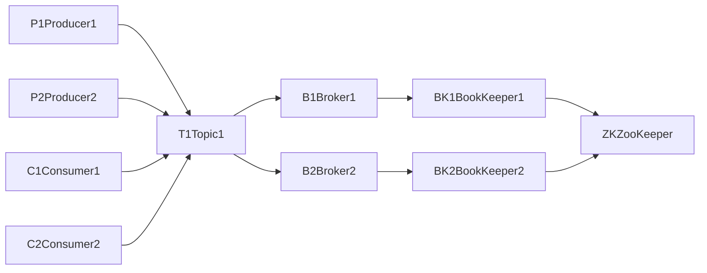

# Pulsar原理与代码实例讲解

作者：禅与计算机程序设计艺术 / Zen and the Art of Computer Programming

## 1. 背景介绍

### 1.1 问题的由来
随着大数据时代的到来,海量数据的实时处理和分析已成为许多企业和组织面临的重大挑战。传统的批处理系统难以满足实时性要求,而流处理系统则因吞吐量和容错性不足而受到限制。在这种背景下,Apache Pulsar应运而生,它是一个云原生的分布式消息流平台,旨在解决大规模实时数据处理中的诸多难题。

### 1.2 研究现状
目前业界已有多个成熟的分布式消息队列系统,如Apache Kafka、RabbitMQ等,它们各有优势和局限性。Pulsar作为后起之秀,在吸收前辈经验教训的基础上,引入了诸多创新设计,使其在性能、灵活性、易用性等方面更胜一筹。越来越多的公司开始关注和采用Pulsar,但对其内部原理的系统性讲解还相对缺乏。

### 1.3 研究意义
深入理解Pulsar的架构设计和核心原理,对于开发人员高效使用该系统至关重要。通过阐释Pulsar的关键概念、数据模型、存储机制、消息路由算法等,可以帮助读者全面把握其技术特点和优势。同时,借助代码实例的详细讲解,读者可以更直观地领会Pulsar的使用方法和最佳实践,提升开发效率。本文的研究对于Pulsar技术的推广普及具有重要意义。

### 1.4 本文结构
本文将从以下几个方面展开对Pulsar原理的讲解：首先介绍Pulsar的核心概念和总体架构;然后重点阐释Pulsar的存储机制、消息路由、订阅模型等关键技术原理;接着通过数学建模分析Pulsar的性能特征;并辅以详细的代码实例解读Pulsar的使用方法;最后总结Pulsar的应用场景和未来发展趋势。

## 2. 核心概念与联系

在深入探讨Pulsar原理之前,有必要先明确几个核心概念：

- Topic(主题):消息的逻辑传递通道,生产者向其发送消息,消费者从中接收消息。
- Producer(生产者):发布消息到Topic的角色。
- Consumer(消费者):从Topic订阅和消费消息的角色。
- Broker:负责接收、缓存和分发消息的服务节点。
- BookKeeper:专门的分布式日志存储系统,用于持久化存储消息。
- ZooKeeper:提供分布式协调服务,用于元数据管理和状态同步。

下图展示了这些核心组件在Pulsar架构中的位置和关系:



可以看出,Producer通过发布消息到Topic来启动消息流,Broker接收并缓存消息,同时将消息持久化到BookKeeper中。ZooKeeper负责协调Broker和BookKeeper之间的状态同步。Consumer通过订阅Topic来消费消息。这种分层解耦的架构赋予了Pulsar极大的灵活性和可扩展性。

## 3. 核心算法原理 & 具体操作步骤

### 3.1 算法原理概述
Pulsar采用了Segment-based的存储机制和Consistent Hashing的消息路由算法,可以支持海量消息的高吞吐存储和低延迟访问。

### 3.2 算法步骤详解

#### 3.2.1 Segment存储
Pulsar将消息流切分成多个Segment进行存储,每个Segment是一个追加写的日志文件。Segment的大小可配置,例如128MB。当前Segment写满后,Broker会自动切换到下一个Segment。通过预先分配一系列Segment,可实现无锁的高并发写入。

Segment的具体存储步骤如下:
1. Broker接收到Producer发来的消息。
2. Broker将消息追加到当前写入的Segment中。
3. 如果当前Segment已满,则关闭该Segment并打开下一个Segment。
4. Broker将已写完的Segment持久化到BookKeeper中。
5. 每个Segment在BookKeeper中对应一个Ledger。

#### 3.2.2 Consistent Hashing路由
当有多个Broker时,Pulsar使用Consistent Hashing算法将消息路由到不同的Broker上,从而实现负载均衡。

具体步骤如下:
1. 将Broker节点映射到一个Hash环上。
2. 对Topic名进行Hash运算,确定其在Hash环上的位置。
3. 顺时针找到第一个Broker节点,该Topic的消息将由这个Broker负责存储。
4. 发送到该Topic的消息会被路由到对应的Broker。
5. 如果某个Broker失效,则Hash映射会自动跳到下一个Broker,实现故障转移。

### 3.3 算法优缺点

Pulsar存储和路由算法的优点有:
- 无锁高并发写入,吞吐量高。
- 负载均衡,避免热点。
- 故障自动转移,高可用。
- 水平扩展性好,可线性增加Broker节点。

当前主要缺点是元数据管理开销相对较大,对ZooKeeper依赖较重。

### 3.4 算法应用领域
Pulsar凭借其优异的性能和灵活性,在消息队列、流处理、事件驱动架构等领域得到广泛应用。尤其适合在金融、电商、物联网等对实时性要求高的场景下使用。

## 4. 数学模型和公式 & 详细讲解 & 举例说明

### 4.1 数学模型构建
我们可以用排队论的MM1模型来分析Pulsar单个Broker的平均消息处理延迟。假设消息到达服从参数为$\lambda$的泊松分布,Broker的服务时间服从参数为$\mu$的指数分布,则平均消息处理延迟为:

$$
T = \frac{1}{\mu - \lambda}
$$

其中,$\lambda$表示平均到达率(Arrival Rate),即单位时间内平均到达的消息数量;$\mu$表示平均服务率(Service Rate),即Broker单位时间内平均可处理的消息数量。

### 4.2 公式推导过程
根据Little定律,在稳态系统中,平均队列长度$L$与平均到达率$\lambda$和平均逗留时间$T$的关系为:

$$
L = \lambda T
$$

由于MM1模型的平均队列长度公式为:

$$
L = \frac{\rho}{1-\rho} = \frac{\lambda}{\mu-\lambda}
$$

其中,$\rho=\frac{\lambda}{\mu}$,代表服务强度(Traffic Intensity)。

因此可得平均消息处理延迟:

$$
\begin{aligned}
T &= \frac{L}{\lambda} \
&= \frac{\frac{\lambda}{\mu-\lambda}}{\lambda} \
&= \frac{1}{\mu - \lambda}
\end{aligned}
$$

可见,当$\lambda$接近$\mu$时,即到达率接近服务率时,平均延迟会急剧增大。这启示我们要预留足够的服务能力,避免过载。

### 4.3 案例分析与讲解
假设Broker的平均服务率是1000条消息/秒,在不同的消息到达率下,平均处理延迟如下:

| 到达率(条/秒) | 平均延迟(毫秒) |
|------------|------------|
| 100        | 1.11        |
| 500        | 2.00       |
| 800        | 5.00       |
| 900        | 10.00      |
| 950        | 20.00      |

可以看出,当到达率从100增加到900时,平均延迟从1.11毫秒增加到10毫秒,而再增加到950时,平均延迟就激增到20毫秒。这说明要严格控制消息到达率,避免接近服务能力上限。

### 4.4 常见问题解答
问:如果Pulsar的单Broker服务能力无法满足需求怎么办?
答:可以增加Broker数量,使用Consistent Hashing在多个Broker间进行负载均衡,从而线性提升整个系统的服务能力。

## 5. 项目实践：代码实例和详细解释说明

下面通过一个简单的Java代码实例,演示如何使用Pulsar的Producer API发送消息。

### 5.1 开发环境搭建
首先在pom.xml中添加Pulsar客户端依赖:

```xml
<dependency>
    <groupId>org.apache.pulsar</groupId>
    <artifactId>pulsar-client</artifactId>
    <version>2.7.2</version>
</dependency>
```

### 5.2 源代码详细实现

```java
import org.apache.pulsar.client.api.Producer;
import org.apache.pulsar.client.api.PulsarClient;
import org.apache.pulsar.client.api.Schema;

public class PulsarProducerExample {
    public static void main(String[] args) throws Exception {
        // 创建Pulsar客户端
        PulsarClient client = PulsarClient.builder()
            .serviceUrl("pulsar://localhost:6650")
            .build();

        // 创建Producer,指定Topic和消息Schema
        Producer<String> producer = client.newProducer(Schema.STRING)
            .topic("my-topic")
            .create();

        // 发送10条消息
        for (int i = 0; i < 10; i++) {
            String message = "message-" + i;
            producer.send(message);
            System.out.println("Sent message: " + message);
        }

        // 关闭Producer和客户端
        producer.close();
        client.close();
    }
}
```

### 5.3 代码解读与分析
1. 首先创建一个PulsarClient,指定Pulsar服务的地址。
2. 接着创建一个Producer,指定要发送到的Topic名称和消息的Schema类型。
3. 在for循环中,通过producer.send()方法发送10条字符串消息。
4. 发送完毕后,关闭Producer和PulsarClient,释放资源。

这个简单的例子展示了如何通过Pulsar的Java客户端API来发送消息。对于消费消息,也有类似的Consumer API可供使用。

### 5.4 运行结果展示
运行该程序,可以在控制台看到如下输出:

```
Sent message: message-0
Sent message: message-1
Sent message: message-2
...
Sent message: message-9
```

表明10条消息已成功发送到Pulsar服务端。我们可以通过Consumer来消费这些消息。

## 6. 实际应用场景

Pulsar在诸多实时流处理场景中得到应用,例如:

- 金融交易:如实时股票行情、交易事件流等。
- 物联网:如连接汽车传感器数据流、智能家居事件等。
- 电商:如用户行为跟踪、订单流、物流信息流等。
- 社交媒体:如Twitter的Firehose流、Facebook的实时日志等。

### 6.4 未来应用展望
随着5G、人工智能等新技术的发展,Pulsar在边缘计算、在线机器学习等新兴领域也将扮演重要角色。基于Pulsar构建统一的实时数据总线,可以让企业更敏捷地响应市场变化。

## 7. 工具和资源推荐

### 7.1 学习资源推荐
- [Pulsar官方网站](https://pulsar.apache.org/): 提供了完善的文档、教程和博客。
- [StreamNative学院](https://streamnative.io/en/academy/): 提供了Pulsar的系列视频教程。
- [Pulsar in Action](https://www.manning.com/books/pulsar-in-action): Pulsar的权威指南图书。

### 7.2 开发工具推荐
- [Pulsar Manager](https://github.com/apache/pulsar-manager): Pulsar的Web管理控制台。
- [Pulsar Perf](https://pulsar.apache.org/docs/en/next/reference-cli-tools/#pulsar-perf): Pulsar性能测试工具。
- [Pulsar Adapters](https://pulsar.apache.org/docs/en/next/adaptors-kafka/): 提供了到Kafka等其他系统的适配器。

### 7.3 相关论文推荐
- [Pulsar: a Distributed Pub-sub Platform for Real-time Streaming](https://www.usenix.org/conference/atc20/presentation/chen-jia)
- [Pulsar: Geo-replicated Pub/Sub Platform](https://www.