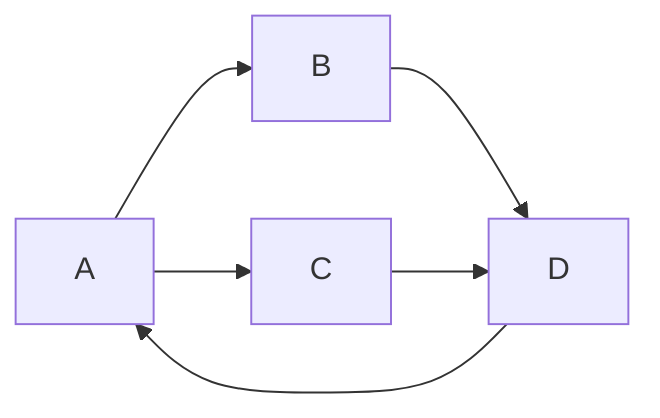

# 【AI大数据计算原理与代码实例讲解】PageRank

## 1. 背景介绍

### 1.1 问题的由来

在当今信息时代,互联网已经成为人们获取信息和知识的重要来源。然而,由于网络信息的海量性和多样性,如何从海量网页中快速找到高质量和相关的信息成为了一个巨大的挑战。传统的信息检索方法很难满足用户的需求,因此产生了基于链接分析的网页排名算法。

PageRank算法作为谷歌公司创始人拉里·佩奇(Larry Page)和谢尔盖·布林(Sergey Brin)在1998年提出的一种网页排名算法,通过分析网页之间的超链接结构,对网页进行重要性评分,从而为搜索引擎提供了一种有效的网页排序方式。该算法的出现极大地提高了搜索引擎的检索质量,被认为是互联网发展的一个重要里程碑。

### 1.2 研究现状

PageRank算法的提出引发了学术界和工业界对链接分析算法的广泛研究。目前,PageRank算法及其变体已经被广泛应用于网页排名、社交网络分析、引文分析、垃圾邮件检测等多个领域。

许多研究人员对PageRank算法进行了改进和扩展,例如考虑网页内容质量、用户浏览行为、主题相关性等因素,以提高排名的准确性和实用性。此外,一些研究工作也探讨了PageRank算法在大规模数据集上的计算效率问题,提出了并行化和分布式计算等优化方法。

### 1.3 研究意义

PageRank算法的研究具有重要的理论意义和实际应用价值:

1. **理论意义**:PageRank算法将图论、马尔可夫链、线性代数等数学理论与网页排名问题相结合,为网络数据分析提供了一种有效的方法。该算法的研究有助于深化对复杂网络结构的理解,推动相关理论的发展。

2. **实际应用价值**:PageRank算法在搜索引擎、推荐系统、社交网络分析等领域具有广泛的应用前景。通过对算法的深入研究和改进,可以提高信息检索的质量和效率,为用户提供更加优质的服务。

### 1.4 本文结构

本文将全面介绍PageRank算法的原理、数学模型、实现方法和应用场景。文章结构如下:

1. 背景介绍
2. 核心概念与联系
3. 核心算法原理与具体操作步骤
4. 数学模型和公式详细讲解与举例说明
5. 项目实践:代码实例和详细解释说明
6. 实际应用场景
7. 工具和资源推荐
8. 总结:未来发展趋势与挑战
9. 附录:常见问题与解答

## 2. 核心概念与联系

在深入探讨PageRank算法之前,我们需要了解一些核心概念和它们之间的联系。

### 2.1 网页链接结构

PageRank算法的核心思想是基于网页之间的链接结构来评估网页的重要性。因此,理解网页链接结构对于掌握算法原理至关重要。

网页链接结构可以用有向图来表示,其中节点代表网页,边代表链接。如果网页A包含指向网页B的链接,则在图中存在一条从A指向B的有向边。通过分析这种链接结构,我们可以推断出网页的重要性和权威性。

### 2.2 马尔可夫链

PageRank算法将网页浏览过程建模为一个马尔可夫链,即一个具有"无记忆性"的随机过程。在这个过程中,用户从一个网页随机跳转到另一个网页,跳转概率取决于当前网页的出链接数量和链接结构。

马尔可夫链的状态空间由所有网页组成,状态转移概率由链接结构决定。通过计算马尔可夫链的稳态分布,我们可以获得每个网页的PageRank值,从而评估其重要性。

### 2.3 迭代计算

由于网页链接结构形成了一个庞大的有向图,直接计算PageRank值是一个复杂的过程。因此,PageRank算法采用了迭代计算的方式逐步逼近稳态分布。

在每次迭代中,算法根据当前的PageRank值和链接结构,计算下一次迭代的PageRank值。经过多次迭代后,PageRank值将收敛到稳定的状态,从而得到网页的最终重要性评分。

### 2.4 随机游走

为了解决"环"和"死链"等问题,PageRank算法引入了"随机游走"(Random Walk)的概念。随机游走假设用户在浏览网页时,有一定概率随机跳转到任意一个网页,而不是完全遵循链接结构。

这种随机跳转行为被建模为一个均匀分布,确保了马尔可夫链的遍历性,使得算法可以评估所有可达的网页。随机游走的概率是一个可调参数,通常取值在0.1~0.2之间。

### 2.5 网页排名

最终,PageRank算法将计算得到的网页重要性评分作为排名的依据。搜索引擎根据用户的查询,检索与查询相关的网页,并按照PageRank值从高到低进行排序,将最相关和最重要的网页排在前面。

除了PageRank值,搜索引擎还会考虑其他因素,如网页内容的相关性、用户浏览行为等,综合评估网页的质量和相关性,从而为用户提供更加准确和有用的搜索结果。

## 3. 核心算法原理与具体操作步骤

### 3.1 算法原理概述

PageRank算法的核心思想是通过模拟网页之间的链接结构和用户的浏览行为,计算每个网页的重要性评分。具体来说,算法基于以下几个关键原理:

1. **链接投票**:一个网页被其他多个高质量网页链接,则该网页的重要性也较高。网页之间的链接可以看作是一种"投票"行为,被多个重要网页"投票"的网页,其重要性也就较高。

2. **马尔可夫链建模**:将网页浏览过程建模为一个马尔可夫链,其中每个网页代表一个状态,链接代表状态转移。通过计算马尔可夫链的稳态分布,可以获得每个网页的PageRank值。

3. **随机游走**:为了解决"环"和"死链"等问题,引入了"随机游走"的概念。用户在浏览网页时,有一定概率随机跳转到任意一个网页,而不是完全遵循链接结构。

4. **迭代计算**:由于网页链接结构形成了一个庞大的有向图,直接计算PageRank值是一个复杂的过程。因此,算法采用了迭代计算的方式逐步逼近稳态分布。

通过上述原理,PageRank算法可以有效地评估网页的重要性,为搜索引擎提供高质量的网页排名结果。

### 3.2 算法步骤详解

PageRank算法的具体计算步骤如下:

1. **构建网页链接图**:首先将所有网页及其链接关系构建成一个有向图,其中节点代表网页,边代表链接。

2. **初始化PageRank值**:为每个网页赋予初始的PageRank值,通常设置为 $\frac{1}{N}$,其中N是网页总数。

3. **计算出链接数**:对于每个网页,计算其出链接数,即指向其他网页的链接数量。

4. **迭代计算PageRank值**:

   - 对于每个网页 $p_j$,计算其新的PageRank值 $PR(p_j)$ 如下:

     $$PR(p_j) = (1 - d) + d \sum_{p_i \in B(p_j)} \frac{PR(p_i)}{L(p_i)}$$

     其中:
     - $d$ 是阻尼系数(damping factor),通常取值为0.85,表示随机游走的概率。
     - $B(p_j)$ 是所有链接到 $p_j$ 的网页集合。
     - $L(p_i)$ 是网页 $p_i$ 的出链接数。
     - 第一项 $(1 - d)$ 表示随机游走对 $p_j$ 的贡献,即从任意网页随机跳转到 $p_j$ 的概率。
     - 第二项表示通过链接结构对 $p_j$ 的贡献,即所有链接到 $p_j$ 的网页将其PageRank值按比例分配给 $p_j$。

5. **检查收敛条件**:比较新计算的PageRank值与上一次迭代的结果,如果差值小于预设阈值,则算法收敛,否则返回步骤4继续迭代。

6. **输出PageRank值**:当算法收敛后,输出每个网页的最终PageRank值作为重要性评分。

需要注意的是,上述步骤中的某些细节可能会根据具体实现而有所不同,但基本思路是一致的。

### 3.3 算法优缺点

PageRank算法具有以下优点:

1. **简单高效**:算法原理简单,基于网页链接结构进行计算,具有较高的计算效率。

2. **无需网页内容**:算法只需要网页之间的链接信息,无需分析网页内容,降低了计算复杂度。

3. **抗操纵性强**:由于算法基于整个网络的链接结构,单个网页很难通过人为操纵来提高自身的PageRank值。

4. **可扩展性好**:算法可以很好地扩展到大规模网络,并行计算等优化方法可以进一步提高计算效率。

但是,PageRank算法也存在一些缺点:

1. **新网页问题**:新网页由于缺乏链接,初始PageRank值较低,难以获得高排名。

2. **链接农场问题**:一些网站通过建立大量低质量链接来人为提高PageRank值,影响排名质量。

3. **内容质量缺失**:算法仅考虑链接结构,未涉及网页内容质量,可能导致低质量网页获得高排名。

4. **主题相关性缺失**:算法未考虑网页与查询主题的相关性,可能导致与查询无关的网页获得高排名。

为了解决这些缺点,后续研究工作提出了许多改进方法,如考虑网页内容质量、用户浏览行为、主题相关性等因素,以提高排名的准确性和实用性。

### 3.4 算法应用领域

除了最初用于网页排名的应用场景外,PageRank算法及其变体还被广泛应用于以下领域:

1. **社交网络分析**:在社交网络中,可以将用户视为节点,用户之间的关系视为链接,利用PageRank算法评估用户的影响力和重要性。

2. **引文分析**:在学术领域,可以将论文视为节点,引用关系视为链接,使用PageRank算法评估论文的重要性和影响力。

3. **垃圾邮件检测**:将电子邮件视为节点,发送者和接收者之间的关系视为链接,利用PageRank算法识别垃圾邮件发送者。

4. **系统可靠性分析**:在复杂系统中,可以将组件视为节点,组件之间的依赖关系视为链接,使用PageRank算法评估组件的重要性和故障影响。

5. **知识图谱构建**:在知识图谱中,可以将实体视为节点,实体之间的关系视为链接,利用PageRank算法评估实体的重要性和权威性。

6. **推荐系统**:在推荐系统中,可以将用户和物品视为节点,用户对物品的评分或购买行为视为链接,使用PageRank算法评估物品的重要性和受欢迎程度。

总的来说,PageRank算法提供了一种有效的方法来评估复杂网络中节点的重要性,具有广泛的应用前景。

## 4. 数学模型和公式详细讲解与举例说明

### 4.1 数学模型构建

为了更好地理解PageRank算法的原理,我们需要构建一个数学模型来描述网页之间的链接结构和用户