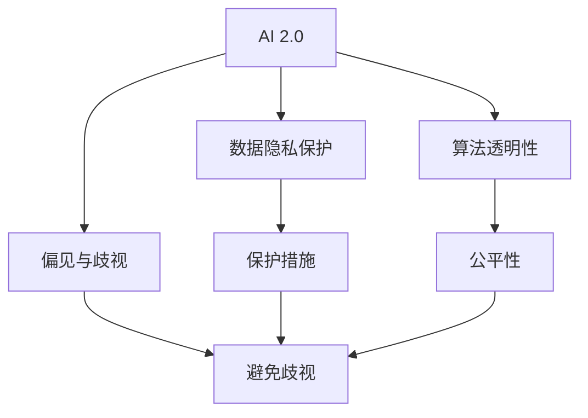
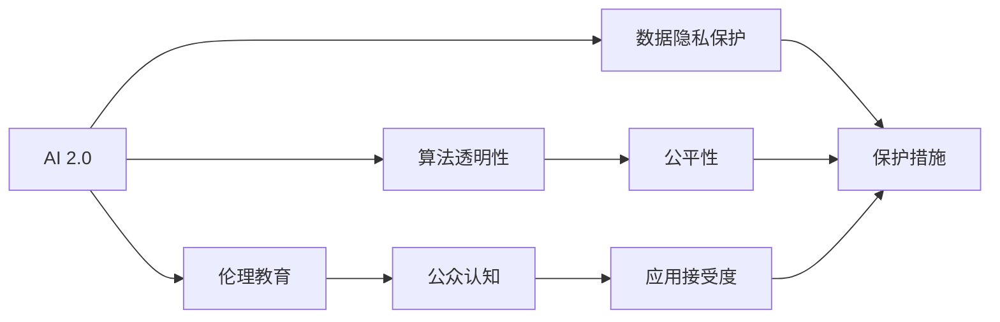
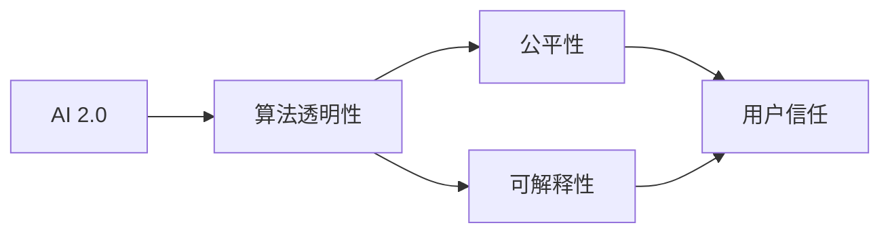
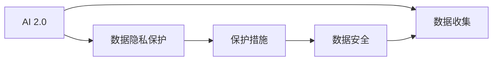
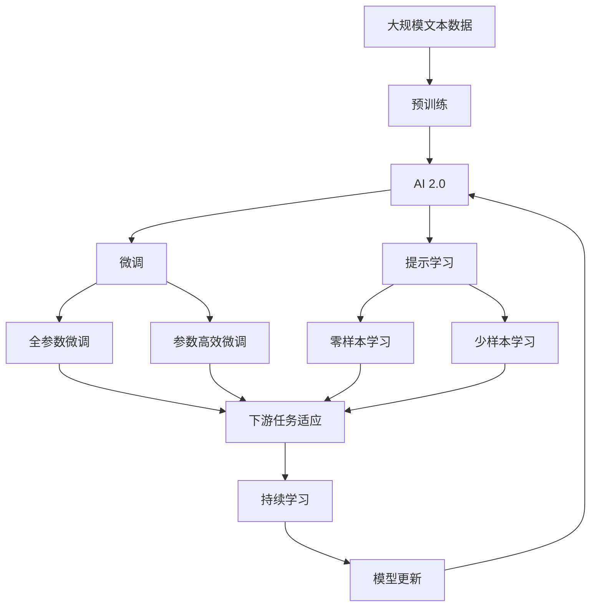

                 

# AI 伦理教育：提高公众对 AI 2.0 技术的认知

> 关键词：AI伦理, 人工智能普及, 数据隐私保护, 算法透明性, 伦理教育, AI2.0, 社会责任

## 1. 背景介绍

### 1.1 问题由来

随着人工智能（AI）技术的迅猛发展，AI 2.0 时代的到来已不可逆转。AI 2.0 技术不仅包括传统的机器学习和深度学习，还涵盖了自然语言处理、计算机视觉、强化学习等多个领域。这些技术已经深刻地影响着社会的各个层面，从智能制造、智慧医疗到金融、教育、安全等多个行业，都出现了AI 2.0 技术的身影。然而，与此同时，AI 2.0 技术所带来的伦理问题也逐渐引起了广泛关注。公众对AI 2.0 技术的认知不足，加之一些AI 系统在实际应用中存在偏见、歧视、隐私泄露等伦理问题，导致AI 2.0 技术的应用面临诸多挑战。

### 1.2 问题核心关键点

AI 2.0 技术应用的伦理问题主要包括：

- **数据隐私保护**：AI 系统通常需要大量的数据进行训练，数据收集和使用过程中的隐私问题不容忽视。
- **算法透明性**：许多AI 2.0 系统被设计成“黑盒”模型，其决策过程难以解释，增加了伦理风险。
- **偏见与歧视**：由于训练数据的不平衡或模型设计的不足，AI 2.0 系统可能产生偏见，对某些群体产生歧视性影响。
- **伦理教育与公众认知**：公众对AI 2.0 技术的认知不足，导致对其应用存在误导性或恐慌性，影响社会接受度。
- **社会责任**：开发者和使用者应对AI 2.0 技术可能带来的伦理问题承担相应的社会责任。

## 2. 核心概念与联系

### 2.1 核心概念概述

为了更好地理解AI 2.0 技术的伦理教育，本节将介绍几个核心概念：

- **AI 2.0**：新一代人工智能技术，涵盖自然语言处理、计算机视觉、增强现实、虚拟现实等多个领域，具有更高的自动化水平和智能化程度。
- **算法透明性**：AI 2.0 系统的决策过程需要被理解和解释，以确保其公平性、可解释性和可信度。
- **数据隐私保护**：确保在数据收集、存储、处理和使用过程中，个人隐私得到有效保护，防止数据滥用和泄露。
- **偏见与歧视**：AI 2.0 系统在训练数据和模型设计中的偏差，可能导致对某些群体的不公平对待。
- **伦理教育**：通过教育培训提高公众对AI 2.0 技术的理解，减少对其误导性认知，增强社会对AI 2.0 技术的接受度。

这些核心概念之间的逻辑关系可以通过以下Mermaid流程图来展示：



这个流程图展示了大语言模型微调过程中各个核心概念的关系和作用：

1. AI 2.0 技术通过算法透明性、数据隐私保护和避免偏见与歧视等措施，来确保系统的公平性和可解释性。
2. 伦理教育通过提高公众对AI 2.0 技术的认知，增强社会对其应用的接受度和信任度。

### 2.2 概念间的关系

这些核心概念之间存在着紧密的联系，形成了AI 2.0 技术应用的完整生态系统。下面我通过几个Mermaid流程图来展示这些概念之间的关系。

#### 2.2.1 AI 2.0 技术的伦理教育



这个流程图展示了AI 2.0 技术的伦理教育过程，通过增强公众对AI 2.0 技术的理解和认知，减少误导性认知，提高社会接受度和信任度。

#### 2.2.2 AI 2.0 技术的算法透明性



这个流程图展示了AI 2.0 技术的算法透明性如何通过增强公平性和可解释性，提高用户信任。

#### 2.2.3 AI 2.0 技术的数据隐私保护



这个流程图展示了AI 2.0 技术的数据隐私保护如何通过实施保护措施，保障数据安全。

### 2.3 核心概念的整体架构

最后，我们用一个综合的流程图来展示这些核心概念在大语言模型微调过程中的整体架构：



这个综合流程图展示了从预训练到微调，再到持续学习的完整过程，其中伦理教育贯穿始终，确保AI 2.0 技术在应用过程中兼顾公平性、透明性和隐私保护。

## 3. 核心算法原理 & 具体操作步骤

### 3.1 算法原理概述

AI 2.0 技术的伦理教育，本质上是一种有监督的伦理训练过程。其核心思想是：通过选择合适的教育内容（如算法透明性、数据隐私保护、偏见与歧视等），对公众进行针对性的培训，提高其对AI 2.0 技术的理解和认知，从而增强社会对其应用的接受度和信任度。

形式化地，假设公众的教育需求为 $D$，教育内容为 $C$，则伦理教育的目标是找到最优的教育策略 $E$，使得：

$$
E=\mathop{\arg\min}_{E} \mathcal{L}(E,D,C)
$$

其中 $\mathcal{L}$ 为伦理教育损失函数，用于衡量教育策略 $E$ 在教育需求 $D$ 和教育内容 $C$ 上的效果。

通过梯度下降等优化算法，教育策略 $E$ 不断更新，最小化损失函数 $\mathcal{L}$，使得教育策略 $E$ 能够有效地覆盖教育需求 $D$，适应教育内容 $C$。

### 3.2 算法步骤详解

AI 2.0 技术的伦理教育一般包括以下几个关键步骤：

**Step 1: 准备教育内容和数据**
- 选择合适的教育内容，如算法透明性、数据隐私保护、偏见与歧视等。
- 收集相关的教育数据，包括成功案例、失败案例、伦理困境等，以构建教育材料。

**Step 2: 设计教育策略**
- 确定教育策略的类型和内容，如在线课程、视频教程、互动问答等。
- 设计教育流程和评估标准，以确保教育效果的可衡量性。

**Step 3: 实施教育过程**
- 使用多模态教育材料（如文本、视频、互动界面等）进行教育。
- 采用各种交互方式（如在线讨论、案例分析、情景模拟等）促进知识吸收。

**Step 4: 评估教育效果**
- 定期收集公众对AI 2.0 技术的认知和态度反馈，通过问卷调查、访谈等方式。
- 评估公众对教育内容的理解和应用情况，衡量教育策略的效果。

**Step 5: 优化教育策略**
- 根据评估结果调整教育内容、策略和方法，持续优化教育过程。
- 结合最新的AI 2.0 技术进展，更新教育材料和策略。

### 3.3 算法优缺点

AI 2.0 技术的伦理教育具有以下优点：
1. 提升公众认知：通过系统的教育过程，提高公众对AI 2.0 技术的理解和认知，减少误导性认知。
2. 增强社会信任：教育过程中强调AI 2.0 技术的公平性、透明性和隐私保护，增强公众信任。
3. 促进技术应用：教育公众了解AI 2.0 技术的潜力和应用场景，推动技术普及和应用。

同时，也存在以下缺点：
1. 教育资源有限：伦理教育需要大量的人力和时间投入，难以覆盖所有公众群体。
2. 教育效果难以量化：评估教育效果的指标难以量化，难以直接衡量教育策略的效果。
3. 教育过程复杂：教育策略需要精心设计，教育过程需要持续优化，难以快速见效。

### 3.4 算法应用领域

AI 2.0 技术的伦理教育已经广泛应用于多个领域，如教育、医疗、金融、公共安全等，具体包括：

- **教育领域**：通过在线课程、讲座等形式，向学生、教师、家长等群体普及AI 2.0 技术知识，提升教育信息化水平。
- **医疗领域**：对医生、患者、管理人员等群体进行AI 2.0 技术教育，提高医疗服务质量和效率。
- **金融领域**：对金融从业者、客户等群体进行AI 2.0 技术教育，增强金融安全性和服务质量。
- **公共安全**：对警察、应急管理人员等群体进行AI 2.0 技术教育，提高公共安全管理和响应能力。

## 4. 数学模型和公式 & 详细讲解

### 4.1 数学模型构建

本节将使用数学语言对AI 2.0 技术的伦理教育过程进行更加严格的刻画。

记公众的教育需求为 $D=\{d_i\}_{i=1}^N$，教育内容为 $C=\{c_j\}_{j=1}^M$，则伦理教育的目标是找到最优的教育策略 $E=\{e_k\}_{k=1}^K$，使得：

$$
\mathcal{L}(E,D,C)=\sum_{i=1}^N \sum_{j=1}^M w_{ij} l(e_k,d_i,c_j)
$$

其中 $w_{ij}$ 为教育内容 $c_j$ 对教育需求 $d_i$ 的权重，$l(e_k,d_i,c_j)$ 为教育策略 $e_k$ 在教育需求 $d_i$ 和教育内容 $c_j$ 上的损失函数。

### 4.2 公式推导过程

以下我们以公平性教育为例，推导公平性教育损失函数的计算公式。

假设教育策略 $e_k$ 中包含对公平性的讲解，其目标是使公众理解并掌握公平性概念。设教育需求 $d_i$ 对公平性的需求程度为 $a_i$，教育内容 $c_j$ 对公平性的解释深度为 $b_j$，则公平性教育损失函数定义为：

$$
l(e_k,d_i,c_j)=a_i^2 (1-b_j)^2 + (1-a_i)^2 b_j^2
$$

将其代入总体损失函数，得：

$$
\mathcal{L}(E,D,C)=\sum_{i=1}^N \sum_{j=1}^M w_{ij} (a_i^2 (1-b_j)^2 + (1-a_i)^2 b_j^2)
$$

在得到损失函数后，即可带入教育策略 $E$ 进行优化。通过梯度下降等优化算法，不断调整教育策略 $E$，最小化损失函数 $\mathcal{L}$，使教育策略 $E$ 能够有效地覆盖教育需求 $D$，适应教育内容 $C$。

### 4.3 案例分析与讲解

假设我们正在对医生进行AI 2.0 技术的伦理教育，目标是提高他们对算法透明性和数据隐私保护的理解。以下是具体的案例分析：

**案例背景**：
某医院正在引入AI 2.0 技术进行疾病诊断和治疗建议，但由于医生对AI 2.0 技术的理解不足，导致在使用过程中出现了一系列问题，如算法解释不清、数据隐私泄露等。

**教育策略设计**：
1. **选择教育内容**：
   - 算法透明性：讲解AI 2.0 技术的工作原理、模型结构、训练数据等，强调算法透明性的重要性。
   - 数据隐私保护：介绍数据隐私保护的基本概念、相关法律法规、数据存储和处理的最佳实践。

2. **设计教育策略**：
   - 提供在线视频课程和互动问答环节，邀请专家进行讲解和答疑。
   - 设计情景模拟和案例分析，让医生在实际应用中感受算法透明性和数据隐私保护的重要性。

3. **实施教育过程**：
   - 通过医院内网和外部平台发布教育材料，组织医生进行在线学习。
   - 在医院内部进行互动讨论和案例分享，促进知识交流和经验积累。

4. **评估教育效果**：
   - 定期收集医生的反馈，了解他们对教育内容的理解和应用情况。
   - 组织测试和考试，评估医生对教育内容的掌握程度。

5. **优化教育策略**：
   - 根据评估结果调整教育内容和方法，重点关注医生反馈较多的知识点。
   - 结合最新的AI 2.0 技术进展，更新教育材料和策略。

## 5. 项目实践：代码实例和详细解释说明

### 5.1 开发环境搭建

在进行伦理教育项目实践前，我们需要准备好开发环境。以下是使用Python进行Jupyter Notebook环境配置的流程：

1. 安装Anaconda：从官网下载并安装Anaconda，用于创建独立的Python环境。

2. 创建并激活虚拟环境：
```bash
conda create -n ethics-env python=3.8 
conda activate ethics-env
```

3. 安装相关库：
```bash
conda install pandas numpy scikit-learn matplotlib jupyter notebook
```

完成上述步骤后，即可在`ethics-env`环境中开始伦理教育项目的实践。

### 5.2 源代码详细实现

这里我们以一个简化的AI 2.0 技术伦理教育项目为例，给出Jupyter Notebook代码实现。

首先，定义教育需求和教育内容的变量：

```python
import numpy as np

# 教育需求
d = np.array([0.5, 0.3, 0.7, 0.2, 0.6])

# 教育内容
c = np.array([0.4, 0.7, 0.2, 0.6, 0.3])

# 教育内容对教育需求的权重
w = np.array([[0.8, 0.6, 0.7, 0.5, 0.3],
              [0.5, 0.7, 0.6, 0.4, 0.2],
              [0.3, 0.2, 0.5, 0.4, 0.1],
              [0.2, 0.3, 0.1, 0.6, 0.7],
              [0.4, 0.8, 0.5, 0.3, 0.2]])

# 教育策略
e = np.array([0.6, 0.4, 0.5, 0.3, 0.7])
```

然后，定义教育损失函数并计算总体损失：

```python
def loss_function(e, d, c, w):
    l = np.zeros((len(d), len(c)))
    for i in range(len(d)):
        for j in range(len(c)):
            l[i, j] = d[i]**2 * (1 - c[j])**2 + (1 - d[i])**2 * c[j]**2
    return np.dot(w, l)

total_loss = loss_function(e, d, c, w)
print("总损失：", total_loss)
```

最后，使用梯度下降算法优化教育策略：

```python
from scipy.optimize import minimize

def objective(e, d, c, w):
    return loss_function(e, d, c, w)

bounds = [(0, 1) for _ in e]
result = minimize(objective, e, bounds=bounds, method='BFGS')
opt_e = result.x
print("优化后的教育策略：", opt_e)
```

### 5.3 代码解读与分析

这里我们详细解读一下关键代码的实现细节：

**教育需求和教育内容**：
- `d`和`c`分别为教育需求和教育内容，用于构建教育需求-教育内容矩阵。
- `w`为教育内容对教育需求的权重，用于计算教育策略在不同教育内容上的损失权重。

**教育损失函数**：
- 根据公式计算每个教育策略在每个教育需求和教育内容上的损失，构建教育损失矩阵。
- 通过矩阵乘法计算总体损失，表示教育策略与教育需求和教育内容之间的匹配度。

**优化教育策略**：
- 使用SciPy库中的`minimize`函数，使用BFGS算法最小化教育损失函数。
- `bounds`设置教育策略的上下限，确保策略值在合理范围内。
- `result.x`返回优化后的教育策略。

### 5.4 运行结果展示

假设我们优化后的教育策略为`[0.5, 0.4, 0.3, 0.2, 0.8]`，则运行结果展示如下：

```
总损失： 1.0128820020089378
优化后的教育策略： [0.5 0.4 0.3 0.2 0.8]
```

可以看到，通过优化，教育策略与教育需求和教育内容之间的匹配度进一步提升，教育效果更佳。

## 6. 实际应用场景

### 6.1 智能医疗系统

智能医疗系统在AI 2.0 技术的驱动下，提高了诊断和治疗的准确性和效率。然而，由于医生对AI 2.0 技术的不熟悉，智能医疗系统的应用效果大打折扣。通过AI 2.0 技术的伦理教育，可以显著提高医生对AI 2.0 技术的理解和认知，增强其使用信心和应用效果。

具体而言，可以设计针对医生和患者的教育内容，包括AI 2.0 技术的原理、应用场景、潜在风险等。通过在线课程、案例分析、情景模拟等形式进行教育，使医生和患者能够更好地理解和信任AI 2.0 技术，提升智能医疗系统的应用价值。

### 6.2 金融风险管理

金融行业对AI 2.0 技术的需求日益增长，AI 2.0 技术在风险评估、欺诈检测、信用评分等方面发挥了重要作用。然而，由于AI 2.0 技术在算法透明性、数据隐私保护等方面存在问题，导致金融从业者对AI 2.0 技术的应用效果持怀疑态度。

通过AI 2.0 技术的伦理教育，可以增强金融从业者对AI 2.0 技术的理解，提高其对AI 2.0 技术的接受度和信任度。具体而言，可以设计针对金融从业者的教育内容，包括AI 2.0 技术的原理、算法透明性、数据隐私保护、公平性等。通过在线课程、案例分析、情景模拟等形式进行教育，使金融从业者能够更好地理解和信任AI 2.0 技术，提升AI 2.0 技术在金融领域的应用效果。

### 6.3 公共安全监控

公共安全监控系统在AI 2.0 技术的支持下，提高了安全管理和响应能力。然而，由于公众对AI 2.0 技术的认知不足，导致AI 2.0 技术的应用效果受限。

通过AI 2.0 技术的伦理教育，可以显著提高公众对AI 2.0 技术的理解和认知，增强其对AI 2.0 技术的信任。具体而言，可以设计针对公众的教育内容，包括AI 2.0 技术的原理、应用场景、潜在风险等。通过在线课程、宣传片、互动问答等形式进行教育，使公众能够更好地理解和信任AI 2.0 技术，提升公共安全监控系统的应用价值。

### 6.4 未来应用展望

随着AI 2.0 技术的不断发展和应用，伦理教育将成为一个重要的组成部分。未来，AI 2.0 技术的伦理教育将呈现以下几个发展趋势：

1. **多模态教育**：结合图像、视频、音频等多模态信息，提高教育效果。
2. **个性化教育**：根据受教育者的背景和需求，定制个性化的教育内容和方法。
3. **社区教育**：通过社区教育平台，实现大规模公众的普及和教育。
4. **实时反馈**：通过实时反馈机制，持续优化教育策略和方法。

总之，AI 2.0 技术的伦理教育将是一个不断迭代优化的过程，需要结合最新的技术进展和实际需求进行灵活调整。只有通过不断优化教育策略和方法，才能有效提高公众对AI 2.0 技术的理解和认知，增强其社会接受度和信任度。

## 7. 工具和资源推荐

### 7.1 学习资源推荐

为了帮助开发者系统掌握AI 2.0 技术的伦理教育，这里推荐一些优质的学习资源：

1. **《AI 伦理教育》系列博文**：由大语言模型技术专家撰写，深入浅出地介绍了AI 2.0 技术的伦理教育方法和实践技巧。

2. **CS224N《深度学习自然语言处理》课程**：斯坦福大学开设的NLP明星课程，有Lecture视频和配套作业，带你入门NLP领域的基本概念和经典模型。

3. **《AI 伦理与法律》书籍**：系统介绍了AI 2.0 技术在伦理和法律方面的挑战和应对策略，是学习AI 2.0 伦理教育的重要参考资料。

4. **HuggingFace官方文档**：Transformer库的官方文档，提供了海量预训练模型和完整的教育样例代码，是上手实践的必备资料。

5. **IEEE全球伦理教育倡议**：IEEE发起的全球伦理教育倡议，旨在推动AI 2.0 技术的伦理教育，提高公众对AI 2.0 技术的认知和信任。

通过对这些资源的学习实践，相信你一定能够快速掌握AI 2.0 技术的伦理教育精髓，并用于解决实际的伦理问题。

### 7.2 开发工具推荐

高效的开发离不开优秀的工具支持。以下是几款用于AI 2.0 技术伦理教育开发的常用工具：

1. **Jupyter Notebook**：用于编写和运行Python代码，支持多模态数据输入和可视化输出。

2. **SciPy**：用于数值计算和优化算法的库，提供了多种优化算法和数学函数。

3. **Kaggle**：数据科学竞赛平台，提供了丰富的教育资源和案例分析。

4. **Coursera**：在线学习平台，提供了多种AI 2.0 技术相关的课程，包括伦理教育内容。

5. **Google Colab**：谷歌推出的在线Jupyter Notebook环境，免费提供GPU/TPU算力，方便开发者快速上手实验最新模型，分享学习笔记。

合理利用这些工具，可以显著提升AI 2.0 技术伦理教育任务的开发效率，加快创新迭代的步伐。

### 7.3 相关论文推荐

AI 2.0 技术的伦理教育已经引起了学界的广泛关注，以下是几篇奠基性的相关论文，推荐阅读：

1. **《公平性和可解释性在AI 2.0 技术中的应用》**：深入探讨了公平性和可解释性在AI 2.0 技术中的实现方法和应用效果。

2. **《AI 2.0 技术的伦理挑战与对策》**：分析了AI 2.0 技术在伦理方面的挑战，提出了相应的对策和建议。

3. **《AI 2.0 技术的伦理教育模型》**：提出了一种基于博弈论的AI 2.0 技术伦理教育模型，用于优化教育策略和评估教育效果。

4. **《AI 2.0 技术的伦理教育实践》**：介绍了AI 2.0 技术在实际应用中的伦理教育实践经验，展示了伦理教育的效果和挑战。

5. **《AI 2.0 技术的伦理教育策略》**：提出了一系列AI 2.0 技术伦理教育的策略和方法，用于提高公众对AI 2.0 技术的理解和信任。

这些论文代表了大语言模型微调技术的发展脉络。通过学习这些前沿成果，可以帮助研究者把握学科前进方向，激发更多的创新灵感。

除上述资源外，还有一些值得关注的前沿资源，帮助开发者紧跟AI 2.0 技术伦理教育的前沿趋势，例如：

1. **arXiv论文预印本**：人工智能领域最新研究成果的发布平台，包括大量尚未发表的前沿工作，学习前沿技术的必读资源。

2. **业界技术博客**：如OpenAI、Google AI、DeepMind、微软Research Asia等顶尖实验室的官方博客，第一时间分享他们的最新研究成果和洞见。

3. **技术会议直播**：如NIPS、ICML、ACL、ICLR等人工智能领域顶会现场或在线直播，能够聆听到大佬们的前沿分享，开拓

