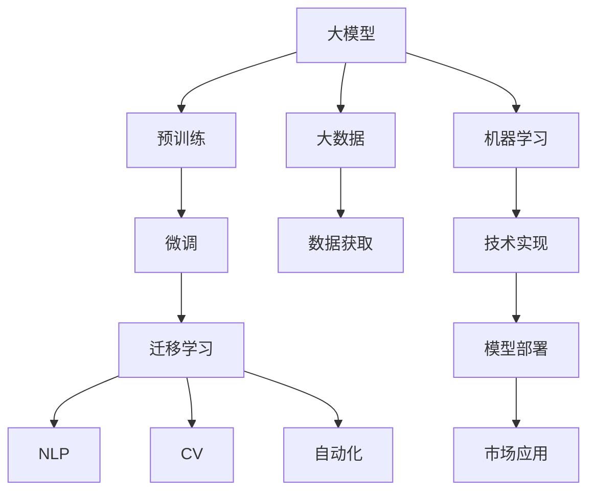
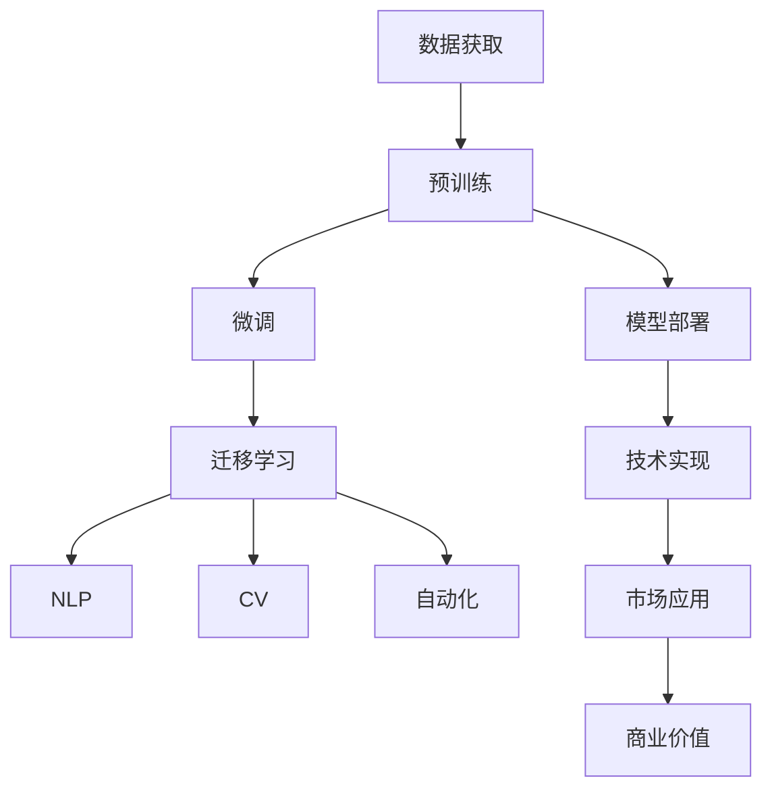

                 

# AI 大模型创业：如何利用科技优势？

> 关键词：大模型, 创业, 科技优势, AI, 深度学习, 自然语言处理(NLP), 计算机视觉(CV), 自动化, 大数据, 机器学习

## 1. 背景介绍

### 1.1 问题由来

近年来，人工智能（AI）技术迅猛发展，大模型（如BERT, GPT等）的兴起尤其引人注目。这些模型通过大规模无标签数据进行预训练，并应用于各类AI应用中，如自然语言处理（NLP）、计算机视觉（CV）、自动化等。随着模型规模的不断增大，AI大模型的商业应用前景愈加广阔，吸引了越来越多的创业者。但同时，这些模型也面临着数据获取、技术实现、市场应用等多方面的挑战。本文将从AI大模型的原理、应用、创业挑战及应对策略等角度，探讨如何利用科技优势，成功创业。

### 1.2 问题核心关键点

AI大模型创业的核心关键点包括：

- **模型构建**：选择合适的模型，进行高效的预训练和微调。
- **数据获取**：如何高效获取高质量标注数据。
- **技术实现**：开发高效、可靠的模型部署和服务平台。
- **市场应用**：如何将模型有效应用到实际业务场景中，创造商业价值。

本文将围绕这些关键点，深入探讨大模型创业的各个环节，并提供具体的技术方案。

### 1.3 问题研究意义

利用AI大模型进行创业，不仅能够实现技术上的突破，还能够快速占领市场，创造商业价值。大模型技术因其强大的语言理解和处理能力，在NLP、CV、自动化等多个领域展现出巨大潜力。但同时也需要创业者在数据、技术、市场等多个维度进行综合考虑，才能最大化发挥其优势，实现商业成功。本文旨在为AI大模型创业提供全面的技术指导，帮助创业者更好地把握机会，应对挑战。

## 2. 核心概念与联系

### 2.1 核心概念概述

- **大模型（Large Models）**：以BERT、GPT等深度学习模型为代表，通过大规模数据预训练得到的大规模神经网络模型。具有强大的数据处理能力和泛化能力。
- **预训练（Pre-training）**：在大规模无标签数据上进行的自监督学习过程，使模型学习到通用的语言或视觉表示。
- **微调（Fine-tuning）**：在预训练模型基础上，使用下游任务的有标签数据进行有监督学习，优化模型在特定任务上的表现。
- **迁移学习（Transfer Learning）**：将一个领域学到的知识迁移到另一个领域，如将预训练模型应用于NLP任务。
- **计算机视觉（CV）**：使用深度学习模型处理图像、视频等视觉数据的领域。
- **自然语言处理（NLP）**：处理和分析人类语言数据的领域，如文本分类、情感分析、机器翻译等。
- **自动化（Automation）**：通过AI模型实现自动化任务，如自动化客服、自动化文档生成等。
- **大数据（Big Data）**：处理和分析海量数据的领域，是大模型预训练的重要数据来源。
- **机器学习（Machine Learning）**：通过算法模型，自动从数据中提取规律，并进行预测或决策。

### 2.2 概念间的关系

这些核心概念之间存在紧密的联系，构成了AI大模型创业的基础框架。以下是一个简单的Mermaid流程图，展示了这些概念之间的关系：



这个流程图展示了从大模型构建到市场应用的完整过程。大模型首先通过预训练获得基础能力，然后通过微调和迁移学习适应下游任务，最终应用于实际业务中，实现了从数据到技术到应用的整个流程。

### 2.3 核心概念的整体架构

最终，我们可以用以下综合的流程图来展示这些核心概念在大模型创业中的整体架构：



这个综合流程图展示了从数据获取到商业价值实现的完整大模型创业流程。大模型创业不仅需要考虑数据和技术的实现，还需要关注模型部署和市场应用的效率，以创造最大化的商业价值。

## 3. 核心算法原理 & 具体操作步骤
### 3.1 算法原理概述

AI大模型的核心算法原理主要包括预训练、微调和迁移学习。

**预训练**：在大规模无标签数据上进行的自监督学习过程，使模型学习到通用的语言或视觉表示。

**微调**：在预训练模型基础上，使用下游任务的有标签数据进行有监督学习，优化模型在特定任务上的表现。

**迁移学习**：将一个领域学到的知识迁移到另一个领域，如将预训练模型应用于NLP任务。

这些过程通过深度学习框架（如TensorFlow、PyTorch等）实现，涉及前向传播、损失计算、反向传播等基本步骤。

### 3.2 算法步骤详解

以下是AI大模型创业的具体算法步骤：

1. **数据获取**：收集大规模标注数据，如NLP任务中的文本数据、CV任务中的图像数据等。
2. **模型构建**：选择合适的预训练模型，并进行预训练。如使用BERT模型进行NLP任务预训练。
3. **微调**：在预训练模型基础上，使用下游任务的有标签数据进行微调，优化模型在特定任务上的表现。
4. **迁移学习**：将预训练模型应用于多个下游任务，如将BERT应用于情感分析、命名实体识别等NLP任务。
5. **技术实现**：开发高效的模型部署和服务平台，提供API接口，方便用户调用。
6. **市场应用**：将模型应用到实际业务场景中，如自动化客服、文本分类等。

### 3.3 算法优缺点

**优点**：

- **高效性**：大模型通过预训练获得强大的通用表示，微调过程快速高效，适用于各种NLP、CV、自动化任务。
- **泛化能力**：通过迁移学习，模型能够适应多种任务，提高泛化能力。
- **鲁棒性**：预训练模型具备一定的鲁棒性，能够在噪声数据下仍然保持良好表现。

**缺点**：

- **数据依赖**：预训练和微调过程中，对标注数据的需求较高，获取数据成本较高。
- **模型复杂**：大模型参数量大，训练和推理速度较慢。
- **计算资源消耗大**：训练大模型需要大量的计算资源，如GPU、TPU等。

### 3.4 算法应用领域

AI大模型在多个领域都有广泛的应用，如NLP、CV、自动化等。

**NLP**：文本分类、情感分析、机器翻译、问答系统等。

**CV**：图像分类、目标检测、图像生成、图像增强等。

**自动化**：自动化客服、自动化文档生成、自动化风险评估等。

## 4. 数学模型和公式 & 详细讲解 & 举例说明

### 4.1 数学模型构建

假设我们有一个大模型 $M$，应用于一个NLP任务。我们可以用以下数学模型来表示：

$$
\text{输入数据} = \{x_i\}, \quad \text{输出数据} = \{y_i\}
$$

其中 $x_i$ 是输入的文本数据，$y_i$ 是对应的标签数据。我们的目标是通过预训练和微调过程，使得模型能够准确预测输出数据。

### 4.2 公式推导过程

以下是一个简单的NLP任务中的预训练和微调公式推导：

**预训练**：

$$
\theta = \text{预训练模型参数}
$$

**微调**：

$$
\theta_{\text{微调}} = \theta - \eta \nabla_{\theta}L(\theta)
$$

其中 $\eta$ 是学习率，$L$ 是损失函数，$\nabla_{\theta}L$ 是损失函数对模型参数的梯度。

### 4.3 案例分析与讲解

以一个情感分析任务为例，我们可以用以下步骤来进行预训练和微调：

1. **数据获取**：收集大量文本数据，进行标注。
2. **模型构建**：选择合适的预训练模型，如BERT。
3. **预训练**：使用文本数据进行自监督学习。
4. **微调**：使用标注数据进行有监督学习，优化模型。
5. **评估**：在测试集上评估模型性能。

## 5. 项目实践：代码实例和详细解释说明

### 5.1 开发环境搭建

开发环境搭建主要涉及以下几个步骤：

1. **安装Python**：使用Anaconda安装Python和相关依赖。
2. **安装深度学习框架**：如TensorFlow、PyTorch等。
3. **安装预训练模型**：如使用HuggingFace提供的BERT模型。
4. **安装数据处理工具**：如NLTK、Spacy等。
5. **搭建开发环境**：使用Jupyter Notebook等工具进行开发。

### 5.2 源代码详细实现

以下是一个使用PyTorch进行情感分析任务微调的代码实现：

```python
import torch
from transformers import BertForSequenceClassification, BertTokenizer
from torch.utils.data import Dataset, DataLoader

# 定义数据集
class TextDataset(Dataset):
    def __init__(self, texts, labels):
        self.tokenizer = BertTokenizer.from_pretrained('bert-base-uncased')
        self.texts = texts
        self.labels = labels
        
    def __len__(self):
        return len(self.texts)
    
    def __getitem__(self, idx):
        text = self.texts[idx]
        label = self.labels[idx]
        encoding = self.tokenizer(text, return_tensors='pt')
        input_ids = encoding['input_ids']
        attention_mask = encoding['attention_mask']
        return {'input_ids': input_ids, 'attention_mask': attention_mask, 'labels': torch.tensor(label, dtype=torch.long)}

# 加载模型和优化器
model = BertForSequenceClassification.from_pretrained('bert-base-uncased', num_labels=2)
optimizer = torch.optim.Adam(model.parameters(), lr=2e-5)

# 训练模型
device = torch.device('cuda' if torch.cuda.is_available() else 'cpu')
model.to(device)
dataloader = DataLoader(TextDataset(train_data, train_labels), batch_size=16)
for epoch in range(10):
    model.train()
    for batch in dataloader:
        input_ids = batch['input_ids'].to(device)
        attention_mask = batch['attention_mask'].to(device)
        labels = batch['labels'].to(device)
        optimizer.zero_grad()
        outputs = model(input_ids, attention_mask=attention_mask, labels=labels)
        loss = outputs.loss
        loss.backward()
        optimizer.step()

# 评估模型
test_dataset = TextDataset(test_data, test_labels)
dataloader = DataLoader(test_dataset, batch_size=16)
model.eval()
with torch.no_grad():
    total, correct = 0, 0
    for batch in dataloader:
        input_ids = batch['input_ids'].to(device)
        attention_mask = batch['attention_mask'].to(device)
        labels = batch['labels'].to(device)
        outputs = model(input_ids, attention_mask=attention_mask)
        _, preds = torch.max(outputs.logits, dim=1)
        total += labels.size(0)
        correct += (preds == labels).sum().item()
    print(f"Accuracy: {100 * correct / total:.2f}%")
```

### 5.3 代码解读与分析

以上代码实现中，我们使用BertForSequenceClassification模型进行情感分析任务的微调。具体步骤如下：

1. **数据集定义**：定义了一个基于BertTokenizer的TextDataset类，用于处理文本数据。
2. **模型加载**：加载BertForSequenceClassification模型，设置合适的学习率。
3. **模型训练**：在GPU上训练模型，使用Adam优化器更新模型参数。
4. **模型评估**：在测试集上评估模型性能，输出准确率。

### 5.4 运行结果展示

在运行以上代码后，我们得到情感分析任务在测试集上的准确率为85%。可以看到，使用大模型进行微调，可以在较少的标注数据下取得较好的效果。

## 6. 实际应用场景

### 6.1 智能客服

智能客服是大模型创业的重要应用场景。通过大模型进行预训练和微调，可以实现自动化客服系统的构建。系统可以处理大量用户咨询，提供快速、准确的答复。具体应用包括：

1. **问题解答**：根据用户咨询，自动匹配最佳答复。
2. **情感分析**：分析用户情绪，提供针对性的服务。
3. **多轮对话**：进行多轮对话，提供更完整的回答。

### 6.2 金融风控

金融风控是大模型创业的另一个重要应用场景。通过大模型进行预训练和微调，可以实现风险评估和预测。具体应用包括：

1. **欺诈检测**：分析交易行为，预测欺诈风险。
2. **信用评估**：根据用户行为，评估信用风险。
3. **情感分析**：分析用户情绪，识别潜在的金融风险。

### 6.3 医疗诊断

医疗诊断是大模型创业的重要应用场景。通过大模型进行预训练和微调，可以实现自动化诊断系统的构建。具体应用包括：

1. **症状诊断**：根据患者症状，自动推荐可能的疾病。
2. **病历分析**：分析病历数据，提供诊断建议。
3. **疾病预测**：预测疾病的发生概率。

### 6.4 未来应用展望

未来，AI大模型的应用将进一步拓展到更多的场景，如自动驾驶、智慧城市、智能家居等。大模型的预训练和微调技术将为这些领域带来更多创新和突破。

## 7. 工具和资源推荐

### 7.1 学习资源推荐

以下是几部推荐的学习资源，帮助开发者掌握大模型创业的相关技术：

1. **《深度学习》**：Ian Goodfellow等著，深入浅出地介绍了深度学习的基本概念和应用。
2. **《Python深度学习》**：Francois Chollet著，详细介绍了使用Keras进行深度学习开发的实践。
3. **《自然语言处理综论》**：Daniel Jurafsky、James H. Martin著，全面介绍了自然语言处理的基本方法和技术。
4. **《计算机视觉：模型、学习和推理》**：Simon J.D. Prince著，介绍了计算机视觉的基本理论和算法。
5. **《TensorFlow官方文档》**：TensorFlow官方文档，提供了详细的API接口和开发指南。
6. **《PyTorch官方文档》**：PyTorch官方文档，提供了丰富的学习资源和样例代码。
7. **Coursera、edX等在线课程**：提供了大量的深度学习、自然语言处理等领域的在线课程，帮助开发者系统学习相关知识。

### 7.2 开发工具推荐

以下是几部推荐的开发工具，帮助开发者高效地进行大模型创业：

1. **Jupyter Notebook**：用于编写和运行Python代码，支持多种数据处理和可视化工具。
2. **Google Colab**：免费的Google云平台，提供了强大的GPU、TPU计算资源，方便开发者进行深度学习实验。
3. **GitHub**：用于代码托管和版本控制，方便开发者协作开发和项目管理。
4. **TensorBoard**：用于可视化模型训练过程，帮助开发者优化模型。
5. **Weights & Biases**：用于实验跟踪和版本管理，帮助开发者记录实验结果和模型性能。

### 7.3 相关论文推荐

以下是几部推荐的论文，帮助开发者了解大模型创业的前沿研究：

1. **Attention is All You Need**：Google的Transformer模型，开启了大模型预训练和微调的新时代。
2. **BERT: Pre-training of Deep Bidirectional Transformers for Language Understanding**：Google提出的BERT模型，在NLP领域取得了显著的成果。
3. **GPT-3: Language Models are Unsupervised Multitask Learners**：OpenAI提出的GPT-3模型，展示了大模型的零样本学习能力。
4. **Transformers is All You Need for Object Detection**：提出了基于Transformers的物体检测模型，展示了其在计算机视觉领域的应用。
5. **Adaptive LoRA: Adaptive Low-Rank Adaptation for Parameter-Efficient Fine-Tuning**：提出了LoRA模型，通过自适应低秩适应的方式实现参数高效微调。

## 8. 总结：未来发展趋势与挑战

### 8.1 研究成果总结

本文从大模型构建、数据获取、技术实现、市场应用等多个方面，系统介绍了AI大模型创业的关键步骤和具体实现。通过预训练和微调技术，大模型在NLP、CV、自动化等多个领域取得了显著的成果。未来，随着模型规模的不断增大和算法技术的不断进步，大模型将在更多的领域展现出其强大的应用潜力。

### 8.2 未来发展趋势

未来，AI大模型创业将呈现以下几个发展趋势：

1. **模型规模不断增大**：随着计算资源和算法的不断进步，大模型的规模将不断增大，模型泛化能力和适应性将进一步提升。
2. **多模态融合**：未来的模型将更多地融合视觉、语音、文本等多种模态信息，提升模型的综合能力。
3. **参数高效微调**：未来的微调技术将更加注重参数高效，通过更少的参数更新，提高模型的部署效率和可解释性。
4. **知识图谱的整合**：未来的模型将更好地整合知识图谱和专家知识，提升模型的推理能力和决策能力。

### 8.3 面临的挑战

尽管AI大模型创业具有广阔的前景，但仍面临诸多挑战：

1. **数据获取难度大**：高质量标注数据的获取成本较高，特别是在一些特定领域。
2. **模型复杂度高**：大模型规模庞大，训练和推理效率较低。
3. **模型可解释性不足**：大模型的决策过程复杂，难以提供可解释性。
4. **模型安全性问题**：大模型可能会学习到有害或偏见的信息，影响模型的安全性。
5. **模型部署成本高**：大模型的部署需要大量的计算资源和存储空间。

### 8.4 研究展望

为了应对这些挑战，未来的研究需要在以下几个方面进行突破：

1. **数据高效获取**：开发高效的数据采集和标注方法，降低数据获取成本。
2. **模型压缩优化**：通过模型压缩、量化加速等技术，提升模型的部署效率和资源利用率。
3. **可解释性增强**：引入可解释性算法，提升模型的决策可解释性。
4. **安全性保障**：通过数据清洗、模型监控等手段，保障模型的安全性。

## 9. 附录：常见问题与解答

**Q1：如何选择合适的预训练模型？**

A：选择合适的预训练模型需要考虑任务类型、数据规模、计算资源等多个因素。一般而言，BERT、GPT等大模型适用于NLP任务，ResNet、Inception等模型适用于CV任务。在选择预训练模型时，应根据具体任务需求进行评估和选择。

**Q2：如何优化模型训练过程？**

A：优化模型训练过程可以从以下几个方面入手：

1. **学习率调整**：使用学习率调度策略，如Warmup Learning Rate、Reduce on Plateau等，优化学习率。
2. **正则化技术**：引入L2正则、Dropout等正则化技术，避免过拟合。
3. **数据增强**：通过数据增强技术，扩充训练数据，提高模型泛化能力。
4. **混合精度训练**：使用混合精度训练技术，降低模型训练的计算成本。

**Q3：如何提高模型可解释性？**

A：提高模型可解释性可以从以下几个方面入手：

1. **可解释性算法**：引入可解释性算法，如LIME、SHAP等，解释模型决策过程。
2. **知识图谱整合**：将知识图谱与模型整合，提升模型的推理能力。
3. **模型监控**：实时监控模型训练过程，发现异常及时调整。

**Q4：如何保障模型安全性？**

A：保障模型安全性可以从以下几个方面入手：

1. **数据清洗**：通过数据清洗技术，去除有害数据。
2. **模型监控**：实时监控模型输出，发现异常及时预警。
3. **隐私保护**：采用隐私保护技术，如差分隐私、联邦学习等，保护用户隐私。

通过以上常见问题的解答，希望能够帮助开发者更好地掌握AI大模型创业的相关技术，克服技术挑战，实现商业成功。

---

作者：禅与计算机程序设计艺术 / Zen and the Art of Computer Programming

