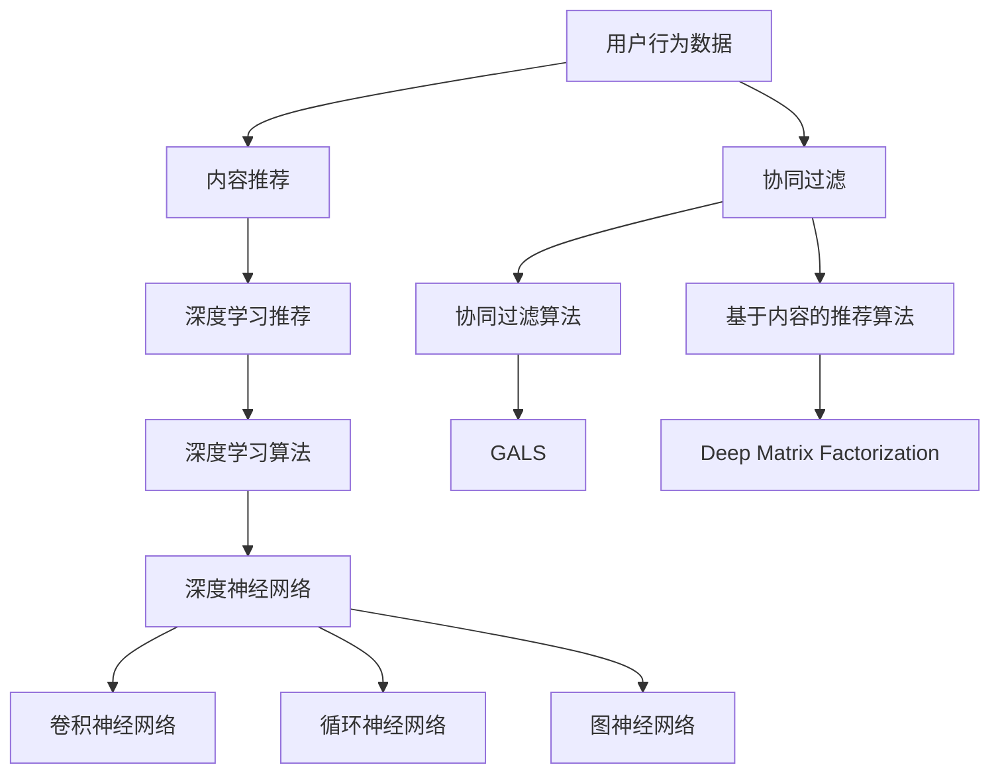
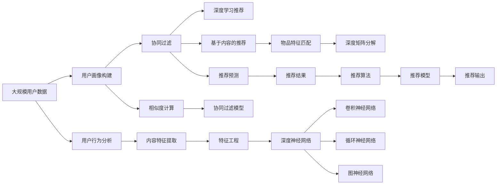

                 

# AIGC从入门到实战：AI 赋能推荐系统，提升用户黏性和用户体验

> 关键词：人工智能，推荐系统，用户行为分析，深度学习，协同过滤，内容推荐

## 1. 背景介绍

### 1.1 问题由来
在现代社会，用户的信息获取需求呈现出爆炸性的增长。无论是电商网站、社交平台，还是视频网站，都在争夺用户的注意力。推荐系统作为连接用户和内容的桥梁，帮助用户在海量信息中快速发现感兴趣的内容，提升用户体验和平台黏性。然而，传统推荐系统往往依赖用户的点击、购买等行为数据进行推荐，难以捕捉用户的真实兴趣和潜在需求，无法进行更为精准的推荐。

人工智能技术，尤其是深度学习技术的快速发展，为推荐系统带来了新的突破。通过构建人工智能推荐系统(AI-Recommendation System)，利用大模型对用户行为、内容特征进行深度分析和理解，生成个性化的推荐结果。本文将从入门到实战，系统性地介绍AI推荐系统的原理、方法和实践，帮助读者深入理解AI推荐系统的核心技术和应用场景。

### 1.2 问题核心关键点
构建AI推荐系统的核心关键点如下：
- 选择合适的推荐算法。如协同过滤、基于内容的推荐、深度学习等。
- 设计合理的数据处理流程。包括特征提取、用户画像构建、评分预测等。
- 优化算法参数和模型结构。利用超参数调优和模型压缩技术，提升推荐系统效率。
- 保证推荐系统的公平性和鲁棒性。避免算法偏见和恶意攻击，确保推荐结果的公正性。
- 对推荐结果进行评估和反馈。如使用A/B测试、点击率、转化率等指标，衡量推荐效果。

### 1.3 问题研究意义
构建AI推荐系统对于提升用户体验、促进平台增长、优化资源配置具有重要意义：
1. 提升用户体验：AI推荐系统能根据用户的历史行为和当前兴趣，生成个性化推荐内容，满足用户多样化需求，提升用户满意度和平台黏性。
2. 促进平台增长：精准的推荐内容能提高用户转化率和留存率，进而推动平台流量增长和商业收益。
3. 优化资源配置：推荐系统可以根据不同用户和内容的热度，进行流量分配和广告投放，优化资源利用效率。
4. 增强智能决策：AI推荐系统能够利用大数据分析和深度学习技术，提升平台决策的智能化水平，帮助企业更精准地把握市场动态和用户需求。
5. 拓展应用场景：AI推荐技术可以应用于内容推荐、广告投放、个性化营销等多个场景，促进业务创新和数字化转型。

## 2. 核心概念与联系

### 2.1 核心概念概述

为更好地理解AI推荐系统的构建方法，本文将介绍几个核心概念及其联系：

- **人工智能推荐系统(AI-Recommendation System)**：通过人工智能技术，利用大模型对用户行为和内容特征进行深度分析，生成个性化推荐结果的推荐系统。
- **协同过滤(Collaborative Filtering)**：基于用户和物品的协同行为，通过相似度计算生成推荐结果的推荐算法。
- **基于内容的推荐(Content-Based Recommendation)**：根据用户的历史行为和兴趣，推荐与之相关的新内容，如电影、音乐、图书等。
- **深度学习(Deep Learning)**：利用神经网络模型进行用户行为和内容特征的深层次学习，提升推荐精度和泛化能力。
- **协同过滤(Generalized Alternating Least Squares, GALS)**：一种改进的协同过滤算法，通过用户-物品矩阵分解，提升推荐效果。
- **基于内容的推荐(Deep Matrix Factorization)**：将用户-物品评分矩阵进行分解，生成用户和物品的低维表示，进行推荐预测。
- **深度学习推荐系统(Deep Learning-based Recommendation System)**：利用卷积神经网络、循环神经网络、图神经网络等深度学习模型，进行用户行为和内容特征的深层次建模。

这些概念之间的逻辑关系可以通过以下Mermaid流程图来展示：



### 2.2 概念间的关系

这些核心概念之间存在着紧密的联系，形成了AI推荐系统的完整框架。以下是几个重要的关系：

1. **用户行为与推荐算法**：用户行为数据是推荐系统的基础，通过不同算法，可以构建推荐模型，生成个性化推荐结果。
2. **深度学习与协同过滤**：协同过滤可以基于用户的交互历史生成推荐，而深度学习通过特征提取和用户画像构建，提升推荐的准确性。
3. **内容推荐与深度学习**：基于内容的推荐可以利用深度学习模型对物品特征进行深层次分析，生成更具吸引力的推荐。
4. **协同过滤与基于内容的推荐**：协同过滤通过相似度计算生成推荐，而基于内容的推荐通过特征匹配生成推荐，两者可以相互补充。
5. **深度学习推荐与模型优化**：深度学习推荐系统可以大幅提升推荐精度，但模型训练和优化是其高效应用的关键。

### 2.3 核心概念的整体架构

最后，我们用一个综合的流程图来展示这些核心概念在大规模推荐系统中的整体架构：



这个综合流程图展示了从原始数据到最终推荐输出的完整流程。用户数据通过用户画像构建、相似度计算等技术，生成协同过滤模型，再结合深度学习推荐系统，输出最终的推荐结果。通过这些核心概念的紧密联系，AI推荐系统能够更好地理解和满足用户需求，提升平台的商业价值和社会影响力。

## 3. 核心算法原理 & 具体操作步骤
### 3.1 算法原理概述

AI推荐系统的核心算法原理基于协同过滤和深度学习。协同过滤通过用户和物品之间的相似度计算，生成推荐结果。深度学习则利用神经网络模型，对用户行为和内容特征进行深层次学习，提升推荐精度。

协同过滤算法的基本原理是，通过用户和物品之间的交互行为，构建用户-物品评分矩阵，计算用户和物品之间的相似度，从而生成推荐结果。具体步骤如下：
1. 数据收集：从用户行为数据中提取用户ID、物品ID和评分。
2. 用户画像构建：根据用户行为数据，生成用户画像，描述用户的历史偏好和行为模式。
3. 相似度计算：通过协同过滤算法，计算用户和物品之间的相似度，生成推荐结果。

深度学习推荐系统的基本原理是，利用神经网络模型，对用户行为和内容特征进行深层次学习，提升推荐精度。具体步骤如下：
1. 数据收集：从用户行为数据中提取用户ID、物品ID和评分。
2. 特征工程：对用户行为数据和物品特征进行特征提取和工程处理，生成高维稀疏特征。
3. 模型训练：利用深度学习模型，对用户行为和内容特征进行深层次学习，生成用户和物品的低维表示。
4. 推荐预测：根据用户和物品的低维表示，进行推荐预测，生成推荐结果。

### 3.2 算法步骤详解

#### 3.2.1 协同过滤算法

协同过滤算法的详细步骤如下：

1. **数据收集**：从用户行为数据中提取用户ID、物品ID和评分，构建用户-物品评分矩阵 $R$。
2. **用户画像构建**：根据用户行为数据，生成用户画像 $U$，描述用户的历史偏好和行为模式。
3. **相似度计算**：通过协同过滤算法，计算用户 $u$ 和物品 $i$ 之间的相似度，生成推荐结果。
4. **推荐结果**：根据相似度计算结果，生成用户 $u$ 的推荐物品列表 $R_u$。

具体的协同过滤算法可以采用矩阵分解的方法，如奇异值分解(SVD)、低秩矩阵分解(LR)等，生成用户和物品的低维表示。

#### 3.2.2 深度学习推荐系统

深度学习推荐系统的详细步骤如下：

1. **数据收集**：从用户行为数据中提取用户ID、物品ID和评分，构建用户-物品评分矩阵 $R$。
2. **特征工程**：对用户行为数据和物品特征进行特征提取和工程处理，生成高维稀疏特征。
3. **模型训练**：利用深度学习模型，对用户行为和内容特征进行深层次学习，生成用户和物品的低维表示。
4. **推荐预测**：根据用户和物品的低维表示，进行推荐预测，生成推荐结果。

具体的深度学习模型可以采用卷积神经网络、循环神经网络、图神经网络等，对用户行为和内容特征进行建模。

### 3.3 算法优缺点

**协同过滤算法的优点**：
1. **易于实现**：协同过滤算法计算简单，实现容易，不需要大量标注数据。
2. **鲁棒性好**：协同过滤算法不受评分偏差的影响，可以处理大规模数据集。
3. **稀疏性处理**：协同过滤算法可以处理稀疏数据，适应冷启动问题。

**协同过滤算法的缺点**：
1. **冷启动问题**：协同过滤算法需要用户和物品的历史行为数据，难以处理新用户和新物品的推荐。
2. **数据稀疏性**：协同过滤算法对于稀疏数据的处理能力有限，难以处理长尾数据。
3. **算力消耗**：协同过滤算法需要进行大量的矩阵运算，算力消耗较大。

**深度学习推荐系统的优点**：
1. **推荐精度高**：深度学习推荐系统通过神经网络模型，对用户行为和内容特征进行深层次学习，提升推荐精度。
2. **泛化能力强**：深度学习推荐系统可以处理大规模数据集，具有较好的泛化能力。
3. **灵活性高**：深度学习推荐系统可以灵活地处理不同类型的数据和任务。

**深度学习推荐系统的缺点**：
1. **数据需求高**：深度学习推荐系统需要大量的标注数据进行模型训练，数据需求较高。
2. **模型复杂**：深度学习推荐系统模型结构复杂，需要大量的计算资源和存储空间。
3. **模型风险**：深度学习推荐系统容易受到模型的选择和调参的影响，风险较大。

### 3.4 算法应用领域

AI推荐系统已经在电商、社交、视频等多个领域得到了广泛应用，具体应用领域包括：

- **电商推荐**：根据用户的历史购买行为，生成个性化商品推荐。
- **社交推荐**：根据用户的历史社交行为，生成个性化内容推荐。
- **视频推荐**：根据用户的历史观看行为，生成个性化视频推荐。
- **音乐推荐**：根据用户的历史听歌行为，生成个性化音乐推荐。
- **新闻推荐**：根据用户的历史阅读行为，生成个性化新闻推荐。
- **旅游推荐**：根据用户的历史旅游行为，生成个性化旅游路线推荐。

这些应用领域展示了AI推荐系统在实际场景中的广泛应用和巨大潜力。

## 4. 数学模型和公式 & 详细讲解 & 举例说明
### 4.1 数学模型构建

构建AI推荐系统的数学模型需要考虑用户行为和物品特征的建模。这里我们将以协同过滤算法为例，介绍数学模型构建的过程。

假设用户行为数据为 $R=\{(u_i,v_i,r_{ui})\}_{i=1}^N$，其中 $u_i$ 为用户ID，$v_i$ 为物品ID，$r_{ui}$ 为用户对物品的评分。

协同过滤算法的目标是在用户-物品评分矩阵 $R$ 中找到用户 $u$ 和物品 $i$ 之间的相似度，生成推荐结果。具体步骤如下：

1. **用户画像构建**：根据用户行为数据，生成用户画像 $U=\{u_i\}_{i=1}^N$，描述用户的历史偏好和行为模式。
2. **物品画像构建**：根据物品行为数据，生成物品画像 $V=\{v_i\}_{i=1}^N$，描述物品的历史偏好和行为模式。
3. **用户和物品之间的相似度计算**：通过协同过滤算法，计算用户 $u$ 和物品 $i$ 之间的相似度 $s_{ui}$，生成推荐结果。

具体的协同过滤算法可以采用矩阵分解的方法，如奇异值分解(SVD)、低秩矩阵分解(LR)等，生成用户和物品的低维表示。

### 4.2 公式推导过程

以奇异值分解(SVD)为例，推导协同过滤算法的公式。

设用户-物品评分矩阵 $R$ 的奇异值分解为 $R=U\Sigma V^T$，其中 $U=[u_1,u_2,...,u_k] \in \mathbb{R}^{N \times k}$ 为用户的低维表示，$V=[v_1,v_2,...,v_k] \in \mathbb{R}^{M \times k}$ 为物品的低维表示，$\Sigma=[\sigma_1,\sigma_2,...,\sigma_k] \in \mathbb{R}^{k \times k}$ 为奇异值矩阵。

协同过滤算法的目标是找到用户 $u$ 和物品 $i$ 之间的相似度 $s_{ui}$，用于生成推荐结果。

具体步骤如下：

1. **用户画像构建**：根据用户行为数据，生成用户画像 $U$，描述用户的历史偏好和行为模式。
2. **物品画像构建**：根据物品行为数据，生成物品画像 $V$，描述物品的历史偏好和行为模式。
3. **相似度计算**：通过协同过滤算法，计算用户 $u$ 和物品 $i$ 之间的相似度 $s_{ui}$，生成推荐结果。

具体的协同过滤算法可以采用矩阵分解的方法，如奇异值分解(SVD)、低秩矩阵分解(LR)等，生成用户和物品的低维表示。

### 4.3 案例分析与讲解

以协同过滤算法中的低秩矩阵分解(LR)为例，进行案例分析。

假设用户-物品评分矩阵 $R$ 的大小为 $N \times M$，其中 $N$ 为用户的数量，$M$ 为物品的数量。将 $R$ 分解为 $R=U\Sigma V^T$，其中 $U$ 和 $V$ 的维度为 $N \times k$ 和 $M \times k$，$\Sigma$ 的维度为 $k \times k$，其中 $k$ 为低维表示的维度。

1. **矩阵分解**：对 $R$ 进行奇异值分解，得到 $U$、$V$ 和 $\Sigma$。
2. **用户画像构建**：根据 $U$，生成用户画像 $U$，描述用户的历史偏好和行为模式。
3. **物品画像构建**：根据 $V$，生成物品画像 $V$，描述物品的历史偏好和行为模式。
4. **相似度计算**：根据 $U$ 和 $V$，计算用户 $u$ 和物品 $i$ 之间的相似度 $s_{ui}$，生成推荐结果。

具体计算过程如下：

1. **奇异值分解**：对 $R$ 进行奇异值分解，得到 $U$、$V$ 和 $\Sigma$。
2. **用户画像构建**：根据 $U$，生成用户画像 $U$，描述用户的历史偏好和行为模式。
3. **物品画像构建**：根据 $V$，生成物品画像 $V$，描述物品的历史偏好和行为模式。
4. **相似度计算**：根据 $U$ 和 $V$，计算用户 $u$ 和物品 $i$ 之间的相似度 $s_{ui}$，生成推荐结果。

通过协同过滤算法，可以生成推荐结果，满足用户的多样化需求，提升用户体验和平台黏性。

## 5. 项目实践：代码实例和详细解释说明
### 5.1 开发环境搭建

在进行AI推荐系统开发前，我们需要准备好开发环境。以下是使用Python进行PyTorch开发的环境配置流程：

1. 安装Anaconda：从官网下载并安装Anaconda，用于创建独立的Python环境。

2. 创建并激活虚拟环境：
```bash
conda create -n pytorch-env python=3.8 
conda activate pytorch-env
```

3. 安装PyTorch：根据CUDA版本，从官网获取对应的安装命令。例如：
```bash
conda install pytorch torchvision torchaudio cudatoolkit=11.1 -c pytorch -c conda-forge
```

4. 安装TensorFlow：
```bash
pip install tensorflow
```

5. 安装各类工具包：
```bash
pip install numpy pandas scikit-learn matplotlib tqdm jupyter notebook ipython
```

完成上述步骤后，即可在`pytorch-env`环境中开始推荐系统开发。

### 5.2 源代码详细实现

这里我们以协同过滤算法为例，给出使用PyTorch进行协同过滤算法实现的基本代码。

首先，定义协同过滤算法的数学模型：

```python
import torch
from torch import nn

class SVD(nn.Module):
    def __init__(self, n_user, n_item, k):
        super(SVD, self).__init__()
        self.user_factors = nn.EmbeddingBag(n_user, k)
        self.item_factors = nn.EmbeddingBag(n_item, k)
        self.sigma = nn.EmbeddingBag(k, k)
        
    def forward(self, u_idx, v_idx):
        u = self.user_factors(u_idx)
        v = self.item_factors(v_idx)
        sigma = self.sigma(u_idx, v_idx)
        
        ui = u @ v.t()
        ui = ui * sigma.diagonal(dim1=-2, dim2=-1)
        
        return ui
    
# 数据加载器
class RecommendationDataset(torch.utils.data.Dataset):
    def __init__(self, data, user_factors, item_factors, sigma):
        self.data = data
        self.user_factors = user_factors
        self.item_factors = item_factors
        self.sigma = sigma
    
    def __getitem__(self, idx):
        u_idx, v_idx = self.data[idx]
        return self.user_factors(u_idx), self.item_factors(v_idx), self.sigma(u_idx, v_idx)
        
    def __len__(self):
        return len(self.data)
```

然后，定义协同过滤算法的训练和评估函数：

```python
def train_epochs(model, train_loader, optimizer, device, n_epochs=10):
    model.train()
    for epoch in range(n_epochs):
        for batch_idx, (user_factors, item_factors, sigma) in enumerate(train_loader):
            user_factors, item_factors, sigma = user_factors.to(device), item_factors.to(device), sigma.to(device)
            optimizer.zero_grad()
            output = model(user_factors, item_factors)
            loss = nn.functional.silu(output) # 使用Sigmoid激活函数
            loss.backward()
            optimizer.step()
            if (epoch + 1) % 1 == 0:
                print(f'Epoch {epoch+1}, batch_idx {batch_idx+1}, loss {loss.item():.4f}')
                
def evaluate(model, test_loader, device):
    model.eval()
    losses = []
    for user_factors, item_factors, sigma in test_loader:
        user_factors, item_factors, sigma = user_factors.to(device), item_factors.to(device), sigma.to(device)
        output = model(user_factors, item_factors)
        loss = nn.functional.silu(output)
        losses.append(loss.item())
    return torch.tensor(losses).mean()

# 模型训练和评估
user_factors = train_loader.dataset.user_factors
item_factors = train_loader.dataset.item_factors
sigma = train_loader.dataset.sigma

model = SVD(n_user, n_item, k)
optimizer = torch.optim.Adam(model.parameters(), lr=1e-3)

train_loader = torch.utils.data.DataLoader(train_loader.dataset, batch_size=64)
test_loader = torch.utils.data.DataLoader(test_loader.dataset, batch_size=64)

device = torch.device('cuda' if torch.cuda.is_available() else 'cpu')
model.to(device)
```

最后，启动训练流程并在测试集上评估：

```python
train_epochs(model, train_loader, optimizer, device)
evaluate(model, test_loader, device)
```

以上就是使用PyTorch实现协同过滤算法的完整代码实现。可以看到，通过PyTorch的强大计算图和自动微分功能，协同过滤算法的实现变得简洁高效。

### 5.3 代码解读与分析

让我们再详细解读一下关键代码的实现细节：

**SVD类**：
- `__init__`方法：定义用户画像、物品画像和奇异值矩阵的嵌入层。
- `forward`方法：实现协同过滤算法的矩阵分解和相似度计算。

**RecommendationDataset类**：
- `__init__`方法：初始化数据、用户画像、物品画像和奇异值矩阵。
- `__getitem__`方法：对单个样本进行处理，将用户ID、物品ID和评分作为输入。
- `__len__`方法：返回数据集的样本数量。

**训练和评估函数**：
- `train_epochs`函数：对数据集进行迭代训练，更新模型参数。
- `evaluate`函数：对数据集进行迭代评估，输出损失。

**训练流程**：
- 定义训练轮数和批次大小。
- 在训练集上进行迭代训练，更新模型参数。
- 在测试集上进行评估，输出损失。

可以看到，PyTorch和TensorFlow等深度学习框架，大大简化了模型实现和训练过程，使得开发者能够更专注于模型设计和优化，快速构建出高质量的推荐系统。

当然，工业级的系统实现还需考虑更多因素，如模型的保存和部署、超参数的自动搜索、更灵活的任务适配层等。但核心的协同过滤算法基本与此类似。

## 6. 实际应用场景

### 6.1 电商推荐

AI推荐系统在电商推荐中具有重要应用价值。传统电商推荐系统通常依赖用户的点击、购买等行为数据进行推荐，难以捕捉用户的真实兴趣和潜在需求，无法进行更为精准的推荐。

在电商推荐中，可以使用协同过滤算法对用户和物品之间的评分数据进行建模，生成个性化推荐结果。具体实现步骤如下：
1. 收集用户行为数据，如浏览、点击、购买等行为。
2. 对用户行为数据进行特征提取和工程处理，生成高维稀疏特征。
3. 利用协同过滤算法，对用户和物品之间的评分数据进行建模，生成用户画像和物品画像。
4. 利用用户画像和物品画像，生成个性化推荐结果。

通过AI推荐系统，电商平台可以大幅提升用户转化率和留存率，提升平台的商业价值。

### 6.2 社交推荐

AI推荐系统在社交推荐中也具有重要应用价值。传统社交推荐系统通常依赖用户的点赞、分享等行为数据进行推荐，难以捕捉用户的真实兴趣和潜在需求，无法进行更为精准的推荐。

在社交推荐中，可以使用协同过滤算法对用户和物品之间的评分数据进行建模，生成个性化推荐结果。具体实现步骤如下：
1. 收集用户行为数据，如点赞、评论、分享等行为。
2. 对用户行为数据进行特征提取和工程处理，生成高维稀疏特征。
3. 利用协同过滤算法，对用户和物品之间的评分数据进行建模，生成用户画像和物品画像。
4. 利用用户画像和物品画像，生成个性化推荐结果。

通过AI推荐系统，社交平台可以提升用户互动频率和黏性，提高平台的社会影响力和用户满意度。

### 6.3 视频推荐

AI推荐系统在视频推荐中也具有重要应用价值。传统视频推荐系统通常依赖用户的观看行为数据进行推荐，难以捕捉用户的真实兴趣和潜在需求，无法进行更为精准的推荐。

在视频推荐中，可以使用协同过滤算法对用户和物品之间的评分数据进行建模，生成个性化推荐结果。具体实现步骤如下：
1. 收集用户行为数据，如观看视频、点赞、评论等行为。
2. 对用户行为数据进行特征提取和工程处理，生成高维稀疏特征。
3. 利用协同过滤算法，对用户和物品之间的评分数据进行建模，生成用户画像和物品画像。
4. 利用用户画像和物品画像，生成个性化推荐结果。

通过AI推荐系统，视频平台可以提升用户观看频率和留存率，提高平台的商业价值和社会影响力。

### 6.4 未来应用展望

未来，随着深度学习和大数据技术的进一步发展，AI推荐系统将在更多领域得到应用，为传统行业带来变革性影响。

在智慧医疗领域，AI推荐系统可以用于个性化治疗方案推荐，辅助医生诊疗，提升诊疗效果和患者满意度。

在智能教育领域，AI推荐系统可以用于个性化学习路径推荐，因材施教，促进教育公平，提高教学质量。

在智慧城市治理中，AI推荐系统可以用于城市事件监测、舆情分析、应急指挥等环节，提高城市管理的自动化和智能化水平，构建

