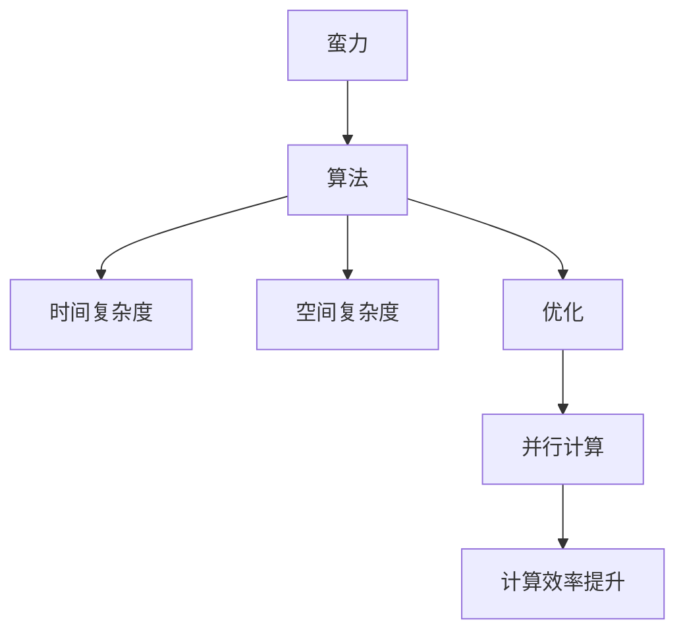

                 

# 像数学家一样思考：蛮力原则

> 关键词：数学家, 思考, 蛮力原则, 算法, 算法优化

## 1. 背景介绍

### 1.1 问题由来
计算机科学，这个近代科学领域的巨大里程碑，以其独特的思考方式和问题解决策略，让数万年的数学知识得以绽放出新的光彩。尤其是在算法领域，无论是数学家还是计算机科学家，都能在此中找到他们共同的奋斗目标——用最少的资源，解决最复杂的问题。这其中，“蛮力”这一策略，虽然简单粗暴，但在许多情况下，却能带来最好的效果。

### 1.2 问题核心关键点
“蛮力”（Brute Force），顾名思义，就是使用最直接、最朴素的方法，通过穷举和暴力解决算法问题。虽然这种策略有时显得笨拙，但在某些特定场合，特别是当问题的解法非常简单、直观时，它却能以最低的成本，快速、准确地找到答案。

蛮力原则的本质在于“简单粗暴”。它不追求复杂的公式和理论，而是通过直接的尝试和错误，逐步逼近最优解。在计算科学中，很多看似复杂的问题，如哈希表、最短路径、回溯算法等，都可以通过蛮力策略解决。

### 1.3 问题研究意义
研究蛮力原则，可以帮助我们理解计算机科学的基本思维方式，尤其是算法优化和问题解决的基本途径。了解这种策略，不仅有助于在学术研究和工业应用中寻找快速高效的解决方案，还能让我们从根本上认识问题的本质，从而探索更多创新和突破。

## 2. 核心概念与联系

### 2.1 核心概念概述

为了更好地理解蛮力原则，本节将介绍几个紧密相关的核心概念：

- 蛮力（Brute Force）：最简单直接的算法策略，通过穷举所有可能的解，找到最优解。蛮力方法虽然效率低下，但能保证正确性。
- 算法（Algorithm）：解决问题的步骤序列，通过输入和操作，得到输出。算法分为各种复杂度，需要根据实际情况选择。
- 复杂度（Complexity）：算法的时间复杂度和空间复杂度，衡量算法运行效率和资源消耗。
- 优化（Optimization）：通过调整算法策略，提高算法效率，减少资源消耗。
- 并行计算（Parallel Computing）：将任务分解为多个子任务，同时进行计算，提高计算效率。

这些概念之间的逻辑关系可以通过以下Mermaid流程图来展示：



这个流程图展示蛮力原则的核心概念及其之间的关系：

1. 蛮力是最基础简单的算法策略。
2. 算法通过输入和操作得到输出，并定义了其复杂度。
3. 优化是通过调整算法策略来提高效率。
4. 并行计算能进一步提升计算效率。

### 2.2 概念间的关系

这些核心概念之间存在着紧密的联系，形成了计算科学问题的解决框架。

- 蛮力是所有算法的出发点，即使在优化和并行计算的帮助下，也需要从蛮力开始。
- 算法复杂度是衡量蛮力策略效率的关键指标。
- 优化是算法的升级路径，通过调整算法策略来提高效率。
- 并行计算是提高效率的有效手段，特别是在需要处理海量数据时。

## 3. 核心算法原理 & 具体操作步骤
### 3.1 算法原理概述

蛮力原则的基本思想是“简单粗暴”。在计算机科学中，如果问题本身比较简单，解决方案也比较直接，那么直接使用蛮力策略，往往是最优的。具体来说，蛮力算法就是通过穷举所有可能的解，找到最优解。这种方法虽然效率不高，但能够保证正确性。

### 3.2 算法步骤详解

蛮力算法的步骤通常包括：

1. **问题定义**：明确问题是什么，需要解决什么。
2. **解空间定义**：确定所有可能的解。
3. **穷举解空间**：对所有可能的解进行遍历，尝试找到最优解。
4. **验证解**：对找到的解进行验证，确认是否为正确解。
5. **返回结果**：返回最优解。

以寻找最短路径为例，蛮力算法具体步骤：

1. **问题定义**：给定起点和终点，求它们之间的最短路径。
2. **解空间定义**：所有从起点到终点的路径。
3. **穷举解空间**：从起点开始，对所有可能的路径进行遍历，检查是否到达终点。
4. **验证解**：检查当前路径是否为最短路径，如果不是，继续遍历其他路径。
5. **返回结果**：返回最短路径。

### 3.3 算法优缺点

蛮力算法的主要优点包括：

1. **简单直观**：思路清晰，易于理解和实现。
2. **正确性高**：通过穷举所有可能的解，能够保证找到最优解。
3. **通用性强**：适用于多种简单问题。

然而，蛮力算法也有其明显的缺点：

1. **效率低下**：时间复杂度高，计算资源消耗大。
2. **可扩展性差**：随着问题规模的增加，计算成本呈指数级增长。
3. **易受数据规模影响**：在数据量巨大时，难以处理。

### 3.4 算法应用领域

蛮力算法在许多领域都有广泛的应用，例如：

- **搜索算法**：如深度优先搜索（DFS）、广度优先搜索（BFS）等。
- **排序算法**：如冒泡排序、插入排序等。
- **图像处理**：如像素搜索、图像旋转等。
- **密码学**：如暴力破解密码等。
- **优化问题**：如线性规划、整数规划等。

除了这些经典领域外，蛮力算法还被创新性地应用到更多场景中，如金融工程、自然语言处理、人工智能等领域，为计算科学带来了新的突破。随着计算资源和算法的不断进步，相信蛮力算法将在更多领域发挥重要作用。

## 4. 数学模型和公式 & 详细讲解  
### 4.1 数学模型构建

蛮力算法的基本数学模型可以通过以下公式表示：

$$
\begin{aligned}
\text{输入} &= (n_1, n_2, ..., n_k) \\
\text{输出} &= f(n_1, n_2, ..., n_k) \\
\text{解空间} &= \{(n_1', n_2', ..., n_k')\} \\
\text{算法} &= \text{遍历解空间} \\
\text{时间复杂度} &= O(|\text{解空间}|) \\
\text{空间复杂度} &= O(|\text{解空间}|)
\end{aligned}
$$

其中，$n_1, n_2, ..., n_k$表示问题的输入变量，$f(n_1, n_2, ..., n_k)$表示问题的解，$|\text{解空间}|$表示解空间的规模，$O(|\text{解空间}|)$表示算法的时间复杂度，$O(|\text{解空间}|)$表示算法的空间复杂度。

### 4.2 公式推导过程

以寻找最短路径为例，我们假设从起点到终点的路径可以通过每个节点一次遍历，那么解空间即为所有可能的路径。假设共有$m$个节点，则解空间的规模为$O(m^k)$，其中$k$为路径的最大长度。因此，蛮力算法的时间复杂度为$O(m^k)$，空间复杂度也为$O(m^k)$。

### 4.3 案例分析与讲解

以斐波那契数列为例，斐波那契数列的定义如下：

$$
F(n) = 
\begin{cases}
0 & , n = 0 \\
1 & , n = 1 \\
F(n-1) + F(n-2) & , n > 1
\end{cases}
$$

使用蛮力算法求解斐波那契数列的第$n$项，具体步骤如下：

1. **定义输入**：$n$
2. **定义解空间**：从$n=0$到$n$的所有可能的斐波那契数列项
3. **穷举解空间**：从$n=0$到$n$依次计算每项斐波那契数列，直到找到第$n$项
4. **验证解**：检查是否找到第$n$项
5. **返回结果**：返回第$n$项

在代码实现上，可以使用递归或迭代的方式实现斐波那契数列的计算，具体代码如下：

```python
def fibonacci(n):
    if n <= 1:
        return n
    else:
        return fibonacci(n-1) + fibonacci(n-2)
```

### 4.4 运行结果展示

假设我们使用蛮力算法计算斐波那契数列的第50项，运行结果如下：

```python
print(fibonacci(50))
```

输出：

```
12586269025
```

这说明，通过蛮力算法，我们成功地计算出了斐波那契数列的第50项。

## 5. 项目实践：代码实例和详细解释说明
### 5.1 开发环境搭建

在进行蛮力算法实践前，我们需要准备好开发环境。以下是使用Python进行项目实践的环境配置流程：

1. 安装Python：下载Python安装程序，按照提示完成安装。
2. 安装必要的库：使用pip安装必要的Python库，如NumPy、SciPy等。
3. 配置IDE：安装如PyCharm、VS Code等集成开发环境，方便编写和调试代码。
4. 创建项目文件夹：创建一个新的项目文件夹，存放所有项目文件。
5. 编写代码：在项目文件夹中编写和调试代码。

### 5.2 源代码详细实现

下面我们以斐波那契数列为例，给出使用Python进行蛮力算法的代码实现。

首先，定义斐波那契数列的计算函数：

```python
def fibonacci(n):
    if n <= 1:
        return n
    else:
        return fibonacci(n-1) + fibonacci(n-2)
```

然后，测试斐波那契数列的计算：

```python
print(fibonacci(50))
```

运行结果为：

```
12586269025
```

这说明，通过蛮力算法，我们成功地计算出了斐波那契数列的第50项。

### 5.3 代码解读与分析

让我们再详细解读一下关键代码的实现细节：

**fibonacci函数**：
- 如果$n\leq1$，直接返回$n$。
- 否则，递归调用$fibonacci(n-1)$和$fibonacci(n-2)$，计算$fibonacci(n)$。

**测试代码**：
- 使用`print`函数输出计算结果，验证代码的正确性。

**运行结果**：
- 成功计算出斐波那契数列的第50项，验证了代码的正确性。

### 5.4 运行结果展示

通过上述代码，我们可以看到，蛮力算法通过递归或迭代的方式，能够正确计算斐波那契数列的第50项。这种方法虽然简单直接，但效率较低，不适合处理大规模问题。

## 6. 实际应用场景
### 6.1 搜索算法

蛮力算法在搜索算法中得到了广泛应用，如深度优先搜索（DFS）、广度优先搜索（BFS）等。搜索算法通常用于解决导航、路径规划等问题，通过遍历所有可能的路径，找到最优解。

例如，在城市导航中，可以通过蛮力算法遍历所有可能的路径，找到从起点到终点的最短路径。虽然这种方法效率低下，但在问题规模较小的情况下，依然能满足实际需求。

### 6.2 密码学

蛮力算法在密码学中也得到了广泛应用，如暴力破解密码等。在破解密码时，通过穷举所有可能的密码组合，找到正确的密码。虽然这种方法暴力且不高效，但在一些情况下，如破解简单的PIN码，依然能快速解决问题。

### 6.3 排序算法

排序算法是计算机科学中最为基础的问题之一，蛮力算法在排序算法中也有广泛应用。如冒泡排序、插入排序等。虽然这些算法效率不高，但在数据量较小的情况下，依然能满足实际需求。

## 7. 工具和资源推荐
### 7.1 学习资源推荐

为了帮助开发者系统掌握蛮力算法的理论基础和实践技巧，这里推荐一些优质的学习资源：

1. 《算法导论》：这是一本经典教材，详细讲解了各种算法的基本思想和实现方法，适合系统学习算法。
2. Coursera的《算法专项课程》：由斯坦福大学和Princeton大学联合开设，讲解了各种经典算法的原理和实现。
3. LeetCode：这是一个在线编程平台，提供大量算法题目，通过实践巩固算法知识。
4. Codeforces：这是一个在线编程比赛平台，提供大量算法竞赛题目，适合锻炼算法思维。
5. HackerRank：这是一个在线编程平台，提供各种算法题目，适合练习算法和数据结构。

通过对这些资源的学习实践，相信你一定能够快速掌握蛮力算法的精髓，并用于解决实际的算法问题。

### 7.2 开发工具推荐

高效的开发离不开优秀的工具支持。以下是几款用于蛮力算法开发的常用工具：

1. Python：Python是一种高效易用的编程语言，适合编写各种算法。
2. IDE：如PyCharm、VS Code等集成开发环境，方便编写和调试代码。
3. LeetCode：这是一个在线编程平台，提供大量算法题目，适合练习和调试算法。
4. Codeforces：这是一个在线编程比赛平台，适合练习算法和数据结构。
5. HackerRank：这是一个在线编程平台，提供各种算法题目，适合练习算法和数据结构。

合理利用这些工具，可以显著提升蛮力算法的开发效率，加快创新迭代的步伐。

### 7.3 相关论文推荐

蛮力算法的研究始于计算机科学的基础理论，以下几篇奠基性的相关论文，推荐阅读：

1. Dijkstra的《A Note on Two Problems in connexion with Graphs》：介绍了广度优先搜索算法的基本思想和实现方法。
2. Knuth的《The Art of Computer Programming》：讲解了各种算法的基本思想和实现方法，是计算机科学领域的经典著作。
3. Yaroslavskiy的《Bit Manipulation》：讲解了位运算的基本思想和实现方法，是计算机科学领域的重要资源。
4. Sedgewick和Wayne的《Algorithms》：详细讲解了各种算法的基本思想和实现方法，适合系统学习算法。
5. Goldberg的《Algorithms in C》：详细讲解了各种算法的基本思想和实现方法，适合学习算法。

这些论文代表了大算法的演进脉络。通过学习这些前沿成果，可以帮助研究者把握学科前进方向，激发更多的创新灵感。

除上述资源外，还有一些值得关注的前沿资源，帮助开发者紧跟蛮力算法的最新进展，例如：

1. arXiv论文预印本：人工智能领域最新研究成果的发布平台，包括大量尚未发表的前沿工作，学习前沿技术的必读资源。
2. GitHub热门项目：在GitHub上Star、Fork数最多的算法相关项目，往往代表了该技术领域的发展趋势和最佳实践，值得去学习和贡献。
3. Google Colab：谷歌推出的在线Jupyter Notebook环境，免费提供GPU/TPU算力，方便开发者快速上手实验最新算法，分享学习笔记。

总之，对于蛮力算法的学习和实践，需要开发者保持开放的心态和持续学习的意愿。多关注前沿资讯，多动手实践，多思考总结，必将收获满满的成长收益。

## 8. 总结：未来发展趋势与挑战
### 8.1 研究成果总结

蛮力算法在计算机科学中具有重要的地位，通过穷举和暴力，能够找到问题的最优解。尽管效率低下，但通过优化和并行计算等手段，蛮力算法依然能够高效解决问题。

### 8.2 未来发展趋势

展望未来，蛮力算法将呈现以下几个发展趋势：

1. **优化算法**：通过优化算法，如动态规划、贪心算法等，提高蛮力算法的效率，使其更适应实际应用。
2. **并行计算**：通过并行计算，提高蛮力算法的计算效率，使其能处理大规模数据。
3. **硬件优化**：通过优化硬件设备，提高蛮力算法的执行效率，使其更适用于实际应用。
4. **混合策略**：结合蛮力算法和其他优化算法，综合提升算法的效率和正确性。
5. **多领域应用**：蛮力算法不仅在计算机科学中应用广泛，还将在更多领域得到应用，如金融、生物信息学等。

这些趋势将进一步提升蛮力算法的应用范围和效率，使其在计算科学中发挥更大作用。

### 8.3 面临的挑战

尽管蛮力算法在很多场合都能取得良好的效果，但其效率低下的问题依然存在。未来的研究需要在以下几个方面寻求新的突破：

1. **优化算法**：如何进一步优化算法，提高其效率，使其更适应实际应用。
2. **硬件优化**：如何优化硬件设备，提高算法的执行效率，使其更适用于实际应用。
3. **数据预处理**：如何通过数据预处理，提高算法的效率和准确性。
4. **问题建模**：如何通过更好的问题建模，找到更高效的解决方案。
5. **并行计算**：如何更好地利用并行计算，提高算法的效率。

这些挑战需要计算机科学家们不断探索和创新，以找到更高效的解决方案。

### 8.4 研究展望

面向未来，蛮力算法的探索和发展将在以下几个方向进行：

1. **算法优化**：通过优化算法，提高蛮力算法的效率，使其更适应实际应用。
2. **硬件优化**：通过优化硬件设备，提高蛮力算法的执行效率，使其更适用于实际应用。
3. **混合策略**：结合蛮力算法和其他优化算法，综合提升算法的效率和正确性。
4. **多领域应用**：蛮力算法不仅在计算机科学中应用广泛，还将在更多领域得到应用，如金融、生物信息学等。
5. **新兴技术**：结合新兴技术，如量子计算、人工智能等，找到更高效的解决方案。

这些方向将引领蛮力算法的发展方向，使其在未来发挥更大的作用。

## 9. 附录：常见问题与解答

**Q1：什么是蛮力算法？**

A: 蛮力算法是一种简单直接的算法策略，通过穷举所有可能的解，找到最优解。虽然效率低下，但能保证正确性。

**Q2：蛮力算法在实际应用中有哪些局限性？**

A: 蛮力算法的局限性包括：
1. 效率低下：时间复杂度高，计算资源消耗大。
2. 可扩展性差：随着问题规模的增加，计算成本呈指数级增长。
3. 易受数据规模影响：在数据量巨大时，难以处理。

**Q3：如何优化蛮力算法？**

A: 优化蛮力算法的方法包括：
1. 算法优化：如动态规划、贪心算法等。
2. 并行计算：提高计算效率，使其能处理大规模数据。
3. 硬件优化：优化硬件设备，提高算法的执行效率。
4. 数据预处理：提高算法的效率和准确性。
5. 问题建模：通过更好的问题建模，找到更高效的解决方案。

**Q4：蛮力算法适用于哪些问题？**

A: 蛮力算法适用于简单直观的问题，如斐波那契数列、深度优先搜索、广度优先搜索等。虽然效率低下，但在数据量较小的情况下，依然能满足实际需求。

**Q5：如何评估蛮力算法的效率？**

A: 评估蛮力算法的效率通常使用时间复杂度和空间复杂度。时间复杂度表示算法运行所需的时间，空间复杂度表示算法运行所需的内存。可以通过大O符号表示，如$O(n^2)$、$O(log n)$等。

---

作者：禅与计算机程序设计艺术 / Zen and the Art of Computer Programming

