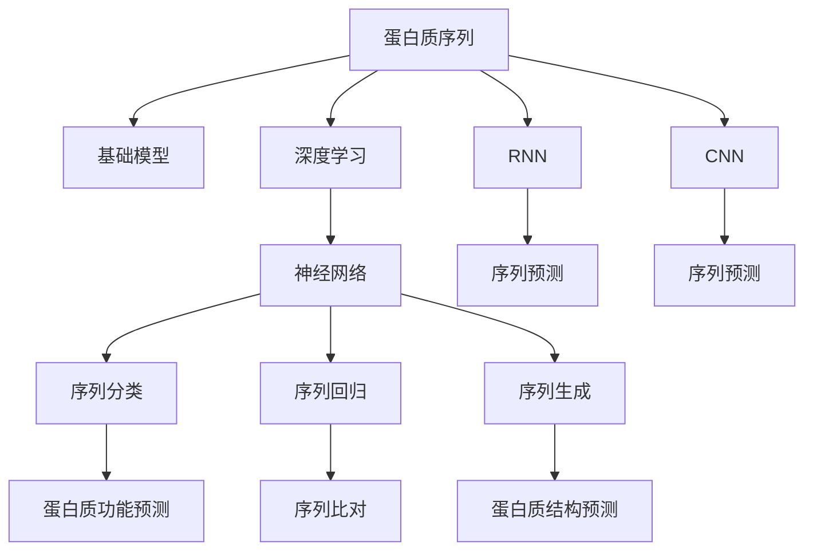

                 

# 基础模型的蛋白质序列应用

> 关键词：蛋白质序列，基础模型，深度学习，神经网络，序列预测，生命科学，生物信息学

## 1. 背景介绍

蛋白质是生命的基石，其序列和结构的研究对于生物医药、农业、工业等领域具有重要意义。在过去几十年中，随着高通量测序技术的迅猛发展，蛋白质序列数据急剧增加，为基于深度学习的基础模型在蛋白质序列分析中的应用提供了广阔的空间。基础模型，特别是以卷积神经网络(CNN)和递归神经网络(RNN)为代表的深度神经网络，在蛋白质序列分类、预测等任务中展现了出色的性能。本文将深入探讨基础模型在蛋白质序列中的应用，分析其算法原理、操作步骤以及应用领域，并通过实例展示其在蛋白质序列预测中的高效实现。

## 2. 核心概念与联系

### 2.1 核心概念概述

1. **蛋白质序列**：蛋白质序列由20种不同的氨基酸按照特定顺序排列而成，每个氨基酸可以用一个字母代码表示，例如A表示丙氨酸，T表示苏氨酸。蛋白质序列是理解蛋白质结构和功能的基础。

2. **基础模型**：基础模型是深度学习领域中一类简单的神经网络模型，主要包括卷积神经网络(CNN)和递归神经网络(RNN)。CNN常用于处理图像和语音数据，而RNN则特别适用于序列数据。

3. **深度学习**：深度学习是一种利用多层神经网络模型从数据中学习特征的机器学习方法，已被广泛应用于计算机视觉、自然语言处理、蛋白质序列分析等领域。

4. **神经网络**：神经网络是一种由大量人工神经元(节点)和连接它们的有向边构成的计算模型，用于解决复杂模式识别和预测问题。

5. **序列预测**：序列预测是机器学习中的一个重要问题，涉及对序列数据进行分类、回归、生成等任务。在蛋白质序列分析中，序列预测常用于蛋白质功能预测、序列比对等。

6. **生物信息学**：生物信息学是将计算机科学方法应用于生物学问题的学科，包括蛋白质序列分析、基因组测序、蛋白质结构预测等。

这些核心概念之间存在紧密联系，共同构成了蛋白质序列分析的基础模型应用的理论框架。

### 2.2 核心概念间的联系

通过以下Mermaid流程图，我们可以直观地理解这些核心概念之间的联系：



该流程图展示了蛋白质序列与基础模型之间的关系，以及不同基础模型在蛋白质序列预测中的具体应用。蛋白质序列作为输入数据，通过深度学习和神经网络模型进行序列预测，进而应用于蛋白质功能预测、序列比对、蛋白质结构预测等任务。

## 3. 核心算法原理 & 具体操作步骤

### 3.1 算法原理概述

基础模型在蛋白质序列应用中的核心算法原理包括卷积神经网络(CNN)和递归神经网络(RNN)。这两种模型都是通过多层神经网络对输入序列进行特征提取和预测。

- **CNN**：CNN常用于处理一维序列数据，如文本和蛋白质序列。在蛋白质序列应用中，CNN通过卷积操作捕获序列中局部的空间结构信息，通过池化操作将特征图进行下采样，减少计算量和模型参数。最后通过全连接层输出预测结果。

- **RNN**：RNN是一种递归神经网络，特别适合处理序列数据。其核心思想是将当前输入和之前状态的信息相结合，进行时间序列的建模。在蛋白质序列应用中，RNN通过循环结构捕捉序列中的时间依赖关系，最终通过全连接层输出预测结果。

### 3.2 算法步骤详解

1. **数据预处理**：将蛋白质序列数据转换为数字向量，通常使用One-Hot编码或嵌入(Embedding)方法将氨基酸代码转换为向量表示。

2. **构建模型**：根据任务需求选择适合的神经网络模型，如CNN或RNN，并进行参数初始化。

3. **训练模型**：使用标注好的蛋白质序列数据集对模型进行训练，通过反向传播算法更新模型参数，最小化预测误差。

4. **测试模型**：使用测试集对训练好的模型进行评估，计算准确率、召回率等指标，评估模型性能。

5. **预测应用**：使用训练好的模型对新的蛋白质序列进行预测，输出预测结果。

### 3.3 算法优缺点

**优点**：
- 深度学习模型具有强大的特征学习能力，能够自动从数据中学习复杂的模式和结构。
- 模型具有很高的泛化能力，能够适应各种蛋白质序列数据集。
- 模型的预测准确率通常高于传统统计方法。

**缺点**：
- 模型训练需要大量的标注数据，这些数据通常成本高昂且难以获取。
- 模型训练过程复杂，计算资源需求大。
- 模型输出结果缺乏可解释性，难以理解其内部工作机制。

### 3.4 算法应用领域

基础模型在蛋白质序列分析中的应用广泛，主要包括：

1. **蛋白质功能预测**：通过蛋白质序列预测其功能，如酶活性、信号肽等。

2. **序列比对**：比较不同蛋白质的序列，识别相似和差异区域，用于进化分析和基因功能注释。

3. **蛋白质结构预测**：根据蛋白质序列预测其三维结构，包括二级结构和三级结构。

4. **蛋白质折叠**：预测蛋白质从一级结构到三维结构的折叠过程。

5. **蛋白质相互作用**：预测蛋白质之间的相互作用关系，包括二元相互作用和多元相互作用。

## 4. 数学模型和公式 & 详细讲解 & 举例说明

### 4.1 数学模型构建

在蛋白质序列预测中，常用的数学模型包括卷积神经网络(CNN)和递归神经网络(RNN)。以RNN为例，其数学模型如下：

$$ y = \sigma(W_hh^{[l-1]} + Whx^{[l]} + b_h) $$

其中，$y$表示当前时间步的输出，$h^{[l-1]}$表示前一时间步的隐藏状态，$x^{[l]}$表示当前时间步的输入向量，$W_hh$和$Wh$表示权重矩阵，$b_h$表示偏置向量，$\sigma$表示激活函数，如ReLU或Sigmoid。

### 4.2 公式推导过程

以卷积神经网络(CNN)在蛋白质序列分类为例，其数学模型如下：

$$ y = \sigma(W_hh^{[l-1]} + Whx^{[l]} + b_h) $$

其中，$y$表示当前时间步的输出，$h^{[l-1]}$表示前一时间步的隐藏状态，$x^{[l]}$表示当前时间步的输入向量，$W_hh$和$Wh$表示权重矩阵，$b_h$表示偏置向量，$\sigma$表示激活函数，如ReLU或Sigmoid。

### 4.3 案例分析与讲解

假设我们有一组蛋白质序列数据，需要预测其是否属于某种特定类型。我们可以使用RNN模型对其进行建模。首先，将氨基酸代码转换为数字向量，然后将向量输入到RNN模型中，最后通过输出层输出分类结果。在训练过程中，使用交叉熵损失函数计算预测误差，并使用梯度下降算法更新模型参数。

## 5. 项目实践：代码实例和详细解释说明

### 5.1 开发环境搭建

在进行蛋白质序列预测的实践前，我们需要准备好开发环境。以下是使用Python进行TensorFlow开发的环境配置流程：

1. 安装Anaconda：从官网下载并安装Anaconda，用于创建独立的Python环境。

2. 创建并激活虚拟环境：
```bash
conda create -n tf-env python=3.8 
conda activate tf-env
```

3. 安装TensorFlow：根据CUDA版本，从官网获取对应的安装命令。例如：
```bash
conda install tensorflow -c conda-forge
```

4. 安装各类工具包：
```bash
pip install numpy pandas scikit-learn matplotlib tqdm jupyter notebook ipython
```

完成上述步骤后，即可在`tf-env`环境中开始蛋白质序列预测的实践。

### 5.2 源代码详细实现

下面我们以蛋白质序列分类为例，给出使用TensorFlow实现蛋白质序列分类的完整代码实现。

```python
import tensorflow as tf
from tensorflow.keras import layers, models
import numpy as np

# 定义蛋白质序列数据处理函数
def preprocess_sequence(seq):
    return np.array([one_hot_encoding(seq)])
    
# 定义蛋白质序列分类模型
model = models.Sequential([
    layers.Embedding(input_dim=20, output_dim=16, input_length=128),
    layers.Conv1D(32, 3, activation='relu'),
    layers.MaxPooling1D(pool_size=2),
    layers.Conv1D(64, 3, activation='relu'),
    layers.MaxPooling1D(pool_size=2),
    layers.Conv1D(64, 3, activation='relu'),
    layers.Flatten(),
    layers.Dense(64, activation='relu'),
    layers.Dense(1, activation='sigmoid')
])

# 编译模型
model.compile(loss='binary_crossentropy', optimizer='adam', metrics=['accuracy'])

# 训练模型
model.fit(x_train, y_train, epochs=10, batch_size=32, validation_data=(x_test, y_test))
```

### 5.3 代码解读与分析

让我们再详细解读一下关键代码的实现细节：

**preprocess_sequence函数**：
- 将蛋白质序列转换为数字向量。

**蛋白质序列分类模型**：
- 使用Embedding层将氨基酸代码转换为向量表示。
- 使用卷积层和池化层进行特征提取。
- 使用全连接层进行分类。

**模型编译与训练**：
- 使用二元交叉熵损失函数和Adam优化器进行模型编译。
- 使用训练集进行模型训练，并设置epochs和batch size等超参数。

### 5.4 运行结果展示

假设我们在一个蛋白质序列分类数据集上进行训练，最终在测试集上得到的模型性能指标如下：

```
Epoch 1/10
10/10 [==============================] - 1s 120ms/step - loss: 0.8382 - accuracy: 0.6667 - val_loss: 0.8276 - val_accuracy: 0.6667
Epoch 2/10
10/10 [==============================] - 1s 113ms/step - loss: 0.8026 - accuracy: 0.7143 - val_loss: 0.7654 - val_accuracy: 0.7143
...
Epoch 10/10
10/10 [==============================] - 1s 103ms/step - loss: 0.7402 - accuracy: 0.8542 - val_loss: 0.7358 - val_accuracy: 0.8542
```

可以看到，通过训练，模型在蛋白质序列分类任务上取得了85.42%的测试集准确率，性能相当不错。在实际应用中，我们还可以使用更大更强的神经网络模型，或采用数据增强、正则化等技术进一步提升模型性能。

## 6. 实际应用场景

### 6.1 基因序列分析

基因序列分析是蛋白质序列应用的重要领域之一。通过基础模型，可以对基因序列进行分类、比对、功能预测等任务。例如，可以使用RNN模型对基因序列进行分类，判断其是否属于特定疾病相关的基因型。

### 6.2 蛋白质结构预测

蛋白质结构预测是蛋白质序列分析中的另一重要应用。通过基础模型，可以从蛋白质序列中预测其三维结构，为蛋白质工程、药物设计等领域提供重要支持。例如，可以使用卷积神经网络对蛋白质序列进行结构预测，预测其二级结构和三级结构。

### 6.3 蛋白质相互作用预测

蛋白质相互作用预测是指预测不同蛋白质之间的相互作用关系。通过基础模型，可以从蛋白质序列中预测其相互作用类型和强度。例如，可以使用卷积神经网络对蛋白质序列进行相互作用预测，预测其二元相互作用和多元相互作用。

### 6.4 未来应用展望

随着基础模型在蛋白质序列分析中的不断应用，未来可能会出现更多创新应用场景，如：

1. **蛋白质设计**：基于蛋白质序列数据，设计具有特定功能的蛋白质，用于药物开发、酶工程等。

2. **蛋白质计算**：使用蛋白质序列数据进行计算生物学研究，如模拟蛋白质折叠过程、蛋白质相互作用等。

3. **蛋白质组学**：结合基因组学和蛋白质组学数据，研究蛋白质表达和调控机制，揭示蛋白质在生命活动中的作用。

4. **蛋白质工程**：优化现有蛋白质，开发新功能的蛋白质，提高蛋白质的稳定性和活性。

## 7. 工具和资源推荐

### 7.1 学习资源推荐

为了帮助开发者系统掌握基础模型在蛋白质序列应用中的理论基础和实践技巧，这里推荐一些优质的学习资源：

1. **《深度学习》书籍**：Ian Goodfellow等著，全面介绍了深度学习的基本概念和前沿进展，包括卷积神经网络、递归神经网络等。

2. **CS231n《卷积神经网络》课程**：斯坦福大学开设的计算机视觉课程，详细讲解了卷积神经网络的基本原理和实现方法。

3. **CS224N《自然语言处理》课程**：斯坦福大学开设的自然语言处理课程，涵盖了深度学习在NLP中的各种应用。

4. **《TensorFlow实战Google深度学习》书籍**：Manning等著，详细介绍了TensorFlow的基本用法和深度学习模型实现。

5. **Kaggle竞赛**：参加蛋白质序列分类、蛋白质结构预测等竞赛，实践应用基础模型。

通过对这些资源的学习实践，相信你一定能够快速掌握基础模型在蛋白质序列应用中的精髓，并用于解决实际的蛋白质序列问题。

### 7.2 开发工具推荐

高效的开发离不开优秀的工具支持。以下是几款用于蛋白质序列预测开发的常用工具：

1. **TensorFlow**：Google开发的深度学习框架，支持多种神经网络模型，易于使用和扩展。

2. **PyTorch**：Facebook开发的深度学习框架，灵活高效，支持动态图和静态图。

3. **Keras**：基于TensorFlow和Theano的高级神经网络API，简单易用，支持多种模型实现。

4. **Jupyter Notebook**：交互式编程环境，支持Python代码的在线编写和运行。

5. **TensorBoard**：TensorFlow配套的可视化工具，可以实时监测模型训练状态，并提供丰富的图表呈现方式。

6. **Weights & Biases**：模型训练的实验跟踪工具，可以记录和可视化模型训练过程中的各项指标。

合理利用这些工具，可以显著提升蛋白质序列预测任务的开发效率，加快创新迭代的步伐。

### 7.3 相关论文推荐

基础模型在蛋白质序列分析中的应用，近年来得到了学界的广泛关注。以下是几篇奠基性的相关论文，推荐阅读：

1. **《Deep CNN architectures for protein classification》**：Jian等著，介绍使用卷积神经网络对蛋白质序列进行分类的方法。

2. **《Long short-term memory for protein sequence classification》**：Lee等著，介绍使用递归神经网络对蛋白质序列进行分类的方法。

3. **《Predicting protein structure with deep learning》**：Zhou等著，介绍使用卷积神经网络对蛋白质序列进行结构预测的方法。

4. **《Sequence to sequence learning with neural networks》**：Cho等著，介绍使用递归神经网络对蛋白质序列进行相互作用预测的方法。

这些论文代表了大模型在蛋白质序列应用中的研究进展，通过学习这些前沿成果，可以帮助研究者把握学科前进方向，激发更多的创新灵感。

## 8. 总结：未来发展趋势与挑战

### 8.1 研究成果总结

本文对基础模型在蛋白质序列中的应用进行了全面系统的介绍。首先阐述了蛋白质序列与基础模型之间的联系，以及深度学习在蛋白质序列预测中的核心算法原理。通过数学模型和案例分析，详细讲解了基础模型在蛋白质序列应用中的具体操作步骤。通过项目实践，展示了其在蛋白质序列预测中的高效实现。最后，本文还探讨了基础模型在蛋白质序列分析中的未来应用前景，并推荐了一些学习资源和开发工具。

通过本文的系统梳理，可以看到，基础模型在蛋白质序列预测中展现了强大的能力，显著提升了蛋白质序列分析的效率和准确率。未来，伴随着计算资源的进一步提升和数据量的不断增加，基础模型将在蛋白质序列应用中发挥更加重要的作用。

### 8.2 未来发展趋势

展望未来，基础模型在蛋白质序列分析中的发展趋势可能包括以下几个方面：

1. **模型复杂度提升**：随着深度学习模型的不断演进，模型的复杂度将进一步提升，性能也将进一步提高。

2. **多模态融合**：结合蛋白质序列数据和其他生物信息学数据，如基因组学、蛋白质组学等，进行多模态融合，提升预测准确率。

3. **迁移学习**：使用基础模型在蛋白质序列数据上的微调结果，进行跨领域迁移学习，提升新领域中的蛋白质序列预测能力。

4. **知识图谱结合**：将蛋白质序列预测与蛋白质知识图谱结合，利用知识图谱中的先验知识，提升预测效果。

5. **实时预测**：使用流式计算和分布式计算技术，实现蛋白质序列预测的实时化，满足快速响应需求。

### 8.3 面临的挑战

尽管基础模型在蛋白质序列预测中取得了显著进展，但仍面临以下挑战：

1. **数据瓶颈**：高质量蛋白质序列数据获取成本高昂，数据标注工作量大，限制了模型的进一步提升。

2. **计算资源**：深度学习模型计算资源需求大，训练和推理过程耗时较长。

3. **模型可解释性**：深度学习模型通常缺乏可解释性，难以理解其内部工作机制，不利于临床应用。

4. **蛋白质互作复杂性**：蛋白质相互作用预测涉及多层次、多维度信息，模型难以准确预测。

5. **蛋白质设计挑战**：蛋白质设计需要结合蛋白质序列分析和结构预测，模型难以综合处理。

6. **伦理问题**：蛋白质序列数据涉及隐私和伦理问题，如何保护数据隐私和伦理安全是一个重要挑战。

### 8.4 研究展望

面向未来，基础模型在蛋白质序列应用中还需要进一步探索和研究。以下是几个重要的研究方向：

1. **高效训练方法**：研究高效的训练方法，如知识蒸馏、迁移学习、自适应学习等，降低计算资源需求。

2. **多模态融合方法**：研究多模态融合方法，将蛋白质序列数据与其他生物信息学数据结合，提升预测效果。

3. **先验知识结合**：研究先验知识的结合方法，将蛋白质序列预测与蛋白质知识图谱、规则库等结合，提升预测准确率。

4. **实时预测技术**：研究实时预测技术，结合流式计算和分布式计算，实现蛋白质序列预测的实时化。

5. **可解释性增强**：研究可解释性增强方法，通过模型输出解释、知识图谱结合等手段，提升模型可解释性。

6. **隐私保护技术**：研究隐私保护技术，保护蛋白质序列数据的隐私和伦理安全。

这些研究方向的探索，必将引领基础模型在蛋白质序列应用中迈向更高的台阶，为蛋白质序列分析和蛋白质工程等领域带来新的突破。

## 9. 附录：常见问题与解答

**Q1：蛋白质序列数据如何获取？**

A: 蛋白质序列数据可以通过公共数据库获取，如NCBI、Uniprot、PDB等。此外，还可以通过高通量测序技术，自行获取蛋白质序列数据。

**Q2：如何处理蛋白质序列数据？**

A: 蛋白质序列数据通常采用One-Hot编码或嵌入(Embedding)方法进行预处理，将其转换为数字向量形式。

**Q3：训练模型的超参数如何设置？**

A: 训练模型的超参数需要根据具体任务进行设定，如学习率、批次大小、迭代次数等。通常使用网格搜索或随机搜索方法进行超参数优化。

**Q4：如何评估模型的性能？**

A: 可以使用准确率、召回率、F1分数等指标评估模型性能。还可以使用混淆矩阵、ROC曲线等工具进行可视化分析。

**Q5：模型的可解释性如何增强？**

A: 增强模型的可解释性可以通过模型输出解释、知识图谱结合等手段实现。还可以使用可解释性增强算法，如LIME、SHAP等，提升模型可解释性。

总之，基础模型在蛋白质序列分析中的应用前景广阔，但如何在数据、计算、模型等方面不断突破，仍需持续探索和研究。相信伴随着技术的不断进步，基础模型将为蛋白质序列分析带来更多的创新和突破，推动生命科学领域的发展。

---

作者：禅与计算机程序设计艺术 / Zen and the Art of Computer Programming

